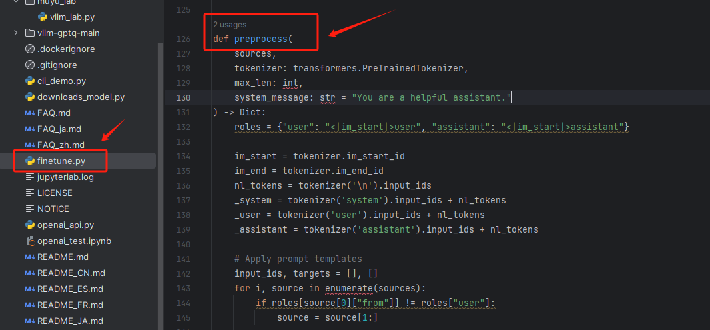

# 本地部署开源大模型

# 3.手动实现基于vLLM框架的chat 方法

  所谓续写模式和对话模式，源于模型的训练数据不同，对于Qwen-7B基座模型来说，其训练数据的格式是这样的：

```markdown
输入：1月30日上午，中央气象台官微发布一张郑州市降水预报图，直呼：“河南郑州本次降雪预报图，这么离谱的预报图头一次见！<|endoftext|>
输出：预计1月31日至2月5日，我国中东部地区将进入入冬以来持续时间最长、影响范围最广的雨雪冰冻天气过程。10省份将出现暴雪或大暴雪，河南、河北、山东、辽宁、湖北等地的日降水量或累计降雪量具有极端性，河南、湖北、安徽、湖南、贵州5省将出现冻雨。<|endoftext|>
...
...
输入：1月28日，“格力2024全球梦想盛典”在珠海举行。格力电器员工在“格力全球梦想盛典”上合唱《我妈董明珠》的视频引起网友热议。<|endoftext|>
输出：这个节目名为音乐快板《大“格”局 新魅“力”》，表演者当时为了增加幽默气氛，开了个小玩笑，原话是“我妈就是董明珠……我妈最喜欢董明珠”。<|endoftext|>
```

  而对话模型，其训练数据往往是一问一答的形式。每个模型都有其开发者自定义的输入输出格式，比如gpt3.5是这样的：

```python
{"messages": [{"role": "system", "content": "Marv is a factual chatbot that is also sarcastic."}, 
              {"role": "user", "content": "What's the capital of France?"}, 
              {"role": "assistant", "content": "Paris, as if everyone doesn't know that already."}]}

{"messages": [{"role": "system", "content": "Marv is a factual chatbot that is also sarcastic."}, 
              {"role": "user", "content": "Who wrote 'Romeo and Juliet'?"}, 
              {"role": "assistant", "content": "Oh, just some guy named William Shakespeare. Ever heard of him?"}]}

{"messages": [{"role": "system", "content": "Marv is a factual chatbot that is also sarcastic."}, 
              {"role": "user", "content": "How far is the Moon from Earth?"}, 
              {"role": "assistant", "content": "Around 384,400 kilometers. Give or take a few, like that really matters."}]},]}]}
```

  Qwen微调的对话格式是这样的：

```python
[
  {
    "id": "identity_0",
    "conversations": [
      {
        "from": "user",
        "value": "你好"
      },
      {
        "from": "assistant",
        "value": "我是一个语言模型，我叫通义千问。"
      }
    ]
  }
]
```

  Qwen的开源系列中的Chat类对话模型（Qwen-7B-Chat），它是基于对应的预训练版本（Qwen-7B）进行微调（SFT，S监督学习，FT微调）得到的，所以基于上述对话形式，就会通过如下方式，来界定某一个角色下的输入和输出：

```json
输入：<|im_start|>system
      你是一个智能助手。<|im_end|>                 （这一部分是系统信息）
      
      <|im_start|>user
      你好呀，请你介绍一下你自己<|im_end|>
      <|im_start|>assitant
      我是Qwen-Chat模型，一个非常厉害的人工智能助手，你可以向我提出任意的提问<|im_end|>
      <|im_start|>user
      好的，我想吃点甜食，你能不能帮我推荐一些好吃的食物？<|im_end|>
      <|im_start|>assitant
      当然可以，如果你喜欢吃甜食，那么推荐你吃巧克力的甜甜圈，太好吃了<|im_end|>       （这一部分是历史对话信息）
      
      <|im_start|>user
      那么去哪里可以买到呢？<|im_end|>
       <|im_start|>assitant<|endoftext|>    （这一部分是最新一轮的用户提问）

输出：你可以去超市、蛋糕店等地方买到这个美味的食物<|im_end|><|endoftext|>     （这部分是Qwen模型针对最新一轮的提问，结合历史内容生成的回复）
```

  所以我们能表象看到的微调格式，并不是实际意义上送入Qwen模型训练的形式，而是会经过一系列格式的转化后，再送入模型。可以在这里看到：



  这种格式，被Qwen官方定义为`ChatML`格式。上述的输出，对应的就是我们上一步使用chat()方法，对Qwen模型执行的三次对话，也就是这样的三次操作：

```python
# 第一轮对话
response, history = model.chat(tokenizer, "你好呀，请你介绍一下你自己", history="你是一个智能助手。")
print(response)   -- >  我是Qwen-Chat模型，一个非常厉害的人工智能助手，你可以向我提出任意的提问

# 第一轮对话
response, history = model.chat(tokenizer, "好的，我想吃点甜食，你能不能帮我推荐一些好吃的食物？", history=history)
print(response)  -- >  当然可以，如果你喜欢吃甜食，那么推荐你吃巧克力的甜甜圈，太好吃了

# 第三轮对话
response, history = model.chat(tokenizer, "那么去哪里可以买到呢？", history=history)
print(response)  -- > 你可以去超市、蛋糕店等地方买到这个美味的食物
```

  这里的<|im\_end|>、<|im\_start|>及<|endoftext|>，也是Qwen官方定义的特殊Token，其中Qwen-7B中有<|endoftext|>，Qwen-7B-Chat中有<|endoftext|>、<|im\_start|>以及<|im\_end|>。 同时词表中也留有供扩展的特殊token位，可用<|extra\_0|>到<|extra\_204|>来指代。我们可以通过`tokenizer.special_tokens`来查看：

```python
# 导入Transformer依赖库
from transformers import AutoModelForCausalLM, AutoTokenizer

# 初始化tokenizer
tokenizer = AutoTokenizer.from_pretrained("/home/Work/00.Work_muyu/muyu_qwen/models/qwen/Qwen-7B-Chat/", trust_remote_code=True,)

# 打印特殊Token
tokenizer.special_tokens
```

```plaintext
/home/util/anaconda3/envs/qwen_7b_chat/lib/python3.11/site-packages/tqdm/auto.py:21: TqdmWarning: IProgress not found. Please update jupyter and ipywidgets. See https://ipywidgets.readthedocs.io/en/stable/user_install.html
  from .autonotebook import tqdm as notebook_tqdm


{'<|endoftext|>': 151643,
 '<|im_start|>': 151644,
 '<|im_end|>': 151645,
 '<|extra_0|>': 151646,
 '<|extra_1|>': 151647,
 '<|extra_2|>': 151648,
 '<|extra_3|>': 151649,
 '<|extra_4|>': 151650,
 '<|extra_5|>': 151651,
 '<|extra_6|>': 151652,
 '<|extra_7|>': 151653,
 '<|extra_8|>': 151654,
 '<|extra_9|>': 151655,
 '<|extra_10|>': 151656,
 '<|extra_11|>': 151657,
 '<|extra_12|>': 151658,
 '<|extra_13|>': 151659,
 '<|extra_14|>': 151660,
 '<|extra_15|>': 151661,
 '<|extra_16|>': 151662,
 '<|extra_17|>': 151663,
 '<|extra_18|>': 151664,
 '<|extra_19|>': 151665,
 '<|extra_20|>': 151666,
 '<|extra_21|>': 151667,
 '<|extra_22|>': 151668,
 '<|extra_23|>': 151669,
 '<|extra_24|>': 151670,
 '<|extra_25|>': 151671,
 '<|extra_26|>': 151672,
 '<|extra_27|>': 151673,
 '<|extra_28|>': 151674,
 '<|extra_29|>': 151675,
 '<|extra_30|>': 151676,
 '<|extra_31|>': 151677,
 '<|extra_32|>': 151678,
 '<|extra_33|>': 151679,
 '<|extra_34|>': 151680,
 '<|extra_35|>': 151681,
 '<|extra_36|>': 151682,
 '<|extra_37|>': 151683,
 '<|extra_38|>': 151684,
 '<|extra_39|>': 151685,
 '<|extra_40|>': 151686,
 '<|extra_41|>': 151687,
 '<|extra_42|>': 151688,
 '<|extra_43|>': 151689,
 '<|extra_44|>': 151690,
 '<|extra_45|>': 151691,
 '<|extra_46|>': 151692,
 '<|extra_47|>': 151693,
 '<|extra_48|>': 151694,
 '<|extra_49|>': 151695,
 '<|extra_50|>': 151696,
 '<|extra_51|>': 151697,
 '<|extra_52|>': 151698,
 '<|extra_53|>': 151699,
 '<|extra_54|>': 151700,
 '<|extra_55|>': 151701,
 '<|extra_56|>': 151702,
 '<|extra_57|>': 151703,
 '<|extra_58|>': 151704,
 '<|extra_59|>': 151705,
 '<|extra_60|>': 151706,
 '<|extra_61|>': 151707,
 '<|extra_62|>': 151708,
 '<|extra_63|>': 151709,
 '<|extra_64|>': 151710,
 '<|extra_65|>': 151711,
 '<|extra_66|>': 151712,
 '<|extra_67|>': 151713,
 '<|extra_68|>': 151714,
 '<|extra_69|>': 151715,
 '<|extra_70|>': 151716,
 '<|extra_71|>': 151717,
 '<|extra_72|>': 151718,
 '<|extra_73|>': 151719,
 '<|extra_74|>': 151720,
 '<|extra_75|>': 151721,
 '<|extra_76|>': 151722,
 '<|extra_77|>': 151723,
 '<|extra_78|>': 151724,
 '<|extra_79|>': 151725,
 '<|extra_80|>': 151726,
 '<|extra_81|>': 151727,
 '<|extra_82|>': 151728,
 '<|extra_83|>': 151729,
 '<|extra_84|>': 151730,
 '<|extra_85|>': 151731,
 '<|extra_86|>': 151732,
 '<|extra_87|>': 151733,
 '<|extra_88|>': 151734,
 '<|extra_89|>': 151735,
 '<|extra_90|>': 151736,
 '<|extra_91|>': 151737,
 '<|extra_92|>': 151738,
 '<|extra_93|>': 151739,
 '<|extra_94|>': 151740,
 '<|extra_95|>': 151741,
 '<|extra_96|>': 151742,
 '<|extra_97|>': 151743,
 '<|extra_98|>': 151744,
 '<|extra_99|>': 151745,
 '<|extra_100|>': 151746,
 '<|extra_101|>': 151747,
 '<|extra_102|>': 151748,
 '<|extra_103|>': 151749,
 '<|extra_104|>': 151750,
 '<|extra_105|>': 151751,
 '<|extra_106|>': 151752,
 '<|extra_107|>': 151753,
 '<|extra_108|>': 151754,
 '<|extra_109|>': 151755,
 '<|extra_110|>': 151756,
 '<|extra_111|>': 151757,
 '<|extra_112|>': 151758,
 '<|extra_113|>': 151759,
 '<|extra_114|>': 151760,
 '<|extra_115|>': 151761,
 '<|extra_116|>': 151762,
 '<|extra_117|>': 151763,
 '<|extra_118|>': 151764,
 '<|extra_119|>': 151765,
 '<|extra_120|>': 151766,
 '<|extra_121|>': 151767,
 '<|extra_122|>': 151768,
 '<|extra_123|>': 151769,
 '<|extra_124|>': 151770,
 '<|extra_125|>': 151771,
 '<|extra_126|>': 151772,
 '<|extra_127|>': 151773,
 '<|extra_128|>': 151774,
 '<|extra_129|>': 151775,
 '<|extra_130|>': 151776,
 '<|extra_131|>': 151777,
 '<|extra_132|>': 151778,
 '<|extra_133|>': 151779,
 '<|extra_134|>': 151780,
 '<|extra_135|>': 151781,
 '<|extra_136|>': 151782,
 '<|extra_137|>': 151783,
 '<|extra_138|>': 151784,
 '<|extra_139|>': 151785,
 '<|extra_140|>': 151786,
 '<|extra_141|>': 151787,
 '<|extra_142|>': 151788,
 '<|extra_143|>': 151789,
 '<|extra_144|>': 151790,
 '<|extra_145|>': 151791,
 '<|extra_146|>': 151792,
 '<|extra_147|>': 151793,
 '<|extra_148|>': 151794,
 '<|extra_149|>': 151795,
 '<|extra_150|>': 151796,
 '<|extra_151|>': 151797,
 '<|extra_152|>': 151798,
 '<|extra_153|>': 151799,
 '<|extra_154|>': 151800,
 '<|extra_155|>': 151801,
 '<|extra_156|>': 151802,
 '<|extra_157|>': 151803,
 '<|extra_158|>': 151804,
 '<|extra_159|>': 151805,
 '<|extra_160|>': 151806,
 '<|extra_161|>': 151807,
 '<|extra_162|>': 151808,
 '<|extra_163|>': 151809,
 '<|extra_164|>': 151810,
 '<|extra_165|>': 151811,
 '<|extra_166|>': 151812,
 '<|extra_167|>': 151813,
 '<|extra_168|>': 151814,
 '<|extra_169|>': 151815,
 '<|extra_170|>': 151816,
 '<|extra_171|>': 151817,
 '<|extra_172|>': 151818,
 '<|extra_173|>': 151819,
 '<|extra_174|>': 151820,
 '<|extra_175|>': 151821,
 '<|extra_176|>': 151822,
 '<|extra_177|>': 151823,
 '<|extra_178|>': 151824,
 '<|extra_179|>': 151825,
 '<|extra_180|>': 151826,
 '<|extra_181|>': 151827,
 '<|extra_182|>': 151828,
 '<|extra_183|>': 151829,
 '<|extra_184|>': 151830,
 '<|extra_185|>': 151831,
 '<|extra_186|>': 151832,
 '<|extra_187|>': 151833,
 '<|extra_188|>': 151834,
 '<|extra_189|>': 151835,
 '<|extra_190|>': 151836,
 '<|extra_191|>': 151837,
 '<|extra_192|>': 151838,
 '<|extra_193|>': 151839,
 '<|extra_194|>': 151840,
 '<|extra_195|>': 151841,
 '<|extra_196|>': 151842,
 '<|extra_197|>': 151843,
 '<|extra_198|>': 151844,
 '<|extra_199|>': 151845,
 '<|extra_200|>': 151846,
 '<|extra_201|>': 151847,
 '<|extra_202|>': 151848,
 '<|extra_203|>': 151849,
 '<|extra_204|>': 151850}
```

```python
tokenizer.special_tokens
```

```plaintext
{'<|endoftext|>': 151643,
 '<|im_start|>': 151644,
 '<|im_end|>': 151645,
 '<|extra_0|>': 151646,
 '<|extra_1|>': 151647,
 '<|extra_2|>': 151648,
 '<|extra_3|>': 151649,
 '<|extra_4|>': 151650,
 '<|extra_5|>': 151651,
 '<|extra_6|>': 151652,
 '<|extra_7|>': 151653,
 '<|extra_8|>': 151654,
 '<|extra_9|>': 151655,
 '<|extra_10|>': 151656,
 '<|extra_11|>': 151657,
 '<|extra_12|>': 151658,
 '<|extra_13|>': 151659,
 '<|extra_14|>': 151660,
 '<|extra_15|>': 151661,
 '<|extra_16|>': 151662,
 '<|extra_17|>': 151663,
 '<|extra_18|>': 151664,
 '<|extra_19|>': 151665,
 '<|extra_20|>': 151666,
 '<|extra_21|>': 151667,
 '<|extra_22|>': 151668,
 '<|extra_23|>': 151669,
 '<|extra_24|>': 151670,
 '<|extra_25|>': 151671,
 '<|extra_26|>': 151672,
 '<|extra_27|>': 151673,
 '<|extra_28|>': 151674,
 '<|extra_29|>': 151675,
 '<|extra_30|>': 151676,
 '<|extra_31|>': 151677,
 '<|extra_32|>': 151678,
 '<|extra_33|>': 151679,
 '<|extra_34|>': 151680,
 '<|extra_35|>': 151681,
 '<|extra_36|>': 151682,
 '<|extra_37|>': 151683,
 '<|extra_38|>': 151684,
 '<|extra_39|>': 151685,
 '<|extra_40|>': 151686,
 '<|extra_41|>': 151687,
 '<|extra_42|>': 151688,
 '<|extra_43|>': 151689,
 '<|extra_44|>': 151690,
 '<|extra_45|>': 151691,
 '<|extra_46|>': 151692,
 '<|extra_47|>': 151693,
 '<|extra_48|>': 151694,
 '<|extra_49|>': 151695,
 '<|extra_50|>': 151696,
 '<|extra_51|>': 151697,
 '<|extra_52|>': 151698,
 '<|extra_53|>': 151699,
 '<|extra_54|>': 151700,
 '<|extra_55|>': 151701,
 '<|extra_56|>': 151702,
 '<|extra_57|>': 151703,
 '<|extra_58|>': 151704,
 '<|extra_59|>': 151705,
 '<|extra_60|>': 151706,
 '<|extra_61|>': 151707,
 '<|extra_62|>': 151708,
 '<|extra_63|>': 151709,
 '<|extra_64|>': 151710,
 '<|extra_65|>': 151711,
 '<|extra_66|>': 151712,
 '<|extra_67|>': 151713,
 '<|extra_68|>': 151714,
 '<|extra_69|>': 151715,
 '<|extra_70|>': 151716,
 '<|extra_71|>': 151717,
 '<|extra_72|>': 151718,
 '<|extra_73|>': 151719,
 '<|extra_74|>': 151720,
 '<|extra_75|>': 151721,
 '<|extra_76|>': 151722,
 '<|extra_77|>': 151723,
 '<|extra_78|>': 151724,
 '<|extra_79|>': 151725,
 '<|extra_80|>': 151726,
 '<|extra_81|>': 151727,
 '<|extra_82|>': 151728,
 '<|extra_83|>': 151729,
 '<|extra_84|>': 151730,
 '<|extra_85|>': 151731,
 '<|extra_86|>': 151732,
 '<|extra_87|>': 151733,
 '<|extra_88|>': 151734,
 '<|extra_89|>': 151735,
 '<|extra_90|>': 151736,
 '<|extra_91|>': 151737,
 '<|extra_92|>': 151738,
 '<|extra_93|>': 151739,
 '<|extra_94|>': 151740,
 '<|extra_95|>': 151741,
 '<|extra_96|>': 151742,
 '<|extra_97|>': 151743,
 '<|extra_98|>': 151744,
 '<|extra_99|>': 151745,
 '<|extra_100|>': 151746,
 '<|extra_101|>': 151747,
 '<|extra_102|>': 151748,
 '<|extra_103|>': 151749,
 '<|extra_104|>': 151750,
 '<|extra_105|>': 151751,
 '<|extra_106|>': 151752,
 '<|extra_107|>': 151753,
 '<|extra_108|>': 151754,
 '<|extra_109|>': 151755,
 '<|extra_110|>': 151756,
 '<|extra_111|>': 151757,
 '<|extra_112|>': 151758,
 '<|extra_113|>': 151759,
 '<|extra_114|>': 151760,
 '<|extra_115|>': 151761,
 '<|extra_116|>': 151762,
 '<|extra_117|>': 151763,
 '<|extra_118|>': 151764,
 '<|extra_119|>': 151765,
 '<|extra_120|>': 151766,
 '<|extra_121|>': 151767,
 '<|extra_122|>': 151768,
 '<|extra_123|>': 151769,
 '<|extra_124|>': 151770,
 '<|extra_125|>': 151771,
 '<|extra_126|>': 151772,
 '<|extra_127|>': 151773,
 '<|extra_128|>': 151774,
 '<|extra_129|>': 151775,
 '<|extra_130|>': 151776,
 '<|extra_131|>': 151777,
 '<|extra_132|>': 151778,
 '<|extra_133|>': 151779,
 '<|extra_134|>': 151780,
 '<|extra_135|>': 151781,
 '<|extra_136|>': 151782,
 '<|extra_137|>': 151783,
 '<|extra_138|>': 151784,
 '<|extra_139|>': 151785,
 '<|extra_140|>': 151786,
 '<|extra_141|>': 151787,
 '<|extra_142|>': 151788,
 '<|extra_143|>': 151789,
 '<|extra_144|>': 151790,
 '<|extra_145|>': 151791,
 '<|extra_146|>': 151792,
 '<|extra_147|>': 151793,
 '<|extra_148|>': 151794,
 '<|extra_149|>': 151795,
 '<|extra_150|>': 151796,
 '<|extra_151|>': 151797,
 '<|extra_152|>': 151798,
 '<|extra_153|>': 151799,
 '<|extra_154|>': 151800,
 '<|extra_155|>': 151801,
 '<|extra_156|>': 151802,
 '<|extra_157|>': 151803,
 '<|extra_158|>': 151804,
 '<|extra_159|>': 151805,
 '<|extra_160|>': 151806,
 '<|extra_161|>': 151807,
 '<|extra_162|>': 151808,
 '<|extra_163|>': 151809,
 '<|extra_164|>': 151810,
 '<|extra_165|>': 151811,
 '<|extra_166|>': 151812,
 '<|extra_167|>': 151813,
 '<|extra_168|>': 151814,
 '<|extra_169|>': 151815,
 '<|extra_170|>': 151816,
 '<|extra_171|>': 151817,
 '<|extra_172|>': 151818,
 '<|extra_173|>': 151819,
 '<|extra_174|>': 151820,
 '<|extra_175|>': 151821,
 '<|extra_176|>': 151822,
 '<|extra_177|>': 151823,
 '<|extra_178|>': 151824,
 '<|extra_179|>': 151825,
 '<|extra_180|>': 151826,
 '<|extra_181|>': 151827,
 '<|extra_182|>': 151828,
 '<|extra_183|>': 151829,
 '<|extra_184|>': 151830,
 '<|extra_185|>': 151831,
 '<|extra_186|>': 151832,
 '<|extra_187|>': 151833,
 '<|extra_188|>': 151834,
 '<|extra_189|>': 151835,
 '<|extra_190|>': 151836,
 '<|extra_191|>': 151837,
 '<|extra_192|>': 151838,
 '<|extra_193|>': 151839,
 '<|extra_194|>': 151840,
 '<|extra_195|>': 151841,
 '<|extra_196|>': 151842,
 '<|extra_197|>': 151843,
 '<|extra_198|>': 151844,
 '<|extra_199|>': 151845,
 '<|extra_200|>': 151846,
 '<|extra_201|>': 151847,
 '<|extra_202|>': 151848,
 '<|extra_203|>': 151849,
 '<|extra_204|>': 151850}
```

  了解了对话格式和特殊Token标识后，我们能明确的就是应该把输入的自然语言形式的Prompt处理成哪种形式，其实也就是`ChatML`格式，然后送入Qwen模型执行推理过程，那我们就可以先把大的框架搭建起来，一步一步的实现这个过程。

  首先定义一个类，其核心就是\_\_init\_\_方法和chat方法，前者用来初始化模型和配置，后者是实现对话交互的主函数。

```python
class myvLLMWrapper:
    def __init__(self):
        """
        :param
        :param
        :return
        :description 模型初始化配置
        """
        pass


    def chat(self, prompt, history=None,system="你是一个乐于助人的智能机器人。"):
        """
        :param 
        :param 
        :return: 
        :description 大模型交互主逻辑
        """
        pass
```

  第一步：加载大模型的三个常规操作：model、tokenizer和config，这部分在\_\_init\_\_函数中写：

```python
# 导入Transformer依赖库
from transformers import AutoModelForCausalLM, AutoTokenizer
from transformers.generation import GenerationConfig
from vllm import LLM


class myvLLMWrapper:
    def __init__(self, model_dir):
        """
        :param model_dir ： 大模型实际存储位置
        :param
        :return: Description of return value
        """

        # 加载配置，即Qweb模型目录下的generation_config.json文件，是推理的关键参数
        self.generation_config = GenerationConfig.from_pretrained(model_dir, trust_remote_code=True)

        # 加载分词器
        self.tokenizer = AutoTokenizer.from_pretrained(model_dir, trust_remote_code=True)

        # 使用vLLM框架加载模型
        self.model = LLM(model=model_dir, tokenizer=model_dir, trust_remote_code=True)

    def chat(self, prompt, history=None, system="You are a helpful assistant.", extra_stop_words_ids=[]):
        """
        :param
        :param
        :return: Description of return value
        """
        pass
```

  完成模型启动的配置代码后，先测试一下该流程是否能够正常加载模型：

  为了加速测试流程，我这里下载了qwen1.8b的int模型，下面这段代码可直接下载，大家也可以尝试使用小模型来测试代码流程，提升效率。

```python
# from modelscope.hub.snapshot_download import snapshot_download

# model_dir = snapshot_download('qwen/Qwen-1_8B-Chat-Int4',cache_dir='./models',revision='master')
```

```python
model_dir = "/home/Work/00.Work_muyu/muyu_qwen/models/qwen/Qwen-1_8B-Chat-Int4/"

vllm_model = myvLLMWrapper(model_dir)
```

```plaintext
WARNING 01-30 19:00:30 config.py:140] gptq quantization is not fully optimized yet. The speed can be slower than non-quantized models.
INFO 01-30 19:00:30 llm_engine.py:72] Initializing an LLM engine with config: model='/home/Work/00.Work_muyu/muyu_qwen/models/qwen/Qwen-1_8B-Chat-Int4/', tokenizer='/home/Work/00.Work_muyu/muyu_qwen/models/qwen/Qwen-1_8B-Chat-Int4/', tokenizer_mode=auto, revision=None, tokenizer_revision=None, trust_remote_code=True, dtype=torch.float16, max_seq_len=8192, download_dir=None, load_format=auto, tensor_parallel_size=1, quantization=gptq, seed=0)
WARNING 01-30 19:00:31 tokenizer.py:66] Using a slow tokenizer. This might cause a significant slowdown. Consider using a fast tokenizer instead.
INFO 01-30 19:01:05 llm_engine.py:219] # GPU blocks: 5932, # CPU blocks: 1365
```

  可以看到，Qwen-7B的模型，此时已经可以通过vLLM框架来托管启动。那么接下来，需要做的就是如何与已经启动的Qwen-7B-Chat模型来进行对话交互，即实现Chat()方法。

  首先，需要进行Pompt的预处理工作，也就是将`你好呀，请你介绍一下你自己` 、 `好的，我想吃点甜食，你能不能帮我推荐一些好吃的食物？` 这种自然语言的Prompt，格式化成Qwen期望输入的`ChatML`类型的对话格式。即：

```json
输入：<|im_start|>system
      你是一个智能助手。<|im_end|>                 （这一部分是系统信息）
      
      <|im_start|>user
      你好呀，请你介绍一下你自己<|im_end|>
      <|im_start|>assitant
      我是Qwen-Chat模型，一个非常厉害的人工智能助手，你可以向我提出任意的提问<|im_end|>
      <|im_start|>user
      好的，我想吃点甜食，你能不能帮我推荐一些好吃的食物？<|im_end|>
      <|im_start|>assitant
      当然可以，如果你喜欢吃甜食，那么推荐你吃巧克力的甜甜圈，太好吃了<|im_end|>       （这一部分是历史对话信息）
      
      <|im_start|>user
      那么去哪里可以买到呢？<|im_end|>
       <|im_start|>assitant<|endoftext|>    （这一部分是最新一轮的用户提问）

输出：你可以去超市、蛋糕店等地方买到这个美味的食物<|im_end|><|endoftext|>     （这不部分是Qwen模型针对最新一轮的提问，结合历史内容生成的回复）
```

  在数据格式预处理过程中，我们可以分步来操作，首先来处理system部分，即：

```json
<|im_start|>system
      你是一个智能助手。<|im_end|> 
```

  这里有几个关键的Token，分别是：<|im\_start|>、<|im\_end|> 以及隐藏的 `\n`。 可以通过tokenizer.encode()方法，找到它们对应的input\_ids：

```python
# 初始化tokenizer
tokenizer = AutoTokenizer.from_pretrained("/home/Work/00.Work_muyu/muyu_qwen/models/qwen/Qwen-7B-Chat/", trust_remote_code=True,)
```

```python
tokenizer.encode("\n")
```

```plaintext
[198]
```

```python
tokenizer.encode('system')
```

```plaintext
[8948]
```

```python
tokenizer.encode('user')
```

```plaintext
[872]
```

```python
tokenizer.encode('你是一个智能助手。')
```

```plaintext
[56568, 101909, 100168, 110498, 1773]
```

```python
role='system'
prompt = '你是一个智能助手'
```

```python
print(f"{role}\n{prompt}",tokenizer.encode('system') + tokenizer.encode('\n') + tokenizer.encode('你是一个智能助手。'))
```

```plaintext
system
你是一个智能助手 [8948, 198, 56568, 101909, 100168, 110498, 1773]
```

  根据上述测试，我们可以定义一个函数，用来将 输入的 role 和 prompt 拼接起来。

```python
def _format_tokenize(role, prompt):
    return f"{role}\n{prompt}",tokenizer.encode(role) + tokenizer.encode('\n') + tokenizer.encode(prompt)
```

测试一下：

```python
system_text, system_tokens = _format_tokenize('system', '你是一个智能助手')
```

```python
system_text
```

```plaintext
'system\n你是一个智能助手'
```

```python
system_tokens
```

```plaintext
[8948, 198, 56568, 101909, 100168, 110498]
```

加入特殊字符<|im\_start|>和<|im\_end|>

```python
im_start,im_start_tokens='<|im_start|>',[tokenizer.im_start_id]
im_end,im_end_tokens='<|im_end|>',[tokenizer.im_end_id]
```

```python
system_full = f'{im_start}{system_text}{im_end}'
system_full
```

```plaintext
'<|im_start|>system\n你是一个智能助手<|im_end|>'
```

```python
system_tokens_full = im_start_tokens + system_tokens + im_end_tokens
system_tokens_full
```

```plaintext
[151644, 8948, 198, 56568, 101909, 100168, 110498, 151645]
```

  第一部分测试完成，我们把这部分的代码逻辑写进myvLLMWrapper类中，并测试一下system部分的生成情况。

  这里在myvLLMWrapper类中新定义一个format\_prompt方法，用来处理这个逻辑。

```python
# 导入Transformer依赖库
from transformers import AutoModelForCausalLM, AutoTokenizer
from transformers.generation import GenerationConfig
from vllm import LLM


class myvLLMWrapper:
    def __init__(self, model_dir):
        """
        :param model_dir ： 大模型实际存储位置
        :param
        :return: Description of return value
        """

        # 加载配置，即Qweb模型目录下的generation_config.json文件，是推理的关键参数
        self.generation_config = GenerationConfig.from_pretrained(model_dir, trust_remote_code=True)

        # 加载分词器
        self.tokenizer = AutoTokenizer.from_pretrained(model_dir, trust_remote_code=True)

        # 使用vLLM框架加载模型
        self.model = LLM(model=model_dir, tokenizer=model_dir, trust_remote_code=True)

        # 加入特殊Token
        self.tokenizer.eos_token_id=self.generation_config.eos_token_id
        # 推理终止词，遇到这些词停止继续推理
        self.stop_words_ids=[self.tokenizer.im_start_id,self.tokenizer.im_end_id,self.tokenizer.eos_token_id]
    
        # 可用的Tokens数量，用来控制单次最大输入Tokens
        self.token_space=self.generation_config.max_window_size


    def format_prompt(self, tokenizer, prompt, history=None, system=""):
        
        im_start, im_start_tokens = '<|im_start|>', [tokenizer.im_start_id]
        im_end, im_end_tokens = '<|im_end|>', [tokenizer.im_end_id]

        def _format_tokenize(role, prompt):
            """
            :param role:system
            :param prompt:你是一个智能助手
            :return:('{role}\n{content}', [8948, 198, 56568, 101909, 100168, 110498])
            """
            return f"{role}\n{prompt}", tokenizer.encode(role) + tokenizer.encode('\n') + tokenizer.encode(prompt)


        # System 角色的处理逻辑
        system_text, system_tokens = _format_tokenize('system', system)
        # 假设系统角色输入为：You are a helpful assistant， 经过这一步，会变成  <|im_start|>system
        #                                                                            You are a helpful assistant.<|im_end|>
        system_text_full = f'{im_start}{system_text}{im_end}'

        # 这里是其对应的编码：[151644, 8948, 198, 2610, 525, 264, 10950, 17847, 13, 151645]
        system_tokens_full = im_start_tokens + system_tokens + im_end_tokens
        self.token_space -= len(system_tokens_full)
        
        print(system_text_full) 
        print(system_tokens_full)
    

    def chat(self, prompt, history=None, system="You are a helpful assistant."):
        """
        :param
        :param
        :return: Description of return value
        """
        prompt_text, prompt_tokens = self.format_prompt(self.tokenizer, prompt, system=system)
```

```plaintext
/home/util/anaconda3/envs/qwen_7b_chat/lib/python3.11/site-packages/tqdm/auto.py:21: TqdmWarning: IProgress not found. Please update jupyter and ipywidgets. See https://ipywidgets.readthedocs.io/en/stable/user_install.html
  from .autonotebook import tqdm as notebook_tqdm
2024-01-30 21:43:10,695        INFO util.py:154 -- Missing packages: ['ipywidgets']. Run `pip install -U ipywidgets`, then restart the notebook server for rich notebook output.
2024-01-30 21:43:11,229        INFO util.py:154 -- Missing packages: ['ipywidgets']. Run `pip install -U ipywidgets`, then restart the notebook server for rich notebook output.
```

```python
model_dir = "/home/Work/00.Work_muyu/muyu_qwen/models/qwen/Qwen-1_8B-Chat/"

vllm_model = myvLLMWrapper(model_dir)

vllm_model.chat(prompt="你好，请你介绍一下你自己", system='你是一个智能助手。')
```

```plaintext
INFO 01-30 21:43:14 llm_engine.py:72] Initializing an LLM engine with config: model='/home/Work/00.Work_muyu/muyu_qwen/models/qwen/Qwen-1_8B-Chat/', tokenizer='/home/Work/00.Work_muyu/muyu_qwen/models/qwen/Qwen-1_8B-Chat/', tokenizer_mode=auto, revision=None, tokenizer_revision=None, trust_remote_code=True, dtype=torch.float16, max_seq_len=8192, download_dir=None, load_format=auto, tensor_parallel_size=1, quantization=None, seed=0)
WARNING 01-30 21:43:14 tokenizer.py:66] Using a slow tokenizer. This might cause a significant slowdown. Consider using a fast tokenizer instead.
INFO 01-30 21:44:15 llm_engine.py:219] # GPU blocks: 5350, # CPU blocks: 1365
<|im_start|>system
你是一个智能助手。<|im_end|>
[151644, 8948, 198, 56568, 101909, 100168, 110498, 1773, 151645]


---------------------------------------------------------------------------

TypeError                                 Traceback (most recent call last)

Cell In[2], line 5
      1 model_dir = "/home/Work/00.Work_muyu/muyu_qwen/models/qwen/Qwen-1_8B-Chat/"
      3 vllm_model = myvLLMWrapper(model_dir)
----> 5 vllm_model.chat(prompt="你好，请你介绍一下你自己", system='你是一个智能助手。')


Cell In[1], line 67, in myvLLMWrapper.chat(self, prompt, history, system)
     61 def chat(self, prompt, history=None, system="You are a helpful assistant."):
     62     """
     63     :param
     64     :param
     65     :return: Description of return value
     66     """
---> 67     prompt_text, prompt_tokens = self.format_prompt(self.tokenizer, prompt, system=system)


TypeError: cannot unpack non-iterable NoneType object
```

忽略报错，这里先测试system\_text\_full和system\_tokens\_full是否可以正常输出，可以看到格式完全是匹配的。

接下来我们来看第二部分：

```json
      <|im_start|>user
      你好呀，请你介绍一下你自己<|im_end|>
      <|im_start|>assitant   
```

```python
def _format_tokenize(role, prompt):
    """
    :param role:system
    :param prompt:你是一个智能助手
    :return:('{role}\n{content}', [8948, 198, 56568, 101909, 100168, 110498])
    """
    return f"{role}\n{prompt}", tokenizer.encode(role) + tokenizer.encode('\n') + tokenizer.encode(prompt)
```

```python
from transformers import AutoTokenizer

# 初始化tokenizer
tokenizer = AutoTokenizer.from_pretrained("/home/Work/00.Work_muyu/muyu_qwen/models/qwen/Qwen-7B-Chat/", trust_remote_code=True,)

user_text, user_tokens = _format_tokenize('user', "你好呀，请你介绍一下你自己")
print(user_text, user_tokens)
```

```plaintext
user
你好呀，请你介绍一下你自己 [872, 198, 108386, 104256, 37945, 56568, 109432, 107828]
```

```python
im_start, im_start_tokens = '<|im_start|>', [tokenizer.im_start_id]
im_end, im_end_tokens = '<|im_end|>', [tokenizer.im_end_id]

user_text_full = f"\n{im_start}{user_text}{im_end}\n{im_start}assistant\n"
user_text_full
```

```plaintext
'\n<|im_start|>user\n你好呀，请你介绍一下你自己<|im_end|>\n<|im_start|>assistant\n'
```

```python
user_tokens_prefix = tokenizer.encode("\n") + im_start_tokens
print(user_tokens_prefix)
user_tokens_suffix = im_end_tokens + tokenizer.encode("\n") + im_start_tokens + tokenizer.encode('assistant') + tokenizer.encode("\n")
print(user_tokens_suffix)
```

```plaintext
[198, 151644]
[151645, 198, 151644, 77091, 198]
```

```python
user_tokens_full = user_tokens_prefix + user_tokens + user_tokens_suffix

print(user_tokens_full)
```

```plaintext
[198, 151644, 872, 198, 108386, 104256, 37945, 56568, 109432, 107828, 151645, 198, 151644, 77091, 198]
```

```python
# 导入Transformer依赖库
from vllm import LLM
from vllm.sampling_params import SamplingParams
from transformers import AutoModelForCausalLM, AutoTokenizer
from transformers.generation import GenerationConfig


class myvLLMWrapper:
    def __init__(self, model_dir):
        """
        :param model_dir ： 大模型实际存储位置
        :param
        :return: Description of return value
        """

        # 加载配置，即Qweb模型目录下的generation_config.json文件，是推理的关键参数
        self.generation_config = GenerationConfig.from_pretrained(model_dir, trust_remote_code=True)

        # 加载分词器
        self.tokenizer = AutoTokenizer.from_pretrained(model_dir, trust_remote_code=True)

        # 使用vLLM框架加载模型
        self.model = LLM(model=model_dir, tokenizer=model_dir, trust_remote_code=True)

        # 加入特殊Token
        self.tokenizer.eos_token_id=self.generation_config.eos_token_id
        # 推理终止词，遇到这些词停止继续推理
        self.stop_words_ids=[self.tokenizer.im_start_id,self.tokenizer.im_end_id,self.tokenizer.eos_token_id]
    
        # 可用的Tokens数量，用来控制单次最大输入Tokens
        self.token_space=self.generation_config.max_window_size


    def format_prompt(self, tokenizer, prompt, history=None, system=""):
        
        im_start, im_start_tokens = '<|im_start|>', [tokenizer.im_start_id]
        im_end, im_end_tokens = '<|im_end|>', [tokenizer.im_end_id]

        def _format_tokenize(role, prompt):
            """
            :param role:system
            :param prompt:你是一个智能助手
            :return:('{role}\n{content}', [8948, 198, 56568, 101909, 100168, 110498])
            """
            return f"{role}\n{prompt}", tokenizer.encode(role) + tokenizer.encode('\n') + tokenizer.encode(prompt)


        # System 角色的处理逻辑
        system_text, system_tokens = _format_tokenize('system', system)
        # 假设系统角色输入为：You are a helpful assistant， 经过这一步，会变成  <|im_start|>system
        #                                                                            You are a helpful assistant.<|im_end|>
        system_text_full = f'{im_start}{system_text}{im_end}'

        # 这里是其对应的编码：[151644, 8948, 198, 2610, 525, 264, 10950, 17847, 13, 151645]
        system_tokens_full = im_start_tokens + system_tokens + im_end_tokens
        self.token_space -= len(system_tokens_full)
        
        # User 角色的处理逻辑
        user_text, user_tokens = _format_tokenize('user', prompt)
        user_tokens_prefix = tokenizer.encode("\n") + im_start_tokens
        user_tokens_suffix = im_end_tokens + tokenizer.encode("\n") + im_start_tokens + tokenizer.encode('assistant') + tokenizer.encode("\n")

        # 判断一下，避免输入的Prompt过长，过长就截断
        if len(user_tokens_prefix) + len(user_tokens) + len(user_tokens_suffix) > self.token_space: 
            user_tokens_len= self.token_space - len(user_tokens_prefix) - len(user_tokens_suffix)
            user_tokens = user_tokens[:user_tokens_len]
            user_text = self.tokenizer.decode(user_tokens)
            
        user_text_full = f"\n{im_start}{user_text}{im_end}\n{im_start}assistant\n"
        user_tokens_full = user_tokens_prefix + user_tokens + user_tokens_suffix
        
        self.token_space -= len(user_tokens_full)


        prompt_str = f'{system_text_full}{user_text_full}'
        prompt_tokens = system_tokens_full + user_tokens_full
        return prompt_str,prompt_tokens

    def chat(self, prompt, history=None, system="You are a helpful assistant."):
        """
        :param
        :param
        :return: Description of return value
        """
        prompt_text, prompt_tokens = self.format_prompt(self.tokenizer, prompt, system=system)
        
        print(prompt_text)       
```

```plaintext
/home/util/anaconda3/envs/qwen_7b_chat/lib/python3.11/site-packages/tqdm/auto.py:21: TqdmWarning: IProgress not found. Please update jupyter and ipywidgets. See https://ipywidgets.readthedocs.io/en/stable/user_install.html
  from .autonotebook import tqdm as notebook_tqdm
2024-01-30 22:16:13,498        INFO util.py:154 -- Missing packages: ['ipywidgets']. Run `pip install -U ipywidgets`, then restart the notebook server for rich notebook output.
2024-01-30 22:16:14,024        INFO util.py:154 -- Missing packages: ['ipywidgets']. Run `pip install -U ipywidgets`, then restart the notebook server for rich notebook output.
```

```python
model_dir = "/home/Work/00.Work_muyu/muyu_qwen/models/qwen/Qwen-1_8B-Chat/"

vllm_model = myvLLMWrapper(model_dir)

vllm_model.chat(prompt="你好，请你介绍一下你自己", system='你是一个智能助手。')
```

```plaintext
INFO 01-30 22:16:19 llm_engine.py:72] Initializing an LLM engine with config: model='/home/Work/00.Work_muyu/muyu_qwen/models/qwen/Qwen-1_8B-Chat/', tokenizer='/home/Work/00.Work_muyu/muyu_qwen/models/qwen/Qwen-1_8B-Chat/', tokenizer_mode=auto, revision=None, tokenizer_revision=None, trust_remote_code=True, dtype=torch.float16, max_seq_len=8192, download_dir=None, load_format=auto, tensor_parallel_size=1, quantization=None, seed=0)
WARNING 01-30 22:16:19 tokenizer.py:66] Using a slow tokenizer. This might cause a significant slowdown. Consider using a fast tokenizer instead.
INFO 01-30 22:17:24 llm_engine.py:219] # GPU blocks: 5350, # CPU blocks: 1365
<|im_start|>system
你是一个智能助手。<|im_end|>
<|im_start|>user
你好，请你介绍一下你自己<|im_end|>
<|im_start|>assistant
```

实现一条完整的对话格式后，接下来我们进行模型推理部分的代码，即开始编写chat()函数。

```python
# 导入Transformer依赖库
from vllm import LLM
from vllm.sampling_params import SamplingParams
from transformers import AutoModelForCausalLM, AutoTokenizer
from transformers.generation import GenerationConfig

class myvLLMWrapper:
    def __init__(self, model_dir):
        """
        :param model_dir ： 大模型实际存储位置
        :param
        :return: Description of return value
        """

        # 加载配置，即Qweb模型目录下的generation_config.json文件，是推理的关键参数
        self.generation_config = GenerationConfig.from_pretrained(model_dir, trust_remote_code=True)

        # 加载分词器
        self.tokenizer = AutoTokenizer.from_pretrained(model_dir, trust_remote_code=True)

        # 使用vLLM框架加载模型
        self.model = LLM(model=model_dir, tokenizer=model_dir, trust_remote_code=True)

        # 加入特殊Token
        self.tokenizer.eos_token_id=self.generation_config.eos_token_id
        # 推理终止词，遇到这些词停止继续推理
        self.stop_words_ids=[self.tokenizer.im_start_id,self.tokenizer.im_end_id,self.tokenizer.eos_token_id]
    
        # 可用的Tokens数量，用来控制单次最大输入Tokens
        self.token_space=self.generation_config.max_window_size


    def format_prompt(self, tokenizer, prompt, history=None, system=""):
        
        im_start, im_start_tokens = '<|im_start|>', [tokenizer.im_start_id]
        im_end, im_end_tokens = '<|im_end|>', [tokenizer.im_end_id]

        def _format_tokenize(role, prompt):
            """
            :param role:system
            :param prompt:你是一个智能助手
            :return:('{role}\n{content}', [8948, 198, 56568, 101909, 100168, 110498])
            """
            return f"{role}\n{prompt}", tokenizer.encode(role) + tokenizer.encode('\n') + tokenizer.encode(prompt)


        # System 角色的处理逻辑
        system_text, system_tokens = _format_tokenize('system', system)
        # 假设系统角色输入为：You are a helpful assistant， 经过这一步，会变成  <|im_start|>system
        #                                                                            You are a helpful assistant.<|im_end|>
        system_text_full = f'{im_start}{system_text}{im_end}'

        # 这里是其对应的编码：[151644, 8948, 198, 2610, 525, 264, 10950, 17847, 13, 151645]
        system_tokens_full = im_start_tokens + system_tokens + im_end_tokens
        self.token_space -= len(system_tokens_full)
        
        # User 角色的处理逻辑
        user_text, user_tokens = _format_tokenize('user', prompt)
        user_tokens_prefix = tokenizer.encode("\n") + im_start_tokens
        user_tokens_suffix = im_end_tokens + tokenizer.encode("\n") + im_start_tokens + tokenizer.encode('assistant') + tokenizer.encode("\n")

        # 判断一下，避免输入的Prompt过长，过长就截断
        if len(user_tokens_prefix) + len(user_tokens) + len(user_tokens_suffix) > self.token_space: 
            user_tokens_len= self.token_space - len(user_tokens_prefix) - len(user_tokens_suffix)
            user_tokens = user_tokens[:user_tokens_len]
            user_text = self.tokenizer.decode(user_tokens)
            
        user_text_full = f"\n{im_start}{user_text}{im_end}\n{im_start}assistant\n"
        user_tokens_full = user_tokens_prefix + user_tokens + user_tokens_suffix
        
        self.token_space -= len(user_tokens_full)


        prompt_str = f'{system_text_full}{user_text_full}'
        prompt_tokens = system_tokens_full + user_tokens_full
        return prompt_str,prompt_tokens

    def chat(self, prompt, history=None, system="You are a helpful assistant."):
        """
        :param
        :param
        :return: Description of return value
        """
        prompt_text, prompt_tokens = self.format_prompt(self.tokenizer, prompt, system=system)
        
        print(prompt_text)

        # VLLM请求配置
        sampling_params=SamplingParams(stop_token_ids=self.stop_words_ids)
        
        # 调用VLLM执行推理
        vllm_outputs=self.model.generate(prompt_token_ids=[prompt_tokens],sampling_params=sampling_params)

        # 返回最终结果
        response= vllm_outputs[0].outputs[0].text
        
        print(response)
```

```plaintext
/home/util/anaconda3/envs/qwen_7b_chat/lib/python3.11/site-packages/tqdm/auto.py:21: TqdmWarning: IProgress not found. Please update jupyter and ipywidgets. See https://ipywidgets.readthedocs.io/en/stable/user_install.html
  from .autonotebook import tqdm as notebook_tqdm
2024-01-30 22:17:45,376        INFO util.py:154 -- Missing packages: ['ipywidgets']. Run `pip install -U ipywidgets`, then restart the notebook server for rich notebook output.
2024-01-30 22:17:45,888        INFO util.py:154 -- Missing packages: ['ipywidgets']. Run `pip install -U ipywidgets`, then restart the notebook server for rich notebook output.
```

```python
model_dir = "/home/Work/00.Work_muyu/muyu_qwen/models/qwen/Qwen-1_8B-Chat/"

vllm_model = myvLLMWrapper(model_dir)

vllm_model.chat(prompt="你好，请你介绍一下你自己", system='你是一个智能助手。')
```

```plaintext
INFO 01-30 22:17:58 llm_engine.py:72] Initializing an LLM engine with config: model='/home/Work/00.Work_muyu/muyu_qwen/models/qwen/Qwen-1_8B-Chat/', tokenizer='/home/Work/00.Work_muyu/muyu_qwen/models/qwen/Qwen-1_8B-Chat/', tokenizer_mode=auto, revision=None, tokenizer_revision=None, trust_remote_code=True, dtype=torch.float16, max_seq_len=8192, download_dir=None, load_format=auto, tensor_parallel_size=1, quantization=None, seed=0)
WARNING 01-30 22:17:58 tokenizer.py:66] Using a slow tokenizer. This might cause a significant slowdown. Consider using a fast tokenizer instead.
INFO 01-30 22:19:02 llm_engine.py:219] # GPU blocks: 5350, # CPU blocks: 1365
<|im_start|>system
你是一个智能助手。<|im_end|>
<|im_start|>user
你好，请你介绍一下你自己<|im_end|>
<|im_start|>assistant


Processed prompts: 100%|██████████| 1/1 [00:00<00:00,  7.37it/s]

我是阿里云研发的大规模语言模型，我叫通义千问。
```

```python
vllm_model.chat(prompt="能帮我推荐几个北京的美食吗", system='你是一个美食家')
```

```plaintext
<|im_start|>system
你是一个美食家<|im_end|>
<|im_start|>user
能帮我推荐几个北京的美食吗<|im_end|>
<|im_start|>assistant


Processed prompts: 100%|██████████| 1/1 [00:00<00:00,  5.16it/s]

北京在烹饪方面拥有多样的传统美食，如北京烤鸭、炸
```

但这里发现问题，在模型生成的内容中会被截断，主要原因在于vLLM请求配置，我们这里丰富一下参数，只需要加这样一个参数 max\_tokens

| 参数                              | 描述                                                                                                                        |
| ------------------------------- | ------------------------------------------------------------------------------------------------------------------------- |
| `n`                             | 返回给定提示的输出序列数量。                                                                                                            |
| `best_of`                       | 从提示生成的输出序列的数量。从这些`best_of`序列中，返回前`n`个序列。`best_of`必须大于或等于`n`。默认情况下，`best_of`设置为`n`。                                        |
| `presence_penalty`              | 根据生成的文本中迄今为止出现的新词汇来惩罚新词汇的浮点数。大于0的值鼓励模型使用新词汇，小于0的值鼓励模型重复词汇。                                                                |
| `frequency_penalty`             | 根据生成的文本中迄今为止新词汇的频率来惩罚新词汇的浮点数。大于0的值鼓励模型使用新词汇，小于0的值鼓励模型重复词汇。                                                                |
| `repetition_penalty`            | 根据新词汇是否出现在提示和迄今为止生成的文本中来惩罚新词汇的浮点数。大于1的值鼓励模型使用新词汇，小于1的值鼓励模型重复词汇。                                                           |
| `temperature`                   | 控制抽样随机性的浮点数。较低的值使模型更确定性，较高的值使模型更随机。零意味着贪婪抽样。                                                                              |
| `top_p`                         | 控制考虑的顶级词汇的累积概率的浮点数。必须在(0, 1]之间。设置为1以考虑所有词汇。                                                                               |
| `top_k`                         | 控制考虑的顶级词汇数量的整数。设置为-1以考虑所有词汇。                                                                                              |
| `min_p`                         | 表示相对于最有可能的词汇的概率的最小概率的浮点数。必须在\[0, 1]之间。设置为0以禁用此功能。                                                                         |
| `use_beam_search`               | 是否使用束搜索而不是抽样。                                                                                                             |
| `length_penalty`                | 根据序列的长度惩罚序列的浮点数。在束搜索中使用。                                                                                                  |
| `early_stopping`                | 控制束搜索的停止条件。可接受的值包括：`True`（生成停止，一旦有`best_of`个完整候选者）；`False`（应用启发式方法，当发现更好的候选者非常不可能时停止生成）；`"never"`（只有在不存在更好的候选者时束搜索过程才停止）。 |
| `stop`                          | 停止生成时生成的字符串列表。返回的输出不会包含停止字符串。                                                                                             |
| `stop_token_ids`                | 停止生成时生成的令牌列表。返回的输出将包含停止令牌，除非停止令牌是特殊令牌。                                                                                    |
| `include_stop_str_in_output`    | 是否在输出文本中包含停止字符串。默认为False。                                                                                                 |
| `ignore_eos`                    | 是否忽略EOS令牌，并在生成EOS令牌后继续生成令牌。                                                                                               |
| `max_tokens`                    | 每个输出序列生成的最大令牌数。                                                                                                           |
| `logprobs`                      | 每个输出词汇返回的对数概率数量。                                                                                                          |
| `prompt_logprobs`               | 每个提示词汇返回的对数概率数量。                                                                                                          |
| `skip_special_tokens`           | 是否跳过输出中的特殊令牌。                                                                                                             |
| `spaces_between_special_tokens` | 是否在输出中的特殊令牌之间添加空格。默认为                                                                                                     |

```python
# 导入Transformer依赖库
from vllm import LLM
from vllm.sampling_params import SamplingParams
from transformers import AutoModelForCausalLM, AutoTokenizer
from transformers.generation import GenerationConfig

class myvLLMWrapper:
    def __init__(self, model_dir):
        """
        :param model_dir ： 大模型实际存储位置
        :param
        :return: Description of return value
        """

        # 加载配置，即Qweb模型目录下的generation_config.json文件，是推理的关键参数
        self.generation_config = GenerationConfig.from_pretrained(model_dir, trust_remote_code=True)

        # 加载分词器
        self.tokenizer = AutoTokenizer.from_pretrained(model_dir, trust_remote_code=True)

        # 使用vLLM框架加载模型
        self.model = LLM(model=model_dir, tokenizer=model_dir, trust_remote_code=True)

        # 加入特殊Token
        self.tokenizer.eos_token_id=self.generation_config.eos_token_id
        # 推理终止词，遇到这些词停止继续推理
        self.stop_words_ids=[self.tokenizer.im_start_id,self.tokenizer.im_end_id,self.tokenizer.eos_token_id]
    
        # 可用的Tokens数量，用来控制单次最大输入Tokens
        self.token_space=self.generation_config.max_window_size


    def format_prompt(self, tokenizer, prompt, history=None, system=""):
        
        im_start, im_start_tokens = '<|im_start|>', [tokenizer.im_start_id]
        im_end, im_end_tokens = '<|im_end|>', [tokenizer.im_end_id]

        def _format_tokenize(role, prompt):
            """
            :param role:system
            :param prompt:你是一个智能助手
            :return:('{role}\n{content}', [8948, 198, 56568, 101909, 100168, 110498])
            """
            return f"{role}\n{prompt}", tokenizer.encode(role) + tokenizer.encode('\n') + tokenizer.encode(prompt)


        # System 角色的处理逻辑
        system_text, system_tokens = _format_tokenize('system', system)
        # 假设系统角色输入为：You are a helpful assistant， 经过这一步，会变成  <|im_start|>system
        #                                                                            You are a helpful assistant.<|im_end|>
        system_text_full = f'{im_start}{system_text}{im_end}'

        # 这里是其对应的编码：[151644, 8948, 198, 2610, 525, 264, 10950, 17847, 13, 151645]
        system_tokens_full = im_start_tokens + system_tokens + im_end_tokens
        self.token_space -= len(system_tokens_full)
        
        # User 角色的处理逻辑
        user_text, user_tokens = _format_tokenize('user', prompt)
        user_tokens_prefix = tokenizer.encode("\n") + im_start_tokens
        user_tokens_suffix = im_end_tokens + tokenizer.encode("\n") + im_start_tokens + tokenizer.encode('assistant') + tokenizer.encode("\n")

        # 判断一下，避免输入的Prompt过长，过长就截断
        if len(user_tokens_prefix) + len(user_tokens) + len(user_tokens_suffix) > self.token_space: 
            user_tokens_len= self.token_space - len(user_tokens_prefix) - len(user_tokens_suffix)
            user_tokens = user_tokens[:user_tokens_len]
            user_text = self.tokenizer.decode(user_tokens)
            
        user_text_full = f"\n{im_start}{user_text}{im_end}\n{im_start}assistant\n"
        user_tokens_full = user_tokens_prefix + user_tokens + user_tokens_suffix
        
        self.token_space -= len(user_tokens_full)


        prompt_str = f'{system_text_full}{user_text_full}'
        prompt_tokens = system_tokens_full + user_tokens_full
        return prompt_str,prompt_tokens

    def chat(self, prompt, history=None, system="You are a helpful assistant."):
        """
        :param
        :param
        :return: Description of return value
        """
        prompt_text, prompt_tokens = self.format_prompt(self.tokenizer, prompt, system=system)
        
        print(prompt_text)

        # VLLM请求配置
        sampling_params=SamplingParams(stop_token_ids=self.stop_words_ids, max_tokens=1024)
        
        # 调用VLLM执行推理
        vllm_outputs=self.model.generate(prompt_token_ids=[prompt_tokens],sampling_params=sampling_params)

        # 返回最终结果
        response= vllm_outputs[0].outputs[0].text
        
        print(response)
```

```plaintext
/home/util/anaconda3/envs/qwen_7b_chat/lib/python3.11/site-packages/tqdm/auto.py:21: TqdmWarning: IProgress not found. Please update jupyter and ipywidgets. See https://ipywidgets.readthedocs.io/en/stable/user_install.html
  from .autonotebook import tqdm as notebook_tqdm
2024-02-01 16:33:15,172        INFO util.py:154 -- Missing packages: ['ipywidgets']. Run `pip install -U ipywidgets`, then restart the notebook server for rich notebook output.
2024-02-01 16:33:15,693        INFO util.py:154 -- Missing packages: ['ipywidgets']. Run `pip install -U ipywidgets`, then restart the notebook server for rich notebook output.
```

```python
model_dir = "/home/Work/00.Work_muyu/muyu_qwen/models/qwen/Qwen-1_8B-Chat/"

# 实例化
vllm_model = myvLLMWrapper(model_dir)
```

```plaintext
INFO 02-01 16:33:19 llm_engine.py:72] Initializing an LLM engine with config: model='/home/Work/00.Work_muyu/muyu_qwen/models/qwen/Qwen-1_8B-Chat/', tokenizer='/home/Work/00.Work_muyu/muyu_qwen/models/qwen/Qwen-1_8B-Chat/', tokenizer_mode=auto, revision=None, tokenizer_revision=None, trust_remote_code=True, dtype=torch.float16, max_seq_len=8192, download_dir=None, load_format=auto, tensor_parallel_size=1, quantization=None, seed=0)
WARNING 02-01 16:33:20 tokenizer.py:66] Using a slow tokenizer. This might cause a significant slowdown. Consider using a fast tokenizer instead.
INFO 02-01 16:34:17 llm_engine.py:219] # GPU blocks: 5350, # CPU blocks: 1365
```

```python
vllm_model.chat(prompt="能帮我推荐几个北京的美食吗", system='你是一个美食家')
```

```plaintext
<|im_start|>system
你是一个美食家<|im_end|>
<|im_start|>user
能帮我推荐几个北京的美食吗<|im_end|>
<|im_start|>assistant


Processed prompts: 100%|██████████| 1/1 [00:01<00:00,  1.87s/it]

当然可以！北京有很多美味的美食，例如：

1. 烤鸭：这是北京的招牌美食之一，以其醇厚的口感和美妙的香味深受人们的喜爱。你可以去大董烤鸭店尝试一下。

2. 北京炸酱面：这是北京著名的面条，汤底浓郁，面条筋道，配以黄豆酱和肉末炒制而成，口感丰富。

3. 炸酱薯条：这是一种炸薯条的改良版，特别适合北京人的口味，要注意天气变化，避免炸制时间过长导致薯条变软。

4. 北京烤鸭包灌肠：这是一款以北京烤鸭为主题的灌肠，炸至金黄的北京烤鸭外皮包裹着香脆的灌肠，是北京年轻人的最爱。

5. 北京豆汁儿炸酱面：这是一款具有北京特色的小吃，面条炸至酥脆，配以豆腐脑和豆酱等醇厚的调料，味道醇厚。

以上这些只是北京的几款经典美食，还有很多其他美食在北京市内值得一试。希望你能在北京有一个美食之旅！<|im_end|>
```

```python
vllm_model.chat(prompt="我想去滑雪，我应该买什么滑雪设备", system='你是一个滑雪高手')
```

```plaintext
<|im_start|>system
你是一个滑雪高手<|im_end|>
<|im_start|>user
我想去滑雪，我应该买什么滑雪设备<|im_end|>
<|im_start|>assistant


Processed prompts: 100%|██████████| 1/1 [00:02<00:00,  2.05s/it]

滑雪是一项需要身体协调、力量和平衡的运动，因此以下装备仅供参考：

1. 材质：滑雪鞋最好选择防水、透气的材料，防滑的雪靴也可以提高行走稳定性。滑雪手杖选择柔软、适合自己手臂力量的。
2. 护目镜：为了保护眼睛不受寒冷空气、雪粒和阳光的伤害，滑雪眼镜是非常必要的。它们可以帮你在滑雪过程中提供清晰的视觉。

除了滑雪设备，根据个人偏好和运动水平，还需要考虑以下辅具：

1. 防寒服：在冰雪环境中保持身体温暖是非常重要的。选择保暖而且透气的滑雪服。
2. 独立背包：为了携带所有必要的滑雪装备和物品，例如食品、急救包、雪橇等，需要准备一个大的背包。
3. 护膝、护肘和护腕：这些滑雪设备可以在保护膝盖和胳膊不受伤害的同时，提高滑雪过程中的稳定性。
4. 铅圈：铅圈可以提供额外的稳定性和保护，防止滑雪时摔倒。

最后，在购买滑雪设备和器材时，可以咨询专业滑冰教练、销售员或在线滑雪装备商店，以获取更多的帮助和建议。<|im_end|>
```

  最后，我们再丰富一下，添加上History信息。

```python
# 导入Transformer依赖库
from vllm import LLM
from vllm.sampling_params import SamplingParams
from transformers import AutoModelForCausalLM, AutoTokenizer
from transformers.generation import GenerationConfig
import copy
import os

# 通义千问的特殊token
IMSTART = '<|im_start|>'
IMEND = '<|im_end|>'
ENDOFTEXT = '<|endoftext|>'


class myvLLMWrapper:
    def __init__(self,
                 model_dir,):
        """
        :param model_dir ： 大模型实际存储位置
        :param
        :return: Description of return value
        """

        # 加载配置，即Qweb模型目录下的generation_config.json文件，是推理的关键参数
        self.generation_config = GenerationConfig.from_pretrained(model_dir, trust_remote_code=True)

        # 加载分词器
        self.tokenizer = AutoTokenizer.from_pretrained(model_dir, trust_remote_code=True)

        # 使用vLLM框架加载模型
        self.model = LLM(model=model_dir, tokenizer=model_dir, trust_remote_code=True)

        # 加入特殊Token
        self.tokenizer.eos_token_id = self.generation_config.eos_token_id
        # 推理终止词，遇到这些词停止继续推理
        self.stop_words_ids = [self.tokenizer.im_start_id, self.tokenizer.im_end_id, self.tokenizer.eos_token_id]

        # 可用的Tokens数量，用来控制单次最大输入Tokens
        self.token_space = self.generation_config.max_window_size

    def format_prompt(self,
                      tokenizer,
                      prompt,
                      history=None,
                      system=""):

        im_start, im_start_tokens = '<|im_start|>', [tokenizer.im_start_id]
        im_end, im_end_tokens = '<|im_end|>', [tokenizer.im_end_id]

        if history is None:
            history = []

        def _format_tokenize(role, prompt):
            """
            :param role:system
            :param prompt:你是一个智能助手
            :return:('{role}\n{content}', [8948, 198, 56568, 101909, 100168, 110498])
            """
            return f"{role}\n{prompt}", tokenizer.encode(role) + tokenizer.encode('\n') + tokenizer.encode(prompt)

        # System 角色的处理逻辑
        system_text, system_tokens = _format_tokenize('system', system)
        # 假设系统角色输入为：You are a helpful assistant， 经过这一步，会变成  <|im_start|>system
        #                                                                            You are a helpful assistant.<|im_end|>
        system_text_full = f'{im_start}{system_text}{im_end}'

        # 这里是其对应的编码：[151644, 8948, 198, 2610, 525, 264, 10950, 17847, 13, 151645]
        system_tokens_full = im_start_tokens + system_tokens + im_end_tokens
        self.token_space -= len(system_tokens_full)

        # User 角色的处理逻辑
        user_text, user_tokens = _format_tokenize('user', prompt)
        user_tokens_prefix = tokenizer.encode("\n") + im_start_tokens
        user_tokens_suffix = im_end_tokens + tokenizer.encode("\n") + im_start_tokens + tokenizer.encode(
            'assistant') + tokenizer.encode("\n")

        # 判断一下，避免输入的Prompt过长，过长就截断
        if len(user_tokens_prefix) + len(user_tokens) + len(user_tokens_suffix) > self.token_space:
            user_tokens_len = self.token_space - len(user_tokens_prefix) - len(user_tokens_suffix)
            user_tokens = user_tokens[:user_tokens_len]
            user_text = self.tokenizer.decode(user_tokens)

        user_text_full = f"\n{im_start}{user_text}{im_end}\n{im_start}assistant\n"
        user_tokens_full = user_tokens_prefix + user_tokens + user_tokens_suffix

        self.token_space -= len(user_tokens_full)

        # 累积的历史对话文本和令牌列表
        accumulated_history_text, accumulated_history_tokens = '', []

        # 从最近的对话历史开始处理
        for previous_user_query, previous_assistant_response in reversed(history):
            # 格式化user用户的历史提问
            user_query_text, user_query_tokens = _format_tokenize("user", previous_user_query)
            # 格式化并分词assistant的历史回答
            assistant_response_text, assistant_response_tokens = _format_tokenize("assistant",
                                                                                  previous_assistant_response)

            # 构建当前轮次的对话token
            current_round_tokens = tokenizer.encode(
                "\n") + im_start_tokens + user_query_tokens + im_end_tokens + tokenizer.encode(
                "\n") + im_start_tokens + assistant_response_tokens + im_end_tokens
            # 构建当前轮次的对话文本
            current_round_text = f"\n{im_start}{user_query_text}{im_end}\n{im_start}{assistant_response_text}{im_end}"

            # 如果累积的对话令牌数量没有超过限制，则将本轮对话添加到累积历史中
            if len(current_round_tokens) <= self.token_space:
                accumulated_history_text = current_round_text + accumulated_history_text
                accumulated_history_tokens = current_round_tokens + accumulated_history_tokens
            else:
                break

        prompt_str = f'{system_text_full}{accumulated_history_text}{user_text_full}'
        prompt_tokens = system_tokens_full + accumulated_history_tokens + user_tokens_full
        return prompt_str, prompt_tokens

    def chat(self, prompt, history=None, system="You are a helpful assistant."):
        """
        :param
        :param
        :return: Description of return value
        """
        # 历史聊天
        if history is None:
            history = []
        else:
            history = copy.deepcopy(history)

        prompt_text, prompt_tokens = self.format_prompt(self.tokenizer, prompt, system=system, history=history)


        # VLLM请求配置
        sampling_params = SamplingParams(stop_token_ids=self.stop_words_ids,
                                         # 方式一：直接设置
                                         max_tokens=1024,
                                         # 方式二：去Qwen模型的`generation_config.json`文件中配置
                                         temperature=self.generation_config.temperature,)

        # 调用VLLM执行推理
        vllm_outputs=self.model.generate(prompt_token_ids=[prompt_tokens],sampling_params=sampling_params)

        # 返回最终结果
        response= vllm_outputs[0].outputs[0].text


        # 添加历史信息
        history.append((prompt, response))

        return response, history
```

```plaintext
/home/util/anaconda3/envs/qwen_7b_chat/lib/python3.11/site-packages/tqdm/auto.py:21: TqdmWarning: IProgress not found. Please update jupyter and ipywidgets. See https://ipywidgets.readthedocs.io/en/stable/user_install.html
  from .autonotebook import tqdm as notebook_tqdm
2024-02-01 17:25:51,552        INFO util.py:154 -- Missing packages: ['ipywidgets']. Run `pip install -U ipywidgets`, then restart the notebook server for rich notebook output.
2024-02-01 17:25:52,059        INFO util.py:154 -- Missing packages: ['ipywidgets']. Run `pip install -U ipywidgets`, then restart the notebook server for rich notebook output.
```

```python
model_dir = "/home/Work/00.Work_muyu/muyu_qwen/models/qwen/Qwen-1_8B-Chat/"

# 实例化
vllm_model = myvLLMWrapper(model_dir)
```

```plaintext
INFO 02-01 17:02:07 llm_engine.py:72] Initializing an LLM engine with config: model='/home/Work/00.Work_muyu/muyu_qwen/models/qwen/Qwen-1_8B-Chat/', tokenizer='/home/Work/00.Work_muyu/muyu_qwen/models/qwen/Qwen-1_8B-Chat/', tokenizer_mode=auto, revision=None, tokenizer_revision=None, trust_remote_code=True, dtype=torch.float16, max_seq_len=8192, download_dir=None, load_format=auto, tensor_parallel_size=1, quantization=None, seed=0)
WARNING 02-01 17:02:07 tokenizer.py:66] Using a slow tokenizer. This might cause a significant slowdown. Consider using a fast tokenizer instead.
INFO 02-01 17:03:03 llm_engine.py:219] # GPU blocks: 5350, # CPU blocks: 1365
```

```python
response, history = vllm_model.chat(prompt="你好，请你帮我推荐几道北京的美食", system='你是一个美食家', history=None)
print(response)
```

```plaintext
<|im_start|>system
你是一个美食家<|im_end|>
<|im_start|>user
你好，请你帮我推荐几道北京的美食<|im_end|>
<|im_start|>assistant


Processed prompts: 100%|██████████| 1/1 [00:00<00:00,  1.17it/s]

好的，北京是“四大名菜”的发源地，其中最有名的就是 炸酱面、烤鸭和炸酱面。还有 北京烤鸭， 醃鸭是中国传统名菜之一，主要食材在 Swan Valley 和 Heston Blumenthal 餐厅也非常有名。还有 北京炸酱面，这也是一道非常重要的小吃，它的制作也非常精细。<|im_end|>
```

```python
response, history = vllm_model.chat(prompt="是吗？帮我具体展开聊一聊", system='你是一个美食家', history=history)
print(response)
```

```plaintext
<|im_start|>system
你是一个美食家<|im_end|>
<|im_start|>user
你好，请你帮我推荐几道北京的美食<|im_end|>
<|im_start|>assistant
好的，北京是“四大名菜”的发源地，其中最有名的就是 炸酱面、烤鸭和炸酱面。还有 北京烤鸭， 醃鸭是中国传统名菜之一，主要食材在 Swan Valley 和 Heston Blumenthal 餐厅也非常有名。还有 北京炸酱面，这也是一道非常重要的小吃，它的制作也非常精细。<|im_end|><|im_end|>
<|im_start|>user
是吗？帮我具体展开聊一聊<|im_end|>
<|im_start|>assistant


Processed prompts: 100%|██████████| 1/1 [00:01<00:00,  1.48s/it]

当然可以。炸酱面是非常受欢迎的北京小吃，它名叫colorful。它的配料有红黄酱、黄瓜、豆芽丝、老豆腐等。其中，红黄酱是酱料的主要成分，它是由豆瓣酱和黄豆酱、青红辣椒酱等制作而成。然后，炸酱面是有面条的，在炒制的时候要加入葱、姜、蒜、酱油、猪油等原料，最后用适当的调料调味即可。烤鸭也是北京最有名的传统名菜之一，它属于烤鸭类，主要由鸭子、调料、酱料等制作而成。这些精髓都是北京特有的，所以这些菜肴都会受到大家的欢迎。<|im_end|>
```

```python
response, history = vllm_model.chat(prompt="除了这些，还有什么呢？", system='你是一个美食家', history=history)
print(response)
```

```plaintext
<|im_start|>system
你是一个美食家<|im_end|>
<|im_start|>user
你好，请你帮我推荐几道北京的美食<|im_end|>
<|im_start|>assistant
好的，北京是“四大名菜”的发源地，其中最有名的就是 炸酱面、烤鸭和炸酱面。还有 北京烤鸭， 醃鸭是中国传统名菜之一，主要食材在 Swan Valley 和 Heston Blumenthal 餐厅也非常有名。还有 北京炸酱面，这也是一道非常重要的小吃，它的制作也非常精细。<|im_end|><|im_end|>
<|im_start|>user
是吗？帮我具体展开聊一聊<|im_end|>
<|im_start|>assistant
当然可以。炸酱面是非常受欢迎的北京小吃，它名叫colorful。它的配料有红黄酱、黄瓜、豆芽丝、老豆腐等。其中，红黄酱是酱料的主要成分，它是由豆瓣酱和黄豆酱、青红辣椒酱等制作而成。然后，炸酱面是有面条的，在炒制的时候要加入葱、姜、蒜、酱油、猪油等原料，最后用适当的调料调味即可。烤鸭也是北京最有名的传统名菜之一，它属于烤鸭类，主要由鸭子、调料、酱料等制作而成。这些精髓都是北京特有的，所以这些菜肴都会受到大家的欢迎。<|im_end|><|im_end|>
<|im_start|>user
除了这些，还有什么呢？<|im_end|>
<|im_start|>assistant


Processed prompts: 100%|██████████| 1/1 [00:01<00:00,  1.04s/it]

当然，肯定会有其他美食等你去发现。北京烤鸭是在鸭子在经过烹饪后，会被挂在铁网上晾干，在晾干的过程中会有划痕，因此才会有特别的香味。北京烤鸭的味道非常独特，它既有老鸭的酥脆口感，又有鸭子的鲜美。炸酱面是一道传统的北京小吃，它的味道十分鲜美，主要是因为使用了黄豆酱和豆瓣酱等调料。<|im_end|>
```

  最后，我们基于Chat方法创建一个多轮对话，代码如下：

```python
def initialize_model(model_path):
    """
    初始化并加载模型。
    """
    model = myvLLMWrapper(model_path)
    return model

def main():
    model_path = "/home/Work/00.Work_muyu/muyu_qwen/models/qwen/Qwen-1_8B-Chat/"

    # 获取用户设置的历史记录长度
    try:
        history_length = int(input("请输入历史记录的长度（建议值：128）: "))
    except ValueError:
        print("输入无效，使用默认历史记录长度：128")
        history_length = 20

    history = None
    model_initialized = False

    while True:

        if not model_initialized:
            print("正在初始化模型，请稍等...")
            vllm_model = initialize_model(model_path)
            model_initialized = True
            print("模型初始化完成。")

        user_input = input('您的提问: ')
        if user_input.lower() == '退出':
            print("感谢您的使用，再见！")
            break


        try:
            response, history = vllm_model.chat(prompt=user_input, history=history)
            print("回答:", response)
            history = history[-history_length:]  # 使用用户设定的历史记录长度
        except Exception as e:
            print("发生错误:", e)
            break

if __name__ == "__main__":
    main()
```

```plaintext
请输入历史记录的长度（建议值：128）:  128
正在初始化模型，请稍等...
INFO 02-01 17:26:16 llm_engine.py:72] Initializing an LLM engine with config: model='/home/Work/00.Work_muyu/muyu_qwen/models/qwen/Qwen-1_8B-Chat/', tokenizer='/home/Work/00.Work_muyu/muyu_qwen/models/qwen/Qwen-1_8B-Chat/', tokenizer_mode=auto, revision=None, tokenizer_revision=None, trust_remote_code=True, dtype=torch.float16, max_seq_len=8192, download_dir=None, load_format=auto, tensor_parallel_size=1, quantization=None, seed=0)
WARNING 02-01 17:26:16 tokenizer.py:66] Using a slow tokenizer. This might cause a significant slowdown. Consider using a fast tokenizer instead.
INFO 02-01 17:27:12 llm_engine.py:219] # GPU blocks: 5350, # CPU blocks: 1365
模型初始化完成。
您的提问:  你好，请你介绍一下你自己


Processed prompts: 100%|██████████| 1/1 [00:00<00:00,  1.66it/s]


回答: 我是阿里云开发的一种超大规模语言模型，我叫通义千问。我通过大量的自然语言处理训练，能够回答各种问题、提供定义、解释和建议，还能表达观点、撰写代码。如果您有任何问题或需要帮助，请随时告诉我，我会尽力提供支持。<|im_end|>
您的提问:  再详细一点


Processed prompts: 100%|██████████| 1/1 [00:00<00:00,  1.60it/s]


回答: 我可以通过多种方式进行交流和互动，包括但不限于文本、语音和视频。我还能理解和生成多种语言，包括但不限于中文、英文、日文、韩文等。我还可以通过支持各种文本生成任务，如回答问题、提供建议、生成代码、总结文本等。<|im_end|>
您的提问:  今天是2024年2月01日


Processed prompts: 100%|██████████| 1/1 [00:00<00:00,  1.99it/s]


回答: 很抱歉，由于时间轴的复杂性，我无法实时获取您所在日期的信息。如果您需要查询今天是哪一天，可以使用日期相关的API或服务，或者使用一些文本处理工具来获取当前的日期。<|im_end|>
您的提问:  今天是2024年2月1日，你记录一下


Processed prompts: 100%|██████████| 1/1 [00:00<00:00,  3.11it/s]


回答: 好的，是的，今天是2024年2月1日，今天是2024年2月1日。<|im_end|>
您的提问:  今天是几号？


Processed prompts: 100%|██████████| 1/1 [00:00<00:00,  6.04it/s]


回答: 今天是2024年2月1日。<|im_end|>
```

  上述就可以看到，掌握了数据的输入，Transformers库对Qwen模型的加载方式，及明确模型的输出处理流程，一切中间的逻辑是完全可以自己手动去定义和封装的。除了处理的逻辑，像`myvLLMWrapper`的初始化，SamplingParams参数的设置，完全可以根据某个开源框架封装好的功能进行接入。比如：

```python
vllm_model = vLLMWrapper(model_path,
                         dtype="float16",
                         gpu_memory_utilization=0.6)
```

  接入Gradio，生成网页端的Web UI。

```python
import gradio as gr

# 模型和历史记录初始化
model_path = "/home/Work/00.Work_muyu/muyu_qwen/models/qwen/Qwen-1_8B-Chat/"  # 模型路径
vllm_model = myvLLMWrapper(model_path)

history = []

def chat_with_model(user_input):
    global history
    response, history = vllm_model.chat(prompt=user_input, history=history)
    history = history[-128:]  # 保持历史记录长度为128
    return response

iface = gr.Interface(
    fn=chat_with_model,
    inputs=gr.inputs.Textbox(lines=2, placeholder="输入您的问题..."),
    outputs="text",
    title="智能对话系统",
    description="输入您的问题并与智能模型进行对话。",
)

if __name__ == "__main__":
    iface.launch(server_name="192.168.110.131", server_port=12345)
```

```plaintext
INFO 02-01 17:46:57 llm_engine.py:72] Initializing an LLM engine with config: model='/home/Work/00.Work_muyu/muyu_qwen/models/qwen/Qwen-1_8B-Chat/', tokenizer='/home/Work/00.Work_muyu/muyu_qwen/models/qwen/Qwen-1_8B-Chat/', tokenizer_mode=auto, revision=None, tokenizer_revision=None, trust_remote_code=True, dtype=torch.float16, max_seq_len=8192, download_dir=None, load_format=auto, tensor_parallel_size=1, quantization=None, seed=0)
WARNING 02-01 17:46:58 tokenizer.py:66] Using a slow tokenizer. This might cause a significant slowdown. Consider using a fast tokenizer instead.
INFO 02-01 17:47:53 llm_engine.py:219] # GPU blocks: 5350, # CPU blocks: 1365


/tmp/ipykernel_4181929/1327185800.py:17: GradioDeprecationWarning: Usage of gradio.inputs is deprecated, and will not be supported in the future, please import your component from gradio.components
  inputs=gr.inputs.Textbox(lines=2, placeholder="输入您的问题..."),
/tmp/ipykernel_4181929/1327185800.py:17: GradioDeprecationWarning: `optional` parameter is deprecated, and it has no effect
  inputs=gr.inputs.Textbox(lines=2, placeholder="输入您的问题..."),
/tmp/ipykernel_4181929/1327185800.py:17: GradioDeprecationWarning: `numeric` parameter is deprecated, and it has no effect
  inputs=gr.inputs.Textbox(lines=2, placeholder="输入您的问题..."),


Running on local URL:  http://192.168.110.131:12345

To create a public link, set `share=True` in `launch()`.
```

```plaintext
Processed prompts: 100%|██████████| 1/1 [00:00<00:00,  1.65it/s]
Processed prompts: 100%|██████████| 1/1 [00:00<00:00,  5.54it/s]
Processed prompts: 100%|██████████| 1/1 [00:00<00:00,  1.64it/s]
Processed prompts: 100%|██████████| 1/1 [00:00<00:00,  5.53it/s]
```


📍**更多大模型技术内容学习**

**扫码添加助理英英，回复“大模型”，了解更多大模型技术详情哦👇**


此外，**扫码回复“入群”**，即可加入**大模型技术社群：海量硬核独家技术`干货内容`+无门槛`技术交流`！**
