# 本地部署开源大模型

# 2. 使用Flash Attention 2进行推理加速

  Qwen的全系列开源模型，均支持flash attention 2工具，该工具是\*\*用来提高推理速度以及降低显存占用的。\*\*其Github地址：https://github.com/Dao-AILab/flash-attention

## 2.1 快速理解Flash Attention

  大模型基本都是基于Transformer的架构，所以对大模型的优化，很多工作就倾向于针对Transformer模型的性能优化。而 Attention 作为Transformer最关键的技术，**Flash Attention开展的就是基于GPU硬件对Attention优化的一种解决方案。**

  基于上述原因，FlashAtention加速的原理是非常简单的，也是最基础和常见的系统性能优化的手段，即通过利用更高速的上层存储计算单元，减少对低速更下层存储器的访问次数，来提升模型的训练性能。**GPU的存储架构也是类似的多级分层存储架构，内存越快，越昂贵，容量越小。**

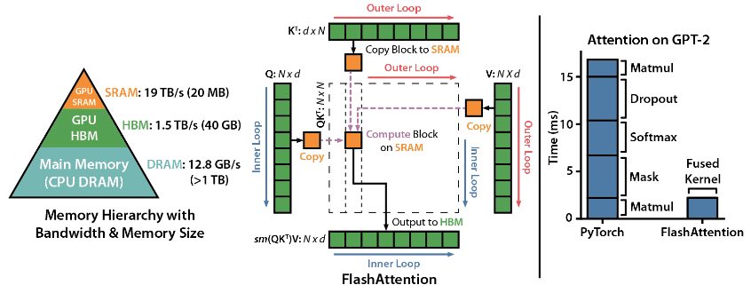

* HBM（High Bandwidth Memory）比如A100-40GB版本里的HBM就是显存40GB，这是高带宽内存。

* GPU计算实际工作在SRAM（Static Random-Access Memory），

  可以从图上看到：SRAM 19TB/S比HBM 1.5TB/S 计算速度快12.67倍，但只有20MB可以使用，当计算所依赖的数据量较大需要跨SM时访问时，则会从更下级的HBM存储器中拷贝数据进行计算。所以从SRAM<-->HBM这个过程就是耗时瓶颈，**Flash attention目标在20MB的SRAM中不做过多内存交换实现Attention计算。**

  **核心就是采用了Tiling（平铺）的这样一个思想，其核心是将原始的注意力矩阵分解成更小的子矩阵，然后分别对这些子矩阵进行计算，只要这个子矩阵的大小可以在SRAM内存放，那么不就可以在计算过程中只访问SRAM了。**

  这个优化的过程还是非常复杂的，但对于使用来说，并不需要我们去操作代码细节，官方已经把工具封装好了。接下来我们就来看一下如何在Qwen模型中使用Flash Attention 2来进行推理加速和显存优化。

## 2.2 安装 Flash Attention 2 工具

  首先，Qwen在推理过程中，已经封装好了使用Flash Attention的代码流程，相关程序代码存放在这里：

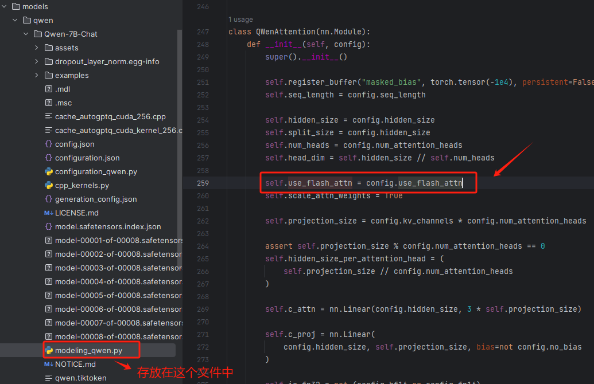

  也就是说，无论我们以何种方式启动Qwen模型进行使用，都会默认加载Flash Attention 2，如果不安装这个工具也不影响使用，只不过是不会利用到这个工具的推理加速等优化而已。可以看到，在前面没安装 Flash Attention 2工具时，启动模型时会有这样的输出：

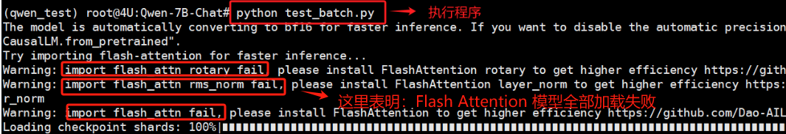

* **Flash Attenton工具对显卡的要求：**

  Flash Attention工具对于显卡等级还是有一定的需求的，官方的说明是：**Flash Attention v2支持Ampere, Ada, or Hopper架构的显卡，比如A100, RTX 3090, RTX 4090, H100等。T4, RTX 2080 等级别的，目前还未支持，需要使用Flash Attention v1 版本。**

* **Flash Attenton工具对驱动的要求：**

  Flash Attenton工具除了对显卡等级有要求外，还对运行环境有这两点要求：**其一是CUDA 版本要高于 11.6，其二是PyTorch 版本要高于 1.12 。**

  这一步的限制大家并不需要担心，因为只要大家的显卡等级符合要求，那么对应的可安装的CUDA版本一定是可以高于这个版本的，如果当前的服务器环境低于上述需求，也完全可以通过更新显卡驱动的方法来使当前环境符合上述标准。

  除了官方的上述两个要求，这里在安装的踩坑过程中要给大家补充一条：**CUDA和Pytorch的版本要一致。否则在后面的安装过程中一定会出现这样的问题：**

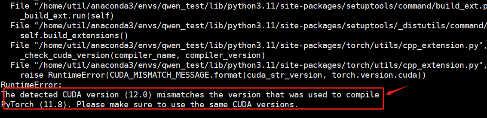

  所以接下来，我们要验证当前环境的CUDA版本和Pytorch。

### 2.2.1 Linux系统安装Flash Attention 2

* **Step 1. 查看CUDA版本**

  这里有一个误区：这个CUDA版本，并不是`nvidia-smi`显示出来的版本，即：

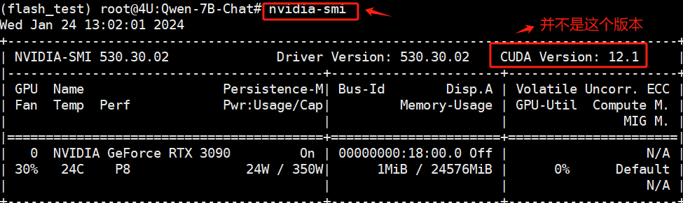

  之前的课程中强调过：当使用`nvidia-smi`命令时，它显示的是NVIDIA驱动的版本，包括了对CUDA核心的支持。这个驱动版本表明系统支持的CUDA版本的上限。

  同时也注意，这个所指的CUDA版本也不是我们之前创建虚拟环境时，根据`nvidia-smi`命令去Pytorch官网下载的那个CUDA版本：


  **真正指向的，是在命令行终端使用`nvcc -V`显示出来的CUDA版本。**

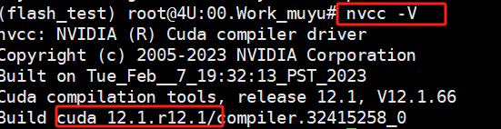

  使用`nvcc -V`命令时，显示的是CUDA编译器（nvcc，即NVIDIA CUDA Compiler）的版本，它是CUDA工具集的一部分。CUDA工具集包括编译器、库和工具，用于开发使用CUDA的应用程序。

  如果大家执行时出现这样的提示，则说明当前机器上未安装NVCC。

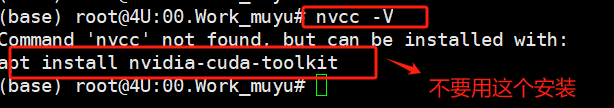

  NVCC，需要安装的是CUDA ToolKit，而安装哪个版本，标准就是要等于或低于`nvidia-smi`显示CUDA版本，如果选错版本，是不影响安装，但在安装完后，会出现如下报错：

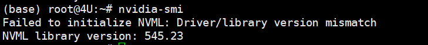

* **Step 2. 安装CUDA ToolKit（如果没安装的话）**

  我当前的机器，`nvidia-smi`输出的显卡最高支持的CUDA 版本是12.1，所以按照这个限制，去选择合适的CUDA TOOKit。具体过程如下：

  首先进入NVIDIA ToolKit官网：https://developer.nvidia.com/cuda-downloads

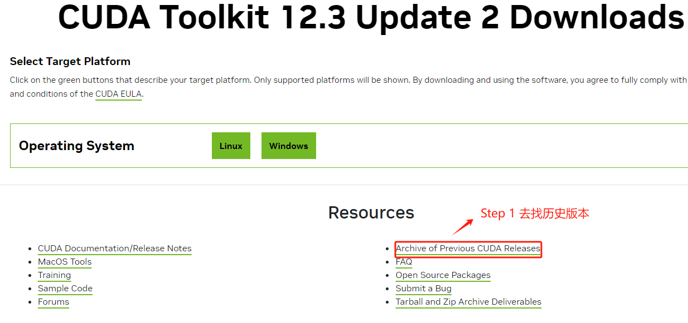

  根据`nvidia-smix`显示出来的版本限制，选择低于或等于其限制的CUDA ToolKit版本。


  根据自己的服务器情况，依次进行选择。

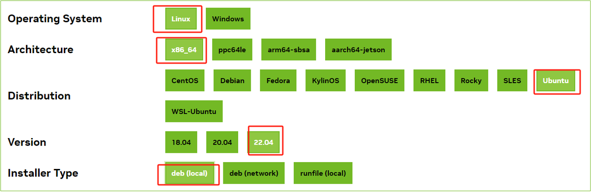

  如果不知道自己Ubuntu系统的版本，在服务器终端这样查看：


  最后一项，建议就选择`deb（local）`安装，下面会显示出安装命令：

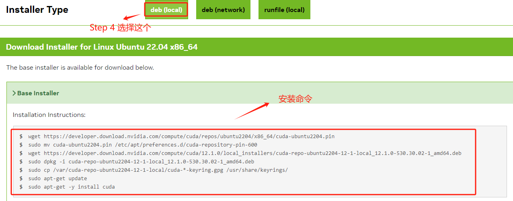

  依次进入服务器，复制命令等待执行完成即可。如果在执行`sudo apt-get update`这一步出现如下报错：

```bash
(base) root@4U:~# sudo apt-key adv --keyserver keyserver.ubuntu.com --recv-keys D27D666CD88E42B4
Warning: apt-key is deprecated. Manage keyring files in trusted.gpg.d instead (see apt-key(8)).
Executing: /tmp/apt-key-gpghome.GVnZNQtQ9G/gpg.1.sh --keyserver keyserver.ubuntu.com --recv-keys D27D666CD88E42B4
gpg: key D27D666CD88E42B4: public key "Elasticsearch (Elasticsearch Signing Key) <dev_ops@elasticsearch.org>" imported
gpg: Total number processed: 1
gpg:               imported: 1
```

  说明在尝试安装 NVIDIA Toolkit 或其他软件包时，APT 包管理器无法验证某些仓库的公钥，解决方法如下：

```bash
# 1. 首先，需要从 Elastic 的官方网站或密钥服务器上下载公钥。
wget -qO - https://artifacts.elastic.co/GPG-KEY-elasticsearch | sudo gpg --dearmor -o /usr/share/keyrings/elastic.gpg

# 2. 更新 Elastic 的软件源配置，使其使用新添加的密钥。
sudo vim /etc/apt/sources.list.d/elastic-8.x.list
```

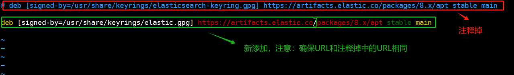

  做完上述更改后，就可以正常执行`sudo apt-get update`命令。待全部完成后，再次执行`nvcc -V`命令。


* **Step 3. 查看Pytorch版本**

  在确定好了NVCC的版本后，需要匹配兼容的Pytorch版本。查看Pytorch版本的方式如下：

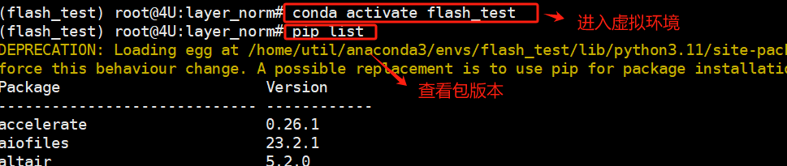

  找到具体的Pytorch版本。


  这里匹配的原则是：Pytorch版本要和CUDA的大版本一致。比如 CUDA是12.1版本，那么你的Pytorch要是 2.x版本以上，1.x就不行。所以这里如果发现你实际的Pytorch与CUDA版本不匹配的话，按照NVCC的版本，重新在虚拟环境中更新Pytorch版本，比如我的是NVCC中CUDA版本是12.1，那么：https://pytorch.org/get-started/previous-versions/


* **Step 4. 安装Flash Attenton 2**

  确定了CUDA版本和Pytorch版本相匹配后，接下来就可以执行Flash Attenton的安装过程，Flash Attenton 发布在Github上，提供了两种方式来安装：https://github.com/Dao-AILab/flash-attention ：

* 方式一：pip安装，在已安装好GPU版本的Pytorch后，依次执行如下操作：

```bash
pip install packaging
pip uninstall -y ninja && pip install ninja
pip install flash-attn --no-build-isolation
```

* 方式二：源码安装，依次执行如下操作：

```bash
git clone https://github.com/Dao-AILab/flash-attention.git
cd flash-attention
pip install .
```

  两种方式看起来都非常简单，但实际上在安装过程中会遇到非常多的问题，比如：

* **问题1：网络问题**

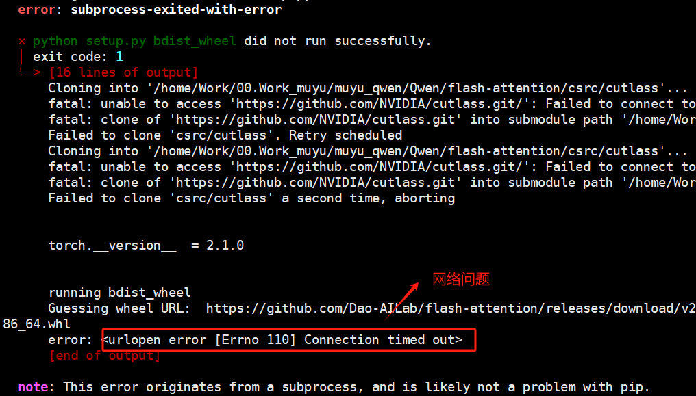

* **问题2：Python版本问题**

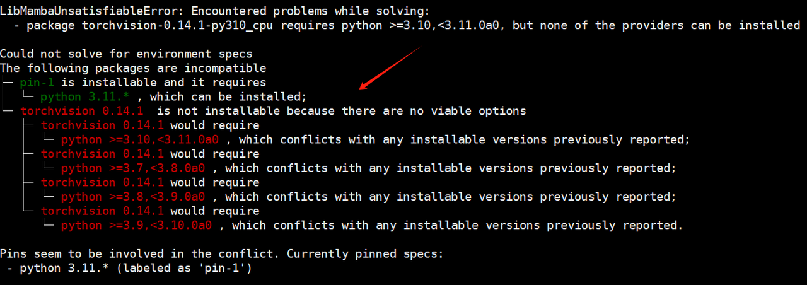

* **问题3：编译问题**

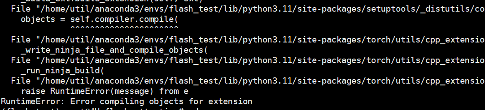

  大家可以尝试官方提供的上述两种方式安装，我这里给大家提供一种最直接、且最简单的安装方式，如下：

  首先，在本地服务器的终端，依次执行：（注意：要先进入虚拟环境中）

```bash
pip install packaging
pip uninstall -y ninja && pip install ninja
```

  然后进入Flash Attention 的Github官网：https://github.com/Dao-AILab/flash-attention/releases ，找到flash att的编译文件。

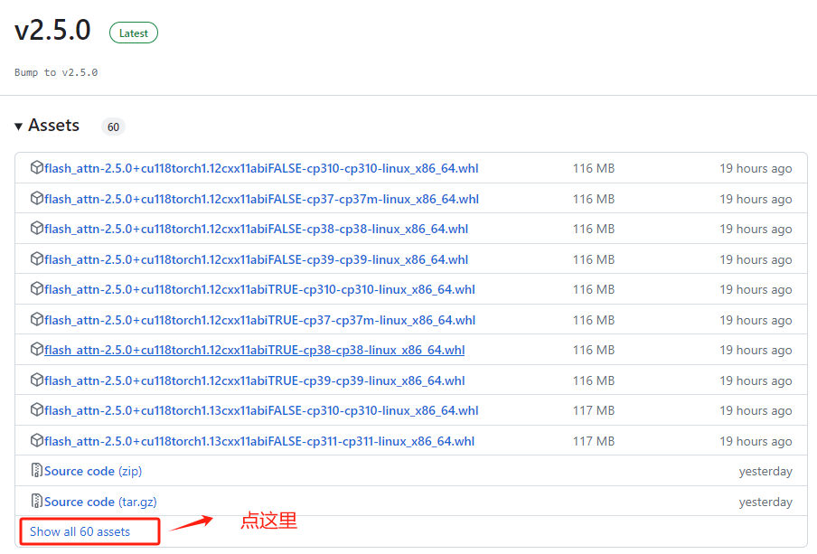

  基于我当前的环境：CUDA版本是12.1，PyTorch版本是2.1，Python版本是3.11，找到符合这个的`.whl`文件。（没有12.1没关系，12.2是向下兼容的。）

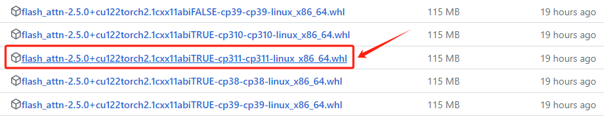

  这个`.whl`是专为特定版本的Python、PyTorch和CUDA编译的文件名，匹配规则如下：

1. **flash\_attn-2.5.0**：这是要安装的包的名称和版本号，此处为`flash_attn`版本`2.5.0`。

2. **cu118**：这表示CUDA的版本，`cu122`意味着它是为CUDA 12.2版本编译的。

3. **torch2.1**：这指的是PyTorch的版本，`torch2.1`表示这个包是为PyTorch 2.1版本编译的。

4. **cxx11abiTRUE**：这通常表示C++ ABI的版本。`cxx11`意味着它使用C++11 ABI。

5. **cp311-cp311**：这表示Python的版本。`cp311`代表CPython 3.11版本。

6. **linux\_x86\_64**：这表示该包是为64位Linux系统编译的。

  

  如果服务器联网，可以通过`wget` 命令下载到本地。先复制链接。

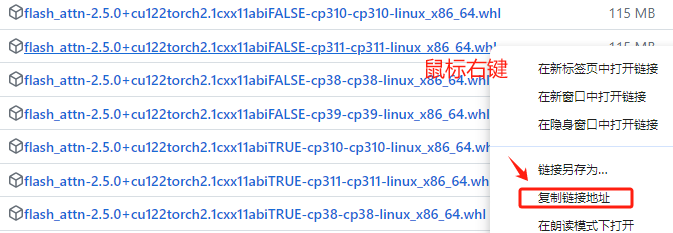

  然后在服务器终端执行下载。

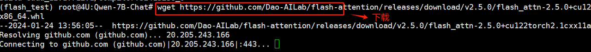

  如果服务器不能联网，可以本地下载后，通过XFTP等远程工具，上传到服务器上。

  下载完成后，使用`pip install` 安装。

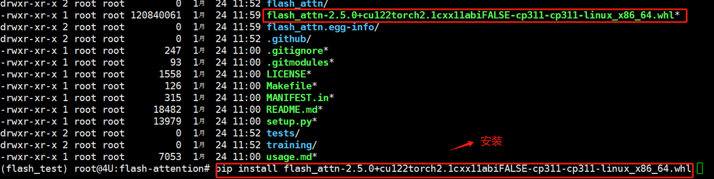

  安装完flash\_attn包后，下载flash\_attention的项目文件，可以通过`git clone`或者直接下载压缩包的方式：https://github.com/Dao-AILab/flash-attention


  将Flash Attenton的项目文件下载至本地后，进入`flash-attention/csrc/layer_norm`路径下，执行:

```bash
MAX_JOBS=4 python setup.py install
```

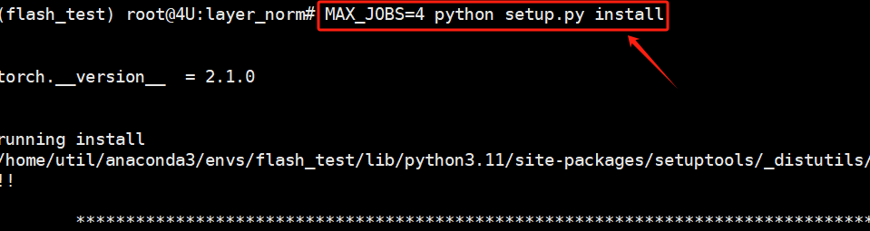

  至此，Flash Attenton工具就安装完成了。接下来我们验证一下。

* **Step 5. 验证Flash Attenton 2**

  我们还是回到批量推理的`test_batch.py`文件夹中，直接执行`python test_batch.py`，此时看一下区别：

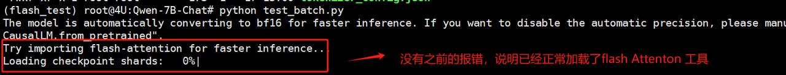

  Qwen的所有程序会默认加载Flash Attention工具以提升推理效率，同时也可以手动关闭，关闭方式如下：

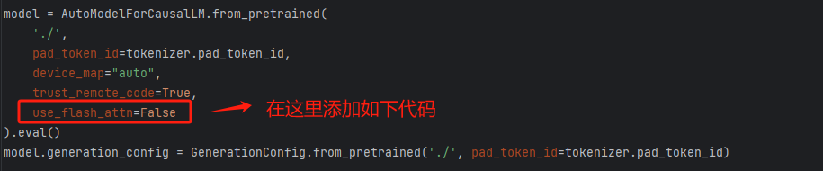

  修改代码后，再次启动`test_batch.py`，提示如下：

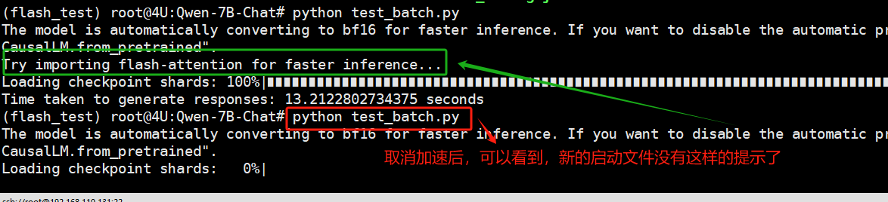

  后续所有加载模型的时候，都可以在相关model加载的代码中添加`use_flash_attn=False`参数来关闭Flash Attenton工具的调用。默认是启用的。

  最后，我们将在批量推理时使用的测试数据`test_data`由100条增加到1000条，看一下在开启Flash Attention 和不开启Flash Attention时的效率对比。

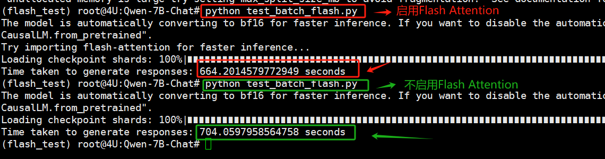

  在进行了初步的测试之后，也不难发现，在处理较少数量的Token以及小规模数据集时，推理效率确实有所提高。尽管模型可能会针对不同的问题生成不同长度的回答，但经过多次测试，我们通常可以观察到一致的速度提升。此外，在推理过程中，相比之前，显存使用也普遍有所下降。

### 2.2.2 Windwos系统安装Flash Attention 2

  Flash Attention 2 在2.3.2 才支持 Windows操作系统。但我在实际安装的过程中，实测了三台Windwos机器，均发现相同的问题，就是rms\_norm 和 rotary组件可以编译成功，但是在启动时仍然在提示加载失败，所以有可能对Windows的支持还存在一些兼容问题，不知道未来会不会进行修复。

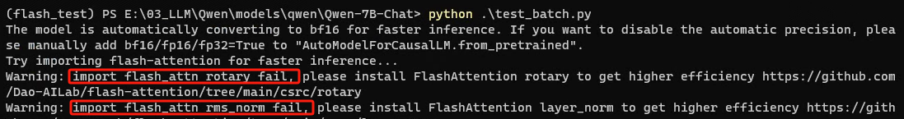

  但是，最关键的flash\_attn是可以加载成功的，所以也建议大家，如果是Windows操作系统的话，可以按照接下来的步骤进行Flash Attention的安装。

* **Step 1. 查看显卡驱动支持的CUDA版本**

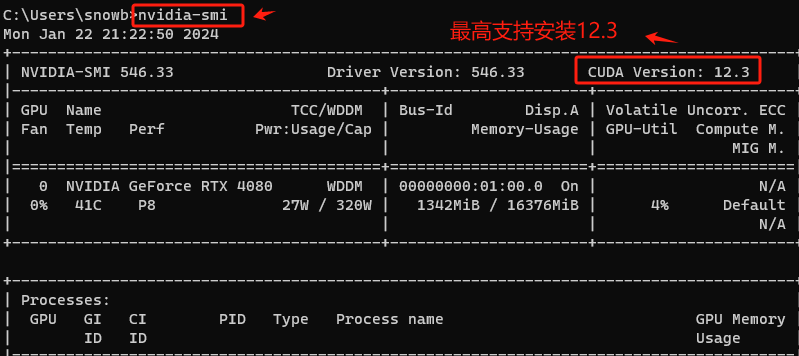

* **Step 2. 查看NVCC**

  在命令行终端输入`nvcc -V`， 会输出 CUDA 编译器的版本信息。

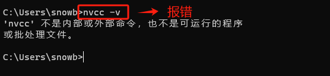

  如果该命令报错，说明该机器上并未安装CUDA Toolkit工具，需要根据`nvidia-smi`中CUDA版本的要求，安装不高于其限制的CUDA Toolkit。

* **Step 3. 安装CUDA Toolkit：https://developer.nvidia.com/cuda-toolkit**


  需要根据`nvidia-smi`中CUDA版本的要求，安装不高于其限制的CUDA Toolkit。

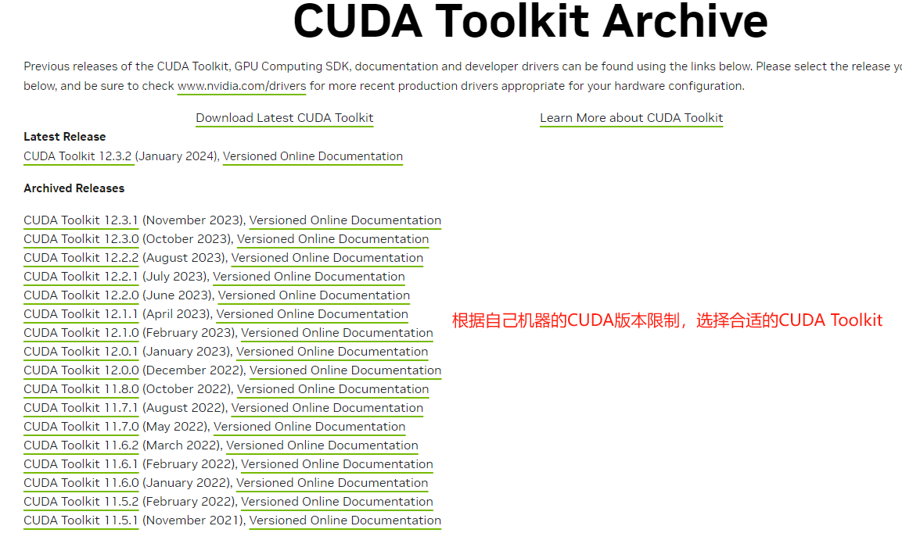

  进入后，选择操作系统版本等信息。

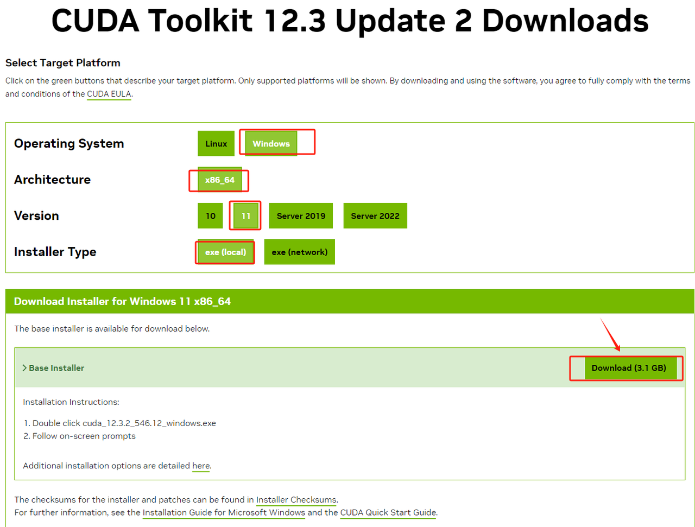

  下载至本地后，双击执行傻瓜式安装。

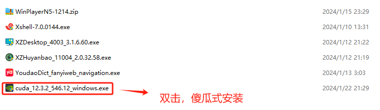

  同样，这里的默认路径不建议大家修改，可能会造成意外的问题。

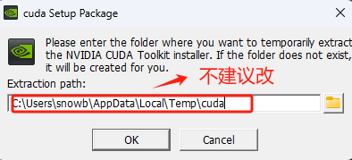

  剩下的，就全部默认安装就可以了。


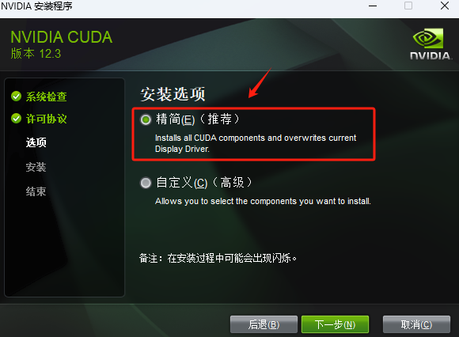

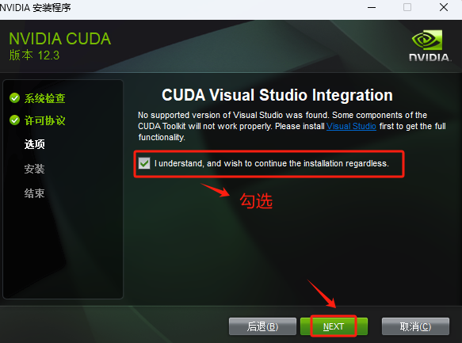

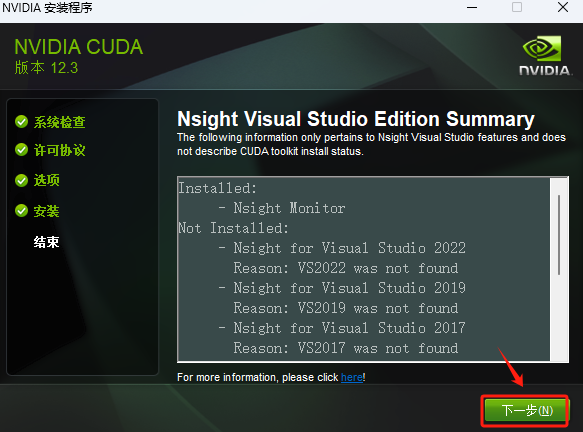

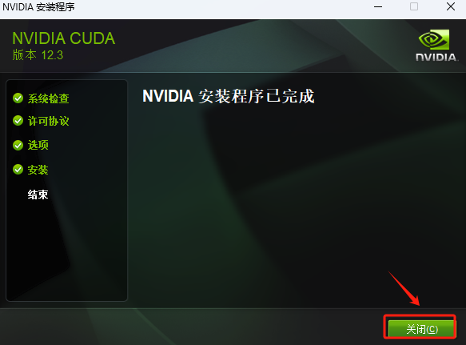

  安装完成后，再次验证一下。

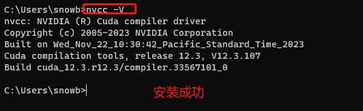

* **Step 4. 安装Microsoft Visual C++ 14.0：https://visualstudio.microsoft.com/zh-hans/visual-cpp-build-tools/**

  与Linux操作系统不同的是，在Windows系统下安装Flash Attention工具，还需要要安装 Microsoft Visual C++ 14.0 或更高版本的编译工具来编译某些 Python 包，主要是因为这些包包含需要编译的 C 或 C++ 扩展。安装过程如下：

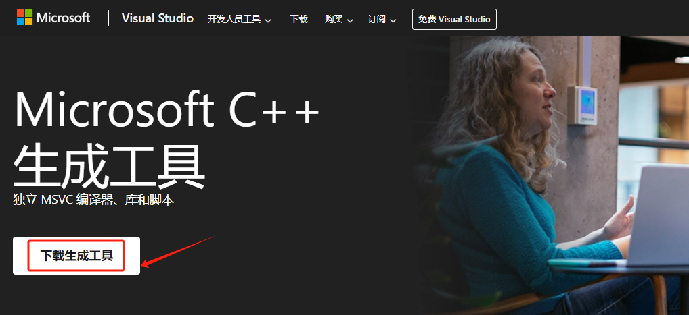

  下载到本地后，执行傻瓜式安装。

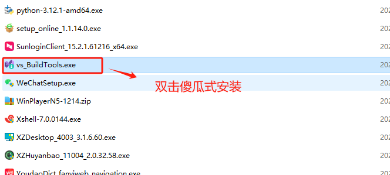

  这里选择同意配置安装。

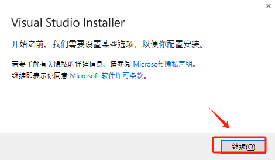

  按照输出的信息，我们可以下载安装"Microsoft C++ Build Tools"这个工具，为了安装这个环境，直接安装一个visual Studio十几个G也是可以，他会自动帮你把所有需要的包安装好，就是太大了，很多不是必要的包也安装了。所以这样选择：

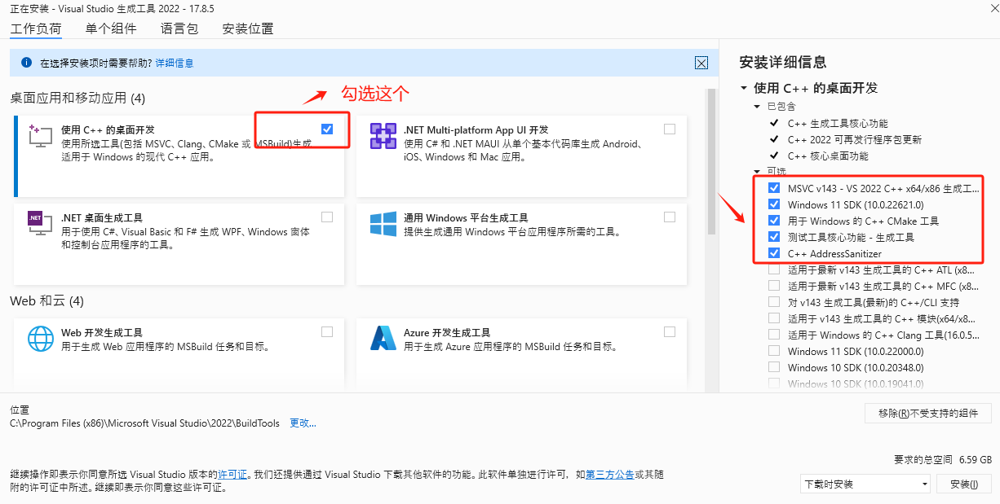

  然后等待安装完成即可。

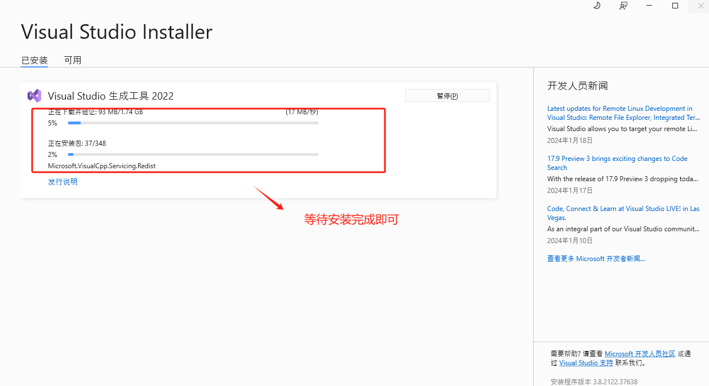

* **Step 5. 下载Flash Attention工具：https://github.com/Dao-AILab/flash-attention**

  在桌面打开`Git Bash`，下载Flash Attention的项目文件，同样，也可以选择直接下载安装包。

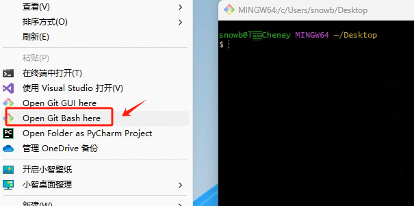

  我这里选择使用Git下载，在终端执行`git clone`命令。

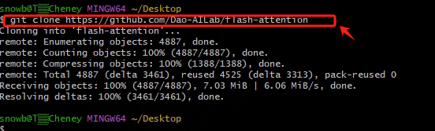

* **Step 6. 进入虚拟环境**

  先打开 conda 的 Prompt 命令行。

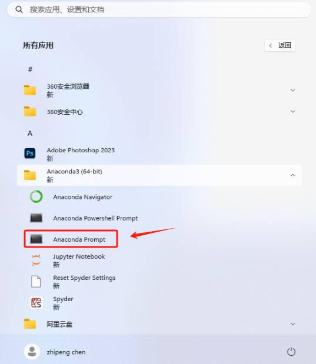

  进入虚拟环境。


  依次执行：

```bash
pip install packaging
pip uninstall -y ninja && pip install ninja
```

* **Step 7. 确认Pytorch版本**

  确认当前虚拟环境的Pytorch版本，标准就是与`nvcc -V`显示出来的CUDA版本要在同一个大版本上。比如 CUDA是12.1版本，那么你的Pytorch要是 2.x版本以上，1.x就不行。查看方法是在当前的虚拟环境中输入命令：

```bash
pip list
```

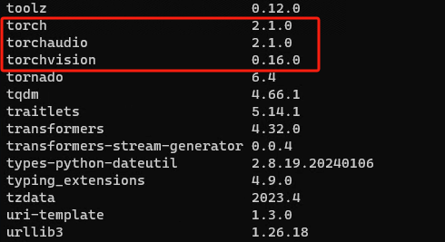

  如果不符合标准的话，重新更新GPU版本的Pytorch。https://pytorch.org/get-started/previous-versions/

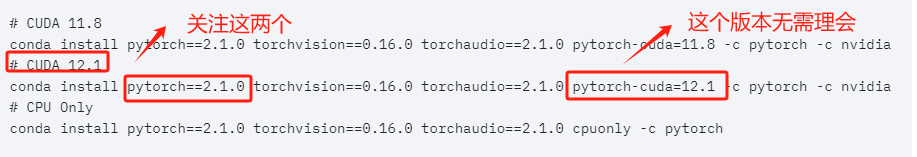

* **Step 8. 下载Windows 的flash attn编译文件：https://github.com/bdashore3/flash-attention/releases**

  根据自己的CUDA版本、Pytorch版本和Python版本，选择合适的编译文件。

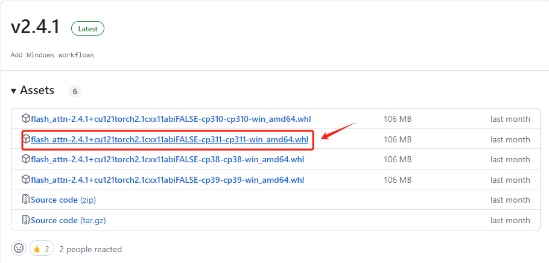

* **Step 9. 安装Windows 的flash attn编译文件**

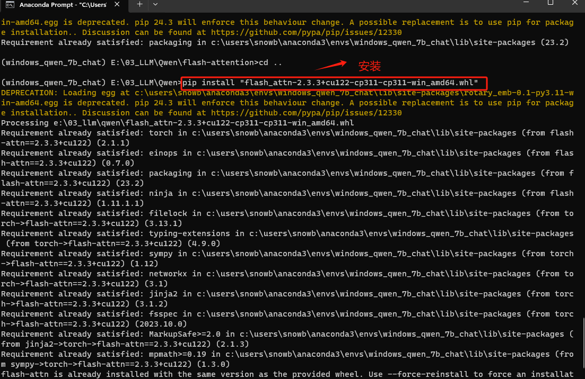

* **Step 10. 安装好flash-attn包后，就可以尝试启动模型服务**

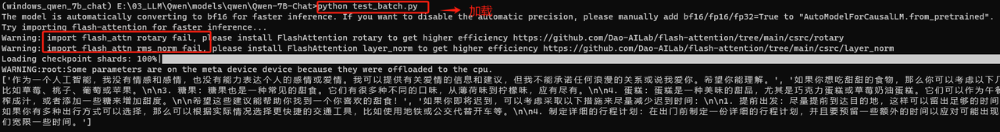

  这里就是我在最开始部分提到的问题，这两个组件，如果想要安装的话，执行如下操作:

```bash
# 先执行：
set MAX_JOBS=4
```

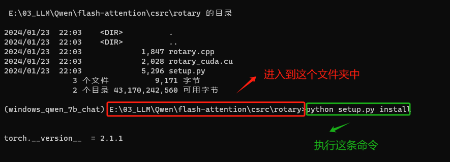

  编译正常来说是可以执行的，而且中途并没有发生报错，但是即使安装了，在启动项目的时候仍然后提示加载失败。所以这也可能是对Windows系统的不兼容导致。大家可以在自己的机器上进行一下尝试。而如果不想再启动的时候看到相关的警告，比如这样：

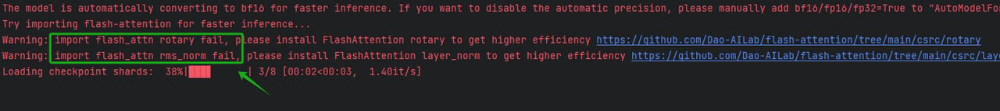

  可以修改一下模型启动的代码逻辑，在这里：

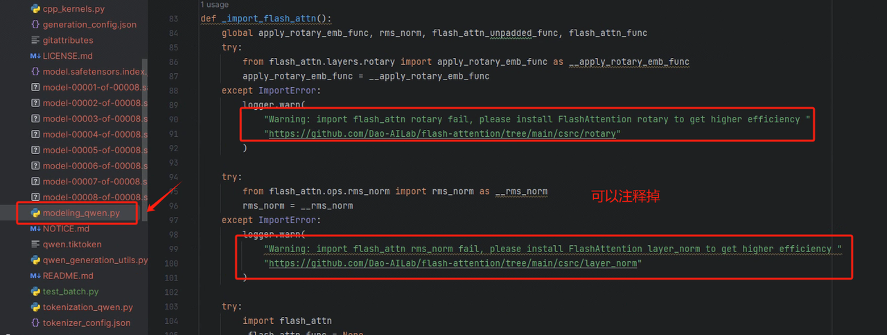

  实际上，Flash Attention技术已被广泛集成到当前主流的模型推理和训练流程中，涵盖了GPT、Lamma以及我们目前正在使用的Qwen等模型。在处理大规模数据时，Flash Attention的优势尤为突出。因此，也强烈建议大家学习并掌握这一工具，以便在实际应用中充分利用其性能优势。

```python
```


📍**更多大模型技术内容学习**

**扫码添加助理英英，回复“大模型”，了解更多大模型技术详情哦👇**


此外，**扫码回复“入群”**，即可加入**大模型技术社群：海量硬核独家技术`干货内容`+无门槛`技术交流`！**
