# 本地部署开源大模型

# 2. 配置大模型开发环境（Jupyter Lab）

  关于私有化部署的大模型，针对不同的开发场景，选择合适的工具至关重要。例如，进行对话测试、接口调用和数据清洗等任务时，Jupyter Lab 这种交互式环境非常适合。它允许我们直观地观察到每一步操作的输出，这对于数据分析和初步测试尤其有用。另一方面，当涉及到更复杂的软件开发项目时，例如执行模型微调、定制对话逻辑或使用像langchain这样的工具进行工程级应用开发，PyCharm 这种功能全面的集成开发环境（IDE）就显得更为合适。PyCharm 提供了代码调试、项目管理和版本控制等高级功能，这对于开发大型应用和维护复杂代码库非常重要。

  因此，我们将分别介绍这两种工具的使用方法。大家可以根据具体需求灵活选择最合适的工具，以获得最佳的开发体验。

  我们首先来看一下Jupyter Lab 如何加载本地部署或者远程服务器部署的大模型环境。

  需要明确的是：如果想要在本地的集成开发环境（如 Jupyter Lab、PyCharm或VsCode等）中执行无论是在本地，还是远程服务器上部署的大模型项目的代码脚本或调用大模型服务时，必须首先进入创建大模型时所建立的虚拟环境。而这个过程，在任何开发工具（IDE）中，默认情况下并不会自动加载这个虚拟环境。因此，接下来我们将详细介绍如何在 Jupyter Lab 和 PyCharm 中手动加载指定的虚拟环境，以便在本地IDE中有效进行大型模型的相关开发工作。

## 2.1 本地部署大模型，本地Jupyter NoteBook加载

  默认安装的Jupyter NoteBook/Lab在启动时，只能选择一个其默认的kernel环境，即：


  安装完Anaconda利用conda创建了虚拟环境，但是启动jupyter notebook之后却找不到虚拟环境，原因是\*\*在虚拟环境下缺少kernel.json文件。\*\*解决方法如下：

* **Step 1. 打开Conda的命令行终端**

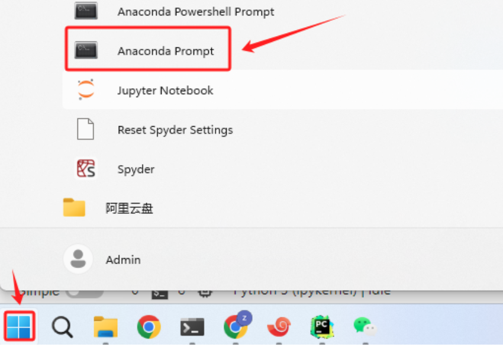

* **Step 2. 安装ipykernel**

  安装ipykernel的命令如下：

```bash
conda install ipykernel
```

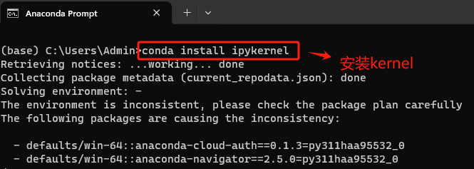

* **Step 3. 找到想要使用的虚拟环境**

  查询虚拟环境指令如下：

```bash
conda env list
```


* **Step 4. 创建虚拟环境的kernel文件**

  找到项目文件的虚拟环境后，对其创建kernel文件，执行命令如下：

```bash
# 我这里是Qwen
conda install -n <环境名称> ipykernel
```

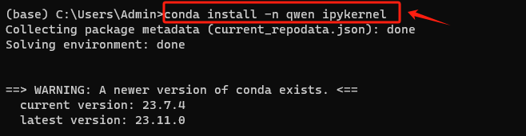

* **Step 5. 激活虚拟环境**

  然后进入该虚拟环境中，执行命令如下：

```bash
# 我这里是Qwen
source activate <环境名称>
```


* **Step 6. 将虚拟环境的kernel写入Jupyter Lab**

```bash
# 我这里是Qwen
python -m ipykernel install --user --name <环境名称> --display-name <jupyter lab中的显示名称>
```

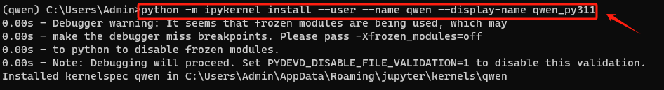

* **Step 7. 此时再查看Jupyter Lab，就发现可以进入虚拟环境了**

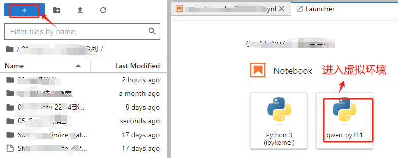

* **Step 8. 删除Kernel**

  如果需要删除在Jupyter Lab中的Kernel，可以先通过如下命令找到目前已存在的kernel名称：

```bash
jupyter kernelspec list
```

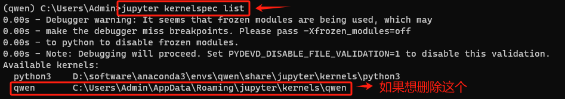

  然后删除指定的kernel环境。**注：这只是删除了在Jupyter Lab上的Kernel，并不会删除实际的虚拟环境**

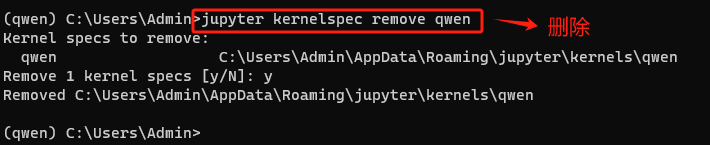

## 2.1 远程服务器部署大模型，本地Jupyter NoteBook加载

  第二种情况是：在远程服务器上部署的开源大模型（基本都是Linux操作系统环境），想要在本地的计算机上使用Jupyter Lab IDE调用服务，那需要执行如下操作：

* **Step 1. 安装远程Jupyter Lab依赖**

  在远程服务器的命令行，输入如下命令：

```bash
pip install jupyterlab
```

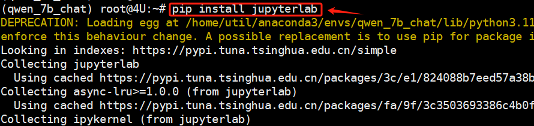

* **Step 2. 加密连接密码**

  安全起见，对连接时的密码进行加密处理，否则明文写在配置文件中，容易造成数据安全风险，依次执行如下操作：

```bash
from jupyter_server.auth import passwd
passwd()
```

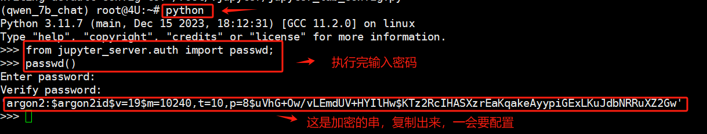

* **Step 3. 生成Jupyter Lab的配置文件**

  完成密码加密后，执行如下命令生成Jupyter Lab 的配置文件（jupyter\_lab\_config.py）：

```bash
jupyter lab --generate-config
```

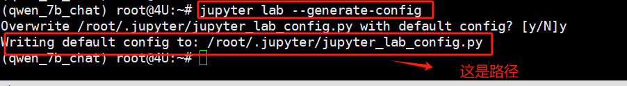

* **Step 4. 编辑Jupyter Lab的配置文件**

  使用`Vim`编辑器，找到如下配置，执行修改：

```bash
c.ServerApp.allow_origin = '*'
c.ServerApp.allow_remote_access = True
c.ServerApp.ip = '0.0.0.0'
c.ServerApp.open_browser = False  
c.ServerApp.password = '加密后的密码'（上一步复制的加密串）
c.ServerApp.port = 8002 
```


* **Step 5. 后台启动Jupyter Lab服务**

  全部配置完成后，在服务器端启动Jupyter Lab服务，通过如下命令后台启动：

```bash
nohup jupyter lab --allow-root > jupyterlab.log 2>&1 &
```

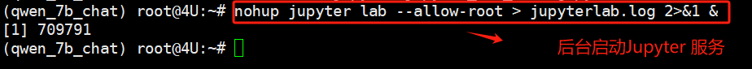

* **Step 6. 打开本地机器的浏览器**

  这里只需要输入自己在上一步配置的服务器IP、端口及输入密码，通过认证后即可进入Jupyter Lab环境。

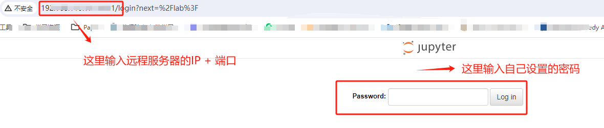

* **Step 7. 进入Jupyter Lab环境**

  同样，默认进来以后，只有Anaconda在安装时默认创建的(Base)这个虚拟环境，所以接下来需要把Qwen的模型运行依赖的虚拟环境加载进来。这里的操作和Windwos基本一致。

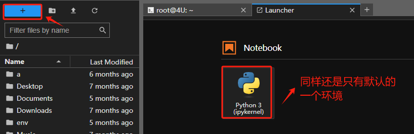

* **Step 8. 安装Kernel工具**

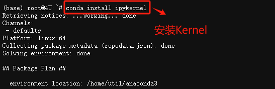

* **Step 9. 给指定的虚拟环境安装Kernel**

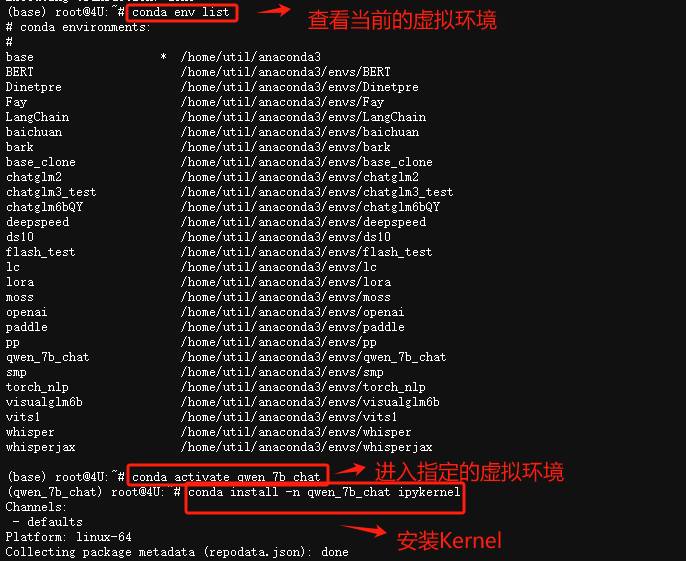

* **Step 10. 将虚拟环境的Kernel写入Jupyter Lab**

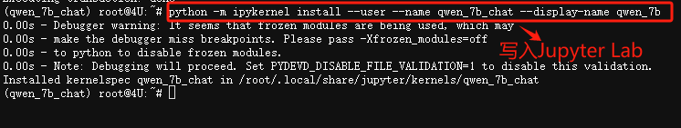

* **Step 11. 验证安装情况**

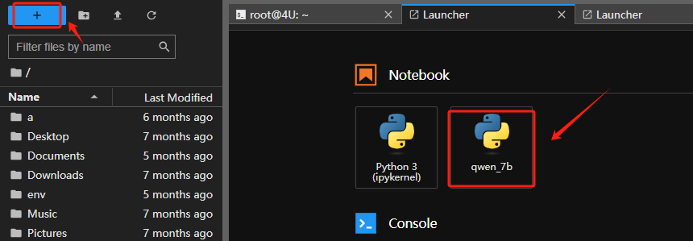

* **Step 12. 修改Jupyter Lab的默认启动路径**

  首次安装后，当启动Jupyter Lab时，其加载的默认路径对应的Linux系统路径是`/home`目录。

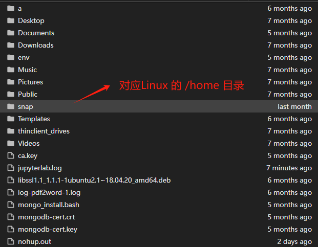

  而我们在进行大模型开发时，往往需要在代码中指定大模型的权重文件、配置文件等信息，所以如果使用默认路径，再寻找大模型相关的路径往往是比较麻烦的，一个最方便的方式就是将其默认启动路径，修改为大家常用的项目开发路径。修改Jupyter Lab默认启动路径的方法如下：

  首先，生成 Jupyter 配置文件，运行以下命令来创建：

```bash
jupyter notebook --generate-config
```

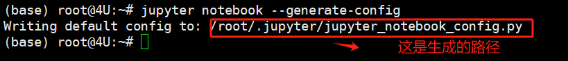

  然后，使用文本编辑器打开这个配置文件。在配置文件中，找到以下行：

```bash
# 先进入到config文件中
vim /root/.jupyter/jupyter_notebook_config.py

# 找到如下行：快捷方法是进入文件后，直接按一下 / ，输入关键字，就可以定位到。
# c.NotebookApp.notebook_dir = ''
```

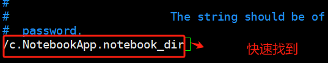

  取消该行的注释，并将空字符串替换为你希望 Jupyter 启动时的默认目录路径。比如我先找到我想替换的路径：

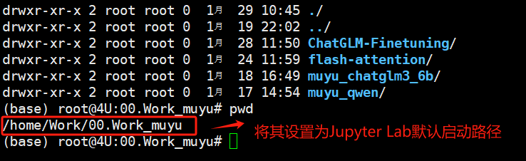

  取消该行的注释，并将空字符串替换为上述希望 Jupyter 启动时的默认目录路径。

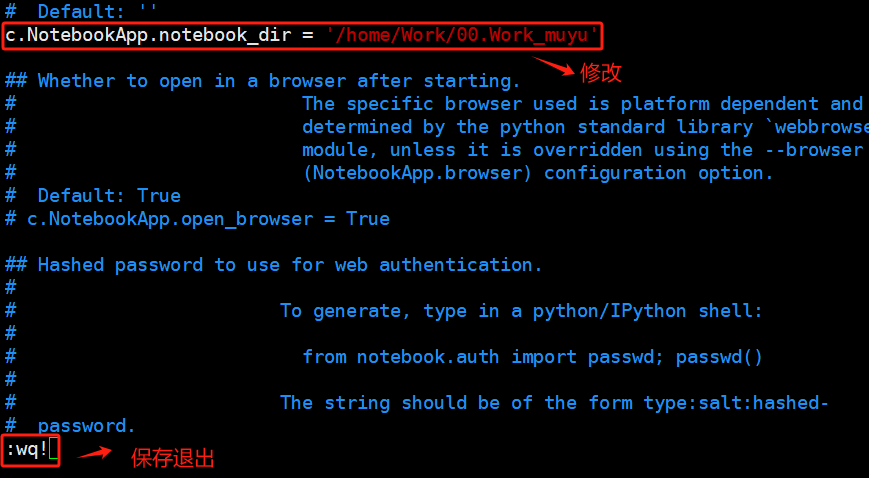

* **Step 13. 重启Jupyter Lab服务**

  如果是通过 nohup 命令在后台启动 Jupyter Lab，并且希望在重启之后应用新的默认启动路径，需要首先按照之前的步骤修改配置文件，然后重新启动 Jupyter Lab。

  首先需要停止当前运行的 Jupyter Lab 实例，找到其进程 ID（PID）。可以使用 ps 命令配合 grep 来查找：

```bash
ps aux | grep jupyter
```

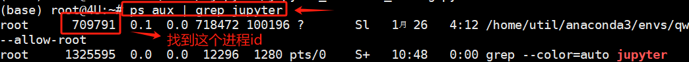

  找到 Jupyter Lab 进程的 PID 后，使用 kill 命令来停止它。


  最后使用之前的命令重新启动 Jupyter Lab：

```bash
nohup jupyter lab --allow-root > jupyterlab.log 2>&1 &
```


  此时再重新在本地的浏览器中打开Jupyter Lab的远程地址，默认启动路径就会更改为自定义的路径。

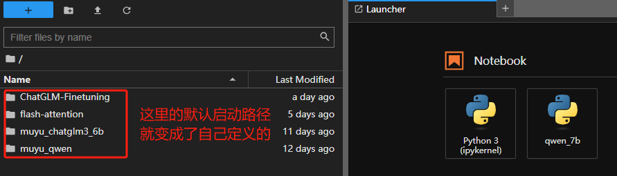

  接下来，我们就在Jupyter Lab中，进行后续的应用开发尝试。


📍**更多大模型技术内容学习**

**扫码添加助理英英，回复“大模型”，了解更多大模型技术详情哦👇**


此外，**扫码回复“入群”**，即可加入**大模型技术社群：海量硬核独家技术`干货内容`+无门槛`技术交流`！**
