## 2.4 下载Qwen-7B-Chat的模型权重

  在下载了Qwen的项目运行文件及配置好了Python的运行环境后，还剩下最后一步：需要把Qwen的这个模型本身下载到本地，从而才能通过项目文件中的代码逻辑，调用这个模型，最终达到启动模型服务的结果。

  不同于GitHub，GitHub 仅仅是一个代码托管和版本控制平台，托管的是项目的源代码、文档和其他相关文件。同时对于托管文件的大小有限制，不适合存储大型文件，如训练好的机器学习模型。而模型权重都很大，自然是不适合放在Github平台上的，所以有其他的网站\*\*在远端服务器上存储着真实的模型权重供我们下载。\*\*对于大模型的权重存储，推荐使用的两个官方：

* Hugging Face： https://huggingface.co/ ，限制条件：**需要开启科学上网才可以访问**；

* 摩搭社区：https://modelscope.cn/ ，优势：不需要科学上网，**国内网络可直接访问**；

接下来，我们依次介绍两个官方的下载方式，大家根据各自的实际情况灵活选择。

### 2.4.1 方法一：在Hugging Face官方下载（需要科学上网）

* **Step 1：进入Hugging Face 官网：https://huggingface.co/**

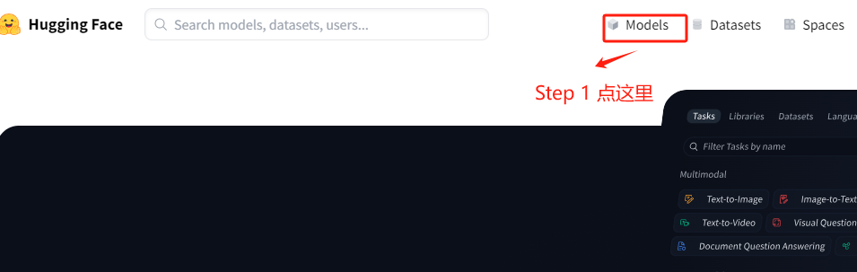

* **Step 2：搜索 Qwen 模型**

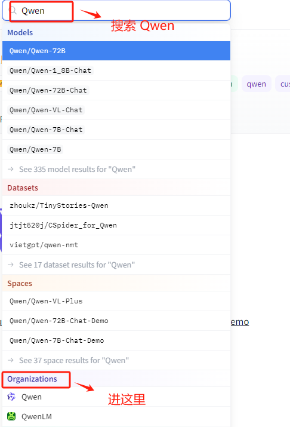

* **Step 3：选择 Qwen-7B-Chat 模型**

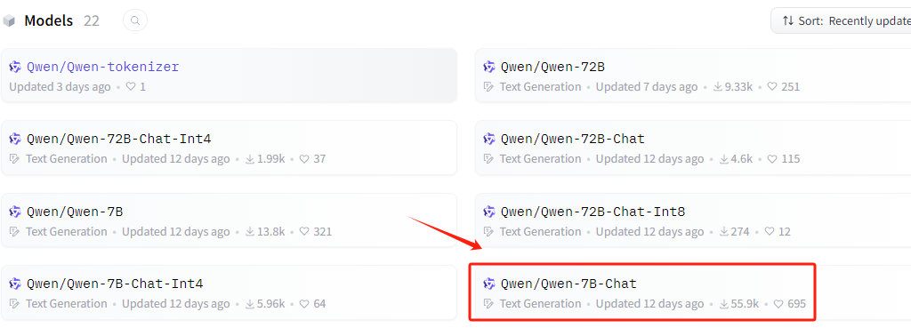

  然后按照如下位置，找到对应的下载URL。

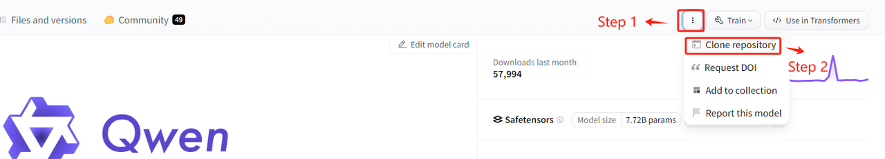

  复制此命令，进入到服务器的命令行准备执行。


* **Step 4. 安装Git LFS**

  Git Large File Storage（Git LFS）是一种用于处理大文件的工具，在 Hugging Face 下载大模型时，通常需要安装 Git LFS，主要的原因是：Git 本身并不擅长处理大型文件，因为在 Git 中，每次我们提交一个文件，它的完整内容都会被保存在 Git 仓库的历史记录中。但对于非常大的文件，这种方式会导致仓库变得庞大而且低效。而 Git LFS， 就不会直接将它们的内容存储在仓库中。相反，它存储了一个轻量级的“指针”文件，它本身非常小，它包含了关于大型文件的信息（如其在服务器上的位置），但不包含文件的实际内容。当我们需要访问或下载这个大型文件时，Git LFS 会根据这个指针去下载真正的文件内容。

  实际的大文件存储在一个单独的服务器上，而不是在 Git 仓库的历史记录中。所以如果不安装 Git LFS 而直接从 Hugging Face 或其他支持 LFS 的仓库下载大型文件，通常只会下载到一个包含指向实际文件的指针的小文件，而不是文件本身。

  所以，需要先安装git-lfs这个工具。命令如下：

```bash
sudo apt-get install git-lfs
```

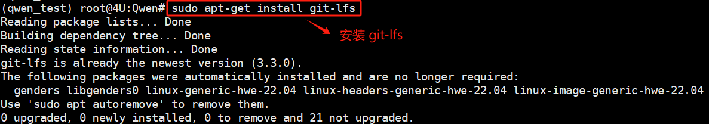

* **Step 5. 初始化Git LFS**

  初始化git lfs，会自动设置一些在上传或下载大文件是必要的操作，初始化命令如下：

```bash
sudo git lfs install
```

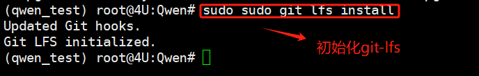

* **Step 6. 使用 Git LFS 下载Qwen-7B-Chat的模型权重**

  直接复制Hugging Face上提供的命令，在终端运行，等待下载完成即可。

```bash
git clone https://huggingface.co/Qwen/Qwen-7B-Chat
```

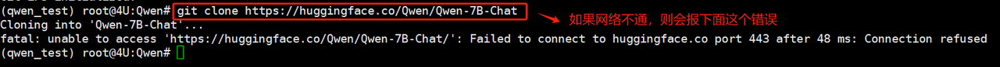

  因为我当前的服务器环境也确实无法开启科学上网，所以将采用方法二：通过摩搭社区来下载。而如果网络正常的话，则会在本地生成`Qwen-7B-Chat`这样一个文件夹，其中存放的就是Qwen-7B-Chat所有的权重文件。

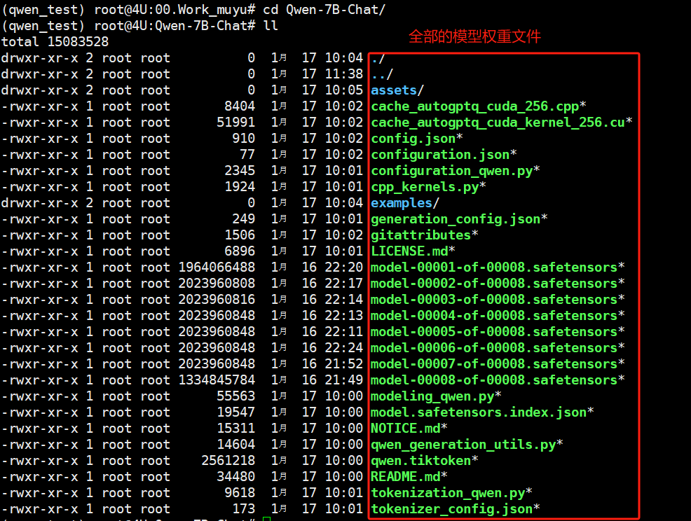

### 2.4.1 方法二：在modelscope官方下载

* **Step 1：进入modelscope 官网：https://modelscope.cn/**

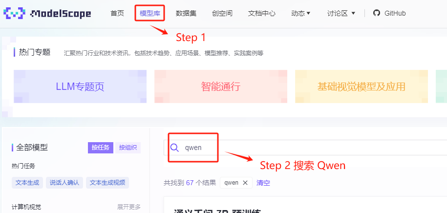

* **Step 2：选择 Qwen-7B-Chat 模型**

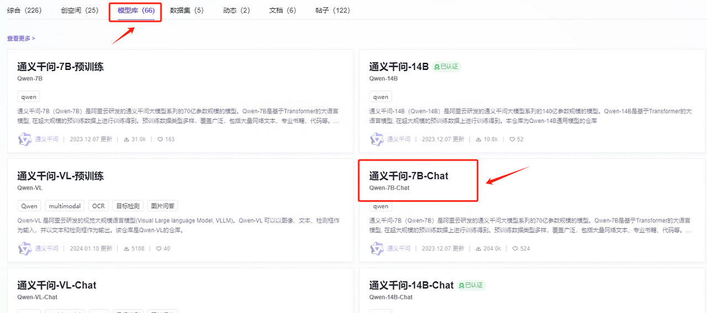

  然后按照如下位置，找到对应的下载URL。

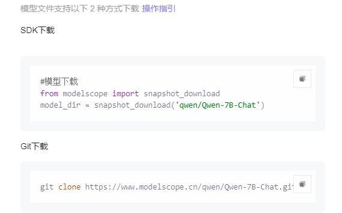

  一共提供了两种下载方式，其中通过Git下载的原理和过程与Hugging Face的Git下载方法一样，这里实践一下通过SDK下载。

  首先，需要使用 vim 编辑器直接新建一个.py文件，命令如下：

```bash
    vim downloads_model.py
```

```bash
from modelscope.hub.snapshot_download import snapshot_download

model_dir = snapshot_download('qwen/Qwen-7B-Chat', revision='master'
```

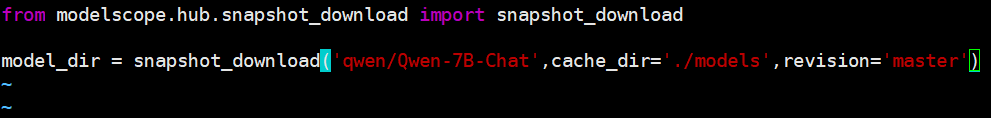

  编辑完成后，先按 ESC，然后输入 `:wq!` 保存退出。

  然后在终端使用`python downloads_model.py`命令执行该脚本，此时模型就会开启下载过程，等待下载完成即可。

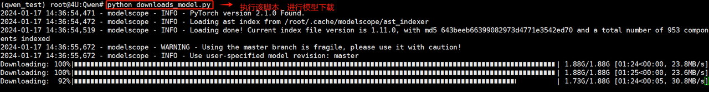

  安装完成后，就会在本地生成模型的权重文件。

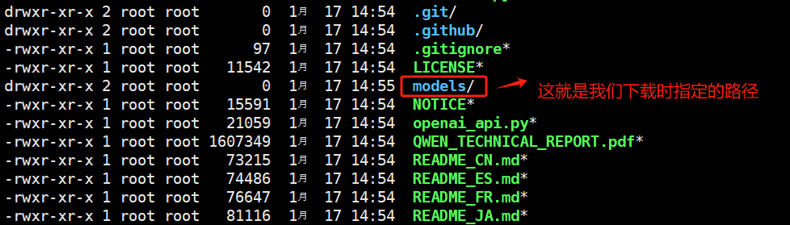

  可以看到，完整的模型权重文件就下载至本地了。

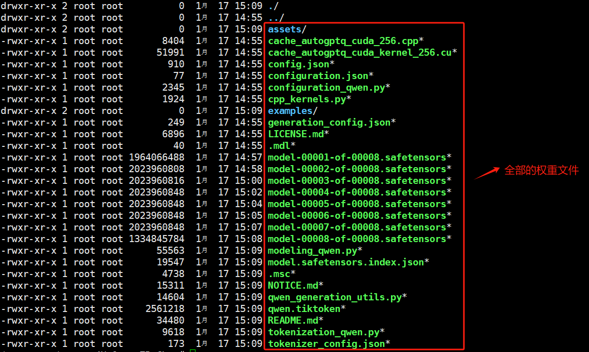

### 2.4.1 方法三：百度网盘下载链接

  如果上述两种方式都无法下载的话，可以通过我们提供的百度网盘直接下载：https://pan.baidu.com/s/15sRruaOuzpyY-k\_O8i3aLA?pwd=q88n

  至此，我们就已经把Qwen-7B-Chat模型部署运行前所需要的文件全部准备完毕。

# 三、运行Qwen-7B-Chat模型

### 3.1 方式一：在命令行终端启动交互式对话

  首先，最简单的方法是直接使用官方提供的简单的交互式Demo，可以直接在终端输入文字的方式和Qwen-7B-Chat交互，并流式输出返回结果。

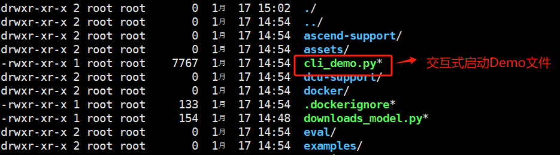

  使用`vim cli_demo.py`命令编辑这个文件，仅需要修改一下Qwen模型的指向路径即可。默认是从云端加载，因为我们已经下载到了本地，需要改为本地的实际存储路径。

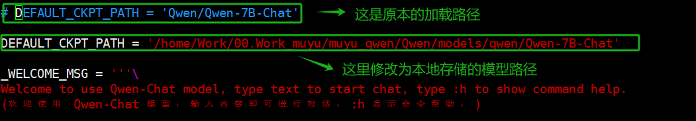

  保存后，使用`python cli_demo.py`启动服务。

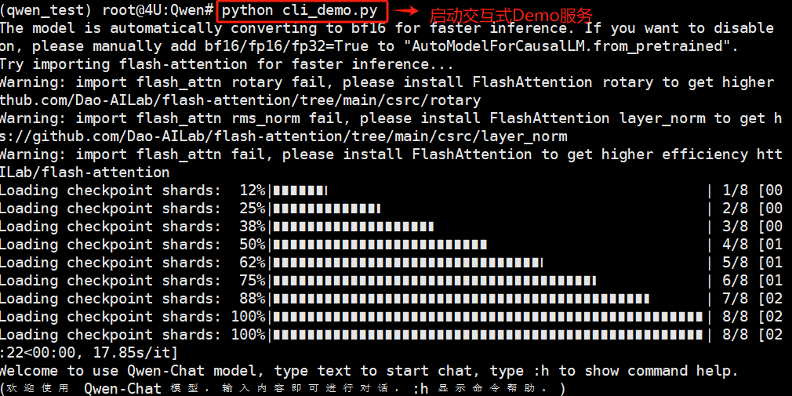

  启动成功后，则会在当前终端出现交互式对话，可以直接输入Prompt与Qwen模型进行对话。

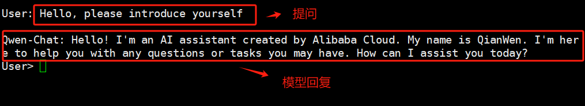

  如果想退出交互式Demo，在 User 角色下输入 `:exit` 来退出，交互式命令行相关的一些操作也在`cli_demo.py`中有非常明确的说明：

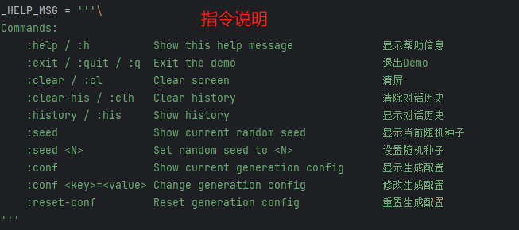

  启动Qwen-7B-Chat的显存占用情况，在四卡3090的负载均衡下，总共会占用约20G显存，当然随着对话过程中输入Token，这个显存的占用会增加。单次输入的Token越多，当次占用的显存会变高，待模型回复完毕后，回到约20G显存的持续占用状态。

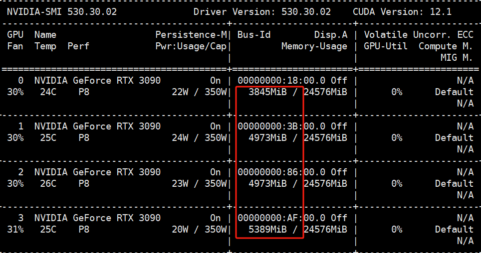

### 3.1 方式二：使用Web UI启动

  官方提供了Web UI的demo供我们使用，其借助gradio库来实现，gradio是一个Python库，用于快速创建用于演示机器学习模型的Web界面。开发者可以用几行代码为模型创建输入和输出接口，用户可以通过这些接口与模型进行交互。用户可以轻松地测试和使用机器学习模型，比如通过上传图片来测试图像识别模型，或者输入文本来测试自然语言处理模型。Gradio非常适合于快速原型设计和模型展示。

  所以在使用这种方式启动Qwen模型前，需要安装一下相关的依赖库。在项目文件中，有`requirements_web_demo.txt`这样一个文件，记录了需要安装的依赖包及其精确的版本。

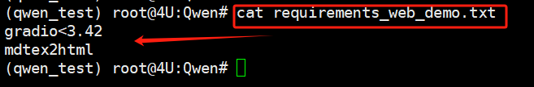

  同样可以一次性安装需要的依赖包。执行如下命令：

```bash
pip install -r requirements_web_demo.txt -i https://pypi.tuna.tsinghua.edu.cn/simple
```

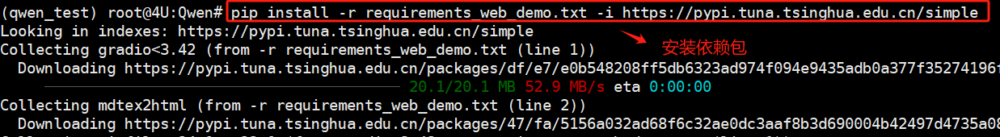

  接下来使用`vim web_demo.py`命令编辑这个文件，仅需要修改一下Qwen模型的指向路径即可。默认是从云端加载，因为我们已经下载到了本地，需要改为本地的实际存储路径。

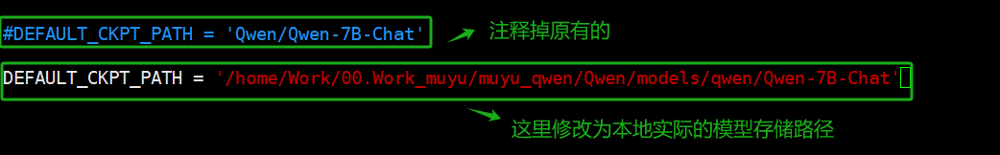

  保存后，使用`python cli_demo.py`启动服务。

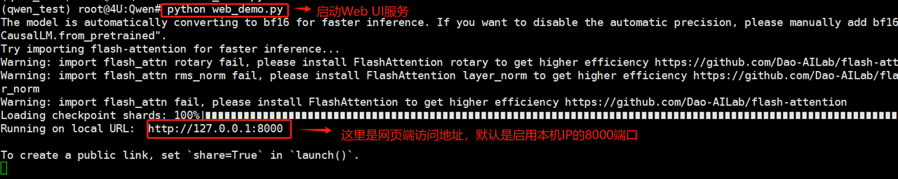

  如果你是本机部署服务，且是在本机浏览器中访问，直接通过`127.0.0.1:10000`地址访问是完全没有问题的。而如果你是远程服务器或者通过SSH远程局域网内的服务器，需要明确指定本机的IP才可以。操作过程如下：

  首先通过`ifconfig`查看一下本机的地址。

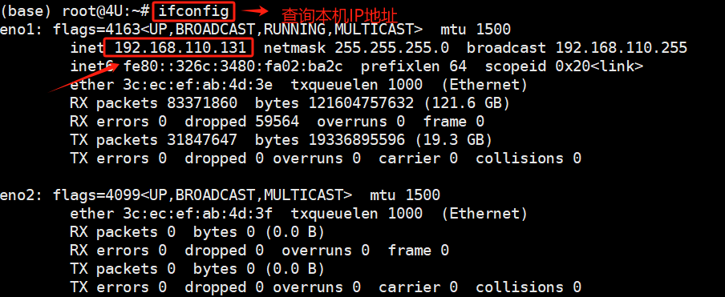

  然后使用vim编辑器，修改`web_demo.py`中程序启动的默认IP地址。

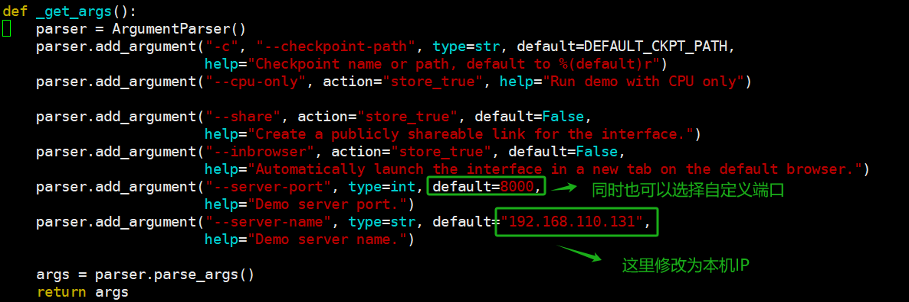

  如果想退出交互式Demo，在 User 角色下输入 `:exit` 来退出，交互式命令行相关的一些操作也在`cli_demo.py`中有非常明确的说明：

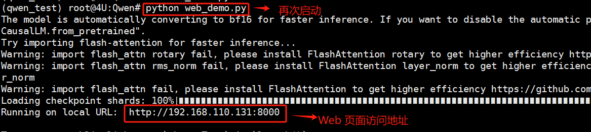

  通过这种方式，就可以实现远程机器启动服务，在本机的Web页面使用。注意：如果是使用云服务器，需要确保设置的是公网IP且端口已启用。正常访问情况如下：

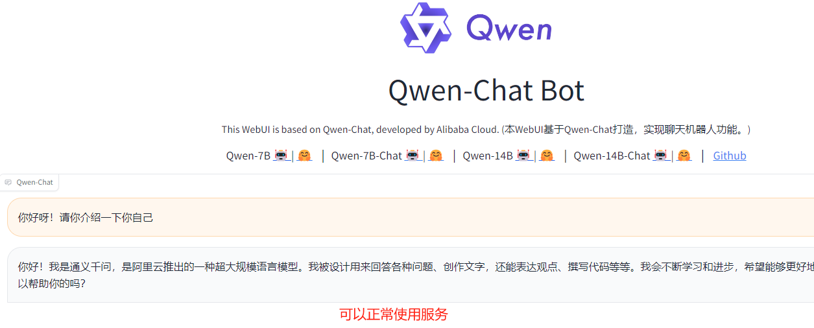

  同样，不论哪种方式启动Qwen-7B-Chat，其显存占用在四卡3090的负载均衡下，总共会占用约20G显存，随着对话过程中输入Token，这个显存的占用会增加。单次输入的Token越多，当次占用的显存会变高，待模型回复完毕后，回到约20G显存的持续占用状态。


### 3.3 方式三：使用OpenAI风格调用（推荐）

  Qwen的API服务依托于FastAPI框架，其是基于标准的 Python 类型提示，并且是基于 OpenAPI 和 JSON Schema 的，主要用于构建 API服务。其代码流程写在Qwen项目文件目录下的`openai_api.py`文件中。

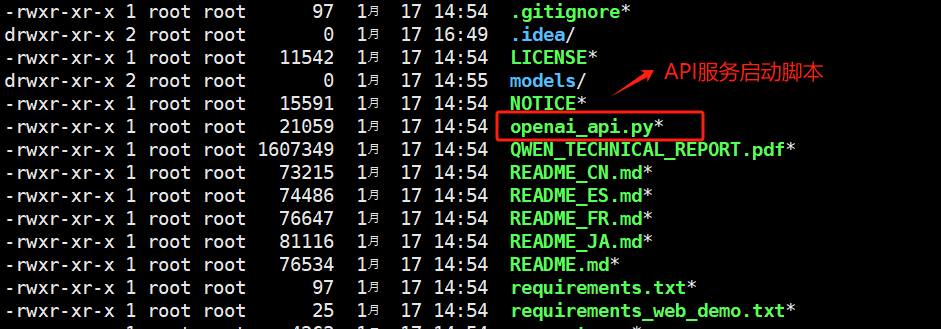

  既然是使用`fastapi`框架编写的，所以自然在启动前需要安装`fastapi`依赖包。

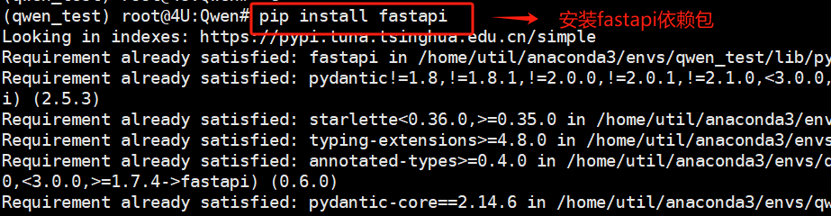

  同时，还需要安装`see_starlette`依赖包。

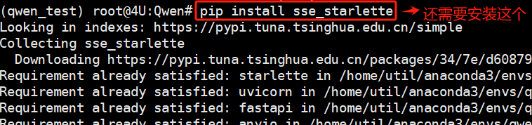

  然后，需要使用vim编辑器，修改`openai_api.py`的下面几处内容：

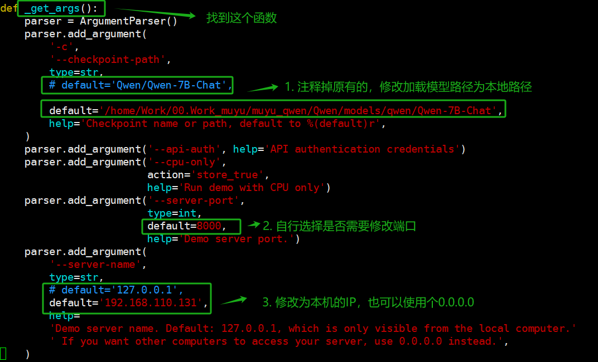

  修改完成后，回到终端中使用`python openai_api.py`启动API服务。

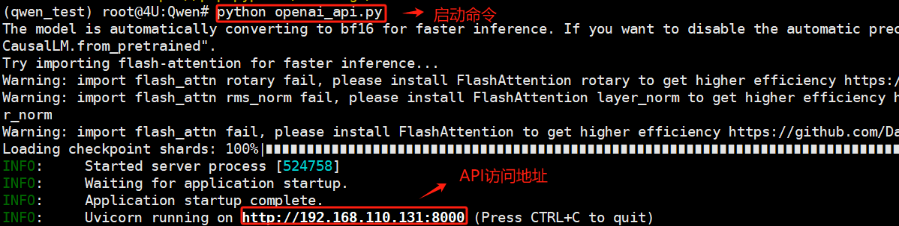

  修改完成后，回到终端中使用`python openai_api.py`启动API服务。

随后即可运行以下命令部署你的本地API：

```python
import openai
openai.api_base = "http://192.168.110.131:10000/v1"
openai.api_key = "none"

# 使用流式回复的请求
for chunk in openai.ChatCompletion.create(
    model="Qwen",
    messages=[
        {"role": "user", "content": "你好"}
    ],
    stream=True
    # 流式输出的自定义stopwords功能尚未支持，正在开发中
):
    if hasattr(chunk.choices[0].delta, "content"):
        print(chunk.choices[0].delta.content, end="", flush=True)

# 不使用流式回复的请求
response = openai.ChatCompletion.create(
    model="Qwen",
    messages=[
        {"role": "user", "content": "你好"}
    ],
    stream=False,
    stop=[] # 在此处添加自定义的stop words 例如ReAct prompting时需要增加： stop=["Observation:"]。
)
print(response.choices[0].message.content)
```

```plaintext
你好！有什么我可以帮助你的吗？你好！有什么我能为你效劳的吗？
```


📍**更多大模型技术内容学习**

**扫码添加助理英英，回复“大模型”，了解更多大模型技术详情哦👇**


此外，**扫码回复“入群”**，即可加入**大模型技术社群：海量硬核独家技术`干货内容`+无门槛`技术交流`！**
