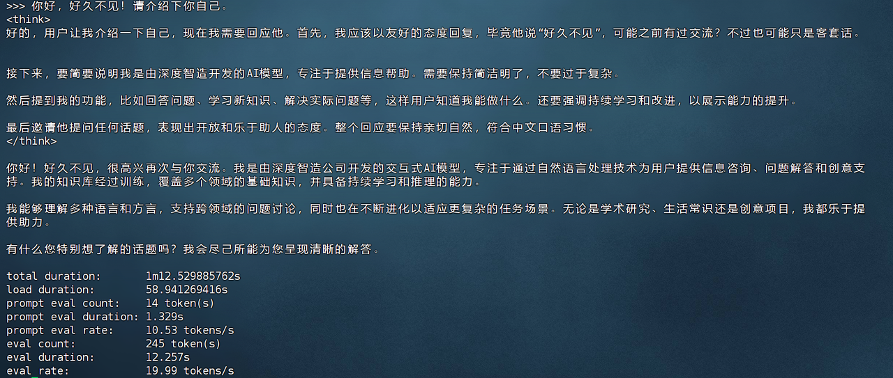
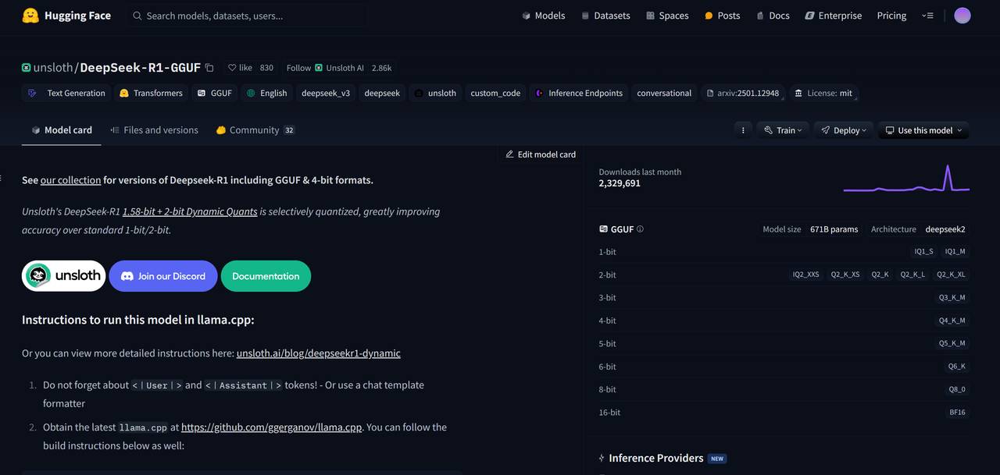
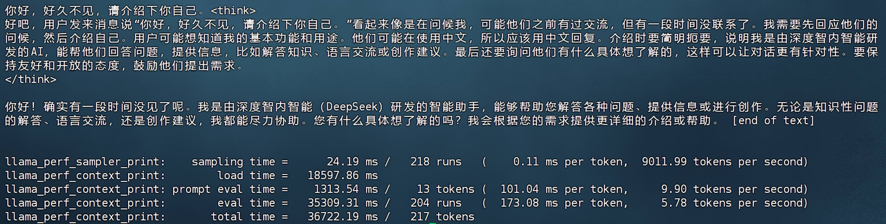
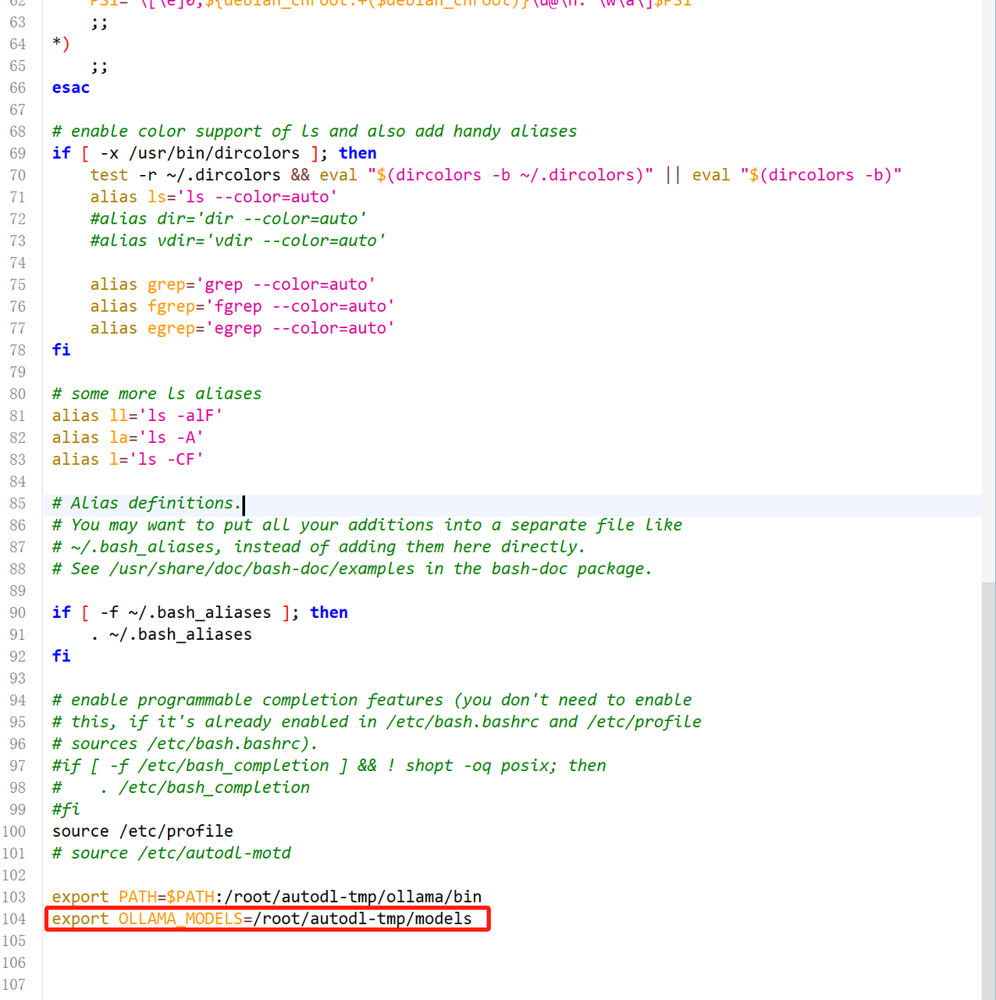
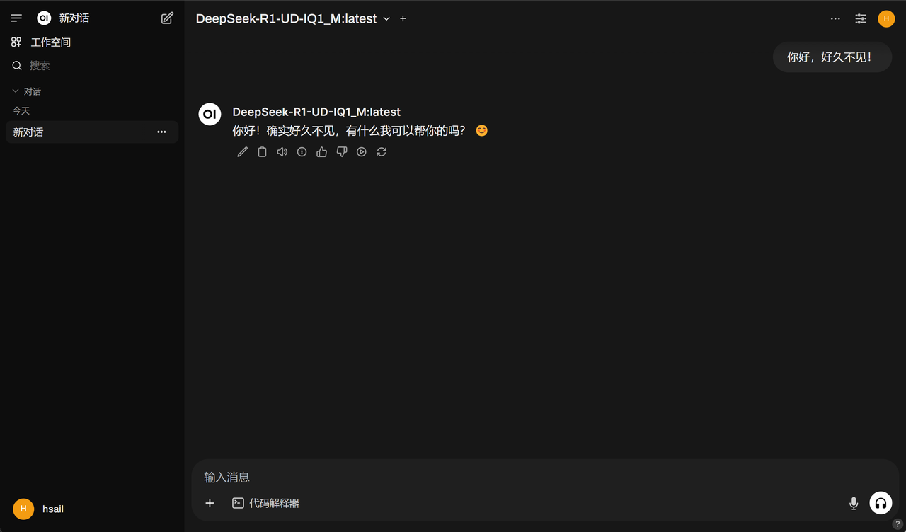

# 课程说明：

* 体验课内容节选自[《2025大模型Agent智能体开发实战》](https://whakv.xetslk.com/s/1tKbjV)完整版付费课程

  体验课时间有限，若想深度学习大模型技术，欢迎大家报名由我主讲的[《2025大模型Agent智能体开发实战》](https://whakv.xetslk.com/s/1tKbjV)：


公开课全套学习资料，已上传至网盘（https://pan.baidu.com/s/1asgKKl1SZvMZTIYvkaD63w?pwd=af7y）

**需要更系统深入学习大模型可扫码⬆️添加助教咨询喔～**

***

# DeepSeek R1低成本高性能部署Unsloth R1动态量化部署方案

## 一、DeepSeek R1部署方案综述

### 1.DeepSeek R1满血版模型高性能部署方案介绍

&#x20;伴随着DeepSeek R1模型使用需求不断深化，如何才能部署更高性能的满血版DeepSeek R1模型，就成了很多应用场景下的当务之急。受限于DeepSeek R1 671B（6710亿参数）的模型规模，通常情况下部署DeepSeek R1满血版模型需要1200G左右显存（考虑百人内并发情况），需要双节点8卡A100服务器才能运行（总成本约在260万-320万左右），而哪怕是INT 4半精度下，也需要至少490G显存，需要单节点8卡A100服务器才能运行。


在此情况下，如何以更少的成本获得尽可能好的模型性能——也就是如果进行DeepSeek R1的高性能部署，就成了重中之重。基本来说，目前的解决方案有以下三种：

1. 【牺牲模型训练&微调性能】**采用“强推理、弱训练”的硬件配置**：如选择国产芯片、英伟达A6000 ada图形显卡、或者采购DeepSeek一体机、甚至是选择MacMini集群等，都是不错的选择。这些硬件模型训练性能较弱，但推理能力强悍，对于一些不需要进行模型训练和微调、只需要推理（也就是对话）的场景来说，是个非常不错的选择。例如45万左右成本，就能购买能运行DeepSeek R1满血版模型的Mac Mini集群，相比购买英伟达显卡，能够节省很大一部分成本。但劣势在于Mac M系列芯片并不适合进行模型训练和微调。


1. 【牺牲模型推理性能】**采用DeepSeek R1 Distill蒸馏模型**：DeepSeek R蒸馏模型组同样推理性能不俗，且蒸馏模型尺寸在1.5B到70B之间，可以适配于任何硬件环境和各类不同的使用需求。


1. 其中各蒸馏模型、各量化版本、各不同使用场景（如模型推理、模型高效微调和全量微调）下模型所需最低配置如下：


1. 【牺牲模型推理速度】采用CPU+GPU混合推理模式。由于采用了CPU执行计算任务，GPU的负载会大幅降低，整体硬件成本也会下降。但是，毕竟CPU不适合进行深度学习计算，所以模型整体推理速度会很慢，并且无法进行模型训练。

   * llama.cpp项目介绍：https://github.com/ggml-org/llama.cpp

   * &#x20;早在2023年3月，也就是Llama第一代模型开源不久，有一位C语言大神（Georgi Gerganov），在GitHub上发起了一个名为llama.cpp的项目，该项目非常夸张的用C语言编写了一整套深度学习底层张量计算库，极大程度降低了大模型等深度学习算法的计算门槛，并最终使得大模型可以在消费级CPU上运行。

   

   * &#x20;llama.cpp现在已经成了大模型量化的标准解决方案，前面谈到的Q2、Q4、Q8等模型量化，都是借助llama.cpp完成的。这个神级项目，现在在GitHub上已经斩获了75k stars。

   * &#x20;借助llama.cpp，可以使用纯CPU模式来运行DeepSeek R1模型，只不过此时需要大量的内存来加载模型权重，并且运行速度非常慢，不过硬件价格倒是很便宜。比如网上甚至有500运行DeepSeek R1 Q4\_K\_M模型的组机方案，只不过采用纯CPU推理模式，每秒只能输出两个字符，而且不支持并发，一个300字的小作文，就得写个2、3分钟。

   

   * 根据我们实测，哪怕是再CPU性能较强（志强4代）的情况下，推理速度约在3-4 tokens/s，且并发性能较差。

   

   * 那能不能在CPU推理基础上，再借助一些GPU能力来加速呢？基于这个思路，清华大学团队和Unsloth团队，分别提出了可以同时借助CPU和GPU进行推理的DeepSeek R1部署方案。

   * KTransformers方案：https://github.com/kvcache-ai/ktransformers

   

   * 清华大学发起的KTransformers（Quick Transformers）项目，可以借助R1模型的MoE架构特性，将专家模型的权重加载到内存上，并分配CPU完成相关计算工作，同时将MLA/KV Cache加载到GPU上，进而实现CPU+GPU混合推理。

   

   * 经过这一技术创新，再志强4代CPU（或同性能CPU）+DDR5内存情况下，单并发能达到接近14 tokens/s。

   

   * 此时不同模型内存需求如下：

   

   * 《独家KTransformers技术实战》教学视频：https://www.bilibili.com/video/BV1kyAke9EBA/

   

   * 全套课件资料：

   

   * 下图扫码即可领取：

   

   * AutoDL服务器，志强3代CPU+DDR4内存，单并发实测效果，接近4 tokens/s：

   

   * B站用户按照相同流程复现，升级硬件后，9654+DDR5实测效果，达到14tokens/s：

   

   * 不过这套方案最大的问题在于，模型运行速度会大幅受到CPU性能影响，需要4代志强芯片才能达到10个以上token每秒，而且KTransformers对GPU性能挖掘不足，高并发场景下表现乏力，更适合小团队或个人使用。

   * Unsloth动态量化方案：https://github.com/unslothai/unsloth

   

   * 相比之下，Unsloth提出的动态量化方案会更加综合一些，所谓动态量化的技术，指的是可以围绕模型的不同层，进行不同程度的量化，关键层呢，就量化的少一些，非关键层量化的多一些，最终得到了一组比Q2量化程度更深的模型组，分别是1.58-bit、1.73-bit和2.22-bit模型组。尽管量化程度很深，但实际性能其实并不弱。

   

   * &#x20;

   

   * 此外，Unsloth提供了一套可以把模型权重分别加载到CPU和GPU上的方法，用户可以根据自己实际硬件情况，选择加载若干层模型权重到GPU上，然后剩下的模型权重加载到CPU内存上进行计算。

   

   * 在实际部署的过程中，我们可以根据硬件情况，有选择的将一部分模型的层放到GPU上运行，其他层放在CPU上运行，从而降低GPU负载。最低显存+内存>=200G，即可运行1.58bit模型。

   

   * 单卡4090（24G）时可加载7层权重在GPU上运行，40并发达到3.5tokens/s，双卡A100服务器能加载全部0到61层模型权重到GPU上，吞吐量达到140tokens/s，100并发时单人能达到14 tokens/s：

   

   * Unsloth方案优势：

     * 和llama.cpp深度融合，直接通过参数设置即可自由调度CPU和GPU计算资源，灵活高效，且能够直接和ollama、vLLM、Open-WebUI等框架兼容。

     * 深度挖掘GPU性能，并发量有保障。

   * 相比KTransformers方案，Unsloth方案更适合有一定硬件基础（如4卡4090、双卡A100）的团队使用，能够保障一定的并发量。

DeepSeek R1硬件选配流程一览表。


本节公开课我们将重点介绍Unsloth方案的部署流程，实现在两套服务器上部署并调用DeepSeek R1满血版模型（最低单卡4090即可进行调用），同时测试1.58 bit模型在纯CPU推理、CPU+GPU混合推理、以及纯GPU推理下性能与响应效率表现。

### 2. 实验服务器配置说明

本次公开课尝试使用两套服务器，配置如下：

#### 2.1 配置一：4卡4090服务器（实际最低一张GPU即可运行）

* 深度学习环境：PyTorch 2.5.1、Python 3.12(ubuntu22.04)、Cuda 12.4

* 硬件环境：

  * **GPU**：RTX 4090(24GB) \* 4（实际只使用一张GPU）

  * **CPU**：64 vCPU Intel(R) Xeon(R) Platinum 8352V CPU @ 2.10GHz

  * **内存**：480G（至少需要382G）

  * **硬盘**：1.8T（实际使用需要200G左右）

可以考虑在AutoDL上租赁4卡4090服务器，480G内存，约14元每小时。

#### 2.2 配置二：4卡H800服务器（模型纯GPU推理性能）

* 深度学习环境：PyTorch 2.5.1、Python 3.12(ubuntu22.04)、Cuda 12.4

* 硬件环境：

  * **GPU**：H800(80GB) \* 4

  * **CPU**：80 vCPU Intel(R) Xeon(R) Platinum 8458P

  * **内存**：400G（至少需要382G）

  * **硬盘**：5T

### 3. 参考资料与课件领取

公开课全套代码课件、以及项目源码和自定义的脚本，都已上传至”赋范大模型技术社区“


&#x20;👇扫码即可领取全部课程资料👇&#x20;


其他更多相关参考资料

* 《DeepSeek R1本地部署流程》https://www.bilibili.com/video/BV19kFoe6Ef7/


* 《AutoDL快速入门》：https://www.bilibili.com/video/BV1bxB7YYEST/


## 二、Unsloth动态量化模型介绍简介

### 1.Unsloth动态量化模型简介与下载地址

&#x20;为了让更多本地用户能够运行DeepSeek R1模型，Unsloth成功地将 DeepSeek 的 R1 671B 参数模型量化为 131GB大小，相比原始的 720GB减少了 80%，而且仍然保持很高的功能性。通过研究 DeepSeek R1 的架构，Unsloth成功地选择性地将某些层量化到更高的位数（比如 4bit），同时将大多数 MoE 层（如 GPT-4 中使用的层）量化为 1.5bit。简单地对所有层进行量化会完全破坏模型，导致无休止的循环和乱码输出。Unsloth的动态量化技术解决了这个问题。

&#x20;Unsloth提供了 4 个动态量化版本。前 3 个版本使用重要性矩阵来校准量化过程（通过 llama.cpp 获取 imatrix），以允许更低位数的表示。最后一个 212GB 的版本是一个通用的 2bit 量化版本，没有进行任何校准。

| MoE Bits      | 磁盘大小     | 类型        | 质量       | 链接 |
| ------------- | -------- | --------- | -------- | -- |
| Down\_proj    | 1.58-bit | 131GB     | IQ1\_S   | 一般 |
| 2.06/1.56-bit | 1.73-bit | 158GB     | IQ1\_M   | 良好 |
| 2.22-bit      | 1.83-bit | 183GB     | IQ2\_XXS | 更好 |
| 2.51-bit      | 212GB    | Q2\_K\_XL | 最佳       |    |


纯GPU推理下，1.58bit 量化版本适合 140GB+ 的 VRAM，用于快速推理（例如2 个 H100 80GB GPU，或者8卡4090服务器，总共192G显存），其吞吐量约为每秒 140 个 token，单用户推理为每秒 14 个 token。

这组模型可以在huggingface或魔搭社区上下载。

huggingface地址：https://huggingface.co/unsloth/DeepSeek-R1-GGUF/tree/main


魔搭社区地址：https://www.modelscope.cn/models/unsloth/DeepSeek-R1-GGUF/files


此外，如果没有 VRAM（GPU），Unsloth动态量化模型也支持CPU+GPU混合推理，不过速度可能会较慢。此时各模型运行所需RAM+VRAM要求如下：

* `DeepSeek-R1-UD-IQ1_M`: RAM + VRAM ≥ 200 GB

* `DeepSeek-R1-Q4_K_M`: RAM + VRAM ≥ 500 GB

### 2. 动态量化模型性能测试

&#x20;为了测试所有量化模型，Unsloth没有依赖一般的基准测试，而是要求 DeepSeek R1 创建一个 Flappy Bird 游戏，并进行 3 次尝试（pass@3）。我们根据 10 个标准来打分（比如使用随机颜色、随机形状，是否能在 Python 解释器中运行等）。我们使用了种子值 3407、3408 和 3409，以及推荐的温度值 0.6。以下是chat.deepseek.com 生成的示例：


而以下则是1.58bit 版本的结果。能够发现，尽管模型大小减少了 80%，我们的动态 1.58bit 版本仍然能够生成有效的输出：


类似地，如果不是动态量化，而是将所有层量化为 1.75bits（149GB），无限重复会停止，但结果完全不正确。所有输出都会显示完全黑屏。如果将所有层量化到 2.06bits（175GB），结果甚至比 1.58bit（131GB）动态量化还要差。关于分数总结（满分 10 分）和 Pass@3，Unsloth发现 1.58bit 131GB 版本在 Flappy Bird 基准测试中正确得分 69.2%，而 2bit 183GB 版本得分 91.7%。

| 模型大小  | 动态量化得分 | 模型大小  | 基本量化得分 |
| ----- | ------ | ----- | ------ |
| 131GB | 6.92   | 133GB | 0      |
| 158GB | 9.08   | 149GB | 1.67   |
| 183GB | 9.17   | 175GB | 6.17   |

另一方面，非动态量化的模型表现非常差。将所有层量化为 1.58bits 得到 0% 的得分，即使在 175GB 的情况下，也仅能得到 61.7%，比动态量化还低。

### 3. 动态量化模型量化过程

以下是Unsloth动态量化流程：

***

&#x20;DeepSeek 的前 3 层是完全密集层，而非 MoE 层。回顾一下，MoE（专家混合）层允许我们增加模型中的参数数量，而不增加所需的 FLOP 数量，因为动态地将大多数条目掩码为 0，从而跳过了对零化条目的矩阵乘法运算。


1. 前 3 层密集层使用了 0.5% 的所有权重，我们将这些层保持为 4 或 6bit。

2. MoE 层使用共享专家，使用了 1.5% 的权重，我们将其量化为 6bit。

3. 我们可以将所有 MLA 注意力模块保持为 4 或 6bit，使用 <5% 的权重。我们应当量化注意力输出（3%），但最好保持较高精度。

4. down\_proj 对量化最为敏感，尤其是在前几层。我们通过与 Super Weights 论文、我们的动态量化方法以及 llama.cpp 的 GGUF 量化方法进行对比，验证了这一点。因此，我们将前 3 层至 6 层 MoE down\_proj 矩阵保持较高精度。例如，在 Super Weights 论文中，我们看到几乎所有不应量化的权重都在 down\_proj 中：


关于为什么所有的“超级权重”或最重要的权重都在 down\_proj 中的主要见解，是因为 SwiGLU（激活函数）实现了：


$$f(X⋅Wgate)∗(X⋅Wup)⋅Wdownf(X \cdot W_{gate}) * (X \cdot W_{up}) \cdot W_{down}$$


这意味着上层和门控投影的乘积会形成更大的数字，而 down\_proj 需要将其缩小——这意味着量化 down\_proj 可能不是一个好主意，尤其是在 Transformer 的早期层中。

5. 我们应该将 embedding 和 lm\_head 分别保持为 4bit 和 6bit。MoE 路由器和所有层归一化保持 32bit 精度。

6. 这样，约 88% 的权重就是 MoE 权重！通过将它们量化为 1.58bit，我们可以大幅度缩小模型！

7. 我们将我们的动态量化代码作为 fork 提供给 llama.cpp：[github.com/unslothai/llama.cpp](https://github.com/unslothai/llama.cpp)。

8. 我们还利用了 Bartowski 的重要性矩阵来处理较低精度的量化。

***

## 三、Unsloth动态量化模型下载与运行

&#x20;由于Unsloth动态量化模型和llama.cpp深度兼容，且提供了完整GGUF模型权重，因此可以使用各种主流方法进行调用，如使用llama.cpp命令进行调用、使用ollama、vLLM进行调用，并且也获得了如Open-WebUI等框架的支持，因此实际上R1动态量化模型可以有很多种运行方法，且各运行方法都支持从最小1.58 bit量化模型到Q8量化模型。


### 1.模型权重下载

公开课以1.58 bit模型、也就是UD-IQ1\_S模型为例进行演示，其他模型只需要更换模型名称即可下载和运行。以下是各组模型运行所需最低内存+显存配置：

* `DeepSeek-R1-UD-IQ1_M`: RAM + VRAM ≥ 200 GB

* `DeepSeek-R1-Q4_K_M`: RAM + VRAM ≥ 500 GB

* 魔搭社区下载地址：https://www.modelscope.cn/models/unsloth/DeepSeek-R1-GGUF


* HuggingFace下载地址：https://huggingface.co/unsloth/DeepSeek-R1-GGUF



模型权重较大，总共约130G左右。若使用AutoDL，最快下载方法是开启学术加速并从Huggingface上进行下载。

下载流程如下：

* 安装huggingface\_hub：

* 在命令行中输入

```bash
pip install huggingface_hub
```


* 【可选】借助screen持久化会话

* 由于实际下载时间可能持续2-4个小时，因此最好使用screen开启持久化会话，避免因为关闭会话导致下载中断。

```bash
screen -S kt
```

* 创建一个名为kt的会话。之后哪怕关闭了当前会话，也可以使用如下命令

```bash
screen -r kt
```

* 若未安装screen，可以使用`sudo apt install screen`命令进行安装。

* 【可选】修改huggingface默认下载路径

* 在默认情况下，Huggingface会将下载文件保存在/root/.cache文件夹中，若想更换默认下载文件夹，则可以按照如下方式修改环境变量，或者在下载代码中设置下载路径。

* 首先在`/root/autodl-tmp`下创建名为`HF_download`文件夹作为huggingface下载文件保存文件夹（具体文件夹名称和地址可以自选）：

```bash
cd /root/autodl-tmp
mkdir HF_download
```


* 然后找到root文件夹下的`.bashrc`文件


* 在结尾处加上`export HF_HOME="/root/autodl-tmp/HF_download"`


* 保存退出，输入

```bash
source ~/.bashrc
```

* 使环境变量生效。

* 下载模型权重

* 启动Jupyter

```bash
jupyter lab --allow-root
```

* 然后在开启的Jupyter页面中输入如下Python代码：

```python
# 开启学术加速
import subprocess
import os

result = subprocess.run('bash -c "source /etc/network_turbo && env | grep proxy"', shell=True, capture_output=True, text=True)
output = result.stdout
for line in output.splitlines():
    if '=' in line:
        var, value = line.split('=', 1)
        os.environ[var] = value
```

```python
# 下载模型权重，只下载Q4_K_M部分权重
from huggingface_hub import snapshot_download
snapshot_download(
  repo_id = "unsloth/DeepSeek-R1-GGUF",
  local_dir = "DeepSeek-R1-GGUF",      
  allow_patterns = ["*Q4_K_M*"],
)
```


* &#x20;


* 完成下载数个小时，下载过程需要持续启动Jupyter服务，其中如果出现下载中断，重新运行下载代码即可继续下载。


* 然后即可在`/root/autodl-tmp/DeepSeek-R1-GGUF/DeepSeek-R1-Q4_K_M`中看到下载的GGUF格式模型权重：


* 【其他方案】使用魔搭社区进行下载

* 若是使用modelscope进行权重下载，则需要先安装魔搭社区

```bash
pip install modelscope
```

* 然后输入如下命令进行下载

```bash
modelscope download --model unsloth/DeepSeek-R1-GGUF  --include '**UD-IQ1_S**'  --local_dir /root/autodl-tmp/DeepSeek-R1-GGUF
```


模型权重也可从网盘下载：


&#x20;


### 2.借助Llama.cpp进行运行

&#x20;由于Unsloth和llama.cpp深度融合，因此当我们下载完模型权重后，接下来即可直接使用llama.cpp调用模型权重进行推理和对话了。

#### 2.1 llama.cpp下载与编译

* llama.cpp项目主页：https://github.com/ggml-org/llama.cpp


由于llama.cpp是个C语言项目，因此实际调用过程需要先构建项目，然后设置参数进行编译，然后最终创建可执行文件（类似于脚本），再运行本地大模型。借助llama.cpp和Unsloth的模型权重，可以实现纯CPU推理、纯GPU推理和CPU+GPU混合推理。这里我们分别尝试三种运行模式。

* 依赖下载

* 为了能够顺利的完成C语言项目的项目创建和代码编译，首先需要先进行相关依赖的下载：

```bash
apt-get update
apt-get install build-essential cmake curl libcurl4-openssl-dev -y
```

* 这条命令安装了一些常用的构建和开发工具，具体的每个部分的含义如下：

  * **`build-essential`**：安装一组构建必需的工具和库，包括：

    * 编译器（如 GCC）

    * `make` 工具

    * 其他一些常见的构建工具，确保你的系统能进行编译。

  * **`cmake`**：安装 **CMake** 工具，它是一个跨平台的构建系统，允许你管理项目的编译过程。

  * **`curl`**：安装 **cURL** 工具，它是一个命令行工具，用于通过 URL 发送和接收数据。它在很多开发场景中都很有用，尤其是与网络交互时。

  * **`libcurl4-openssl-dev`**：安装 **libcurl** 库的开发版本。它是 cURL 的一个库文件，允许你在编程中通过 cURL 发送 HTTP 请求。`libcurl4-openssl-dev` 是与 **OpenSSL** 配合使用的版本，提供了 SSL/TLS 加密支持，用于安全的 HTTP 请求。

* llama.cpp源码下载

* 若是AutoDL服务器，可以先开启学术加速：

```bash
source /etc/network_turbo
```

* 然后再进行下载：

```bash
git clone https://github.com/ggerganov/llama.cpp
```

* 也可以直接在课件网盘中找到代码文件，直接上传服务器并解压缩：


* &#x20;


* 准备好后，即可在服务器中看到llama.cpp项目文件夹：


* 项目构建与编译

* 接下来需要使用cmake来构建项目文件：

```bash
cmake llama.cpp -B llama.cpp/build \
    -DBUILD_SHARED_LIBS=OFF -DGGML_CUDA=ON -DLLAMA_CURL=ON
```

* **`cmake`**：运行 CMake 工具，用于配置和生成构建文件。

* **`llama.cpp`**：指定项目的源代码所在的目录。在这个例子中，`llama.cpp` 是项目的根目录。

* **`-B llama.cpp/build`**：指定生成构建文件的目录。`-B` 参数表示**构建目录**，`llama.cpp/build` 是生成的构建目录。这是 CMake 将生成的文件存放的地方（例如 Makefile 或 Ninja 构建文件）。

* 同时还指定了一些编译选项：

  * **禁用共享库**（`-DBUILD_SHARED_LIBS=OFF`），生成 **静态库**。

  * **启用 CUDA 支持**（`-DGGML_CUDA=ON`），以便在有 GPU 的情况下使用 GPU 加速。

  * **启用 CURL 库支持**（`-DLLAMA_CURL=ON`），以便支持网络请求。


* 然后需要进一步进行编译：

```bash
cmake --build llama.cpp/build --config Release -j --clean-first --target llama-quantize llama-cli llama-gguf-split
```

* **`--build llama.cpp/build`**：告诉 CMake 使用 `llama.cpp/build` 目录中的构建文件来执行构建过程。这个目录是在之前运行 `cmake llama.cpp -B llama.cpp/build` 命令时生成的，包含了所有构建所需的文件（例如 Makefile 或 Ninja 构建文件）。

* **`--config Release`**：指定构建的配置为 **Release** 配置。

  * **Release** 配置通常意味着启用更多的 **优化**，生成的程序运行速度较快，适合发布。

  * 在 CMake 中，通常有两种常见的构建配置：

    * **Debug**：用于调试版本，包含调试信息且没有做过多优化。

    * **Release**：优化后的发布版本，去除调试信息，运行时性能更高。

* **`-j`**：表示并行构建，允许 CMake 使用多个 CPU 核心来加速构建过程。

  * 如果没有指定数字，CMake 会使用默认的并行级别，通常是可用的所有 CPU 核心。你也可以指定并行的作业数，例如 `-j 8` 表示使用 8 个并行作业进行编译。

* **`--clean-first`**：表示在构建之前先清理掉之前的构建结果。这可以确保每次构建时都是从一个干净的状态开始，避免由于缓存或中间文件引起的编译错误。

  * 如果你之前运行过构建并且有问题，或者希望重新构建而不使用任何缓存文件，这个选项非常有用。

* **`--target`**：指定构建的目标（target）。通常，一个项目会定义多个目标（比如库、可执行文件等），通过这个参数可以告诉 CMake 只编译特定的目标。

  * **`llama-quantize`**：可能是与模型量化相关的目标。量化（quantization）是将模型的精度从浮点数降低到整数，从而减少内存占用和提高推理速度。

  * **`llama-cli`**：可能是一个命令行工具，用于运行模型或与用户交互。

  * **`llama-gguf-split`**：可能是一个用于拆分模型文件的目标，通常用于将一个大模型文件拆分成多个小文件，方便存储和加载。


* 复制可执行文件

```bash
cp llama.cpp/build/bin/llama-* llama.cpp
```

* 将 **所有生成的可执行文件** 从构建目录 `llama.cpp/build/bin/` 复制到项目的根目录 `llama.cpp` 下。这样可以更方便地在项目根目录下执行这些可执行文件，而无需每次都进入构建目录。

在准备完成后，接下来即可进行调用和推理测试了。

#### 2.2 纯CPU推理流程

&#x20;首先是纯CPU推理测试。此时系统只调用内存+CPU进行计算。我们这里使用服务器配置一，也就是480G内存+4卡4090服务器进行CPU推理测试。此时不会用到GPU，多并发情况下内存最多使用180G左右。实现流程如下：

```bash
cd ./llama.cpp

./llama-cli \
    --model /root/autodl-tmp/DeepSeek-R1-GGUF/DeepSeek-R1-UD-IQ1_S/DeepSeek-R1-UD-IQ1_S-00001-of-00003.gguf \
    --cache-type-k q4_0 \
    --threads 64 \
    --prio 2 \
    --temp 0.6 \
    --ctx-size 512 \
    --seed 3407 \
    --n-gpu-layers 0 \
    -no-cnv \
    --prompt "<｜User｜>你好，好久不见，请介绍下你自己。<｜Assistant｜>" 
```

其中命令行核心参数说明：

* `--threads`：CPU 核心数;

* `--ctx-size`：输出的上下文长度；

* `--n-gpu-layers` ：需要卸载到 GPU 的层数，设置为0时代表完全使用CPU进行推理；

* `--temp`：模型温度参数；

* `-no-cnv`：不进行多轮对话；

* `--cache-type-k`：K 缓存量化为 4bit；

* `--seed`：随机数种子；

实际运行效果如下所示：


最终对话效果如下所示：


```bash
./llama-cli \
    --model /root/autodl-tmp/DeepSeek-R1-GGUF/DeepSeek-R1-UD-IQ1_S/DeepSeek-R1-UD-IQ1_S-00001-of-00003.gguf \
    --cache-type-k q4_0 \
    --threads 64 \
    --ctx-size 512 \
    --prio 2 \
    --temp 0.6 \
    --seed 3407 \
    --n-gpu-layers 0
```

```bash
./llama-cli \
    --model /root/autodl-tmp/DeepSeek-R1-GGUF/DeepSeek-R1-UD-IQ1_S/DeepSeek-R1-UD-IQ1_S-00001-of-00003.gguf \
    --ctx-size 512 \
    --n-gpu-layers 35
```

#### 2.3 CPU+GPU混合推理流程（单卡4090）

* GPU显存分配流程

&#x20;接下来进一步尝试CPU+GPU混合推理，我们只需要合理的设置`--n-gpu-layers`参数，即可灵活的将模型的部分层加载到GPU上进行运行。并且无需手动设置，llama.cpp会自动识别当前GPU数量以及可以分配的显存，自动将模型权重加载到各个不同的GPU上。

* GPU加载模型权重层数计算

&#x20;而某个设备到底能加载多少层模型权重，可以通过如下公式进行计算。


例如现在我是24G显存，且1.58bit模型权重大小为131GB，DeepSeek R1总共是0到61层，那么现在可以加载到我当前显卡的层数为：`(24/131)*61-4=7.17`，也就是最多设置--n-gpu-layers=7。

参考表：

| Quant   | 文件大小  | 24GB GPU | 80GB GPU | 2x80GB GPU |
| ------- | ----- | -------- | -------- | ---------- |
| 1.58bit | 131GB | 7        | 33       | 所有 61 层    |
| 1.73bit | 158GB | 5        | 26       | 57         |
| 2.22bit | 183GB | 4        | 22       | 49         |
| 2.51bit | 212GB | 2        | 19       | 32         |

* 混合推理流程

* 接下来尝试运行：

```bash
./llama-cli \
    --model /root/autodl-tmp/DeepSeek-R1-GGUF/DeepSeek-R1-UD-IQ1_S/DeepSeek-R1-UD-IQ1_S-00001-of-00003.gguf \
    --cache-type-k q4_0 \
    --threads 64 \
    --prio 2 \
    --temp 0.6 \
    --ctx-size 512 \
    --seed 3407 \
    --n-gpu-layers 7 \
    -no-cnv \
    --prompt "<｜User｜>你好，好久不见，请介绍下你自己。<｜Assistant｜>" 
```

* 此时对话效果如图所示：


* 总共占用23G显存：


* 能够看到推理速度略有提升。伴随着GPU上加载的权重越多，模型推理速度提升越大。不过这里需要注意的是，尽管单人推理时，24G显存只带来了不到1tokens/s的提升，但实际上此时模型吞吐量是大幅提升的， 模型的并行性能提升幅度较大。

* 需要注意的是，只要是带有CPU进行推理，那么CPU性能和内存读取速度就是最大的瓶颈。相同服务器，在运行KTransformers的时候约3.8 tokens每秒。但经过了CPU和内存优化后，在不改变执行流程时候，KTransformers和Unsloth动态量化，推理速度都能够达到14 tokens/s左右。


#### 2.4 CPU+GPU混合推理流程（4卡4090）

接下来继续尝试把更多的模型权重放在GPU上进行推理。这里以4卡4090为例，此时总显存为96，根据公式，此时可以在GPU上放总共约39层。


这里我们设置为35层进行实验：

```bash
./llama-cli \
    --model /root/autodl-tmp/DeepSeek-R1-GGUF/DeepSeek-R1-UD-IQ1_S/DeepSeek-R1-UD-IQ1_S-00001-of-00003.gguf \
    --cache-type-k q4_0 \
    --threads 64 \
    --prio 2 \
    --temp 0.6 \
    --ctx-size 512 \
    --seed 3407 \
    --n-gpu-layers 35 \
    -no-cnv \
    --prompt "<｜User｜>你好，好久不见，请介绍下你自己。<｜Assistant｜>" 
```



相比单卡24G显存，此时运行速度达到了5.78tokens/s，此时占用显存约92G


其他实验结果：


#### 2.5 纯GPU推理流程

&#x20;最后，我们更进一步，尝试把全部的模型权重都放在GPU上进行推理。这里我们启用第二套服务器配置，4卡H800服务器，总显存达到320G（实际上只用到140G）。根据官方说明，此时模型吞吐量将达到140tokens/s，单人能够达到14tokens/s。


以下是实际测试流程：

```bash
./llama-cli \
    --model /root/autodl-tmp/DeepSeek-R1-GGUF/DeepSeek-R1-UD-IQ1_S/DeepSeek-R1-UD-IQ1_S-00001-of-00003.gguf \
    --cache-type-k q4_0 \
    --threads 80 \
    --prio 2 \
    --temp 0.6 \
    --ctx-size 512 \
    --seed 3407 \
    --n-gpu-layers 62 \
    -no-cnv \
    --prompt "<｜User｜>你好，好久不见，请介绍下你自己。<｜Assistant｜>" 
```

此时推理速度约20 tokens/s。


&#x20;


&#x20;


\[toc]

## 四、Unsloth动态量化+Ollama运行

### 1. ollama安装部署

&#x20;       Open-WebUI原生支持使用Ollama调用本地模型进行推理，Ollama是一款大模型下载、管理、推理、优化集一体的强大工具，可以快速调用各类离线部署的大模型。Ollama官网：https://ollama.com/


#### 1.1 【方案一】Ollama在线安装

在Linux系统中，可以使用如下命令快速安装Ollama

```bash
curl -fsSL https://ollama.com/install.sh | sh
```


&#x20;


但该下载流程会受限于国内网络环境，下载过程并不稳定。

#### 1.2 【方案二】Ollama离线安装

&#x20;因此，在更为一般的情况下，推荐使用Ollama离线部署。我们可以在Ollama Github主页查看目前Ollama支持的各操作系统安装包：https://github.com/ollama/ollama/releases


若是Ubuntu操作系统，选择其中`ollama-linux-amd64.tgz`下载和安装即可。

此外，安装包也可从网盘中下载：


&#x20;


下载完成后，需要先上传至服务器：


然后使用如下命令进行解压缩

```bash
mkdir ./ollama
tar -zxvf ollama-linux-amd64.tgz -C ./ollama
```

解压缩后项目文件如图所示：


而在bin中，可以找到ollama命令的可执行文件。


此时，我们可以使用如下方式使用ollama：

```bash
cd ./bin
./ollama help
```


```bash
chmod +x ollama
```

而为了使用命令方便，我们也可以将脚本文件写入环境变量中。我们可以在主目录（root）下找到.bashrc文件：


然后在`.bashrc`文件结尾写入ollama/bin文件路径：`export PATH=$PATH:/root/autodl-tmp/ollama/bin`


保存并退出后，输入如下命令来使环境变量生效：

```bash
source ~/.bashrc
```

然后在任意路径下输入如下命令，测试ollama环境变量是否生效

```bash
ollama help
```


* 【可选】更换Ollama默认模型权重下载地址

* 接下来我们需要使用ollama来下载模型，但默认情况下，ollama会将模型下载到/root/.ollama文件夹中，会占用系统盘空间，因此，若有需要，可以按照如下方法更换模型权重下载地址。

* 此外无论是在线还是离线安装的ollama，都可以按照如下方法更换模型权重下载地址。还是需要打开`/root/.bashrc`文件，写入如下代码：

```bash
export OLLAMA_MODELS=/root/autodl-tmp/models
```



* 这里的路径需要改写为自己的文件地址

* 保存并退出后，输入如下命令来使环境变量生效：

```bash
source ~/.bashrc
```

* 测试环境变量是否生效

```bash
echo $OLLAMA_MODELS
```


* 启动ollama

* 接下来即可启动ollama，为后续下载模型做准备：

```bash
ollama start
```


* 注意，在整个应用使用期间，需要持续开启Ollama。

### 2. 模型权重合并

&#x20;       由于ollama只支持读取单个GGUF格式权重，因此我们需要借助llama.cpp对3个模型权重进行合并：


然后使用如下命令进行权重合并

```bash
cd /root/autodl-tmp
mkdir DeepSeek-R1-UD-IQ1_S-merge

cd ./llama.cpp
./llama-gguf-split --merge /root/autodl-tmp/DeepSeek-R1-GGUF/DeepSeek-R1-UD-IQ1_S/DeepSeek-R1-UD-IQ1_S-00001-of-00003.gguf merged_file.gguf
```


合并完成后：


### 3.借助Ollama调用Unsloth动态量化模型

&#x20;       然后即可借助Ollama调用Unsloth动态量化模型了。这里我们首先需要将模型注册到ollama中，首先需要在合并文件夹内创建一个名为`DeepSeekQ1_Modelfile`的文件：


然后写入如下内容：


```latex
 FROM ./merged_file.gguf
 PARAMETER num_gpu 7
 PARAMETER num_ctx 2048
 PARAMETER temperature 0.6
 TEMPLATE "<｜User｜>{{ .System }} {{ .Prompt }}<｜Assistant｜>"
```

各参数解释如下：

* num\_gpu：加载到GPU上的层数；

* num\_ctx：新生成最多多少个token；

* temperature：模型温度参数；

* template：模型提示词模板；

然后保存并退出，然后运行如下命令创建模型：

```bash
ollama create DeepSeek-R1-UD-IQ1_M -f DeepSeekQ1_Modelfile
```


然后即可查看模型是否成功注册：

```bash
ollama list
```


确认无误后即可运行模型

```bash
 ollama run DeepSeek-R1-UD-IQ1_M --verbose
```

运行效果如下所示：


单卡4090时，基于ollama的加速，推理速度达到了6 tokens/s。而如果是双卡A100服务器，纯GPU推理能达到20tokens/s


## 五、Unsloth动态量化+Open-WebUI运行

最后，来介绍如何借助Open-WebUI来调用Unsloth动态量化模型。

首先需要安装Open-WebUI，官网地址如下：https://github.com/open-webui/open-webui。


可以直接使用在GitHub项目主页上直接下载完整代码包，并上传至服务器解压缩运行：


此外，也可以在课件网盘中领取完整代码包，并上传至服务器解压缩运行：


&#x20;


&#x20;       在准备好了Open-WebUI和一系列模型权重后，接下来我们尝试启动Open-WebUI，并借助本地模型进行问答。

首先需要设置离线环境，避免Open-WebUI启动时自动进行模型下载：

```bash
export HF_HUB_OFFLINE=1
```

然后启动Open-WebUI

```bash
open-webui serve
```

需要注意的是，如果启动的时候仍然报错显示无法下载模型，是Open-WebUI试图从huggingface上下载embedding模型，之后我们会手动将其切换为本地运行的Embedding模型。


然后在本地浏览器输入地址:8080端口即可访问：


然后首次使用前，需要创建管理员账号：


然后点击登录即可。需要注意的是，此时Open-WebUI会自动检测后台是否启动了ollama服务，并列举当前可用的模型。稍等片刻，即可进入到如下页面：


然后即可开始进行对话：



***

更多关于大模型技术学习，欢迎报名由我主讲的《2025大模型Agent智能体开发实战》（2月DeepSeek强化班）https://whakv.xetslk.com/s/1tKbjV 进行更深度系统的学习哦\~


&#x20;


&#x20;


**[《2025大模型Agent智能体开发实战》](https://whakv.xetslk.com/s/1tKbjV)2025年2月班DeepSeek强化班特惠进行时，详细信息扫码添加助教，回复“大模型”，即可领取课程大纲&查看课程详情👇**


