## GraphRAG快速入门与原理详解


### 一、GraphRAG快速入门介绍

  当前阶段大模型的应用落地亟需解决的核心问题有一个是：**如何与私域数据交互。而私域数据主要的问题是：需要有效地将企业数据整合进大语言模型中，但由于大模型的上下文处理能力有限，必须精准的选择出哪些数据在当前对话上下文中是有效的**。一个系统是否能成功地商业化落地，在很大程度上取决于复杂的市场环境，大模型的核心优势在于其内容生成的多样性和创新性，但这同样也是其最大的问题，因为大模型生成的内容是不可控的，尤其是在金融和医疗领域等领域，一次金额评估的错误，一次医疗诊断的失误，哪怕只出现一次都是致命的。此外，大模型有时也会输出看似合理但实则错误的信息，这对于非专业人士来说可能难以辨识，但从专业角度来看却存在着不小的问题。这些都是大模型当前面临的挑战，而且目前还没有能够百分之百解决这种情况的方案。

  通过人们不断地对大模型领域的探索，非常多的实验能够证明，当为大模型提供一定的上下文信息后，其输出会变得更稳定。那么，将知识库中的信息或掌握的信息先输送给大模型，再由大模型服务用户，就是大家普遍达成共识的一个结论和方法。传统的对话系统、搜索引擎等核心依赖于检索技术，如果将这一检索过程融入大模型应用的构建中，既可以充分利用大模型在内容生成上的能力，也能通过引入的上下文信息显著约束大模型的输出范围和结果，同时还实现了将私有数据融入大模型中的目的，达到了双赢的效果。所以我们才看到RAG的实现是包括两个阶段的：检索阶段和生成阶段。在检索阶段，从知识库中找出与问题最相关的知识，为后续的答案生成提供素材。在生成阶段，RAG会将检索到的知识内容作为输入，与问题一起输入到语言模型中进行生成。这样，生成的答案不仅考虑了问题的语义信息，还考虑了相关私有数据的内容。

#### 1. 传统RAG技术实现流程与技术瓶颈

  检索增强生成（Retrieval-Augmented Generation）技术是一种结合了检索和生成两个阶段的自然语言处理技术，它由 `Facebook AI` 团队在 2020 年提出。这种方法的核心思想是利用大规模的预训练语言模型生成技术，并结合信息检索的策略，以改善回答的准确性和相关性。其核心流程如下：

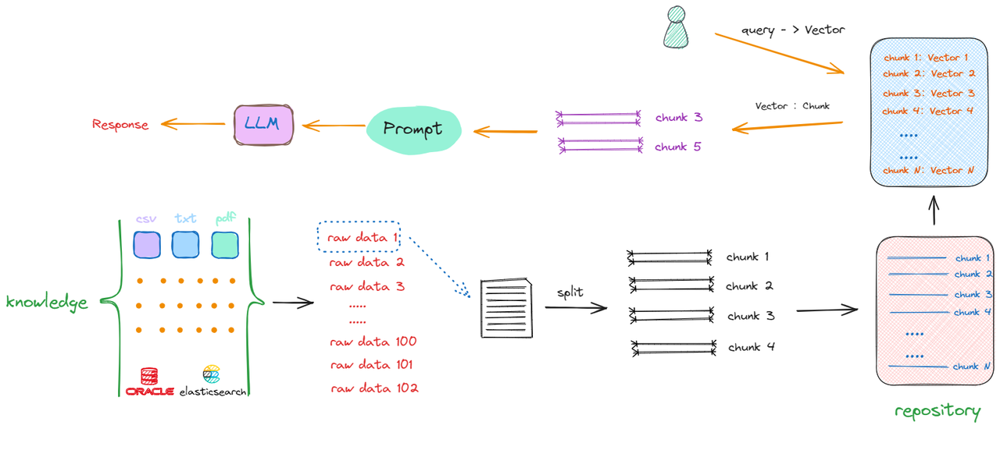

图节选自《大模型与Agent开发实战课》课程RAG板块&#x20;

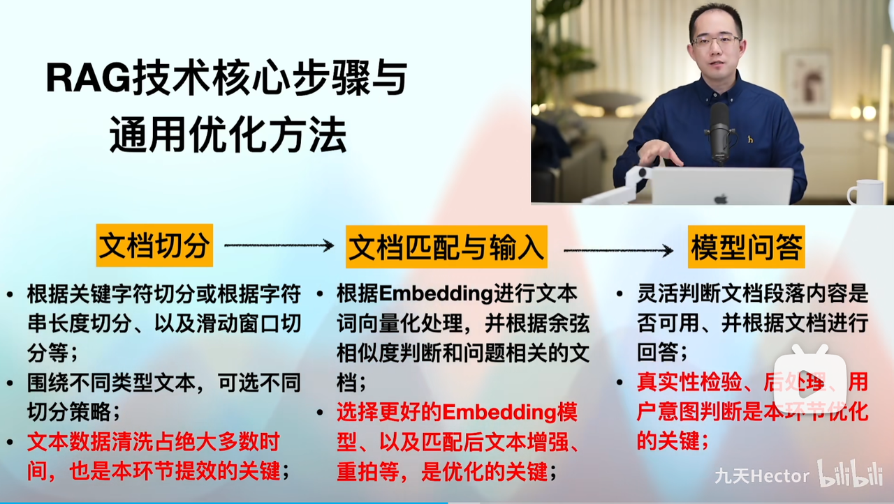

此外，我还开设过RAG专题公开课，详细介绍RAG技术基础概念，并从零开始手把手搭建一个RAG入门系统，感兴趣请戳👉https://www.bilibili.com/video/BV1H22DYqEqV/

  这种传统的 `RAG` 通过 `Text2Vec` 检索的方式通过将生成的响应与现实世界的数据联系起来来减少幻觉，但**准确回答复杂问题是另一回事**。这在于每个文本嵌入都表示非结构化数据集中的一个特定块，通过最近邻算法搜索查找表示在语义上与传入用户查询相似的块的嵌入，这也意味着搜索是语义性的，但仍然高度具体。因此，候选块的质量在很大程度上取决于查询质量。就像翻阅一本食谱书一样。使用关键字搜索“炒鸡蛋”或“西红柿鸡蛋面”并找到说明，它速度很快，对于简单的问题非常有效。但是，如果你对这些菜肴背后的文化背景或是想知道为什么某些成分能够协同作用增加风味感兴趣，仅仅关键字搜索可能就显得力不从心。例如，西红柿和鸡蛋为何能搭配得如此完美？

  同时，对于已经熟悉 `RAG` 的小伙伴来说，可能都会遇到类似的问题：

* 上下文在文本块之间丢失

* 随着检索到的文档的增长，性能会下降

* 基准RAG难以连接不同的信息点。这种情况发生在回答一个问题时，要求通过共享的属性将分散的信息片段连接起来，从而提供新的综合见解。

* 基准RAG在被要求全面理解大规模数据集或单个大型文档中总结出的语义概念时表现较差。

#### 2. GraphRAG技术方案提出

  为了解决这些问题，2024年2月微软研究院正式提出一种基于知识图谱的RAG方法——GraphRAG，这种新方法利用LLM基于私人数据集创建知识图谱。然后，这个图谱与图机器学习技术结合，在查询时执行提示增强。GraphRAG在回答上述两类问题时展现出了显著的提升，显示出超越先前应用于私人数据集的其他方法的智能或掌握能力。

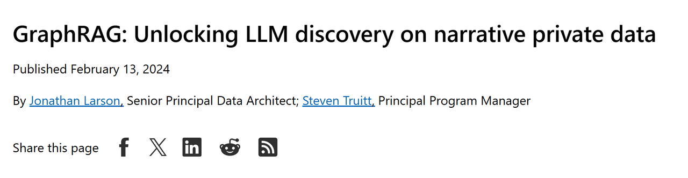

该方法一经推出就受到业内广泛关注，经过一段时间的研究，微软研究院与2024年4月正式发布名为《From Local to Global: A Graph RAG Approach to
Query-Focused Summarization》的论文，详细阐述了GraphRAG方法的基本流程和卓越性能：

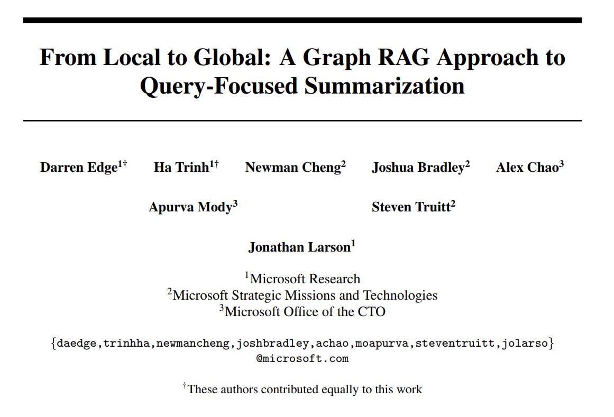

  论文中描述GraphRAG（Graph Retrieval-Augmented Generation）是一种结合图数据库和生成模型的技术，旨在通过构建和查询知识图谱来增强自然语言生成（NLG）的能力。它通过利用知识图谱的结构化信息来为生成模型提供更精确和背景丰富的上下文，从而改进生成模型的表现，尤其在复杂问题解答和文本生成方面。

  在GraphRAG的实现中，首先会进行**索引构建阶段**，其中包含多个步骤：从原始文本中提取实体和关系、进行文本切分、生成实体的嵌入（embedding），并使用图机器学习算法进行聚类，进而构建一个基于实体、关系和社区报告的知识图谱。具体来说，GraphRAG通过分割文本为多个单元（如句子或段落），利用大语言模型（如GPT）进行实体识别和关系挖掘，并为每个实体分配嵌入向量来描述它们的语义信息。接着，GraphRAG通过计算实体之间的关系，填充**关系表**，并生成关于实体的**社区报告**来总结不同实体之间的关联与上下文。

  完成知识图谱构建后，GraphRAG的**查询引擎**阶段才得以启动。用户可以通过自然语言查询来请求图谱中的信息，GraphRAG通过搜索相关文本单元、实体、关系以及社区报告来提供高度相关的上下文信息。查询引擎不仅能基于当前输入的查询返回相关实体和信息，还能进一步通过生成模型生成多段文本回答，从而提供对复杂问题的深度理解。

  GraphRAG的创新在于它通过结合传统的图数据库查询和强大的生成模型，能够在多个领域中提供强大的推理能力，尤其是在需要从大规模文本数据中提取知识的应用中，表现出色。通过灵活的查询和语义嵌入，GraphRAG使得自然语言处理（NLP）不再局限于简单的检索，而是实现了更具推理能力的对话和生成。

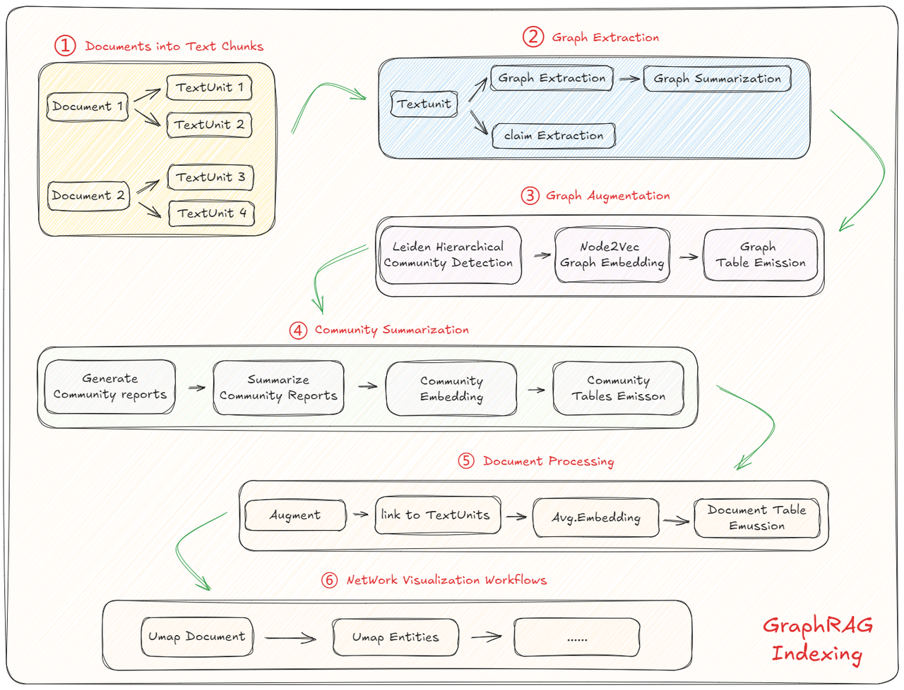

图节选自《大模型与Agent开发实战课》课程RAG板块

#### 3. GraphRAG vs NativeRAG快速实现与效果对比

  目前九天老师团队自研的两款交互式智能编程与问答Agent产品，分别是MateGen Air与MateGen Pro，其中MateGenAir的问答系统就是基于传统RAG进行的构建，而MateGen Pro则是基于GraphRAG构建的问答系统。两款产品均可在JupyterLab中运行，并直接使用pip安装，无需任何网络和硬件门槛即可运行。


##### 3.1 MateGenAir：基于NativeRAG的问答系统性能测试

* MateGenAir安装

  MateGenAir是一款基于JupyterLab的插件，旨在帮助Jupyter环境下的编程人员进行智慧编程以及围绕课程内容进行智能问答，也是付费课程中的智能助教：

```python
!pip install mategenair
```

```plaintext
Looking in indexes: http://mirrors.aliyun.com/pypi/simple
Requirement already satisfied: mategenair in /root/miniconda3/envs/graphrag/lib/python3.11/site-packages (0.2.2)
WARNING: Running pip as the 'root' user can result in broken permissions and conflicting behaviour with the system package manager, possibly rendering your system unusable.It is recommended to use a virtual environment instead: https://pip.pypa.io/warnings/venv. Use the --root-user-action option if you know what you are doing and want to suppress this warning.

```

然后刷新Jupyter页面，然后输入SHIFT+CTRL+C，点击启动MateGenAir即可：

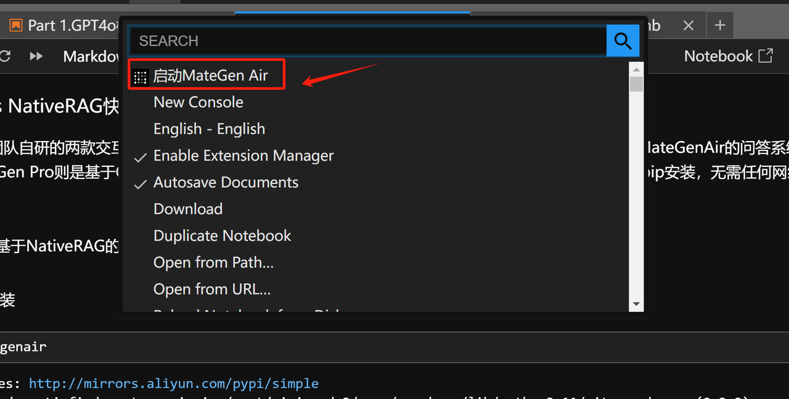

然后选择一个内置知识库进行问答测试：


这个内置知识库里包含了636页九天老师机器学习公开课的内容，知识点覆盖了数十种经典机器学习算法：


文档内包含文字、代码、图片、数据等多种不同类型内容：

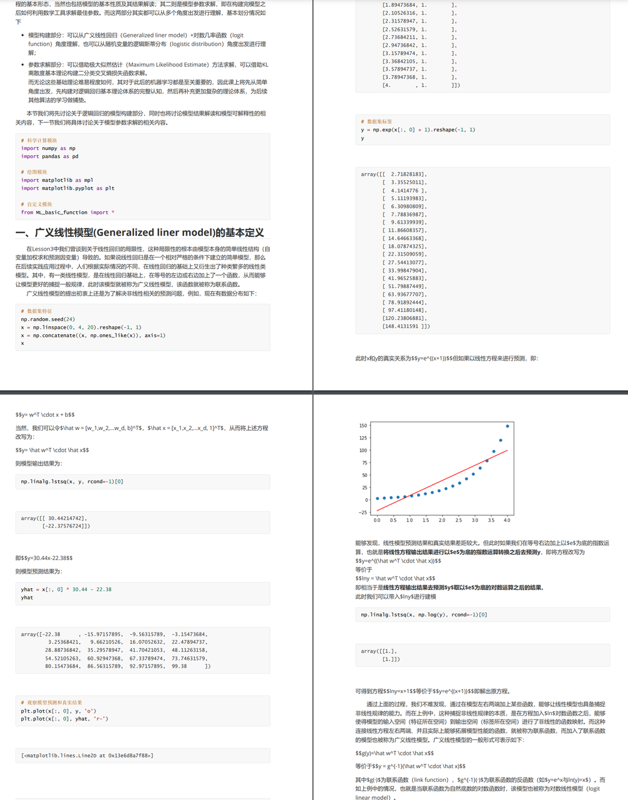

* 问答测试

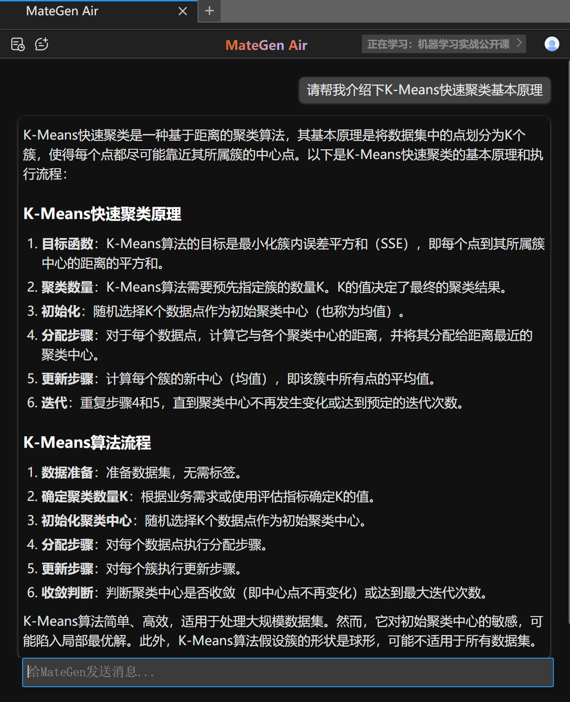

##### 3.2 MateGenPro API：基于GraphRAG的问答系统性能测试

```python
!pip install --upgrade mategen -i https://pypi.org/simple
```

```plaintext
Requirement already satisfied: mategen in /root/miniconda3/envs/graphrag/lib/python3.11/site-packages (0.1.80)
Collecting mategen
  Downloading MateGen-0.1.81-py3-none-any.whl.metadata (13 kB)
Requirement already satisfied: IPython in /root/miniconda3/envs/graphrag/lib/python3.11/site-packages (from mategen) (8.27.0)
Requirement already satisfied: openai>=1.35 in /root/miniconda3/envs/graphrag/lib/python3.11/site-packages (from mategen) (1.55.1)
Requirement already satisfied: matplotlib in /root/miniconda3/envs/graphrag/lib/python3.11/site-packages (from mategen) (3.9.2)
Requirement already satisfied: pandas in /root/miniconda3/envs/graphrag/lib/python3.11/site-packages (from mategen) (2.2.3)
Requirement already satisfied: seaborn in /root/miniconda3/envs/graphrag/lib/python3.11/site-packages (from mategen) (0.13.2)
Requirement already satisfied: oss2 in /root/miniconda3/envs/graphrag/lib/python3.11/site-packages (from mategen) (2.19.1)
Requirement already satisfied: python-dotenv in /root/miniconda3/envs/graphrag/lib/python3.11/site-packages (from mategen) (1.0.1)
Requirement already satisfied: pymysql in /root/miniconda3/envs/graphrag/lib/python3.11/site-packages (from mategen) (1.1.1)
Requirement already satisfied: requests in /root/miniconda3/envs/graphrag/lib/python3.11/site-packages (from mategen) (2.32.3)
Requirement already satisfied: google-api-python-client in /root/miniconda3/envs/graphrag/lib/python3.11/site-packages (from mategen) (2.154.0)
Requirement already satisfied: google-auth in /root/miniconda3/envs/graphrag/lib/python3.11/site-packages (from mategen) (2.36.0)
Requirement already satisfied: google-auth-oauthlib in /root/miniconda3/envs/graphrag/lib/python3.11/site-packages (from mategen) (1.2.1)
Requirement already satisfied: beautifulsoup4 in /root/miniconda3/envs/graphrag/lib/python3.11/site-packages (from mategen) (4.12.3)
Requirement already satisfied: python-dateutil in /root/miniconda3/envs/graphrag/lib/python3.11/site-packages (from mategen) (2.9.0.post0)
Requirement already satisfied: tiktoken in /root/miniconda3/envs/graphrag/lib/python3.11/site-packages (from mategen) (0.7.0)
Requirement already satisfied: lxml in /root/miniconda3/envs/graphrag/lib/python3.11/site-packages (from mategen) (5.3.0)
Requirement already satisfied: cryptography in /root/miniconda3/envs/graphrag/lib/python3.11/site-packages (from mategen) (43.0.3)
Requirement already satisfied: numpy in /root/miniconda3/envs/graphrag/lib/python3.11/site-packages (from mategen) (1.26.4)
Requirement already satisfied: html2text in /root/miniconda3/envs/graphrag/lib/python3.11/site-packages (from mategen) (2024.2.26)
Requirement already satisfied: nbconvert in /root/miniconda3/envs/graphrag/lib/python3.11/site-packages (from mategen) (7.16.4)
Requirement already satisfied: anyio<5,>=3.5.0 in /root/miniconda3/envs/graphrag/lib/python3.11/site-packages (from openai>=1.35->mategen) (4.6.2)
Requirement already satisfied: distro<2,>=1.7.0 in /root/miniconda3/envs/graphrag/lib/python3.11/site-packages (from openai>=1.35->mategen) (1.9.0)
Requirement already satisfied: httpx<1,>=0.23.0 in /root/miniconda3/envs/graphrag/lib/python3.11/site-packages (from openai>=1.35->mategen) (0.27.0)
Requirement already satisfied: jiter<1,>=0.4.0 in /root/miniconda3/envs/graphrag/lib/python3.11/site-packages (from openai>=1.35->mategen) (0.7.1)
Requirement already satisfied: pydantic<3,>=1.9.0 in /root/miniconda3/envs/graphrag/lib/python3.11/site-packages (from openai>=1.35->mategen) (2.10.1)
Requirement already satisfied: sniffio in /root/miniconda3/envs/graphrag/lib/python3.11/site-packages (from openai>=1.35->mategen) (1.3.0)
Requirement already satisfied: tqdm>4 in /root/miniconda3/envs/graphrag/lib/python3.11/site-packages (from openai>=1.35->mategen) (4.67.1)
Requirement already satisfied: typing-extensions<5,>=4.11 in /root/miniconda3/envs/graphrag/lib/python3.11/site-packages (from openai>=1.35->mategen) (4.12.2)
Requirement already satisfied: soupsieve>1.2 in /root/miniconda3/envs/graphrag/lib/python3.11/site-packages (from beautifulsoup4->mategen) (2.5)
Requirement already satisfied: cffi>=1.12 in /root/miniconda3/envs/graphrag/lib/python3.11/site-packages (from cryptography->mategen) (1.17.1)
Requirement already satisfied: httplib2<1.dev0,>=0.19.0 in /root/miniconda3/envs/graphrag/lib/python3.11/site-packages (from google-api-python-client->mategen) (0.22.0)
Requirement already satisfied: google-auth-httplib2<1.0.0,>=0.2.0 in /root/miniconda3/envs/graphrag/lib/python3.11/site-packages (from google-api-python-client->mategen) (0.2.0)
Requirement already satisfied: google-api-core!=2.0.*,!=2.1.*,!=2.2.*,!=2.3.0,<3.0.0.dev0,>=1.31.5 in /root/miniconda3/envs/graphrag/lib/python3.11/site-packages (from google-api-python-client->mategen) (2.23.0)
Requirement already satisfied: uritemplate<5,>=3.0.1 in /root/miniconda3/envs/graphrag/lib/python3.11/site-packages (from google-api-python-client->mategen) (4.1.1)
Requirement already satisfied: cachetools<6.0,>=2.0.0 in /root/miniconda3/envs/graphrag/lib/python3.11/site-packages (from google-auth->mategen) (5.5.0)
Requirement already satisfied: pyasn1-modules>=0.2.1 in /root/miniconda3/envs/graphrag/lib/python3.11/site-packages (from google-auth->mategen) (0.4.1)
Requirement already satisfied: rsa<5,>=3.1.4 in /root/miniconda3/envs/graphrag/lib/python3.11/site-packages (from google-auth->mategen) (4.9)
Requirement already satisfied: requests-oauthlib>=0.7.0 in /root/miniconda3/envs/graphrag/lib/python3.11/site-packages (from google-auth-oauthlib->mategen) (2.0.0)
Requirement already satisfied: decorator in /root/miniconda3/envs/graphrag/lib/python3.11/site-packages (from IPython->mategen) (5.1.1)
Requirement already satisfied: jedi>=0.16 in /root/miniconda3/envs/graphrag/lib/python3.11/site-packages (from IPython->mategen) (0.19.1)
Requirement already satisfied: matplotlib-inline in /root/miniconda3/envs/graphrag/lib/python3.11/site-packages (from IPython->mategen) (0.1.6)
Requirement already satisfied: prompt-toolkit<3.1.0,>=3.0.41 in /root/miniconda3/envs/graphrag/lib/python3.11/site-packages (from IPython->mategen) (3.0.43)
Requirement already satisfied: pygments>=2.4.0 in /root/miniconda3/envs/graphrag/lib/python3.11/site-packages (from IPython->mategen) (2.15.1)
Requirement already satisfied: stack-data in /root/miniconda3/envs/graphrag/lib/python3.11/site-packages (from IPython->mategen) (0.2.0)
Requirement already satisfied: traitlets>=5.13.0 in /root/miniconda3/envs/graphrag/lib/python3.11/site-packages (from IPython->mategen) (5.14.3)
Requirement already satisfied: pexpect>4.3 in /root/miniconda3/envs/graphrag/lib/python3.11/site-packages (from IPython->mategen) (4.8.0)
Requirement already satisfied: contourpy>=1.0.1 in /root/miniconda3/envs/graphrag/lib/python3.11/site-packages (from matplotlib->mategen) (1.3.1)
Requirement already satisfied: cycler>=0.10 in /root/miniconda3/envs/graphrag/lib/python3.11/site-packages (from matplotlib->mategen) (0.12.1)
Requirement already satisfied: fonttools>=4.22.0 in /root/miniconda3/envs/graphrag/lib/python3.11/site-packages (from matplotlib->mategen) (4.55.0)
Requirement already satisfied: kiwisolver>=1.3.1 in /root/miniconda3/envs/graphrag/lib/python3.11/site-packages (from matplotlib->mategen) (1.4.7)
Requirement already satisfied: packaging>=20.0 in /root/miniconda3/envs/graphrag/lib/python3.11/site-packages (from matplotlib->mategen) (24.1)
Requirement already satisfied: pillow>=8 in /root/miniconda3/envs/graphrag/lib/python3.11/site-packages (from matplotlib->mategen) (11.0.0)
Requirement already satisfied: pyparsing>=2.3.1 in /root/miniconda3/envs/graphrag/lib/python3.11/site-packages (from matplotlib->mategen) (3.2.0)
Requirement already satisfied: six>=1.5 in /root/miniconda3/envs/graphrag/lib/python3.11/site-packages (from python-dateutil->mategen) (1.16.0)
Requirement already satisfied: bleach!=5.0.0 in /root/miniconda3/envs/graphrag/lib/python3.11/site-packages (from nbconvert->mategen) (6.2.0)
Requirement already satisfied: defusedxml in /root/miniconda3/envs/graphrag/lib/python3.11/site-packages (from nbconvert->mategen) (0.7.1)
Requirement already satisfied: jinja2>=3.0 in /root/miniconda3/envs/graphrag/lib/python3.11/site-packages (from nbconvert->mategen) (3.1.4)
Requirement already satisfied: jupyter-core>=4.7 in /root/miniconda3/envs/graphrag/lib/python3.11/site-packages (from nbconvert->mategen) (5.7.2)
Requirement already satisfied: jupyterlab-pygments in /root/miniconda3/envs/graphrag/lib/python3.11/site-packages (from nbconvert->mategen) (0.1.2)
Requirement already satisfied: markupsafe>=2.0 in /root/miniconda3/envs/graphrag/lib/python3.11/site-packages (from nbconvert->mategen) (2.1.3)
Requirement already satisfied: mistune<4,>=2.0.3 in /root/miniconda3/envs/graphrag/lib/python3.11/site-packages (from nbconvert->mategen) (2.0.4)
Requirement already satisfied: nbclient>=0.5.0 in /root/miniconda3/envs/graphrag/lib/python3.11/site-packages (from nbconvert->mategen) (0.8.0)
Requirement already satisfied: nbformat>=5.7 in /root/miniconda3/envs/graphrag/lib/python3.11/site-packages (from nbconvert->mategen) (5.10.4)
Requirement already satisfied: pandocfilters>=1.4.1 in /root/miniconda3/envs/graphrag/lib/python3.11/site-packages (from nbconvert->mategen) (1.5.0)
Requirement already satisfied: tinycss2 in /root/miniconda3/envs/graphrag/lib/python3.11/site-packages (from nbconvert->mategen) (1.2.1)
Requirement already satisfied: crcmod>=1.7 in /root/miniconda3/envs/graphrag/lib/python3.11/site-packages (from oss2->mategen) (1.7)
Requirement already satisfied: pycryptodome>=3.4.7 in /root/miniconda3/envs/graphrag/lib/python3.11/site-packages (from oss2->mategen) (3.21.0)
Requirement already satisfied: aliyun-python-sdk-kms>=2.4.1 in /root/miniconda3/envs/graphrag/lib/python3.11/site-packages (from oss2->mategen) (2.16.5)
Requirement already satisfied: aliyun-python-sdk-core>=2.13.12 in /root/miniconda3/envs/graphrag/lib/python3.11/site-packages (from oss2->mategen) (2.16.0)
Requirement already satisfied: charset-normalizer<4,>=2 in /root/miniconda3/envs/graphrag/lib/python3.11/site-packages (from requests->mategen) (3.3.2)
Requirement already satisfied: idna<4,>=2.5 in /root/miniconda3/envs/graphrag/lib/python3.11/site-packages (from requests->mategen) (3.7)
Requirement already satisfied: urllib3<3,>=1.21.1 in /root/miniconda3/envs/graphrag/lib/python3.11/site-packages (from requests->mategen) (2.2.3)
Requirement already satisfied: certifi>=2017.4.17 in /root/miniconda3/envs/graphrag/lib/python3.11/site-packages (from requests->mategen) (2024.8.30)
Requirement already satisfied: pytz>=2020.1 in /root/miniconda3/envs/graphrag/lib/python3.11/site-packages (from pandas->mategen) (2024.1)
Requirement already satisfied: tzdata>=2022.7 in /root/miniconda3/envs/graphrag/lib/python3.11/site-packages (from pandas->mategen) (2024.2)
Requirement already satisfied: regex>=2022.1.18 in /root/miniconda3/envs/graphrag/lib/python3.11/site-packages (from tiktoken->mategen) (2024.11.6)
Requirement already satisfied: jmespath<1.0.0,>=0.9.3 in /root/miniconda3/envs/graphrag/lib/python3.11/site-packages (from aliyun-python-sdk-core>=2.13.12->oss2->mategen) (0.10.0)
Requirement already satisfied: webencodings in /root/miniconda3/envs/graphrag/lib/python3.11/site-packages (from bleach!=5.0.0->nbconvert->mategen) (0.5.1)
Requirement already satisfied: pycparser in /root/miniconda3/envs/graphrag/lib/python3.11/site-packages (from cffi>=1.12->cryptography->mategen) (2.21)
Requirement already satisfied: googleapis-common-protos<2.0.dev0,>=1.56.2 in /root/miniconda3/envs/graphrag/lib/python3.11/site-packages (from google-api-core!=2.0.*,!=2.1.*,!=2.2.*,!=2.3.0,<3.0.0.dev0,>=1.31.5->google-api-python-client->mategen) (1.66.0)
Requirement already satisfied: protobuf!=3.20.0,!=3.20.1,!=4.21.0,!=4.21.1,!=4.21.2,!=4.21.3,!=4.21.4,!=4.21.5,<6.0.0.dev0,>=3.19.5 in /root/miniconda3/envs/graphrag/lib/python3.11/site-packages (from google-api-core!=2.0.*,!=2.1.*,!=2.2.*,!=2.3.0,<3.0.0.dev0,>=1.31.5->google-api-python-client->mategen) (5.28.3)
Requirement already satisfied: proto-plus<2.0.0dev,>=1.22.3 in /root/miniconda3/envs/graphrag/lib/python3.11/site-packages (from google-api-core!=2.0.*,!=2.1.*,!=2.2.*,!=2.3.0,<3.0.0.dev0,>=1.31.5->google-api-python-client->mategen) (1.25.0)
Requirement already satisfied: httpcore==1.* in /root/miniconda3/envs/graphrag/lib/python3.11/site-packages (from httpx<1,>=0.23.0->openai>=1.35->mategen) (1.0.2)
Requirement already satisfied: h11<0.15,>=0.13 in /root/miniconda3/envs/graphrag/lib/python3.11/site-packages (from httpcore==1.*->httpx<1,>=0.23.0->openai>=1.35->mategen) (0.14.0)
Requirement already satisfied: parso<0.9.0,>=0.8.3 in /root/miniconda3/envs/graphrag/lib/python3.11/site-packages (from jedi>=0.16->IPython->mategen) (0.8.3)
Requirement already satisfied: platformdirs>=2.5 in /root/miniconda3/envs/graphrag/lib/python3.11/site-packages (from jupyter-core>=4.7->nbconvert->mategen) (3.10.0)
Requirement already satisfied: jupyter-client>=6.1.12 in /root/miniconda3/envs/graphrag/lib/python3.11/site-packages (from nbclient>=0.5.0->nbconvert->mategen) (8.6.0)
Requirement already satisfied: fastjsonschema>=2.15 in /root/miniconda3/envs/graphrag/lib/python3.11/site-packages (from nbformat>=5.7->nbconvert->mategen) (2.20.0)
Requirement already satisfied: jsonschema>=2.6 in /root/miniconda3/envs/graphrag/lib/python3.11/site-packages (from nbformat>=5.7->nbconvert->mategen) (4.23.0)
Requirement already satisfied: ptyprocess>=0.5 in /root/miniconda3/envs/graphrag/lib/python3.11/site-packages (from pexpect>4.3->IPython->mategen) (0.7.0)
Requirement already satisfied: wcwidth in /root/miniconda3/envs/graphrag/lib/python3.11/site-packages (from prompt-toolkit<3.1.0,>=3.0.41->IPython->mategen) (0.2.5)
Requirement already satisfied: pyasn1<0.7.0,>=0.4.6 in /root/miniconda3/envs/graphrag/lib/python3.11/site-packages (from pyasn1-modules>=0.2.1->google-auth->mategen) (0.6.1)
Requirement already satisfied: annotated-types>=0.6.0 in /root/miniconda3/envs/graphrag/lib/python3.11/site-packages (from pydantic<3,>=1.9.0->openai>=1.35->mategen) (0.7.0)
Requirement already satisfied: pydantic-core==2.27.1 in /root/miniconda3/envs/graphrag/lib/python3.11/site-packages (from pydantic<3,>=1.9.0->openai>=1.35->mategen) (2.27.1)
Requirement already satisfied: oauthlib>=3.0.0 in /root/miniconda3/envs/graphrag/lib/python3.11/site-packages (from requests-oauthlib>=0.7.0->google-auth-oauthlib->mategen) (3.2.2)
Requirement already satisfied: executing in /root/miniconda3/envs/graphrag/lib/python3.11/site-packages (from stack-data->IPython->mategen) (2.1.0)
Requirement already satisfied: asttokens in /root/miniconda3/envs/graphrag/lib/python3.11/site-packages (from stack-data->IPython->mategen) (2.0.5)
Requirement already satisfied: pure-eval in /root/miniconda3/envs/graphrag/lib/python3.11/site-packages (from stack-data->IPython->mategen) (0.2.2)
Requirement already satisfied: attrs>=22.2.0 in /root/miniconda3/envs/graphrag/lib/python3.11/site-packages (from jsonschema>=2.6->nbformat>=5.7->nbconvert->mategen) (24.2.0)
Requirement already satisfied: jsonschema-specifications>=2023.03.6 in /root/miniconda3/envs/graphrag/lib/python3.11/site-packages (from jsonschema>=2.6->nbformat>=5.7->nbconvert->mategen) (2023.7.1)
Requirement already satisfied: referencing>=0.28.4 in /root/miniconda3/envs/graphrag/lib/python3.11/site-packages (from jsonschema>=2.6->nbformat>=5.7->nbconvert->mategen) (0.30.2)
Requirement already satisfied: rpds-py>=0.7.1 in /root/miniconda3/envs/graphrag/lib/python3.11/site-packages (from jsonschema>=2.6->nbformat>=5.7->nbconvert->mategen) (0.10.6)
Requirement already satisfied: pyzmq>=23.0 in /root/miniconda3/envs/graphrag/lib/python3.11/site-packages (from jupyter-client>=6.1.12->nbclient>=0.5.0->nbconvert->mategen) (25.1.2)
Requirement already satisfied: tornado>=6.2 in /root/miniconda3/envs/graphrag/lib/python3.11/site-packages (from jupyter-client>=6.1.12->nbclient>=0.5.0->nbconvert->mategen) (6.4.1)
Downloading MateGen-0.1.81-py3-none-any.whl (42 kB)
Installing collected packages: mategen
  Attempting uninstall: mategen
    Found existing installation: MateGen 0.1.80
    Uninstalling MateGen-0.1.80:
      Successfully uninstalled MateGen-0.1.80
Successfully installed mategen-0.1.81
WARNING: Running pip as the 'root' user can result in broken permissions and conflicting behaviour with the system package manager, possibly rendering your system unusable.It is recommended to use a virtual environment instead: https://pip.pypa.io/warnings/venv. Use the --root-user-action option if you know what you are doing and want to suppress this warning.

```

```python
import MateGen
from MateGen import *
```

```python
mategen = MateGenClass(api_key = 'YOUR_API_KEY', 
                       enhanced_mode = True)
```

```plaintext
正在初始化MateGen，请稍后...
成功连接服务器，API-KEY通过验证！
已完成初始化，MateGen可随时调用！
```


```python
mategen.chat("你好，很高兴见到你！请介绍下你自己。")
```

▌ MateGen初始化完成，欢迎使用！

**MateGen**:当然可以！我是MateGen，一个由九天老师大模型技术团队开发的交互式智能编程助手。我专门设计用于帮助数据技术人员高效、稳定地完成编程工作。以下是我的一些核心能力：

1. **无限对话上下文记忆**：我能记住我们之间的对话内容，在随后的对话中使信息传递更加顺畅。

2. **知识库问答**：我可以在本地的知识库中进行信息检索，并回答用户提出的问题。

3. **代码功能**：我能够编写和执行Python代码、生成SQL查询语句，从而协助完成编程和数据提取任务。

4. **多模态能力**：可以处理图片，回答关于图片的信息识别问题。

5. **联网搜索**：当我的知识库没有直接答案时，我可以联网搜索，从网上获取相关信息并提供参考答案。

6. **Kaggle竞赛辅导**：我能够帮助用户参与和理解Kaggle竞赛。

7. **论文解读和数据分析报告**：我也可以辅导用户撰写相关的专业文档。

如果你有任何问题或者需要帮助的地方，请随时告诉我！

```python
mategen = MateGenClass(api_key = 'YOUR_API_KEY', 
                       enhanced_mode = True, 
                       knowledge_base_chat=True)
```

```plaintext
正在初始化MateGen，请稍后...
成功连接服务器，API-KEY通过验证！


请输入知识库名称，输入0查询当前知识库列表。 ML


正在创建知识库文件夹
当前问答知识库文件夹路径：/root/knowledge_base/ML，请在文件夹中放置知识库文件。
目前支持PDF、Word、PPT、md等格式读取与检索。
已完成初始化，MateGen可随时调用！
```

```python
mategen.chat('请结合你的知识库，帮我介绍下K-Means快速聚类基本原理')
```

```plaintext
正在创建知识库，请稍后...
正在创建知识库的向量存储，请稍后...
已更新知识库：ML的相关描述
知识库创建完成！
已成功更新知识库ML
```

▌ MateGen初始化完成，欢迎使用！

**MateGen**:K-Means快速聚类算法是一种常用的无监督学习算法，用于将数据点分为K个簇，具体过程如下：

1. **算法概述**：

   * 算法的核心思想是将相似的数据点归为同一个簇，每个簇由其质心（centroid）代表。

   * K-Means聚类的目标是最小化各个数据点到簇质心的平方距离总和，这被称为组内平方和误差（Sum of Squared Errors, SSE）【8:10†Lesson 7.1 无监督学习算法与K-Means快速聚类.pdf】。

2. **基本流程**：

   * 随机选择K个初始中心点。

   * 计算每个数据点到所有中心点的距离，将数据点分配到距离最近的中心点对应的簇。

   * 重新计算每个簇的质心为簇中所有数据点的均值。

   * 重复上述两步，直到质心不再变化或达到迭代次数上限，这意味着模型已经收敛【8:10†Lesson 7.1 无监督学习算法与K-Means快速聚类.pdf】。

3. **数学公式**：

   * 质心的数学表示为其簇内所有数据点的平均值：
     \[
     c\_i = \frac{1}{m\_i}\sum\_{x \in C\_i}x
     ]

   * 这种方法能够确保SSE以最快的速度下降【8:12†Lesson 7.1 无监督学习算法与K-Means快速聚类.pdf】。

4. **挑战与解决方案**：

   * 初始中心点的选择对最终结果影响较大，可能导致局部最小值问题。

   * Scikit-learn通过使用k-means++算法和多次运行选择最优初始中心点来减轻这一问题【8:18†Lesson 7.1 无监督学习算法与K-Means快速聚类.pdf】。

5. **应用**：

   * 在Scikit-learn库中，K-Means聚类可通过`KMeans`类实现。该类提供了选择K的便捷方法，同时也允许设定最大迭代次数等参数【8:18†Lesson 7.1 无监督学习算法与K-Means快速聚类.pdf】。

通过这些步骤，K-Means能有效地对数据进行分群，但由于其需要预先指定K和对参数选择的敏感性，有时需要数据分析人员结合领域知识来选择合理的K值。

* 总结性&综合性问题问答

Q:现在你的知识库里面的内容是九天老师机器学习公开课的课件，其中总共介绍了多少种机器学习算法？

NativeRAG回答如下：

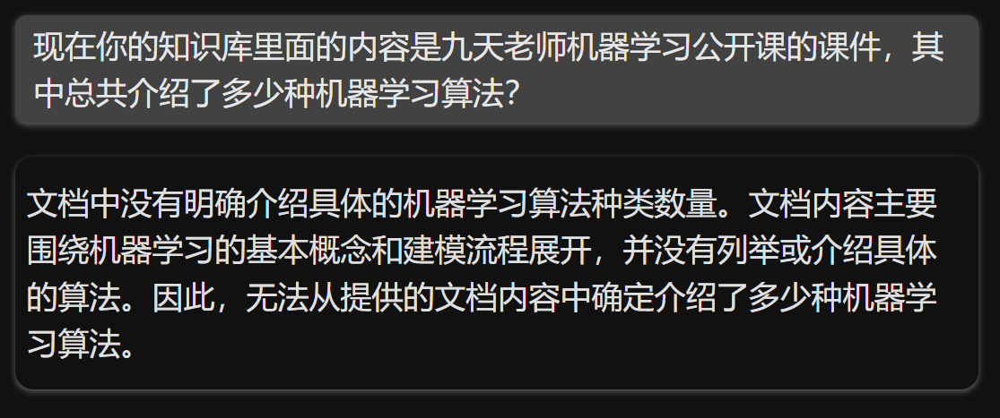

GraphRAG回答如下：

```python
mategen.chat('现在你的知识库里面的内容是九天老师机器学习公开课的课件，其中总共介绍了多少种机器学习算法？')
```

▌ MateGen初始化完成，欢迎使用！

**MateGen**:在九天老师的机器学习公开课课件中，介绍了以下几种机器学习算法：

1. **K-Means聚类**（包括K-Means和Mini Batch K-Means）。

2. **DBSCAN密度聚类**。

3. **线性回归**。

4. **逻辑回归**。

5. **决策树算法**（包括ID3、C4.5和CART分类树、CART回归树）。

因此，总共介绍了大约五种不同类型的机器学习算法。这些算法涵盖了监督学习（如线性回归、逻辑回归和决策树）和无监督学习（如K-Means和DBSCAN聚类）的基本模型。

* 评价类问题

Q:你觉得九天老师的机器学习公开课质量如何？

NativeRAG回答如下：

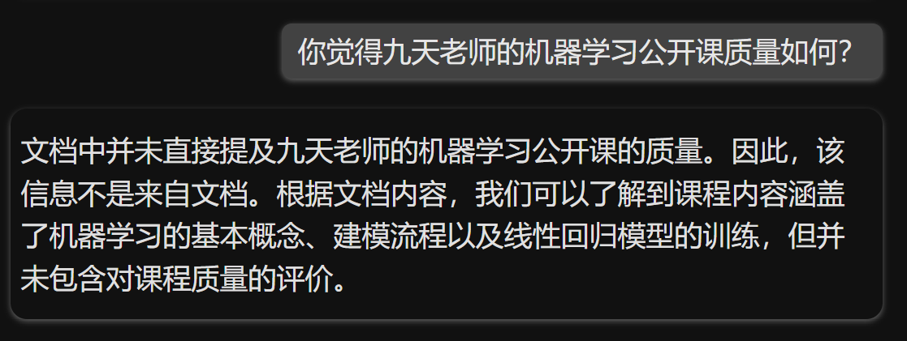

GraphRAG回答如下：

```python
mategen.chat('你觉得九天老师的机器学习公开课质量如何？')
```

▌ MateGen初始化完成，欢迎使用！

根据知识库中九天老师的机器学习公开课课件，九天老师的公开课质量非常高，以下几点可以充分说明：

1. **深入的理论分析**：

   * 九天老师涵盖了丰富的理论内容，包括机器学习基本概念与建模流程【12:8†source】、 sklearn调参的理论基础与网格搜索【12:1†source】、梯度下降优化基础【12:12†source】等，涉及广泛且细致入微。

2. **详细的建模流程**：

   * 课程涵盖了实际的建模步骤和实验过程，如线性回归的手动建模实验【12:5†source】、决策树的核心思想与建模流程【12:3†source】等，不仅提供了理论基础，还指导了实际操作的具体步骤。

3. **丰富的算法内容**：

   * 九天老师的课程不仅介绍了基本的线性回归和决策树算法，还详细讨论了分类模型的决策边界与评估指标【12:17†source】，特别是在决策树算法方面，还讨论了不同版本的决策树算法如ID3、C4.5和CART等【12:4†source】。

4. **高级话题与实践指导**：

   * 课程还涉及了高级话题，如机器学习中的模型结果可信度与交叉验证方法【12:16†source】，以及数据归一化与学习率调度等优化步骤【12:13†source】。

5. **理论结合实践**：

   * 课程中所涉及的每个理论 都有对应的实践环节，每章的pdf课件详细列出了具体的实验步骤和所需的数据集生成、模型训练等操作，确保学员能够在实际操作中理解并应用所学的理论知识【12:19†source】。

从以上各方面来看，九天老师的机器学习公开课无论是在理论深度、实践指导，还是在内容的广度和细致程度上，都显示出极高的教学质量，是非常值得学习的课程。

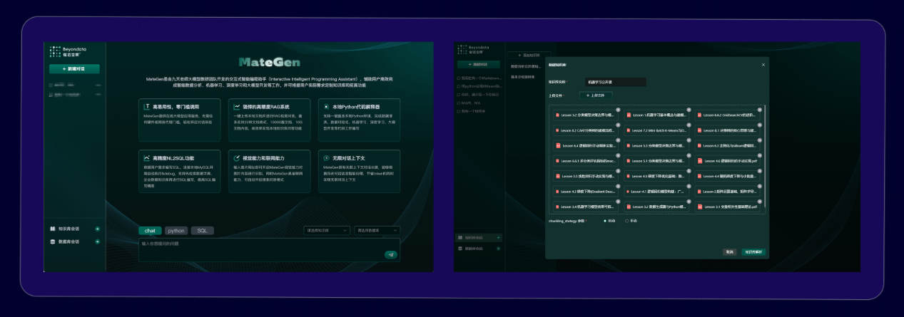

##### 3.3 GraphRAG对于NativeRAG性能优势

  能够非常明显的看出，GraphRAG与传统的基准RAG模型相比，在多个评价指标上都展现了明显的优势。

* **全面性**：指的是回答的完整性，是否涵盖了问题的隐含上下文。GraphRAG不仅回答了问题的直接内容，还能从上下文中提取相关信息进行补充，提升回答的全面性。

* **人类赋能（human enfranchisement）**：指的是是否提供了支持性源材料或其他上下文信息，这对于验证答案的准确性至关重要。GraphRAG在这方面能够提供更多的上下文支持，帮助用户理解回答的背景。

* **多样性**：指的是回答中是否包含了不同的观点或角度。GraphRAG在多样性上的表现优于传统的RAG，能够提供更多元的视角，这对于复杂问题尤为重要。

### 二、GraphRAG原理详解


#### 1.GraphRAG整体流程介绍

  `GraphRAG`通过利用大模型从原始文本数据中提取知识图谱来满足跨上下文检索的需求。该知识图将信息表示为互连实体和关系的网络，与简单的文本片段相比，提供了更丰富的数据表示。这种结构化表示使 `GraphRAG` 能够擅长回答需要推理和连接不同信息的复杂问题。具体来看，`GraphRAG` 定义了一个标准化数据模型，整体框架由几个关键组件组成，分别用于表示文档、TextUnit、实体、关系和社区报告等实体。像传统`RAG`一样，**`GraphRAG` 过程也涉及两个主要阶段：索引和查询**。我们依次展开来进行讨论。

  在索引（Indexing）过程中，输入的文本被分为可管理的块，称为`TextUnits` 。然后大模型从这些文本单元中提取实体、关系和声明，形成知识图。完整的`Indexing`流程如下图所示：


#### 2. **GraphRAG 索引阶段执行流程**

Step 1. **文本切分（Text Unit Splitting）**

* GraphRAG 需要处理的是一大篇文档或语料库。首先，它会将这些文档切分为 **Text Units**（文本单元），这些 Text Units 是对输入文档的细分，通常是按照段落、句子或固定长度的文本块来进行切分。

* 这样做的目的是为了便于对文本内容进行分析，尤其是当需要进行 **实体识别** 和 **关系抽取** 时，能够精准地关联到文档中的具体上下文。

Step 2. **实体识别（Entity Extraction）**

* 在文本切分之后，GraphRAG 会使用 **大模型（如 OpenAI GPT 或其他 LLM）** 对每个 Text Unit 进行处理，提取其中的 **实体**。这些实体通常是指文档中出现的人物、地点、组织、概念等信息。

* 实体识别的目的是构建 **实体图谱（Entity Graph）**，将所有实体提取出来并为后续的关系挖掘和查询做准备。

Step 3. **关系挖掘（Relationship Extraction）**

* 关系挖掘是从文本中识别出实体之间的 **关系**，例如：谁与谁有关联、某个实体与另一个实体之间的关系是“属于”、“合作”、“对立”等。

* 通过这种关系提取，GraphRAG 可以构建 **关系图谱（Relationship Graph）**，这些关系将有助于后续的 **查询引擎** 理解和推理。

Step 4. **文本嵌入（Text Embedding）**

* 在识别了文本中的实体和关系之后，GraphRAG 会利用 **嵌入模型**（如 OpenAI 的 Embedding 模型）将文本和实体表示为向量（vectors）。这些向量不仅包括了文本的语义信息，还能为后续的检索和查询提供高效的表示。

* 这些嵌入向量将存储在 **向量数据库**（如 LanceDB）中，为查询时提供快速的相似度搜索。

Step 5. **构建社区和层级结构（Community and Hierarchical Clustering）**

* 通过使用 **图谱聚类算法**（如 Leiden 算法），GraphRAG 会将不同的实体和关系分组，形成多个 **社区**（Community）。这些社区是根据实体之间的相似度或关系的密切程度进行划分的。

* 这种分组帮助 GraphRAG 更好地理解不同知识领域的结构，为查询时提供更具层次性的上下文信息。

Step 6. **生成索引文件（Indexing）**

* 完成上述步骤后，所有的 **实体**、**关系**、**社区报告**、**文本单元**等信息都会存储在磁盘上的 Parquet 文件中。

* 这些索引文件实际上就是构建好的 **知识图谱**，包括了文本内容、文本中涉及的实体和关系的结构化表示，并且这些文件是为后续的查询引擎和推理过程提供基础。

总的来说GraphRAG 的 **索引阶段** 是一个 **多步骤** 的过程，基本流程是：

1. **文本切分**（Text Units）

2. **实体识别**（Entity Extraction）

3. **关系挖掘**（Relationship Extraction）

4. **文本嵌入**（Text Embedding）

5. **社区划分和层级结构**（Clustering）

6. **生成索引文件**（Indexing）

整个过程的目的是将文档中的原始文本转化为可以进行检索和推理的结构化知识图谱。而 **实体识别** 和 **关系挖掘** 通常是在文本切分之后进行的，因为需要先确保文本已经切分成足够小的单元才能进行更精细的分析和抽取。

#### **3.GraphRAG索引阶段流程详解**

* 示例文本

《大数据时代》是一本由维克托·迈尔-舍恩伯格与肯尼斯·库克耶合著的书籍，讨论了如何在海量数据中挖掘出有价值的信息。这本书深入探讨了数据科学的应用，并阐述了数据分析和预测在各行各业中的影响力。在书中，作者举了许多实际例子，说明大数据如何改变我们的生活，甚至如何预测未来的趋势。

#### **Step 1.文本切分**

假设的切分结果（按50个token分割）：

**文本单元1**：

* `text`：`《大数据时代》是一本由维克托·迈尔-舍恩伯格与肯尼斯·库克耶合著的书籍，讨论了如何在海量数据中挖掘出有价值的信息。`

**文本单元2**：

* `text`：`这本书深入探讨了数据科学的应用，并阐述了数据分析和预测在各行各业中的影响力。`

**文本单元3**：

* `text`：`在书中，作者举了许多实际例子，说明大数据如何改变我们的生活，甚至如何预测未来的趋势。`

然后即可将上述切分结果记录在某张表内，例如我们将其命名为TEXT\_UNIT\_TABLE，则表内容如下：

| id | human\_readable\_id | text                                                      | n\_tokens | document\_ids |
| -- | ------------------- | --------------------------------------------------------- | --------- | ------------- |
| t1 | text\_unit\_1       | 《大数据时代》是一本由维克托·迈尔-舍恩伯格与肯尼斯·库克耶合著的书籍，讨论了如何在海量数据中挖掘出有价值的信息。 | 50        | doc\_1        |
| t2 | text\_unit\_2       | 这本书深入探讨了数据科学的应用，并阐述了数据分析和预测在各行各业中的影响力。                    | 50        | doc\_1        |
| t3 | text\_unit\_3       | 在书中，作者举了许多实际例子，说明大数据如何改变我们的生活，甚至如何预测未来的趋势。                | 50        | doc\_1        |

#### **Step 2.实体识别**

* 实体的定义

  在自然语言处理中，**实体（Entity）通常指的是文本中具有独立存在、能够被明确识别并且具有特定意义的对象。实体通常是指一些特定的名词**，它们代表现实世界中的对象或概念，可以是**人、地点、组织、事件、日期、物品、概念**等。

例如：

1. **人名**：维克托·迈尔-舍恩伯格、肯尼斯·库克耶

2. **地点**：北京、美国

3. **组织名**：微软公司、谷歌

4. **事件**：新冠疫情、2024东京奥运会

5. **日期**：2024年12月、2023年11月

6. **物品**：iPhone、蓝牙耳机

7. **概念**：大数据、机器学习

* 知识图谱中的实体

  在知识图谱中，每个**实体**都有其独特的标识符和属性（例如，姓名、类型、描述等）。这些属性和关系帮助我们理解实体在特定领域中的作用和上下文。实体识别是图谱构建的重要步骤之一。

例如，假设我们有以下句子："维克托·迈尔-舍恩伯格是《大数据时代》一书的作者，他是大数据领域的专家。"

在这个句子中，**实体**包括：

1. **维克托·迈尔-舍恩伯格**（人名）

2. **《大数据时代》**（书名）

3. **大数据领域**（概念）

这些实体在知识图谱中将被标识为节点，并且可以与其他节点（如其他作者、书籍、领域等）通过关系（如“写书”，“属于领域”）连接，形成知识图谱中的一个网络结构。同时，在知识图谱中，实体是基础组成单元，它们通过关系（relationship）连接，构成一个图的结构。实体和关系是构建知识图谱的两个基本元素。实体之间的连接关系定义了图谱中的知识和数据。

* 实体识别的作用

  **实体识别（Entity Recognition）是指从文本中自动识别出这些重要的实体。在GraphRAG的索引阶段**中，实体识别是构建知识图谱的第一步，目标是提取出文档中的核心实体，为后续的关系抽取、文本切分等操作打下基础。

实体识别的过程通常涉及：

1. **命名实体识别（NER，Named Entity Recognition）**：这是一种自然语言处理（NLP）任务，用来识别文本中具有特定意义的实体，如人名、地点、日期等。

2. **实体分类**：在识别实体之后，还需要根据其属性对实体进行分类，例如将"维克托·迈尔-舍恩伯格"分类为"人名"，将"大数据"分类为"概念"。

* GraphRAG中的实体识别

在GraphRAG的索引过程中，实体识别是与文本切分和关系挖掘同时进行的。具体来说：

1. **实体识别**：GraphRAG使用大语言模型（如GPT）识别文本中的实体，并根据其类型为每个实体赋予一个唯一标识符。

2. **实体嵌入**：GraphRAG为每个实体生成**语义嵌入**，即一个高维向量，来描述该实体的语义。实体嵌入可以帮助模型理解实体在不同上下文中的意义和关系。

3. **关系挖掘**：在识别实体之后，GraphRAG还会识别实体之间的**关系**，例如“作者是”、“属于”等。这些关系构成了知识图谱中的**边**，实体则是图谱中的**节点**。

* 示例demo实体识别

假设我们使用和之前相同的示例文本《大数据时代》，并从中提取出两个实体：书籍《大数据时代》和作者维克托·迈尔-舍恩伯格。

| id | human\_readable\_id | title       | type | description                         | text\_unit\_ids |
| -- | ------------------- | ----------- | ---- | ----------------------------------- | --------------- |
| e1 | 大数据时代               | 大数据时代       | 书籍   | 《大数据时代》是一本关于大数据应用的书籍，作者讨论了数据如何改变世界。 | \[0, 1]         |
| e2 | 维克托·迈尔-舍恩伯格         | 维克托·迈尔-舍恩伯格 | 人物   | 维克托·迈尔-舍恩伯格是大数据领域的专家，他是《大数据时代》的合著者。 | \[0, 1]         |
| e3 | 肯尼斯·库克耶             | 肯尼斯·库克耶     | 人物   | 肯尼斯·库克耶同样是大数据领域的专家，他是《大数据时代》的合著者之一。 | \[0, 1]         |
| e4 | 数据科学                | 数据科学        | 事件   | 《大数据时代》讨论的核心议题，关于如何进行更有效的数据挖掘。      | \[1]            |
| e5 | 数据分析                | 数据分析        | 事件   | 数据科学领域的某一种具体的实践方法，在大数据时代其价值被进一步放大。  | \[1, 2]         |

解释：

* **id**：我们为每个实体分配了唯一的标识符（`e1` 和 `e2`），这可以帮助在数据库中唯一地标识每个实体。

* **human\_readable\_id**：我们使用易于理解的名称来表示实体，`"大数据时代"` 和 `"维克托·迈尔-舍恩伯格"`，便于后续的引用和查询。

* **title**：实体的标题或名称，对于书籍是 `"大数据时代"`，对于人物是 `"维克托·迈尔-舍恩伯格"`。

* **type**：标记实体的类型，分别是 `"书籍"` 、 `"人物"`和`"事件"`。

* **description**：给出实体的简短描述，帮助我们理解这些实体是什么。比如对书籍的描述是这本书的主题、内容概述，对人物是他在大数据领域的影响力和背景。

* **text\_unit\_ids**：列出了每个实体在 **TEXT\_UNIT\_TABLE** 中涉及的文本段。由于这两者实体都出现在示例文本的第0段和第1段中，因此都对应 `[0, 1]`。

这里我们可以将这张表命名为**ENTITY\_EMBEDDING\_TABLE**。

  此外，我们可以创建一张名为`ENTITY_TABLE`的表，用于单独记录实体和关系：

| id | human\_readable\_id | title         | community | level | degree | x | y |
| -- | ------------------- | ------------- | --------- | ----- | ------ | - | - |
| 1  | "e1"                | "大数据时代"       | -         | -     | -      | - | - |
| 2  | "e2"                | "维克托·迈尔-舍恩伯格" | -         | -     | -      | - | - |
| 3  | "e3"                | "肯尼斯·库克耶"     | -         | -     | -      | - | - |
| 4  | "e4"                | "数据科学"        | -         | -     | -      | - | - |
| 5  | "e5"                | "数据分析"        | -         | -     | -      | - | - |

在这个表中：

* `id`: 每个实体的唯一标识符，可以是数字或字符串。

* `human_readable_id`: 人类可读的标识符，方便理解。

* `title`: 实体的标题或名称（如文本中的人物、书籍名等）。

* `community`: 实体所属的社区编号（我们假设所有实体目前都在社区-，后续聚类会更新）。

* `level`: 假设目前所有实体的层级为-，后续会根据聚类结果填充。

* `degree`: 假设实体之间的初步关系较少，因此度数比较低。

* `x`, `y`: 假设为虚拟的坐标，用于展示实体位置，后续可以使用图布局算法生成。

#### **Step 3.关系挖掘**

  关系挖掘（Relationship Extraction）是构建知识图谱过程中的一个关键环节，它旨在识别文本中不同实体之间的**关系**。关系挖掘通常是实体识别之后的第二步，目的是将各个实体连接起来，形成一个有意义的图谱结构。在GraphRAG中，关系挖掘的过程涉及多种技术手段，包括自然语言处理（NLP）、机器学习、深度学习等方法。

* 关系挖掘的目标

  关系挖掘的目标是从文本中提取出实体之间的**语义关系**。这些关系可以是显式的，也可以是隐式的，通常关系的形式是“**实体A**和**实体B**之间的**关系**”。通过挖掘这些关系，最终构建起一个**实体-关系-实体**的三元组（Triple），这是知识图谱的基本构成单元。

例如：

* **实体A**：维克托·迈尔-舍恩伯格（人）

* **实体B**：《大数据时代》一书（书籍）

* **关系**：“是...的作者”

关系挖掘不仅要识别出实体A和实体B，还要准确地抽取出它们之间的语义关系“是...的作者”。这些关系将用于构建知识图谱中的边。

* 示例文本中实体的关系挖掘过程

  据此，我们可以进一步计算出实体的 **level** 和 **degree** 值。这两个指标通常用于描述实体在知识图谱中的**重要性**和**连接度**。它们的计算依赖于图中的实体和关系结构，通常通过图算法（如**图中心性**算法）来计算。这些指标可以帮助系统理解每个实体在知识图谱中的角色，从而优化查询和推理。

核心概念一：**度数 (Degree)**

**度数 (Degree)** 是一个节点（实体）在图中直接相连的边的数量，表示该实体在知识图谱中的连接性。度数越高，说明该实体在图中越重要或越活跃。

* **入度 (In-degree)**：指向该节点的边的数量。

* **出度 (Out-degree)**：从该节点发出的边的数量。

在知识图谱中，通常将度数作为节点的一个重要特征，表示该实体与其他实体之间的关系强度。

核心概念二：**等级 (Level)**

**等级 (Level)** 是指实体在知识图谱中的层次或深度，通常反映了实体在图谱中的“核心性”或“重要性”。这可以通过**图的中心性**（如**PageRank**或**近邻中心性**）算法来计算，或者通过**社区发现算法**来得出。

* **社区检测**：实体可以根据其在网络中的连接情况被划分到不同的社区中，通常来说，位于中心的节点会被认为是更为重要的。

* **PageRank**：类似于网页排名算法，节点的得分与其直接连接的节点的得分有关，重要节点会因为连接到其他重要节点而具有更高的得分。

在GraphRAG中，`level`可能是指社区发现后实体所属的社区层级或级别，反映了实体的“权重”或在特定网络中的“影响力”。

###### 1. **实体识别**

从文本中识别出以下实体：

* **大数据时代**（书籍）

* **维克托·迈尔-舍恩伯格**（人名）

* **肯尼斯·库克耶**（人名）

* **数据科学**（学科领域）

* **数据分析**（学科领域）

###### 2. **关系抽取**

从文本中识别出实体之间的关系（以三元组表示）：

* **维克托·迈尔-舍恩伯格** 与 **《大数据时代》** 之间的关系：“是作者”

* **肯尼斯·库克耶** 与 **《大数据时代》** 之间的关系：“是作者”

* **《大数据时代》** 与 **数据科学** 之间的关系：“探讨”

* **《大数据时代》** 与 **数据分析** 之间的关系：“阐述”

###### 3. **构建关系图**

根据识别出的关系，构建一个简单的图结构：

* **大数据时代** <-> **维克托·迈尔-舍恩伯格** (是作者)

* **大数据时代** <-> **肯尼斯·库克耶** (是作者)

* **大数据时代** <-> **数据科学** (探讨)

* **大数据时代** <-> **数据分析** (阐述)

这里我们已经构建了一个简单的图，节点表示实体，边表示它们之间的关系。

###### 4. **计算度数 (Degree)**

度数可以通过计算图中每个节点的边数来获得：

* **大数据时代**：度数为 4（它与四个实体都有关系，分别是维克托·迈尔-舍恩伯格、肯尼斯·库克耶、数据科学和数据分析）

* **维克托·迈尔-舍恩伯格**：度数为 1（它只与《大数据时代》相关）

* **肯尼斯·库克耶**：度数为 1（它只与《大数据时代》相关）

* **数据科学**：度数为 1（它只与《大数据时代》相关）

* **数据分析**：度数为 1（它只与《大数据时代》相关）

###### 5. **计算等级 (Level)**

为了简化说明，我们假设“等级（Level）”是根据图中节点的度数和它们所属的社区来计算的。通过社区算法（例如Louvain算法、Girvan-Newman算法等），我们可以将节点划分到不同的社区，并为每个社区分配一个等级值。这里我们不涉及具体的图算法实现，但可以简化为以下推断：

* **大数据时代**：在这个简化的示例中，作为一个核心实体，它连接了所有其他实体，因此它的等级值（Level）会较高，可以认为它是核心社区的成员，等级为 1（核心层级）。

* **维克托·迈尔-舍恩伯格**、**肯尼斯·库克耶**、**数据科学**、**数据分析**：这些实体与“《大数据时代》”相连接，因此它们在图中的位置相对较边缘，等级值较低，可以认为它们属于外部社区，等级为 2（外层级）。

###### 6. **总结**

基于以上计算过程，我们可以得到以下结果：

| 实体              | Degree | Level |
| --------------- | ------ | ----- |
| **大数据时代**       | 4      | 1     |
| **维克托·迈尔-舍恩伯格** | 1      | 2     |
| **肯尼斯·库克耶**     | 1      | 2     |
| **数据科学**        | 1      | 2     |
| **数据分析**        | 1      | 2     |

* **度数（Degree）**：表示一个实体的连接性。**大数据时代**作为核心实体，度数较高，而其他实体度数较低。

* **等级（Level）**：表示实体在图中的重要性或中心性，**大数据时代**由于连接了所有其他实体，等级较高，而其他实体处于外围，等级较低。

* 创建`RELATIONSHIP_TABLE`

  现在我们已经从文本中识别出了以下关系：

* 关系 1：**维克托·迈尔-舍恩伯格** 与 **《大数据时代》** 之间的关系：“是作者”

* 关系 2 **肯尼斯·库克耶** 与 **《大数据时代》** 之间的关系：“是作者”

* 关系 3 **《大数据时代》** 与 **数据科学** 之间的关系：“探讨”

* 关系 4 **《大数据时代》** 与 **数据分析** 之间的关系：“阐述”

根据这些关系，我们来创建 **RELATIONSHIP\_TABLE**表。

| id | human\_readable\_id | source      | target  | description | weight | combined\_degree | text\_unit\_ids |
| -- | ------------------- | ----------- | ------- | ----------- | ------ | ---------------- | --------------- |
| 1  | relation\_1         | 维克托·迈尔-舍恩伯格 | 《大数据时代》 | 作者          | 0.9    | 1                | \[0,1]          |
| 2  | relation\_2         | 肯尼斯·库克耶     | 《大数据时代》 | 作者          | 0.7    | 1                | \[1]            |
| 3  | relation\_3         | 《大数据时代》     | 数据科学    | 探讨          | 0.65   | 1                | \[2]            |
| 3  | relation\_4         | 《大数据时代》     | 数据分析    | 阐述          | 0.65   | 1                | \[2]            |

* 更新`ENTITY_TABLE`

  同时，我们将基于关系的统计结果填入实体表格中：

| id | human\_readable\_id | title         | community | level | degree | x   | y   |
| -- | ------------------- | ------------- | --------- | ----- | ------ | --- | --- |
| 1  | "entity\_1"         | "大数据时代"       | 1         | 1     | 4      | 0.1 | 0.5 |
| 2  | "entity\_2"         | "维克托·迈尔-舍恩伯格" | 0         | 2     | 1      | 0.4 | 0.6 |
| 3  | "entity\_3"         | "肯尼斯·库克耶"     | 0         | 2     | 1      | 0.3 | 0.7 |
| 4  | "entity\_4"         | "数据科学"        | 0         | 2     | 1      | 0.6 | 0.4 |
| 5  | "entity\_5"         | "数据分析"        | 0         | 2     | 1      | 0.2 | 0.2 |

#### **Step 4.创建社区报告**

  根据社区算法的结果，我们可以将实体划分到两个社区，并基于每个社区的特点生成社区报告。每个社区报告将描述该社区的核心内容、关联的实体、关系以及社区的重要性等信息。

##### 社区报告的基本内容

社区报告通常会包含以下几个方面的信息：

1. **社区概述（Summary）**：总结社区的核心主题或共同特征。

2. **核心实体（Entities）**：在该社区中，哪些实体是核心实体，即它们在该社区中的重要性较高。

3. **重要关系（Relationships）**：该社区中的实体之间有哪些重要关系，关系的性质如何。

4. **影响力与聚类分析（Influence and Clustering）**：社区内实体之间的相互影响和聚集情况。

5. **社区排名与解释（Rank and Explanation）**：对社区中实体的排名，以及解释它们在社区中的位置或作用。

##### 基于示例的社区报告

在我们的示例中，我们有两个社区：

1. **社区 1**（核心社区）：包括 **大数据时代**

2. **社区 2**（外围社区）：包括 **维克托·迈尔-舍恩伯格**、**肯尼斯·库克耶**、**数据科学**、**数据分析**

###### 创建社区报告

**社区 1 - 核心社区（大数据时代）**：

* **社区ID**：community\_1

* **level**：1 （核心社区）

* **title**：大数据时代的影响

* **summary**：社区围绕《大数据时代》一书展开，书中探讨了数据科学、数据分析的应用，以及它们如何在各行各业产生深远影响。社区中的核心实体包括《大数据时代》，它在知识图谱中扮演着中心角色。

* **full\_content**：本书通过多个实际案例，分析了大数据的应用场景，重点讲解了如何通过数据预测未来趋势。书中的内容涉及各个领域的应用，尤其是数据科学和数据分析如何推动各行各业的变革。

* **rank**：1 （该社区在整个知识图谱中的中心位置）

* **rank\_explanation**：该社区的核心实体是《大数据时代》，它与所有其他实体都有紧密关系，且覆盖了多个领域，重要性极高。

* **findings**：该社区显示了大数据与数据科学、数据分析之间的深刻联系，尤其是在未来趋势预测方面的广泛应用。

* **full\_content\_json**：以JSON格式存储书中的详细分析内容。

* **period**：2024-11-27 （报告生成时间）

* **size**：4 （涉及的实体数量）

**社区 2 - 外围社区（其他实体）**：

* **社区ID**：community\_2

* **level**：2 （外围社区）

* **title**：《大数据时代》背后的专家与理论

* **summary**：本社区围绕《大数据时代》书籍的作者和相关学科展开，涉及人物维克托·迈尔-舍恩伯格、肯尼斯·库克耶，以及学科领域“数据科学”和“数据分析”。这些实体与核心社区《大数据时代》有着紧密的关系，但它们本身在知识图谱中的地位较为外围。

* **full\_content**：社区中包括了书籍的两位作者维克托·迈尔-舍恩伯格和肯尼斯·库克耶，他们在数据科学和数据分析领域有着深远影响。此外，数据科学和数据分析作为学科，也在本社区中占据重要位置。

* **rank**：2 （该社区在整个知识图谱中的外围位置）

* **rank\_explanation**：该社区的实体相对来说是《大数据时代》的支持性内容，它们不直接构成图谱的核心，但在提供背景和理论支持方面仍具有重要价值。

* **findings**：该社区揭示了《大数据时代》书籍的学术背景，讲解了作者和学科如何影响现代数据科学的发展。

* **full\_content\_json**：以JSON格式存储该社区中的详细内容和分析。

* **period**：2024-11-27 （报告生成时间）

* **size**：4 （涉及的实体数量）

##### 生成社区报告表格

以下是根据上述分析，创建了一份 **COMMUNITY\_REPORT\_TABLE** 表格用于进行结果记录：

| id           | human\_readable\_id | community | level | title           | summary                                                                | full\_content                                     | rank | rank\_explanation                             | findings                                           | full\_content\_json                              | period     | size |
| ------------ | ------------------- | --------- | ----- | --------------- | ---------------------------------------------------------------------- | ------------------------------------------------- | ---- | --------------------------------------------- | -------------------------------------------------- | ------------------------------------------------ | ---------- | ---- |
| community\_1 | 0                   | 1         | 1     | 大数据时代的影响        | 社区围绕《大数据时代》一书展开，探讨了数据科学和数据分析的应用及其对各行各业的影响。核心实体是《大数据时代》。                | 本书通过多个实际案例分析了大数据的应用场景，重点讲解了数据如何预测未来趋势，涉及各行业的应用。   | 1    | 该社区的核心实体《大数据时代》具有极高的重要性，涉及领域广泛，中心地位明显。        | 社区展示了大数据与数据科学、数据分析之间的深刻联系，尤其是大数据如何改变未来趋势的预测。       | { "title": "大数据时代的影响", "content": "..." }        | 2024-11-27 | 4    |
| community\_2 | 1                   | 2         | 2     | 《大数据时代》背后的专家与理论 | 本社区围绕《大数据时代》的两位作者维克托·迈尔-舍恩伯格、肯尼斯·库克耶以及学科数据科学和数据分析展开。它们是本书的理论支持，位于外围位置。 | 社区包含了书籍的两位作者和学科领域数据科学、数据分析，分析了它们对《大数据时代》内容的支持和贡献。 | 2    | 该社区的实体位于外围，主要作为《大数据时代》的学术支持，贡献理论背景，重要性次于核心社区。 | 该社区揭示了数据科学和数据分析学科如何影响《大数据时代》一书的内容及其对现代数据科学发展的推动作用。 | { "title": "《大数据时代》背后的专家与理论", "content": "..." } | 2024-11-27 | 4    |

#### **4.查询阶段执行流程**

  在GraphRAG的查询阶段，核心任务是基于构建好的知识图谱来检索相关信息并生成回答。具体来说，查询阶段会利用之前在 **索引阶段** 构建的所有实体、关系和社区报告等信息，结合用户的查询请求，自动选择最相关的上下文，并通过大语言模型（如GPT等）生成智能化的回答。下面是GraphRAG查询阶段的执行流程详细描述：

##### **4.1 查询阶段的执行流程**

1. **用户输入查询（User Query）**：
   用户通过输入一个自然语言查询，表达他们需要的信息。例如：“告诉我大数据时代的背景是什么？”

2. **创建查询上下文（Build Query Context）**：
   GraphRAG会根据查询的内容，从知识图谱中提取相关的信息并构建查询上下文。这个上下文包括了与查询相关的：

   * **文本单元（Text Units）**：即与查询相关的文档片段或文本段。

   * **实体（Entities）**：与查询相关的实体，如“维克托·迈尔-舍恩伯格”、“数据分析”等。

   * **关系（Relationships）**：涉及到查询中的实体之间的关系，如“维克托·迈尔-舍恩伯格”与“《大数据时代》”之间的关系。

3. 上下文构建的过程中，GraphRAG会根据预设的参数（如文本单元占比、实体数量等）来选择最相关的文本片段、实体、关系等，以便提供一个完整的上下文。

4. **文本切分和嵌入（Text Splitting and Embedding）**：

   * 对于文本，GraphRAG会按照预设的规则进行切分。例如，以每50个token为单位，将文本分割成多个文本单元。

   * 接着，使用预训练的文本嵌入模型（如OpenAI的Embedding模型），将每个文本单元转化为一个向量表示，便于计算相似度。

   * 对于实体和关系，也会计算其嵌入（Embedding），通常基于实体的描述、关系的文本等。

5. **构建查询上下文（Local Context）**：
   使用 **LocalSearchMixedContext** 类，GraphRAG将结合以下因素构建查询上下文：

   * **查询相关的文本单元**（即与查询最相关的文本片段）；

   * **查询相关的实体**（从实体表中选取相关的实体）；

   * **查询相关的关系**（从关系表中选取与查询相关的关系）；

   * **社区报告**（有时也会包含相关的社区报告信息，帮助理解文本和实体的聚合关系）。

6. 这些信息会被组合在一起，形成一个“上下文窗口”，为后续的查询提供支持。

7. **检索并选择相关信息（Retrieve Relevant Information）**：
   通过构建好的查询上下文，GraphRAG会检索并从中选择最相关的文本单元、实体和关系。这个过程的目的是通过“局部搜索”算法找到与用户查询最相关的信息，并确定哪些是能够提供解答的关键内容。

8. **大语言模型生成答案（Answer Generation by LLM）**：
   结合检索到的上下文信息，GraphRAG使用一个大型语言模型（如GPT）来生成最终的回答。模型会根据检索到的上下文生成自然语言的回应，并根据查询的需要决定回答的格式和内容，例如：

   * **简单回答**：如“维克托·迈尔-舍恩伯格是《大数据时代》的作者之一。”

   * **详细报告**：如“一、本书讨论了数据科学的应用，二、维克托·迈尔-舍恩伯格作为作者之一提出了……”

9. 生成的答案可以根据查询的复杂度有所不同，通常会包含多段文字、按优先级排序的答案等。

10. **返回查询结果（Return Results）**：
    最终，GraphRAG将生成的答案返回给用户。如果设置了“返回候选上下文”（`return_candidate_context=True`），则还会返回所有相关候选的实体、关系和文本单元，供用户参考。

##### **4.2查询阶段的关键技术点**

* **局部搜索（Local Search）**：通过局部搜索算法，GraphRAG从已有的知识图谱中选择与查询最相关的信息，形成查询上下文。

* **嵌入（Embeddings）**：对于文本单元、实体和关系，GraphRAG使用嵌入模型将它们转化为向量表示，从而计算相似度，选取最相关的内容。

* **大语言模型（LLM）**：基于查询上下文，使用大语言模型生成自然语言回答。

* **查询上下文构建的多样性**：在不同的查询中，GraphRAG会根据具体的需求调整上下文的构建方式，例如调整文本单元和社区报告的比例，或者增加对历史对话的考虑。

##### **4.3 查询流程实例**

假设用户输入查询：“告诉我《大数据时代》的核心思想是什么？”

1. **查询输入**：用户输入自然语言查询：“告诉我《大数据时代》的核心思想是什么？”

2. **构建查询上下文**：

   * **文本单元**：从《大数据时代》相关的文本单元中检索到相关内容，可能包含有关书籍背景、核心思想的描述。

   * **实体**：选择与查询相关的实体，如“维克托·迈尔-舍恩伯格”和“数据科学”。

   * **关系**：如果查询涉及的实体之间有关系，也会被提取出来，例如“维克托·迈尔-舍恩伯格”与“《大数据时代》”之间的关系。

3. **嵌入和相似度计算**：对选出的文本、实体和关系进行嵌入转换，计算与查询的相似度，找到最相关的信息。

4. **生成答案**：大语言模型会基于这些信息生成一个回答：“《大数据时代》的核心思想是数据的价值和它如何影响各个领域，特别是在未来趋势预测中的应用。”

5. **返回结果**：返回用户查询的回答。

  GraphRAG的查询阶段依赖于索引阶段构建的知识图谱，利用大语言模型和嵌入技术，从大量的文本单元、实体和关系中构建出一个查询上下文，然后生成相关的答案。在查询过程中，GraphRAG不仅可以使用传统的信息检索方法（如相似度计算），还通过语言模型提供智能化的回答，增强了查询系统的智能化和灵活性。
