### 一、微软GraphRAG项目介绍与GraphRAG流程回顾


  **检索增强生成（RAG）** 是一种通过结合真实世界的信息来提升大型语言模型（LLM）输出质量的技术。RAG 技术是大多数基于 LLM 的工具中的一个重要组成部分。大多数 RAG 方法使用 **向量相似性** 作为检索技术，我们将其称为 **基线 RAG（Baseline RAG）**。

**GraphRAG** 则使用 **知识图谱** 来在推理复杂信息时显著提升问答性能。当需要对复杂数据进行推理时，GraphRAG 展示了优于基线 RAG 的性能，特别是在 **知识图谱** 的帮助下。

  RAG 技术在帮助 LLM 推理私有数据集方面显示了很大的潜力——例如，LLM 没有在训练时接触过的、企业的专有研究、业务文档或通信数据。基线 RAG 技术最初是为了解决这个问题而提出的，但我们观察到，在某些情况下，基线 RAG 的表现并不理想。以下是几个典型的场景：

1. **基线 RAG 很难将信息串联起来**：当一个问题的答案需要通过多个不同的信息片段，并通过它们共享的属性来连接，进而提供新的综合见解时，基线 RAG 表现得很差。

2. 例如，在回答类似“如何通过现有的数据推断出新结论”这种问题时，基线 RAG 无法很好地处理这些散布在不同文档中的相关信息，它可能会遗漏一些关键联系点。

3. **基线 RAG 无法有效理解大型数据集或单一大文档的整体语义概念**：当被要求在大量数据或复杂文档中进行总结、提炼和理解时，基线 RAG 往往表现不佳。

4. 例如，如果问题要求对整个文档或多篇文档的主题进行总结和理解，基线 RAG 的简单向量检索方法可能无法处理文档间的复杂关系，导致对全局语义的理解不完整。

  为了应对这些挑战，技术社区正在努力开发扩展和增强 RAG 的方法。**微软研究院**（Microsoft Research）提出的 **GraphRAG** 方法，使用 **LLM** 基于输入语料库构建 **知识图谱**。这个图谱与社区总结和图谱机器学习输出结合，能够在查询时增强提示（prompt）。GraphRAG 在回答以上两类问题时，展示了 **显著的改进**，尤其是在 **复杂信息的推理能力** 和 **智能性** 上，超越了基线 RAG 之前应用于私有数据集的其他方法。

#### 1.GraphRAG项目简介

  **GraphRAG** 是微软研究院开发的一种先进的增强检索生成（RAG）框架，旨在提升语言模型（LLM）在处理复杂数据时的性能。与传统的 RAG 方法依赖向量相似性检索不同，**GraphRAG** 利用 **知识图谱** 来显著增强语言模型的问答能力，特别是在处理私有数据集或大型、复杂数据集时表现尤为出色。

#### 2.GraphRAG核心特点

  传统的 **Baseline RAG** 方法在某些情况下表现不佳，尤其是当查询需要在不同信息片段之间建立联系时，或是当需要对大规模数据集进行整体理解时。GraphRAG 通过以下方式克服了这些问题：

* **更好的连接信息点**：GraphRAG 能够处理那些需要从多个数据点合成新见解的任务。

* **更全面的理解能力**：GraphRAG 更擅长对大型数据集进行全面理解，能够更好地处理复杂的抽象问题。

  而借助微软开源的GeaphRAG项目，我们可以快速做到以下事项：

* **基于图的检索**：传统的 RAG 方法使用向量相似性进行检索，而 GraphRAG 引入了知识图谱来捕捉实体、关系及其他重要元数据，从而更有效地进行推理。

* **层次聚类**：GraphRAG 使用 **Leiden** 技术进行层次聚类，将实体及其关系进行组织，提供更丰富的上下文信息来处理复杂的查询。

* **多模式查询**：支持多种查询模式：

  * **全局搜索**：通过利用社区总结来进行全局性推理。

  * **局部搜索**：通过扩展相关实体的邻居和关联概念来进行具体实体的推理。

  * **DRIFT 搜索**：结合局部搜索和社区信息，提供更准确和相关的答案。

* **图机器学习**：集成了图机器学习技术，提升查询响应质量，并提供来自结构化和非结构化数据的深度洞察。

* **Prompt 调优**：提供调优工具，帮助根据特定数据和需求调整查询提示，从而提高结果质量。

#### 3.GraphRAG运行流程

**索引（Indexing）过程**

1. **文本单元切分**：将输入文本分割成 **TextUnits**，每个 TextUnit 是一个可分析的单元，用于提取关键信息。

2. **实体和关系提取**：使用 LLM 从 TextUnits 中提取实体、关系和关键声明。

3. **图构建**：构建知识图谱，使用 Leiden 算法进行实体的层次聚类。每个实体用节点表示，节点的大小和颜色分别代表实体的度数和所属社区。

4. **社区总结**：从下到上生成每个社区及其成员的总结，帮助全局理解数据集。

**查询（Query）过程**
索引完成后，用户可以通过不同的搜索模式进行查询：

* **全局搜索**：当我们想了解整个语料库或数据集的整体概况时，GraphRAG 可以利用 社区总结 来快速推理和获取信息。这种方式适用于大范围问题，如某个主题的总体理解。

* **局部搜索**：如果问题关注于某个特定的实体，GraphRAG 会向该实体的 邻居（即相关实体）扩展搜索，以获得更详细和精准的答案。

* **DRIFT 搜索**：这是对局部搜索的增强，除了获取邻居和相关概念，还引入了 社区信息 的上下文，从而提供更深入的推理和连接。

**Prompt 调优**
为了获得最佳性能，GraphRAG 强烈建议进行 **Prompt 调优**，确保模型可以根据你的特定数据和查询需求进行优化，从而提供更准确和相关的答案。

***

📍**更多大模型技术内容学习**

**扫码添加助理英英，回复“大模型”，了解更多大模型技术详情哦👇**


此外，**扫码回复“入群”**，即可加入**大模型技术社群：海量硬核独家技术`干货内容`+无门槛`技术交流`！**

***

#### 4.GraphRAG核心原理回顾


### 二、GraphRAG安装与Indexing检索流程实现

***

#### 【补充阅读】在线算力租赁平台AutoDL使用指南与虚拟环境创建方法

```python
from IPython.display import Markdown, display
```

```python
with open('【补充材料】在线算力租赁平台AutoDL使用指南与虚拟环境创建方法.md', 'r') as file:
    md_content = file.read()
```

```python
display(Markdown(md_content))
```

## 【补充材料】在线算力租赁平台AutoDL使用指南与虚拟环境创建方法

### Step 1.AutoDL算力租赁流程

* AutoDL简介

&#x20;       AutoDL是一个稳定高效的算力租赁平台，AutoDL支持一键部署基础Linux基础环境、镜像环境，同时支持镜像文件保存与迁移、跨实力读取文件等，且平台显卡较为充裕，并支持多种不同计费方式，对于大模型初学者来说是非常不错的算力租赁渠道。


但与此同时，AutoDL也有一定的局限，如没有公网IP、不支持Docker镜像等。不过对于本次公开课，对于不具备本地硬件环境的同学来说，AutoDL肯定是最佳算力租赁渠道，公开课所有的演示流程也将是基于AutoDL环境的操作，便于各位同学跟着公开课内容逐步手动实现。

* AutoDL注册与充值

&#x20;       点击AutoDL官网即可注册与登录👉https://www.autodl.com/login


除了常规登录流程外，AutoDL还要求绑定微信和进行实名认证。实名认证其实是目前所有算力租赁平台的基本要求，大家按照AutoDL官网指引👉https://www.autodl.com/console/center/account/auth，一步步操作即可：


* 账户充值

&#x20;       AutoDL采用的是预付费模式，即需要先在AutoDL平台上储值，然后再租赁相关算力。AutoDL充值地址👉https://www.autodl.com/recharge。需要注意的是，若需要全程完成公开课的模型训练流程，则需要约50元左右算力成本，而若只想简单测试最终模型效果，则算力成本在10元以内，大家可以根据自己实际需求进行充值。


* 算力租赁

&#x20;       接下来就需要进行GPU租赁了，本次公开课实验需要28G-30G左右显存，同时为了给大家介绍单机多卡的模型训练方法，推荐租赁双卡3090服务器，相对来说会较为划算。此外，也可以考虑租赁更高配置的服务器，如双卡4090、双卡L20、双卡A100等，可根据实际需求进行租赁。AutoDL算力市场👉：https://www.autodl.com/market/list

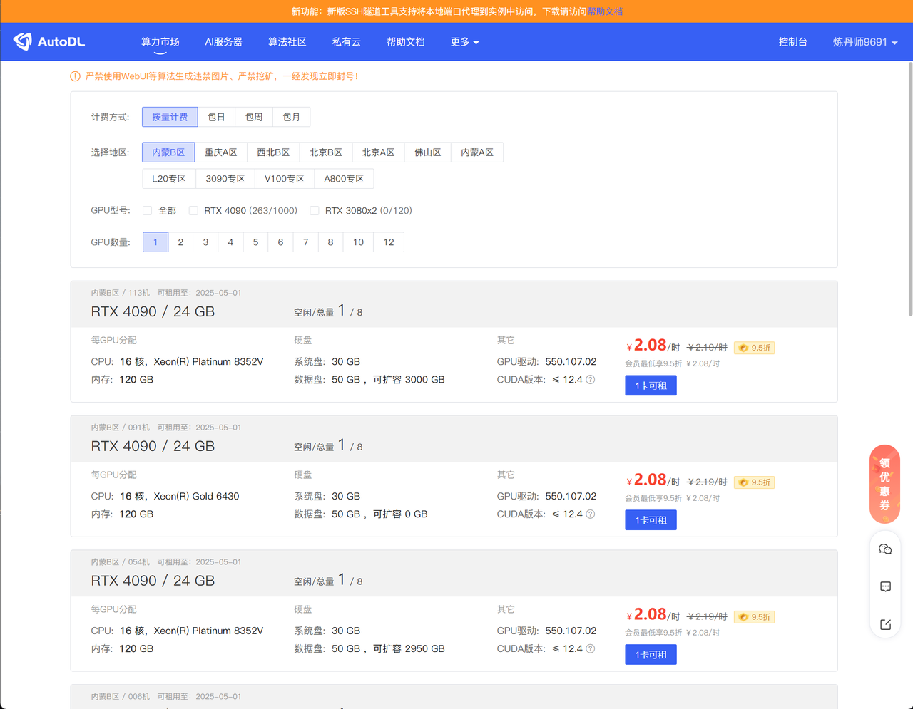

这里以租赁双卡3090为例进行介绍，计费方式可选根据实际需求进行选择，然后点击3090专区，并GPU数量选择2，然后任意选择一个有闲置GPU的服务器，点击2卡可租即可：

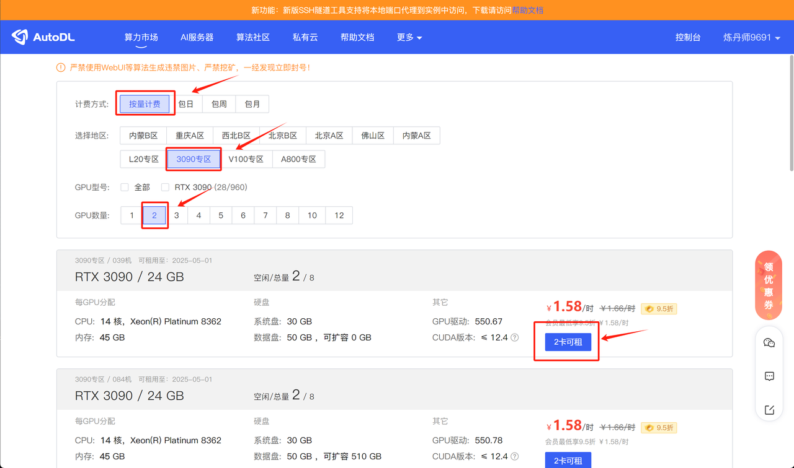

然后再次确认计费方式，以及账户剩余费用是否足够支付，在基础镜像中，选择一个镜像：


这里我们选择Pytorch 2.3.0（即最高版本）+Python 3.12+CUDA 12.1

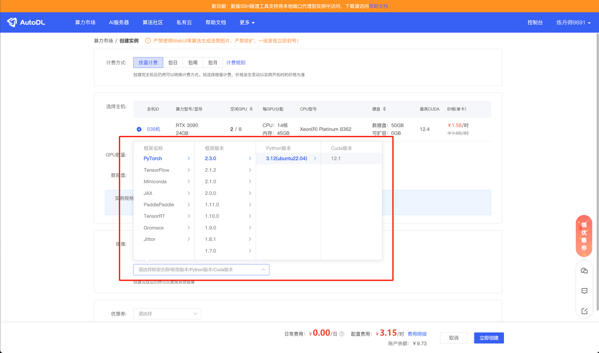

选择完毕后，点击立即创建即可：

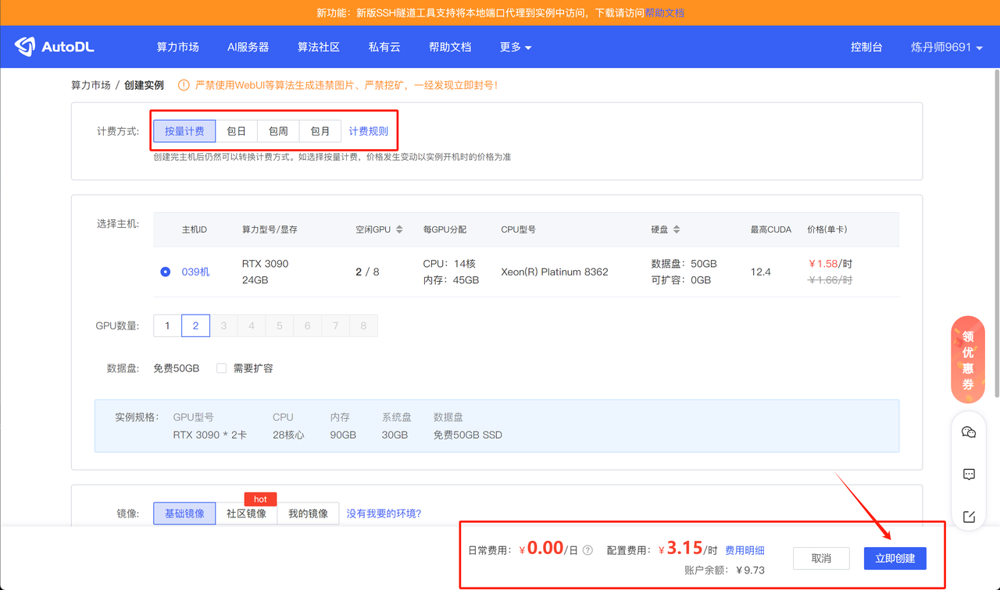

* 查看当前服务器

&#x20;       创建完成后，页面会自动跳转到当前账号的在线服务器管理页面，这里可以看到刚刚租赁的服务器正在开机中：

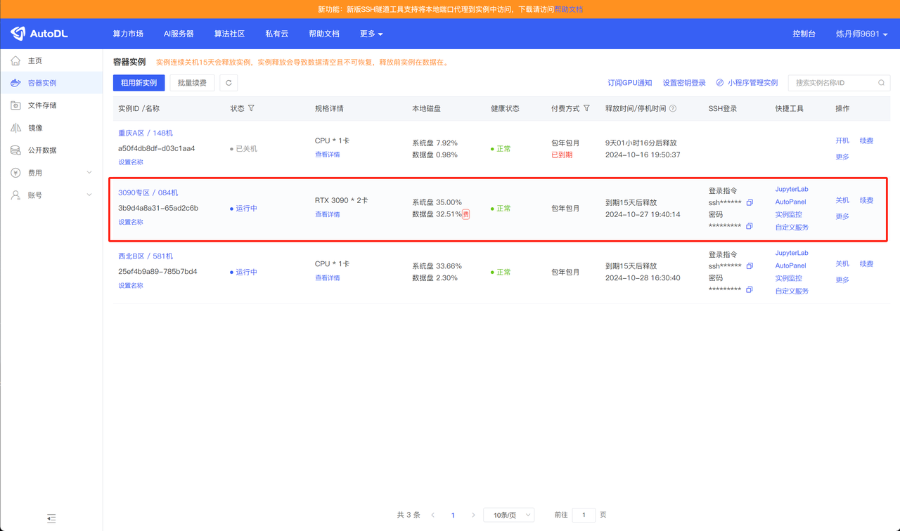

稍作等待，待显示`运行中`时，代表远程服务器已经顺利运行，接下来则需要考虑如何连接远程服务器。

### Step 2.使用FinalShell连接远程服务器

&#x20;       连接远程服务器的方式有很多种，首先服务器已预安装了JupyterLab，我们可以直接通过JupyterLab中的Terminal来连接服务器，并通过命令行的方式操作远程服务器。但由于JupyterLab中Termianl界面较为原始，对新人用户操作并不友好。因此推荐使用专门的远程终端连接软件连接远程服务器，这里推荐使用FinalShel

其中finalshell软件就在本次公开课的课件中，下载后按照普通软件安装流程进行安装即可：

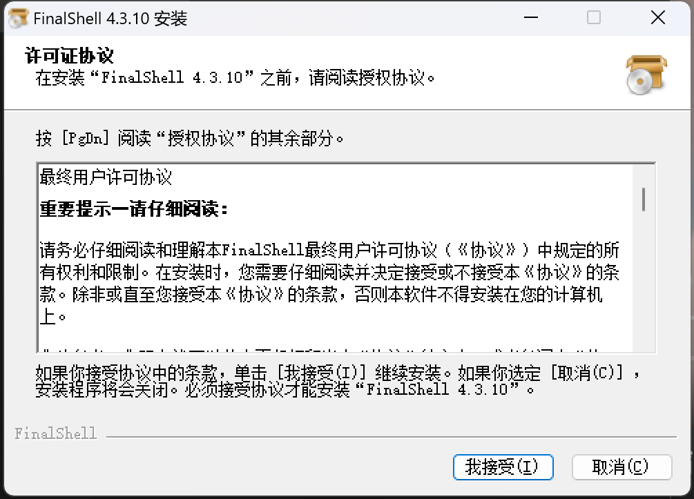

安装完成后，即可使用FinalShell连接远程服务器。由于接下来FinalShell连接远程服务器需要使用远程服务器的地址和端口，因此我们需要先查阅此时远程服务器的基本信息。回到AutoDL控制台页面，分别复制登陆指令和密码到任意文本编辑器中：


例如此时改服务器的登录指令为（需要找到你的主机的登录指令和密码）：

```bash
ssh -p 24503 root@conxxx
```

密码为：

```bash
wxxxx
```

记录好了之后即可打开FincalShell，使用该信息连接远程服务器。接下来打开FinalShell：


首次使用时点击左上方文件夹，进入连接管理器：

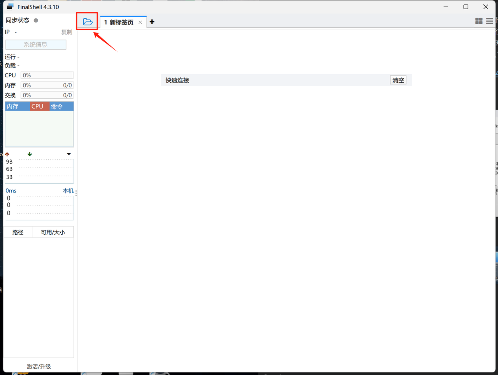

再点击创建新的连接，并在弹出的选项中选择SSH连接（Linux）：


此处名称可以随意填写，主机为`conxxx`，也就是登陆指令root@conxxx中的conxxx部分，端口为24503，也就是登录指令中ssh -p 24503 root@conxxx的24503部分，用户名为root，也就是root@conxxx中的conxxx中的root，而密码则是wxxxx，也就是此前复制的密码：


创建完成后回到连接管理器页面，双击刚刚创建的连接：


即可进入到连接页面，此时点击接受并保存即可：


当进入到如下页面，则说明已经连接成功：

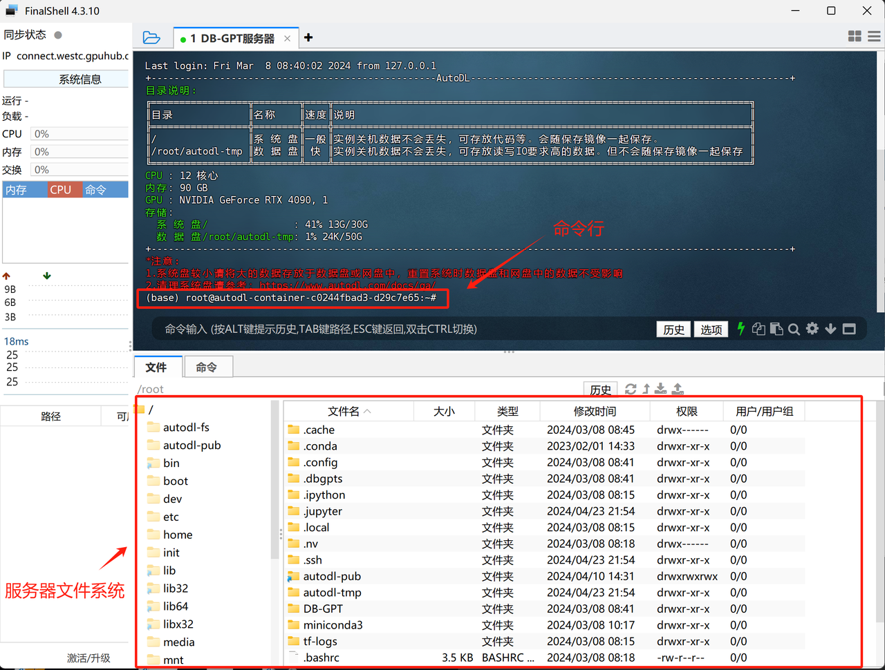

接下来即可借助FinalShell的命令行来操作远程服务器，在远程服务器上进行模型训练相关操作。


### Step 3.创建虚拟环境

* 打开finalshell，创建和服务器的shell连接

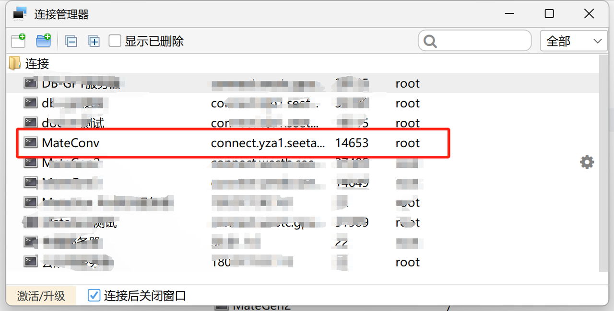

&#x20;


* 创建MateConv虚拟环境（虚拟环境名称可自定义）

```bash
conda create --name MateConv python=3.10
conda init
source ~/.bashrc
conda activate MateConv
```

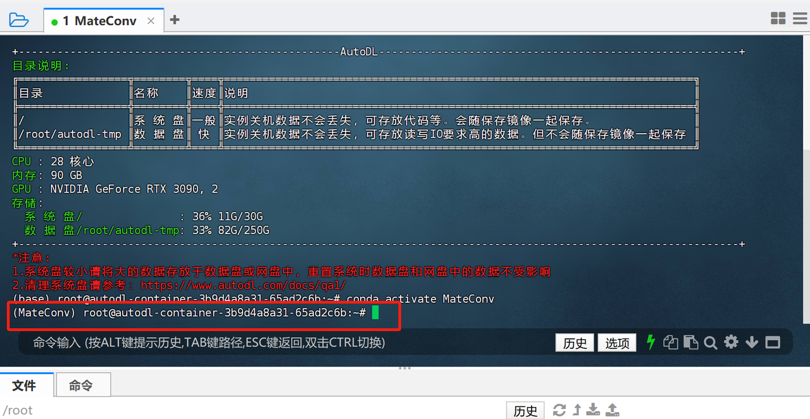

* 创建Jupyter Kernel

```bash
conda install jupyterlab
conda install ipykernel
python -m ipykernel install --user --name MateConv --display-name "Python (MateConv)"
```

* 创建项目主目录

```bash
 cd ~/autodl-tmp/
 mkdir MateConv
```

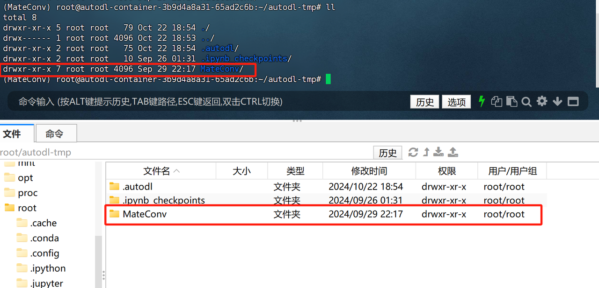

* 打开Jupyter

```bash
cd ~/autodl-tmp/MateConv
juputer lab --allow-root
```

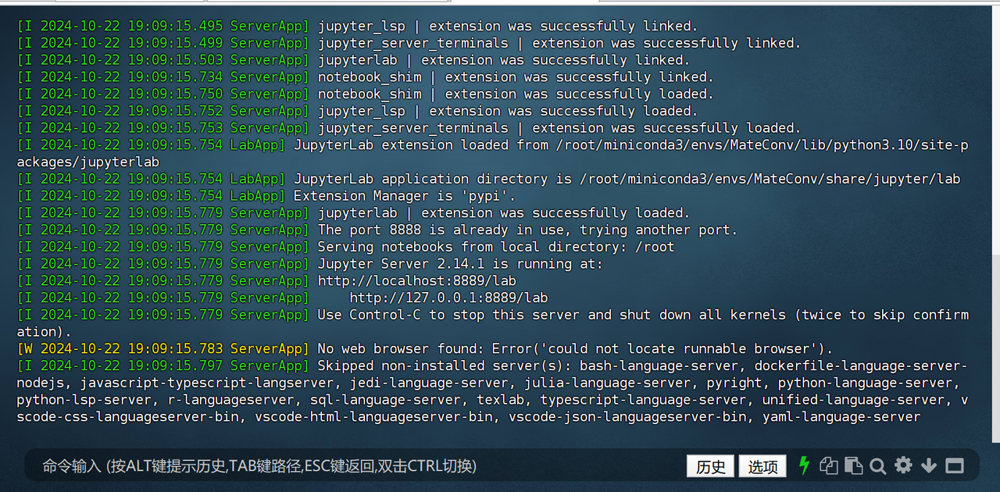

* 本地连接Jupyter并查看虚拟环境kernel

&#x20;       当服务器开启Jupyter时，Windows环境下，本地可通过AutoDL-SSH-Tools进行访问，**下图扫码添加英英助教，回复LLM**，即可领取本次公开课课件：


其中AutoDL-SSH-Tools软件就在本次公开课的课件中：


下载完成后解压缩后双击打开AutoDL.exe

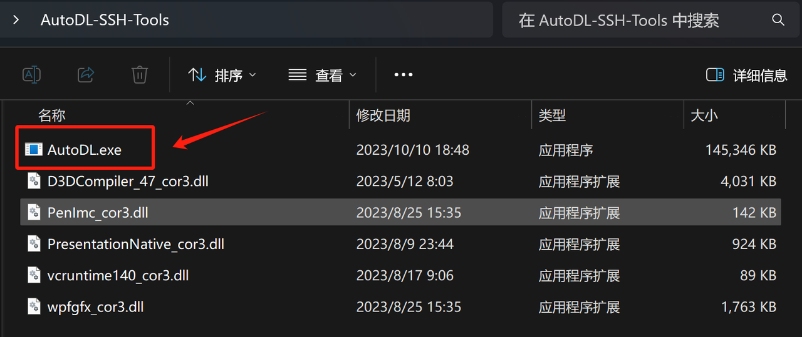

在弹出的栏页中，SSH指令和密码就是AutoDL官网上给每个实例提供的密钥：


&#x20;


代理端口填写8889（也就是Juypter运行端口），点击开始代理，然后点击访问即可：

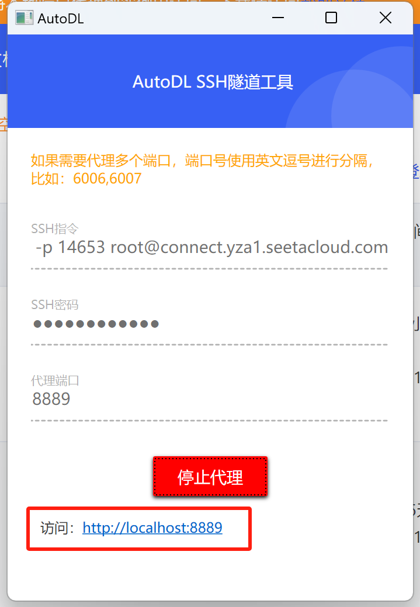

&#x20;


然后任意打开一个Kernel，选择找到刚才安装的虚拟环境即可


接下来再次点击finalshell中+号，再次创建一个和服务器的连接：

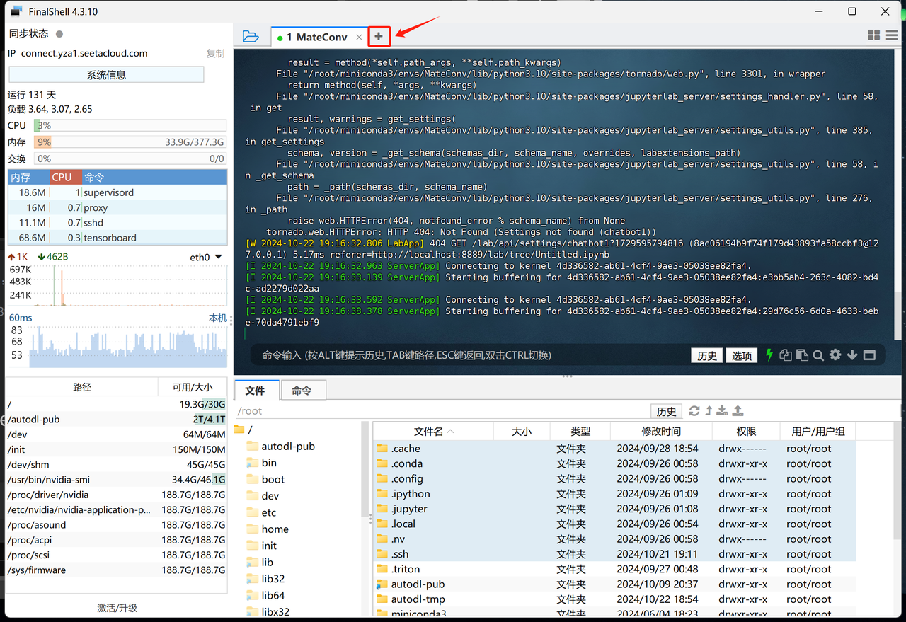

&#x20;

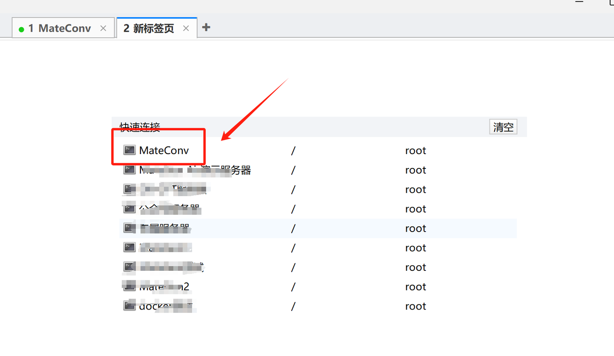

&#x20;

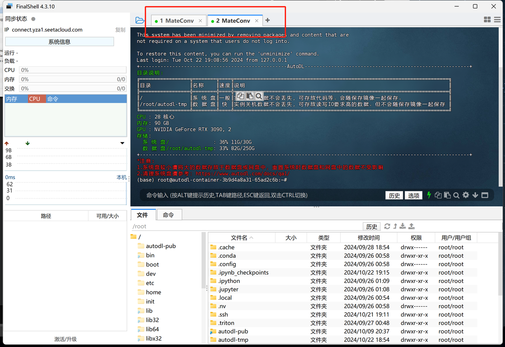

然后再次进入到虚拟环境，准备后续的操作

```bash
conda activate MateConv
```


***

#### 1.GraphRAG安装与项目创建

* **Step 1.使用pip安装graphrag**

```bash
pip install graphrag
```

```python
!pip install graphrag
```

```plaintext
Looking in indexes: http://mirrors.aliyun.com/pypi/simple
Requirement already satisfied: graphrag in /root/miniconda3/envs/graphrag/lib/python3.11/site-packages (0.5.0)
Requirement already satisfied: aiofiles<25.0.0,>=24.1.0 in /root/miniconda3/envs/graphrag/lib/python3.11/site-packages (from graphrag) (24.1.0)
Requirement already satisfied: aiolimiter<2.0.0,>=1.1.0 in /root/miniconda3/envs/graphrag/lib/python3.11/site-packages (from graphrag) (1.1.0)
Requirement already satisfied: azure-identity<2.0.0,>=1.17.1 in /root/miniconda3/envs/graphrag/lib/python3.11/site-packages (from graphrag) (1.19.0)
Requirement already satisfied: azure-search-documents<12.0.0,>=11.4.0 in /root/miniconda3/envs/graphrag/lib/python3.11/site-packages (from graphrag) (11.5.2)
Requirement already satisfied: azure-storage-blob<13.0.0,>=12.22.0 in /root/miniconda3/envs/graphrag/lib/python3.11/site-packages (from graphrag) (12.24.0)
Requirement already satisfied: datashaper<0.0.50,>=0.0.49 in /root/miniconda3/envs/graphrag/lib/python3.11/site-packages (from graphrag) (0.0.49)
Requirement already satisfied: devtools<0.13.0,>=0.12.2 in /root/miniconda3/envs/graphrag/lib/python3.11/site-packages (from graphrag) (0.12.2)
Requirement already satisfied: environs<12.0.0,>=11.0.0 in /root/miniconda3/envs/graphrag/lib/python3.11/site-packages (from graphrag) (11.2.1)
Requirement already satisfied: future<2.0.0,>=1.0.0 in /root/miniconda3/envs/graphrag/lib/python3.11/site-packages (from graphrag) (1.0.0)
Requirement already satisfied: graspologic<4.0.0,>=3.4.1 in /root/miniconda3/envs/graphrag/lib/python3.11/site-packages (from graphrag) (3.4.1)
Requirement already satisfied: json-repair<0.31.0,>=0.30.0 in /root/miniconda3/envs/graphrag/lib/python3.11/site-packages (from graphrag) (0.30.2)
Requirement already satisfied: lancedb<0.14.0,>=0.13.0 in /root/miniconda3/envs/graphrag/lib/python3.11/site-packages (from graphrag) (0.13.0)
Requirement already satisfied: matplotlib<4.0.0,>=3.9.0 in /root/miniconda3/envs/graphrag/lib/python3.11/site-packages (from graphrag) (3.9.2)
Requirement already satisfied: networkx<4,>=3 in /root/miniconda3/envs/graphrag/lib/python3.11/site-packages (from graphrag) (3.4.2)
Requirement already satisfied: nltk==3.9.1 in /root/miniconda3/envs/graphrag/lib/python3.11/site-packages (from graphrag) (3.9.1)
Requirement already satisfied: numpy<2.0.0,>=1.25.2 in /root/miniconda3/envs/graphrag/lib/python3.11/site-packages (from graphrag) (1.26.4)
Requirement already satisfied: openai<2.0.0,>=1.51.2 in /root/miniconda3/envs/graphrag/lib/python3.11/site-packages (from graphrag) (1.55.1)
Requirement already satisfied: pandas<3.0.0,>=2.2.3 in /root/miniconda3/envs/graphrag/lib/python3.11/site-packages (from graphrag) (2.2.3)
Requirement already satisfied: pyaml-env<2.0.0,>=1.2.1 in /root/miniconda3/envs/graphrag/lib/python3.11/site-packages (from graphrag) (1.2.1)
Requirement already satisfied: pyarrow<16.0.0,>=15.0.0 in /root/miniconda3/envs/graphrag/lib/python3.11/site-packages (from graphrag) (15.0.2)
Requirement already satisfied: pydantic<3.0.0,>=2.9.2 in /root/miniconda3/envs/graphrag/lib/python3.11/site-packages (from graphrag) (2.10.1)
Requirement already satisfied: python-dotenv<2.0.0,>=1.0.0 in /root/miniconda3/envs/graphrag/lib/python3.11/site-packages (from graphrag) (1.0.1)
Requirement already satisfied: pyyaml<7.0.0,>=6.0.2 in /root/miniconda3/envs/graphrag/lib/python3.11/site-packages (from graphrag) (6.0.2)
Requirement already satisfied: rich<14.0.0,>=13.6.0 in /root/miniconda3/envs/graphrag/lib/python3.11/site-packages (from graphrag) (13.9.4)
Requirement already satisfied: tenacity<10.0.0,>=9.0.0 in /root/miniconda3/envs/graphrag/lib/python3.11/site-packages (from graphrag) (9.0.0)
Requirement already satisfied: tiktoken<0.8.0,>=0.7.0 in /root/miniconda3/envs/graphrag/lib/python3.11/site-packages (from graphrag) (0.7.0)
Requirement already satisfied: typer<0.13.0,>=0.12.5 in /root/miniconda3/envs/graphrag/lib/python3.11/site-packages (from graphrag) (0.12.5)
Requirement already satisfied: typing-extensions<5.0.0,>=4.12.2 in /root/miniconda3/envs/graphrag/lib/python3.11/site-packages (from graphrag) (4.12.2)
Requirement already satisfied: umap-learn<0.6.0,>=0.5.6 in /root/miniconda3/envs/graphrag/lib/python3.11/site-packages (from graphrag) (0.5.7)
Requirement already satisfied: click in /root/miniconda3/envs/graphrag/lib/python3.11/site-packages (from nltk==3.9.1->graphrag) (8.1.7)
Requirement already satisfied: joblib in /root/miniconda3/envs/graphrag/lib/python3.11/site-packages (from nltk==3.9.1->graphrag) (1.4.2)
Requirement already satisfied: regex>=2021.8.3 in /root/miniconda3/envs/graphrag/lib/python3.11/site-packages (from nltk==3.9.1->graphrag) (2024.11.6)
Requirement already satisfied: tqdm in /root/miniconda3/envs/graphrag/lib/python3.11/site-packages (from nltk==3.9.1->graphrag) (4.67.1)
Requirement already satisfied: azure-core>=1.31.0 in /root/miniconda3/envs/graphrag/lib/python3.11/site-packages (from azure-identity<2.0.0,>=1.17.1->graphrag) (1.32.0)
Requirement already satisfied: cryptography>=2.5 in /root/miniconda3/envs/graphrag/lib/python3.11/site-packages (from azure-identity<2.0.0,>=1.17.1->graphrag) (43.0.3)
Requirement already satisfied: msal>=1.30.0 in /root/miniconda3/envs/graphrag/lib/python3.11/site-packages (from azure-identity<2.0.0,>=1.17.1->graphrag) (1.31.1)
Requirement already satisfied: msal-extensions>=1.2.0 in /root/miniconda3/envs/graphrag/lib/python3.11/site-packages (from azure-identity<2.0.0,>=1.17.1->graphrag) (1.2.0)
Requirement already satisfied: azure-common>=1.1 in /root/miniconda3/envs/graphrag/lib/python3.11/site-packages (from azure-search-documents<12.0.0,>=11.4.0->graphrag) (1.1.28)
Requirement already satisfied: isodate>=0.6.0 in /root/miniconda3/envs/graphrag/lib/python3.11/site-packages (from azure-search-documents<12.0.0,>=11.4.0->graphrag) (0.7.2)
Requirement already satisfied: diskcache<6.0.0,>=5.6.3 in /root/miniconda3/envs/graphrag/lib/python3.11/site-packages (from datashaper<0.0.50,>=0.0.49->graphrag) (5.6.3)
Requirement already satisfied: jsonschema<5.0.0,>=4.21.1 in /root/miniconda3/envs/graphrag/lib/python3.11/site-packages (from datashaper<0.0.50,>=0.0.49->graphrag) (4.23.0)
Requirement already satisfied: asttokens<3.0.0,>=2.0.0 in /root/miniconda3/envs/graphrag/lib/python3.11/site-packages (from devtools<0.13.0,>=0.12.2->graphrag) (2.0.5)
Requirement already satisfied: executing>=1.1.1 in /root/miniconda3/envs/graphrag/lib/python3.11/site-packages (from devtools<0.13.0,>=0.12.2->graphrag) (2.1.0)
Requirement already satisfied: pygments>=2.15.0 in /root/miniconda3/envs/graphrag/lib/python3.11/site-packages (from devtools<0.13.0,>=0.12.2->graphrag) (2.15.1)
Requirement already satisfied: marshmallow>=3.13.0 in /root/miniconda3/envs/graphrag/lib/python3.11/site-packages (from environs<12.0.0,>=11.0.0->graphrag) (3.23.1)
Requirement already satisfied: POT<0.10,>=0.9 in /root/miniconda3/envs/graphrag/lib/python3.11/site-packages (from graspologic<4.0.0,>=3.4.1->graphrag) (0.9.5)
Requirement already satisfied: anytree<3.0.0,>=2.12.1 in /root/miniconda3/envs/graphrag/lib/python3.11/site-packages (from graspologic<4.0.0,>=3.4.1->graphrag) (2.12.1)
Requirement already satisfied: beartype<0.19.0,>=0.18.5 in /root/miniconda3/envs/graphrag/lib/python3.11/site-packages (from graspologic<4.0.0,>=3.4.1->graphrag) (0.18.5)
Requirement already satisfied: gensim<5.0.0,>=4.3.2 in /root/miniconda3/envs/graphrag/lib/python3.11/site-packages (from graspologic<4.0.0,>=3.4.1->graphrag) (4.3.3)
Requirement already satisfied: graspologic-native<2.0.0,>=1.2.1 in /root/miniconda3/envs/graphrag/lib/python3.11/site-packages (from graspologic<4.0.0,>=3.4.1->graphrag) (1.2.1)
Requirement already satisfied: hyppo<0.5.0,>=0.4.0 in /root/miniconda3/envs/graphrag/lib/python3.11/site-packages (from graspologic<4.0.0,>=3.4.1->graphrag) (0.4.0)
Requirement already satisfied: scikit-learn<2.0.0,>=1.4.2 in /root/miniconda3/envs/graphrag/lib/python3.11/site-packages (from graspologic<4.0.0,>=3.4.1->graphrag) (1.5.2)
Requirement already satisfied: scipy==1.12.0 in /root/miniconda3/envs/graphrag/lib/python3.11/site-packages (from graspologic<4.0.0,>=3.4.1->graphrag) (1.12.0)
Requirement already satisfied: seaborn<0.14.0,>=0.13.2 in /root/miniconda3/envs/graphrag/lib/python3.11/site-packages (from graspologic<4.0.0,>=3.4.1->graphrag) (0.13.2)
Requirement already satisfied: statsmodels<0.15.0,>=0.14.2 in /root/miniconda3/envs/graphrag/lib/python3.11/site-packages (from graspologic<4.0.0,>=3.4.1->graphrag) (0.14.4)
Requirement already satisfied: deprecation in /root/miniconda3/envs/graphrag/lib/python3.11/site-packages (from lancedb<0.14.0,>=0.13.0->graphrag) (2.1.0)
Requirement already satisfied: pylance==0.17.0 in /root/miniconda3/envs/graphrag/lib/python3.11/site-packages (from lancedb<0.14.0,>=0.13.0->graphrag) (0.17.0)
Requirement already satisfied: requests>=2.31.0 in /root/miniconda3/envs/graphrag/lib/python3.11/site-packages (from lancedb<0.14.0,>=0.13.0->graphrag) (2.32.3)
Requirement already satisfied: retry>=0.9.2 in /root/miniconda3/envs/graphrag/lib/python3.11/site-packages (from lancedb<0.14.0,>=0.13.0->graphrag) (0.9.2)
Requirement already satisfied: attrs>=21.3.0 in /root/miniconda3/envs/graphrag/lib/python3.11/site-packages (from lancedb<0.14.0,>=0.13.0->graphrag) (24.2.0)
Requirement already satisfied: packaging in /root/miniconda3/envs/graphrag/lib/python3.11/site-packages (from lancedb<0.14.0,>=0.13.0->graphrag) (24.1)
Requirement already satisfied: cachetools in /root/miniconda3/envs/graphrag/lib/python3.11/site-packages (from lancedb<0.14.0,>=0.13.0->graphrag) (5.5.0)
Requirement already satisfied: overrides>=0.7 in /root/miniconda3/envs/graphrag/lib/python3.11/site-packages (from lancedb<0.14.0,>=0.13.0->graphrag) (7.4.0)
Requirement already satisfied: contourpy>=1.0.1 in /root/miniconda3/envs/graphrag/lib/python3.11/site-packages (from matplotlib<4.0.0,>=3.9.0->graphrag) (1.3.1)
Requirement already satisfied: cycler>=0.10 in /root/miniconda3/envs/graphrag/lib/python3.11/site-packages (from matplotlib<4.0.0,>=3.9.0->graphrag) (0.12.1)
Requirement already satisfied: fonttools>=4.22.0 in /root/miniconda3/envs/graphrag/lib/python3.11/site-packages (from matplotlib<4.0.0,>=3.9.0->graphrag) (4.55.0)
Requirement already satisfied: kiwisolver>=1.3.1 in /root/miniconda3/envs/graphrag/lib/python3.11/site-packages (from matplotlib<4.0.0,>=3.9.0->graphrag) (1.4.7)
Requirement already satisfied: pillow>=8 in /root/miniconda3/envs/graphrag/lib/python3.11/site-packages (from matplotlib<4.0.0,>=3.9.0->graphrag) (11.0.0)
Requirement already satisfied: pyparsing>=2.3.1 in /root/miniconda3/envs/graphrag/lib/python3.11/site-packages (from matplotlib<4.0.0,>=3.9.0->graphrag) (3.2.0)
Requirement already satisfied: python-dateutil>=2.7 in /root/miniconda3/envs/graphrag/lib/python3.11/site-packages (from matplotlib<4.0.0,>=3.9.0->graphrag) (2.9.0.post0)
Requirement already satisfied: anyio<5,>=3.5.0 in /root/miniconda3/envs/graphrag/lib/python3.11/site-packages (from openai<2.0.0,>=1.51.2->graphrag) (4.6.2)
Requirement already satisfied: distro<2,>=1.7.0 in /root/miniconda3/envs/graphrag/lib/python3.11/site-packages (from openai<2.0.0,>=1.51.2->graphrag) (1.9.0)
Requirement already satisfied: httpx<1,>=0.23.0 in /root/miniconda3/envs/graphrag/lib/python3.11/site-packages (from openai<2.0.0,>=1.51.2->graphrag) (0.27.0)
Requirement already satisfied: jiter<1,>=0.4.0 in /root/miniconda3/envs/graphrag/lib/python3.11/site-packages (from openai<2.0.0,>=1.51.2->graphrag) (0.7.1)
Requirement already satisfied: sniffio in /root/miniconda3/envs/graphrag/lib/python3.11/site-packages (from openai<2.0.0,>=1.51.2->graphrag) (1.3.0)
Requirement already satisfied: pytz>=2020.1 in /root/miniconda3/envs/graphrag/lib/python3.11/site-packages (from pandas<3.0.0,>=2.2.3->graphrag) (2024.1)
Requirement already satisfied: tzdata>=2022.7 in /root/miniconda3/envs/graphrag/lib/python3.11/site-packages (from pandas<3.0.0,>=2.2.3->graphrag) (2024.2)
Requirement already satisfied: annotated-types>=0.6.0 in /root/miniconda3/envs/graphrag/lib/python3.11/site-packages (from pydantic<3.0.0,>=2.9.2->graphrag) (0.7.0)
Requirement already satisfied: pydantic-core==2.27.1 in /root/miniconda3/envs/graphrag/lib/python3.11/site-packages (from pydantic<3.0.0,>=2.9.2->graphrag) (2.27.1)
Requirement already satisfied: markdown-it-py>=2.2.0 in /root/miniconda3/envs/graphrag/lib/python3.11/site-packages (from rich<14.0.0,>=13.6.0->graphrag) (3.0.0)
Requirement already satisfied: shellingham>=1.3.0 in /root/miniconda3/envs/graphrag/lib/python3.11/site-packages (from typer<0.13.0,>=0.12.5->graphrag) (1.5.4)
Requirement already satisfied: numba>=0.51.2 in /root/miniconda3/envs/graphrag/lib/python3.11/site-packages (from umap-learn<0.6.0,>=0.5.6->graphrag) (0.60.0)
Requirement already satisfied: pynndescent>=0.5 in /root/miniconda3/envs/graphrag/lib/python3.11/site-packages (from umap-learn<0.6.0,>=0.5.6->graphrag) (0.5.13)
Requirement already satisfied: idna>=2.8 in /root/miniconda3/envs/graphrag/lib/python3.11/site-packages (from anyio<5,>=3.5.0->openai<2.0.0,>=1.51.2->graphrag) (3.7)
Requirement already satisfied: six in /root/miniconda3/envs/graphrag/lib/python3.11/site-packages (from anytree<3.0.0,>=2.12.1->graspologic<4.0.0,>=3.4.1->graphrag) (1.16.0)
Requirement already satisfied: cffi>=1.12 in /root/miniconda3/envs/graphrag/lib/python3.11/site-packages (from cryptography>=2.5->azure-identity<2.0.0,>=1.17.1->graphrag) (1.17.1)
Requirement already satisfied: smart-open>=1.8.1 in /root/miniconda3/envs/graphrag/lib/python3.11/site-packages (from gensim<5.0.0,>=4.3.2->graspologic<4.0.0,>=3.4.1->graphrag) (7.0.5)
Requirement already satisfied: certifi in /root/miniconda3/envs/graphrag/lib/python3.11/site-packages (from httpx<1,>=0.23.0->openai<2.0.0,>=1.51.2->graphrag) (2024.8.30)
Requirement already satisfied: httpcore==1.* in /root/miniconda3/envs/graphrag/lib/python3.11/site-packages (from httpx<1,>=0.23.0->openai<2.0.0,>=1.51.2->graphrag) (1.0.2)
Requirement already satisfied: h11<0.15,>=0.13 in /root/miniconda3/envs/graphrag/lib/python3.11/site-packages (from httpcore==1.*->httpx<1,>=0.23.0->openai<2.0.0,>=1.51.2->graphrag) (0.14.0)
Requirement already satisfied: autograd>=1.3 in /root/miniconda3/envs/graphrag/lib/python3.11/site-packages (from hyppo<0.5.0,>=0.4.0->graspologic<4.0.0,>=3.4.1->graphrag) (1.7.0)
Requirement already satisfied: jsonschema-specifications>=2023.03.6 in /root/miniconda3/envs/graphrag/lib/python3.11/site-packages (from jsonschema<5.0.0,>=4.21.1->datashaper<0.0.50,>=0.0.49->graphrag) (2023.7.1)
Requirement already satisfied: referencing>=0.28.4 in /root/miniconda3/envs/graphrag/lib/python3.11/site-packages (from jsonschema<5.0.0,>=4.21.1->datashaper<0.0.50,>=0.0.49->graphrag) (0.30.2)
Requirement already satisfied: rpds-py>=0.7.1 in /root/miniconda3/envs/graphrag/lib/python3.11/site-packages (from jsonschema<5.0.0,>=4.21.1->datashaper<0.0.50,>=0.0.49->graphrag) (0.10.6)
Requirement already satisfied: mdurl~=0.1 in /root/miniconda3/envs/graphrag/lib/python3.11/site-packages (from markdown-it-py>=2.2.0->rich<14.0.0,>=13.6.0->graphrag) (0.1.2)
Requirement already satisfied: PyJWT<3,>=1.0.0 in /root/miniconda3/envs/graphrag/lib/python3.11/site-packages (from PyJWT[crypto]<3,>=1.0.0->msal>=1.30.0->azure-identity<2.0.0,>=1.17.1->graphrag) (2.10.0)
Requirement already satisfied: portalocker<3,>=1.4 in /root/miniconda3/envs/graphrag/lib/python3.11/site-packages (from msal-extensions>=1.2.0->azure-identity<2.0.0,>=1.17.1->graphrag) (2.10.1)
Requirement already satisfied: llvmlite<0.44,>=0.43.0dev0 in /root/miniconda3/envs/graphrag/lib/python3.11/site-packages (from numba>=0.51.2->umap-learn<0.6.0,>=0.5.6->graphrag) (0.43.0)
Requirement already satisfied: charset-normalizer<4,>=2 in /root/miniconda3/envs/graphrag/lib/python3.11/site-packages (from requests>=2.31.0->lancedb<0.14.0,>=0.13.0->graphrag) (3.3.2)
Requirement already satisfied: urllib3<3,>=1.21.1 in /root/miniconda3/envs/graphrag/lib/python3.11/site-packages (from requests>=2.31.0->lancedb<0.14.0,>=0.13.0->graphrag) (2.2.3)
Requirement already satisfied: decorator>=3.4.2 in /root/miniconda3/envs/graphrag/lib/python3.11/site-packages (from retry>=0.9.2->lancedb<0.14.0,>=0.13.0->graphrag) (5.1.1)
Requirement already satisfied: py<2.0.0,>=1.4.26 in /root/miniconda3/envs/graphrag/lib/python3.11/site-packages (from retry>=0.9.2->lancedb<0.14.0,>=0.13.0->graphrag) (1.11.0)
Requirement already satisfied: threadpoolctl>=3.1.0 in /root/miniconda3/envs/graphrag/lib/python3.11/site-packages (from scikit-learn<2.0.0,>=1.4.2->graspologic<4.0.0,>=3.4.1->graphrag) (3.5.0)
Requirement already satisfied: patsy>=0.5.6 in /root/miniconda3/envs/graphrag/lib/python3.11/site-packages (from statsmodels<0.15.0,>=0.14.2->graspologic<4.0.0,>=3.4.1->graphrag) (1.0.1)
Requirement already satisfied: pycparser in /root/miniconda3/envs/graphrag/lib/python3.11/site-packages (from cffi>=1.12->cryptography>=2.5->azure-identity<2.0.0,>=1.17.1->graphrag) (2.21)
Requirement already satisfied: wrapt in /root/miniconda3/envs/graphrag/lib/python3.11/site-packages (from smart-open>=1.8.1->gensim<5.0.0,>=4.3.2->graspologic<4.0.0,>=3.4.1->graphrag) (1.17.0)
WARNING: Running pip as the 'root' user can result in broken permissions and conflicting behaviour with the system package manager, possibly rendering your system unusable.It is recommended to use a virtual environment instead: https://pip.pypa.io/warnings/venv. Use the --root-user-action option if you know what you are doing and want to suppress this warning.

```

* **Step 2.创建检索项目文件夹**

```bash
mkdir -p ./openl/input
```


&#x20;

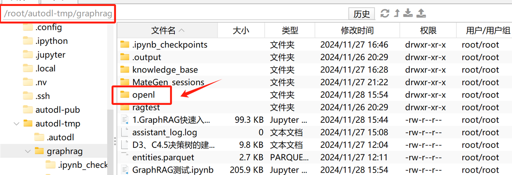

* **Step 3.上传数据集**


&#x20;

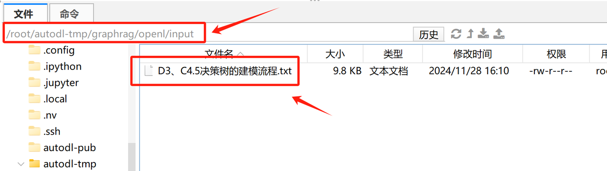


* **Step 4.初始化项目文件**

```bash
graphrag init --root ./openl
```

```python
!graphrag init --root ./openl
```

```plaintext
Initializing project at /root/autodl-tmp/graphrag/openl
⠋ GraphRAG Indexer 
```

* **Step 5.修改项目配置**


打开.env文件，填写OpenAI API-KEY

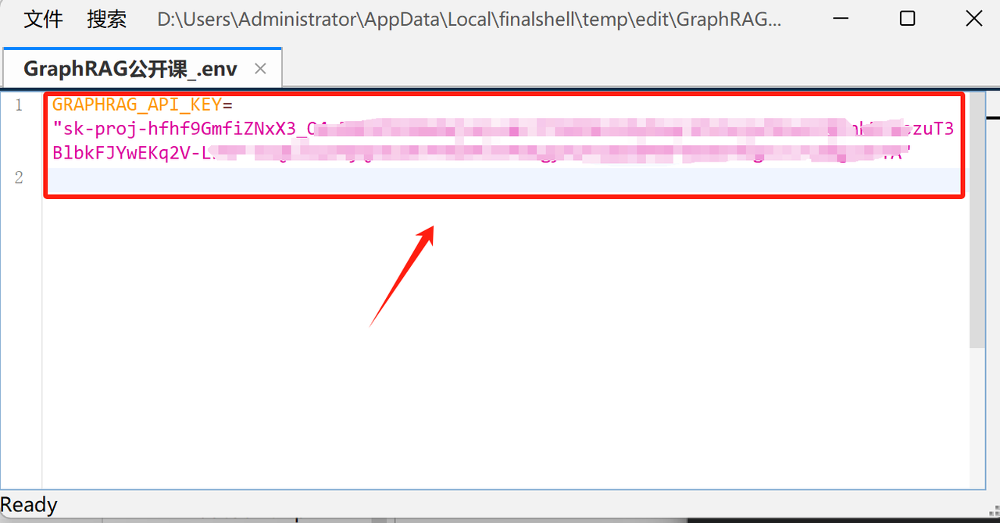

打开setting.yaml文件，填写模型名称和反向代理地址：

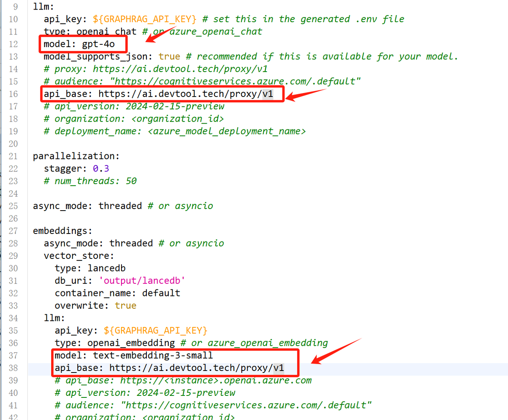

其中反向代理地址为`api_base: https://ai.devtool.tech/proxy/v1`

* **【可选】Step 6.验证API-KEY和反向代理地址是否可以正常运行**

```python
from openai import OpenAI
```

```python
api_key = 'your-openai-api-key'
```

```python
# 实例化客户端
client = OpenAI(api_key=api_key, 
                base_url="https://ai.devtool.tech/proxy/v1")
```

```python
# 调用 GPT-4o-mini 模型
response = client.chat.completions.create(
    model="gpt-4o-mini",
    messages=[
        {"role": "user", "content": "你好，好久不见!"}
    ]
)
```

```python
# 输出生成的响应内容
print(response.choices[0].message.content)
```

```plaintext
你好！好久不见！你最近怎么样？有什么新鲜事分享吗？
```

然后查看当前API-KEY可以调用的模型：

```python
models_list = client.models.list()
```

```python
models_list.data
```

```plaintext
[Model(id='gpt-4o-2024-08-06', created=1722814719, object='model', owned_by='system'),
 Model(id='gpt-4o', created=1715367049, object='model', owned_by='system'),
 Model(id='o1-mini-2024-09-12', created=1725648979, object='model', owned_by='system'),
 Model(id='dall-e-2', created=1698798177, object='model', owned_by='system'),
 Model(id='gpt-4-1106-preview', created=1698957206, object='model', owned_by='system'),
 Model(id='gpt-3.5-turbo', created=1677610602, object='model', owned_by='openai'),
 Model(id='text-embedding-3-large', created=1705953180, object='model', owned_by='system'),
 Model(id='gpt-3.5-turbo-0125', created=1706048358, object='model', owned_by='system'),
 Model(id='babbage-002', created=1692634615, object='model', owned_by='system'),
 Model(id='gpt-4o-2024-11-20', created=1731975040, object='model', owned_by='system'),
 Model(id='gpt-4-turbo-preview', created=1706037777, object='model', owned_by='system'),
 Model(id='davinci-002', created=1692634301, object='model', owned_by='system'),
 Model(id='gpt-4-0125-preview', created=1706037612, object='model', owned_by='system'),
 Model(id='whisper-1', created=1677532384, object='model', owned_by='openai-internal'),
 Model(id='gpt-4o-mini', created=1721172741, object='model', owned_by='system'),
 Model(id='dall-e-3', created=1698785189, object='model', owned_by='system'),
 Model(id='gpt-4o-mini-2024-07-18', created=1721172717, object='model', owned_by='system'),
 Model(id='o1-preview', created=1725648897, object='model', owned_by='system'),
 Model(id='gpt-3.5-turbo-16k', created=1683758102, object='model', owned_by='openai-internal'),
 Model(id='o1-preview-2024-09-12', created=1725648865, object='model', owned_by='system'),
 Model(id='o1-mini', created=1725649008, object='model', owned_by='system'),
 Model(id='gpt-4o-2024-05-13', created=1715368132, object='model', owned_by='system'),
 Model(id='gpt-4o-realtime-preview', created=1727659998, object='model', owned_by='system'),
 Model(id='tts-1-hd-1106', created=1699053533, object='model', owned_by='system'),
 Model(id='gpt-4o-realtime-preview-2024-10-01', created=1727131766, object='model', owned_by='system'),
 Model(id='gpt-4', created=1687882411, object='model', owned_by='openai'),
 Model(id='gpt-4-0613', created=1686588896, object='model', owned_by='openai'),
 Model(id='text-embedding-ada-002', created=1671217299, object='model', owned_by='openai-internal'),
 Model(id='text-embedding-3-small', created=1705948997, object='model', owned_by='system'),
 Model(id='tts-1-hd', created=1699046015, object='model', owned_by='system'),
 Model(id='gpt-4-turbo', created=1712361441, object='model', owned_by='system'),
 Model(id='gpt-4-turbo-2024-04-09', created=1712601677, object='model', owned_by='system'),
 Model(id='gpt-3.5-turbo-1106', created=1698959748, object='model', owned_by='system'),
 Model(id='gpt-3.5-turbo-instruct', created=1692901427, object='model', owned_by='system'),
 Model(id='gpt-4o-audio-preview', created=1727460443, object='model', owned_by='system'),
 Model(id='gpt-4o-audio-preview-2024-10-01', created=1727389042, object='model', owned_by='system'),
 Model(id='tts-1', created=1681940951, object='model', owned_by='openai-internal'),
 Model(id='tts-1-1106', created=1699053241, object='model', owned_by='system'),
 Model(id='gpt-3.5-turbo-instruct-0914', created=1694122472, object='model', owned_by='system'),
 Model(id='chatgpt-4o-latest', created=1723515131, object='model', owned_by='system')]
```

#### 2.GraphRAG索引Indexing过程执行

  一切准备就绪后，即可开始执行GraphRAG索引过程。

* **Step 7.借助GraphRAG脚本自动执行indexing**

```python
!graphrag index --root ./openl
```

```plaintext
Logging enabled at /root/autodl-tmp/graphrag/openl/logs/indexing-engine.log
⠙ GraphRAG Indexer 
⠙ GraphRAG Indexer e.text) - 1 files loaded (0 filtered) ━ 100% … 0…
├── Loading Input (InputFileType.text) - 1 files loaded (0 filtered) ━ 100% … 0…
⠼ GraphRAG Indexer 
├── Loading Input (InputFileType.text) - 1 files loaded (0 filtered) ━ 100% … 0…
⠼ GraphRAG Indexer 
├── Loading Input (InputFileType.text) - 1 files loaded (0 filtered) ━ 100% … 0…
🚀 create_base_text_units
⠼ GraphRAG Indexer 
├── Loading Input (InputFileType.text) - 1 files loaded (0 filtered) ━ 100% … 0…
Empty DataFrame
Columns: []
Index: []
⠼ GraphRAG Indexer 
├── Loading Input (InputFileType.text) - 1 files loaded (0 filtered) ━ 100% … 0…
⠴ GraphRAG Indexer 
├── Loading Input (InputFileType.text) - 1 files loaded (0 filtered) ━ 100% … 0…
⠴ GraphRAG Indexer 
├── Loading Input (InputFileType.text) - 1 files loaded (0 filtered) ━ 100% … 0…
├── create_base_text_units
🚀 create_final_documents
⠦ GraphRAG Indexer 
├── Loading Input (InputFileType.text) - 1 files loaded (0 filtered) ━ 100% … 0…
├── create_base_text_units
                                 id  ...                                      
text_unit_ids
0  c546fa97b72c8b72b7efb0c1ac45cb1d  ...  [0653a697b64dd8c029503ffc22af9ec3, 
b1fce21a45f...

[1 rows x 5 columns]
⠦ GraphRAG Indexer 
├── Loading Input (InputFileType.text) - 1 files loaded (0 filtered) ━ 100% … 0…
├── create_base_text_units
⠧ GraphRAG Indexer 
├── Loading Input (InputFileType.text) - 1 files loaded (0 filtered) ━ 100% … 0…
├── create_base_text_units
⠧ GraphRAG Indexer 
├── Loading Input (InputFileType.text) - 1 files loaded (0 filtered) ━ 100% … 0…
├── create_base_text_units
├── create_final_documents
⠧ GraphRAG Indexer 
├── Loading Input (InputFileType.text) - 1 files loaded (0 filtered) ━ 100% … 0…
├── create_base_text_units
├── create_final_documents
└── create_base_entity_graph
⠏ GraphRAG Indexer ━   0% -:--:-- 0:00:00
├── Loading Input (InputFileType.text) - 1 files loaded (0 filtered) ━ 100% … 0…
├── create_base_text_units
├── create_final_documents
└── create_base_entity_graph
⠹ GraphRAG Indexer ━   0% -:--:-- 0:00:01
├── Loading Input (InputFileType.text) - 1 files loaded (0 filtered) ━ 100% … 0…
├── create_base_text_units
├── create_final_documents
└── create_base_entity_graph
⠴ GraphRAG Indexer ━   0% -:--:-- 0:00:02
├── Loading Input (InputFileType.text) - 1 files loaded (0 filtered) ━ 100% … 0…
├── create_base_text_units
├── create_final_documents
└── create_base_entity_graph
⠏ GraphRAG Indexer [90m━━━━━━━━━━━━━━━  25% -:--:-- 0:00:03
├── Loading Input (InputFileType.text) - 1 files loaded (0 filtered) ━ 100% … 0…
├── create_base_text_units
├── create_final_documents
└── create_base_entity_graph
⠴ GraphRAG Indexer ━━━━━━━━━━  50% 0:00:01 0:00:03
├── Loading Input (InputFileType.text) - 1 files loaded (0 filtered) ━ 100% … 0…
├── create_base_text_units
├── create_final_documents
└── create_base_entity_graph
⠧ GraphRAG Indexer ━━━━━━━━━━  50% 0:00:01 0:00:03
├── Loading Input (InputFileType.text) - 1 files loaded (0 filtered) ━ 100% … 0…
├── create_base_text_units
├── create_final_documents
└── create_base_entity_graph
⠋ GraphRAG Indexer ━━━━━━━━━━  50% 0:00:01 0:00:04
├── Loading Input (InputFileType.text) - 1 files loaded (0 filtered) ━ 100% … 0…
├── create_base_text_units
├── create_final_documents
└── create_base_entity_graph
⠸ GraphRAG Indexer ━━━━━━━━━━  50% 0:00:01 0:00:05
├── Loading Input (InputFileType.text) - 1 files loaded (0 filtered) ━ 100% … 0…
├── create_base_text_units
├── create_final_documents
└── create_base_entity_graph
⠸ GraphRAG Indexer ━━━━━━━━━━  50% 0:00:01 0:00:06
├── Loading Input (InputFileType.text) - 1 files loaded (0 filtered) ━ 100% … 0…
├── create_base_text_units
├── create_final_documents
└── create_base_entity_graph
⠴ GraphRAG Indexer [91m╸━━━━━  75% 0:00:03 0:00:07
├── Loading Input (InputFileType.text) - 1 files loaded (0 filtered) ━ 100% … 0…
├── create_base_text_units
├── create_final_documents
└── create_base_entity_graph
⠇ GraphRAG Indexer [91m╸━━━━━  75% 0:00:03 0:00:07
├── Loading Input (InputFileType.text) - 1 files loaded (0 filtered) ━ 100% … 0…
├── create_base_text_units
├── create_final_documents
└── create_base_entity_graph
⠙ GraphRAG Indexer [91m╸━━━━━  75% 0:00:03 0:00:08
├── Loading Input (InputFileType.text) - 1 files loaded (0 filtered) ━ 100% … 0…
├── create_base_text_units
├── create_final_documents
└── create_base_entity_graph
⠸ GraphRAG Indexer [91m╸━━━━━  75% 0:00:03 0:00:09
├── Loading Input (InputFileType.text) - 1 files loaded (0 filtered) ━ 100% … 0…
├── create_base_text_units
├── create_final_documents
└── create_base_entity_graph
⠇ GraphRAG Indexer [91m╸━━━━━  75% 0:00:03 0:00:10
├── Loading Input (InputFileType.text) - 1 files loaded (0 filtered) ━ 100% … 0…
├── create_base_text_units
├── create_final_documents
⠦ GraphRAG Indexer 
├── Loading Input (InputFileType.text) - 1 files loaded (0 filtered) ━ 100% … 0…
├── create_base_text_units
├── create_final_documents
⠙ GraphRAG Indexer 
├── Loading Input (InputFileType.text) - 1 files loaded (0 filtered) ━ 100% … 0…
├── create_base_text_units
├── create_final_documents
⠼ GraphRAG Indexer 
├── Loading Input (InputFileType.text) - 1 files loaded (0 filtered) ━ 100% … 0…
├── create_base_text_units
├── create_final_documents
⠏ GraphRAG Indexer 
├── Loading Input (InputFileType.text) - 1 files loaded (0 filtered) ━ 100% … 0…
├── create_base_text_units
├── create_final_documents
⠙ GraphRAG Indexer 
├── Loading Input (InputFileType.text) - 1 files loaded (0 filtered) ━ 100% … 0…
├── create_base_text_units
├── create_final_documents
⠼ GraphRAG Indexer 
├── Loading Input (InputFileType.text) - 1 files loaded (0 filtered) ━ 100% … 0…
├── create_base_text_units
├── create_final_documents
⠧ GraphRAG Indexer 
├── Loading Input (InputFileType.text) - 1 files loaded (0 filtered) ━ 100% … 0…
├── create_base_text_units
├── create_final_documents
⠋ GraphRAG Indexer 
├── Loading Input (InputFileType.text) - 1 files loaded (0 filtered) ━ 100% … 0…
├── create_base_text_units
├── create_final_documents
⠸ GraphRAG Indexer 
├── Loading Input (InputFileType.text) - 1 files loaded (0 filtered) ━ 100% … 0…
├── create_base_text_units
├── create_final_documents
⠼ GraphRAG Indexer 
├── Loading Input (InputFileType.text) - 1 files loaded (0 filtered) ━ 100% … 0…
├── create_base_text_units
├── create_final_documents
🚀 create_base_entity_graph
⠼ GraphRAG Indexer 
├── Loading Input (InputFileType.text) - 1 files loaded (0 filtered) ━ 100% … 0…
├── create_base_text_units
├── create_final_documents
Empty DataFrame
Columns: []
Index: []
⠼ GraphRAG Indexer 
├── Loading Input (InputFileType.text) - 1 files loaded (0 filtered) ━ 100% … 0…
├── create_base_text_units
├── create_final_documents
⠦ GraphRAG Indexer 
├── Loading Input (InputFileType.text) - 1 files loaded (0 filtered) ━ 100% … 0…
├── create_base_text_units
├── create_final_documents
⠦ GraphRAG Indexer 
├── Loading Input (InputFileType.text) - 1 files loaded (0 filtered) ━ 100% … 0…
├── create_base_text_units
├── create_final_documents
⠦ GraphRAG Indexer 
├── Loading Input (InputFileType.text) - 1 files loaded (0 filtered) ━ 100% … 0…
├── create_base_text_units
├── create_final_documents
├── create_base_entity_graph
🚀 create_final_entities
⠦ GraphRAG Indexer 
├── Loading Input (InputFileType.text) - 1 files loaded (0 filtered) ━ 100% … 0…
├── create_base_text_units
├── create_final_documents
├── create_base_entity_graph
                                  id  ...                                      
text_unit_ids
0   22113170e6c742ba940314e15c401dc1  ...  [0653a697b64dd8c029503ffc22af9ec3, 
08530861b09...
1   23e8813975cc43d7921375da3c781c3c  ...  [0653a697b64dd8c029503ffc22af9ec3, 
08530861b09...
2   3c4aa4fadb5c4b3f9244a7bb00598cab  ...                 
[0653a697b64dd8c029503ffc22af9ec3]
3   0ebac52d90264cef8bf563ffe894bbe5  ...                 
[0653a697b64dd8c029503ffc22af9ec3]
4   d45fe94d4f2840b48ebd2564ddc85e56  ...                 
[0653a697b64dd8c029503ffc22af9ec3]
5   8979a4d40b04416a91f084e057be0c98  ...                 
[0653a697b64dd8c029503ffc22af9ec3]
6   5a57bda8d0534c43a2591fde9519ef2e  ...                 
[0653a697b64dd8c029503ffc22af9ec3]
7   9ac71842fd5b47628a2cc43bb13b1290  ...                 
[0653a697b64dd8c029503ffc22af9ec3]
8   71c5eabc1ce9490f85f9357f6b7f309b  ...                 
[08530861b09098077a0ebcd53ab3ae62]
9   de19324beea8438497852259c73c452a  ...                 
[08530861b09098077a0ebcd53ab3ae62]
10  67f0629e10054ba49b2d1bfd08985927  ...                 
[08530861b09098077a0ebcd53ab3ae62]

[11 rows x 6 columns]
⠧ GraphRAG Indexer 
├── Loading Input (InputFileType.text) - 1 files loaded (0 filtered) ━ 100% … 0…
├── create_base_text_units
├── create_final_documents
├── create_base_entity_graph
⠏ GraphRAG Indexer 
├── Loading Input (InputFileType.text) - 1 files loaded (0 filtered) ━ 100% … 0…
├── create_base_text_units
├── create_final_documents
├── create_base_entity_graph
⠏ GraphRAG Indexer 
├── Loading Input (InputFileType.text) - 1 files loaded (0 filtered) ━ 100% … 0…
├── create_base_text_units
├── create_final_documents
├── create_base_entity_graph
├── create_final_entities
🚀 create_final_nodes
⠏ GraphRAG Indexer 
├── Loading Input (InputFileType.text) - 1 files loaded (0 filtered) ━ 100% … 0…
├── create_base_text_units
├── create_final_documents
├── create_base_entity_graph
├── create_final_entities
                                  id  human_readable_id  ...  x  y
0   22113170e6c742ba940314e15c401dc1                  0  ...  0  0
1   23e8813975cc43d7921375da3c781c3c                  1  ...  0  0
2   3c4aa4fadb5c4b3f9244a7bb00598cab                  2  ...  0  0
3   0ebac52d90264cef8bf563ffe894bbe5                  3  ...  0  0
4   d45fe94d4f2840b48ebd2564ddc85e56                  4  ...  0  0
5   8979a4d40b04416a91f084e057be0c98                  5  ...  0  0
6   5a57bda8d0534c43a2591fde9519ef2e                  6  ...  0  0
7   9ac71842fd5b47628a2cc43bb13b1290                  7  ...  0  0
8   71c5eabc1ce9490f85f9357f6b7f309b                  8  ...  0  0
9   de19324beea8438497852259c73c452a                  9  ...  0  0
10  67f0629e10054ba49b2d1bfd08985927                 10  ...  0  0
11  22113170e6c742ba940314e15c401dc1                  0  ...  0  0
12  23e8813975cc43d7921375da3c781c3c                  1  ...  0  0
13  3c4aa4fadb5c4b3f9244a7bb00598cab                  2  ...  0  0
14  0ebac52d90264cef8bf563ffe894bbe5                  3  ...  0  0
15  d45fe94d4f2840b48ebd2564ddc85e56                  4  ...  0  0
16  8979a4d40b04416a91f084e057be0c98                  5  ...  0  0
17  5a57bda8d0534c43a2591fde9519ef2e                  6  ...  0  0
18  9ac71842fd5b47628a2cc43bb13b1290                  7  ...  0  0
19  71c5eabc1ce9490f85f9357f6b7f309b                  8  ...  0  0
20  de19324beea8438497852259c73c452a                  9  ...  0  0
21  67f0629e10054ba49b2d1bfd08985927                 10  ...  0  0

[22 rows x 8 columns]
⠏ GraphRAG Indexer 
├── Loading Input (InputFileType.text) - 1 files loaded (0 filtered) ━ 100% … 0…
├── create_base_text_units
├── create_final_documents
├── create_base_entity_graph
├── create_final_entities
⠙ GraphRAG Indexer 
├── Loading Input (InputFileType.text) - 1 files loaded (0 filtered) ━ 100% … 0…
├── create_base_text_units
├── create_final_documents
├── create_base_entity_graph
├── create_final_entities
⠙ GraphRAG Indexer 
├── Loading Input (InputFileType.text) - 1 files loaded (0 filtered) ━ 100% … 0…
├── create_base_text_units
├── create_final_documents
├── create_base_entity_graph
├── create_final_entities
├── create_final_nodes
🚀 create_final_communities
⠙ GraphRAG Indexer 
├── Loading Input (InputFileType.text) - 1 files loaded (0 filtered) ━ 100% … 0…
├── create_base_text_units
├── create_final_documents
├── create_base_entity_graph
├── create_final_entities
├── create_final_nodes
                                     id  human_readable_id  ...      period  
size
0  17bfead0-7ccc-438a-922b-5cd6deea39ea                  0  ...  2024-11-28    
11
1  8eb758a5-95a9-4e42-93e2-5ac1adff8a42                  1  ...  2024-11-28     
7
2  7b75cf95-4504-47a7-8b11-7c90fe66109b                  2  ...  2024-11-28     
4

[3 rows x 10 columns]
⠹ GraphRAG Indexer 
├── Loading Input (InputFileType.text) - 1 files loaded (0 filtered) ━ 100% … 0…
├── create_base_text_units
├── create_final_documents
├── create_base_entity_graph
├── create_final_entities
├── create_final_nodes
⠼ GraphRAG Indexer 
├── Loading Input (InputFileType.text) - 1 files loaded (0 filtered) ━ 100% … 0…
├── create_base_text_units
├── create_final_documents
├── create_base_entity_graph
├── create_final_entities
├── create_final_nodes
⠼ GraphRAG Indexer 
├── Loading Input (InputFileType.text) - 1 files loaded (0 filtered) ━ 100% … 0…
├── create_base_text_units
├── create_final_documents
├── create_base_entity_graph
├── create_final_entities
├── create_final_nodes
├── create_final_communities
🚀 create_final_relationships
⠼ GraphRAG Indexer 
├── Loading Input (InputFileType.text) - 1 files loaded (0 filtered) ━ 100% … 0…
├── create_base_text_units
├── create_final_documents
├── create_base_entity_graph
├── create_final_entities
├── create_final_nodes
├── create_final_communities
                                 id  ...                                      
text_unit_ids
0  813887b9c3f54445832a00a8d1b47264  ...  [0653a697b64dd8c029503ffc22af9ec3, 
08530861b09...
1  16f369775666497b8ece38456683313e  ...                 
[0653a697b64dd8c029503ffc22af9ec3]
2  6e17fd4dce3a432195f428ec5287c71d  ...                 
[0653a697b64dd8c029503ffc22af9ec3]
3  121cc7bef78848b69ec89e082cb86a54  ...                 
[0653a697b64dd8c029503ffc22af9ec3]
4  294c8d020d0b4b389070c7c1959f1cc7  ...                 
[0653a697b64dd8c029503ffc22af9ec3]
5  6110c0c995e34a3896bbc4a0274ecc6f  ...                 
[0653a697b64dd8c029503ffc22af9ec3]
6  188cab571d5c4b0197172dd2deab34a5  ...                 
[0653a697b64dd8c029503ffc22af9ec3]
7  4979732df79645ed88eea6e957cab2c7  ...                 
[08530861b09098077a0ebcd53ab3ae62]
8  8a02e132514440d99006833312db5a5c  ...                 
[08530861b09098077a0ebcd53ab3ae62]
9  3584cb0ca80a463c8e658b17bc7ef254  ...                 
[08530861b09098077a0ebcd53ab3ae62]

[10 rows x 8 columns]
⠼ GraphRAG Indexer 
├── Loading Input (InputFileType.text) - 1 files loaded (0 filtered) ━ 100% … 0…
├── create_base_text_units
├── create_final_documents
├── create_base_entity_graph
├── create_final_entities
├── create_final_nodes
├── create_final_communities
⠦ GraphRAG Indexer 
├── Loading Input (InputFileType.text) - 1 files loaded (0 filtered) ━ 100% … 0…
├── create_base_text_units
├── create_final_documents
├── create_base_entity_graph
├── create_final_entities
├── create_final_nodes
├── create_final_communities
⠦ GraphRAG Indexer 
├── Loading Input (InputFileType.text) - 1 files loaded (0 filtered) ━ 100% … 0…
├── create_base_text_units
├── create_final_documents
├── create_base_entity_graph
├── create_final_entities
├── create_final_nodes
├── create_final_communities
├── create_final_relationships
🚀 create_final_text_units
⠦ GraphRAG Indexer 
├── Loading Input (InputFileType.text) - 1 files loaded (0 filtered) ━ 100% … 0…
├── create_base_text_units
├── create_final_documents
├── create_base_entity_graph
├── create_final_entities
├── create_final_nodes
├── create_final_communities
├── create_final_relationships
                                 id  ...                                   
relationship_ids
0  0653a697b64dd8c029503ffc22af9ec3  ...  [813887b9c3f54445832a00a8d1b47264, 
16f36977566...
1  b1fce21a45f01c5ef14bafc9fe3bab1d  ...                                        
None
2  08530861b09098077a0ebcd53ab3ae62  ...  [813887b9c3f54445832a00a8d1b47264, 
4979732df79...
3  e97cc7c63047f6471b4beac2f375eae0  ...                                        
None

[4 rows x 7 columns]
⠧ GraphRAG Indexer 
├── Loading Input (InputFileType.text) - 1 files loaded (0 filtered) ━ 100% … 0…
├── create_base_text_units
├── create_final_documents
├── create_base_entity_graph
├── create_final_entities
├── create_final_nodes
├── create_final_communities
├── create_final_relationships
⠏ GraphRAG Indexer 
├── Loading Input (InputFileType.text) - 1 files loaded (0 filtered) ━ 100% … 0…
├── create_base_text_units
├── create_final_documents
├── create_base_entity_graph
├── create_final_entities
├── create_final_nodes
├── create_final_communities
├── create_final_relationships
⠏ GraphRAG Indexer 
├── Loading Input (InputFileType.text) - 1 files loaded (0 filtered) ━ 100% … 0…
├── create_base_text_units
├── create_final_documents
├── create_base_entity_graph
├── create_final_entities
├── create_final_nodes
├── create_final_communities
├── create_final_relationships
⠏ GraphRAG Indexer 
├── Loading Input (InputFileType.text) - 1 files loaded (0 filtered) ━ 100% … 0…
├── create_base_text_units
├── create_final_documents
├── create_base_entity_graph
├── create_final_entities
├── create_final_nodes
├── create_final_communities
├── create_final_relationships
├── create_final_text_units
⠙ GraphRAG Indexer 
├── Loading Input (InputFileType.text) - 1 files loaded (0 filtered) ━ 100% … 0…
├── create_base_text_units
├── create_final_documents
├── create_base_entity_graph
├── create_final_entities
├── create_final_nodes
├── create_final_communities
├── create_final_relationships
├── create_final_text_units
⠼ GraphRAG Indexer 
├── Loading Input (InputFileType.text) - 1 files loaded (0 filtered) ━ 100% … 0…
├── create_base_text_units
├── create_final_documents
├── create_base_entity_graph
├── create_final_entities
├── create_final_nodes
├── create_final_communities
├── create_final_relationships
├── create_final_text_units
⠧ GraphRAG Indexer 
├── Loading Input (InputFileType.text) - 1 files loaded (0 filtered) ━ 100% … 0…
├── create_base_text_units
├── create_final_documents
├── create_base_entity_graph
├── create_final_entities
├── create_final_nodes
├── create_final_communities
├── create_final_relationships
├── create_final_text_units
⠋ GraphRAG Indexer 
├── Loading Input (InputFileType.text) - 1 files loaded (0 filtered) ━ 100% … 0…
├── create_base_text_units
├── create_final_documents
├── create_base_entity_graph
├── create_final_entities
├── create_final_nodes
├── create_final_communities
├── create_final_relationships
├── create_final_text_units
⠸ GraphRAG Indexer 
├── Loading Input (InputFileType.text) - 1 files loaded (0 filtered) ━ 100% … 0…
├── create_base_text_units
├── create_final_documents
├── create_base_entity_graph
├── create_final_entities
├── create_final_nodes
├── create_final_communities
├── create_final_relationships
├── create_final_text_units
⠴ GraphRAG Indexer 
├── Loading Input (InputFileType.text) - 1 files loaded (0 filtered) ━ 100% … 0…
├── create_base_text_units
├── create_final_documents
├── create_base_entity_graph
├── create_final_entities
├── create_final_nodes
├── create_final_communities
├── create_final_relationships
├── create_final_text_units
⠇ GraphRAG Indexer 
├── Loading Input (InputFileType.text) - 1 files loaded (0 filtered) ━ 100% … 0…
├── create_base_text_units
├── create_final_documents
├── create_base_entity_graph
├── create_final_entities
├── create_final_nodes
├── create_final_communities
├── create_final_relationships
├── create_final_text_units
⠙ GraphRAG Indexer 
├── Loading Input (InputFileType.text) - 1 files loaded (0 filtered) ━ 100% … 0…
├── create_base_text_units
├── create_final_documents
├── create_base_entity_graph
├── create_final_entities
├── create_final_nodes
├── create_final_communities
├── create_final_relationships
├── create_final_text_units
⠼ GraphRAG Indexer 
├── Loading Input (InputFileType.text) - 1 files loaded (0 filtered) ━ 100% … 0…
├── create_base_text_units
├── create_final_documents
├── create_base_entity_graph
├── create_final_entities
├── create_final_nodes
├── create_final_communities
├── create_final_relationships
├── create_final_text_units
⠦ GraphRAG Indexer 
├── Loading Input (InputFileType.text) - 1 files loaded (0 filtered) ━ 100% … 0…
├── create_base_text_units
├── create_final_documents
├── create_base_entity_graph
├── create_final_entities
├── create_final_nodes
├── create_final_communities
├── create_final_relationships
├── create_final_text_units
⠏ GraphRAG Indexer 
├── Loading Input (InputFileType.text) - 1 files loaded (0 filtered) ━ 100% … 0…
├── create_base_text_units
├── create_final_documents
├── create_base_entity_graph
├── create_final_entities
├── create_final_nodes
├── create_final_communities
├── create_final_relationships
├── create_final_text_units
⠹ GraphRAG Indexer 
├── Loading Input (InputFileType.text) - 1 files loaded (0 filtered) ━ 100% … 0…
├── create_base_text_units
├── create_final_documents
├── create_base_entity_graph
├── create_final_entities
├── create_final_nodes
├── create_final_communities
├── create_final_relationships
├── create_final_text_units
⠴ GraphRAG Indexer 
├── Loading Input (InputFileType.text) - 1 files loaded (0 filtered) ━ 100% … 0…
├── create_base_text_units
├── create_final_documents
├── create_base_entity_graph
├── create_final_entities
├── create_final_nodes
├── create_final_communities
├── create_final_relationships
├── create_final_text_units
⠴ GraphRAG Indexer 
├── Loading Input (InputFileType.text) - 1 files loaded (0 filtered) ━ 100% … 0…
├── create_base_text_units
├── create_final_documents
├── create_base_entity_graph
├── create_final_entities
├── create_final_nodes
├── create_final_communities
├── create_final_relationships
├── create_final_text_units
⠇ GraphRAG Indexer 
├── Loading Input (InputFileType.text) - 1 files loaded (0 filtered) ━ 100% … 0…
├── create_base_text_units
├── create_final_documents
├── create_base_entity_graph
├── create_final_entities
├── create_final_nodes
├── create_final_communities
├── create_final_relationships
├── create_final_text_units
⠋ GraphRAG Indexer 
├── Loading Input (InputFileType.text) - 1 files loaded (0 filtered) ━ 100% … 0…
├── create_base_text_units
├── create_final_documents
├── create_base_entity_graph
├── create_final_entities
├── create_final_nodes
├── create_final_communities
├── create_final_relationships
├── create_final_text_units
⠙ GraphRAG Indexer 
├── Loading Input (InputFileType.text) - 1 files loaded (0 filtered) ━ 100% … 0…
├── create_base_text_units
├── create_final_documents
├── create_base_entity_graph
├── create_final_entities
├── create_final_nodes
├── create_final_communities
├── create_final_relationships
├── create_final_text_units
⠸ GraphRAG Indexer 
├── Loading Input (InputFileType.text) - 1 files loaded (0 filtered) ━ 100% … 0…
├── create_base_text_units
├── create_final_documents
├── create_base_entity_graph
├── create_final_entities
├── create_final_nodes
├── create_final_communities
├── create_final_relationships
├── create_final_text_units
⠦ GraphRAG Indexer 
├── Loading Input (InputFileType.text) - 1 files loaded (0 filtered) ━ 100% … 0…
├── create_base_text_units
├── create_final_documents
├── create_base_entity_graph
├── create_final_entities
├── create_final_nodes
├── create_final_communities
├── create_final_relationships
├── create_final_text_units
⠏ GraphRAG Indexer 
├── Loading Input (InputFileType.text) - 1 files loaded (0 filtered) ━ 100% … 0…
├── create_base_text_units
├── create_final_documents
├── create_base_entity_graph
├── create_final_entities
├── create_final_nodes
├── create_final_communities
├── create_final_relationships
├── create_final_text_units
⠙ GraphRAG Indexer 
├── Loading Input (InputFileType.text) - 1 files loaded (0 filtered) ━ 100% … 0…
├── create_base_text_units
├── create_final_documents
├── create_base_entity_graph
├── create_final_entities
├── create_final_nodes
├── create_final_communities
├── create_final_relationships
├── create_final_text_units
⠼ GraphRAG Indexer 
├── Loading Input (InputFileType.text) - 1 files loaded (0 filtered) ━ 100% … 0…
├── create_base_text_units
├── create_final_documents
├── create_base_entity_graph
├── create_final_entities
├── create_final_nodes
├── create_final_communities
├── create_final_relationships
├── create_final_text_units
⠧ GraphRAG Indexer 
├── Loading Input (InputFileType.text) - 1 files loaded (0 filtered) ━ 100% … 0…
├── create_base_text_units
├── create_final_documents
├── create_base_entity_graph
├── create_final_entities
├── create_final_nodes
├── create_final_communities
├── create_final_relationships
├── create_final_text_units
⠋ GraphRAG Indexer 
├── Loading Input (InputFileType.text) - 1 files loaded (0 filtered) ━ 100% … 0…
├── create_base_text_units
├── create_final_documents
├── create_base_entity_graph
├── create_final_entities
├── create_final_nodes
├── create_final_communities
├── create_final_relationships
├── create_final_text_units
⠸ GraphRAG Indexer 
├── Loading Input (InputFileType.text) - 1 files loaded (0 filtered) ━ 100% … 0…
├── create_base_text_units
├── create_final_documents
├── create_base_entity_graph
├── create_final_entities
├── create_final_nodes
├── create_final_communities
├── create_final_relationships
├── create_final_text_units
⠴ GraphRAG Indexer 
├── Loading Input (InputFileType.text) - 1 files loaded (0 filtered) ━ 100% … 0…
├── create_base_text_units
├── create_final_documents
├── create_base_entity_graph
├── create_final_entities
├── create_final_nodes
├── create_final_communities
├── create_final_relationships
├── create_final_text_units
⠇ GraphRAG Indexer 
├── Loading Input (InputFileType.text) - 1 files loaded (0 filtered) ━ 100% … 0…
├── create_base_text_units
├── create_final_documents
├── create_base_entity_graph
├── create_final_entities
├── create_final_nodes
├── create_final_communities
├── create_final_relationships
├── create_final_text_units
⠙ GraphRAG Indexer 
├── Loading Input (InputFileType.text) - 1 files loaded (0 filtered) ━ 100% … 0…
├── create_base_text_units
├── create_final_documents
├── create_base_entity_graph
├── create_final_entities
├── create_final_nodes
├── create_final_communities
├── create_final_relationships
├── create_final_text_units
⠼ GraphRAG Indexer 
├── Loading Input (InputFileType.text) - 1 files loaded (0 filtered) ━ 100% … 0…
├── create_base_text_units
├── create_final_documents
├── create_base_entity_graph
├── create_final_entities
├── create_final_nodes
├── create_final_communities
├── create_final_relationships
├── create_final_text_units
⠦ GraphRAG Indexer 
├── Loading Input (InputFileType.text) - 1 files loaded (0 filtered) ━ 100% … 0…
├── create_base_text_units
├── create_final_documents
├── create_base_entity_graph
├── create_final_entities
├── create_final_nodes
├── create_final_communities
├── create_final_relationships
├── create_final_text_units
⠏ GraphRAG Indexer 
├── Loading Input (InputFileType.text) - 1 files loaded (0 filtered) ━ 100% … 0…
├── create_base_text_units
├── create_final_documents
├── create_base_entity_graph
├── create_final_entities
├── create_final_nodes
├── create_final_communities
├── create_final_relationships
├── create_final_text_units
⠹ GraphRAG Indexer 
├── Loading Input (InputFileType.text) - 1 files loaded (0 filtered) ━ 100% … 0…
├── create_base_text_units
├── create_final_documents
├── create_base_entity_graph
├── create_final_entities
├── create_final_nodes
├── create_final_communities
├── create_final_relationships
├── create_final_text_units
⠋ GraphRAG Indexer 
├── Loading Input (InputFileType.text) - 1 files loaded (0 filtered) ━ 100% … 0…
├── create_base_text_units
├── create_final_documents
├── create_base_entity_graph
├── create_final_entities
├── create_final_nodes
├── create_final_communities
├── create_final_relationships
├── create_final_text_units
🚀 create_final_community_reports
⠙ GraphRAG Indexer 
├── Loading Input (InputFileType.text) - 1 files loaded (0 filtered) ━ 100% … 0…
├── create_base_text_units
├── create_final_documents
├── create_base_entity_graph
├── create_final_entities
├── create_final_nodes
├── create_final_communities
├── create_final_relationships
├── create_final_text_units
                                     id  human_readable_id  ...      period  
size
0  100a5af4-6579-4fdc-afba-78565d6fe062                  1  ...  2024-11-28     
7
1  0e54e2ef-44ef-4bfa-8a8a-fd06f79ed338                  2  ...  2024-11-28     
4
2  e527793c-b726-41be-892f-979334ae5073                  0  ...  2024-11-28    
11

[3 rows x 13 columns]
⠙ GraphRAG Indexer 
├── Loading Input (InputFileType.text) - 1 files loaded (0 filtered) ━ 100% … 0…
├── create_base_text_units
├── create_final_documents
├── create_base_entity_graph
├── create_final_entities
├── create_final_nodes
├── create_final_communities
├── create_final_relationships
├── create_final_text_units
⠸ GraphRAG Indexer 
├── Loading Input (InputFileType.text) - 1 files loaded (0 filtered) ━ 100% … 0…
├── create_base_text_units
├── create_final_documents
├── create_base_entity_graph
├── create_final_entities
├── create_final_nodes
├── create_final_communities
├── create_final_relationships
├── create_final_text_units
⠸ GraphRAG Indexer 
├── Loading Input (InputFileType.text) - 1 files loaded (0 filtered) ━ 100% … 0…
├── create_base_text_units
├── create_final_documents
├── create_base_entity_graph
├── create_final_entities
├── create_final_nodes
├── create_final_communities
├── create_final_relationships
├── create_final_text_units
├── create_final_community_reports
⠴ GraphRAG Indexer 
├── Loading Input (InputFileType.text) - 1 files loaded (0 filtered) ━ 100% … 0…
├── create_base_text_units
├── create_final_documents
├── create_base_entity_graph
├── create_final_entities
├── create_final_nodes
├── create_final_communities
├── create_final_relationships
├── create_final_text_units
├── create_final_community_reports
└── generate_text_embeddings
⠇ GraphRAG Indexer 
├── Loading Input (InputFileType.text) - 1 files loaded (0 filtered) ━ 100% … 0…
├── create_base_text_units
├── create_final_documents
├── create_base_entity_graph
├── create_final_entities
├── create_final_nodes
├── create_final_communities
├── create_final_relationships
├── create_final_text_units
├── create_final_community_reports
└── generate_text_embeddings
⠙ GraphRAG Indexer 
├── Loading Input (InputFileType.text) - 1 files loaded (0 filtered) ━ 100% … 0…
├── create_base_text_units
├── create_final_documents
├── create_base_entity_graph
├── create_final_entities
├── create_final_nodes
├── create_final_communities
├── create_final_relationships
├── create_final_text_units
├── create_final_community_reports
└── generate_text_embeddings
⠙ GraphRAG Indexer 
├── Loading Input (InputFileType.text) - 1 files loaded (0 filtered) ━ 100% … 0…
├── create_base_text_units
├── create_final_documents
├── create_base_entity_graph
├── create_final_entities
├── create_final_nodes
├── create_final_communities
├── create_final_relationships
├── create_final_text_units
├── create_final_community_reports
└── generate_text_embeddings[2024-11-28T08:20:05Z WARN  lance::dataset] No existing dataset at /root/autodl-tmp/graphrag/openl/output/lancedb/default-text_unit-text.lance, it will be created
⠸ GraphRAG Indexer 
├── Loading Input (InputFileType.text) - 1 files loaded (0 filtered) ━ 100% … 0…
├── create_base_text_units
├── create_final_documents
├── create_base_entity_graph
├── create_final_entities
├── create_final_nodes
├── create_final_communities
├── create_final_relationships
├── create_final_text_units
├── create_final_community_reports
⠦ GraphRAG Indexer 
├── Loading Input (InputFileType.text) - 1 files loaded (0 filtered) ━ 100% … 0…
├── create_base_text_units
├── create_final_documents
├── create_base_entity_graph
├── create_final_entities
├── create_final_nodes
├── create_final_communities
├── create_final_relationships
├── create_final_text_units
├── create_final_community_reports
⠏ GraphRAG Indexer 
├── Loading Input (InputFileType.text) - 1 files loaded (0 filtered) ━ 100% … 0…
├── create_base_text_units
├── create_final_documents
├── create_base_entity_graph
├── create_final_entities
├── create_final_nodes
├── create_final_communities
├── create_final_relationships
├── create_final_text_units
├── create_final_community_reports
⠼ GraphRAG Indexer 
├── Loading Input (InputFileType.text) - 1 files loaded (0 filtered) ━ 100% … 0…
├── create_base_text_units
├── create_final_documents
├── create_base_entity_graph
├── create_final_entities
├── create_final_nodes
├── create_final_communities
├── create_final_relationships
├── create_final_text_units
├── create_final_community_reports
└── generate_text_embeddings[2024-11-28T08:20:08Z WARN  lance::dataset] No existing dataset at /root/autodl-tmp/graphrag/openl/output/lancedb/default-entity-description.lance, it will be created
⠹ GraphRAG Indexer 
├── Loading Input (InputFileType.text) - 1 files loaded (0 filtered) ━ 100% … 0…
├── create_base_text_units
├── create_final_documents
├── create_base_entity_graph
├── create_final_entities
├── create_final_nodes
├── create_final_communities
├── create_final_relationships
├── create_final_text_units
├── create_final_community_reports
⠏ GraphRAG Indexer 
├── Loading Input (InputFileType.text) - 1 files loaded (0 filtered) ━ 100% … 0…
├── create_base_text_units
├── create_final_documents
├── create_base_entity_graph
├── create_final_entities
├── create_final_nodes
├── create_final_communities
├── create_final_relationships
├── create_final_text_units
├── create_final_community_reports
└── generate_text_embeddings[2024-11-28T08:20:09Z WARN  lance::dataset] No existing dataset at /root/autodl-tmp/graphrag/openl/output/lancedb/default-community-full_content.lance, it will be created
🚀 generate_text_embeddings
⠋ GraphRAG Indexer 
├── Loading Input (InputFileType.text) - 1 files loaded (0 filtered) ━ 100% … 0…
├── create_base_text_units
├── create_final_documents
├── create_base_entity_graph
├── create_final_entities
├── create_final_nodes
├── create_final_communities
├── create_final_relationships
├── create_final_text_units
├── create_final_community_reports
Empty DataFrame
Columns: []
Index: []
⠋ GraphRAG Indexer 
├── Loading Input (InputFileType.text) - 1 files loaded (0 filtered) ━ 100% … 0…
├── create_base_text_units
├── create_final_documents
├── create_base_entity_graph
├── create_final_entities
├── create_final_nodes
├── create_final_communities
├── create_final_relationships
├── create_final_text_units
├── create_final_community_reports
⠋ GraphRAG Indexer 
├── Loading Input (InputFileType.text) - 1 files loaded (0 filtered) ━ 100% … 0…
├── create_base_text_units
├── create_final_documents
├── create_base_entity_graph
├── create_final_entities
├── create_final_nodes
├── create_final_communities
├── create_final_relationships
├── create_final_text_units
├── create_final_community_reports
└── generate_text_embeddings
[?25h🚀 All workflows completed successfully.
```

该命令也可以在终端内运行，结果如图：

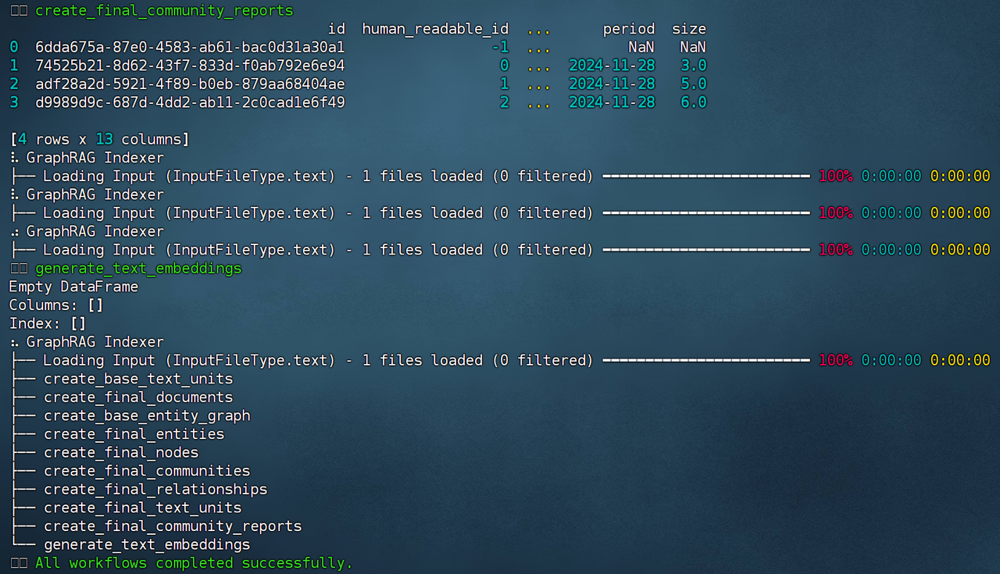

运行结束后，各知识图谱相关数据集都保存在output文件夹中：

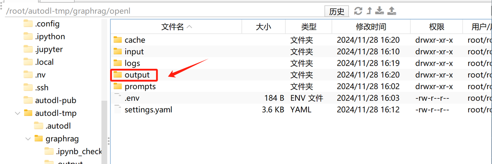

&#x20;

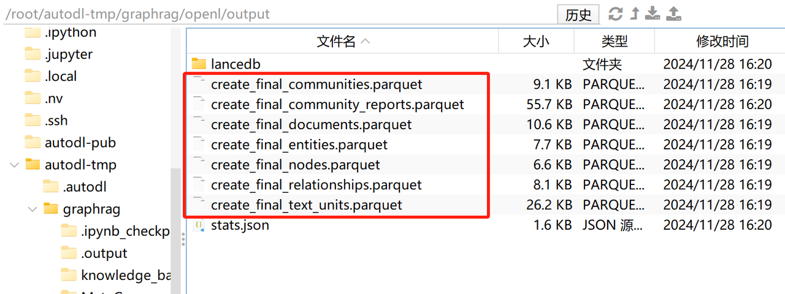

  **GraphRAG在索引阶段构建的知识图谱**的确是以 **Parquet** 格式保存的！索引阶段的输出文件中，Parquet 文件存储了知识图谱的各个核心组成部分，例如**实体**、**关系**、**社区信息**以及**文本单元**等。这些文件共同组成了一个完整的知识图谱。

索引阶段的主要输出内容如下：

1. **实体表（Nodes Table）**

   * **文件名**：`create_final_nodes.parquet`

   * **内容**：知识图谱中的实体节点（例如：人、地点、组织）。

   * **包含信息**：

     * 实体的名称（如 "John Doe"）。

     * 实体的类别（如 "PERSON", "ORGANIZATION", "LOCATION"）。

     * 与社区相关的信息（如实体所属的社区）。

     * 实体的度数（degree），表示该实体在图谱中的连接数。

2. **关系表（Relationships Table）**

   * **文件名**：`create_final_relationships.parquet`

   * **内容**：知识图谱中实体之间的关系（即图谱的边）。

   * **包含信息**：

     * 两个实体之间的关系描述（例如 "works for", "lives in"）。

     * 关系的强度（数值化，用于衡量关系的显著性或重要性）。

3. **嵌入向量表（Entity Embedding Table）**

   * **文件名**：`create_final_entities.parquet`

   * **内容**：实体的语义嵌入，用于表示实体的语义信息。

   * **用途**：支持语义搜索（通过嵌入计算实体之间的相似性）。

4. **社区报告表（Community Reports Table）**

   * **文件名**：`create_final_community_reports.parquet`

   * **内容**：社区的摘要信息。

   * **用途**：支持全局搜索（通过社区信息回答关于数据集整体的问题）。

5. **文本单元表（Text Units Table）**

   * **文件名**：`create_final_text_units.parquet`

   * **内容**：被切分的原始文本单元（TextUnits）。

   * **用途**：将知识图谱和原始文本结合，为 LLM 提供上下文支持。

6. **社区表（Community Table）**

   * **文件名**：`create_final_Communities.parquet`

   * **内容**：每个社区基本情况。

7. **文件表（Documents Table）**

   * **文件名**：`create_final_documents.parquet`

   * **内容**：用于记录所有参与知识图谱构建的文件情况。

1) **高效存储**：

* 知识图谱中的数据通常是结构化的，包含大量的实体、关系、嵌入等。

* Parquet 的列式存储能够显著减少磁盘占用，同时提高读取效率。

2. **快速读取**：

* 查询阶段需要快速加载实体、关系、嵌入等数据到内存中。

* Parquet 支持按需加载所需的列，避免了不必要的数据读取。

3. **兼容性好**：

* Parquet 是一个开放的标准，广泛支持各种数据处理工具（如 Pandas、Spark、Hadoop）。

* GraphRAG 可以在 Python 中使用 Pandas 或其他工具轻松读取这些文件。

#### 3.查看知识图谱相关表格

```python
import pandas as pd
```

* 文件表（Documents Table）

```python
documents_df = pd.read_parquet("./openl/output/create_final_documents.parquet")
documents_df
```


|   | id                               | human\_readable\_id | title               | text                                              | text\_unit\_ids                                    |
| - | -------------------------------- | ------------------- | ------------------- | ------------------------------------------------- | -------------------------------------------------- |
| 0 | c546fa97b72c8b72b7efb0c1ac45cb1d | 1                   | D3、C4.5决策树的建模流程.txt | Lesson 8.3 ID3、C4.5决策树的建模流程\nID3和C4.5作为的经典决策树算... | \[0653a697b64dd8c029503ffc22af9ec3, b1fce21a45f... |

* 文本单元表（TEXT UNIT Table）

```python
text_unit_df = pd.read_parquet("./openl/output/create_final_text_units.parquet")
text_unit_df
```


|   | id                               | human\_readable\_id | text                                              | n\_tokens | document\_ids                       | entity\_ids                                        | relationship\_ids                                  |
| - | -------------------------------- | ------------------- | ------------------------------------------------- | --------- | ----------------------------------- | -------------------------------------------------- | -------------------------------------------------- |
| 0 | 0653a697b64dd8c029503ffc22af9ec3 | 1                   | Lesson 8.3 ID3、C4.5决策树的建模流程\nID3和C4.5作为的经典决策树算... | 1200      | \[c546fa97b72c8b72b7efb0c1ac45cb1d] | \[22113170e6c742ba940314e15c401dc1, 23e8813975c... | \[813887b9c3f54445832a00a8d1b47264, 16f36977566... |
| 1 | b1fce21a45f01c5ef14bafc9fe3bab1d | 2                   | 8961919\n然后即可算出按照如此规则进行数据集划分，最终能够减少的不纯度数值：\n# ... | 1200      | \[c546fa97b72c8b72b7efb0c1ac45cb1d] | None                                               | None                                               |
| 2 | 08530861b09098077a0ebcd53ab3ae62 | 3                   | 4.5决策树的基本建模流程\n作为ID3的改进版算法，C4.5在ID3的基础上进行了三个方面... | 1200      | \[c546fa97b72c8b72b7efb0c1ac45cb1d] | \[22113170e6c742ba940314e15c401dc1, 23e8813975c... | \[813887b9c3f54445832a00a8d1b47264, 4979732df79... |
| 3 | e97cc7c63047f6471b4beac2f375eae0 | 4                   | 集划分。\n\nC4.5的连续变量处理方法\nC4.5允许带入连续变量进行建模，并且围绕连续... | 558       | \[c546fa97b72c8b72b7efb0c1ac45cb1d] | None                                               | None                                               |

* 实体嵌入表（ENTITIES Table）

```python
entity_embedding_df = pd.read_parquet("./openl/output/create_final_entities.parquet")
entity_embedding_df.head()
```


|   | id                               | human\_readable\_id | title     | type  | description                                       | text\_unit\_ids                                    |
| - | -------------------------------- | ------------------- | --------- | ----- | ------------------------------------------------- | -------------------------------------------------- |
| 0 | 22113170e6c742ba940314e15c401dc1 | 0                   | ID3       | EVENT | ID3 is a classic decision tree algorithm used ... | \[0653a697b64dd8c029503ffc22af9ec3, 08530861b09... |
| 1 | 23e8813975cc43d7921375da3c781c3c | 1                   | C4.5      | EVENT | C4.5 is an improved version of the ID3 decisio... | \[0653a697b64dd8c029503ffc22af9ec3, 08530861b09... |
| 2 | 3c4aa4fadb5c4b3f9244a7bb00598cab | 2                   | CART TREE | EVENT | CART Tree is a decision tree algorithm that se... | \[0653a697b64dd8c029503ffc22af9ec3]                |
| 3 | 0ebac52d90264cef8bf563ffe894bbe5 | 3                   | AGE       | EVENT | Age is a continuous variable that is discretiz... | \[0653a697b64dd8c029503ffc22af9ec3]                |
| 4 | d45fe94d4f2840b48ebd2564ddc85e56 | 4                   | INCOME    | EVENT | Income is a continuous variable that is discre... | \[0653a697b64dd8c029503ffc22af9ec3]                |

* 实体表（Nodes Table）

```python
entity_df = pd.read_parquet("./openl/output/create_final_nodes.parquet")
entity_df.head()
```


|   | id                               | human\_readable\_id | title     | community | level | degree | x | y |
| - | -------------------------------- | ------------------- | --------- | --------- | ----- | ------ | - | - |
| 0 | 22113170e6c742ba940314e15c401dc1 | 0                   | ID3       | 0         | 0     | 7      | 0 | 0 |
| 1 | 23e8813975cc43d7921375da3c781c3c | 1                   | C4.5      | 0         | 0     | 4      | 0 | 0 |
| 2 | 3c4aa4fadb5c4b3f9244a7bb00598cab | 2                   | CART TREE | 0         | 0     | 1      | 0 | 0 |
| 3 | 0ebac52d90264cef8bf563ffe894bbe5 | 3                   | AGE       | 0         | 0     | 1      | 0 | 0 |
| 4 | d45fe94d4f2840b48ebd2564ddc85e56 | 4                   | INCOME    | 0         | 0     | 1      | 0 | 0 |

```python
entity_df
```


|    | id                               | human\_readable\_id | title               | community | level | degree | x | y |
| -- | -------------------------------- | ------------------- | ------------------- | --------- | ----- | ------ | - | - |
| 0  | 22113170e6c742ba940314e15c401dc1 | 0                   | ID3                 | 0         | 0     | 7      | 0 | 0 |
| 1  | 23e8813975cc43d7921375da3c781c3c | 1                   | C4.5                | 0         | 0     | 4      | 0 | 0 |
| 2  | 3c4aa4fadb5c4b3f9244a7bb00598cab | 2                   | CART TREE           | 0         | 0     | 1      | 0 | 0 |
| 3  | 0ebac52d90264cef8bf563ffe894bbe5 | 3                   | AGE                 | 0         | 0     | 1      | 0 | 0 |
| 4  | d45fe94d4f2840b48ebd2564ddc85e56 | 4                   | INCOME              | 0         | 0     | 1      | 0 | 0 |
| 5  | 8979a4d40b04416a91f084e057be0c98 | 5                   | NUMPY               | 0         | 0     | 1      | 0 | 0 |
| 6  | 5a57bda8d0534c43a2591fde9519ef2e | 6                   | ML\_BASIC\_FUNCTION | 0         | 0     | 1      | 0 | 0 |
| 7  | 9ac71842fd5b47628a2cc43bb13b1290 | 7                   | SKLEARN             | 0         | 0     | 1      | 0 | 0 |
| 8  | 71c5eabc1ce9490f85f9357f6b7f309b | 8                   | CART                | 0         | 0     | 1      | 0 | 0 |
| 9  | de19324beea8438497852259c73c452a | 9                   | GAIN RATIO          | 0         | 0     | 1      | 0 | 0 |
| 10 | 67f0629e10054ba49b2d1bfd08985927 | 10                  | INFORMATION VALUE   | 0         | 0     | 1      | 0 | 0 |
| 11 | 22113170e6c742ba940314e15c401dc1 | 0                   | ID3                 | 1         | 1     | 7      | 0 | 0 |
| 12 | 23e8813975cc43d7921375da3c781c3c | 1                   | C4.5                | 2         | 1     | 4      | 0 | 0 |
| 13 | 3c4aa4fadb5c4b3f9244a7bb00598cab | 2                   | CART TREE           | 1         | 1     | 1      | 0 | 0 |
| 14 | 0ebac52d90264cef8bf563ffe894bbe5 | 3                   | AGE                 | 1         | 1     | 1      | 0 | 0 |
| 15 | d45fe94d4f2840b48ebd2564ddc85e56 | 4                   | INCOME              | 1         | 1     | 1      | 0 | 0 |
| 16 | 8979a4d40b04416a91f084e057be0c98 | 5                   | NUMPY               | 1         | 1     | 1      | 0 | 0 |
| 17 | 5a57bda8d0534c43a2591fde9519ef2e | 6                   | ML\_BASIC\_FUNCTION | 1         | 1     | 1      | 0 | 0 |
| 18 | 9ac71842fd5b47628a2cc43bb13b1290 | 7                   | SKLEARN             | 1         | 1     | 1      | 0 | 0 |
| 19 | 71c5eabc1ce9490f85f9357f6b7f309b | 8                   | CART                | 2         | 1     | 1      | 0 | 0 |
| 20 | de19324beea8438497852259c73c452a | 9                   | GAIN RATIO          | 2         | 1     | 1      | 0 | 0 |
| 21 | 67f0629e10054ba49b2d1bfd08985927 | 10                  | INFORMATION VALUE   | 2         | 1     | 1      | 0 | 0 |

关系表（Relationships Table）

```python
relationships_df = pd.read_parquet("./openl/output/create_final_relationships.parquet")
relationships_df.head()
```


|   | id                               | human\_readable\_id | source | target    | description                                       | weight | combined\_degree | text\_unit\_ids                                    |
| - | -------------------------------- | ------------------- | ------ | --------- | ------------------------------------------------- | ------ | ---------------- | -------------------------------------------------- |
| 0 | 813887b9c3f54445832a00a8d1b47264 | 0                   | ID3    | C4.5      | C4.5 is an improved version of the ID3 algorit... | 16.0   | 11               | \[0653a697b64dd8c029503ffc22af9ec3, 08530861b09... |
| 1 | 16f369775666497b8ece38456683313e | 1                   | ID3    | CART TREE | ID3 and CART Tree both aim to reduce dataset i... | 7.0    | 8                | \[0653a697b64dd8c029503ffc22af9ec3]                |
| 2 | 6e17fd4dce3a432195f428ec5287c71d | 2                   | ID3    | AGE       | Age is used as a feature in the ID3 algorithm,... | 6.0    | 8                | \[0653a697b64dd8c029503ffc22af9ec3]                |
| 3 | 121cc7bef78848b69ec89e082cb86a54 | 3                   | ID3    | INCOME    | Income is used as a feature in the ID3 algorit... | 1.0    | 8                | \[0653a697b64dd8c029503ffc22af9ec3]                |
| 4 | 294c8d020d0b4b389070c7c1959f1cc7 | 4                   | ID3    | SKLEARN   | ID3 is a decision tree algorithm that cannot b... | 5.0    | 8                | \[0653a697b64dd8c029503ffc22af9ec3]                |

社区表（Community Table）

```python
community_df = pd.read_parquet("./openl/output/create_final_communities.parquet")
community_df.head()
```


|   | id                                   | human\_readable\_id | community | level | title       | entity\_ids                                        | relationship\_ids                                  | text\_unit\_ids                                    | period     | size |
| - | ------------------------------------ | ------------------- | --------- | ----- | ----------- | -------------------------------------------------- | -------------------------------------------------- | -------------------------------------------------- | ---------- | ---- |
| 0 | 17bfead0-7ccc-438a-922b-5cd6deea39ea | 0                   | 0         | 0     | Community 0 | \[22113170e6c742ba940314e15c401dc1, 23e8813975c... | \[813887b9c3f54445832a00a8d1b47264, 16f36977566... | \[0653a697b64dd8c029503ffc22af9ec3,08530861b090... | 2024-11-28 | 11   |
| 1 | 8eb758a5-95a9-4e42-93e2-5ac1adff8a42 | 1                   | 1         | 1     | Community 1 | \[22113170e6c742ba940314e15c401dc1, 3c4aa4fadb5... | \[813887b9c3f54445832a00a8d1b47264, 16f36977566... | \[0653a697b64dd8c029503ffc22af9ec3,08530861b090... | 2024-11-28 | 7    |
| 2 | 7b75cf95-4504-47a7-8b11-7c90fe66109b | 2                   | 2         | 1     | Community 2 | \[23e8813975cc43d7921375da3c781c3c, 71c5eabc1ce... | \[4979732df79645ed88eea6e957cab2c7, 8a02e132514... | \[0653a697b64dd8c029503ffc22af9ec3,08530861b090... | 2024-11-28 | 4    |

```python
community_report_df = pd.read_parquet("./openl/output/create_final_community_reports.parquet")
community_report_df.head()
```


|   | id                                   | human\_readable\_id | community | level | title                                     | summary                                           | full\_content                                      | rank | rank\_explanation                                 | findings                                           | full\_content\_json                            | period     | size |
| - | ------------------------------------ | ------------------- | --------- | ----- | ----------------------------------------- | ------------------------------------------------- | -------------------------------------------------- | ---- | ------------------------------------------------- | -------------------------------------------------- | ---------------------------------------------- | ---------- | ---- |
| 0 | 100a5af4-6579-4fdc-afba-78565d6fe062 | 1                   | 1         | 1     | ID3 Algorithm and Related Technologies    | The community centers around the ID3 decision ... | # ID3 Algorithm and Related Technologies\n\nTh...  | 6.5  | The impact severity rating is moderate due to ... | \[{'explanation': 'The ID3 algorithm is the foc... | {\n "title": "ID3 Algorithm and Related Tec... | 2024-11-28 | 7    |
| 1 | 0e54e2ef-44ef-4bfa-8a8a-fd06f79ed338 | 2                   | 2         | 1     | C4.5 and Related Decision Tree Algorithms | The community centers around the C4.5 decision... | # C4.5 and Related Decision Tree Algorithms\n\\... | 7.5  | The impact severity rating is high due to C4.5... | \[{'explanation': 'C4.5 is an improved version ... | {\n "title": "C4.5 and Related Decision Tre... | 2024-11-28 | 4    |
| 2 | e527793c-b726-41be-892f-979334ae5073 | 0                   | 0         | 0     | C4.5 and Decision Tree Algorithms         | The community is centered around decision tree... | # C4.5 and Decision Tree Algorithms\n\nThe com...  | 7.5  | The impact severity rating is high due to the ... | \[{'explanation': 'C4.5 is an improved version ... | {\n "title": "C4.5 and Decision Tree Algori... | 2024-11-28 | 11   |

是**社区报告（Community Reports）** 每一行代表一个社区的摘要信息，包含了与该社区相关的标题、摘要、实体、关系等详细内容。这些信息是 GraphRAG 在索引阶段基于知识图谱生成的高层次语义总结，用于帮助回答关于数据集整体的问题（例如全局搜索）。

**表格字段的含义**

1. **`id`**

   * 每个社区的唯一标识符（UUID）。

   * 这是系统内部生成的，通常用于追踪社区记录。

2. **`human_readable_id`**

   * 更容易理解的人类可读ID（数字化或短标识符）。

   * 通常用于直观地区分社区。

3. **`community`**

   * 社区的编号，代表社区的分类或标识。

4. **`level`**

   * 社区层级（`COMMUNITY_LEVEL`）。

   * 表示社区的聚类粒度。较低的值表示更抽象的层级，较高的值表示更具体的细分社区。

5. **`title`**

   * 社区的标题。

   * 对该社区的简要描述，用于表示该社区的主题核心。例如：

     * **`ID3 Decision Tree Algorithm Community`**

     * **`C4.5 and Sklearn Integration`**

6. **`summary`**

   * 社区的摘要。

   * 对该社区内容的进一步扩展描述，解释其主题或涵盖的主要内容。

7. **`full_content`**

   * 社区报告的完整内容。

   * 包括更详细的信息，可能包含标题、摘要、重要发现等。

8. **`rank`**

   * 社区的排名或评分。

   * 可能用来表示社区的重要性、影响力或相关性。

9. **`rank_explanation`**

   * 对排名的解释。

   * 例如，“影响严重性从中等到高”。

10. **`findings`**

    * 社区的主要发现（JSON 格式）。

    * 包含详细的解释或分析。例如：

      * **ID3 算法是该社区的核心主题。**

      * **C4.5 是 ID3 的改进版本，结合了 Sklearn 的功能。**

11. **`full_content_json`**

    * 社区完整内容的 JSON 表示。

    * 如果需要以结构化方式处理社区内容，这个字段是关键。

12. **`period`**

    * 报告的时间戳或周期。

    * 在你的示例中，是 `2024-11-26`，表示报告生成的日期。

13. **`size`**

    * 社区的大小。

    * 表示该社区包含的实体或内容的数量。例如：

      * **社区 0 包含 8 个内容。**

      * **社区 1 包含 2 个内容。**

**结果解释**
从你的结果中可以看出：

1. **社区 0**：

   * 标题是“ID3 Decision Tree Algorithm Community”。

   * 主题围绕 ID3 决策树算法。

   * 内容提到了该算法的重要性，以及其对机器学习领域的影响。

   * 社区大小为 8。

2. **社区 1**：

   * 标题是“C4.5 and Sklearn Integration”。

   * 主题是 C4.5 算法和 Sklearn 的集成。

   * 该社区比社区 0 更小（仅有 2 个内容）。

   * 排名评分为 4.5，影响程度适中。

**用途**
社区报告在查询阶段可以用于：

1. **全局搜索（Global Search）**：

   * 回答关于数据集整体的问题，例如“这些文档的主要主题是什么？”

2. **快速理解社区**：

   * 帮助用户快速了解数据集中不同部分的主题和相关信息。

3. **可视化与调试**：

   * 将这些社区报告与知识图谱结合起来，可以直观地呈现社区的结构和语义关系。

### 三、GraphRAG问答流程

#### 1.导入核心关系组

```python
import os

import pandas as pd
import tiktoken

from graphrag.query.context_builder.entity_extraction import EntityVectorStoreKey
from graphrag.query.indexer_adapters import (
    read_indexer_covariates,
    read_indexer_entities,
    read_indexer_relationships,
    read_indexer_reports,
    read_indexer_text_units,
)
from graphrag.query.input.loaders.dfs import (
    store_entity_semantic_embeddings,
)
from graphrag.query.llm.oai.chat_openai import ChatOpenAI
from graphrag.query.llm.oai.embedding import OpenAIEmbedding
from graphrag.query.llm.oai.typing import OpenaiApiType
from graphrag.query.question_gen.local_gen import LocalQuestionGen
from graphrag.query.structured_search.local_search.mixed_context import (
    LocalSearchMixedContext,
)
from graphrag.query.structured_search.local_search.search import LocalSearch
from graphrag.vector_stores.lancedb import LanceDBVectorStore
```

**与索引器相关的模块**

* **`read_indexer_*`**
  从不同的索引文件中读取数据（例如实体、关系、摘要等）。这些模块负责加载索引器生成的数据到 Python 中，供后续搜索或分析使用：

  * `read_indexer_covariates`: 读取与数据协变量（附加属性）相关的信息。

  * `read_indexer_entities`: 读取从数据中提取的实体。

  * `read_indexer_relationships`: 读取实体间的关系。

  * `read_indexer_reports`: 读取生成的社区报告摘要。

  * `read_indexer_text_units`: 读取切分后的文本单元（TextUnits）。

* **`store_entity_semantic_embeddings`**
  将实体的语义嵌入存储到向量数据库中。GraphRAG 用嵌入向量来表示实体间的语义关系。

**与 LLM（大型语言模型）相关的模块**

* **`ChatOpenAI`**
  一个封装了 OpenAI 聊天模型（如 GPT 系列）的接口，允许你通过编程与 OpenAI 模型交互（如提出问题、获取回答）。

* **`OpenAIEmbedding`**
  用于生成文本的嵌入向量的模块，通过调用 OpenAI 的嵌入 API，将文本转换为语义向量表示。

* **`OpenaiApiType`**
  定义 OpenAI API 的具体类型，可能包括“聊天模型”、“嵌入模型”等。

**与本地搜索相关的模块**

* **`LocalSearch`**
  GraphRAG 的本地搜索引擎，专注于通过上下文和邻近信息回答关于特定实体的问题。

* **`LocalSearchMixedContext`**
  允许混合使用不同上下文数据（例如实体及其邻居的关系）来丰富本地搜索的结果。

* **`LocalQuestionGen`**
  用于在本地搜索中生成问题的模块，帮助生成更相关的问题。

**与向量存储相关的模块**

* **`LanceDBVectorStore`**
  GraphRAG 使用的向量存储解决方案之一，支持存储和检索语义嵌入向量。可以快速高效地查找与查询向量最相似的嵌入。

```python
INPUT_DIR = "./openl/output"
LANCEDB_URI = f"{INPUT_DIR}/lancedb"

COMMUNITY_REPORT_TABLE = "create_final_community_reports"
ENTITY_TABLE = "create_final_nodes"
ENTITY_EMBEDDING_TABLE = "create_final_entities"
RELATIONSHIP_TABLE = "create_final_relationships"
TEXT_UNIT_TABLE = "create_final_text_units"
COMMUNITY_LEVEL = 2
```

**定义输入目录与文件路径**

```python
INPUT_DIR = "./openl/output"
LANCEDB_URI = f"{INPUT_DIR}/lancedb"
```

* **`INPUT_DIR`**：索引器输出文件的存放目录。在这里，索引器输出的路径为 `./openl/output`。

* **`LANCEDB_URI`**：存放向量存储（LanceDB 数据库）的目录路径。在 GraphRAG 中，实体嵌入向量通常被存储在 LanceDB 中，以便后续搜索时高效检索。

**定义数据表文件名**

```python
COMMUNITY_REPORT_TABLE = "create_final_community_reports"
ENTITY_TABLE = "create_final_nodes"
ENTITY_EMBEDDING_TABLE = "create_final_entities"
RELATIONSHIP_TABLE = "create_final_relationships"
COVARIATE_TABLE = "create_final_covariates"
TEXT_UNIT_TABLE = "create_final_text_units"
COMMUNITY_LEVEL = 2
```

* **`COMMUNITY_REPORT_TABLE`**：存储社区报告的文件名。社区报告是基于知识图谱生成的每个社区的摘要。

* **`ENTITY_TABLE`**：存储实体的文件名（知识图谱中的节点）。每个节点代表一个实体，例如人、地点或组织。

* **`ENTITY_EMBEDDING_TABLE`**：存储实体的嵌入向量。嵌入表示实体的语义信息，用于计算实体之间的相似性。

* **`RELATIONSHIP_TABLE`**：存储实体间关系的文件名（知识图谱中的边）。关系表示两个实体之间的交互或连接。

* **`TEXT_UNIT_TABLE`**：存储文本单元的文件名（原始文本数据被切分为的小块）。

* **`COMMUNITY_LEVEL`**：指定加载的社区层级。社区层级表示知识图谱的聚类粒度（层次化结构中的第2层）。

```python
entity_df = pd.read_parquet(f"{INPUT_DIR}/{ENTITY_TABLE}.parquet")
entity_embedding_df = pd.read_parquet(f"{INPUT_DIR}/{ENTITY_EMBEDDING_TABLE}.parquet")

entities = read_indexer_entities(entity_df, entity_embedding_df, COMMUNITY_LEVEL)

description_embedding_store = LanceDBVectorStore(
    collection_name="default-entity-description",
)
description_embedding_store.connect(db_uri=LANCEDB_URI)
entity_description_embeddings = store_entity_semantic_embeddings(
    entities=entities, vectorstore=description_embedding_store
)

print(f"Entity count: {len(entity_df)}")
entity_df.head()
```

```plaintext
Entity count: 22
```


|   | id                               | human\_readable\_id | title     | community | level | degree | x | y |
| - | -------------------------------- | ------------------- | --------- | --------- | ----- | ------ | - | - |
| 0 | 22113170e6c742ba940314e15c401dc1 | 0                   | ID3       | 0         | 0     | 7      | 0 | 0 |
| 1 | 23e8813975cc43d7921375da3c781c3c | 1                   | C4.5      | 0         | 0     | 4      | 0 | 0 |
| 2 | 3c4aa4fadb5c4b3f9244a7bb00598cab | 2                   | CART TREE | 0         | 0     | 1      | 0 | 0 |
| 3 | 0ebac52d90264cef8bf563ffe894bbe5 | 3                   | AGE       | 0         | 0     | 1      | 0 | 0 |
| 4 | d45fe94d4f2840b48ebd2564ddc85e56 | 4                   | INCOME    | 0         | 0     | 1      | 0 | 0 |

```python
relationship_df = pd.read_parquet(f"{INPUT_DIR}/{RELATIONSHIP_TABLE}.parquet")
relationships = read_indexer_relationships(relationship_df)

print(f"Relationship count: {len(relationship_df)}")
relationship_df.head()
```

```plaintext
Relationship count: 10
```


|   | id                               | human\_readable\_id | source | target    | description                                       | weight | combined\_degree | text\_unit\_ids                                    |
| - | -------------------------------- | ------------------- | ------ | --------- | ------------------------------------------------- | ------ | ---------------- | -------------------------------------------------- |
| 0 | 813887b9c3f54445832a00a8d1b47264 | 0                   | ID3    | C4.5      | C4.5 is an improved version of the ID3 algorit... | 16.0   | 11               | \[0653a697b64dd8c029503ffc22af9ec3, 08530861b09... |
| 1 | 16f369775666497b8ece38456683313e | 1                   | ID3    | CART TREE | ID3 and CART Tree both aim to reduce dataset i... | 7.0    | 8                | \[0653a697b64dd8c029503ffc22af9ec3]                |
| 2 | 6e17fd4dce3a432195f428ec5287c71d | 2                   | ID3    | AGE       | Age is used as a feature in the ID3 algorithm,... | 6.0    | 8                | \[0653a697b64dd8c029503ffc22af9ec3]                |
| 3 | 121cc7bef78848b69ec89e082cb86a54 | 3                   | ID3    | INCOME    | Income is used as a feature in the ID3 algorit... | 1.0    | 8                | \[0653a697b64dd8c029503ffc22af9ec3]                |
| 4 | 294c8d020d0b4b389070c7c1959f1cc7 | 4                   | ID3    | SKLEARN   | ID3 is a decision tree algorithm that cannot b... | 5.0    | 8                | \[0653a697b64dd8c029503ffc22af9ec3]                |

```python
report_df = pd.read_parquet(f"{INPUT_DIR}/{COMMUNITY_REPORT_TABLE}.parquet")
reports = read_indexer_reports(report_df, entity_df, COMMUNITY_LEVEL)

print(f"Report records: {len(report_df)}")
report_df.head()
```

```plaintext
Report records: 3
```


|   | id                                   | human\_readable\_id | community | level | title                                     | summary                                           | full\_content                                      | rank | rank\_explanation                                 | findings                                           | full\_content\_json                            | period     | size |
| - | ------------------------------------ | ------------------- | --------- | ----- | ----------------------------------------- | ------------------------------------------------- | -------------------------------------------------- | ---- | ------------------------------------------------- | -------------------------------------------------- | ---------------------------------------------- | ---------- | ---- |
| 0 | 100a5af4-6579-4fdc-afba-78565d6fe062 | 1                   | 1         | 1     | ID3 Algorithm and Related Technologies    | The community centers around the ID3 decision ... | # ID3 Algorithm and Related Technologies\n\nTh...  | 6.5  | The impact severity rating is moderate due to ... | \[{'explanation': 'The ID3 algorithm is the foc... | {\n "title": "ID3 Algorithm and Related Tec... | 2024-11-28 | 7    |
| 1 | 0e54e2ef-44ef-4bfa-8a8a-fd06f79ed338 | 2                   | 2         | 1     | C4.5 and Related Decision Tree Algorithms | The community centers around the C4.5 decision... | # C4.5 and Related Decision Tree Algorithms\n\\... | 7.5  | The impact severity rating is high due to C4.5... | \[{'explanation': 'C4.5 is an improved version ... | {\n "title": "C4.5 and Related Decision Tre... | 2024-11-28 | 4    |
| 2 | e527793c-b726-41be-892f-979334ae5073 | 0                   | 0         | 0     | C4.5 and Decision Tree Algorithms         | The community is centered around decision tree... | # C4.5 and Decision Tree Algorithms\n\nThe com...  | 7.5  | The impact severity rating is high due to the ... | \[{'explanation': 'C4.5 is an improved version ... | {\n "title": "C4.5 and Decision Tree Algori... | 2024-11-28 | 11   |

```python
text_unit_df = pd.read_parquet(f"{INPUT_DIR}/{TEXT_UNIT_TABLE}.parquet")
text_units = read_indexer_text_units(text_unit_df)

print(f"Text unit records: {len(text_unit_df)}")
text_unit_df.head()
```

```plaintext
Text unit records: 4
```


|   | id                               | human\_readable\_id | text                                              | n\_tokens | document\_ids                       | entity\_ids                                        | relationship\_ids                                  |
| - | -------------------------------- | ------------------- | ------------------------------------------------- | --------- | ----------------------------------- | -------------------------------------------------- | -------------------------------------------------- |
| 0 | 0653a697b64dd8c029503ffc22af9ec3 | 1                   | Lesson 8.3 ID3、C4.5决策树的建模流程\nID3和C4.5作为的经典决策树算... | 1200      | \[c546fa97b72c8b72b7efb0c1ac45cb1d] | \[22113170e6c742ba940314e15c401dc1, 23e8813975c... | \[813887b9c3f54445832a00a8d1b47264, 16f36977566... |
| 1 | b1fce21a45f01c5ef14bafc9fe3bab1d | 2                   | 8961919\n然后即可算出按照如此规则进行数据集划分，最终能够减少的不纯度数值：\n# ... | 1200      | \[c546fa97b72c8b72b7efb0c1ac45cb1d] | None                                               | None                                               |
| 2 | 08530861b09098077a0ebcd53ab3ae62 | 3                   | 4.5决策树的基本建模流程\n作为ID3的改进版算法，C4.5在ID3的基础上进行了三个方面... | 1200      | \[c546fa97b72c8b72b7efb0c1ac45cb1d] | \[22113170e6c742ba940314e15c401dc1, 23e8813975c... | \[813887b9c3f54445832a00a8d1b47264, 4979732df79... |
| 3 | e97cc7c63047f6471b4beac2f375eae0 | 4                   | 集划分。\n\nC4.5的连续变量处理方法\nC4.5允许带入连续变量进行建模，并且围绕连续... | 558       | \[c546fa97b72c8b72b7efb0c1ac45cb1d] | None                                               | None                                               |

#### 2.设置模型参数

* GraphRAG v 0.5版本bug修复

  GraphRAG最新版 v0.5版本当使用OpenAI的Embedding模型时，会出现运行报错，此时需要修改lancedb.py文件才可正常运行。在Ubuntu服务器下，脚本文件地址如下：

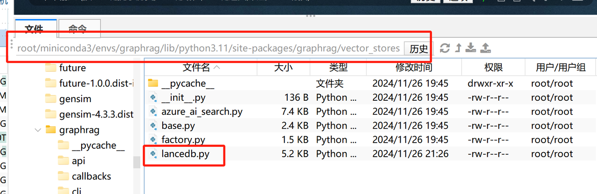

打开脚本文件后需修改如下内容：

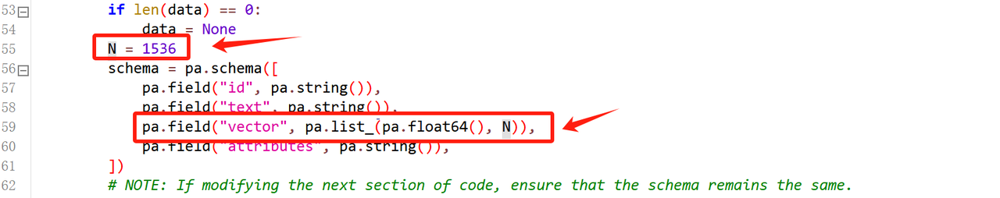

当使用OpenAI text-embedding-3-small时，需手动设置N=1536，而若使用text-embedding-3-large，则需要将N设置为3072：


* 设置模型参数

```python
api_key = "YOUR_API_KEY"
llm_model = "gpt-4o"
embedding_model = "text-embedding-3-small"
```

```python
llm = ChatOpenAI(
    api_key=api_key,
    model=llm_model,
    api_base="https://ai.devtool.tech/proxy/v1",
    api_type=OpenaiApiType.OpenAI,  
    max_retries=20,
)

token_encoder = tiktoken.get_encoding("cl100k_base")

text_embedder = OpenAIEmbedding(
    api_key=api_key,
    api_base="https://ai.devtool.tech/proxy/v1",
    api_type=OpenaiApiType.OpenAI,
    model=embedding_model,
    deployment_name=embedding_model,
    max_retries=20,
)
```

**初始化 Chat 模型**

* **`ChatOpenAI`**：

  * 用于与 OpenAI 或 Azure OpenAI 的聊天模型（如 GPT 系列）交互。

  * **参数说明**：

    * **`api_key`**：访问 OpenAI 或 Azure OpenAI 的密钥。

    * **`model`**：指定 LLM 模型名称（如 `gpt-4`）。

      * **`api_base`**：API 的基础路径，可以填写反向代理地址

    * **`api_type`**：API 类型，可以是：

      * **`OpenaiApiType.OpenAI`**：OpenAI 直连服务。

      * **`OpenaiApiType.AzureOpenAI`**：Azure OpenAI 服务。

    * **`max_retries`**：最大重试次数，以处理网络或服务中断。

**初始化文本分词器**

* **`tiktoken`**：

  * 用于对输入文本进行分词或令牌化操作。

  * **`cl100k_base`**：一种令牌编码方式，适用于 GPT 系列模型（如 `gpt-3.5-turbo` 和 `gpt-4`）。

  * **用途**：

    * 计算输入文本的令牌数量，确保不超过模型的上下文窗口限制。

**初始化嵌入生成器**

* **`OpenAIEmbedding`**：

  * 用于生成文本的嵌入向量。

  * **参数说明**：

    * **`api_key`**：用于访问 OpenAI 嵌入 API 的密钥。

    * **`api_base`**：API 的基础路径，可以填写反向代理地址

    * **`api_type`**：API 类型，与 LLM 相同。

    * **`model`**：指定嵌入模型名称，例如 `text-embedding-ada-002`。

    * **`deployment_name`**：Azure 模型部署名称（如果使用 Azure）。

    * **`max_retries`**：最大重试次数。

#### 3.构建LocalSearch（本地搜索）搜索引擎并进行问答

* **创建LocalSearch上下文构建器**

```python
context_builder = LocalSearchMixedContext(
    community_reports=reports,
    text_units=text_units,
    entities=entities,
    relationships=relationships,
    covariates=None,
    entity_text_embeddings=description_embedding_store,
    embedding_vectorstore_key=EntityVectorStoreKey.ID,  
    text_embedder=text_embedder,
    token_encoder=token_encoder,
)
```

  本段代码的主要功能是**创建本地搜索的上下文构建器（Context Builder）**。上下文构建器的作用是整合所有加载的数据（如社区报告、文本单元、实体、关系等），为后续的本地搜索提供语义丰富的上下文。

**参数解析**

1. **`community_reports`**

   * 传入之前加载的社区报告数据（`reports`）。

   * 用于补充社区级别的背景信息，在本地搜索中提供更多上下文。

2. **`text_units`**

   * 传入已加载的文本单元数据（`text_units`）。

   * 提供来自原始文档的小块文本，用于回答具体问题或补充答案的上下文。

3. **`entities`**

   * 传入知识图谱中的实体（`entities`）。

   * 提供实体的详细信息和属性，帮助本地搜索定位特定实体。

4. **`relationships`**

   * 传入知识图谱中的关系（`relationships`）。

   * 用于描述实体之间的交互和连接，有助于构建更复杂的答案。

5. **`covariates`**

   * 传入协变量数据（`covariates`），如果索引阶段未启用协变量，设置为 `None`。

   * **用途**：

     * 提供附加声明性元数据或上下文信息。

     * 如果协变量未启用，仍可正常运行本地搜索，但答案可能少一些附加的语义信息。

6. **`entity_text_embeddings`**

   * 传入实体嵌入的存储对象（`description_embedding_store`）。

   * **用途**：

     * 将实体的文本嵌入存储在向量数据库中。

     * 用于通过语义搜索快速找到相关实体。

7. **`embedding_vectorstore_key`**

   * 设置嵌入向量存储的键类型。

   * **`EntityVectorStoreKey.ID`**：

     * 如果向量存储中的实体是按 ID 存储的，使用此键。

   * **`EntityVectorStoreKey.TITLE`**：

     * 如果向量存储按实体标题存储，则改为设置为 `TITLE`。

8. **`text_embedder`**

   * 传入嵌入生成器对象（`text_embedder`）。

   * 用于生成文本或问题的语义嵌入，支持与存储的实体嵌入进行相似度比较。

9. **`token_encoder`**

   * 传入分词器（`token_encoder`）。

   * **用途**：

     * 确保生成的上下文不会超过 LLM 的上下文窗口限制。

     * 有助于在构建查询时分配合理的上下文。

**上下文构建器的作用**
上下文构建器是本地搜索的核心组件，它负责将加载的数据整合成结构化的上下文，包括：

1. **结合社区级摘要（Community Reports）**：

   * 提供更高层次的背景信息，用于回答主题性问题。

2. **整合文本单元（Text Units）**：

   * 使用来自原始文档的文本片段，为问题构建直接的上下文。

3. **集成知识图谱的实体和关系**：

   * 为本地搜索中的实体相关问题提供详细的语义信息。

4. **利用嵌入和分词**：

   * 嵌入存储和分词器确保上下文生成语义准确，符合 LLM 的上下文限制。

* **创建本地搜索引擎参数组**

```python
local_context_params = {
    "text_unit_prop": 0.5,
    "community_prop": 0.1,
    "conversation_history_max_turns": 5,
    "conversation_history_user_turns_only": True,
    "top_k_mapped_entities": 10,
    "top_k_relationships": 10,
    "include_entity_rank": True,
    "include_relationship_weight": True,
    "include_community_rank": True,
    "return_candidate_context": True,
    "embedding_vectorstore_key": EntityVectorStoreKey.ID,  
    "max_tokens": 12_000, 
}

llm_params = {
    "max_tokens": 2_000, 
    "temperature": 0.0,
}
```

**参数解析**：

* **`text_unit_prop`**：

  * 上下文窗口中分配给文本单元（Text Units）的比例（50%）。

  * 控制原始文档中的文本内容在上下文中的权重。

* **`community_prop`**：

  * 上下文窗口中分配给社区报告（Community Reports）的比例（10%）。

  * 用于为回答提供更高层次的社区背景。

* **`conversation_history_max_turns`**：

  * 上下文中包含的最大对话轮数（5轮）。

  * 控制是否包括之前的对话历史，以及保留的对话轮数。

* **`conversation_history_user_turns_only`**：

  * 如果为 `True`，则只包括用户的提问，而忽略模型的回答。

* **`top_k_mapped_entities`**：

  * 从嵌入向量存储中检索的相关实体的数量（10个）。

* **`top_k_relationships`**：

  * 检索到上下文窗口中的最大关系数（10个）。

* **`include_entity_rank`**：

  * 是否在上下文中包含实体的排名（默认是根据实体的节点度数）。

* **`include_relationship_weight`**：

  * 是否在上下文中包含关系权重（例如，表示关系的重要性）。

* **`include_community_rank`**：

  * 是否在上下文中包含社区排名。这里设置为 `False`。

* **`return_candidate_context`**：

  * 如果为 `True`，返回一个数据帧集合，包含所有可能相关的实体、关系和协变量记录。这些记录的上下文中会有一列 `in_context` 表示是否被纳入上下文窗口。

* **`embedding_vectorstore_key`**：

  * 嵌入向量存储的键类型。

  * 如果向量存储的标识符是实体标题而非 ID，则设置为 `EntityVectorStoreKey.TITLE`。

* **`max_tokens`**：

  * 上下文窗口允许的最大令牌数（12,000个）。

  * 需要根据所用 LLM 的令牌限制调整（例如，GPT-4 支持 8,192 或 32,768）。

* **创建本地搜索引擎**

```python
search_engine = LocalSearch(
    llm=llm,
    context_builder=context_builder,
    token_encoder=token_encoder,
    llm_params=llm_params,
    context_builder_params=local_context_params,
    response_type="multiple paragraphs", 
)
```

**参数解析**：

* **`llm`**：

  * 已初始化的 LLM 对象（`ChatOpenAI`），用于生成答案。

* **`context_builder`**：

  * 上一段代码中创建的上下文构建器（`LocalSearchMixedContext`），负责生成语义丰富的上下文。

* **`token_encoder`**：

  * 分词器，用于计算上下文和生成回答的令牌数，确保不会超过 LLM 的限制。

* **`llm_params`**：

  * 用于 LLM 的参数，包括生成答案时的令牌数和温度。

* **`context_builder_params`**：

  * 上下文构建器的配置，控制上下文中每种数据的比例和数量限制。

* **`response_type`**：

  * 指定回答的格式。

  * 此处为 `"multiple paragraphs"`，表示生成的回答以多段文字形式呈现。

  * 可以根据需求设置为 `"single paragraph"` 或 `"prioritized list"` 等。

* 基于本地搜索的问答流程

```python
result = await search_engine.asearch("请帮我介绍下ID3决策树算法")
```

```python
display(Markdown(result.response))
```

ID3（Iterative Dichotomiser 3）决策树算法是一种用于分类的机器学习算法，由Ross Quinlan在1986年提出。它是一种基于信息增益的决策树生成算法，广泛应用于数据挖掘和知识发现领域。以下是对ID3算法的详细介绍。

### 算法概述

ID3算法的核心思想是通过选择具有最大信息增益的特征来分割数据集，从而构建决策树。信息增益是衡量一个特征在数据集上对分类结果的影响程度的指标。ID3算法通过递归地选择特征并分割数据集，最终生成一棵决策树。

### 信息增益

信息增益是ID3算法选择特征的标准。它基于信息论中的熵概念。熵用于衡量数据集的纯度或不确定性。信息增益计算如下：

1. **计算数据集的熵**：熵越高，数据集的不确定性越大。

2. **计算特征的条件熵**：在给定特征的条件下，数据集的熵。

3. **计算信息增益**：信息增益等于数据集的熵减去特征的条件熵。

选择信息增益最大的特征作为当前节点的分裂特征。

### 算法步骤

1. **初始化**：从根节点开始，计算当前数据集的熵。

2. **选择特征**：计算每个特征的信息增益，选择信息增益最大的特征进行分裂。

3. **分裂数据集**：根据选择的特征，将数据集分裂成子集。

4. **递归构建子树**：对每个子集，重复上述步骤，直到满足停止条件（如所有实例属于同一类，或没有剩余特征可分裂）。

5. **生成决策树**：当所有节点都满足停止条件时，生成完整的决策树。

### 优缺点

**优点**：

* 简单易懂，易于实现。

* 生成的决策树具有良好的可解释性。

**缺点**：

* 对噪声数据敏感，容易过拟合。

* 只能处理离散特征，连续特征需要离散化。

* 不支持缺失值处理。

### 应用场景

ID3算法适用于需要解释性强的分类任务，如信用评分、医疗诊断等。然而，由于其对噪声敏感和过拟合的缺点，在实际应用中常与其他技术结合使用，如剪枝技术或使用改进版本（如C4.5算法）。

总之，ID3决策树算法是机器学习中一种经典的分类算法，尽管存在一些局限性，但其简单性和可解释性使其在许多领域得到了广泛应用。

#### 4.构建GlobalSearch（全局搜索）搜索引擎并进行问答

* 导入知识图谱相关内容

```python
from graphrag.query.indexer_adapters import (
    read_indexer_communities,
    read_indexer_entities,
    read_indexer_reports,
)
from graphrag.query.llm.oai.chat_openai import ChatOpenAI
from graphrag.query.llm.oai.typing import OpenaiApiType
from graphrag.query.structured_search.global_search.community_context import (
    GlobalCommunityContext,
)
from graphrag.query.structured_search.global_search.search import GlobalSearch
```

```python
COMMUNITY_TABLE = "create_final_communities"
COMMUNITY_REPORT_TABLE = "create_final_community_reports"
ENTITY_TABLE = "create_final_nodes"
ENTITY_EMBEDDING_TABLE = "create_final_entities"
```

```python
community_df = pd.read_parquet(f"{INPUT_DIR}/{COMMUNITY_TABLE}.parquet")
entity_df = pd.read_parquet(f"{INPUT_DIR}/{ENTITY_TABLE}.parquet")
report_df = pd.read_parquet(f"{INPUT_DIR}/{COMMUNITY_REPORT_TABLE}.parquet")
entity_embedding_df = pd.read_parquet(f"{INPUT_DIR}/{ENTITY_EMBEDDING_TABLE}.parquet")

communities = read_indexer_communities(community_df, entity_df, report_df)
reports = read_indexer_reports(report_df, entity_df, COMMUNITY_LEVEL)
entities = read_indexer_entities(entity_df, entity_embedding_df, COMMUNITY_LEVEL)
```

* 创建Global Search模式的上下文构建器 (context\_builder)

```python
context_builder = GlobalCommunityContext(
    community_reports=reports,
    communities=communities,
    entities=entities,  
    token_encoder=token_encoder,
)
```

代码解释如下：

1. **`GlobalCommunityContext`**:

   * 这是一个为 **Global Search** 模式创建的上下文构建器。它负责从不同的数据源（如社区报告、实体、社区信息等）中提取相关数据，并构建一个用于查询的大范围上下文。

   * 这个构建器帮助为整个文档集合（而不是某个特定实体）构建一个全局的知识背景，以便模型能够对广泛的问题做出响应。

2. **`community_reports=reports`**:

   * 这里传入的是之前从文件中读取的 `reports` 数据（也就是 `COMMUNITY_REPORT_TABLE` 表格的数据）。

   * 这些报告包含了关于不同社区的详细信息，如主题、摘要、影响力、发现等。

   * 在全局搜索中，这些社区报告有助于构建整个数据集的高层次概览。

3. **`communities=communities`**:

   * `communities` 数据包含社区的结构和信息。在图谱中，社区可能代表了不同的主题、领域或相关性较高的实体群体。

   * 这部分数据通常用于在全局搜索时进行分组和排名，比如通过社群的重要性或与查询的相关性来排序。

4. **`entities=entities`**:

   * `entities` 是从之前的索引步骤中提取的实体数据（来自 `ENTITY_TABLE` 表）。

   * 这些实体（如人物、地点、事件等）可以用来扩展全局搜索的范围。它们提供了具体的名词、对象和概念，有助于为全局查询提供上下文。

   * **注意：** 如果不希望在全局搜索中使用社区权重来影响排名（例如，不考虑某个社区对某个实体的影响），可以将 `entities` 参数设为 `None`。

5. **`token_encoder=token_encoder`**:

   * `token_encoder` 是用于对文本进行编码的工具。它将文本转化为可以输入到模型中的 token 序列。

   * 在之前的代码中，我们已经看到 `token_encoder` 是通过 `tiktoken.get_encoding("cl100k_base")` 获取的，它的作用是把文本切分为一定的 token 数量，以便在模型中使用。

* 配置全局搜索参数

```python
context_builder_params = {
    "use_community_summary": False,  
    "shuffle_data": True,
    "include_community_rank": True,
    "min_community_rank": 0,
    "community_rank_name": "rank",
    "include_community_weight": True,
    "community_weight_name": "occurrence weight",
    "normalize_community_weight": True,
    "max_tokens": 12_000,  
    "context_name": "Reports",
}

map_llm_params = {
    "max_tokens": 1000,
    "temperature": 0.0,
    "response_format": {"type": "json_object"},
}

reduce_llm_params = {
    "max_tokens": 2000, 
    "temperature": 0.0,
}
```

* 构建全局搜索引擎

```python
search_engine = GlobalSearch(
    llm=llm,
    context_builder=context_builder,
    token_encoder=token_encoder,
    max_data_tokens=12_000,  
    map_llm_params=map_llm_params,
    reduce_llm_params=reduce_llm_params,
    allow_general_knowledge=False, 
    json_mode=True,  
    context_builder_params=context_builder_params,
    concurrent_coroutines=32,
    response_type="multiple paragraphs",  
)
```

这里创建了一个 **全局搜索（Global Search）** 引擎，利用前面配置的上下文构建器 (`context_builder`)、语言模型 (`llm`)、以及其它相关的参数进行搜索。对应参数详解如下：

* **`llm`**:

  * 这个参数传入的是已经配置好的语言模型（LLM），即你之前定义的 `ChatOpenAI` 模型。全局搜索引擎将使用这个模型来生成回答。

* **`context_builder`**:

  * 上下文构建器，之前我们已经讨论了 `GlobalCommunityContext`，它负责根据社区报告、社区等信息来构建查询的上下文。

* **`token_encoder`**:

  * `token_encoder` 是用来处理文本的编码工具，通常是一个模型专用的 tokenizer。在这里，我们使用了 `tiktoken.get_encoding("cl100k_base")`，它是 OpenAI 模型的一个编码器，用来将文本转化为 token 格式。

* **`max_data_tokens`**:

  * 最大数据 token 数量。它控制了模型可以处理的最大上下文大小。你可以根据实际使用的模型的最大 token 限制来设置（例如，如果模型最大 token 限制是 8K，则可以设置为 5000，留一些余量）。这个设置控制了全局搜索时在上下文窗口内所使用的最大 token 数。

* **`map_llm_params`** 和 **`reduce_llm_params`**:

  * 这两个参数分别传入了映射和归约阶段的 LLM 配置（之前我们已经详细分析过这些参数）。这些参数会影响 LLM 在不同阶段生成内容的方式（例如，`max_tokens` 和 `temperature` 等）。

* **`allow_general_knowledge`**:

  * 这个参数控制是否允许模型在回答中加入通用知识。如果设置为 `True`，LLM 会尝试将 **外部知识** 加入到查询的结果中。这对于需要广泛知识背景的任务可能有帮助，但也有可能导致模型生成 **虚假信息**（hallucinations）。为了避免这个问题，默认值设置为 `False`。

* **`json_mode`**:

  * 这个参数控制结果的格式。如果设置为 `True`，LLM 会生成结构化的 **JSON 格式** 输出。如果设置为 `False`，则返回的是更自由形式的文本回答。对于结构化数据的处理，通常使用 JSON 格式。

* **`context_builder_params`**:

  * 这是传入给上下文构建器的参数，用来进一步配置如何构建查询上下文（例如是否使用社区简要摘要、是否包含社区排名等）。我们在之前的代码分析中已经详细介绍了这些参数。

* **`concurrent_coroutines`**:

  * 这个参数控制并发协程的数量。全局搜索引擎支持并发处理多个查询，如果你需要同时处理多个请求，可以增加这个值。比如设置为 `32`，意味着最多可以同时处理 32 个查询。

* **`response_type`**:

  * 这个参数定义了模型生成的响应的类型和格式。它是一个自由文本的描述，指明返回的内容应该是什么样的格式。在这里，`"multiple paragraphs"` 表示模型会生成多段文字的回答，适合长篇的说明或报告。

* 执行全局搜索

```python
result = await search_engine.asearch("请帮我介绍下ID3决策树算法")
```

```python
display(Markdown(result.response))
```

### ID3决策树算法简介

ID3算法是一种基础的决策树算法，广泛应用于分类任务中。其核心操作是通过离散化连续变量（如年龄和收入）来减少数据集的不纯度，这是决策树建模中的关键步骤 \[Data: Reports (1)]。这种方法有助于提高模型的准确性和效率。

### 与其他算法的比较

ID3算法常与CART树算法进行比较。虽然两者都旨在减少数据集的不纯度，但它们在数据分割的方法上有所不同。这种比较对于理解每种算法在不同数据科学应用中的优缺点至关重要 \[Data: Reports (1)]。

### 计算工具的使用

在ID3算法中，Numpy是一个重要的科学计算包，用于计算信息熵，这是决策树建模中的关键组成部分。这突显了Numpy在支持ID3算法所需的复杂数值计算中的重要性 \[Data: Reports (1)]。

### 实现与兼容性

值得注意的是，ID3算法不能直接使用Python中流行的机器学习库Sklearn来实现。这种不兼容性表明，对于依赖Sklearn进行机器学习任务的用户来说，可能需要寻找替代实现或进行适应性调整 \[Data: Reports (1)]。

### 模块化实现

ML\_basic\_function模块可能包含在ID3决策树建模过程中使用的基本机器学习函数。该模块的包含表明了一种模块化的方法来实现机器学习算法，从而实现代码组件的可重用性和适应性 \[Data: Reports (1)]。

* 查看全局搜索调用的社区报告

```python
result.context_data["reports"]
```


|   | id | title                                     | occurrence weight | content                                            | rank |
| - | -- | ----------------------------------------- | ----------------- | -------------------------------------------------- | ---- |
| 0 | 2  | C4.5 and Related Decision Tree Algorithms | 1.0               | # C4.5 and Related Decision Tree Algorithms\n\\... | 7.5  |
| 1 | 1  | ID3 Algorithm and Related Technologies    | 1.0               | # ID3 Algorithm and Related Technologies\n\nTh...  | 6.5  |

```python
report_df
```


|   | id                                   | human\_readable\_id | community | level | title                                     | summary                                           | full\_content                                      | rank | rank\_explanation                                 | findings                                           | full\_content\_json                            | period     | size |
| - | ------------------------------------ | ------------------- | --------- | ----- | ----------------------------------------- | ------------------------------------------------- | -------------------------------------------------- | ---- | ------------------------------------------------- | -------------------------------------------------- | ---------------------------------------------- | ---------- | ---- |
| 0 | 100a5af4-6579-4fdc-afba-78565d6fe062 | 1                   | 1         | 1     | ID3 Algorithm and Related Technologies    | The community centers around the ID3 decision ... | # ID3 Algorithm and Related Technologies\n\nTh...  | 6.5  | The impact severity rating is moderate due to ... | \[{'explanation': 'The ID3 algorithm is the foc... | {\n "title": "ID3 Algorithm and Related Tec... | 2024-11-28 | 7    |
| 1 | 0e54e2ef-44ef-4bfa-8a8a-fd06f79ed338 | 2                   | 2         | 1     | C4.5 and Related Decision Tree Algorithms | The community centers around the C4.5 decision... | # C4.5 and Related Decision Tree Algorithms\n\\... | 7.5  | The impact severity rating is high due to C4.5... | \[{'explanation': 'C4.5 is an improved version ... | {\n "title": "C4.5 and Related Decision Tre... | 2024-11-28 | 4    |
| 2 | e527793c-b726-41be-892f-979334ae5073 | 0                   | 0         | 0     | C4.5 and Decision Tree Algorithms         | The community is centered around decision tree... | # C4.5 and Decision Tree Algorithms\n\nThe com...  | 7.5  | The impact severity rating is high due to the ... | \[{'explanation': 'C4.5 is an improved version ... | {\n "title": "C4.5 and Decision Tree Algori... | 2024-11-28 | 11   |

* 社区报告最终形成的参考文档

```python
result.context_text[0]
```

```plaintext
'id|title|occurrence weight|content|rank\n2|C4.5 and Related Decision Tree Algorithms|1.0|"# C4.5 and Related Decision Tree Algorithms\n\nThe community centers around the C4.5 decision tree algorithm, which is an advanced version of the ID3 algorithm. It is closely related to the CART algorithm and utilizes Information Value and Gain Ratio for improved data handling and decision-making processes. These relationships highlight C4.5\'s significance in the field of data science and its impact on decision tree methodologies.\n\n## C4.5 as an advanced decision tree algorithm\n\nC4.5 is an improved version of the ID3 decision tree algorithm, notable for its ability to handle both discrete and continuous variables. It optimizes impurity reduction and uses information entropy for evaluation, making it a robust and versatile tool. The inclusion of pruning techniques enhances model generalization, setting it apart from its predecessor, ID3 [Data: Entities (1)].\n\n## Relationship between C4.5 and CART\n\nC4.5 shares a method with the CART algorithm for handling continuous variables by finding midpoints as split points. This shared methodology underscores the interconnectedness of decision tree algorithms and highlights the collaborative nature of advancements in this field [Data: Relationships (7)].\n\n## Use of Information Value in C4.5\n\nC4.5 utilizes Information Value to adjust Information Gain, which aids in the selection of optimal split rules. This adjustment is crucial for enhancing the accuracy and efficiency of the decision-making process within the algorithm [Data: Relationships (8)].\n\n## Gain Ratio\'s role in C4.5\n\nThe Gain Ratio is a metric used in C4.5 that adjusts Information Gain using Information Value to guide the selection of split rules. This metric is essential for improving the algorithm\'s ability to divide data sets effectively, thereby enhancing its overall performance [Data: Entities (9); Relationships (9)]."|7.5\n1|ID3 Algorithm and Related Technologies|1.0|"# ID3 Algorithm and Related Technologies\n\nThe community centers around the ID3 decision tree algorithm and its associated technologies and methodologies. Key entities include the ID3 algorithm itself, the CART Tree algorithm, and various tools and features such as Age, Income, Numpy, Sklearn, and ML_basic_function, which are used in the context of decision tree modeling.\n\n## ID3 Algorithm as the central entity\n\nThe ID3 algorithm is the focal point of this community, serving as a foundational decision tree algorithm used for classification tasks. It operates by discretizing continuous variables like Age and Income to reduce dataset impurity, which is a critical step in decision tree modeling [Data: Entities (3, 4); Relationships (2, 3)]. The algorithm\'s significance is further highlighted by its comparison with the CART Tree, which uses different methods for data splitting [Data: Relationships (1)].\n\n## Role of CART Tree in comparison to ID3\n\nCART Tree is another decision tree algorithm that is often compared to ID3. While both aim to reduce dataset impurity, they differ in their approach to splitting data. This comparison is crucial for understanding the strengths and limitations of each algorithm in various data science applications [Data: Entities (2); Relationships (1)].\n\n## Use of Numpy in ID3 algorithm\n\nNumpy is a fundamental package for scientific computing in Python and is used in the ID3 algorithm to calculate information entropy, a key component in decision tree modeling. This highlights the importance of Numpy in facilitating complex numerical calculations required by the ID3 algorithm [Data: Entities (5); Relationships (5)].\n\n## Incompatibility of ID3 with Sklearn\n\nThe ID3 algorithm cannot be directly implemented using the Sklearn library, which is a popular machine learning library in Python. This incompatibility suggests potential limitations for users who rely on Sklearn for their machine learning tasks, necessitating alternative implementations or adaptations [Data: Entities (7); Relationships (4)].\n\n## ML_basic_function module\'s potential role\n\nThe ML_basic_function module is likely to contain basic machine learning functions that are used in the ID3 decision tree modeling process. This module\'s inclusion indicates the modular approach to implementing machine learning algorithms, allowing for reusable and adaptable code components [Data: Entities (6); Relationships (6)]."|6.5\n'
```

* 模型调用次数和使用的token数量

```python
print(
    f"LLM calls: {result.llm_calls}. Prompt tokens: {result.prompt_tokens}. Output tokens: {result.output_tokens}."
)
```

```plaintext
LLM calls: 2. Prompt tokens: 2844. Output tokens: 882.
```

### 四、GraphRAG中知识图谱可视化方法

```python
!pip install yfiles_jupyter_graphs
```

```plaintext
Looking in indexes: http://mirrors.aliyun.com/pypi/simple
Requirement already satisfied: yfiles_jupyter_graphs in /root/miniconda3/envs/graphrag/lib/python3.11/site-packages (1.9.0)
Requirement already satisfied: ipywidgets>=8.0.0 in /root/miniconda3/envs/graphrag/lib/python3.11/site-packages (from yfiles_jupyter_graphs) (8.1.5)
Requirement already satisfied: comm>=0.1.3 in /root/miniconda3/envs/graphrag/lib/python3.11/site-packages (from ipywidgets>=8.0.0->yfiles_jupyter_graphs) (0.2.1)
Requirement already satisfied: ipython>=6.1.0 in /root/miniconda3/envs/graphrag/lib/python3.11/site-packages (from ipywidgets>=8.0.0->yfiles_jupyter_graphs) (8.27.0)
Requirement already satisfied: traitlets>=4.3.1 in /root/miniconda3/envs/graphrag/lib/python3.11/site-packages (from ipywidgets>=8.0.0->yfiles_jupyter_graphs) (5.14.3)
Requirement already satisfied: widgetsnbextension~=4.0.12 in /root/miniconda3/envs/graphrag/lib/python3.11/site-packages (from ipywidgets>=8.0.0->yfiles_jupyter_graphs) (4.0.13)
Requirement already satisfied: jupyterlab-widgets~=3.0.12 in /root/miniconda3/envs/graphrag/lib/python3.11/site-packages (from ipywidgets>=8.0.0->yfiles_jupyter_graphs) (3.0.13)
Requirement already satisfied: decorator in /root/miniconda3/envs/graphrag/lib/python3.11/site-packages (from ipython>=6.1.0->ipywidgets>=8.0.0->yfiles_jupyter_graphs) (5.1.1)
Requirement already satisfied: jedi>=0.16 in /root/miniconda3/envs/graphrag/lib/python3.11/site-packages (from ipython>=6.1.0->ipywidgets>=8.0.0->yfiles_jupyter_graphs) (0.19.1)
Requirement already satisfied: matplotlib-inline in /root/miniconda3/envs/graphrag/lib/python3.11/site-packages (from ipython>=6.1.0->ipywidgets>=8.0.0->yfiles_jupyter_graphs) (0.1.6)
Requirement already satisfied: prompt-toolkit<3.1.0,>=3.0.41 in /root/miniconda3/envs/graphrag/lib/python3.11/site-packages (from ipython>=6.1.0->ipywidgets>=8.0.0->yfiles_jupyter_graphs) (3.0.43)
Requirement already satisfied: pygments>=2.4.0 in /root/miniconda3/envs/graphrag/lib/python3.11/site-packages (from ipython>=6.1.0->ipywidgets>=8.0.0->yfiles_jupyter_graphs) (2.15.1)
Requirement already satisfied: stack-data in /root/miniconda3/envs/graphrag/lib/python3.11/site-packages (from ipython>=6.1.0->ipywidgets>=8.0.0->yfiles_jupyter_graphs) (0.2.0)
Requirement already satisfied: typing-extensions>=4.6 in /root/miniconda3/envs/graphrag/lib/python3.11/site-packages (from ipython>=6.1.0->ipywidgets>=8.0.0->yfiles_jupyter_graphs) (4.12.2)
Requirement already satisfied: pexpect>4.3 in /root/miniconda3/envs/graphrag/lib/python3.11/site-packages (from ipython>=6.1.0->ipywidgets>=8.0.0->yfiles_jupyter_graphs) (4.8.0)
Requirement already satisfied: parso<0.9.0,>=0.8.3 in /root/miniconda3/envs/graphrag/lib/python3.11/site-packages (from jedi>=0.16->ipython>=6.1.0->ipywidgets>=8.0.0->yfiles_jupyter_graphs) (0.8.3)
Requirement already satisfied: ptyprocess>=0.5 in /root/miniconda3/envs/graphrag/lib/python3.11/site-packages (from pexpect>4.3->ipython>=6.1.0->ipywidgets>=8.0.0->yfiles_jupyter_graphs) (0.7.0)
Requirement already satisfied: wcwidth in /root/miniconda3/envs/graphrag/lib/python3.11/site-packages (from prompt-toolkit<3.1.0,>=3.0.41->ipython>=6.1.0->ipywidgets>=8.0.0->yfiles_jupyter_graphs) (0.2.5)
Requirement already satisfied: executing in /root/miniconda3/envs/graphrag/lib/python3.11/site-packages (from stack-data->ipython>=6.1.0->ipywidgets>=8.0.0->yfiles_jupyter_graphs) (2.1.0)
Requirement already satisfied: asttokens in /root/miniconda3/envs/graphrag/lib/python3.11/site-packages (from stack-data->ipython>=6.1.0->ipywidgets>=8.0.0->yfiles_jupyter_graphs) (2.0.5)
Requirement already satisfied: pure-eval in /root/miniconda3/envs/graphrag/lib/python3.11/site-packages (from stack-data->ipython>=6.1.0->ipywidgets>=8.0.0->yfiles_jupyter_graphs) (0.2.2)
Requirement already satisfied: six in /root/miniconda3/envs/graphrag/lib/python3.11/site-packages (from asttokens->stack-data->ipython>=6.1.0->ipywidgets>=8.0.0->yfiles_jupyter_graphs) (1.16.0)
WARNING: Running pip as the 'root' user can result in broken permissions and conflicting behaviour with the system package manager, possibly rendering your system unusable.It is recommended to use a virtual environment instead: https://pip.pypa.io/warnings/venv. Use the --root-user-action option if you know what you are doing and want to suppress this warning.

```

  yfiles-jupyter-graphs是一个用于在Jupyter Notebook环境中进行交互式图形可视化的Python库，专为图形数据的展示、交互和分析设计。它基于yFiles，一个功能强大的图形绘制引擎，能够生成、布局和展示各种复杂的图形数据结构。yfiles-jupyter-graphs使得开发者和数据科学家能够便捷地在Jupyter Notebook中创建、分析和可视化网络图、知识图谱、社交网络等各种图形数据。

```python
from yfiles_jupyter_graphs import GraphWidget
```

* **Step 1.读取实体与关系并转化为yfiles\_jupyter\_graphs可读取的字典格式**

```python
def convert_entities_to_dicts(df):
    """Convert the entities dataframe to a list of dicts for yfiles-jupyter-graphs."""
    nodes_dict = {}
    for _, row in df.iterrows():
        # Create a dictionary for each row and collect unique nodes
        node_id = row["title"]
        if node_id not in nodes_dict:
            nodes_dict[node_id] = {
                "id": node_id,
                "properties": row.to_dict(),
            }
    return list(nodes_dict.values())
```

**函数解释：**
该函数将GraphRAG的实体数据（`df`）转换为字典格式，方便`yfiles-jupyter-graphs`进行图形渲染。每个实体（如人、组织、地点等）被转换为一个字典，包含实体的属性数据。

* **具体步骤：**

  1. `df.iterrows()`：逐行遍历实体数据的DataFrame，每行代表一个实体。

  2. `node_id = row["title"]`：假设实体的ID（如实体名称、标题等）保存在`title`这一列中，用它来标识每个节点。

  3. `nodes_dict[node_id]`：使用实体的`title`作为唯一标识符（`node_id`），将该实体的属性以字典形式保存到`nodes_dict`中。`row.to_dict()`将每行的所有列转换为字典。

  4. `return list(nodes_dict.values())`：返回所有节点的字典列表。

* **返回：**
  该函数返回一个包含所有实体的列表，每个元素是一个字典，表示一个实体和它的属性。

```python
def convert_relationships_to_dicts(df):
    """Convert the relationships dataframe to a list of dicts for yfiles-jupyter-graphs."""
    relationships = []
    for _, row in df.iterrows():
        # Create a dictionary for each row
        relationships.append({
            "start": row["source"],
            "end": row["target"],
            "properties": row.to_dict(),
        })
    return relationships
```

**函数解释：**
该函数将GraphRAG的关系数据（`df`）转换为适合`yfiles-jupyter-graphs`格式的字典。

* **具体步骤：**

  1. `df.iterrows()`：逐行遍历关系数据的DataFrame，每行代表一个关系。

  2. `relationships.append(...)`：对于每一行数据，创建一个包含关系信息的字典。每个关系有：

     * `start`：关系的起始实体（`source`列）。

     * `end`：关系的结束实体（`target`列）。

     * `properties`：将整个行的内容转换为字典，存储附加属性。

  3. `return relationships`：返回一个包含所有关系字典的列表。

* **返回：**
  该函数返回一个包含所有关系的列表，每个元素是一个字典，表示一个关系及其属性。

```python
relationship_df.head()
```


|   | id                               | human\_readable\_id | source | target    | description                                       | weight | combined\_degree | text\_unit\_ids                                    |
| - | -------------------------------- | ------------------- | ------ | --------- | ------------------------------------------------- | ------ | ---------------- | -------------------------------------------------- |
| 0 | 813887b9c3f54445832a00a8d1b47264 | 0                   | ID3    | C4.5      | C4.5 is an improved version of the ID3 algorit... | 16.0   | 11               | \[0653a697b64dd8c029503ffc22af9ec3, 08530861b09... |
| 1 | 16f369775666497b8ece38456683313e | 1                   | ID3    | CART TREE | ID3 and CART Tree both aim to reduce dataset i... | 7.0    | 8                | \[0653a697b64dd8c029503ffc22af9ec3]                |
| 2 | 6e17fd4dce3a432195f428ec5287c71d | 2                   | ID3    | AGE       | Age is used as a feature in the ID3 algorithm,... | 6.0    | 8                | \[0653a697b64dd8c029503ffc22af9ec3]                |
| 3 | 121cc7bef78848b69ec89e082cb86a54 | 3                   | ID3    | INCOME    | Income is used as a feature in the ID3 algorit... | 1.0    | 8                | \[0653a697b64dd8c029503ffc22af9ec3]                |
| 4 | 294c8d020d0b4b389070c7c1959f1cc7 | 4                   | ID3    | SKLEARN   | ID3 is a decision tree algorithm that cannot b... | 5.0    | 8                | \[0653a697b64dd8c029503ffc22af9ec3]                |

```python
convert_relationships_to_dicts(relationship_df)[0]
```

```plaintext
{'start': 'ID3',
 'end': 'C4.5',
 'properties': {'id': '813887b9c3f54445832a00a8d1b47264',
  'human_readable_id': 0,
  'source': 'ID3',
  'target': 'C4.5',
  'description': 'C4.5 is an improved version of the ID3 algorithm, designed to address some of the limitations found in ID3.',
  'weight': 16.0,
  'combined_degree': 11,
  'text_unit_ids': array(['0653a697b64dd8c029503ffc22af9ec3',
         '08530861b09098077a0ebcd53ab3ae62'], dtype=object)}}
```

```python
w = GraphWidget()    # 创建GraphWidget对象
w.directed = True    # 设置图形为有向图
w.nodes = convert_entities_to_dicts(entity_df) # 将实体数据转换为节点
w.edges = convert_relationships_to_dicts(relationship_df) # 将关系数据转换为边
```

```python
w.node_label_mapping = "title"  # 设置节点标签显示
```

```python
# 社区到颜色的映射
def community_to_color(community):
    """Map a community to a color."""
    colors = [
        "crimson",
        "darkorange",
        "indigo",
        "cornflowerblue",
        "cyan",
        "teal",
        "green",
    ]
    try:
        return colors[int(community) % len(colors)] if community is not None else "lightgray"
    except (ValueError, TypeError):
        # 如果 community 不是整数或其他错误，返回默认颜色
        return "lightgray"
```

本段代码定义了一个函数`community_to_color`，用于将一个社区（community）映射为颜色。它首先定义了一个颜色列表`colors`，然后根据社区的编号将其映射到列表中的颜色。如果社区编号无效（例如不是整数），则返回默认颜色`lightgray`。如果社区编号为`None`，则也返回`lightgray`。这样每个社区的节点将根据其所属的社区被赋予不同的颜色。

```python
def edge_to_source_community(edge):
    """Get the community of the source node of an edge."""
    source_node = next(
        (entry for entry in w.nodes if entry["properties"]["title"] == edge["start"]),
        None,
    )
    source_node_community = source_node["properties"]["community"]
    return source_node_community if source_node_community is not None else None
```

本段代码定义了一个函数`edge_to_source_community`，用于获取一条边的源节点所属的社区。具体步骤如下：

* 函数从节点列表`w.nodes`中查找与边的`start`节点ID匹配的节点。

* 然后获取该源节点的`community`属性，即该节点所属的社区。

* 如果该节点没有社区信息，返回`None`，否则返回社区的编号。

```python
w.node_color_mapping = lambda node: community_to_color(
    node["properties"].get("community", None)  # 使用 .get 方法获取属性，避免 KeyError
)
w.edge_color_mapping = lambda edge: community_to_color(edge_to_source_community(edge))

w.node_scale_factor_mapping = lambda node: 0.5 + node["properties"].get("size", 1) * 1.5 / 20

w.edge_thickness_factor_mapping = "weight"
```

设置**边颜色**、**节点大小**和**边厚度**等。

```python
w.circular_layout()
```

```python
display(w)
```

```plaintext
GraphWidget(layout=Layout(height='610px', width='100%'))
```

### 五、大量文本下的GraphRAG问答实战

* **Step 1.准备文档**

  这里我们准备另一篇名为《机器学习决策树算法详解》的文档，进行进一步的检索问答测试：

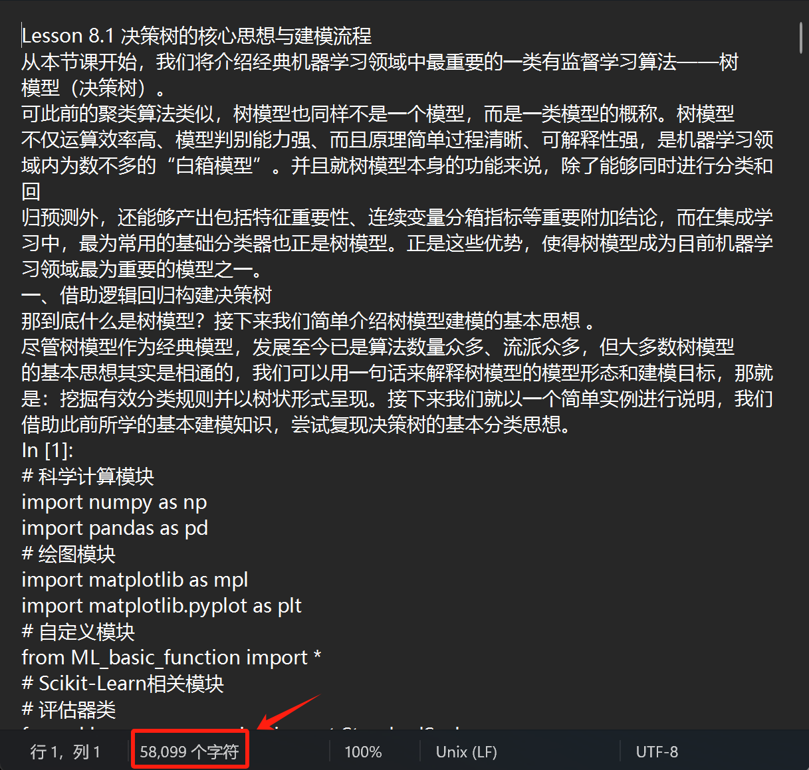


* **Step 2.创建检索项目文件夹**

```bash
mkdir -p ./openl_big/input
```


&#x20;

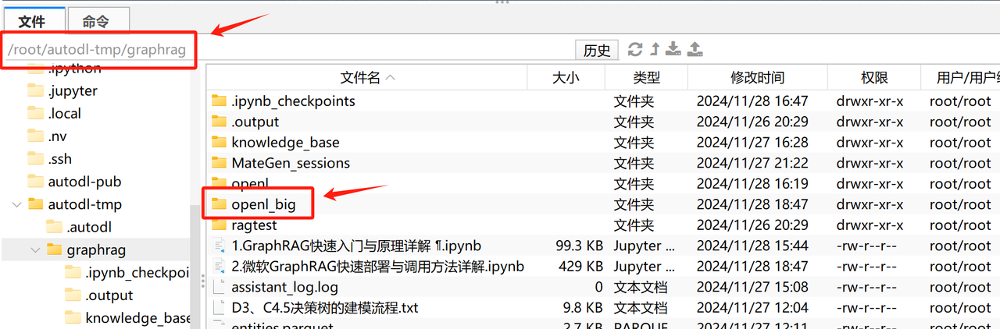

* **Step 3.上传数据集**

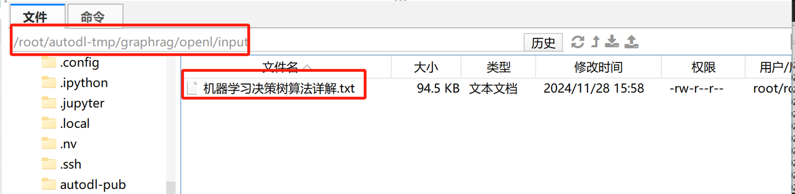

* **Step 4.初始化项目文件**

```bash
graphrag init --root ./openl_big
```

```python
!graphrag init --root ./openl_big
```

```plaintext
Initializing project at /root/autodl-tmp/graphrag/openl_big
⠋ GraphRAG Indexer 
```

* **Step 5.修改项目配置**

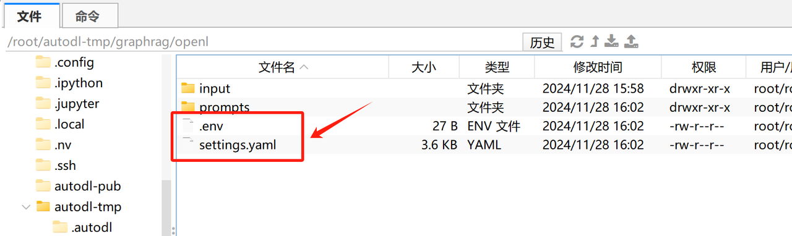

打开.env文件，填写OpenAI API-KEY


打开setting.yaml文件，填写模型名称和反向代理地址：


其中反向代理地址为`api_base: https://ai.devtool.tech/proxy/v1`

* **Step 6.借助GraphRAG脚本自动执行indexing**

```python
!graphrag index --root ./openl_big
```

```plaintext
Logging enabled at /root/autodl-tmp/graphrag/openl_big/logs/indexing-engine.log
⠋ GraphRAG Indexer 
⠙ GraphRAG Indexer e.text) - 1 files loaded (0 filtered) ━ 100% … 0…
├── Loading Input (InputFileType.text) - 1 files loaded (0 filtered) ━ 100% … 0…
⠼ GraphRAG Indexer 
├── Loading Input (InputFileType.text) - 1 files loaded (0 filtered) ━ 100% … 0…
⠼ GraphRAG Indexer 
├── Loading Input (InputFileType.text) - 1 files loaded (0 filtered) ━ 100% … 0…
🚀 create_base_text_units
⠴ GraphRAG Indexer 
├── Loading Input (InputFileType.text) - 1 files loaded (0 filtered) ━ 100% … 0…
Empty DataFrame
Columns: []
Index: []
⠴ GraphRAG Indexer 
├── Loading Input (InputFileType.text) - 1 files loaded (0 filtered) ━ 100% … 0…
⠦ GraphRAG Indexer 
├── Loading Input (InputFileType.text) - 1 files loaded (0 filtered) ━ 100% … 0…
⠦ GraphRAG Indexer 
├── Loading Input (InputFileType.text) - 1 files loaded (0 filtered) ━ 100% … 0…
├── create_base_text_units
🚀 create_final_documents
⠦ GraphRAG Indexer 
├── Loading Input (InputFileType.text) - 1 files loaded (0 filtered) ━ 100% … 0…
├── create_base_text_units
                                 id  ...                                      
text_unit_ids
0  8e6f8214f47f109edf9d495128e17702  ...  [06c8de30f1c6aa69b90bd00a0c0a10f0, 
eb09283810a...

[1 rows x 5 columns]
⠦ GraphRAG Indexer 
├── Loading Input (InputFileType.text) - 1 files loaded (0 filtered) ━ 100% … 0…
├── create_base_text_units
⠧ GraphRAG Indexer 
├── Loading Input (InputFileType.text) - 1 files loaded (0 filtered) ━ 100% … 0…
├── create_base_text_units
⠧ GraphRAG Indexer 
├── Loading Input (InputFileType.text) - 1 files loaded (0 filtered) ━ 100% … 0…
├── create_base_text_units
├── create_final_documents
⠧ GraphRAG Indexer 
├── Loading Input (InputFileType.text) - 1 files loaded (0 filtered) ━ 100% … 0…
├── create_base_text_units
├── create_final_documents
└── create_base_entity_graph
⠏ GraphRAG Indexer ━   0% -:--:-- 0:00:00
├── Loading Input (InputFileType.text) - 1 files loaded (0 filtered) ━ 100% … 0…
├── create_base_text_units
├── create_final_documents
└── create_base_entity_graph
⠹ GraphRAG Indexer ━   0% -:--:-- 0:00:01
├── Loading Input (InputFileType.text) - 1 files loaded (0 filtered) ━ 100% … 0…
├── create_base_text_units
├── create_final_documents
└── create_base_entity_graph
⠴ GraphRAG Indexer ━   0% -:--:-- 0:00:02
├── Loading Input (InputFileType.text) - 1 files loaded (0 filtered) ━ 100% … 0…
├── create_base_text_units
├── create_final_documents
└── create_base_entity_graph
⠧ GraphRAG Indexer ━   0% -:--:-- 0:00:03
├── Loading Input (InputFileType.text) - 1 files loaded (0 filtered) ━ 100% … 0…
├── create_base_text_units
├── create_final_documents
└── create_base_entity_graph
⠋ GraphRAG Indexer ━   0% -:--:-- 0:00:04
├── Loading Input (InputFileType.text) - 1 files loaded (0 filtered) ━ 100% … 0…
├── create_base_text_units
├── create_final_documents
└── create_base_entity_graph
⠹ GraphRAG Indexer ━━━━━━━━━━   3% -:--:-- 0:00:05
├── Loading Input (InputFileType.text) - 1 files loaded (0 filtered) ━ 100% … 0…
├── create_base_text_units
├── create_final_documents
└── create_base_entity_graph
⠋ GraphRAG Indexer ━━━━━━━━━━━━━━━━━━━   9% 0:00:03 0:00:05
├── Loading Input (InputFileType.text) - 1 files loaded (0 filtered) ━ 100% … 0…
├── create_base_text_units
├── create_final_documents
└── create_base_entity_graph
⠹ GraphRAG Indexer ━━━━━━━━━━━━━━━━━━━   9% 0:00:03 0:00:05
├── Loading Input (InputFileType.text) - 1 files loaded (0 filtered) ━ 100% … 0…
├── create_base_text_units
├── create_final_documents
└── create_base_entity_graph
⠴ GraphRAG Indexer m━━━━━━━━━━━━━━━━━━  12% 0:00:09 0:00:05
├── Loading Input (InputFileType.text) - 1 files loaded (0 filtered) ━ 100% … 0…
├── create_base_text_units
├── create_final_documents
└── create_base_entity_graph
⠏ GraphRAG Indexer 0m━━━━━━━━━━━━━━━━━  15% 0:00:09 0:00:06
├── Loading Input (InputFileType.text) - 1 files loaded (0 filtered) ━ 100% … 0…
├── create_base_text_units
├── create_final_documents
└── create_base_entity_graph
⠸ GraphRAG Indexer 0m━━━━━━━━━━━━━━━━━  18% 0:00:09 0:00:06
├── Loading Input (InputFileType.text) - 1 files loaded (0 filtered) ━ 100% … 0…
├── create_base_text_units
├── create_final_documents
└── create_base_entity_graph
⠸ GraphRAG Indexer [90m━━━━━━━━━━━━━━━  24% 0:00:06 0:00:06
├── Loading Input (InputFileType.text) - 1 files loaded (0 filtered) ━ 100% … 0…
├── create_base_text_units
├── create_final_documents
└── create_base_entity_graph
⠧ GraphRAG Indexer [90m━━━━━━━━━━━━━━━  27% 0:00:06 0:00:06
├── Loading Input (InputFileType.text) - 1 files loaded (0 filtered) ━ 100% … 0…
├── create_base_text_units
├── create_final_documents
└── create_base_entity_graph
⠼ GraphRAG Indexer ━━━━━━━━━━━━━━  30% 0:00:06 0:00:07
├── Loading Input (InputFileType.text) - 1 files loaded (0 filtered) ━ 100% … 0…
├── create_base_text_units
├── create_final_documents
└── create_base_entity_graph
⠴ GraphRAG Indexer m━━━━━━━━━━━━━  36% 0:00:06 0:00:07
├── Loading Input (InputFileType.text) - 1 files loaded (0 filtered) ━ 100% … 0…
├── create_base_text_units
├── create_final_documents
└── create_base_entity_graph
⠦ GraphRAG Indexer m━━━━━━━━━━━━━  36% 0:00:06 0:00:07
├── Loading Input (InputFileType.text) - 1 files loaded (0 filtered) ━ 100% … 0…
├── create_base_text_units
├── create_final_documents
└── create_base_entity_graph
⠙ GraphRAG Indexer 0m━━━━━━━━━━━━  39% 0:00:05 0:00:07
├── Loading Input (InputFileType.text) - 1 files loaded (0 filtered) ━ 100% … 0…
├── create_base_text_units
├── create_final_documents
└── create_base_entity_graph
⠸ GraphRAG Indexer 0m━━━━━━━━━━━━  42% 0:00:05 0:00:08
├── Loading Input (InputFileType.text) - 1 files loaded (0 filtered) ━ 100% … 0…
├── create_base_text_units
├── create_final_documents
└── create_base_entity_graph
⠇ GraphRAG Indexer [0m━━━━━━━━━━━  45% 0:00:05 0:00:08
├── Loading Input (InputFileType.text) - 1 files loaded (0 filtered) ━ 100% … 0…
├── create_base_text_units
├── create_final_documents
└── create_base_entity_graph
⠦ GraphRAG Indexer [0m━━━━━━━━━━━  45% 0:00:05 0:00:08
├── Loading Input (InputFileType.text) - 1 files loaded (0 filtered) ━ 100% … 0…
├── create_base_text_units
├── create_final_documents
└── create_base_entity_graph
⠙ GraphRAG Indexer ━━━━━━━━━━  48% 0:00:05 0:00:09
├── Loading Input (InputFileType.text) - 1 files loaded (0 filtered) ━ 100% … 0…
├── create_base_text_units
├── create_final_documents
└── create_base_entity_graph
⠧ GraphRAG Indexer ━━━━━━━━━━  52% 0:00:05 0:00:09
├── Loading Input (InputFileType.text) - 1 files loaded (0 filtered) ━ 100% … 0…
├── create_base_text_units
├── create_final_documents
└── create_base_entity_graph
⠙ GraphRAG Indexer ╺━━━━━━━━━  55% 0:00:05 0:00:10
├── Loading Input (InputFileType.text) - 1 files loaded (0 filtered) ━ 100% … 0…
├── create_base_text_units
├── create_final_documents
└── create_base_entity_graph
⠼ GraphRAG Indexer m╺━━━━━━━━  58% 0:00:05 0:00:10
├── Loading Input (InputFileType.text) - 1 files loaded (0 filtered) ━ 100% … 0…
├── create_base_text_units
├── create_final_documents
└── create_base_entity_graph
⠹ GraphRAG Indexer m╺━━━━━━━━  58% 0:00:05 0:00:10
├── Loading Input (InputFileType.text) - 1 files loaded (0 filtered) ━ 100% … 0…
├── create_base_text_units
├── create_final_documents
└── create_base_entity_graph
⠦ GraphRAG Indexer m╸━━━━━━━━  61% 0:00:05 0:00:11
├── Loading Input (InputFileType.text) - 1 files loaded (0 filtered) ━ 100% … 0…
├── create_base_text_units
├── create_final_documents
└── create_base_entity_graph
⠹ GraphRAG Indexer m╸━━━━━━━━  61% 0:00:05 0:00:11
├── Loading Input (InputFileType.text) - 1 files loaded (0 filtered) ━ 100% … 0…
├── create_base_text_units
├── create_final_documents
└── create_base_entity_graph
⠼ GraphRAG Indexer 0m╺━━━━━━━  64% 0:00:05 0:00:12
├── Loading Input (InputFileType.text) - 1 files loaded (0 filtered) ━ 100% … 0…
├── create_base_text_units
├── create_final_documents
└── create_base_entity_graph
⠏ GraphRAG Indexer 90m╺━━━━━━  67% 0:00:04 0:00:12
├── Loading Input (InputFileType.text) - 1 files loaded (0 filtered) ━ 100% … 0…
├── create_base_text_units
├── create_final_documents
└── create_base_entity_graph
⠸ GraphRAG Indexer 90m╺━━━━━━  67% 0:00:04 0:00:12
├── Loading Input (InputFileType.text) - 1 files loaded (0 filtered) ━ 100% … 0…
├── create_base_text_units
├── create_final_documents
└── create_base_entity_graph
⠴ GraphRAG Indexer 91m╸━━━━━━  70% 0:00:04 0:00:13
├── Loading Input (InputFileType.text) - 1 files loaded (0 filtered) ━ 100% … 0…
├── create_base_text_units
├── create_final_documents
└── create_base_entity_graph
⠹ GraphRAG Indexer [90m╺━━━━━  73% 0:00:04 0:00:13
├── Loading Input (InputFileType.text) - 1 files loaded (0 filtered) ━ 100% … 0…
├── create_base_text_units
├── create_final_documents
└── create_base_entity_graph
⠴ GraphRAG Indexer [90m╺━━━━━  73% 0:00:04 0:00:13
├── Loading Input (InputFileType.text) - 1 files loaded (0 filtered) ━ 100% … 0…
├── create_base_text_units
├── create_final_documents
└── create_base_entity_graph
⠙ GraphRAG Indexer [91m╸━━━━━  76% 0:00:04 0:00:14
├── Loading Input (InputFileType.text) - 1 files loaded (0 filtered) ━ 100% … 0…
├── create_base_text_units
├── create_final_documents
└── create_base_entity_graph
⠼ GraphRAG Indexer ╸━━━━  79% 0:00:03 0:00:14
├── Loading Input (InputFileType.text) - 1 files loaded (0 filtered) ━ 100% … 0…
├── create_base_text_units
├── create_final_documents
└── create_base_entity_graph
⠙ GraphRAG Indexer ╸━━━━  79% 0:00:03 0:00:14
├── Loading Input (InputFileType.text) - 1 files loaded (0 filtered) ━ 100% … 0…
├── create_base_text_units
├── create_final_documents
└── create_base_entity_graph
⠧ GraphRAG Indexer m╺━━━  82% 0:00:03 0:00:15
├── Loading Input (InputFileType.text) - 1 files loaded (0 filtered) ━ 100% … 0…
├── create_base_text_units
├── create_final_documents
└── create_base_entity_graph
⠏ GraphRAG Indexer m╺━━━  82% 0:00:03 0:00:15
├── Loading Input (InputFileType.text) - 1 files loaded (0 filtered) ━ 100% … 0…
├── create_base_text_units
├── create_final_documents
└── create_base_entity_graph
⠙ GraphRAG Indexer m╸━━━  85% 0:00:03 0:00:16
├── Loading Input (InputFileType.text) - 1 files loaded (0 filtered) ━ 100% … 0…
├── create_base_text_units
├── create_final_documents
└── create_base_entity_graph
⠦ GraphRAG Indexer 0m╺━━  88% 0:00:02 0:00:16
├── Loading Input (InputFileType.text) - 1 files loaded (0 filtered) ━ 100% … 0…
├── create_base_text_units
├── create_final_documents
└── create_base_entity_graph
⠋ GraphRAG Indexer [0m╺━  91% 0:00:02 0:00:16
├── Loading Input (InputFileType.text) - 1 files loaded (0 filtered) ━ 100% … 0…
├── create_base_text_units
├── create_final_documents
└── create_base_entity_graph
⠹ GraphRAG Indexer [0m╺━  91% 0:00:02 0:00:16
├── Loading Input (InputFileType.text) - 1 files loaded (0 filtered) ━ 100% … 0…
├── create_base_text_units
├── create_final_documents
└── create_base_entity_graph
⠴ GraphRAG Indexer [0m╺━  91% 0:00:02 0:00:18
├── Loading Input (InputFileType.text) - 1 files loaded (0 filtered) ━ 100% … 0…
├── create_base_text_units
├── create_final_documents
└── create_base_entity_graph
⠇ GraphRAG Indexer [0m╺━  91% 0:00:02 0:00:19
├── Loading Input (InputFileType.text) - 1 files loaded (0 filtered) ━ 100% … 0…
├── create_base_text_units
├── create_final_documents
└── create_base_entity_graph
⠋ GraphRAG Indexer [0m╺━  91% 0:00:02 0:00:20
├── Loading Input (InputFileType.text) - 1 files loaded (0 filtered) ━ 100% … 0…
├── create_base_text_units
├── create_final_documents
└── create_base_entity_graph
⠸ GraphRAG Indexer [0m╺━  91% 0:00:02 0:00:21
├── Loading Input (InputFileType.text) - 1 files loaded (0 filtered) ━ 100% … 0…
├── create_base_text_units
├── create_final_documents
└── create_base_entity_graph
⠦ GraphRAG Indexer [0m╺━  91% 0:00:02 0:00:22
├── Loading Input (InputFileType.text) - 1 files loaded (0 filtered) ━ 100% … 0…
├── create_base_text_units
├── create_final_documents
└── create_base_entity_graph
⠇ GraphRAG Indexer [0m╺━  91% 0:00:02 0:00:23
├── Loading Input (InputFileType.text) - 1 files loaded (0 filtered) ━ 100% … 0…
├── create_base_text_units
├── create_final_documents
└── create_base_entity_graph
⠙ GraphRAG Indexer [0m╺━  91% 0:00:02 0:00:24
├── Loading Input (InputFileType.text) - 1 files loaded (0 filtered) ━ 100% … 0…
├── create_base_text_units
├── create_final_documents
└── create_base_entity_graph
⠼ GraphRAG Indexer [0m╺━  91% 0:00:02 0:00:25
├── Loading Input (InputFileType.text) - 1 files loaded (0 filtered) ━ 100% … 0…
├── create_base_text_units
├── create_final_documents
└── create_base_entity_graph
⠦ GraphRAG Indexer [0m╺━  91% 0:00:02 0:00:26
├── Loading Input (InputFileType.text) - 1 files loaded (0 filtered) ━ 100% … 0…
├── create_base_text_units
├── create_final_documents
└── create_base_entity_graph
⠏ GraphRAG Indexer [0m╺━  91% 0:00:02 0:00:27
├── Loading Input (InputFileType.text) - 1 files loaded (0 filtered) ━ 100% … 0…
├── create_base_text_units
├── create_final_documents
└── create_base_entity_graph
⠹ GraphRAG Indexer [0m╺━  91% 0:00:02 0:00:28
├── Loading Input (InputFileType.text) - 1 files loaded (0 filtered) ━ 100% … 0…
├── create_base_text_units
├── create_final_documents
└── create_base_entity_graph
⠼ GraphRAG Indexer [0m╺━  91% 0:00:02 0:00:29
├── Loading Input (InputFileType.text) - 1 files loaded (0 filtered) ━ 100% … 0…
├── create_base_text_units
├── create_final_documents
└── create_base_entity_graph
⠧ GraphRAG Indexer [0m╺━  91% 0:00:02 0:00:30
├── Loading Input (InputFileType.text) - 1 files loaded (0 filtered) ━ 100% … 0…
├── create_base_text_units
├── create_final_documents
└── create_base_entity_graph
⠋ GraphRAG Indexer [0m╺━  91% 0:00:02 0:00:31
├── Loading Input (InputFileType.text) - 1 files loaded (0 filtered) ━ 100% … 0…
├── create_base_text_units
├── create_final_documents
└── create_base_entity_graph
⠸ GraphRAG Indexer [0m╺━  91% 0:00:02 0:00:32
├── Loading Input (InputFileType.text) - 1 files loaded (0 filtered) ━ 100% … 0…
├── create_base_text_units
├── create_final_documents
└── create_base_entity_graph
⠴ GraphRAG Indexer [0m╺━  91% 0:00:02 0:00:33
├── Loading Input (InputFileType.text) - 1 files loaded (0 filtered) ━ 100% … 0…
├── create_base_text_units
├── create_final_documents
└── create_base_entity_graph
⠇ GraphRAG Indexer [0m╺━  91% 0:00:02 0:00:34
├── Loading Input (InputFileType.text) - 1 files loaded (0 filtered) ━ 100% … 0…
├── create_base_text_units
├── create_final_documents
└── create_base_entity_graph
⠙ GraphRAG Indexer [0m╺━  91% 0:00:02 0:00:35
├── Loading Input (InputFileType.text) - 1 files loaded (0 filtered) ━ 100% … 0…
├── create_base_text_units
├── create_final_documents
└── create_base_entity_graph
⠋ GraphRAG Indexer [0m╺━  91% 0:00:02 0:00:36
├── Loading Input (InputFileType.text) - 1 files loaded (0 filtered) ━ 100% … 0…
├── create_base_text_units
├── create_final_documents
└── create_base_entity_graph
⠸ GraphRAG Indexer [0m╸━  94% 0:00:03 0:00:37
├── Loading Input (InputFileType.text) - 1 files loaded (0 filtered) ━ 100% … 0…
├── create_base_text_units
├── create_final_documents
└── create_base_entity_graph
⠦ GraphRAG Indexer [0m╸━  94% 0:00:03 0:00:37
├── Loading Input (InputFileType.text) - 1 files loaded (0 filtered) ━ 100% … 0…
├── create_base_text_units
├── create_final_documents
└── create_base_entity_graph
⠏ GraphRAG Indexer [0m╸━  94% 0:00:03 0:00:38
├── Loading Input (InputFileType.text) - 1 files loaded (0 filtered) ━ 100% … 0…
├── create_base_text_units
├── create_final_documents
└── create_base_entity_graph
⠙ GraphRAG Indexer [0m╸━  94% 0:00:03 0:00:39
├── Loading Input (InputFileType.text) - 1 files loaded (0 filtered) ━ 100% … 0…
├── create_base_text_units
├── create_final_documents
└── create_base_entity_graph
⠼ GraphRAG Indexer [0m╸━  94% 0:00:03 0:00:40
├── Loading Input (InputFileType.text) - 1 files loaded (0 filtered) ━ 100% … 0…
├── create_base_text_units
├── create_final_documents
└── create_base_entity_graph
⠧ GraphRAG Indexer [0m╸━  94% 0:00:03 0:00:41
├── Loading Input (InputFileType.text) - 1 files loaded (0 filtered) ━ 100% … 0…
├── create_base_text_units
├── create_final_documents
└── create_base_entity_graph
⠏ GraphRAG Indexer [0m╸━  94% 0:00:03 0:00:42
├── Loading Input (InputFileType.text) - 1 files loaded (0 filtered) ━ 100% … 0…
├── create_base_text_units
├── create_final_documents
└── create_base_entity_graph
⠹ GraphRAG Indexer [0m╸━  94% 0:00:03 0:00:43
├── Loading Input (InputFileType.text) - 1 files loaded (0 filtered) ━ 100% … 0…
├── create_base_text_units
├── create_final_documents
└── create_base_entity_graph
⠴ GraphRAG Indexer [0m╸━  94% 0:00:03 0:00:44
├── Loading Input (InputFileType.text) - 1 files loaded (0 filtered) ━ 100% … 0…
├── create_base_text_units
├── create_final_documents
└── create_base_entity_graph
⠧ GraphRAG Indexer [0m╸━  94% 0:00:03 0:00:45
├── Loading Input (InputFileType.text) - 1 files loaded (0 filtered) ━ 100% … 0…
├── create_base_text_units
├── create_final_documents
└── create_base_entity_graph
⠋ GraphRAG Indexer [0m╸━  94% 0:00:03 0:00:46
├── Loading Input (InputFileType.text) - 1 files loaded (0 filtered) ━ 100% … 0…
├── create_base_text_units
├── create_final_documents
└── create_base_entity_graph
⠸ GraphRAG Indexer [0m╸━  94% 0:00:03 0:00:47
├── Loading Input (InputFileType.text) - 1 files loaded (0 filtered) ━ 100% … 0…
├── create_base_text_units
├── create_final_documents
└── create_base_entity_graph
⠦ GraphRAG Indexer [0m╸━  94% 0:00:03 0:00:48
├── Loading Input (InputFileType.text) - 1 files loaded (0 filtered) ━ 100% … 0…
├── create_base_text_units
├── create_final_documents
└── create_base_entity_graph
⠇ GraphRAG Indexer [0m╸━  94% 0:00:03 0:00:49
├── Loading Input (InputFileType.text) - 1 files loaded (0 filtered) ━ 100% … 0…
├── create_base_text_units
├── create_final_documents
└── create_base_entity_graph
⠙ GraphRAG Indexer [0m╸━  94% 0:00:03 0:00:50
├── Loading Input (InputFileType.text) - 1 files loaded (0 filtered) ━ 100% … 0…
├── create_base_text_units
├── create_final_documents
└── create_base_entity_graph
⠼ GraphRAG Indexer [0m╸━  94% 0:00:03 0:00:51
├── Loading Input (InputFileType.text) - 1 files loaded (0 filtered) ━ 100% … 0…
├── create_base_text_units
├── create_final_documents
└── create_base_entity_graph
⠦ GraphRAG Indexer [0m╸━  94% 0:00:03 0:00:52
├── Loading Input (InputFileType.text) - 1 files loaded (0 filtered) ━ 100% … 0…
├── create_base_text_units
├── create_final_documents
└── create_base_entity_graph
⠏ GraphRAG Indexer [0m╸━  94% 0:00:03 0:00:53
├── Loading Input (InputFileType.text) - 1 files loaded (0 filtered) ━ 100% … 0…
├── create_base_text_units
├── create_final_documents
└── create_base_entity_graph
⠹ GraphRAG Indexer [0m╸━  94% 0:00:03 0:00:54
├── Loading Input (InputFileType.text) - 1 files loaded (0 filtered) ━ 100% … 0…
├── create_base_text_units
├── create_final_documents
└── create_base_entity_graph
⠼ GraphRAG Indexer [0m╸━  94% 0:00:03 0:00:55
├── Loading Input (InputFileType.text) - 1 files loaded (0 filtered) ━ 100% … 0…
├── create_base_text_units
├── create_final_documents
└── create_base_entity_graph
⠼ GraphRAG Indexer ╺  97% 0:00:19 0:00:55
├── Loading Input (InputFileType.text) - 1 files loaded (0 filtered) ━ 100% … 0…
├── create_base_text_units
├── create_final_documents
└── create_base_entity_graph
⠧ GraphRAG Indexer ╺  97% 0:00:19 0:00:56
├── Loading Input (InputFileType.text) - 1 files loaded (0 filtered) ━ 100% … 0…
├── create_base_text_units
├── create_final_documents
└── create_base_entity_graph
⠧ GraphRAG Indexer ╺  97% 0:00:19 0:00:57
├── Loading Input (InputFileType.text) - 1 files loaded (0 filtered) ━ 100% … 0…
├── create_base_text_units
├── create_final_documents
⠋ GraphRAG Indexer 
├── Loading Input (InputFileType.text) - 1 files loaded (0 filtered) ━ 100% … 0…
├── create_base_text_units
├── create_final_documents
⠹ GraphRAG Indexer 
├── Loading Input (InputFileType.text) - 1 files loaded (0 filtered) ━ 100% … 0…
├── create_base_text_units
├── create_final_documents
⠼ GraphRAG Indexer 
├── Loading Input (InputFileType.text) - 1 files loaded (0 filtered) ━ 100% … 0…
├── create_base_text_units
├── create_final_documents
⠦ GraphRAG Indexer 
├── Loading Input (InputFileType.text) - 1 files loaded (0 filtered) ━ 100% … 0…
├── create_base_text_units
├── create_final_documents
⠇ GraphRAG Indexer 
├── Loading Input (InputFileType.text) - 1 files loaded (0 filtered) ━ 100% … 0…
├── create_base_text_units
├── create_final_documents
⠏ GraphRAG Indexer 
├── Loading Input (InputFileType.text) - 1 files loaded (0 filtered) ━ 100% … 0…
├── create_base_text_units
├── create_final_documents
⠙ GraphRAG Indexer 
├── Loading Input (InputFileType.text) - 1 files loaded (0 filtered) ━ 100% … 0…
├── create_base_text_units
├── create_final_documents
⠸ GraphRAG Indexer 
├── Loading Input (InputFileType.text) - 1 files loaded (0 filtered) ━ 100% … 0…
├── create_base_text_units
├── create_final_documents
⠼ GraphRAG Indexer 
├── Loading Input (InputFileType.text) - 1 files loaded (0 filtered) ━ 100% … 0…
├── create_base_text_units
├── create_final_documents
⠴ GraphRAG Indexer 
├── Loading Input (InputFileType.text) - 1 files loaded (0 filtered) ━ 100% … 0…
├── create_base_text_units
├── create_final_documents
⠴ GraphRAG Indexer 
├── Loading Input (InputFileType.text) - 1 files loaded (0 filtered) ━ 100% … 0…
├── create_base_text_units
├── create_final_documents
⠧ GraphRAG Indexer 
├── Loading Input (InputFileType.text) - 1 files loaded (0 filtered) ━ 100% … 0…
├── create_base_text_units
├── create_final_documents
⠏ GraphRAG Indexer 
├── Loading Input (InputFileType.text) - 1 files loaded (0 filtered) ━ 100% … 0…
├── create_base_text_units
├── create_final_documents
⠙ GraphRAG Indexer 
├── Loading Input (InputFileType.text) - 1 files loaded (0 filtered) ━ 100% … 0…
├── create_base_text_units
├── create_final_documents
⠸ GraphRAG Indexer 
├── Loading Input (InputFileType.text) - 1 files loaded (0 filtered) ━ 100% … 0…
├── create_base_text_units
├── create_final_documents
⠼ GraphRAG Indexer 
├── Loading Input (InputFileType.text) - 1 files loaded (0 filtered) ━ 100% … 0…
├── create_base_text_units
├── create_final_documents
⠇ GraphRAG Indexer 
├── Loading Input (InputFileType.text) - 1 files loaded (0 filtered) ━ 100% … 0…
├── create_base_text_units
├── create_final_documents
⠋ GraphRAG Indexer 
├── Loading Input (InputFileType.text) - 1 files loaded (0 filtered) ━ 100% … 0…
├── create_base_text_units
├── create_final_documents
⠸ GraphRAG Indexer 
├── Loading Input (InputFileType.text) - 1 files loaded (0 filtered) ━ 100% … 0…
├── create_base_text_units
├── create_final_documents
⠦ GraphRAG Indexer 
├── Loading Input (InputFileType.text) - 1 files loaded (0 filtered) ━ 100% … 0…
├── create_base_text_units
├── create_final_documents
⠏ GraphRAG Indexer 
├── Loading Input (InputFileType.text) - 1 files loaded (0 filtered) ━ 100% … 0…
├── create_base_text_units
├── create_final_documents
⠙ GraphRAG Indexer 
├── Loading Input (InputFileType.text) - 1 files loaded (0 filtered) ━ 100% … 0…
├── create_base_text_units
├── create_final_documents
⠸ GraphRAG Indexer 
├── Loading Input (InputFileType.text) - 1 files loaded (0 filtered) ━ 100% … 0…
├── create_base_text_units
├── create_final_documents
🚀 create_base_entity_graph
⠼ GraphRAG Indexer 
├── Loading Input (InputFileType.text) - 1 files loaded (0 filtered) ━ 100% … 0…
├── create_base_text_units
├── create_final_documents
Empty DataFrame
Columns: []
Index: []
⠼ GraphRAG Indexer 
├── Loading Input (InputFileType.text) - 1 files loaded (0 filtered) ━ 100% … 0…
├── create_base_text_units
├── create_final_documents
⠦ GraphRAG Indexer 
├── Loading Input (InputFileType.text) - 1 files loaded (0 filtered) ━ 100% … 0…
├── create_base_text_units
├── create_final_documents
⠦ GraphRAG Indexer 
├── Loading Input (InputFileType.text) - 1 files loaded (0 filtered) ━ 100% … 0…
├── create_base_text_units
├── create_final_documents
⠦ GraphRAG Indexer 
├── Loading Input (InputFileType.text) - 1 files loaded (0 filtered) ━ 100% … 0…
├── create_base_text_units
├── create_final_documents
├── create_base_entity_graph
🚀 create_final_entities
⠦ GraphRAG Indexer 
├── Loading Input (InputFileType.text) - 1 files loaded (0 filtered) ━ 100% … 0…
├── create_base_text_units
├── create_final_documents
├── create_base_entity_graph
                                  id  ...                                      
text_unit_ids
0   53f687e3c6fb4fa8aca8034a33d8c949  ...                 
[06c8de30f1c6aa69b90bd00a0c0a10f0]
1   6caf8d9e8e5944dfb154b2c6f52550c1  ...                 
[06c8de30f1c6aa69b90bd00a0c0a10f0]
2   43cae4c3618c4299a872dd1c7b02cdad  ...                 
[06c8de30f1c6aa69b90bd00a0c0a10f0]
3   42d46b75c1174bcea5c1e59e8b73a0cd  ...                 
[06c8de30f1c6aa69b90bd00a0c0a10f0]
4   23a9ab39823c42a294dc14a89d5b9d42  ...  [06c8de30f1c6aa69b90bd00a0c0a10f0, 
0b2bd870cfc...
..                               ...  ...                                       
...
64  ade2dd0eae194efa8af61d38f431d117  ...                 
65  5ebfaa009c2345b89596164013b4f496  ...                 
66  a5cb6739856440d9a23aeeae2475e616  ...  [c8f3e48d086da134b504c1f547cfb7f2, 
e475709fdc2...
67  a3e782a3dcfb4dafbaf60cf2e17c3163  ...                 
68  afccc91a08e44386bf10cd6efaf9568e  ...                 

[69 rows x 6 columns]
⠧ GraphRAG Indexer 
├── Loading Input (InputFileType.text) - 1 files loaded (0 filtered) ━ 100% … 0…
├── create_base_text_units
├── create_final_documents
├── create_base_entity_graph
⠇ GraphRAG Indexer 
├── Loading Input (InputFileType.text) - 1 files loaded (0 filtered) ━ 100% … 0…
├── create_base_text_units
├── create_final_documents
├── create_base_entity_graph
⠏ GraphRAG Indexer 
├── Loading Input (InputFileType.text) - 1 files loaded (0 filtered) ━ 100% … 0…
├── create_base_text_units
├── create_final_documents
├── create_base_entity_graph
├── create_final_entities
🚀 create_final_nodes
⠏ GraphRAG Indexer 
├── Loading Input (InputFileType.text) - 1 files loaded (0 filtered) ━ 100% … 0…
├── create_base_text_units
├── create_final_documents
├── create_base_entity_graph
├── create_final_entities
                                   id  human_readable_id  ...  x  y
0    53f687e3c6fb4fa8aca8034a33d8c949                  0  ...  0  0
1    6caf8d9e8e5944dfb154b2c6f52550c1                  1  ...  0  0
2    43cae4c3618c4299a872dd1c7b02cdad                  2  ...  0  0
3    42d46b75c1174bcea5c1e59e8b73a0cd                  3  ...  0  0
4    23a9ab39823c42a294dc14a89d5b9d42                  4  ...  0  0
..                                ...                ...  ... .. ..
172  475aad32dd0147f4a5013fd452b3be6c                 55  ...  0  0
180  6e208519f7ef4d8797f5bcb253642e6b                 60  ...  0  0
181  82b60d49013541a88fc35ec89846d68b                 61  ...  0  0
190  a3e782a3dcfb4dafbaf60cf2e17c3163                 67  ...  0  0
191  afccc91a08e44386bf10cd6efaf9568e                 68  ...  0  0

[93 rows x 8 columns]
⠋ GraphRAG Indexer 
├── Loading Input (InputFileType.text) - 1 files loaded (0 filtered) ━ 100% … 0…
├── create_base_text_units
├── create_final_documents
├── create_base_entity_graph
├── create_final_entities
⠙ GraphRAG Indexer 
├── Loading Input (InputFileType.text) - 1 files loaded (0 filtered) ━ 100% … 0…
├── create_base_text_units
├── create_final_documents
├── create_base_entity_graph
├── create_final_entities
⠹ GraphRAG Indexer 
├── Loading Input (InputFileType.text) - 1 files loaded (0 filtered) ━ 100% … 0…
├── create_base_text_units
├── create_final_documents
├── create_base_entity_graph
├── create_final_entities
├── create_final_nodes
🚀 create_final_communities
⠹ GraphRAG Indexer 
├── Loading Input (InputFileType.text) - 1 files loaded (0 filtered) ━ 100% … 0…
├── create_base_text_units
├── create_final_documents
├── create_base_entity_graph
├── create_final_entities
├── create_final_nodes
                                      id  human_readable_id  ...      period  
size
0   8f9737a8-0f20-4abb-bc82-8953af8d29b4                  2  ...  2024-11-28    
11
1   11451f95-33d3-40ea-a450-f029e0c2c494                  5  ...  2024-11-28    
7
2   4f262025-431d-4e7e-8cd7-04649f891156                  1  ...  2024-11-28    
13
3   f81b5cb0-84c4-4a61-a2e4-cafa6731250f                  3  ...  2024-11-28    
9
4   7690f9f8-45d5-4c65-8c85-e66727fb389d                  0  ...  2024-11-28    
9
5   e8e32689-ede1-4235-b529-ce7b40e44137                  4  ...  2024-11-28    
2
6   275f956d-2746-468b-8edb-877f8866fba7                  9  ...  2024-11-28    
2
7   c9fc9d7b-272f-4320-90af-53db4f358a7d                  8  ...  2024-11-28    
7
8   8dd63107-31a7-4e23-a6af-3a1fc6270688                  7  ...  2024-11-28    
3
9   59817579-b653-46a8-bc49-5623f22f6080                  6  ...  2024-11-28    
10
10  8b3c3c42-ccc0-43ee-88c7-6b4256adc349                 10  ...  2024-11-28    
2

[11 rows x 10 columns]
⠹ GraphRAG Indexer 
├── Loading Input (InputFileType.text) - 1 files loaded (0 filtered) ━ 100% … 0…
├── create_base_text_units
├── create_final_documents
├── create_base_entity_graph
├── create_final_entities
├── create_final_nodes
⠼ GraphRAG Indexer 
├── Loading Input (InputFileType.text) - 1 files loaded (0 filtered) ━ 100% … 0…
├── create_base_text_units
├── create_final_documents
├── create_base_entity_graph
├── create_final_entities
├── create_final_nodes
⠼ GraphRAG Indexer 
├── Loading Input (InputFileType.text) - 1 files loaded (0 filtered) ━ 100% … 0…
├── create_base_text_units
├── create_final_documents
├── create_base_entity_graph
├── create_final_entities
├── create_final_nodes
├── create_final_communities
🚀 create_final_relationships
⠴ GraphRAG Indexer 
├── Loading Input (InputFileType.text) - 1 files loaded (0 filtered) ━ 100% … 0…
├── create_base_text_units
├── create_final_documents
├── create_base_entity_graph
├── create_final_entities
├── create_final_nodes
├── create_final_communities
                                  id  ...                       text_unit_ids
0   bc638838eac64e33af7369d5a04f2ba6  ...  [06c8de30f1c6aa69b90bd00a0c0a10f0]
1   f3c6ac3e7e9c42488e4ee01818b5a364  ...  [06c8de30f1c6aa69b90bd00a0c0a10f0]
2   96fe73398c5c4bc19ace2a43fbc3902f  ...  [06c8de30f1c6aa69b90bd00a0c0a10f0]
3   96d660f0432548cfa92515f24c4e5921  ...  [06c8de30f1c6aa69b90bd00a0c0a10f0]
4   a858fd4760c64285a912158053904279  ...  [0b2bd870cfc6f1f783c16da523520769]
..                               ...  ...                                 ...
82  4929a6e03b9f4117acc2b45463f3af1a  ...  [94c65cf6e1f53cd71e75c2422004be83]
83  880bf09b74704f628d9c950fafe7ec55  ...  
84  62b2ea29f940471c90a3b0a74832638b  ...  
85  3e76f55f3e0641ba9ff16de3392505c4  ...  
86  15439d80a02d49fe933865d30c5cd467  ...  

[87 rows x 8 columns]
⠴ GraphRAG Indexer 
├── Loading Input (InputFileType.text) - 1 files loaded (0 filtered) ━ 100% … 0…
├── create_base_text_units
├── create_final_documents
├── create_base_entity_graph
├── create_final_entities
├── create_final_nodes
├── create_final_communities
⠧ GraphRAG Indexer 
├── Loading Input (InputFileType.text) - 1 files loaded (0 filtered) ━ 100% … 0…
├── create_base_text_units
├── create_final_documents
├── create_base_entity_graph
├── create_final_entities
├── create_final_nodes
├── create_final_communities
⠧ GraphRAG Indexer 
├── Loading Input (InputFileType.text) - 1 files loaded (0 filtered) ━ 100% … 0…
├── create_base_text_units
├── create_final_documents
├── create_base_entity_graph
├── create_final_entities
├── create_final_nodes
├── create_final_communities
├── create_final_relationships
🚀 create_final_text_units
⠧ GraphRAG Indexer 
├── Loading Input (InputFileType.text) - 1 files loaded (0 filtered) ━ 100% … 0…
├── create_base_text_units
├── create_final_documents
├── create_base_entity_graph
├── create_final_entities
├── create_final_nodes
├── create_final_communities
├── create_final_relationships
                                  id  ...                                   
relationship_ids
0   06c8de30f1c6aa69b90bd00a0c0a10f0  ...  [bc638838eac64e33af7369d5a04f2ba6, 
f3c6ac3e7e9...
1   eb09283810aaf771f46001baffa58b18  ...                                       
None
2   83ef1725e2b08b93e65efd7048514e12  ...                                       
None
3   3de0de1563d4e3f909ea96f6ec5ddb0f  ...                                       
None
4   85472ab1fb68619a806dc3f251491320  ...                                       
None
5   4d236618b0271bda1fada462f0193fac  ...                                       
None
6   a20df3df79c82146e51f086d8e322cb6  ...  [b0aa2438e4ac48a7925404790293056d, 
70a9a89ec2e...
7   2e51979c409deaa313573f64eb6dd527  ...  [f35299162aeb4e2ca3cec7f2016562df, 
7dbc8fe820b...
8   50aeeb1b70fcc1ff0eee53d07bcd4667  ...  [292f2724a8eb4f2ebcbbdf28df168027, 
be22c979ea9...
9   996f31a8e027c48207ad08490f424e32  ...  [547b543a1d7b490fab8a4d173b7381b0, 
7dbc8fe820b...
10  3f049842e623a6c0ee144e9a226b0df1  ...                                       
None
11  7aed76e5ec9bfb74514dceea559f2a3c  ...                                       
None
12  0f4ffc58d9e7d2d916c9c3a5f56108ce  ...  [547b543a1d7b490fab8a4d173b7381b0, 
bf424711073...
13  ac799de7a8a7dc83fcdda620bf7098ff  ...                                       
None
14  f36895a18172ad61c54cc8d31a69eaf2  ...                                       
None
15  542771a511d1f92617f01b9404149a4a  ...                                       
None
16  3cac3e1fe9913ea445624018d65a2591  ...  [a10b0a1549f848b58862ff311754f2ad, 
47c52170ea8...
17  b7fdd63e7d17aea3025a617869de708e  ...                                       
None
18  f5e61ef344124885ec08cdcebc3ae7b2  ...  [a10b0a1549f848b58862ff311754f2ad, 
47c52170ea8...
19  561368bcd1ec8ccbca0488c7f4e78a8a  ...  [e746aadc5cfe48cdba0268b81cf80ba6, 
e437a76da8f...
20  700f00a2299026a9552353ac952e4d78  ...                                       
None
21  4800cb8b69bcfc697ffa6f453e83b384  ...  [7dbc8fe820b74b87ba16213750ed17c7, 
4613f262abd...
22  94c65cf6e1f53cd71e75c2422004be83  ...  [1ed3cd62731249909c403c9a85b54967, 
05c5e36ac3e...
23  4142225df511b047dc147e3c8b4b417b  ...  [7dbc8fe820b74b87ba16213750ed17c7, 
786e3d41584...
24  21f6d1bc0d62a3950efcf3f89e748cee  ...                                       
None
25  0b2bd870cfc6f1f783c16da523520769  ...  [a858fd4760c64285a912158053904279, 
36b80f01850...
26  89fe8b354d928ee29a4ed6f421023c91  ...                                       
None
27  3da5db6a03777f2efbfb34b5e03d2f0e  ...                                       
None
28  a9d16a2fecfb2dcfc5ac8d0cb1dbc713  ...  [a10b0a1549f848b58862ff311754f2ad, 
bf424711073...
29  72f5187bd7a77990c165331174590b13  ...                                       
None
30  f3338d068740c7f5c6db66400738c7d1  ...                                       
None
31  e475709fdc24b53d8bb49e90c75488c8  ...  [d706c679478249ebb3020b6038eacf9b, 
db0da1587a8...
32  c8f3e48d086da134b504c1f547cfb7f2  ...  [db0da1587a824f03baac93418f220bf5, 
1aeae8514cb...

[33 rows x 7 columns]
⠇ GraphRAG Indexer 
├── Loading Input (InputFileType.text) - 1 files loaded (0 filtered) ━ 100% … 0…
├── create_base_text_units
├── create_final_documents
├── create_base_entity_graph
├── create_final_entities
├── create_final_nodes
├── create_final_communities
├── create_final_relationships
⠋ GraphRAG Indexer 
├── Loading Input (InputFileType.text) - 1 files loaded (0 filtered) ━ 100% … 0…
├── create_base_text_units
├── create_final_documents
├── create_base_entity_graph
├── create_final_entities
├── create_final_nodes
├── create_final_communities
├── create_final_relationships
⠋ GraphRAG Indexer 
├── Loading Input (InputFileType.text) - 1 files loaded (0 filtered) ━ 100% … 0…
├── create_base_text_units
├── create_final_documents
├── create_base_entity_graph
├── create_final_entities
├── create_final_nodes
├── create_final_communities
├── create_final_relationships
⠋ GraphRAG Indexer 
├── Loading Input (InputFileType.text) - 1 files loaded (0 filtered) ━ 100% … 0…
├── create_base_text_units
├── create_final_documents
├── create_base_entity_graph
├── create_final_entities
├── create_final_nodes
├── create_final_communities
├── create_final_relationships
├── create_final_text_units
⠹ GraphRAG Indexer 
├── Loading Input (InputFileType.text) - 1 files loaded (0 filtered) ━ 100% … 0…
├── create_base_text_units
├── create_final_documents
├── create_base_entity_graph
├── create_final_entities
├── create_final_nodes
├── create_final_communities
├── create_final_relationships
├── create_final_text_units
⠴ GraphRAG Indexer 
├── Loading Input (InputFileType.text) - 1 files loaded (0 filtered) ━ 100% … 0…
├── create_base_text_units
├── create_final_documents
├── create_base_entity_graph
├── create_final_entities
├── create_final_nodes
├── create_final_communities
├── create_final_relationships
├── create_final_text_units
⠇ GraphRAG Indexer 
├── Loading Input (InputFileType.text) - 1 files loaded (0 filtered) ━ 100% … 0…
├── create_base_text_units
├── create_final_documents
├── create_base_entity_graph
├── create_final_entities
├── create_final_nodes
├── create_final_communities
├── create_final_relationships
├── create_final_text_units
⠙ GraphRAG Indexer 
├── Loading Input (InputFileType.text) - 1 files loaded (0 filtered) ━ 100% … 0…
├── create_base_text_units
├── create_final_documents
├── create_base_entity_graph
├── create_final_entities
├── create_final_nodes
├── create_final_communities
├── create_final_relationships
├── create_final_text_units
⠼ GraphRAG Indexer 
├── Loading Input (InputFileType.text) - 1 files loaded (0 filtered) ━ 100% … 0…
├── create_base_text_units
├── create_final_documents
├── create_base_entity_graph
├── create_final_entities
├── create_final_nodes
├── create_final_communities
├── create_final_relationships
├── create_final_text_units
⠦ GraphRAG Indexer 
├── Loading Input (InputFileType.text) - 1 files loaded (0 filtered) ━ 100% … 0…
├── create_base_text_units
├── create_final_documents
├── create_base_entity_graph
├── create_final_entities
├── create_final_nodes
├── create_final_communities
├── create_final_relationships
├── create_final_text_units
⠏ GraphRAG Indexer 
├── Loading Input (InputFileType.text) - 1 files loaded (0 filtered) ━ 100% … 0…
├── create_base_text_units
├── create_final_documents
├── create_base_entity_graph
├── create_final_entities
├── create_final_nodes
├── create_final_communities
├── create_final_relationships
├── create_final_text_units
⠹ GraphRAG Indexer 
├── Loading Input (InputFileType.text) - 1 files loaded (0 filtered) ━ 100% … 0…
├── create_base_text_units
├── create_final_documents
├── create_base_entity_graph
├── create_final_entities
├── create_final_nodes
├── create_final_communities
├── create_final_relationships
├── create_final_text_units
⠴ GraphRAG Indexer 
├── Loading Input (InputFileType.text) - 1 files loaded (0 filtered) ━ 100% … 0…
├── create_base_text_units
├── create_final_documents
├── create_base_entity_graph
├── create_final_entities
├── create_final_nodes
├── create_final_communities
├── create_final_relationships
├── create_final_text_units
⠇ GraphRAG Indexer 
├── Loading Input (InputFileType.text) - 1 files loaded (0 filtered) ━ 100% … 0…
├── create_base_text_units
├── create_final_documents
├── create_base_entity_graph
├── create_final_entities
├── create_final_nodes
├── create_final_communities
├── create_final_relationships
├── create_final_text_units
⠇ GraphRAG Indexer 
├── Loading Input (InputFileType.text) - 1 files loaded (0 filtered) ━ 100% … 0…
├── create_base_text_units
├── create_final_documents
├── create_base_entity_graph
├── create_final_entities
├── create_final_nodes
├── create_final_communities
├── create_final_relationships
├── create_final_text_units
⠋ GraphRAG Indexer 
├── Loading Input (InputFileType.text) - 1 files loaded (0 filtered) ━ 100% … 0…
├── create_base_text_units
├── create_final_documents
├── create_base_entity_graph
├── create_final_entities
├── create_final_nodes
├── create_final_communities
├── create_final_relationships
├── create_final_text_units
⠇ GraphRAG Indexer 
├── Loading Input (InputFileType.text) - 1 files loaded (0 filtered) ━ 100% … 0…
├── create_base_text_units
├── create_final_documents
├── create_base_entity_graph
├── create_final_entities
├── create_final_nodes
├── create_final_communities
├── create_final_relationships
├── create_final_text_units
⠸ GraphRAG Indexer 
├── Loading Input (InputFileType.text) - 1 files loaded (0 filtered) ━ 100% … 0…
├── create_base_text_units
├── create_final_documents
├── create_base_entity_graph
├── create_final_entities
├── create_final_nodes
├── create_final_communities
├── create_final_relationships
├── create_final_text_units
⠼ GraphRAG Indexer 
├── Loading Input (InputFileType.text) - 1 files loaded (0 filtered) ━ 100% … 0…
├── create_base_text_units
├── create_final_documents
├── create_base_entity_graph
├── create_final_entities
├── create_final_nodes
├── create_final_communities
├── create_final_relationships
├── create_final_text_units
⠦ GraphRAG Indexer 
├── Loading Input (InputFileType.text) - 1 files loaded (0 filtered) ━ 100% … 0…
├── create_base_text_units
├── create_final_documents
├── create_base_entity_graph
├── create_final_entities
├── create_final_nodes
├── create_final_communities
├── create_final_relationships
├── create_final_text_units
⠹ GraphRAG Indexer 
├── Loading Input (InputFileType.text) - 1 files loaded (0 filtered) ━ 100% … 0…
├── create_base_text_units
├── create_final_documents
├── create_base_entity_graph
├── create_final_entities
├── create_final_nodes
├── create_final_communities
├── create_final_relationships
├── create_final_text_units
⠏ GraphRAG Indexer 
├── Loading Input (InputFileType.text) - 1 files loaded (0 filtered) ━ 100% … 0…
├── create_base_text_units
├── create_final_documents
├── create_base_entity_graph
├── create_final_entities
├── create_final_nodes
├── create_final_communities
├── create_final_relationships
├── create_final_text_units
⠙ GraphRAG Indexer 
├── Loading Input (InputFileType.text) - 1 files loaded (0 filtered) ━ 100% … 0…
├── create_base_text_units
├── create_final_documents
├── create_base_entity_graph
├── create_final_entities
├── create_final_nodes
├── create_final_communities
├── create_final_relationships
├── create_final_text_units
⠇ GraphRAG Indexer 
├── Loading Input (InputFileType.text) - 1 files loaded (0 filtered) ━ 100% … 0…
├── create_base_text_units
├── create_final_documents
├── create_base_entity_graph
├── create_final_entities
├── create_final_nodes
├── create_final_communities
├── create_final_relationships
├── create_final_text_units
⠼ GraphRAG Indexer 
├── Loading Input (InputFileType.text) - 1 files loaded (0 filtered) ━ 100% … 0…
├── create_base_text_units
├── create_final_documents
├── create_base_entity_graph
├── create_final_entities
├── create_final_nodes
├── create_final_communities
├── create_final_relationships
├── create_final_text_units
⠧ GraphRAG Indexer 
├── Loading Input (InputFileType.text) - 1 files loaded (0 filtered) ━ 100% … 0…
├── create_base_text_units
├── create_final_documents
├── create_base_entity_graph
├── create_final_entities
├── create_final_nodes
├── create_final_communities
├── create_final_relationships
├── create_final_text_units
⠋ GraphRAG Indexer 
├── Loading Input (InputFileType.text) - 1 files loaded (0 filtered) ━ 100% … 0…
├── create_base_text_units
├── create_final_documents
├── create_base_entity_graph
├── create_final_entities
├── create_final_nodes
├── create_final_communities
├── create_final_relationships
├── create_final_text_units
⠸ GraphRAG Indexer 
├── Loading Input (InputFileType.text) - 1 files loaded (0 filtered) ━ 100% … 0…
├── create_base_text_units
├── create_final_documents
├── create_base_entity_graph
├── create_final_entities
├── create_final_nodes
├── create_final_communities
├── create_final_relationships
├── create_final_text_units
⠴ GraphRAG Indexer 
├── Loading Input (InputFileType.text) - 1 files loaded (0 filtered) ━ 100% … 0…
├── create_base_text_units
├── create_final_documents
├── create_base_entity_graph
├── create_final_entities
├── create_final_nodes
├── create_final_communities
├── create_final_relationships
├── create_final_text_units
⠇ GraphRAG Indexer 
├── Loading Input (InputFileType.text) - 1 files loaded (0 filtered) ━ 100% … 0…
├── create_base_text_units
├── create_final_documents
├── create_base_entity_graph
├── create_final_entities
├── create_final_nodes
├── create_final_communities
├── create_final_relationships
├── create_final_text_units
⠙ GraphRAG Indexer 
├── Loading Input (InputFileType.text) - 1 files loaded (0 filtered) ━ 100% … 0…
├── create_base_text_units
├── create_final_documents
├── create_base_entity_graph
├── create_final_entities
├── create_final_nodes
├── create_final_communities
├── create_final_relationships
├── create_final_text_units
⠙ GraphRAG Indexer 
├── Loading Input (InputFileType.text) - 1 files loaded (0 filtered) ━ 100% … 0…
├── create_base_text_units
├── create_final_documents
├── create_base_entity_graph
├── create_final_entities
├── create_final_nodes
├── create_final_communities
├── create_final_relationships
├── create_final_text_units
⠼ GraphRAG Indexer 
├── Loading Input (InputFileType.text) - 1 files loaded (0 filtered) ━ 100% … 0…
├── create_base_text_units
├── create_final_documents
├── create_base_entity_graph
├── create_final_entities
├── create_final_nodes
├── create_final_communities
├── create_final_relationships
├── create_final_text_units
⠦ GraphRAG Indexer 
├── Loading Input (InputFileType.text) - 1 files loaded (0 filtered) ━ 100% … 0…
├── create_base_text_units
├── create_final_documents
├── create_base_entity_graph
├── create_final_entities
├── create_final_nodes
├── create_final_communities
├── create_final_relationships
├── create_final_text_units
⠏ GraphRAG Indexer 
├── Loading Input (InputFileType.text) - 1 files loaded (0 filtered) ━ 100% … 0…
├── create_base_text_units
├── create_final_documents
├── create_base_entity_graph
├── create_final_entities
├── create_final_nodes
├── create_final_communities
├── create_final_relationships
├── create_final_text_units
⠙ GraphRAG Indexer 
├── Loading Input (InputFileType.text) - 1 files loaded (0 filtered) ━ 100% … 0…
├── create_base_text_units
├── create_final_documents
├── create_base_entity_graph
├── create_final_entities
├── create_final_nodes
├── create_final_communities
├── create_final_relationships
├── create_final_text_units
⠹ GraphRAG Indexer 
├── Loading Input (InputFileType.text) - 1 files loaded (0 filtered) ━ 100% … 0…
├── create_base_text_units
├── create_final_documents
├── create_base_entity_graph
├── create_final_entities
├── create_final_nodes
├── create_final_communities
├── create_final_relationships
├── create_final_text_units
⠙ GraphRAG Indexer 
├── Loading Input (InputFileType.text) - 1 files loaded (0 filtered) ━ 100% … 0…
├── create_base_text_units
├── create_final_documents
├── create_base_entity_graph
├── create_final_entities
├── create_final_nodes
├── create_final_communities
├── create_final_relationships
├── create_final_text_units
⠴ GraphRAG Indexer 
├── Loading Input (InputFileType.text) - 1 files loaded (0 filtered) ━ 100% … 0…
├── create_base_text_units
├── create_final_documents
├── create_base_entity_graph
├── create_final_entities
├── create_final_nodes
├── create_final_communities
├── create_final_relationships
├── create_final_text_units
⠴ GraphRAG Indexer 
├── Loading Input (InputFileType.text) - 1 files loaded (0 filtered) ━ 100% … 0…
├── create_base_text_units
├── create_final_documents
├── create_base_entity_graph
├── create_final_entities
├── create_final_nodes
├── create_final_communities
├── create_final_relationships
├── create_final_text_units
⠹ GraphRAG Indexer 
├── Loading Input (InputFileType.text) - 1 files loaded (0 filtered) ━ 100% … 0…
├── create_base_text_units
├── create_final_documents
├── create_base_entity_graph
├── create_final_entities
├── create_final_nodes
├── create_final_communities
├── create_final_relationships
├── create_final_text_units
⠇ GraphRAG Indexer 
├── Loading Input (InputFileType.text) - 1 files loaded (0 filtered) ━ 100% … 0…
├── create_base_text_units
├── create_final_documents
├── create_base_entity_graph
├── create_final_entities
├── create_final_nodes
├── create_final_communities
├── create_final_relationships
├── create_final_text_units
⠋ GraphRAG Indexer 
├── Loading Input (InputFileType.text) - 1 files loaded (0 filtered) ━ 100% … 0…
├── create_base_text_units
├── create_final_documents
├── create_base_entity_graph
├── create_final_entities
├── create_final_nodes
├── create_final_communities
├── create_final_relationships
├── create_final_text_units
⠸ GraphRAG Indexer 
├── Loading Input (InputFileType.text) - 1 files loaded (0 filtered) ━ 100% … 0…
├── create_base_text_units
├── create_final_documents
├── create_base_entity_graph
├── create_final_entities
├── create_final_nodes
├── create_final_communities
├── create_final_relationships
├── create_final_text_units
⠧ GraphRAG Indexer 
├── Loading Input (InputFileType.text) - 1 files loaded (0 filtered) ━ 100% … 0…
├── create_base_text_units
├── create_final_documents
├── create_base_entity_graph
├── create_final_entities
├── create_final_nodes
├── create_final_communities
├── create_final_relationships
├── create_final_text_units
🚀 create_final_community_reports
⠧ GraphRAG Indexer 
├── Loading Input (InputFileType.text) - 1 files loaded (0 filtered) ━ 100% … 0…
├── create_base_text_units
├── create_final_documents
├── create_base_entity_graph
├── create_final_entities
├── create_final_nodes
├── create_final_communities
├── create_final_relationships
├── create_final_text_units
                                      id  human_readable_id  ...      period  
size
0   487570ff-22db-4675-9a85-bc07bed5de9f                  6  ...  2024-11-28  
10.0
1   21d30332-290a-434d-83c8-973d1be25db2                  7  ...  2024-11-28   
3.0
2   b2eac490-812d-403e-bbb6-8e71e6c9a802                  8  ...  2024-11-28   
7.0
3   d0cffc95-0003-4482-bc5b-f31a2a695668                  9  ...  2024-11-28   
2.0
4   20743dbd-d3f7-416f-8342-6205aca58b3c                 10  ...  2024-11-28   
2.0
5   25d0a149-1e17-48e7-8ea1-94fc27ee250a                 -1  ...         NaN   
NaN
6   2672f205-e527-417d-bbb0-9b8e1d677a1e                  0  ...  2024-11-28   
9.0
7   99260f64-40c3-410f-a7a1-13ec8abf759d                  1  ...  2024-11-28  
13.0
8   ca817d6e-121a-45d1-9e1c-a7a770d984ab                  2  ...  2024-11-28  
11.0
9   e0038a42-fa2c-4199-bc3d-849b9234965f                  3  ...  2024-11-28   
9.0
10  daa253c4-2700-4d1f-8c8b-cc800b6912dd                  4  ...  2024-11-28   
2.0
11  1e82d0c1-0af7-43f9-a684-4d440701b763                  5  ...  2024-11-28   
7.0

[12 rows x 13 columns]
⠇ GraphRAG Indexer 
├── Loading Input (InputFileType.text) - 1 files loaded (0 filtered) ━ 100% … 0…
├── create_base_text_units
├── create_final_documents
├── create_base_entity_graph
├── create_final_entities
├── create_final_nodes
├── create_final_communities
├── create_final_relationships
├── create_final_text_units
⠋ GraphRAG Indexer 
├── Loading Input (InputFileType.text) - 1 files loaded (0 filtered) ━ 100% … 0…
├── create_base_text_units
├── create_final_documents
├── create_base_entity_graph
├── create_final_entities
├── create_final_nodes
├── create_final_communities
├── create_final_relationships
├── create_final_text_units
⠋ GraphRAG Indexer 
├── Loading Input (InputFileType.text) - 1 files loaded (0 filtered) ━ 100% … 0…
├── create_base_text_units
├── create_final_documents
├── create_base_entity_graph
├── create_final_entities
├── create_final_nodes
├── create_final_communities
├── create_final_relationships
├── create_final_text_units
├── create_final_community_reports
⠦ GraphRAG Indexer 
├── Loading Input (InputFileType.text) - 1 files loaded (0 filtered) ━ 100% … 0…
├── create_base_text_units
├── create_final_documents
├── create_base_entity_graph
├── create_final_entities
├── create_final_nodes
├── create_final_communities
├── create_final_relationships
├── create_final_text_units
├── create_final_community_reports
└── generate_text_embeddings
⠧ GraphRAG Indexer 
├── Loading Input (InputFileType.text) - 1 files loaded (0 filtered) ━ 100% … 0…
├── create_base_text_units
├── create_final_documents
├── create_base_entity_graph
├── create_final_entities
├── create_final_nodes
├── create_final_communities
├── create_final_relationships
├── create_final_text_units
├── create_final_community_reports
└── generate_text_embeddings
⠏ GraphRAG Indexer [33m0:00:01
├── Loading Input (InputFileType.text) - 1 files loaded (0 filtered) ━ 100% … 0…
├── create_base_text_units
├── create_final_documents
├── create_base_entity_graph
├── create_final_entities
├── create_final_nodes
├── create_final_communities
├── create_final_relationships
├── create_final_text_units
├── create_final_community_reports
└── generate_text_embeddings
⠸ GraphRAG Indexer [33m0:00:01
├── Loading Input (InputFileType.text) - 1 files loaded (0 filtered) ━ 100% … 0…
├── create_base_text_units
├── create_final_documents
├── create_base_entity_graph
├── create_final_entities
├── create_final_nodes
├── create_final_communities
├── create_final_relationships
├── create_final_text_units
├── create_final_community_reports
└── generate_text_embeddings
⠼ GraphRAG Indexer [33m0:00:01
├── Loading Input (InputFileType.text) - 1 files loaded (0 filtered) ━ 100% … 0…
├── create_base_text_units
├── create_final_documents
├── create_base_entity_graph
├── create_final_entities
├── create_final_nodes
├── create_final_communities
├── create_final_relationships
├── create_final_text_units
├── create_final_community_reports
└── generate_text_embeddings
    └── Verb generate_text_embeddings ━━━━━━━━━━━━━━━━╸━━━━  80% 0:00:01 0:00:01[2024-11-28T10:53:09Z WARN  lance::dataset] No existing dataset at /root/autodl-tmp/graphrag/openl_big/output/lancedb/default-entity-description.lance, it will be created
⠹ GraphRAG Indexer 
├── Loading Input (InputFileType.text) - 1 files loaded (0 filtered) ━ 100% … 0…
├── create_base_text_units
├── create_final_documents
├── create_base_entity_graph
├── create_final_entities
├── create_final_nodes
├── create_final_communities
├── create_final_relationships
├── create_final_text_units
├── create_final_community_reports
⠼ GraphRAG Indexer 
├── Loading Input (InputFileType.text) - 1 files loaded (0 filtered) ━ 100% … 0…
├── create_base_text_units
├── create_final_documents
├── create_base_entity_graph
├── create_final_entities
├── create_final_nodes
├── create_final_communities
├── create_final_relationships
├── create_final_text_units
├── create_final_community_reports
⠦ GraphRAG Indexer 
├── Loading Input (InputFileType.text) - 1 files loaded (0 filtered) ━ 100% … 0…
├── create_base_text_units
├── create_final_documents
├── create_base_entity_graph
├── create_final_entities
├── create_final_nodes
├── create_final_communities
├── create_final_relationships
├── create_final_text_units
├── create_final_community_reports
└── generate_text_embeddings[2024-11-28T10:53:11Z WARN  lance::dataset] No existing dataset at /root/autodl-tmp/graphrag/openl_big/output/lancedb/default-community-full_content.lance, it will be created
⠧ GraphRAG Indexer 
├── Loading Input (InputFileType.text) - 1 files loaded (0 filtered) ━ 100% … 0…
├── create_base_text_units
├── create_final_documents
├── create_base_entity_graph
├── create_final_entities
├── create_final_nodes
├── create_final_communities
├── create_final_relationships
├── create_final_text_units
├── create_final_community_reports
⠏ GraphRAG Indexer 
├── Loading Input (InputFileType.text) - 1 files loaded (0 filtered) ━ 100% … 0…
├── create_base_text_units
├── create_final_documents
├── create_base_entity_graph
├── create_final_entities
├── create_final_nodes
├── create_final_communities
├── create_final_relationships
├── create_final_text_units
├── create_final_community_reports
⠙ GraphRAG Indexer 
├── Loading Input (InputFileType.text) - 1 files loaded (0 filtered) ━ 100% … 0…
├── create_base_text_units
├── create_final_documents
├── create_base_entity_graph
├── create_final_entities
├── create_final_nodes
├── create_final_communities
├── create_final_relationships
├── create_final_text_units
├── create_final_community_reports
⠦ GraphRAG Indexer 
├── Loading Input (InputFileType.text) - 1 files loaded (0 filtered) ━ 100% … 0…
├── create_base_text_units
├── create_final_documents
├── create_base_entity_graph
├── create_final_entities
├── create_final_nodes
├── create_final_communities
├── create_final_relationships
├── create_final_text_units
├── create_final_community_reports
└── generate_text_embeddings[2024-11-28T10:53:13Z WARN  lance::dataset] No existing dataset at /root/autodl-tmp/graphrag/openl_big/output/lancedb/default-text_unit-text.lance, it will be created
🚀 generate_text_embeddings
⠦ GraphRAG Indexer 
├── Loading Input (InputFileType.text) - 1 files loaded (0 filtered) ━ 100% … 0…
├── create_base_text_units
├── create_final_documents
├── create_base_entity_graph
├── create_final_entities
├── create_final_nodes
├── create_final_communities
├── create_final_relationships
├── create_final_text_units
├── create_final_community_reports
Empty DataFrame
Columns: []
Index: []
⠧ GraphRAG Indexer 
├── Loading Input (InputFileType.text) - 1 files loaded (0 filtered) ━ 100% … 0…
├── create_base_text_units
├── create_final_documents
├── create_base_entity_graph
├── create_final_entities
├── create_final_nodes
├── create_final_communities
├── create_final_relationships
├── create_final_text_units
├── create_final_community_reports
⠧ GraphRAG Indexer 
├── Loading Input (InputFileType.text) - 1 files loaded (0 filtered) ━ 100% … 0…
├── create_base_text_units
├── create_final_documents
├── create_base_entity_graph
├── create_final_entities
├── create_final_nodes
├── create_final_communities
├── create_final_relationships
├── create_final_text_units
├── create_final_community_reports
└── generate_text_embeddings
[?25h🚀 All workflows completed successfully.
```

* **Step 7.读取知识图谱**

```python
import os

import pandas as pd
import tiktoken

from graphrag.query.context_builder.entity_extraction import EntityVectorStoreKey
from graphrag.query.indexer_adapters import (
    read_indexer_covariates,
    read_indexer_entities,
    read_indexer_relationships,
    read_indexer_reports,
    read_indexer_text_units,
)
from graphrag.query.input.loaders.dfs import (
    store_entity_semantic_embeddings,
)
from graphrag.query.llm.oai.chat_openai import ChatOpenAI
from graphrag.query.llm.oai.embedding import OpenAIEmbedding
from graphrag.query.llm.oai.typing import OpenaiApiType
from graphrag.query.question_gen.local_gen import LocalQuestionGen
from graphrag.query.structured_search.local_search.mixed_context import (
    LocalSearchMixedContext,
)
from graphrag.query.structured_search.local_search.search import LocalSearch
from graphrag.vector_stores.lancedb import LanceDBVectorStore
```

```python
INPUT_DIR = "./openl_big/output"
LANCEDB_URI = f"{INPUT_DIR}/lancedb"

COMMUNITY_REPORT_TABLE = "create_final_community_reports"
ENTITY_TABLE = "create_final_nodes"
ENTITY_EMBEDDING_TABLE = "create_final_entities"
RELATIONSHIP_TABLE = "create_final_relationships"
TEXT_UNIT_TABLE = "create_final_text_units"
COMMUNITY_LEVEL = 2
```

```python
entity_df = pd.read_parquet(f"{INPUT_DIR}/{ENTITY_TABLE}.parquet")
entity_embedding_df = pd.read_parquet(f"{INPUT_DIR}/{ENTITY_EMBEDDING_TABLE}.parquet")

entities = read_indexer_entities(entity_df, entity_embedding_df, COMMUNITY_LEVEL)

description_embedding_store = LanceDBVectorStore(
    collection_name="default-entity-description",
)
description_embedding_store.connect(db_uri=LANCEDB_URI)
entity_description_embeddings = store_entity_semantic_embeddings(
    entities=entities, vectorstore=description_embedding_store
)

print(f"Entity count: {len(entity_df)}")
entity_df.head()
```

```plaintext
Entity count: 93
```


|   | id                               | human\_readable\_id | title        | community | level | degree | x | y |
| - | -------------------------------- | ------------------- | ------------ | --------- | ----- | ------ | - | - |
| 0 | 53f687e3c6fb4fa8aca8034a33d8c949 | 0                   | 决策树          | -1        | 0     | 2      | 0 | 0 |
| 1 | 6caf8d9e8e5944dfb154b2c6f52550c1 | 1                   | 树模型          | -1        | 0     | 1      | 0 | 0 |
| 2 | 43cae4c3618c4299a872dd1c7b02cdad | 2                   | 逻辑回归         | -1        | 0     | 1      | 0 | 0 |
| 3 | 42d46b75c1174bcea5c1e59e8b73a0cd | 3                   | 鸢尾花数据集       | -1        | 0     | 0      | 0 | 0 |
| 4 | 23a9ab39823c42a294dc14a89d5b9d42 | 4                   | GRIDSEARCHCV | 2         | 0     | 3      | 0 | 0 |

```python
relationship_df = pd.read_parquet(f"{INPUT_DIR}/{RELATIONSHIP_TABLE}.parquet")
relationships = read_indexer_relationships(relationship_df)

print(f"Relationship count: {len(relationship_df)}")
relationship_df.head()
```

```plaintext
Relationship count: 87
```


|   | id                               | human\_readable\_id | source       | target             | description                                       | weight | combined\_degree | text\_unit\_ids                     |
| - | -------------------------------- | ------------------- | ------------ | ------------------ | ------------------------------------------------- | ------ | ---------------- | ----------------------------------- |
| 0 | bc638838eac64e33af7369d5a04f2ba6 | 0                   | 决策树          | 树模型                | 决策树是树模型的一种具体实现，属于树模型的范畴                           | 8.0    | 3                | \[06c8de30f1c6aa69b90bd00a0c0a10f0] |
| 1 | f3c6ac3e7e9c42488e4ee01818b5a364 | 1                   | 决策树          | 逻辑回归               | 逻辑回归是用于构建决策树的基本建模方法                               | 7.0    | 3                | \[06c8de30f1c6aa69b90bd00a0c0a10f0] |
| 2 | 96fe73398c5c4bc19ace2a43fbc3902f | 2                   | GRIDSEARCHCV | LOGISTICREGRESSION | GridSearchCV用于对LogisticRegression模型进行最优超参数搜索      | 6.0    | 5                | \[06c8de30f1c6aa69b90bd00a0c0a10f0] |
| 3 | 96d660f0432548cfa92515f24c4e5921 | 3                   | GRIDSEARCHCV | SCIKIT-LEARN       | GridSearchCV是Scikit-Learn库中的一个模块                  | 9.0    | 16               | \[06c8de30f1c6aa69b90bd00a0c0a10f0] |
| 4 | a858fd4760c64285a912158053904279 | 4                   | GRIDSEARCHCV | SKLEARN            | GridSearchCV is a tool in the scikit-learn lib... | 8.0    | 12               | \[0b2bd870cfc6f1f783c16da523520769] |

```python
report_df = pd.read_parquet(f"{INPUT_DIR}/{COMMUNITY_REPORT_TABLE}.parquet")
reports = read_indexer_reports(report_df, entity_df, COMMUNITY_LEVEL)

print(f"Report records: {len(report_df)}")
report_df.head()
```

```plaintext
Report records: 12
```


|   | id                                   | human\_readable\_id | community | level | title                                     | summary                                           | full\_content                                      | rank | rank\_explanation                                 | findings                                           | full\_content\_json                            | period     | size |
| - | ------------------------------------ | ------------------- | --------- | ----- | ----------------------------------------- | ------------------------------------------------- | -------------------------------------------------- | ---- | ------------------------------------------------- | -------------------------------------------------- | ---------------------------------------------- | ---------- | ---- |
| 0 | 487570ff-22db-4675-9a85-bc07bed5de9f | 6                   | 6         | 1     | C4.5 and Decision Tree Algorithms         | The community is centered around the C4.5 deci... | # C4.5 and Decision Tree Algorithms\n\nThe com...  | 8.5  | The impact severity rating is high due to the ... | \[{'explanation': 'C4.5 is a significant advanc... | {\n "title": "C4.5 and Decision Tree Algori... | 2024-11-28 | 10.0 |
| 1 | 21d30332-290a-434d-83c8-973d1be25db2 | 7                   | 7         | 1     | Ross Quinlan and Decision Tree Algorithms | The community centers around Ross Quinlan, a p... | # Ross Quinlan and Decision Tree Algorithms\n\\... | 8.5  | The impact severity rating is high due to the ... | \[{'explanation': 'Ross Quinlan is a pivotal fi... | {\n "title": "Ross Quinlan and Decision Tre... | 2024-11-28 | 3.0  |
| 2 | b2eac490-812d-403e-bbb6-8e71e6c9a802 | 8                   | 8         | 1     | Scikit-Learn and Decision Tree Models     | The community is centered around Scikit-Learn,... | # Scikit-Learn and Decision Tree Models\n\nThe...  | 8.5  | The impact severity rating is high due to Scik... | \[{'explanation': 'Scikit-Learn serves as the c... | {\n "title": "Scikit-Learn and Decision Tre... | 2024-11-28 | 7.0  |
| 3 | d0cffc95-0003-4482-bc5b-f31a2a695668 | 9                   | 9         | 1     | Scikit-Learn Hyperparameter Tuning Tools  | The community is centered around Scikit-Learn'... | # Scikit-Learn Hyperparameter Tuning Tools\n\n...  | 7.5  | The impact severity rating is high due to the ... | \[{'explanation': 'GridSearchCV is a pivotal to... | {\n "title": "Scikit-Learn Hyperparameter T... | 2024-11-28 | 2.0  |
| 4 | 20743dbd-d3f7-416f-8342-6205aca58b3c | 10                  | 10        | 1     | Keras and TensorFlow Integration          | The community is centered around the integrati... | # Keras and TensorFlow Integration\n\nThe comm...  | 8.0  | The impact severity rating is high due to the ... | \[{'explanation': 'Keras is a key entity in thi... | {\n "title": "Keras and TensorFlow Integrat... | 2024-11-28 | 2.0  |

```python
text_unit_df = pd.read_parquet(f"{INPUT_DIR}/{TEXT_UNIT_TABLE}.parquet")
text_units = read_indexer_text_units(text_unit_df)

print(f"Text unit records: {len(text_unit_df)}")
text_unit_df.head()
```

```plaintext
Text unit records: 33
```


|   | id                               | human\_readable\_id | text                                                  | n\_tokens | document\_ids                       | entity\_ids                                        | relationship\_ids                                  |
| - | -------------------------------- | ------------------- | ----------------------------------------------------- | --------- | ----------------------------------- | -------------------------------------------------- | -------------------------------------------------- |
| 0 | 06c8de30f1c6aa69b90bd00a0c0a10f0 | 1                   | Lesson 8.1 决策树的核心思想与建模流程\n从本节课开始，我们将介绍经典机器学习领域...     | 1200      | \[8e6f8214f47f109edf9d495128e17702] | \[53f687e3c6fb4fa8aca8034a33d8c949, 6caf8d9e8e5... | \[bc638838eac64e33af7369d5a04f2ba6, f3c6ac3e7e9... |
| 1 | eb09283810aaf771f46001baffa58b18 | 2                   | Out\[6]:\nsearch.best\_estimator\_.intercept\_\nar... | 1200      | \[8e6f8214f47f109edf9d495128e17702] | None                                               | None                                               |
| 2 | 83ef1725e2b08b93e65efd7048514e12 | 3                   | 1, 1, 1, 1, 1, 1, 1, 1, 1, 1, 1, 1,\n1, 1, 1, ...     | 1200      | \[8e6f8214f47f109edf9d495128e17702] | None                                               | None                                               |
| 3 | 3de0de1563d4e3f909ea96f6ec5ddb0f | 4                   | ]:\nax = plt.gca()\nax.plot(C\_l, coef\_l)\nax.s...   | 1200      | \[8e6f8214f47f109edf9d495128e17702] | None                                               | None                                               |
| 4 | 85472ab1fb68619a806dc3f251491320 | 5                   | 0.\narray(\[-0.61274879, 0.\narray(\[-0.58509755...   | 1200      | \[8e6f8214f47f109edf9d495128e17702] | None                                               | None                                               |

* **Step 8.设置模型参数**

```python
api_key = "YOUR_API_KEY"
llm_model = "gpt-4o"
embedding_model = "text-embedding-3-small"
```

```python
llm = ChatOpenAI(
    api_key=api_key,
    model=llm_model,
    api_base="https://ai.devtool.tech/proxy/v1",
    api_type=OpenaiApiType.OpenAI,  
    max_retries=20,
)

token_encoder = tiktoken.get_encoding("cl100k_base")

text_embedder = OpenAIEmbedding(
    api_key=api_key,
    api_base="https://ai.devtool.tech/proxy/v1",
    api_type=OpenaiApiType.OpenAI,
    model=embedding_model,
    deployment_name=embedding_model,
    max_retries=20,
)
```

* **Step 9.创建LocalSearch上下文构建器**

```python
context_builder = LocalSearchMixedContext(
    community_reports=reports,
    text_units=text_units,
    entities=entities,
    relationships=relationships,
    covariates=None,
    entity_text_embeddings=description_embedding_store,
    embedding_vectorstore_key=EntityVectorStoreKey.ID,  
    text_embedder=text_embedder,
    token_encoder=token_encoder,
)
```

* **Step 10.创建本地搜索引擎参数组**

```python
local_context_params = {
    "text_unit_prop": 0.5,
    "community_prop": 0.1,
    "conversation_history_max_turns": 5,
    "conversation_history_user_turns_only": True,
    "top_k_mapped_entities": 10,
    "top_k_relationships": 10,
    "include_entity_rank": True,
    "include_relationship_weight": True,
    "include_community_rank": True,
    "return_candidate_context": True,
    "embedding_vectorstore_key": EntityVectorStoreKey.ID,  
    "max_tokens": 12_000, 
}

llm_params = {
    "max_tokens": 2_000, 
    "temperature": 0.0,
}
```

* **Step 11.创建本地搜索引擎**

```python
search_engine_local = LocalSearch(
    llm=llm,
    context_builder=context_builder,
    token_encoder=token_encoder,
    llm_params=llm_params,
    context_builder_params=local_context_params,
    response_type="multiple paragraphs", 
)
```

* **Step 12.基于本地搜索的问答流程**

```python
result = await search_engine_local.asearch("请帮我介绍下CART决策树算法")
```

```python
display(Markdown(result.response))
```

CART（Classification and Regression Trees）决策树算法是一种用于分类和回归的机器学习方法。它由Breiman等人在1984年提出，是一种基于树结构的模型。CART算法的核心思想是通过递归地将数据集划分成更小的子集，最终形成一个树状结构，以便于进行预测和决策。

### 算法原理

CART决策树通过二元分裂（binary splitting）来构建树结构。对于分类问题，CART使用基尼不纯度（Gini impurity）作为分裂标准，而对于回归问题，CART使用方差（variance）来衡量分裂的效果。具体来说，算法从根节点开始，选择一个特征及其对应的阈值来最大化分裂后的信息增益。然后，递归地对每个子节点重复这一过程，直到满足停止条件（如达到最大深度或节点中的样本数小于某个阈值）。

### 特点和优势

CART决策树算法具有以下几个特点和优势：

1. **易于理解和解释**：决策树模型的结构类似于人类的决策过程，易于可视化和解释。

2. **处理多种数据类型**：CART可以处理数值型和分类型数据，适应性强。

3. **无需数据预处理**：不需要对数据进行标准化或归一化处理。

4. **鲁棒性**：对缺失值和异常值具有一定的鲁棒性。

### 应用场景

CART决策树广泛应用于各种领域，包括金融风险评估、医学诊断、市场营销等。在这些领域中，CART可以用于分类任务（如客户分类、疾病诊断）和回归任务（如房价预测、销售额预测）。

### 局限性

尽管CART决策树有许多优点，但也存在一些局限性。单一的决策树模型可能容易过拟合，尤其是在数据量较小或特征较多的情况下。此外，决策树对数据的微小变化较为敏感，可能导致树结构的显著变化。

为了克服这些局限性，通常会结合集成学习方法，如随机森林（Random Forest）和梯度提升树（Gradient Boosting Trees），以提高模型的稳定性和预测性能。

```python
result
```

```plaintext
SearchResult(response='CART（Classification and Regression Trees）决策树算法是一种用于分类和回归的机器学习方法。它由Breiman等人在1984年提出，是一种基于树结构的模型。CART算法的核心思想是通过递归地将数据集划分成更小的子集，最终形成一个树状结构，以便于进行预测和决策。\n\n### 算法原理\n\nCART决策树通过二元分裂（binary splitting）来构建树结构。对于分类问题，CART使用基尼不纯度（Gini impurity）作为分裂标准，而对于回归问题，CART使用方差（variance）来衡量分裂的效果。具体来说，算法从根节点开始，选择一个特征及其对应的阈值来最大化分裂后的信息增益。然后，递归地对每个子节点重复这一过程，直到满足停止条件（如达到最大深度或节点中的样本数小于某个阈值）。\n\n### 特点和优势\n\nCART决策树算法具有以下几个特点和优势：\n\n1. **易于理解和解释**：决策树模型的结构类似于人类的决策过程，易于可视化和解释。\n2. **处理多种数据类型**：CART可以处理数值型和分类型数据，适应性强。\n3. **无需数据预处理**：不需要对数据进行标准化或归一化处理。\n4. **鲁棒性**：对缺失值和异常值具有一定的鲁棒性。\n\n### 应用场景\n\nCART决策树广泛应用于各种领域，包括金融风险评估、医学诊断、市场营销等。在这些领域中，CART可以用于分类任务（如客户分类、疾病诊断）和回归任务（如房价预测、销售额预测）。\n\n### 局限性\n\n尽管CART决策树有许多优点，但也存在一些局限性。单一的决策树模型可能容易过拟合，尤其是在数据量较小或特征较多的情况下。此外，决策树对数据的微小变化较为敏感，可能导致树结构的显著变化。\n\n为了克服这些局限性，通常会结合集成学习方法，如随机森林（Random Forest）和梯度提升树（Gradient Boosting Trees），以提高模型的稳定性和预测性能。', context_data={}, context_text='', completion_time=15.266694784164429, llm_calls=1, prompt_tokens=599, output_tokens=766, llm_calls_categories={'build_context': 0, 'response': 1}, prompt_tokens_categories={'build_context': 0, 'response': 599}, output_tokens_categories={'build_context': 0, 'response': 766})
```

  然后我们再尝试使用全局搜索

* **Step 13.全局搜索时导入知识图谱相关内容**

```python
from graphrag.query.indexer_adapters import (
    read_indexer_communities,
    read_indexer_entities,
    read_indexer_reports,
)
from graphrag.query.llm.oai.chat_openai import ChatOpenAI
from graphrag.query.llm.oai.typing import OpenaiApiType
from graphrag.query.structured_search.global_search.community_context import (
    GlobalCommunityContext,
)
from graphrag.query.structured_search.global_search.search import GlobalSearch

COMMUNITY_TABLE = "create_final_communities"
COMMUNITY_REPORT_TABLE = "create_final_community_reports"
ENTITY_TABLE = "create_final_nodes"
ENTITY_EMBEDDING_TABLE = "create_final_entities"

community_df = pd.read_parquet(f"{INPUT_DIR}/{COMMUNITY_TABLE}.parquet")
entity_df = pd.read_parquet(f"{INPUT_DIR}/{ENTITY_TABLE}.parquet")
report_df = pd.read_parquet(f"{INPUT_DIR}/{COMMUNITY_REPORT_TABLE}.parquet")
entity_embedding_df = pd.read_parquet(f"{INPUT_DIR}/{ENTITY_EMBEDDING_TABLE}.parquet")

communities = read_indexer_communities(community_df, entity_df, report_df)
reports = read_indexer_reports(report_df, entity_df, COMMUNITY_LEVEL)
entities = read_indexer_entities(entity_df, entity_embedding_df, COMMUNITY_LEVEL)
```

* **Step 14.创建Global Search模式的上下文构建器 (context\_builder)**

```python
context_builder = GlobalCommunityContext(
    community_reports=reports,
    communities=communities,
    entities=entities,  
    token_encoder=token_encoder,
)
```

* **Step 15.配置全局搜索参数**

```python
context_builder_params = {
    "use_community_summary": False,  
    "shuffle_data": True,
    "include_community_rank": True,
    "min_community_rank": 0,
    "community_rank_name": "rank",
    "include_community_weight": True,
    "community_weight_name": "occurrence weight",
    "normalize_community_weight": True,
    "max_tokens": 12_000,  
    "context_name": "Reports",
}

map_llm_params = {
    "max_tokens": 1000,
    "temperature": 0.0,
    "response_format": {"type": "json_object"},
}

reduce_llm_params = {
    "max_tokens": 2000, 
    "temperature": 0.0,
}
```

* **Step 16.构建全局搜索引擎**

```python
search_engine = GlobalSearch(
    llm=llm,
    context_builder=context_builder,
    token_encoder=token_encoder,
    max_data_tokens=12_000,  
    map_llm_params=map_llm_params,
    reduce_llm_params=reduce_llm_params,
    allow_general_knowledge=False, 
    json_mode=True,  
    context_builder_params=context_builder_params,
    concurrent_coroutines=32,
    response_type="multiple paragraphs",  
)
```

* **Step 17.执行全局搜索**

```python
result1 = await search_engine.asearch("请帮我介绍下CART决策树算法")
```

```python
display(Markdown(result1.response))
```

### CART决策树算法简介

CART（Classification and Regression Trees）是一种重要的决策树算法，由Breiman、Friedman、Olshen和Stone开发。它以其处理分类和回归问题的能力而闻名，是机器学习中一个多功能的工具。CART算法的一个关键特性是其寻找相邻值的中间值作为分裂点的方法，这一特性增强了其性能 \[Data: Reports (3)]。

### 特点与优势

CART算法的一个显著特点是其能够处理连续变量，这使其与ID3算法区别开来。CART树以二叉树的形式生长，便于提取详细的规则，并采用自底向上的剪枝技术来优化其结构。这种多功能性使其成为减少数据集杂质和提高预测准确性的宝贵工具 \[Data: Reports (0)]。

### 实现与应用

Scikit-learn是Python中一个著名的机器学习库，它实现了CART算法，提供了构建和分析决策树模型的强大工具。这种集成使用户能够在各种数据分析任务中利用CART的能力 \[Data: Reports (3)]。此外，Scikit-learn还包括实现成本复杂度剪枝的方法的参数，允许用户优化其决策树模型以获得更好的性能 \[Data: Reports (3)]。

### 回归树的应用

在统计学习领域，CART回归树是一个基本组成部分，特别适用于回归任务。它们利用均方误差（MSE）或平均绝对误差（MAE）等标准来分裂节点和进行预测。这使得它们在数据分析和机器学习应用中成为一个多功能的工具 \[Data: Reports (4)]。

综上所述，CART决策树算法因其多功能性和强大的处理能力而在机器学习领域占据重要地位。其在Scikit-learn中的实现进一步增强了其在数据分析任务中的应用潜力。

* 查看全局搜索调用的社区报告

```python
result1.context_data["reports"]
```


|   | id | title                                             | occurrence weight | content                                            | rank |
| - | -- | ------------------------------------------------- | ----------------- | -------------------------------------------------- | ---- |
| 0 | 8  | Scikit-Learn and Decision Tree Models             | 1.000000          | # Scikit-Learn and Decision Tree Models\n\nThe...  | 8.5  |
| 1 | 5  | Python Ecosystem for Scientific Computing and ... | 0.777778          | # Python Ecosystem for Scientific Computing an...  | 8.5  |
| 2 | 3  | CART and Sklearn in Machine Learning              | 0.777778          | # CART and Sklearn in Machine Learning\n\nThe ...  | 8.5  |
| 3 | -1 | Classification and Regression Trees and Random... | 0.666667          | # Classification and Regression Trees and Rand...  | 8.5  |
| 4 | 6  | C4.5 and Decision Tree Algorithms                 | 0.666667          | # C4.5 and Decision Tree Algorithms\n\nThe com...  | 8.5  |
| 5 | 0  | CART and ID3 Decision Trees in Machine Learning   | 0.444444          | # CART and ID3 Decision Trees in Machine Learn...  | 7.5  |
| 6 | 7  | Ross Quinlan and Decision Tree Algorithms         | 0.222222          | # Ross Quinlan and Decision Tree Algorithms\n\\... | 8.5  |
| 7 | 9  | Scikit-Learn Hyperparameter Tuning Tools          | 0.222222          | # Scikit-Learn Hyperparameter Tuning Tools\n\n...  | 7.5  |
| 8 | 10 | Keras and TensorFlow Integration                  | 0.111111          | # Keras and TensorFlow Integration\n\nThe comm...  | 8.0  |
| 9 | 4  | CART Regression Trees and Statistical Learning    | 0.111111          | # CART Regression Trees and Statistical Learni...  | 4.0  |

```python
report_df
```


|    | id                                   | human\_readable\_id | community | level | title                                             | summary                                           | full\_content                                      | rank | rank\_explanation                                 | findings                                           | full\_content\_json                            | period     | size |
| -- | ------------------------------------ | ------------------- | --------- | ----- | ------------------------------------------------- | ------------------------------------------------- | -------------------------------------------------- | ---- | ------------------------------------------------- | -------------------------------------------------- | ---------------------------------------------- | ---------- | ---- |
| 0  | 487570ff-22db-4675-9a85-bc07bed5de9f | 6                   | 6         | 1     | C4.5 and Decision Tree Algorithms                 | The community is centered around the C4.5 deci... | # C4.5 and Decision Tree Algorithms\n\nThe com...  | 8.5  | The impact severity rating is high due to the ... | \[{'explanation': 'C4.5 is a significant advanc... | {\n "title": "C4.5 and Decision Tree Algori... | 2024-11-28 | 10.0 |
| 1  | 21d30332-290a-434d-83c8-973d1be25db2 | 7                   | 7         | 1     | Ross Quinlan and Decision Tree Algorithms         | The community centers around Ross Quinlan, a p... | # Ross Quinlan and Decision Tree Algorithms\n\\... | 8.5  | The impact severity rating is high due to the ... | \[{'explanation': 'Ross Quinlan is a pivotal fi... | {\n "title": "Ross Quinlan and Decision Tre... | 2024-11-28 | 3.0  |
| 2  | b2eac490-812d-403e-bbb6-8e71e6c9a802 | 8                   | 8         | 1     | Scikit-Learn and Decision Tree Models             | The community is centered around Scikit-Learn,... | # Scikit-Learn and Decision Tree Models\n\nThe...  | 8.5  | The impact severity rating is high due to Scik... | \[{'explanation': 'Scikit-Learn serves as the c... | {\n "title": "Scikit-Learn and Decision Tre... | 2024-11-28 | 7.0  |
| 3  | d0cffc95-0003-4482-bc5b-f31a2a695668 | 9                   | 9         | 1     | Scikit-Learn Hyperparameter Tuning Tools          | The community is centered around Scikit-Learn'... | # Scikit-Learn Hyperparameter Tuning Tools\n\n...  | 7.5  | The impact severity rating is high due to the ... | \[{'explanation': 'GridSearchCV is a pivotal to... | {\n "title": "Scikit-Learn Hyperparameter T... | 2024-11-28 | 2.0  |
| 4  | 20743dbd-d3f7-416f-8342-6205aca58b3c | 10                  | 10        | 1     | Keras and TensorFlow Integration                  | The community is centered around the integrati... | # Keras and TensorFlow Integration\n\nThe comm...  | 8.0  | The impact severity rating is high due to the ... | \[{'explanation': 'Keras is a key entity in thi... | {\n "title": "Keras and TensorFlow Integrat... | 2024-11-28 | 2.0  |
| 5  | 25d0a149-1e17-48e7-8ea1-94fc27ee250a | -1                  | -1        | 0     | Classification and Regression Trees and Random... | This community is centered around the developm... | # Classification and Regression Trees and Rand...  | 8.5  | The impact severity rating is high due to the ... | \[{'explanation': 'L. Breiman is a central figu... | {\n "title": "Classification and Regression... | None       | NaN  |
| 6  | 2672f205-e527-417d-bbb0-9b8e1d677a1e | 0                   | 0         | 0     | CART and ID3 Decision Trees in Machine Learning   | This community is centered around decision tre... | # CART and ID3 Decision Trees in Machine Learn...  | 7.5  | The impact severity rating is high due to the ... | \[{'explanation': 'CART (Classification and Reg... | {\n "title": "CART and ID3 Decision Trees i... | 2024-11-28 | 9.0  |
| 7  | 99260f64-40c3-410f-a7a1-13ec8abf759d | 1                   | 1         | 0     | Decision Tree Algorithms: C4.5, ID3, and C5.0     | This community is centered around the developm... | # Decision Tree Algorithms: C4.5, ID3, and C5....  | 8.5  | The impact severity rating is high due to the ... | \[{'explanation': 'C4.5 is a widely recognized ... | {\n "title": "Decision Tree Algorithms: C4.... | 2024-11-28 | 13.0 |
| 8  | ca817d6e-121a-45d1-9e1c-a7a770d984ab | 2                   | 2         | 0     | Scikit-Learn and Decision Tree Models             | The community is centered around Scikit-Learn,... | # Scikit-Learn and Decision Tree Models\n\nThe...  | 8.5  | The impact severity rating is high due to Scik... | \[{'explanation': 'Scikit-Learn is a pivotal en... | {\n "title": "Scikit-Learn and Decision Tre... | 2024-11-28 | 11.0 |
| 9  | e0038a42-fa2c-4199-bc3d-849b9234965f | 3                   | 3         | 0     | CART and Sklearn in Machine Learning              | The community is centered around the CART algo... | # CART and Sklearn in Machine Learning\n\nThe ...  | 8.5  | The impact severity rating is high due to the ... | \[{'explanation': 'CART, or Classification and ... | {\n "title": "CART and Sklearn in Machine L... | 2024-11-28 | 9.0  |
| 10 | daa253c4-2700-4d1f-8c8b-cc800b6912dd | 4                   | 4         | 0     | CART Regression Trees and Statistical Learning    | The community is centered around the concept o... | # CART Regression Trees and Statistical Learni...  | 4.0  | The impact severity rating is moderate due to ... | \[{'explanation': 'CART regression trees are a ... | {\n "title": "CART Regression Trees and Sta... | 2024-11-28 | 2.0  |
| 11 | 1e82d0c1-0af7-43f9-a684-4d440701b763 | 5                   | 5         | 0     | Python Ecosystem for Scientific Computing and ... | The community is centered around Python, a ver... | # Python Ecosystem for Scientific Computing an...  | 8.5  | The impact severity rating is high due to the ... | \[{'explanation': 'Python serves as the foundat... | {\n "title": "Python Ecosystem for Scientif... | 2024-11-28 | 7.0  |

* 社区报告最终形成的参考文档

```python
result1.context_text[0]
```

```plaintext
'id|title|occurrence weight|content|rank\n8|Scikit-Learn and Decision Tree Models|1.0|"# Scikit-Learn and Decision Tree Models\n\nThe community is centered around Scikit-Learn, a prominent machine learning library, and its associated decision tree models, including the Decision Tree Classifier and Regressor. These entities are interconnected through various functionalities and tools provided by Scikit-Learn, such as the plot_tree function for visualization and the permutation importance function for feature analysis.\n\n## Scikit-Learn as a central entity\n\nScikit-Learn serves as the central entity in this community, providing a comprehensive suite of machine learning tools and libraries. It is widely used for data mining, data analysis, and modeling, making it a cornerstone in the field of machine learning. The library\'s versatility and ease of use have contributed to its popularity among data scientists and machine learning practitioners [Data: Entities (6); Relationships (9, 14, 10, 13, 15)].\n\n## Decision Tree Classifier\'s role in classification tasks\n\nThe Decision Tree Classifier is a key model within Scikit-Learn, used for classification tasks. It splits data into branches to make predictions based on input features, offering various parameters to define its structure and behavior. This model is integral to Scikit-Learn\'s offerings, providing users with a robust tool for tackling classification problems [Data: Entities (35); Relationships (9, 68)].\n\n## Decision Tree Regressor for regression tasks\n\nThe Decision Tree Regressor is another significant model provided by Scikit-Learn, designed for regression tasks. It utilizes a tree-like model of decisions to predict continuous outcomes, making it a valuable tool for regression analysis. This model\'s integration within Scikit-Learn highlights the library\'s comprehensive approach to machine learning [Data: Entities (44); Relationships (14, 76)].\n\n## Visualization with plot_tree function\n\nThe plot_tree function in Scikit-Learn\'s tree module allows users to visualize decision trees, enhancing the interpretability of models like the Decision Tree Classifier. This function is crucial for understanding the decision-making process of tree-based models, providing a graphical representation of the tree structure [Data: Entities (36); Relationships (10, 68)].\n\n## Feature analysis with permutation importance\n\nThe sklearn.inspection.permutation_importance function offers an alternative to impurity-based feature importances, allowing users to assess the importance of features in a model. This function is part of Scikit-Learn\'s extensive toolkit, providing users with advanced methods for feature analysis and model interpretation [Data: Entities (43); Relationships (13)]."|8.5\n5|Python Ecosystem for Scientific Computing and Data Analysis|0.7777777777777778|"# Python Ecosystem for Scientific Computing and Data Analysis\n\nThe community is centered around Python, a versatile programming language, and its associated libraries such as NumPy, Matplotlib, and Pandas, which are integral to scientific computing and data analysis. These entities are interconnected through their use in machine learning and data visualization, forming a robust ecosystem for handling complex computational tasks.\n\n## Python as the core of the ecosystem\n\nPython serves as the foundational programming language in this community, known for its readability and versatility. It is widely used for general-purpose programming, including data analysis, scientific computing, and machine learning. Python\'s capabilities make it a popular choice in the fields of data science and machine learning, providing a common platform for various libraries and tools to operate [Data: Entities (7)].\n\n## NumPy\'s role in numerical computing\n\nNumPy is a fundamental package for scientific and numerical computing in Python. It provides essential support for arrays and matrices, making it a crucial tool for handling and processing numerical data efficiently. NumPy\'s integration with other libraries like Matplotlib and Pandas enhances its utility in data manipulation and visualization tasks [Data: Entities (11); Relationships (17, 24, 22)].\n\n## Matplotlib for data visualization\n\nMatplotlib is a widely used Python plotting library for creating static, interactive, and animated visualizations. It is designed to work seamlessly with Python and its numerical mathematics extension, NumPy, making it a powerful tool for data visualization in scientific and analytical applications. Its integration with Scikit-Learn further extends its capabilities in visualizing machine learning models [Data: Entities (9); Relationships (19, 8)].\n\n## Pandas for data manipulation and analysis\n\nPandas is a Python library that provides data structures and data analysis tools for handling structured data. It is specifically designed for data manipulation and analysis, offering a range of operations for manipulating numerical tables and time series. Pandas is often used in conjunction with NumPy for efficient data handling and analysis [Data: Entities (8); Relationships (18, 22, 23)].\n\n## Integration of Scikit-Learn with Python libraries\n\nScikit-Learn is a library written in Python, specifically designed for machine learning tasks. It utilizes NumPy for numerical operations and data handling, and Matplotlib for visualizing data and the results of machine learning models. This integration highlights the collaborative nature of the Python ecosystem, where different libraries complement each other to provide comprehensive solutions for scientific computing and data analysis [Data: Relationships (6, 12, 8)]."|8.5\n3|CART and Sklearn in Machine Learning|0.7777777777777778|"# CART and Sklearn in Machine Learning\n\nThe community is centered around the CART algorithm and its implementation in the Sklearn library, highlighting the contributions of key figures like Friedman, Breiman, Olshen, and Stone. The relationships between these entities emphasize the integration of decision tree methodologies in machine learning, particularly through the use of Sklearn for implementing CART and GBDT algorithms.\n\n## CART\'s foundational role in decision tree algorithms\n\nCART, or Classification and Regression Trees, is a pivotal decision tree algorithm developed by Breiman, Friedman, Olshen, and Stone. It is renowned for its ability to handle both classification and regression problems, making it a versatile tool in machine learning. The algorithm\'s method of finding intermediate values of adjacent values as split points is a key feature that enhances its performance [Data: Entities (22); Relationships (52, 54, 53, 55, 56)].\n\n## Sklearn\'s implementation of CART\n\nScikit-learn, a prominent machine learning library in Python, implements the CART algorithm, providing robust tools for building and analyzing decision tree models. This integration allows users to leverage CART\'s capabilities within a widely-used library, facilitating its application in various data analysis tasks [Data: Entities (45); Relationships (11, 57, 51)].\n\n## Friedman\'s contributions to machine learning\n\nFriedman is a significant figure in the development of decision tree algorithms, being one of the creators of CART and the designer of the Gradient Boosting Decision Trees (GBDT) algorithm. His work on the \'friedman_mse\' criterion, used in GBDT, has further enhanced the performance of decision trees, solidifying his impact on the field [Data: Entities (24); Relationships (54, 58)].\n\n## GBDT\'s relationship with CART and Sklearn\n\nGradient Boosting Decision Trees (GBDT) is an ensemble learning method that utilizes decision trees as base learners, similar to CART. It is commonly implemented in Sklearn, where it uses the \'friedman_mse\' as the default criterion. This relationship underscores the interconnectedness of these algorithms and their implementation in a popular machine learning library [Data: Entities (66); Relationships (79, 85)].\n\n## Cost-Complexity Pruning in Sklearn\n\nCost-Complexity Pruning is a method used to reduce the size of decision trees by removing sections that provide little predictive power. Sklearn includes parameters for implementing this pruning method, allowing users to optimize their decision tree models for better performance [Data: Entities (46); Relationships (77)]."|8.5\n-1|Classification and Regression Trees and Random Forests Community|0.6666666666666666|"# Classification and Regression Trees and Random Forests Community\n\nThis community is centered around the development and application of decision tree models, particularly focusing on the contributions of key figures like L. Breiman, J. Friedman, and A. Cutler. The community is interconnected through seminal works such as \'Classification and Regression Trees\' and the development of Random Forests, with applications in classifying data like the iris flower dataset.\n\n## L. Breiman\'s pivotal role in decision tree models\n\nL. Breiman is a central figure in this community, known for co-authoring the influential book \'Classification and Regression Trees\' and contributing to the development of Random Forests. His work has significantly shaped the field of machine learning, providing foundational techniques for data classification and analysis [Data: Entities (37); Relationships (70, 73, 72, 71)].\n\n## Collaboration between key authors\n\nThe collaboration between L. Breiman, J. Friedman, C. Stone, and R. Olshen in authoring \'Classification and Regression Trees\' highlights the interconnected nature of this community. This book is a cornerstone in the field, offering comprehensive methodologies for constructing decision trees, which are widely used in various applications [Data: Entities (37, 38, 40, 39); Relationships (70, 72, 71)].\n\n## Application of decision tree models in data classification\n\nDecision tree models are extensively used for classifying data, such as the iris flower dataset. These models utilize classification rules to categorize data points, demonstrating their practical utility in real-world scenarios. The use of petal length as a classification rule exemplifies how specific features are employed in these models [Data: Entities (13, 15, 12); Relationships (28, 27, 29, 26)].\n\n## J. Friedman\'s contributions to statistical learning\n\nJ. Friedman, another key figure, co-authored \'Elements of Statistical Learning\' with T. Hastie, further contributing to the statistical foundations of machine learning. This work complements the methodologies presented in \'Classification and Regression Trees\', offering a broader perspective on data analysis techniques [Data: Entities (38, 41); Relationships (74)].\n\n## A. Cutler\'s involvement in Random Forests\n\nA. Cutler\'s collaboration with L. Breiman in developing Random Forests underscores his significant role in advancing machine learning techniques. Random Forests have become a popular ensemble method, known for their accuracy and robustness in handling large datasets [Data: Entities (42); Relationships (73)]."|8.5\n6|C4.5 and Decision Tree Algorithms|0.6666666666666666|"# C4.5 and Decision Tree Algorithms\n\nThe community is centered around the C4.5 decision tree algorithm, which is an extension of the ID3 algorithm. It includes significant enhancements such as handling both categorical and continuous data, pruning techniques, and the use of metrics like Gain Ratio and Information Value. The community also involves the foundational ID3 algorithm and its developer, Ross Quinlan, as well as the IEEE\'s recognition of C4.5 as a top data mining algorithm.\n\n## C4.5 as a successor to ID3\n\nC4.5 is a significant advancement over the ID3 algorithm, addressing its limitations and extending its capabilities. It introduces the ability to handle both categorical and continuous data, which is a major improvement over ID3\'s handling of only discrete variables. This enhancement allows for more versatile applications in various data mining tasks [Data: Entities (18); Relationships (33)].\n\n## Introduction of pruning in C4.5\n\nPruning is a critical feature introduced in C4.5 to improve the generalization ability of decision tree models. By removing parts of the tree that do not contribute to the classification power, pruning helps in reducing overfitting, which was a notable issue with the ID3 algorithm. This makes C4.5 more robust and reliable for predictive modeling [Data: Entities (54); Relationships (48)].\n\n## Use of Gain Ratio and Information Value\n\nC4.5 employs Gain Ratio and Information Value as metrics to guide the selection of split rules during the decision tree construction. Gain Ratio, calculated by dividing Information Gain by Information Value, helps in selecting the most informative features for data splitting, thereby enhancing the model\'s accuracy and efficiency [Data: Entities (51, 52); Relationships (44, 45)].\n\n## Recognition by IEEE\n\nThe IEEE has recognized C4.5 as one of the top 10 data mining algorithms, underscoring its significant impact and influence in the field of machine learning. This recognition highlights the algorithm\'s importance and widespread adoption in various applications, contributing to its high impact severity rating [Data: Entities (28); Relationships (42)].\n\n## Ross Quinlan\'s contribution\n\nRoss Quinlan, the developer of both ID3 and C4.5 algorithms, has made substantial contributions to the field of machine learning. His work laid the foundation for decision tree algorithms, which are now integral to many classification and regression tasks. Quinlan\'s development of C4.5, in particular, has had a lasting impact on data mining practices [Data: Relationships (30, 31)]."|8.5\n0|CART and ID3 Decision Trees in Machine Learning|0.4444444444444444|"# CART and ID3 Decision Trees in Machine Learning\n\nThis community is centered around decision tree algorithms, particularly CART and ID3, which are used for classification and regression tasks in machine learning. The entities are interconnected through their roles in data processing and feature selection, with significant relationships involving the use of features like income and credit rating to enhance model accuracy.\n\n## CART Tree\'s Versatility and Application\n\nCART (Classification and Regression Trees) is a versatile decision tree algorithm used for both classification and regression tasks. It is distinguished by its ability to handle continuous variables, which sets it apart from the ID3 algorithm. The CART tree grows as a binary tree, facilitating detailed rule extraction and employs a bottom-up pruning technique to optimize its structure. This versatility makes it a valuable tool in reducing dataset impurity and enhancing predictive accuracy [Data: Entities (29); Relationships (7, 36, 43, 59, 60)].\n\n## ID3 Decision Tree\'s Feature Selection\n\nThe ID3 decision tree is a model used for classification that grows by selecting features based on information gain, resulting in a tree structure with multiple branches per feature level. It uses features like income and age for dataset division, although income provides less information gain compared to age. This method of feature selection is crucial for the model\'s effectiveness in reducing impurity and achieving accurate classification [Data: Entities (48, 34, 47); Relationships (36, 38, 37, 67, 80)].\n\n## Role of Income and Credit Rating in Decision Trees\n\nIncome and credit rating are significant features used in both CART and ID3 decision trees. In CART trees, income is used to create classification rules, while in ID3, it is discretized for dataset division. Credit rating is similarly used to evaluate classification rules and calculate Gini coefficients, playing a crucial role in increasing the purity of child nodes in ID3 decision trees [Data: Entities (34, 33); Relationships (61, 62, 38, 66, 64)].\n\n## Gini Coefficient\'s Application in CART Trees\n\nThe Gini coefficient is a measure of statistical dispersion used in CART trees to evaluate the purity of a split. This application is crucial for determining the effectiveness of a split in reducing impurity within a dataset, thereby enhancing the accuracy of the decision tree model. The use of the Gini coefficient in CART trees highlights its importance in the decision-making process of machine learning models [Data: Entities (32); Relationships (60, 64, 65)].\n\n## Comparative Analysis of Decision Tree Algorithms\n\nCART, ID3, and C4.5 are all decision tree algorithms used for classification and regression, but they differ in their splitting criteria and tree structure. While CART and ID3 focus on impurity reduction, C4.5 addresses issues such as overfitting by introducing measures to handle continuous data and pruning. This comparative analysis is essential for understanding the strengths and limitations of each algorithm in various machine learning tasks [Data: Entities (29, 48, 49); Relationships (36, 43, 81)]."|7.5\n7|Ross Quinlan and Decision Tree Algorithms|0.2222222222222222|"# Ross Quinlan and Decision Tree Algorithms\n\nThe community centers around Ross Quinlan, a prominent computer scientist known for developing key decision tree algorithms such as ID3, C4.5, and C5.0. These algorithms have significantly influenced the field of machine learning, with C5.0 being an advanced version of C4.5 and integrated into the SAS software suite.\n\n## Ross Quinlan\'s contributions to decision tree algorithms\n\nRoss Quinlan is a pivotal figure in the development of decision tree algorithms, having created the ID3, C4.5, and C5.0 algorithms. His work laid the groundwork for modern decision tree methodologies, which are crucial in various machine learning applications. Quinlan\'s strong mathematical background has been instrumental in advancing the design and application of these algorithms, making them more efficient and widely adopted in the industry [Data: Entities (16); Relationships (30, 31, 32)].\n\n## C5.0 as an advanced decision tree algorithm\n\nC5.0 is an advanced version of the C4.5 decision tree algorithm, offering enhanced efficiency and prediction capabilities. It builds upon the framework established by C4.5, making slight adjustments to optimize the decision tree process. This algorithm has been integrated into the SAS software suite, further extending its application and utility in data analysis and machine learning [Data: Entities (19); Relationships (40, 49, 50)].\n\n## Integration of C5.0 into SAS software\n\nThe integration of the C5.0 algorithm into the SAS software suite highlights its importance and utility in data analysis. SAS, a well-known software suite for advanced analytics, has incorporated C5.0 to enhance its decision tree capabilities, allowing users to leverage this advanced algorithm for more efficient data processing and analysis [Data: Entities (27); Relationships (50)].\n\n## Evolution from ID3 to C5.0\n\nThe evolution from ID3 to C5.0 represents a significant advancement in decision tree algorithms. Starting with ID3, developed by Ross Quinlan in 1975, the algorithms have progressively improved, with C4.5 introducing enhancements that were further refined in C5.0. This progression underscores the continuous development and optimization of decision tree methodologies, which are essential for effective data analysis and machine learning [Data: Relationships (30, 31, 32, 40)].\n\n## Impact of decision tree algorithms on machine learning\n\nDecision tree algorithms, particularly those developed by Ross Quinlan, have had a profound impact on the field of machine learning. These algorithms are fundamental tools for classification and regression tasks, providing a clear and interpretable model structure. The advancements from ID3 to C5.0 have made these algorithms more efficient and widely applicable, solidifying their role as essential components in the toolkit of data scientists and machine learning practitioners [Data: Entities (16, 19); Relationships (30, 31, 32, 40, 49)]."|8.5\n9|Scikit-Learn Hyperparameter Tuning Tools|0.2222222222222222|"# Scikit-Learn Hyperparameter Tuning Tools\n\nThe community is centered around Scikit-Learn\'s hyperparameter tuning tools, specifically GridSearchCV and LogisticRegression. These entities are interconnected through their roles in model training and optimization, with GridSearchCV being used to perform exhaustive searches for optimal hyperparameters in LogisticRegression models.\n\n## GridSearchCV as a key tool for hyperparameter tuning\n\nGridSearchCV is a pivotal tool in the Scikit-Learn library, designed for hyperparameter tuning by conducting exhaustive searches over specified parameter values. It functions as a grid search estimator, enabling the search for optimal hyperparameters, which is crucial for enhancing model performance. This tool\'s integration into Scikit-Learn underscores its importance in the machine learning community, as it allows for systematic and efficient model optimization [Data: Entities (4); Relationships (3)].\n\n## LogisticRegression\'s role in model training\n\nLogisticRegression is a class within Scikit-Learn used for instantiating models capable of performing logistic regression. It is a fundamental tool for binary classification tasks, widely used in various applications ranging from finance to healthcare. The integration of LogisticRegression with GridSearchCV for hyperparameter tuning further enhances its utility, allowing practitioners to fine-tune models for better accuracy and performance [Data: Entities (5); Relationships (5)].\n\n## Interconnection between GridSearchCV and LogisticRegression\n\nThe relationship between GridSearchCV and LogisticRegression is a critical aspect of this community. GridSearchCV is employed to perform optimal hyperparameter searches specifically for LogisticRegression models, highlighting a direct application of hyperparameter tuning in improving model outcomes. This interconnection exemplifies the collaborative nature of tools within the Scikit-Learn ecosystem, facilitating advanced machine learning workflows [Data: Relationships (2)].\n\n## Scikit-Learn as a foundational library\n\nScikit-Learn serves as the foundational library for both GridSearchCV and LogisticRegression, providing a comprehensive suite of tools for data mining and data analysis. Its modular design and ease of use have made it a staple in the data science community, supporting a wide range of machine learning algorithms and processes. The presence of GridSearchCV and LogisticRegression within this library underscores its versatility and importance in the field [Data: Relationships (3, 5)]."|7.5\n10|Keras and TensorFlow Integration|0.1111111111111111|"# Keras and TensorFlow Integration\n\nThe community is centered around the integration of Keras and TensorFlow, two prominent open-source software libraries used for machine learning applications. Keras serves as an interface for TensorFlow, facilitating the implementation of neural networks. The relationship between these entities is further highlighted by their joint use in educational resources such as the book \'Hands-On Machine Learning with Scikit-Learn, Keras, and TensorFlow\'.\n\n## Keras as an interface for TensorFlow\n\nKeras is a key entity in this community, primarily functioning as an interface for the TensorFlow library. This relationship simplifies the process of building and training neural networks, making it accessible to a broader range of users, from beginners to experts in machine learning. The integration of Keras with TensorFlow enhances the usability and flexibility of TensorFlow, which is a significant factor in its widespread adoption in the industry [Data: Entities (67, 68); Relationships (86)].\n\n## Educational significance of Keras and TensorFlow\n\nThe combined use of Keras and TensorFlow in educational resources, such as the book \'Hands-On Machine Learning with Scikit-Learn, Keras, and TensorFlow\', underscores their importance in the field of machine learning education. This book is widely used by learners and practitioners to understand and implement machine learning models, highlighting the practical applications and ease of use provided by these libraries. The educational impact of these tools contributes significantly to their influence in the community [Data: Relationships (16)]."|8.0\n4|CART Regression Trees and Statistical Learning|0.1111111111111111|"# CART Regression Trees and Statistical Learning\n\nThe community is centered around the concept of CART regression trees, which are a type of decision tree used for regression tasks. These trees are described in the book \'统计学习方法\', which provides insights into statistical learning methods, including the calculation of MSE in decision trees. The relationship between CART regression trees and GBDT highlights their role in ensemble learning methods.\n\n## CART regression trees as a key entity\n\nCART regression trees are a fundamental component in the field of statistical learning, particularly for regression tasks. They utilize criteria such as Mean Squared Error (MSE) or Mean Absolute Error (MAE) for splitting nodes and making predictions. This makes them a versatile tool in data analysis and machine learning applications [Data: Entities (63)].\n\n## Role of \'统计学习方法\' in describing CART trees\n\nThe book \'统计学习方法\' plays a significant role in this community by providing detailed descriptions of statistical learning methods, including the calculation of MSE in CART regression trees. This book serves as an important resource for understanding the theoretical underpinnings of decision trees and their applications in statistical learning [Data: Entities (65); Relationships (84)].\n\n## Connection between CART regression trees and GBDT\n\nCART regression trees are closely related to Gradient Boosting Decision Trees (GBDT), as they are used as part of the ensemble learning method in GBDT. This connection highlights the importance of CART trees in advanced machine learning techniques, where they contribute to the robustness and accuracy of predictive models [Data: Relationships (85)]."|4.0\n'
```

* 模型调用次数和使用的token数量

```python
print(
    f"LLM calls: {result1.llm_calls}. Prompt tokens: {result1.prompt_tokens}. Output tokens: {result1.output_tokens}."
)
```

```plaintext
LLM calls: 2. Prompt tokens: 7183. Output tokens: 1086.
```

* **Step 18.大文本下知识图谱可视化**

```python
def convert_entities_to_dicts(df):
    """Convert the entities dataframe to a list of dicts for yfiles-jupyter-graphs."""
    nodes_dict = {}
    for _, row in df.iterrows():
        # Create a dictionary for each row and collect unique nodes
        node_id = row["title"]
        if node_id not in nodes_dict:
            nodes_dict[node_id] = {
                "id": node_id,
                "properties": row.to_dict(),
            }
    return list(nodes_dict.values())

def convert_relationships_to_dicts(df):
    """Convert the relationships dataframe to a list of dicts for yfiles-jupyter-graphs."""
    relationships = []
    for _, row in df.iterrows():
        # Create a dictionary for each row
        relationships.append({
            "start": row["source"],
            "end": row["target"],
            "properties": row.to_dict(),
        })
    return relationships
```

```python
w = GraphWidget()    # 创建GraphWidget对象
w.directed = True    # 设置图形为有向图
w.nodes = convert_entities_to_dicts(entity_df) # 将实体数据转换为节点
w.edges = convert_relationships_to_dicts(relationship_df) # 将关系数据转换为边
```

```python
w.node_label_mapping = "title"  # 设置节点标签显示
```

```python
# 社区到颜色的映射
def community_to_color(community):
    """Map a community to a color."""
    colors = [
        "crimson",
        "darkorange",
        "indigo",
        "cornflowerblue",
        "cyan",
        "teal",
        "green",
    ]
    try:
        return colors[int(community) % len(colors)] if community is not None else "lightgray"
    except (ValueError, TypeError):
        # 如果 community 不是整数或其他错误，返回默认颜色
        return "lightgray"
```

```python
def edge_to_source_community(edge):
    """Get the community of the source node of an edge."""
    source_node = next(
        (entry for entry in w.nodes if entry["properties"]["title"] == edge["start"]),
        None,
    )
    source_node_community = source_node["properties"]["community"]
    return source_node_community if source_node_community is not None else None
```

```python
w.node_color_mapping = lambda node: community_to_color(
    node["properties"].get("community", None)  # 使用 .get 方法获取属性，避免 KeyError
)
w.edge_color_mapping = lambda edge: community_to_color(edge_to_source_community(edge))

w.node_scale_factor_mapping = lambda node: 0.5 + node["properties"].get("size", 1) * 1.5 / 20

w.edge_thickness_factor_mapping = "weight"
```

```python
w.circular_layout()
```

```python
display(w)
```

```plaintext
GraphWidget(layout=Layout(height='800px', width='100%'))
```

### 五、GraphRAG提问测试

```python
# 本地检索引擎
search_engine_local
```

```plaintext
<graphrag.query.structured_search.local_search.search.LocalSearch at 0x7f8c3c50bd90>
```

```python
# 全局检索引擎
search_engine
```

```plaintext
<graphrag.query.structured_search.global_search.search.GlobalSearch at 0x7f8c5c97ff10>
```

* 总结性质问题

```python
# 本地检索
result = await search_engine_local.asearch("请问文档中总共介绍了几种决策树算法？")
```

```python
display(Markdown(result.response))
```

抱歉，我无法回答这个问题，因为没有提供相关的数据表或文档内容。如果您能提供更多信息或数据，我将很乐意帮助您分析。

```python
# 全局检索
result = await search_engine.asearch("请问文档中总共介绍了几种决策树算法？")
```

```python
display(Markdown(result.response))
```

文档中总共介绍了四种决策树算法，包括CART、ID3、C4.5和C5.0。这些算法在不同的背景下进行了讨论，强调了它们在机器学习领域中的作用和贡献 \[Data: Reports (0, 6, 7, 3, +more)]。

```python
result.context_data["reports"]
```


|   | id | title                                             | occurrence weight | content                                            | rank |
| - | -- | ------------------------------------------------- | ----------------- | -------------------------------------------------- | ---- |
| 0 | 8  | Scikit-Learn and Decision Tree Models             | 1.000000          | # Scikit-Learn and Decision Tree Models\n\nThe...  | 8.5  |
| 1 | 5  | Python Ecosystem for Scientific Computing and ... | 0.777778          | # Python Ecosystem for Scientific Computing an...  | 8.5  |
| 2 | 3  | CART and Sklearn in Machine Learning              | 0.777778          | # CART and Sklearn in Machine Learning\n\nThe ...  | 8.5  |
| 3 | -1 | Classification and Regression Trees and Random... | 0.666667          | # Classification and Regression Trees and Rand...  | 8.5  |
| 4 | 6  | C4.5 and Decision Tree Algorithms                 | 0.666667          | # C4.5 and Decision Tree Algorithms\n\nThe com...  | 8.5  |
| 5 | 0  | CART and ID3 Decision Trees in Machine Learning   | 0.444444          | # CART and ID3 Decision Trees in Machine Learn...  | 7.5  |
| 6 | 7  | Ross Quinlan and Decision Tree Algorithms         | 0.222222          | # Ross Quinlan and Decision Tree Algorithms\n\\... | 8.5  |
| 7 | 9  | Scikit-Learn Hyperparameter Tuning Tools          | 0.222222          | # Scikit-Learn Hyperparameter Tuning Tools\n\n...  | 7.5  |
| 8 | 10 | Keras and TensorFlow Integration                  | 0.111111          | # Keras and TensorFlow Integration\n\nThe comm...  | 8.0  |
| 9 | 4  | CART Regression Trees and Statistical Learning    | 0.111111          | # CART Regression Trees and Statistical Learni...  | 4.0  |

* 综合评价类问题

```python
# 本地检索
result = await search_engine_local.asearch("你觉得文档中介绍的决策树算法，哪个算法最有应用前景？")
display(Markdown(result.response))
```

很抱歉，我无法回答这个问题，因为没有提供相关的文档或数据表来支持对决策树算法的分析和比较。如果你能提供更多具体的信息或数据，我将很乐意帮助你分析和讨论这些算法的应用前景。

```python
# 全局检索
result = await search_engine.asearch("你觉得文档中介绍的决策树算法，哪个算法最有应用前景？")
display(Markdown(result.response))
```

在文档中介绍的决策树算法中，CART（Classification and Regression Trees）和C4.5算法都展现了强大的应用前景。CART算法因其处理连续变量的能力以及在流行库如Scikit-Learn中的应用而备受关注。这种算法的多功能性使其在分类和回归任务中都具有很高的应用潜力 \[Data: Reports (3, 0, 4)]。

C4.5算法由Ross Quinlan开发，被IEEE评为顶级数据挖掘算法之一。它能够处理分类和连续数据，并采用剪枝技术，因而在各种应用中表现出色 \[Data: Reports (6, 7)]。此外，C4.5和CART算法的集成到广泛使用的库和软件套件中，如Scikit-Learn和SAS，进一步证明了它们的实用性和广泛应用的潜力 \[Data: Reports (5, 7, 9)]。

此外，随机森林（Random Forests）算法也因其在处理大型数据集时的准确性和稳健性而广受欢迎。这种集成方法在实践中被广泛使用，显示出其强大的应用潜力 \[Data: Reports (3, -1)]。

综上所述，CART和C4.5算法由于其在处理不同类型数据和集成到流行工具中的能力，展现了显著的应用前景，而随机森林算法则因其在实际应用中的表现而备受推崇。

```python
result.context_data["reports"]
```


|   | id | title                                             | occurrence weight | content                                            | rank |
| - | -- | ------------------------------------------------- | ----------------- | -------------------------------------------------- | ---- |
| 0 | 8  | Scikit-Learn and Decision Tree Models             | 1.000000          | # Scikit-Learn and Decision Tree Models\n\nThe...  | 8.5  |
| 1 | 5  | Python Ecosystem for Scientific Computing and ... | 0.777778          | # Python Ecosystem for Scientific Computing an...  | 8.5  |
| 2 | 3  | CART and Sklearn in Machine Learning              | 0.777778          | # CART and Sklearn in Machine Learning\n\nThe ...  | 8.5  |
| 3 | -1 | Classification and Regression Trees and Random... | 0.666667          | # Classification and Regression Trees and Rand...  | 8.5  |
| 4 | 6  | C4.5 and Decision Tree Algorithms                 | 0.666667          | # C4.5 and Decision Tree Algorithms\n\nThe com...  | 8.5  |
| 5 | 0  | CART and ID3 Decision Trees in Machine Learning   | 0.444444          | # CART and ID3 Decision Trees in Machine Learn...  | 7.5  |
| 6 | 7  | Ross Quinlan and Decision Tree Algorithms         | 0.222222          | # Ross Quinlan and Decision Tree Algorithms\n\\... | 8.5  |
| 7 | 9  | Scikit-Learn Hyperparameter Tuning Tools          | 0.222222          | # Scikit-Learn Hyperparameter Tuning Tools\n\n...  | 7.5  |
| 8 | 10 | Keras and TensorFlow Integration                  | 0.111111          | # Keras and TensorFlow Integration\n\nThe comm...  | 8.0  |
| 9 | 4  | CART Regression Trees and Statistical Learning    | 0.111111          | # CART Regression Trees and Statistical Learni...  | 4.0  |

* 主观评价类问题

```python
# 本地检索
result = await search_engine_local.asearch("你觉得这篇文档写得如何？")
display(Markdown(result.response))
```

很抱歉，我无法评估这篇文档的写作质量，因为没有提供任何具体的文档内容或数据表供我参考。如果您能提供更多的细节或上下文，我会很乐意帮助您分析或提供建议。

```python
# 全局检索
result = await search_engine.asearch("你觉得这篇文档写得如何？")
display(Markdown(result.response))
```

这篇文档提供了关于决策树算法及其在机器学习中的应用的全面概述，突出了关键人物及其贡献 \[Data: Reports (8, 5, 3, 6, 0, +more)]。文档详细讨论了Scikit-Learn与其他Python库的集成，强调了其在机器学习生态系统中的作用 \[Data: Reports (8, 5)]。

此外，文档还涵盖了决策树算法的演变和进步，例如从ID3到C5.0的过渡，以及这些算法对机器学习的影响 \[Data: Reports (6, 7)]。具体算法如CART和C4.5的描述也很详细，并讨论了它们在Scikit-Learn等库中的实现 \[Data: Reports (3, 6, 0)]。

最后，文档强调了Scikit-Learn中超参数调优工具的重要性，如GridSearchCV，用于优化模型性能 \[Data: Reports (9)]。总体而言，文档在内容的广度和深度上都表现出色，适合对机器学习和决策树算法感兴趣的读者。

```python
result.context_data["reports"]
```


|   | id | title                                             | occurrence weight | content                                            | rank |
| - | -- | ------------------------------------------------- | ----------------- | -------------------------------------------------- | ---- |
| 0 | 8  | Scikit-Learn and Decision Tree Models             | 1.000000          | # Scikit-Learn and Decision Tree Models\n\nThe...  | 8.5  |
| 1 | 5  | Python Ecosystem for Scientific Computing and ... | 0.777778          | # Python Ecosystem for Scientific Computing an...  | 8.5  |
| 2 | 3  | CART and Sklearn in Machine Learning              | 0.777778          | # CART and Sklearn in Machine Learning\n\nThe ...  | 8.5  |
| 3 | -1 | Classification and Regression Trees and Random... | 0.666667          | # Classification and Regression Trees and Rand...  | 8.5  |
| 4 | 6  | C4.5 and Decision Tree Algorithms                 | 0.666667          | # C4.5 and Decision Tree Algorithms\n\nThe com...  | 8.5  |
| 5 | 0  | CART and ID3 Decision Trees in Machine Learning   | 0.444444          | # CART and ID3 Decision Trees in Machine Learn...  | 7.5  |
| 6 | 7  | Ross Quinlan and Decision Tree Algorithms         | 0.222222          | # Ross Quinlan and Decision Tree Algorithms\n\\... | 8.5  |
| 7 | 9  | Scikit-Learn Hyperparameter Tuning Tools          | 0.222222          | # Scikit-Learn Hyperparameter Tuning Tools\n\n...  | 7.5  |
| 8 | 10 | Keras and TensorFlow Integration                  | 0.111111          | # Keras and TensorFlow Integration\n\nThe comm...  | 8.0  |
| 9 | 4  | CART Regression Trees and Statistical Learning    | 0.111111          | # CART Regression Trees and Statistical Learni...  | 4.0  |

***

推荐尝试MateGen内置GraphRAG问答系统，零门槛体验GraphRAG问答效率！


```python
!pip install --upgrade mategen -i https://pypi.org/simple
```

```plaintext
Requirement already satisfied: mategen in /root/miniconda3/envs/graphrag/lib/python3.11/site-packages (0.1.81)
Requirement already satisfied: IPython in /root/miniconda3/envs/graphrag/lib/python3.11/site-packages (from mategen) (8.27.0)
Requirement already satisfied: openai>=1.35 in /root/miniconda3/envs/graphrag/lib/python3.11/site-packages (from mategen) (1.55.1)
Requirement already satisfied: matplotlib in /root/miniconda3/envs/graphrag/lib/python3.11/site-packages (from mategen) (3.9.2)
Requirement already satisfied: pandas in /root/miniconda3/envs/graphrag/lib/python3.11/site-packages (from mategen) (2.2.3)
Requirement already satisfied: seaborn in /root/miniconda3/envs/graphrag/lib/python3.11/site-packages (from mategen) (0.13.2)
Requirement already satisfied: oss2 in /root/miniconda3/envs/graphrag/lib/python3.11/site-packages (from mategen) (2.19.1)
Requirement already satisfied: python-dotenv in /root/miniconda3/envs/graphrag/lib/python3.11/site-packages (from mategen) (1.0.1)
Requirement already satisfied: pymysql in /root/miniconda3/envs/graphrag/lib/python3.11/site-packages (from mategen) (1.1.1)
Requirement already satisfied: requests in /root/miniconda3/envs/graphrag/lib/python3.11/site-packages (from mategen) (2.32.3)
Requirement already satisfied: google-api-python-client in /root/miniconda3/envs/graphrag/lib/python3.11/site-packages (from mategen) (2.154.0)
Requirement already satisfied: google-auth in /root/miniconda3/envs/graphrag/lib/python3.11/site-packages (from mategen) (2.36.0)
Requirement already satisfied: google-auth-oauthlib in /root/miniconda3/envs/graphrag/lib/python3.11/site-packages (from mategen) (1.2.1)
Requirement already satisfied: beautifulsoup4 in /root/miniconda3/envs/graphrag/lib/python3.11/site-packages (from mategen) (4.12.3)
Requirement already satisfied: python-dateutil in /root/miniconda3/envs/graphrag/lib/python3.11/site-packages (from mategen) (2.9.0.post0)
Requirement already satisfied: tiktoken in /root/miniconda3/envs/graphrag/lib/python3.11/site-packages (from mategen) (0.7.0)
Requirement already satisfied: lxml in /root/miniconda3/envs/graphrag/lib/python3.11/site-packages (from mategen) (5.3.0)
Requirement already satisfied: cryptography in /root/miniconda3/envs/graphrag/lib/python3.11/site-packages (from mategen) (43.0.3)
Requirement already satisfied: numpy in /root/miniconda3/envs/graphrag/lib/python3.11/site-packages (from mategen) (1.26.4)
Requirement already satisfied: html2text in /root/miniconda3/envs/graphrag/lib/python3.11/site-packages (from mategen) (2024.2.26)
Requirement already satisfied: nbconvert in /root/miniconda3/envs/graphrag/lib/python3.11/site-packages (from mategen) (7.16.4)
Requirement already satisfied: anyio<5,>=3.5.0 in /root/miniconda3/envs/graphrag/lib/python3.11/site-packages (from openai>=1.35->mategen) (4.6.2)
Requirement already satisfied: distro<2,>=1.7.0 in /root/miniconda3/envs/graphrag/lib/python3.11/site-packages (from openai>=1.35->mategen) (1.9.0)
Requirement already satisfied: httpx<1,>=0.23.0 in /root/miniconda3/envs/graphrag/lib/python3.11/site-packages (from openai>=1.35->mategen) (0.27.0)
Requirement already satisfied: jiter<1,>=0.4.0 in /root/miniconda3/envs/graphrag/lib/python3.11/site-packages (from openai>=1.35->mategen) (0.7.1)
Requirement already satisfied: pydantic<3,>=1.9.0 in /root/miniconda3/envs/graphrag/lib/python3.11/site-packages (from openai>=1.35->mategen) (2.10.1)
Requirement already satisfied: sniffio in /root/miniconda3/envs/graphrag/lib/python3.11/site-packages (from openai>=1.35->mategen) (1.3.0)
Requirement already satisfied: tqdm>4 in /root/miniconda3/envs/graphrag/lib/python3.11/site-packages (from openai>=1.35->mategen) (4.67.1)
Requirement already satisfied: typing-extensions<5,>=4.11 in /root/miniconda3/envs/graphrag/lib/python3.11/site-packages (from openai>=1.35->mategen) (4.12.2)
Requirement already satisfied: soupsieve>1.2 in /root/miniconda3/envs/graphrag/lib/python3.11/site-packages (from beautifulsoup4->mategen) (2.5)
Requirement already satisfied: cffi>=1.12 in /root/miniconda3/envs/graphrag/lib/python3.11/site-packages (from cryptography->mategen) (1.17.1)
Requirement already satisfied: httplib2<1.dev0,>=0.19.0 in /root/miniconda3/envs/graphrag/lib/python3.11/site-packages (from google-api-python-client->mategen) (0.22.0)
Requirement already satisfied: google-auth-httplib2<1.0.0,>=0.2.0 in /root/miniconda3/envs/graphrag/lib/python3.11/site-packages (from google-api-python-client->mategen) (0.2.0)
Requirement already satisfied: google-api-core!=2.0.*,!=2.1.*,!=2.2.*,!=2.3.0,<3.0.0.dev0,>=1.31.5 in /root/miniconda3/envs/graphrag/lib/python3.11/site-packages (from google-api-python-client->mategen) (2.23.0)
Requirement already satisfied: uritemplate<5,>=3.0.1 in /root/miniconda3/envs/graphrag/lib/python3.11/site-packages (from google-api-python-client->mategen) (4.1.1)
Requirement already satisfied: cachetools<6.0,>=2.0.0 in /root/miniconda3/envs/graphrag/lib/python3.11/site-packages (from google-auth->mategen) (5.5.0)
Requirement already satisfied: pyasn1-modules>=0.2.1 in /root/miniconda3/envs/graphrag/lib/python3.11/site-packages (from google-auth->mategen) (0.4.1)
Requirement already satisfied: rsa<5,>=3.1.4 in /root/miniconda3/envs/graphrag/lib/python3.11/site-packages (from google-auth->mategen) (4.9)
Requirement already satisfied: requests-oauthlib>=0.7.0 in /root/miniconda3/envs/graphrag/lib/python3.11/site-packages (from google-auth-oauthlib->mategen) (2.0.0)
Requirement already satisfied: decorator in /root/miniconda3/envs/graphrag/lib/python3.11/site-packages (from IPython->mategen) (5.1.1)
Requirement already satisfied: jedi>=0.16 in /root/miniconda3/envs/graphrag/lib/python3.11/site-packages (from IPython->mategen) (0.19.1)
Requirement already satisfied: matplotlib-inline in /root/miniconda3/envs/graphrag/lib/python3.11/site-packages (from IPython->mategen) (0.1.6)
Requirement already satisfied: prompt-toolkit<3.1.0,>=3.0.41 in /root/miniconda3/envs/graphrag/lib/python3.11/site-packages (from IPython->mategen) (3.0.43)
Requirement already satisfied: pygments>=2.4.0 in /root/miniconda3/envs/graphrag/lib/python3.11/site-packages (from IPython->mategen) (2.15.1)
Requirement already satisfied: stack-data in /root/miniconda3/envs/graphrag/lib/python3.11/site-packages (from IPython->mategen) (0.2.0)
Requirement already satisfied: traitlets>=5.13.0 in /root/miniconda3/envs/graphrag/lib/python3.11/site-packages (from IPython->mategen) (5.14.3)
Requirement already satisfied: pexpect>4.3 in /root/miniconda3/envs/graphrag/lib/python3.11/site-packages (from IPython->mategen) (4.8.0)
Requirement already satisfied: contourpy>=1.0.1 in /root/miniconda3/envs/graphrag/lib/python3.11/site-packages (from matplotlib->mategen) (1.3.1)
Requirement already satisfied: cycler>=0.10 in /root/miniconda3/envs/graphrag/lib/python3.11/site-packages (from matplotlib->mategen) (0.12.1)
Requirement already satisfied: fonttools>=4.22.0 in /root/miniconda3/envs/graphrag/lib/python3.11/site-packages (from matplotlib->mategen) (4.55.0)
Requirement already satisfied: kiwisolver>=1.3.1 in /root/miniconda3/envs/graphrag/lib/python3.11/site-packages (from matplotlib->mategen) (1.4.7)
Requirement already satisfied: packaging>=20.0 in /root/miniconda3/envs/graphrag/lib/python3.11/site-packages (from matplotlib->mategen) (24.1)
Requirement already satisfied: pillow>=8 in /root/miniconda3/envs/graphrag/lib/python3.11/site-packages (from matplotlib->mategen) (11.0.0)
Requirement already satisfied: pyparsing>=2.3.1 in /root/miniconda3/envs/graphrag/lib/python3.11/site-packages (from matplotlib->mategen) (3.2.0)
Requirement already satisfied: six>=1.5 in /root/miniconda3/envs/graphrag/lib/python3.11/site-packages (from python-dateutil->mategen) (1.16.0)
Requirement already satisfied: bleach!=5.0.0 in /root/miniconda3/envs/graphrag/lib/python3.11/site-packages (from nbconvert->mategen) (6.2.0)
Requirement already satisfied: defusedxml in /root/miniconda3/envs/graphrag/lib/python3.11/site-packages (from nbconvert->mategen) (0.7.1)
Requirement already satisfied: jinja2>=3.0 in /root/miniconda3/envs/graphrag/lib/python3.11/site-packages (from nbconvert->mategen) (3.1.4)
Requirement already satisfied: jupyter-core>=4.7 in /root/miniconda3/envs/graphrag/lib/python3.11/site-packages (from nbconvert->mategen) (5.7.2)
Requirement already satisfied: jupyterlab-pygments in /root/miniconda3/envs/graphrag/lib/python3.11/site-packages (from nbconvert->mategen) (0.1.2)
Requirement already satisfied: markupsafe>=2.0 in /root/miniconda3/envs/graphrag/lib/python3.11/site-packages (from nbconvert->mategen) (2.1.3)
Requirement already satisfied: mistune<4,>=2.0.3 in /root/miniconda3/envs/graphrag/lib/python3.11/site-packages (from nbconvert->mategen) (2.0.4)
Requirement already satisfied: nbclient>=0.5.0 in /root/miniconda3/envs/graphrag/lib/python3.11/site-packages (from nbconvert->mategen) (0.8.0)
Requirement already satisfied: nbformat>=5.7 in /root/miniconda3/envs/graphrag/lib/python3.11/site-packages (from nbconvert->mategen) (5.10.4)
Requirement already satisfied: pandocfilters>=1.4.1 in /root/miniconda3/envs/graphrag/lib/python3.11/site-packages (from nbconvert->mategen) (1.5.0)
Requirement already satisfied: tinycss2 in /root/miniconda3/envs/graphrag/lib/python3.11/site-packages (from nbconvert->mategen) (1.2.1)
Requirement already satisfied: crcmod>=1.7 in /root/miniconda3/envs/graphrag/lib/python3.11/site-packages (from oss2->mategen) (1.7)
Requirement already satisfied: pycryptodome>=3.4.7 in /root/miniconda3/envs/graphrag/lib/python3.11/site-packages (from oss2->mategen) (3.21.0)
Requirement already satisfied: aliyun-python-sdk-kms>=2.4.1 in /root/miniconda3/envs/graphrag/lib/python3.11/site-packages (from oss2->mategen) (2.16.5)
Requirement already satisfied: aliyun-python-sdk-core>=2.13.12 in /root/miniconda3/envs/graphrag/lib/python3.11/site-packages (from oss2->mategen) (2.16.0)
Requirement already satisfied: charset-normalizer<4,>=2 in /root/miniconda3/envs/graphrag/lib/python3.11/site-packages (from requests->mategen) (3.3.2)
Requirement already satisfied: idna<4,>=2.5 in /root/miniconda3/envs/graphrag/lib/python3.11/site-packages (from requests->mategen) (3.7)
Requirement already satisfied: urllib3<3,>=1.21.1 in /root/miniconda3/envs/graphrag/lib/python3.11/site-packages (from requests->mategen) (2.2.3)
Requirement already satisfied: certifi>=2017.4.17 in /root/miniconda3/envs/graphrag/lib/python3.11/site-packages (from requests->mategen) (2024.8.30)
Requirement already satisfied: pytz>=2020.1 in /root/miniconda3/envs/graphrag/lib/python3.11/site-packages (from pandas->mategen) (2024.1)
Requirement already satisfied: tzdata>=2022.7 in /root/miniconda3/envs/graphrag/lib/python3.11/site-packages (from pandas->mategen) (2024.2)
Requirement already satisfied: regex>=2022.1.18 in /root/miniconda3/envs/graphrag/lib/python3.11/site-packages (from tiktoken->mategen) (2024.11.6)
Requirement already satisfied: jmespath<1.0.0,>=0.9.3 in /root/miniconda3/envs/graphrag/lib/python3.11/site-packages (from aliyun-python-sdk-core>=2.13.12->oss2->mategen) (0.10.0)
Requirement already satisfied: webencodings in /root/miniconda3/envs/graphrag/lib/python3.11/site-packages (from bleach!=5.0.0->nbconvert->mategen) (0.5.1)
Requirement already satisfied: pycparser in /root/miniconda3/envs/graphrag/lib/python3.11/site-packages (from cffi>=1.12->cryptography->mategen) (2.21)
Requirement already satisfied: googleapis-common-protos<2.0.dev0,>=1.56.2 in /root/miniconda3/envs/graphrag/lib/python3.11/site-packages (from google-api-core!=2.0.*,!=2.1.*,!=2.2.*,!=2.3.0,<3.0.0.dev0,>=1.31.5->google-api-python-client->mategen) (1.66.0)
Requirement already satisfied: protobuf!=3.20.0,!=3.20.1,!=4.21.0,!=4.21.1,!=4.21.2,!=4.21.3,!=4.21.4,!=4.21.5,<6.0.0.dev0,>=3.19.5 in /root/miniconda3/envs/graphrag/lib/python3.11/site-packages (from google-api-core!=2.0.*,!=2.1.*,!=2.2.*,!=2.3.0,<3.0.0.dev0,>=1.31.5->google-api-python-client->mategen) (5.28.3)
Requirement already satisfied: proto-plus<2.0.0dev,>=1.22.3 in /root/miniconda3/envs/graphrag/lib/python3.11/site-packages (from google-api-core!=2.0.*,!=2.1.*,!=2.2.*,!=2.3.0,<3.0.0.dev0,>=1.31.5->google-api-python-client->mategen) (1.25.0)
Requirement already satisfied: httpcore==1.* in /root/miniconda3/envs/graphrag/lib/python3.11/site-packages (from httpx<1,>=0.23.0->openai>=1.35->mategen) (1.0.2)
Requirement already satisfied: h11<0.15,>=0.13 in /root/miniconda3/envs/graphrag/lib/python3.11/site-packages (from httpcore==1.*->httpx<1,>=0.23.0->openai>=1.35->mategen) (0.14.0)
Requirement already satisfied: parso<0.9.0,>=0.8.3 in /root/miniconda3/envs/graphrag/lib/python3.11/site-packages (from jedi>=0.16->IPython->mategen) (0.8.3)
Requirement already satisfied: platformdirs>=2.5 in /root/miniconda3/envs/graphrag/lib/python3.11/site-packages (from jupyter-core>=4.7->nbconvert->mategen) (3.10.0)
Requirement already satisfied: jupyter-client>=6.1.12 in /root/miniconda3/envs/graphrag/lib/python3.11/site-packages (from nbclient>=0.5.0->nbconvert->mategen) (8.6.0)
Requirement already satisfied: fastjsonschema>=2.15 in /root/miniconda3/envs/graphrag/lib/python3.11/site-packages (from nbformat>=5.7->nbconvert->mategen) (2.20.0)
Requirement already satisfied: jsonschema>=2.6 in /root/miniconda3/envs/graphrag/lib/python3.11/site-packages (from nbformat>=5.7->nbconvert->mategen) (4.23.0)
Requirement already satisfied: ptyprocess>=0.5 in /root/miniconda3/envs/graphrag/lib/python3.11/site-packages (from pexpect>4.3->IPython->mategen) (0.7.0)
Requirement already satisfied: wcwidth in /root/miniconda3/envs/graphrag/lib/python3.11/site-packages (from prompt-toolkit<3.1.0,>=3.0.41->IPython->mategen) (0.2.5)
Requirement already satisfied: pyasn1<0.7.0,>=0.4.6 in /root/miniconda3/envs/graphrag/lib/python3.11/site-packages (from pyasn1-modules>=0.2.1->google-auth->mategen) (0.6.1)
Requirement already satisfied: annotated-types>=0.6.0 in /root/miniconda3/envs/graphrag/lib/python3.11/site-packages (from pydantic<3,>=1.9.0->openai>=1.35->mategen) (0.7.0)
Requirement already satisfied: pydantic-core==2.27.1 in /root/miniconda3/envs/graphrag/lib/python3.11/site-packages (from pydantic<3,>=1.9.0->openai>=1.35->mategen) (2.27.1)
Requirement already satisfied: oauthlib>=3.0.0 in /root/miniconda3/envs/graphrag/lib/python3.11/site-packages (from requests-oauthlib>=0.7.0->google-auth-oauthlib->mategen) (3.2.2)
Requirement already satisfied: executing in /root/miniconda3/envs/graphrag/lib/python3.11/site-packages (from stack-data->IPython->mategen) (2.1.0)
Requirement already satisfied: asttokens in /root/miniconda3/envs/graphrag/lib/python3.11/site-packages (from stack-data->IPython->mategen) (2.0.5)
Requirement already satisfied: pure-eval in /root/miniconda3/envs/graphrag/lib/python3.11/site-packages (from stack-data->IPython->mategen) (0.2.2)
Requirement already satisfied: attrs>=22.2.0 in /root/miniconda3/envs/graphrag/lib/python3.11/site-packages (from jsonschema>=2.6->nbformat>=5.7->nbconvert->mategen) (24.2.0)
Requirement already satisfied: jsonschema-specifications>=2023.03.6 in /root/miniconda3/envs/graphrag/lib/python3.11/site-packages (from jsonschema>=2.6->nbformat>=5.7->nbconvert->mategen) (2023.7.1)
Requirement already satisfied: referencing>=0.28.4 in /root/miniconda3/envs/graphrag/lib/python3.11/site-packages (from jsonschema>=2.6->nbformat>=5.7->nbconvert->mategen) (0.30.2)
Requirement already satisfied: rpds-py>=0.7.1 in /root/miniconda3/envs/graphrag/lib/python3.11/site-packages (from jsonschema>=2.6->nbformat>=5.7->nbconvert->mategen) (0.10.6)
Requirement already satisfied: pyzmq>=23.0 in /root/miniconda3/envs/graphrag/lib/python3.11/site-packages (from jupyter-client>=6.1.12->nbclient>=0.5.0->nbconvert->mategen) (25.1.2)
Requirement already satisfied: tornado>=6.2 in /root/miniconda3/envs/graphrag/lib/python3.11/site-packages (from jupyter-client>=6.1.12->nbclient>=0.5.0->nbconvert->mategen) (6.4.1)
WARNING: Running pip as the 'root' user can result in broken permissions and conflicting behaviour with the system package manager, possibly rendering your system unusable.It is recommended to use a virtual environment instead: https://pip.pypa.io/warnings/venv. Use the --root-user-action option if you know what you are doing and want to suppress this warning.

```

```python
import MateGen
from MateGen import *
```

```python
mategen = MateGenClass(api_key = 'YOUR_API_KEY', 
                       enhanced_mode = True)
```

```plaintext
正在初始化MateGen，请稍后...
成功连接服务器，API-KEY通过验证！
已完成初始化，MateGen可随时调用！
```


```python
mategen.chat("你好，很高兴见到你！请介绍下你自己。")
```

▌ MateGen初始化完成，欢迎使用！

**MateGen**:当然可以！我是MateGen，一个由九天老师大模型技术团队开发的交互式智能编程助手。我的主要目的是帮助数据技术人员更加高效、稳定地完成编程工作。以下是我的一些核心功能：

1. **无限对话上下文记忆**：我能够记住我们的对话内容，从而在长期的交流中更好地理解你的需求。

2. **知识库问答**：我具备从本地知识库中检索信息并回答问题的能力，可以帮助解决具体的技术问题。

3. **编程功能**：我能够编写和执行Python代码，生成SQL查询，还可以处理数据库操作，帮助你完成各类编程任务。

4. **图像识别和多模态能力**：支持处理图片，回答与图像相关的问题。

5. **联网搜索**：当我自己的数据库没有答案时，我可以上网查找相关信息来辅助回答你的问题。

6. **参与竞赛指导**：我能辅导你参加Kaggle竞赛，并提供相关课题的帮助。

7. **专业文档复习**：我可以协助进行论文解读和撰写数据分析报告。

不论你是初学者还是经验丰富的技术人员，我都能为你提供有用的帮助！如果你有任何问题或者需要的地方，请随时告诉我。

```python
mategen = MateGenClass(api_key = 'YOUR_API_KEY', 
                       enhanced_mode = True, 
                       knowledge_base_chat=True)
```

```plaintext
正在初始化MateGen，请稍后...
成功连接服务器，API-KEY通过验证！


请输入知识库名称，输入0查询当前知识库列表。 0


知识库列表：
1. ML


请选择一个知识库的序号（或输入0创建新知识库）： 1


知识库已存在，已启用该知识库
已完成初始化，MateGen可随时调用！
```

```python
mategen.chat('现在你的知识库里面的内容是九天老师机器学习公开课的课件，其中总共介绍了多少种机器学习算法？')
```

▌ MateGen初始化完成，欢迎使用！

**MateGen**:九天老师的机器学习公开课的课件中，总共介绍了以下几种机器学习算法：

1. **K-Means聚类算法**：包括K-Means和Mini Batch K-Means。

2. **DBSCAN密度聚类算法**。

3. **线性回归**。

4. **逻辑回归**。

5. **决策树算法**：包括ID3决策树、C4.5决策树和CART（分类和回归树）。

因此，课程中大约介绍了五种不同类型的机器学习算法。覆盖了无监督学习和监督学习的多种模型。

```python
mategen.chat('你觉得九天老师的机器学习公开课质量如何？')
```

▌ MateGen初始化完成，欢迎使用！

**MateGen**:九天老师的机器学习公开课质量非常高，主要有以下几个特点：

1. **内容全面**：课程涵盖了多种机器学习算法，包括监督学习和无监督学习的核心模型。这种全面性有助于学生对机器学习形成系统的理解。

2. **深入细致**：除了算法的基础介绍，课程深入探讨了各个算法的原理、实现过程及其实际应用，并结合工具如Scikit-learn进行实践，这让学生不仅能够理解理论，还能动手操作。

3. **实用性强**：课程以应用为导向，很多内容与实际项目需求息息相关，使学习者能够直接将所学应用于工作中。

4. **结构清晰**：课程从基础理论到具体实现，再到应用案例，层层递进过渡自然，便于学生学习和复习。

5. **支持材料丰富**：提供了详实的课件，支持学生课后复习和自学，非常利于深入学习。

整体来说，九天老师的课程对初学者和有经验的从业者都非常有价值，是学习机器学习的优质资源。


&#x20;


📍**更多大模型技术内容学习**

**扫码添加助理英英，回复“大模型”，了解更多大模型技术详情哦👇**


此外，**扫码回复“入群”**，即可加入**大模型技术社群：海量硬核独家技术`干货内容`+无门槛`技术交流`！**
