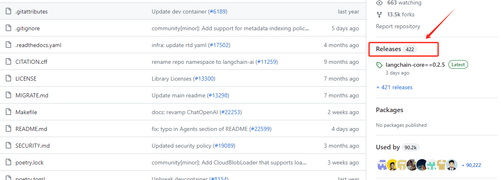
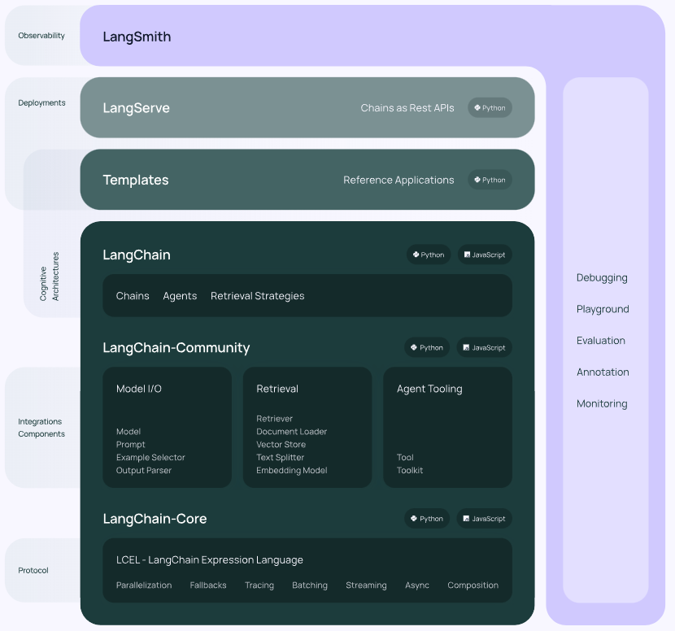
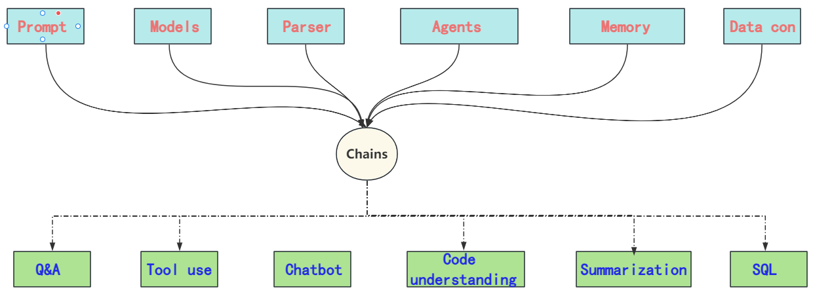
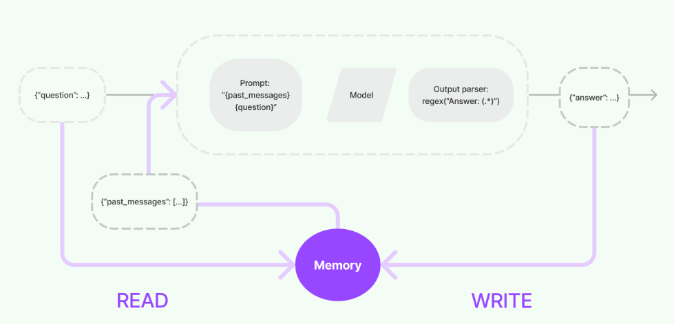

## LangChain如何接入在线大模型并构建链路

  LangChain归属于LangChain AI公司，LangChain作为其中的一个核心项目，开源发布在Gitub上：https://github.com/langchain-ai/langchain

  从LangChain的GitHub版本迭代历史上看，从2023年1月16日起已经经历了320个大小版本的迭代，并且仍然以高频率的更新在加速项目的功能上线，从整体上看，其关注度和社区活跃度是非常高的。LangChain给自身的定位是：用于开发由大语言模型支持的应用程序的框架。它的做法是：通过提供标准化且丰富的模块抽象，构建大语言模型的输入输入规范，利用其核心概念`chains`，灵活地连接整个应用开发流程。而针对每个功能模块，都源于对大模型领域的深入理解和实践经验，开发者提供出来的标准化流程和解决方案的抽象，再通过灵活的模块化组合，才有了目前这样一款在大模型应用开发领域内被普遍高度认可的通用框架。



* **为什么需要这样做？**

  首先，我们需考虑当前大模型的发展态势。尽管OpenAI的GPT系列模型作为大模型领域的`领军人物`，在很大程度上了影响了大模型的使用规范和基于大模型进行应用开发的范式，但并不意味着所有大模型间的使用方式完全相同。例如，我们熟悉的OpenAI GPT模型API调用方式对于Baichuan2模型就不适用。因此，对于每个新模型都要花费大量时间学习其特定规范再进行应用探索，这种工作效率显然是十分低下的。

  其次，必须谈论的是大模型目前面临的局限，如知识更新的滞后性、外部API调用能力、私有数据连接方式以及输出结果的不稳定性等问题。在应用开发中，如何找到这些问题的有效解决策略？


  上述提到的每个限制都紧密关联于大模型本身的特性。尽管理论上可以通过重新训练、微调来增强模型的原生能力，这种方法确实有效，但实际上，大多数开发者并不具备进行这样操作所需的技术资源、时间和财力，选择这条路径一定会导致方向越来越偏离目标。比如关于大模型的Agents、函数调用等功能，每一步都需大量的研发投入，而且最终实现后的应用效果，也取决于研发人员的个人技术能力。在这种背景下，既然大家都有不同的想法和解决方案，那LangChain就来集中做这件事，提供一个统一的平台和明确的定义，来实现应用框架的快速搭建，这就是LangChain一直想要做到，且正在做的事情。

* **LangChain的做法**

  从本质上分析，LangChain还是依然采用从大模型自身出发的策略，通过开发人员在实践过程中对大模型能力的深入理解及其在不同场景下的涌现潜力，使用模块化的方式进行高级抽象，设计出统一接口以适配各种大模型。到目前为止，LangChain抽象出最重要的核心模块如下：

1. Model I/O ：标准化各个大模型的输入和输出，包含输入模版，模型本身和格式化输出；

2. Retrieval ：检索外部数据，然后在执行生成步骤时将其传递到 LLM，包括文档加载、切割、Embedding等；

3. Chains ：链条，LangChain框架中最重要的模块，链接多个模块协同构建应用，是实际运作很多功能的高级抽象；

4. Memory ： 记忆模块，以各种方式构建历史信息，维护有关实体及其关系的信息；

5. Agents ： 目前最热门的Agents开发实践，未来能够真正实现通用人工智能的落地方案；

6. Callbacks ：回调系统，允许连接到 LLM 应用程序的各个阶段。用于日志记录、监控、流传输和其他任务；



  从上图中可以看到，LangChain框架涵盖了模型输入输出的标准化、外部工具接入的规范、上下文记忆功能，以及对数据库、SQL、CSV等多种数据源的连接标准。通过核心的"Chain"高级抽象，定义了不同形式下标准的链接方法，这就能够允许开发者根据实际的应用需求和数据流向快速构建出一套完整的应用程序。这个过程类似于搭建积木，可以灵活适应不同的任务需求。



  也正因为如此，LangChain中涉及的概念和模块化是非常多的，每个模块都有其独特的使用场景和使用方法，那么如何去搭这个“积木”，就需要我们对其每个核心模块都要有一个比较清楚的认知。所以我们课程的安排还是逐个拆解LangChain的功能模块，每一部分都尽可能的给大家做详细的介绍和实操，并在接下来的项目部分，进行整体的一个串联，届时大家将能够清晰的明确如何根据自己的实际业务情况，选择合适的构造模块和构造方法。

  在整体上理解了LangChain之后，我们首先从Model I/O模块进行深入的探讨和实践。

# 1. LangChain核心模块：Model I/O

  LangChain的Model I/O模块提供了标准的、可扩展的接口实现与大语言模型的外部集成。所谓的Model I/O，包括模型输入（Prompts）、模型输出（OutPuts）和模型本身（Models），简单理解就是通过该模块，我们可以快速与某个大模型进行对话交互，整个内部逻辑就相当于我们最熟悉的这个过程：输入Prompt，得到大模型针对该Prompt的推理结果。如下示例为OpenAI的 GPT 系列模型的API 调用规范：

```python
response = openai.ChatCompletion.create(
  model="gpt-3.5-turbo",
  messages=[
    {"role": "user", "content": "请问，什么是机器学习？"}
  ]
)
```

  而我们前面提到了，LangChain项目的定位为一个应用开发框架，所以如果仅仅集成到这样的对话交互程度，那相较于直接使用OpenAI的API调用又有何异呢？所以在这个模块中，LangChain同样抽象出一个`chain`，用于进一步简化和增强交互流程。在LangChain的Model I/O模块设计中，包含三个核心部分： Prompt Template（对应下图中的Format部分）， Model（对应下图中的Predict部分） 和Output Parser（对应下图中的Parse部分）。

* **Format：即指代Prompts Template，通过模板化来管理大模型的输入；**

* **Predict：即指代Models，使用通用接口调用不同的大语言模型；**

* **Parse：即指代Output部分，用来从模型的推理中提取信息，并按照预先设定好的模版来规范化输出。**

  整个Model I/O工作流如下图所示：


* **Format**

  对于Prompt Template第一部分，传统上我们创建提示词是通过手工编写来实现的，在这个过程中会利用各种提示工程技巧，如Few-Shot、链式推理（CoT）等方法，以提高大模型的推理性能。然而，\*\*在应用开发中，一个关键的考量是提示词不能是一成不变的。\*\*其原因在于，应用开发需要适应多变的用户需求和场景。固定的提示词限制了模型的灵活性和适用范围。例如，如果我们正在开发一个天气查询应用，用户可能会以多种方式提出查询，如“今天的天气怎么样？”或“明天纽约的温度是多少度？”。如果提示词是固定的，它可能只能处理一种特定类型的查询，而无法适应这种多样性的需求。

  而Prompt Template，就像ReAct一样，将API的使用、问题解答过程等复杂逻辑封装成了一套结构化的格式。我们只需准备具体的外部函数信息和用户查询，即可生成定制化的提示词，引导模型按照既定逻辑进行思考和回答，从而实现外部函数的调用过程，即：

```json
# 将一个插件的关键信息拼接成一段文本的模版。
TOOL_DESC = """{name_for_model}: Call this tool to interact with the {name_for_human} API. What is the {name_for_human} API useful for? {description_for_model} Parameters: {parameters}"""

# ReAct prompting 的 instruction 模版，将包含插件的详细信息。
PROMPT_REACT = """Answer the following questions as best you can. You have access to the following APIs:

{tool_descs}

Use the following format:

Question: the input question you must answer
Thought: you should always think about what to do
Action: the action to take, should be one of [{tool_names}]
Action Input: the input to the action
Observation: the result of the action
... (this Thought/Action/Action Input/Observation can be repeated zero or more times)
Thought: I now know the final answer
Final Answer: the final answer to the original input question

Begin!

Question: {query}"""
```

  因此，引入Prompt Template可以支持变量和动态内容的插入，使得同一个应用可以根据不同的输入动态调整提示词，从而更好地响应用户的具体需求。LangChain通过这种方式来提高应用的通用性和用户体验。

* **Predict**

  在Predict部分，实质上是处理模型从接收输入到执行推理的整个过程。考虑到存在两种主要类型的大模型——Base类模型和Chat类模型，LangChain在其Model I/O模块中对这两种模型都进行了抽象，分别归类为LLMs（Large Language Models）和Chat Models。我们还是以OpenAI 的 Completion 和 Chatcompletions方法为例：

```python

# Base类模型
client.completions.create(
  model="gpt-3.5-turbo-instruct",
  prompt="Say this is a test",
)


# 聊天模型
client.chat.completions.create(
  model="gpt-3.5-turbo",
  messages=[
    {"role": "system", "content": "你是一位乐于助人的AI智能小助手"},
    {"role": "user", "content": "你好，请你介绍一下你自己。"}
  ]
)
```

  LLMs是简化的大语言模型抽象，即基于给定的Prompt提供内容生成的功能。而Chat Models则专注于聊天API的抽象，需要维护上下文的记忆（聊天记录），呈现出更接近对话或聊天形式的交互。

* **Parse**

  我们知道，大模型的输出是不稳定的，同样的输入Prompt往往会得到不同形式的输出。在自然语言交互中，不同的语言表达方式通常不会造成理解上的障碍。但在应用开发中，大模型的输出可能是下一步逻辑处理的关键输入。因此，在这种情况下，规范化输出是必须要做的任务，以确保应用能够顺利进行后续的逻辑处理。

  输出解析器 Output Parser就是一个帮助结构化语言模型响应的抽象，可以获取格式指令或者进行更深层次的解析。这我们会在后面的实践中直观的体验到。

  整体而言，在Model I/O模块的抽象中，其一能够让开发者快速的接入不同的大模型，比如OpenAI、ChatGLM、Qwen等，按照既定规范执行模型推理。其二通过输入和输出的模板化处理，使其更贴合于应用开发的最佳实践。接下来，我们就逐步的介绍上述三个流程在LangChain下是如何进行集成和操作的。

# 2. Installing LangChain

```python
! pip install langchain
```

```plaintext
Collecting langchain
  Using cached langchain-0.2.1-py3-none-any.whl.metadata (13 kB)
Requirement already satisfied: PyYAML>=5.3 in c:\programdata\anaconda3\lib\site-packages (from langchain) (6.0.1)
Requirement already satisfied: SQLAlchemy<3,>=1.4 in c:\programdata\anaconda3\lib\site-packages (from langchain) (2.0.25)
Requirement already satisfied: aiohttp<4.0.0,>=3.8.3 in c:\programdata\anaconda3\lib\site-packages (from langchain) (3.9.3)
Collecting langchain-core<0.3.0,>=0.2.0 (from langchain)
  Using cached langchain_core-0.2.3-py3-none-any.whl.metadata (5.9 kB)
Collecting langchain-text-splitters<0.3.0,>=0.2.0 (from langchain)
  Using cached langchain_text_splitters-0.2.0-py3-none-any.whl.metadata (2.2 kB)
Collecting langsmith<0.2.0,>=0.1.17 (from langchain)
  Using cached langsmith-0.1.67-py3-none-any.whl.metadata (13 kB)
Requirement already satisfied: numpy<2,>=1 in c:\programdata\anaconda3\lib\site-packages (from langchain) (1.26.4)
Requirement already satisfied: pydantic<3,>=1 in c:\programdata\anaconda3\lib\site-packages (from langchain) (1.10.12)
Requirement already satisfied: requests<3,>=2 in c:\programdata\anaconda3\lib\site-packages (from langchain) (2.31.0)
Requirement already satisfied: tenacity<9.0.0,>=8.1.0 in c:\programdata\anaconda3\lib\site-packages (from langchain) (8.2.2)
Requirement already satisfied: aiosignal>=1.1.2 in c:\programdata\anaconda3\lib\site-packages (from aiohttp<4.0.0,>=3.8.3->langchain) (1.2.0)
Requirement already satisfied: attrs>=17.3.0 in c:\programdata\anaconda3\lib\site-packages (from aiohttp<4.0.0,>=3.8.3->langchain) (23.1.0)
Requirement already satisfied: frozenlist>=1.1.1 in c:\programdata\anaconda3\lib\site-packages (from aiohttp<4.0.0,>=3.8.3->langchain) (1.4.0)
Requirement already satisfied: multidict<7.0,>=4.5 in c:\programdata\anaconda3\lib\site-packages (from aiohttp<4.0.0,>=3.8.3->langchain) (6.0.4)
Requirement already satisfied: yarl<2.0,>=1.0 in c:\programdata\anaconda3\lib\site-packages (from aiohttp<4.0.0,>=3.8.3->langchain) (1.9.3)
Collecting jsonpatch<2.0,>=1.33 (from langchain-core<0.3.0,>=0.2.0->langchain)
  Using cached jsonpatch-1.33-py2.py3-none-any.whl.metadata (3.0 kB)
Collecting packaging<24.0,>=23.2 (from langchain-core<0.3.0,>=0.2.0->langchain)
  Using cached packaging-23.2-py3-none-any.whl.metadata (3.2 kB)
Collecting orjson<4.0.0,>=3.9.14 (from langsmith<0.2.0,>=0.1.17->langchain)
  Using cached orjson-3.10.3-cp311-none-win_amd64.whl.metadata (50 kB)
Requirement already satisfied: typing-extensions>=4.2.0 in c:\programdata\anaconda3\lib\site-packages (from pydantic<3,>=1->langchain) (4.9.0)
Requirement already satisfied: charset-normalizer<4,>=2 in c:\programdata\anaconda3\lib\site-packages (from requests<3,>=2->langchain) (2.0.4)
Requirement already satisfied: idna<4,>=2.5 in c:\programdata\anaconda3\lib\site-packages (from requests<3,>=2->langchain) (3.4)
Requirement already satisfied: urllib3<3,>=1.21.1 in c:\programdata\anaconda3\lib\site-packages (from requests<3,>=2->langchain) (2.0.7)
Requirement already satisfied: certifi>=2017.4.17 in c:\programdata\anaconda3\lib\site-packages (from requests<3,>=2->langchain) (2024.2.2)
Requirement already satisfied: greenlet!=0.4.17 in c:\programdata\anaconda3\lib\site-packages (from SQLAlchemy<3,>=1.4->langchain) (3.0.1)
Requirement already satisfied: jsonpointer>=1.9 in c:\programdata\anaconda3\lib\site-packages (from jsonpatch<2.0,>=1.33->langchain-core<0.3.0,>=0.2.0->langchain) (2.1)
Using cached langchain-0.2.1-py3-none-any.whl (973 kB)
Using cached langchain_core-0.2.3-py3-none-any.whl (310 kB)
Using cached langchain_text_splitters-0.2.0-py3-none-any.whl (23 kB)
Using cached langsmith-0.1.67-py3-none-any.whl (124 kB)
Using cached jsonpatch-1.33-py2.py3-none-any.whl (12 kB)
Using cached orjson-3.10.3-cp311-none-win_amd64.whl (138 kB)
Using cached packaging-23.2-py3-none-any.whl (53 kB)
Installing collected packages: packaging, orjson, jsonpatch, langsmith, langchain-core, langchain-text-splitters, langchain
  Attempting uninstall: packaging
    Found existing installation: packaging 23.1
    Uninstalling packaging-23.1:
      Successfully uninstalled packaging-23.1
  Attempting uninstall: jsonpatch
    Found existing installation: jsonpatch 1.32
    Uninstalling jsonpatch-1.32:
      Successfully uninstalled jsonpatch-1.32
Successfully installed jsonpatch-1.33 langchain-0.2.1 langchain-core-0.2.3 langchain-text-splitters-0.2.0 langsmith-0.1.67 orjson-3.10.3 packaging-23.2
```

# 3. Build LLMChain

## 3.1 LLMs如何构建链路

  LLMs 表示的是补全类的大模型， 它是将字符串作为输入并返回字符串的语言模型。LangChain中LLMs 的集成页面：https://python.langchain.com/v0.2/docs/integrations/llms/

* **需要理解的第一个概念：如何调用LangChain的Completions 模型**

  因为GLM并没有开发补全模型，所以我们这里使用OpenAI的instrut模型进行进行演示。

```python
# get a token: https://platform.openai.com/account/api-keys

from getpass import getpass

OPENAI_API_KEY = getpass()
```

```python
from openai import OpenAI
client = OpenAI()

client.completions.create(
  model="gpt-3.5-turbo-instruct",
  prompt="请问，什么是快乐星球？",
  max_tokens=7,
  temperature=0
)
```

```plaintext
Completion(id='cmpl-9W1zu2TXP3iU13WS9GZnAgvivA3bt', choices=[CompletionChoice(finish_reason='length', index=0, logprobs=None, text='\n\n快乐星球')], created=1717421202, model='gpt-3.5-turbo-instruct', object='text_completion', system_fingerprint=None, usage=CompletionUsage(completion_tokens=7, prompt_tokens=14, total_tokens=21))
```

  接下来我们看，当langChain应用框架集成了OpenAI的 completions 接口后，就可以用LangChain定义的规范来进行调用。

```python
# ! pip install langchain_openai
```

* **需要理解的第二个概念：如何在LangChain中调用LLMs Models**

```python
from langchain_openai import OpenAI
```

```python
import os

os.environ["OPENAI_API_KEY"] = OPENAI_API_KEY
```

```python
llm = OpenAI(model='gpt-3.5-turbo-instruct')
```

```python
question = "请问，什么是快乐星球？"

llm.invoke("请问，什么是快乐星球？")
```

```plaintext
'\n\n快乐星球是一个虚构的理想世界，是指一个充满和平、友爱、幸福和快乐的星球。它是人们憧憬的理想社会，没有战争、贫穷、疾病和歧视，人们生活在和谐、平等和自由的环境中。快乐星球象征着人类对美好未来的向往和追求，也是人们对和平与幸福的渴望和希望。'
```

* **需要理解的第三个概念：什么是PromptTemplate**

  对于应用流程来说，输入大模型的关键信息往往是不确定的。也就是说：一个Prompt的主体可以固定，但关键位置的信息通常是使用一个或多个变量来做占位。比如：

```python
template = """问题: {question}

答案: 请一步一步的思考。"""
```

对于这种情况，LangChain就抽象了一个提示模板，用来将用户输入和参数转换为语言模型的指令。用于指导大模型的响应，帮助其理解上下文并生成相关且连贯的基于语言的输出。

```python
from langchain_core.prompts import PromptTemplate

prompt_template = PromptTemplate.from_template(template)
```

```python
prompt_template
```

```plaintext
PromptTemplate(input_variables=['question'], template='问题: {question}\n\n答案: 请一步一步的思考。')
```

```python
prompt_template.invoke({"question": "什么是快乐星球？"})
```

```plaintext
StringPromptValue(text='问题: 什么是快乐星球？\n\n答案: 请一步一步的思考。')
```

  对于多变量是一样的：

```python
template_1 = """问题: {question}

请用{output}回答"""
```

```python
prompt_template1 = PromptTemplate.from_template(template_1)
```

```python
prompt_template1
```

```plaintext
PromptTemplate(input_variables=['output', 'question'], template='问题: {question}\n\n请用{output}回答')
```

```python
prompt_template1.invoke({"question": "什么是快乐星球？", "output":"英语"})
```

```plaintext
StringPromptValue(text='问题: 什么是快乐星球？\n\n请用英语回答')
```

* **需要理解的第三个概念：LLMChain**


```python
from langchain.chains import LLMChain
```

```python
from langchain.chains import LLMChain
from langchain_core.prompts import PromptTemplate
from langchain_openai import OpenAI


template = """问题: {question}

答案: 请一步一步的思考。"""

prompt_template = PromptTemplate.from_template(template)


llm = OpenAI()

chain = LLMChain(prompt=prompt_template, llm=llm)

chain.invoke("什么是快乐星球")
```

```plaintext
{'question': '什么是快乐星球',
 'text': '\n\n快乐星球是一个想象中的虚拟星球，它是一个充满快乐和幸福的地方。在这个星球上，每个人都可以自由地追求自己的梦想，没有痛苦和压力的存在。人与人之间和谐相处，没有战争和冲突。这个星球上的环境也是非常美好的，充满了绚丽的色彩和美妙的音乐。在快乐星球上，每个人都能够找到自己的快乐，享受生活的乐趣。它是人们对于理想社会的向往和梦想。'}
```

* **需要理解的第四个概念：什么是LangChain的 LCEL声明语法**

  上述是旧版本LangChain构建链路的一种形式,主要还是基于传统类的构建方法.但LangChain的迭代,是在向新的一种链路声明方式转变,即LCE.LangChain 表达式语言（LCEL）是一种链接 LangChain 组件的声明性方式。 无需更改代码，可以实现从最简单的“提示 + LLM”链到最复杂的链（我们已经看到人们成功运行了 100 秒的 LCEL 链）生产步骤）.

```python
from langchain_core.prompts import PromptTemplate
from langchain_openai import OpenAI


template = """问题: {question}

答案: 请一步一步的思考。"""

prompt_template = PromptTemplate.from_template(template)


llm = OpenAI()

chain = prompt_template | llm 
```

```python
chain.invoke("什么是快乐星球")
```

```plaintext
'\n\n快乐星球可以理解为一个想象中的幻想世界，它是一个充满欢笑、快乐和和谐的星球。在这个星球上，所有的生物都拥有幸福快乐的生活，没有战争、疾病和贫穷的困扰。这里的人们相互关爱、友善和包容，生活在和平与幸福的环境中。快乐星球是人们向往的理想国，也是我们应当努力追求的目标。'
```

## 3.2 Chat Model 如何构建链路

  Chat Models 类模型往往是基于 LLMs 类模型针对对话形式特殊微调过的模型.更适用于人类的对话习惯.所以它往往是使用消息序列作为输入并返回聊天消息作为输出（而不是使用纯文本）的语言模型。聊天模型支持为对话消息分配不同的角色，有助于区分来自 AI、用户和系统消息等指令的消息。

  比如目前OpenAI的GPT系列模型、GLM4 系列模型，现在是全面支持对话类模型:https://platform.openai.com/docs/models/gpt-4-turbo-and-gpt-4

  同样我们快速的测试一下,如果使用GLM 4 官方提供的接口来调用GLM 4 系列模型. GLM-4作为在线大模型,其调用方法被抽象在LangChain中的Chat Models模块中.

* **需要理解的第五个概念：如何在LangChain中调用Chat Models**

```python
#!pip install --upgrade httpx httpx-sse PyJWT
```

```python
from langchain_community.chat_models import ChatZhipuAI
```

```python
import os

#os.environ["ZHIPUAI_API_KEY"] = "zhipuai_api_key"

zhipuai_api_key = "3fd2ee07b86207a7e0f7e79ee459fbfa.9iiQgqVfddDOobbS"
```

```python
chat = ChatZhipuAI(
    zhipuai_api_key = zhipuai_api_key,
    model="glm-4",
    temperature=0.5,
)
```

```python
chat.invoke("你好，请你介绍一下你自己")
```

```plaintext
AIMessage(content='你好！我是智谱清言，是清华大学 KEG 实验室和智谱 AI 公司于 2023 年共同训练的语言模型。我的目标是通过回答用户提出的问题来帮助他们解决问题。由于我是一个计算机程序，所以我没有自我意识，也不能像人类一样感知世界。我只能通过分析我所学到的信息来回答问题。', response_metadata={'token_usage': {'completion_tokens': 72, 'prompt_tokens': 10, 'total_tokens': 82}, 'model_name': 'glm-4', 'finish_reason': 'stop'}, id='run-7b798209-3cbc-47fb-a9e0-62a3ff6e6a26-0')
```

```python
from langchain_core.messages import AIMessage, HumanMessage, SystemMessage

messages = [
    SystemMessage(content="你是一位诗人"),
    HumanMessage(content="请给我写一首关于小鸭子的诗"),
]
```

```python
response = chat.invoke(messages)
print(response.content)  # Displays the AI-generated poem
```

```plaintext
小鸭子戏水曲

碧波荡漾小河畔，
鸭群嬉戏乐无边。
毛茸茸的小身影，
水中舞动如花瓣。

阳光洒落金色波，
小鸭子欢快游弋。
扑腾翅膀溅水花，
童真童趣显神采。

绿水悠悠映晴空，
它们尽情展翅翱。
捉鱼虾，逐蜻蜓，
无忧无虑度时光。

夏日炎炎伴晚风，
小鸭子们归巢中。
夕阳余晖映水面，
留下一路欢歌鸣。

岁月流转，时光荏苒，
小鸭子终将长大。
愿它们永远保持，
那颗纯真快乐的心。
```

* **需要理解的第六个概念：什么是ChatPromptTemplate**

```python
from langchain_core.prompts import ChatPromptTemplate

prompt_template = ChatPromptTemplate.from_messages([
    ("system", "你是一位乐于助人的小助理"),
    ("user", "什么是 {topic}")
])

prompt_template.invoke({"topic": "快乐星球"})
```

```plaintext
ChatPromptValue(messages=[SystemMessage(content='你是一位乐于助人的小助理'), HumanMessage(content='什么是 快乐星球')])
```


```python
from langchain_core.prompts import ChatPromptTemplate

prompt_template = ChatPromptTemplate.from_messages([
    ("system", "你是一位乐于助人的小助理"),
    ("user", "什么是 {topic}")
])

prompt_template.invoke({"topic": "机器学习"})
```

```plaintext
ChatPromptValue(messages=[SystemMessage(content='你是一位乐于助人的小助理'), HumanMessage(content='什么是 机器学习')])
```

* **需要理解的第七个概念:如何构建Chat Models 的LLMChain链路**

```python
from langchain.chains import LLMChain
from langchain_core.prompts import ChatPromptTemplate

prompt_template = ChatPromptTemplate.from_messages([
    ("system", "你是一位乐于助人的小助理"),
    ("user", "什么是 {topic}")
])


chat = ChatZhipuAI(
    zhipuai_api_key = zhipuai_api_key,
    model="glm-4",
    temperature=0.5,
)


chain = LLMChain(prompt=prompt_template, llm=chat)
```

```plaintext
C:\Users\snowb\anaconda3\Lib\site-packages\langchain_core\_api\deprecation.py:119: LangChainDeprecationWarning: The class `LLMChain` was deprecated in LangChain 0.1.17 and will be removed in 0.3.0. Use RunnableSequence, e.g., `prompt | llm` instead.
  warn_deprecated(
```

```python
chain.invoke({"topic":"什么是快乐星球?"})
```

```plaintext
{'topic': '什么是快乐星球?',
 'text': '"什么是快乐星球？"这个问题来源于中国的一部少儿科幻电视剧《快乐星球》。该系列剧自2004年首播以来，受到了广大少年儿童的喜爱。在第五季中的一首插曲中，有这样的歌词：“什么是快乐星球？如果你想知道什么是快乐星球的话，我现在就带你研究。”这句歌词由于节奏明快、朗朗上口，在网络上迅速流行开来，成为了一种流行的梗。\n\n在更广泛的文化语境中，“快乐星球”指的是一个充满童真、欢乐和梦想的地方，它不仅仅是一个物理概念上的星球，更是一种精神寄托，象征着无忧无虑、纯真快乐的童年时光。\n\n而在2024年的消息中，动画电影《快乐星球》正式立项，讲述了剧中的角色乐乐在老顽童爷爷的培养下成为了一名AI科学家，并开发了一个同名的沉浸式AI科普空间，旨在通过学科学习让儿童了解文化和科技知识，开启智慧之门，并预警未来可能面临的挑战。这进一步扩展了“快乐星球”的概念，使之不仅限于电视剧情，还与现实世界中的科技教育和未来发展联系起来。'}
```

  LCEL的语法结构就是:

```python
from langchain.chains import LLMChain
from langchain_core.prompts import ChatPromptTemplate

prompt_template = ChatPromptTemplate.from_messages([
    ("system", "你是一位乐于助人的小助理"),
    ("user", "什么是 {topic}")
])


chat = ChatZhipuAI(
    zhipuai_api_key = zhipuai_api_key,
    model="glm-4",
    temperature=0.5,
)

chain = prompt_template | chat
```

```python
chain.invoke({"topic":"什么是快乐星球?"})
```

```plaintext
AIMessage(content='"什么是快乐星球？"这个问题来源于中国的一部知名少儿科幻电视剧《快乐星球》。该系列剧自2004年首播以来，深受广大少年儿童的喜爱。在第五季中的一首插曲中，有这样的歌词：“什么是快乐星球？如果你想知道什么是快乐星球的话，我现在就带你研究。”这句歌词因其魔性的节奏和易于传播的特质，在网络上广为流传，成为了一种流行的梗。\n\n在更广泛的文化语境中，“快乐星球”指的是一个充满欢乐、童真和积极向上的世界。它不仅仅是一个物理概念上的星球，更是人们心中对美好生活的向往和追求。在动画电影《快乐星球》立项的消息中，乐乐成为AI科学家的故事，也是对这种积极精神的延续。乐乐开发的沉浸式AI科普空间旨在教育儿童，通过学习文化科技知识，开启智慧之门，并预警未来可能面临的挑战。\n\n综上所述，“什么是快乐星球？”这个问题不仅仅是一个电视剧中的歌词，它还代表着一种积极乐观的生活态度和对未来的美好憧憬。', response_metadata={'token_usage': {'completion_tokens': 205, 'prompt_tokens': 1674, 'total_tokens': 1879}, 'model_name': 'glm-4', 'finish_reason': 'stop'}, id='run-180ac1f0-035f-47b3-92aa-a4c2a51ad926-0')
```

# 4. Callbacks

  Callbacks（回调函数）是一种编程模式，Callbacks的意义在于：允许程序在某个任务完成时自动执行另一个函数，而不必阻塞等待某个长时间运行的操作完成。所以它会在处理异步操作，如网络请求、文件读写或任何可能需要等待的操作时频繁被使用。

  对于与大模型的连续交互场景，一般采用的都是流式输出。但在做流式输出前，需要的就是回调 Callbacks。

  LangChain 提供了一个回调系统，其官网文档地址：https://python.langchain.com/v0.2/docs/concepts/#callbacks

  回调处理程序可以是 sync（同步） 或 async （异步）的。同步回调和异步回调是编程中常用的两种处理事件或数据的方式，它们在执行时机和用途上有明显的区别：

1. **同步回调（Synchronous Callbacks）**:

   * **执行时机**：同步回调是在主程序流程中直接调用和执行的。当一个同步回调函数被触发时，程序会立即执行这个回调函数，并且在回调函数执行完成之前，主程序流程会被阻塞。

   * **用途**：同步回调通常用于确保某些操作必须在程序继续执行前完成。例如，在访问数组中的每个元素并对其应用函数时，你可能会使用数组的`.forEach()`方法，这是一个同步的回调实现。

2. **异步回调（Asynchronous Callbacks）**:

   * **执行时机**：异步回调不会立即执行，它们通常被放置在事件队列中，等待当前执行堆栈清空后才开始执行。这意味着程序的主流程不会等待异步回调的完成，可以继续执行其他任务。

   * **用途**：异步回调通常用在不希望阻塞主程序流程的情况下，例如处理I/O操作（如网络请求、文件读写），或者在执行大量计算时不影响用在并发编程和现代Web开发中。

  在并发编程的Web开发中，交互式应用对话场景，肯定采用的是异步的回调。

  LangChain中的异步回调接口：https://api.python.langchain.com/en/latest/callbacks/langchain\_core.callbacks.base.AsyncCallbackHandler.html

  当我们在执行运行时使用 callbacks 关键字 arg 传递 CallbackHandlers 时，这些回调将由执行中涉及的所有嵌套对象发出。例如，当处理程序传递给代理时，它将用于与代理相关的所有回调以及代理执行中涉及的所有对象。

```python
from typing import Any, Dict, List

from langchain_community.chat_models import ChatZhipuAI
from langchain_core.callbacks import BaseCallbackHandler
from langchain_core.messages import BaseMessage
from langchain_core.outputs import LLMResult
from langchain_core.prompts import ChatPromptTemplate


class LoggingHandler(BaseCallbackHandler):
    def on_chat_model_start(
        self, serialized: Dict[str, Any], messages: List[List[BaseMessage]], **kwargs
    ) -> None:
        print("Chat model started")

    def on_llm_end(self, response: LLMResult, **kwargs) -> None:
        print(f"Chat model ended, response: {response}")

    def on_chain_start(
        self, serialized: Dict[str, Any], inputs: Dict[str, Any], **kwargs
    ) -> None:
        print(f"Chain {serialized.get('name')} started")

    def on_chain_end(self, outputs: Dict[str, Any], **kwargs) -> None:
        print(f"Chain ended, outputs: {outputs}")

# 定义回调
callbacks = [LoggingHandler()]

# 实例化语言模型
llm = ChatZhipuAI(
    api_key="086a38e9141410d76e393ec52105c83b.7vBwRS4srgxpMRXU",
    model="glm-4",)

# 定义提示模板
prompt = ChatPromptTemplate.from_template("1 + {number}等于多少?")

chain = prompt | llm

response = chain.invoke({"number": "2"}, config={"callbacks": callbacks})
```

```plaintext
Chain RunnableSequence started
Chain ChatPromptTemplate started
Chain ended, outputs: messages=[HumanMessage(content='1 + 2等于多少?')]
Chat model started
Chat model ended, response: generations=[[ChatGeneration(text='1 + 2 等于 3。', generation_info={'finish_reason': 'stop'}, message=AIMessage(content='1 + 2 等于 3。', response_metadata={'token_usage': {'completion_tokens': 13, 'prompt_tokens': 12, 'total_tokens': 25}, 'model_name': 'glm-4', 'finish_reason': 'stop'}, id='run-5156f30b-3d45-4431-bcab-2291d5277f8b-0'))]] llm_output={'token_usage': {'completion_tokens': 13, 'prompt_tokens': 12, 'total_tokens': 25}, 'model_name': 'glm-4'} run=None
Chain ended, outputs: content='1 + 2 等于 3。' response_metadata={'token_usage': {'completion_tokens': 13, 'prompt_tokens': 12, 'total_tokens': 25}, 'model_name': 'glm-4', 'finish_reason': 'stop'} id='run-5156f30b-3d45-4431-bcab-2291d5277f8b-0'
```

```python
print(response)
```

```plaintext
content='1 + 2 等于 3。' response_metadata={'token_usage': {'completion_tokens': 13, 'prompt_tokens': 12, 'total_tokens': 25}, 'model_name': 'glm-4', 'finish_reason': 'stop'} id='run-5156f30b-3d45-4431-bcab-2291d5277f8b-0'
```

```python
```

  那我们尝试使用回调机制去流式调用GLM-4.

```python
# ! pip install httpx_sse
```

  httpx\_sse是一个基于httpx的Server-Sent Events (SSE) 客户端库。SSE是一种服务器推送技术，允许服务器通过HTTP连接向客户端发送推送消息。这种技术常用于实时消息传递和通知，如股票价格更新、新闻更新或其他需要从服务器到客户端实时通信的应用场景。\`

```python

# langchain_community\chat_models\zhipuai.py

def connect_sse(client: Any, method: str, url: str, **kwargs: Any) -> Iterator 
    from httpx_sse import EventSour  
        with client.stream(method, url, **kwargs) as response:
            yield EventSource(response)
```

```python
from langchain_community.chat_models import ChatZhipuAI
from langchain_core.callbacks import BaseCallbackHandler
from langchain_core.prompts import ChatPromptTemplate


class MyCustomHandler(BaseCallbackHandler):
    def on_llm_new_token(self, token: str, **kwargs) -> None:
        print(f"My custom handler, token: {token}")


prompt = ChatPromptTemplate.from_messages(["请给我讲一个关于{animal}的笑话。"])


llm = ChatZhipuAI(
    api_key="086a38e9141410d76e393ec52105c83b.7vBwRS4srgxpMRXU",
    model="glm-4",
    streaming=True,
    callbacks=[MyCustomHandler()],
    )


chain = prompt | llm

response = chain.invoke({"animal": "熊"})
```

```plaintext
My custom handler, token: 有一天
My custom handler, token: ，
My custom handler, token: 一只
My custom handler, token: 熊
My custom handler, token: 走进
My custom handler, token: 了一家
My custom handler, token: 餐厅
My custom handler, token: ，
My custom handler, token: 坐在
My custom handler, token: 了
My custom handler, token: 柜台
My custom handler, token: 前
My custom handler, token: 。
My custom handler, token: 服务员
My custom handler, token: 看着
My custom handler, token: 熊
My custom handler, token: ，
My custom handler, token: 惊讶
My custom handler, token: 地问
My custom handler, token: ：“
My custom handler, token: 我们不
My custom handler, token: 常见
My custom handler, token: 到
My custom handler, token: 熊
My custom handler, token: 光
My custom handler, token: 顾
My custom handler, token: 这里
My custom handler, token: ，
My custom handler, token: 您
My custom handler, token: 想
My custom handler, token: 点
My custom handler, token: 些什么
My custom handler, token: 呢
My custom handler, token: ？
My custom handler, token: ”

熊
My custom handler, token: 想了
My custom handler, token: 想
My custom handler, token: ，
My custom handler, token: 然后用
My custom handler, token: 爪
My custom handler, token: 子
My custom handler, token: 指着
My custom handler, token: 菜单
My custom handler, token: 说
My custom handler, token: ：“
My custom handler, token: 嗯
My custom handler, token: ，
My custom handler, token: 我
My custom handler, token: 想要
My custom handler, token: 一份
My custom handler, token: ......
My custom handler, token: Gr
My custom handler, token: izzly
My custom handler, token:  Burger
My custom handler, token: （
My custom handler, token: 灰
My custom handler, token: 熊
My custom handler, token: 汉堡
My custom handler, token: ）。
My custom handler, token: ”

服务员
My custom handler, token: 点点头
My custom handler, token: ，
My custom handler, token: 又
My custom handler, token: 问
My custom handler, token: ：“
My custom handler, token: 好的
My custom handler, token: ，
My custom handler, token: 需要
My custom handler, token: 加
My custom handler, token: 什么
My custom handler, token: 配料
My custom handler, token: 吗
My custom handler, token: ？
My custom handler, token: ”

熊
My custom handler, token: 眨
My custom handler, token: 了
My custom handler, token: 眨
My custom handler, token: 眼睛
My custom handler, token: ，
My custom handler, token: 回答说
My custom handler, token: ：“
My custom handler, token: 不用
My custom handler, token: 了
My custom handler, token: ，
My custom handler, token: 我只
My custom handler, token: 想要
My custom handler, token: 一个
My custom handler, token: 普通的
My custom handler, token: Gr
My custom handler, token: izzly
My custom handler, token:  Burger
My custom handler, token: ，
My custom handler, token: 但是
My custom handler, token: ，
My custom handler, token: 请
My custom handler, token: 别
My custom handler, token: 放
My custom handler, token: ‘
My custom handler, token: Bear
My custom handler, token: ’
My custom handler, token: na
My custom handler, token: ise
My custom handler, token: （
My custom handler, token: 熊
My custom handler, token: 酱
My custom handler, token: ）
My custom handler, token: ！”
My custom handler, token: 
```

  上述是我们自己定义的一个简单的流式输出，因为大模型普遍都需要流式输出需求，所以LangChain官方已经默认抽象出了一个流式输出的回调函数，如下：

```python
from langchain_core.callbacks.manager import CallbackManager
from langchain_core.callbacks.streaming_stdout import StreamingStdOutCallbackHandler
```

```python
streaming_chat = ChatZhipuAI(
    api_key="086a38e9141410d76e393ec52105c83b.7vBwRS4srgxpMRXU",
    model="glm-4",
    temperature=0.5,
    streaming=True,
    callback_manager=CallbackManager([StreamingStdOutCallbackHandler()]),
)
```

```python
from langchain_core.messages import AIMessage, HumanMessage, SystemMessage

messages = [
    AIMessage(content="你好"),
    SystemMessage(content="你是一位诗人"),
    HumanMessage(content="请你根据我的输入,帮我写一首关于小鸭子落水的诗"),
]
```

```python
messages
```

```plaintext
[AIMessage(content='你好'),
 SystemMessage(content='你是一位诗人'),
 HumanMessage(content='请你根据我的输入,帮我写一首关于小鸭子落水的诗')]
```

```python
streaming_chat.invoke(messages)
```

```plaintext
小鸭子落水，波纹荡漾间，
毛茸茸身躯，挣扎在河面。
慌乱张望处，同伴齐声唤，
振翅欲高飞，却陷泥潭险。

悲鸣传四方，风儿轻抚慰，
柳枝垂低首，鱼儿停顿水。
援手何处寻？救援心焦急，
忽见善意手，温柔伸向它。

小鸭子得救，感激泪满眼，
蓝天展翅舞，重获新生欢。
波光粼粼映，诗篇传佳话，
岁月悠悠过，记取善行暖。


AIMessage(content='小鸭子落水，波纹荡漾间，\n毛茸茸身躯，挣扎在河面。\n慌乱张望处，同伴齐声唤，\n振翅欲高飞，却陷泥潭险。\n\n悲鸣传四方，风儿轻抚慰，\n柳枝垂低首，鱼儿停顿水。\n援手何处寻？救援心焦急，\n忽见善意手，温柔伸向它。\n\n小鸭子得救，感激泪满眼，\n蓝天展翅舞，重获新生欢。\n波光粼粼映，诗篇传佳话，\n岁月悠悠过，记取善行暖。', response_metadata={'finish_reason': 'stop'}, id='run-f644edb5-bf82-4bbd-b14e-d475723a9a9b-0')
```

# 5. Memory

  `Memory`作为存储记忆数据的一个是抽象模块，其作为一个独立模块使用是没有任何意义的，因为本质上它的定位就是一个存储对话数据的空间。先抛开其内部实现的复杂性，我们可以回想一下：在定义链路的时候，每个链的内部都会根据其接收到的输入去定义其核心执行逻辑，比如在链内如何去调用外部工具，如何解析返回的数据格式等。其中链接收到的输入，可以直接来自用户，同时，也可以来自`Memory`模块。所以在这个过程中，一个链如果接入了`Memory`模块，其内部会与`Memory`模块进行两次交互：

1. 收到用户输入之后，执行核心逻辑之前，链会读取`Memory`模块，拿到对应的数据，与用户输入的Prompt放在一起，执行接下来的逻辑。

2. 执行核心逻辑之后，返回响应之前，链会将这个过程中产生的信息，写入`Memory`模块，以便在其他场景下能够引用到这些记忆数据。

  由此可见，`Memory`模块和`Chains`模块是一对相互协作的关系，就像我们定义Prompt一样，不同的需求，需要构建不同的Prompt Template。那我们想记录下什么哪些数据，不论是用户输入的prompt，还是大模型的响应结果，亦或是链路的中间过程生成的数据，全部就由`Memory`这个抽象模块来完成。所以这个模块最**核心干的就是两件事：如何存储数据和如何提取数据，对应着就是两个基本操作：读和写。**

  理解了上述说明后，大家就能非常容易理解下面这张 LangChain Memory 模块的整体设计结构图：



  在上述流程图中，`Model I/O`过程的本质上就是一个链路（chain），其配置时会设定`Prompt`、`Model`和`Output Parser`作为链路的主要逻辑。这个链路可以处理直接来自用户的`{question}`输入，也可以处理来自`Memory`模块读取的`{past_passages}`作为输入。执行完毕后，正常情况下会直接输出`{answer}`。但一旦集成了Memory模块，输出就会根据`Memory`中定义的逻辑被存储起来，供其他组件或流程使用。

  详细的参数说明如下：

```plaintext
# 类继承关系：
BaseMemory --> BaseChatMemory --> <name>Memory  # Examples: ZepMemory, MotorheadMemory
```

```python
class BaseMemory(Serializable, ABC):
    """Chains 中记忆的抽象基类。

    记忆指的是 Chains 中的状态。记忆可用于存储关于 Chains 过去执行的信息，并将该信息注入到未来执行的 Chains 输入中。
    例如，对于对话 Chains，记忆可用于存储对话并自动将其添加到未来模型提示中，以便模型具有必要的上下文来连贯地响应最新的输入。
     """
    
    # 下面是一些必须由子类实现的方法：
    
    
    # 定义一个属性，任何从BaseMemory派生的子类都需要实现此方法。
    # 此方法应返回该记忆类将添加到链输入的字符串键。
    @property
    @abstractmethod
    def memory_variables(self) -> List[str]:
        """此记忆类将添加到链输入的字符串键列表。"""

        
    # 定义一个抽象方法。任何从BaseMemory派生的子类都需要实现此方法。
    # 此方法基于给定的链输入返回键值对。
    @abstractmethod
    def load_memory_variables(self, inputs: Dict[str, Any]) -> Dict[str, Any]:
        """根据链的文本输入返回键值对。"""

    
    # 定义一个抽象方法。任何从BaseMemory派生的子类都需要实现此方法。
    # 此方法将此链运行的上下文保存到内存。
    @abstractmethod
    def save_context(self, inputs: Dict[str, Any], outputs: Dict[str, str]) -> None:
        """将此链运行的上下文保存到记忆中。"""

    # 定义一个抽象方法。任何从BaseMemory派生的子类都需要实现此方法。
    # 此方法清除内存内容。
    @abstractmethod
    def clear(self) -> None:
        """清除记忆内容。"""
```

```python
# ! pip install langchain_community
```

```python
from langchain_community.chat_models import ChatZhipuAI


chat = ChatZhipuAI(
    api_key="086a38e9141410d76e393ec52105c83b.7vBwRS4srgxpMRXU",
    model="glm-4",
    temperature=0.8,
)
```

```python
from langchain.memory import ConversationBufferMemory

memory = ConversationBufferMemory()
memory.chat_memory.add_user_message("你好")
memory.chat_memory.add_ai_message("你好，请问有什么可以帮你的?")
```

```python
memory.load_memory_variables({})
```

```plaintext
{'history': 'Human: 你好\nAI: 你好，请问有什么可以帮你的?'}
```

```python
memory = ConversationBufferMemory(memory_key="chat_history")
memory.chat_memory.add_user_message("你好")
memory.chat_memory.add_ai_message("你好，请问有什么可以帮你的?")
```

```python
memory.load_memory_variables({})
```

```plaintext
{'chat_history': 'Human: 你好\nAI: 你好，请问有什么可以帮你的?'}
```

```python
from langchain_community.chat_models import ChatZhipuAI

from langchain_core.prompts import (
    ChatPromptTemplate,
    MessagesPlaceholder,
    SystemMessagePromptTemplate,
    HumanMessagePromptTemplate,
)


chat = ChatZhipuAI(
    api_key="086a38e9141410d76e393ec52105c83b.7vBwRS4srgxpMRXU",
    model="glm-4",
    temperature=0.8,
)


prompt = ChatPromptTemplate(
    messages=[
        SystemMessagePromptTemplate.from_template(
            "你是一个具有上下文记忆能力的对话机器人"
        ),
 
        MessagesPlaceholder(variable_name="chat_history"),
        HumanMessagePromptTemplate.from_template("{question}")
    ]
)
```

```python
from langchain.chains import LLMChain

memory = ConversationBufferMemory(memory_key="chat_history", return_messages=True)
conversation = LLMChain(
    llm=chat,
    prompt=prompt,
    verbose=True,
    memory=memory
)
```

```python
conversation.invoke({"question": "你好"})
```

```plaintext
> Entering new LLMChain chain...
Prompt after formatting:
System: 你是一个具有上下文记忆能力的对话机器人
Human: 你好

> Finished chain.


{'question': '你好',
 'chat_history': [HumanMessage(content='你好'),
  AIMessage(content='是的，作为一个高级的对话机器人，我具备一定的上下文记忆能力，能够在一定程度上理解和记住我们对话的上下文内容，以便提供更加连贯和相关的回答。不过，请注意，我的记忆能力是有限的，尤其是在不同的对话会话之间，我可能不会记得之前的对话内容。如果你有任何问题或需要帮助，请随时告诉我！')],
 'text': '是的，作为一个高级的对话机器人，我具备一定的上下文记忆能力，能够在一定程度上理解和记住我们对话的上下文内容，以便提供更加连贯和相关的回答。不过，请注意，我的记忆能力是有限的，尤其是在不同的对话会话之间，我可能不会记得之前的对话内容。如果你有任何问题或需要帮助，请随时告诉我！'}
```

```python
conversation.invoke({"question": "今天的天气怎么样？"})
```

```plaintext
> Entering new LLMChain chain...
Prompt after formatting:
System: 你是一个具有上下文记忆能力的对话机器人
Human: 你好
AI: 是的，作为一个高级的对话机器人，我具备一定的上下文记忆能力，能够在一定程度上理解和记住我们对话的上下文内容，以便提供更加连贯和相关的回答。不过，请注意，我的记忆能力是有限的，尤其是在不同的对话会话之间，我可能不会记得之前的对话内容。如果你有任何问题或需要帮助，请随时告诉我！
Human: 今天的天气怎么样？

> Finished chain.


{'question': '今天的天气怎么样？',
 'chat_history': [HumanMessage(content='你好'),
  AIMessage(content='是的，作为一个高级的对话机器人，我具备一定的上下文记忆能力，能够在一定程度上理解和记住我们对话的上下文内容，以便提供更加连贯和相关的回答。不过，请注意，我的记忆能力是有限的，尤其是在不同的对话会话之间，我可能不会记得之前的对话内容。如果你有任何问题或需要帮助，请随时告诉我！'),
  HumanMessage(content='今天的天气怎么样？'),
  AIMessage(content='很抱歉，作为一个AI，我无法提供实时数据或当前的天气信息。要获取今天的天气，你可以查看当地的天气预报，或者使用在线天气服务、应用程序等。如果你有其他问题或需要其他类型的帮助，请告诉我！')],
 'text': '很抱歉，作为一个AI，我无法提供实时数据或当前的天气信息。要获取今天的天气，你可以查看当地的天气预报，或者使用在线天气服务、应用程序等。如果你有其他问题或需要其他类型的帮助，请告诉我！'}
```

```python
conversation.invoke({"question": "现在适合出去玩吗？"})
```

```plaintext
> Entering new LLMChain chain...
Prompt after formatting:
System: 你是一个具有上下文记忆能力的对话机器人
Human: 你好
AI: 是的，作为一个高级的对话机器人，我具备一定的上下文记忆能力，能够在一定程度上理解和记住我们对话的上下文内容，以便提供更加连贯和相关的回答。不过，请注意，我的记忆能力是有限的，尤其是在不同的对话会话之间，我可能不会记得之前的对话内容。如果你有任何问题或需要帮助，请随时告诉我！
Human: 今天的天气怎么样？
AI: 很抱歉，作为一个AI，我无法提供实时数据或当前的天气信息。要获取今天的天气，你可以查看当地的天气预报，或者使用在线天气服务、应用程序等。如果你有其他问题或需要其他类型的帮助，请告诉我！
Human: 现在适合出去玩吗？

> Finished chain.


{'question': '现在适合出去玩吗？',
 'chat_history': [HumanMessage(content='你好'),
  AIMessage(content='是的，作为一个高级的对话机器人，我具备一定的上下文记忆能力，能够在一定程度上理解和记住我们对话的上下文内容，以便提供更加连贯和相关的回答。不过，请注意，我的记忆能力是有限的，尤其是在不同的对话会话之间，我可能不会记得之前的对话内容。如果你有任何问题或需要帮助，请随时告诉我！'),
  HumanMessage(content='今天的天气怎么样？'),
  AIMessage(content='很抱歉，作为一个AI，我无法提供实时数据或当前的天气信息。要获取今天的天气，你可以查看当地的天气预报，或者使用在线天气服务、应用程序等。如果你有其他问题或需要其他类型的帮助，请告诉我！'),
  HumanMessage(content='现在适合出去玩吗？'),
  AIMessage(content='由于我无法提供实时的天气或环境信息，我无法直接回答这个问题。不过，决定是否适合出去玩通常取决于以下几个因素：\n\n1. 天气状况：晴天或多云的天气通常适合户外活动，而雨天、大风或极端天气则可能不适合。\n\n2. 季节：不同的季节适合不同的户外活动。例如，春季适合赏花，夏季适合海边或避暑，秋季适合赏秋叶，冬季适合滑雪等。\n\n3. 个人喜好：你个人的兴趣和喜好也会影响是否适合出去玩。有些人喜欢在雨天散步，而有些人则更喜欢在阳光明媚的日子里户外活动。\n\n4. 安全因素：考虑到健康和安全，如果天气过于恶劣或存在安全隐患，应避免外出。\n\n为了判断现在是否适合出去玩，你可以查看当前的天气情况，考虑上述因素，并根据自己的计划和喜好做出决定。如果你需要具体的建议，可以提供更多的信息，比如你所在的城市、当前的天气状况等，我会尽力给出建议。')],
 'text': '由于我无法提供实时的天气或环境信息，我无法直接回答这个问题。不过，决定是否适合出去玩通常取决于以下几个因素：\n\n1. 天气状况：晴天或多云的天气通常适合户外活动，而雨天、大风或极端天气则可能不适合。\n\n2. 季节：不同的季节适合不同的户外活动。例如，春季适合赏花，夏季适合海边或避暑，秋季适合赏秋叶，冬季适合滑雪等。\n\n3. 个人喜好：你个人的兴趣和喜好也会影响是否适合出去玩。有些人喜欢在雨天散步，而有些人则更喜欢在阳光明媚的日子里户外活动。\n\n4. 安全因素：考虑到健康和安全，如果天气过于恶劣或存在安全隐患，应避免外出。\n\n为了判断现在是否适合出去玩，你可以查看当前的天气情况，考虑上述因素，并根据自己的计划和喜好做出决定。如果你需要具体的建议，可以提供更多的信息，比如你所在的城市、当前的天气状况等，我会尽力给出建议。'}
```

```python
```

**公开课内容节选自《大模型与Agent开发》完整版付费课程！**

公开课时间有限，若想深度学习大模型技术，欢迎大家报名由我主讲的[《大模型与Agent开发实战课》](https://whakv.xetslk.com/s/432wPY)：


**[《大模型与Agent开发实战课》](https://whakv.xetslk.com/s/432wPY)为【100+小时】体系大课，总共20大模块精讲精析，零基础直达大模型企业级应用！**


📍**更多大模型技术内容学习**

**扫码添加助理英英，回复“大模型”，👆了解更多大模型技术详情哦**
