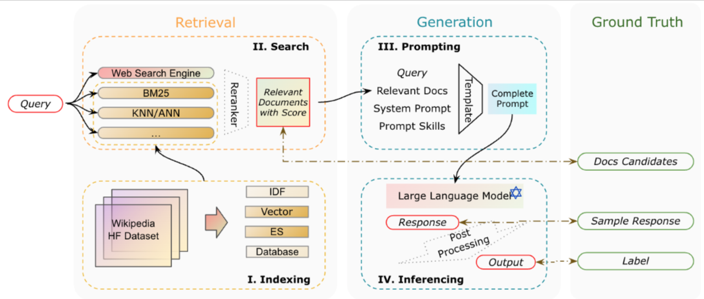

```python
import os
from openai import OpenAI
import matplotlib.pyplot as plt
import numpy as np
from typing import Dict, List, Optional, Tuple, Union

import PyPDF2
import markdown
import html2text
import json
from tqdm import tqdm
import tiktoken
import re
from bs4 import BeautifulSoup
from IPython.display import display, Code, Markdown
```

```python
api_key = 'your-openai-api-key'
```

```python
# 实例化客户端
client = OpenAI(api_key=api_key,
                base_url="https://ai.devtool.tech/proxy/v1")
```

```python
# 临时设置环境变量
os.environ["OPENAI_API_KEY"] = 'your-openai-api-key'
os.environ["OPENAI_BASE_URL"] = "https://ai.devtool.tech/proxy/v1"
```

### 1.RAG技术原理回顾

#### 1.1 RAG技术必要性介绍

  大型语言模型（LLM）在生成语言时，可能会产生幻觉或不准确的结果。这些问题包括：

* **信息误导**：模型生成的内容可能基于不准确或过时的信息。

* **知识更新滞后**：模型无法访问最新的信息，尤其是在专业领域。

* **推理能力不足**：LLM 在面对复杂推理任务时，难以提供高效且准确的结果。

为了解决这些问题，检索增强生成（Retrieval-Augmented Generation, RAG）应运而生。RAG 通过先从数据库中检索与问题相关的信息，再基于检索到的内容进行回答生成，极大地提升了模型输出的准确性和相关性。RAG 不仅提高了知识更新的效率，还显著增强了生成内容的可追溯性，使其在实际应用中更具实用性和可信度。

#### 1.2 一个RAG系统的核心组件说明

  为了实现 RAG 模型，需要以下几个核心模块：

1. **向量化模块**：用于将文档片段转换为向量表示，以便后续检索。

2. **文档加载与切分模块**：负责加载文档并将其切分为若干易于处理的文档片段。

3. **数据库模块**：用于存储文档片段及其对应的向量表示。

4. **检索模块**：根据用户输入的查询，检索与其相关的文档片段。

5. **生成模块**：调用语言模型生成基于检索信息的回答。

基本构成如下图所示：



而这些组件，也是我们接下来手动构建一个RAG系统的基础。

据此我们也可以看出一个RAG系统的基本流程：

* **索引**：将文档库分割成较短的 Chunk，并通过编码器构建向量索引。

* **检索**：根据问题和 chunks 的相似度检索相关文档片段。

* **生成**：以检索到的上下文为条件，生成问题的回答。

这些模块共同构成了一个简易 RAG 的核心架构。每个模块在模型的不同阶段发挥作用，确保查询的处理从检索到生成都有条不紊地进行。

### 2.文本向量化模块创建

***

#### OpenAI第三代Embedding模型介绍与调用方法

  正如此前所说，在自然语言处理和机器学习领域中，Embedding 是将文本转化为数值向量的常用方法。通过这种方式，模型可以衡量不同文本之间的相似性，进而应用于如搜索、分类、推荐等多个领域。OpenAI 刚刚发布了其第三代 Embedding 模型，这些模型具有更高的性能、更低的成本，且在多语言处理上表现出色。以下是关于 OpenAI 新一代 Embedding 模型的详细介绍和调用方法。

##### 1.OpenAI Embedding 模型简介

  **Embedding** 是将文本字符串表示为向量（浮点数列表），通过计算向量之间的距离来衡量文本之间的相关性。向量距离越小，表示文本之间的相关性越高；距离越大，相关性越低。常见的 Embedding 应用包括：

* **搜索**：根据文本查询的相关性对结果进行排序

* **聚类**：根据文本相似性将其分组

* **推荐**：根据相关文本字符串推荐项目

* **异常检测**：识别与其他内容相关性较低的异常点

* **多样性测量**：分析相似性分布

* **分类**：将文本字符串根据其最相似的标签进行分类

OpenAI 最新的 Embedding 模型包括 **text-embedding-3-small** 和 **text-embedding-3-large**，它们比以往的模型具有更高的性能，且支持更多语言。这两个模型分别生成长度为 1536 和 3072 的向量。此外，用户可以通过设置维度参数来减少向量的维度，而不损失其表示概念的能力。

##### 2.OpenAI Embedding模型获取方法

  要获取文本的 Embedding 向量，可以将文本字符串发送到 OpenAI 的 Embedding API 端点，并指定所使用的模型（例如 `text-embedding-3-small`）。响应结果将包含 Embedding 向量，以及一些额外的元数据信息。

  截止目前，jOpenAI 提供了两个第三代 Embedding 模型，定价基于输入的 token 数量。以下是关于模型性能与定价的概览：

| 模型                     | 每美元支持的页面数量 | 在 MTEB 测试中的表现 | 最大输入 token 数量 |
| ---------------------- | ---------- | ------------- | ------------- |
| text-embedding-3-small | 62,500     | 62.3%         | 8191          |
| text-embedding-3-large | 9,615      | 64.6%         | 8191          |
| text-embedding-ada-002 | 12,500     | 61.0%         | 8191          |

```python
# 调用 embedding API 获取文本的向量表示
response = client.embeddings.create(
    input="测试文本",  # 输入文本
    model="text-embedding-3-small"  # 选择 Embedding 模型
)
```

```python
# 打印返回的 embedding 向量
print(response.data[0].embedding)
```

```plaintext
[0.0060808719135820866, 0.01937379501760006, 0.01978626847267151, -0.04902195185422897, 0.005962129216641188, -0.05264672636985779, -0.026648342609405518, -0.012949194759130478, 0.0021545535419136286, -0.02132367342710495, 0.017861388623714447, 0.0028310739435255527, -0.01738641783595085, 0.016573969274759293, 0.02018624357879162, 0.061296187341213226, -0.007674522697925568, -0.009818139486014843, -0.021473664790391922, 0.030473103746771812, 0.024323487654328346, 0.012936695478856564, 0.010143118910491467, -0.034522853791713715, -0.012192991562187672, -0.0307230893522501, -0.03832261636853218, -0.03187301754951477, 0.0637960284948349, -0.05794639512896538, -0.03424786776304245, -0.04184739664196968, 0.018648840487003326, -0.016311485320329666, -0.004121618811041117, 0.039397548884153366, 0.04609713330864906, -0.03932255506515503, 0.010399352759122849, -0.08414476364850998, -0.022611092776060104, 0.006393352057784796, 0.023748522624373436, 0.014511597342789173, 0.023311050608754158, 0.03654772788286209, -0.025073440745472908, 0.012574218213558197, 0.023011067882180214, 0.02077370695769787, -0.025335924699902534, 0.006855823565274477, -0.014311609789729118, -0.03029811568558216, 0.018136370927095413, 0.01741141639649868, -0.03012312576174736, 0.04982190206646919, 0.012018002569675446, -0.023336049169301987, 0.040197499096393585, -0.01036185584962368, -0.02267359010875225, 0.02759828232228756, -0.01064933743327856, -0.004534092731773853, -0.03252297639846802, -0.016461476683616638, -0.009886885061860085, -0.01954878307878971, 0.05594652146100998, 0.015124059282243252, -0.06009626016020775, -0.010574341751635075, -0.007505782879889011, -0.02442348003387451, -0.04397226497530937, -0.005387164652347565, -0.02052372321486473, -0.02799825742840767, 0.011855512857437134, 0.026648342609405518, -0.004912194330245256, -0.017861388623714447, -0.008411976508796215, -0.010811827145516872, -0.051946770399808884, 0.024535974487662315, 0.010661836713552475, -0.039397548884153366, -0.007705770432949066, -0.03249797970056534, 0.006718331947922707, -0.013199178501963615, 0.05184677615761757, 0.001568652456626296, -0.036097753793001175, -0.017661402001976967, -0.025573408231139183, -0.004249735735356808, 0.05749642476439476, 0.008049499243497849, -0.006152742076665163, 0.04442223533987999, -0.03737267479300499, 0.011186803691089153, -0.02187363989651203, -0.049196939915418625, -0.06469597667455673, 0.013649150729179382, -0.05679646506905556, 0.006205863784998655, -0.03154803812503815, 0.004337230231612921, 0.022761084139347076, 0.016361482441425323, 0.0414724200963974, -0.0644959881901741, 0.013911634683609009, -0.04289733245968819, 0.01036810502409935, 0.019473789259791374, -0.0029138813260942698, -0.029598159715533257, -0.017323922365903854, -0.0332479327917099, 0.028098251670598984, -0.02386101521551609, -0.03192301467061043, 0.0096931466832757, -0.005846511106938124, -0.009818139486014843, 0.008349481038749218, -0.006437099538743496, -0.0630960762500763, 0.014274111948907375, -0.02231111191213131, 0.0634460523724556, -0.040397487580776215, 0.043522290885448456, 0.06234612315893173, -0.03202300891280174, 0.006424600258469582, 0.03322293236851692, -0.03604775667190552, -0.030748087912797928, -0.03164803236722946, -0.030998071655631065, 0.0010593091137707233, 0.03009812720119953, -0.006843324285000563, -0.0077932653948664665, -0.05304669961333275, 0.026298364624381065, 0.013911634683609009, 8.236792200477794e-05, 0.020673714578151703, -0.03232298791408539, -0.05489658564329147, 0.009886885061860085, 0.02368602715432644, -0.018036378547549248, 0.001867071376182139, 0.0072557986713945866, 0.0024951572995632887, -0.016586467623710632, 0.039422549307346344, 0.01437410619109869, -0.04807201027870178, -0.005805888678878546, -0.017173931002616882, -0.06139618158340454, -0.004777827765792608, 0.011480535380542278, -0.06704583019018173, 0.010205615311861038, -0.026948323473334312, -0.0032216745894402266, -0.008905695751309395, 0.02387351542711258, 0.02774827368557453, 0.06314606964588165, -0.00019227318989578635, 0.03602275997400284, -0.012230489403009415, -0.06359604746103287, 0.033747900277376175, 0.053696658462285995, 0.005277796648442745, 0.0049590663984417915, -0.011518033221364021, -0.026298364624381065, 0.03134804964065552, -0.008649461902678013, -4.828801320400089e-05, -0.0742453783750534, 0.06824575364589691, -0.023748522624373436, -0.020086251199245453, 0.04924693703651428, 0.007468285504728556, 0.03672271594405174, -0.03954754024744034, 0.02682333067059517, -0.028498226776719093, -0.017673900350928307, -0.024723462760448456, -0.014574093744158745, -0.010924320667982101, -0.06254611164331436, 0.09554405510425568, 0.016973944380879402, 0.021473664790391922, -0.004715331830084324, -0.0085182199254632, 0.002124867867678404, 0.0036872706841677427, 0.02304856665432453, 0.015261550433933735, 0.005118431523442268, -0.008249486796557903, 0.039422549307346344, 0.052696723490953445, 0.03212300315499306, 0.0038716341368854046, 0.057796403765678406, -0.0002628742658998817, -0.03147304058074951, 0.0037903892807662487, -0.07599527388811111, 0.034347862005233765, -0.0038091379683464766, -0.007074560038745403, -0.036072757095098495, 0.01761140488088131, 0.01606150157749653, -0.004562216345220804, 0.00040114691364578903, -0.04319731146097183, -0.006137118209153414, -0.0735454261302948, 0.0018717586062848568, 0.021811142563819885, 0.017161432653665543, 0.022823579609394073, -0.011618027463555336, -0.02602338045835495, -0.04424724727869034, 0.03194801136851311, 0.02114868350327015, 0.04054747894406319, 0.007724519353359938, -0.01191800832748413, -0.019711274653673172, 0.0024670339189469814, 0.014024127274751663, 0.005587152671068907, 0.01799887977540493, 0.012242988683283329, 0.00703706219792366, -0.032173000276088715, 0.011243050917983055, -0.03342292085289955, -0.007149555254727602, -0.015224052593111992, 0.030798085033893585, 0.05029687285423279, 0.02031123638153076, 0.0461721271276474, -0.06729581207036972, -0.007993252947926521, 0.017886387184262276, 0.046047136187553406, 0.005405913572758436, -0.03662272170186043, 0.03809763118624687, -0.03604775667190552, -0.02562340535223484, 0.01437410619109869, 0.0355977863073349, -0.040797460824251175, 0.00635585468262434, -0.01759890466928482, -0.03494782745838165, -0.03312293812632561, -0.013749144971370697, -0.010111871175467968, 0.00888694729655981, 0.039022572338581085, 0.00729329651221633, 0.006027750205248594, -0.002368602668866515, 0.029998134821653366, -0.022836079820990562, 0.00938691571354866, 0.028223244473338127, 0.02114868350327015, -0.033947888761758804, 0.010218114592134953, -0.018911324441432953, 0.0014514721697196364, 0.004377852659672499, 0.05619650334119797, 0.016586467623710632, -0.006352729629725218, 0.015736520290374756, 0.004802826326340437, -0.038247622549533844, -0.01524905115365982, -0.003646648256108165, 0.0036185248754918575, -0.004434098955243826, -0.01644897647202015, -0.01897381991147995, -0.035522788763046265, -0.06369603425264359, 0.026098376139998436, -0.004955941811203957, 0.011980504728853703, -0.04044748470187187, 0.02151116169989109, -0.04052247852087021, 0.032947950065135956, 0.02737329714000225, -0.030823081731796265, 0.026898326352238655, -0.005396539345383644, 0.007643274497240782, 0.03909756615757942, -0.0031591784209012985, -0.03437286242842674, -0.05082183703780174, 0.01397413108497858, -0.015311547555029392, 0.05149679630994797, -0.004880946595221758, -0.019423792138695717, 0.11459287256002426, -0.0008351043215952814, 0.00801825150847435, -0.061746157705783844, 0.0010858699679374695, 0.014811578206717968, 0.016098998486995697, 0.019223803654313087, -0.019061313942074776, 0.0109555684030056, -0.014511597342789173, 0.027873266488313675, 0.05254673212766647, 0.020298738032579422, 0.0654459297657013, 0.02149866335093975, 0.026648342609405518, 0.008668210357427597, -0.0570964477956295, -0.00344666070304811, 0.021773645654320717, 0.03937255218625069, -0.017661402001976967, -0.00410599447786808, 0.004943442530930042, 0.02697332203388214, 0.001544435159303248, 0.009561905637383461, 0.015586530789732933, -0.036472730338573456, -0.004065372049808502, 0.02444847859442234, -0.008030750788748264, -0.0012600778136402369, 0.060546234250068665, -0.00012606637028511614, 0.010468099266290665, -0.06839574873447418, -0.016123997047543526, -0.01817386969923973, 0.03799763694405556, -0.006824575364589691, 0.032947950065135956, -0.016861451789736748, 0.023136060684919357, -0.014461600221693516, -0.002801388269290328, 0.02269858866930008, -0.0022670463658869267, -0.011168055236339569, 0.04329730570316315, 0.008724457584321499, -6.1916316553833894e-06, 0.027523288503289223, 0.046447109431028366, 0.015599030070006847, 0.00950565841048956, 0.028223244473338127, 0.0009202552610076964, 0.023348547518253326, 0.05479659140110016, 0.0042591099627316, -0.004112244118005037, 0.03147304058074951, -0.0015452164225280285, -0.05319669097661972, 0.026273366063833237, -0.019473789259791374, 0.005071559455245733, 0.0036247745156288147, 0.011105558834969997, -0.0025857766158878803, -0.018061377108097076, 0.025523412972688675, -0.027848267927765846, 0.015024065040051937, -0.016136495396494865, 0.004140367265790701, -0.03599775955080986, 0.013324171304702759, 0.05384664982557297, -0.019223803654313087, -0.0209111999720335, -0.0324229821562767, -0.030473103746771812, -0.038047634065151215, 0.04439723864197731, -0.008461973629891872, 0.01819886825978756, 0.042372364550828934, -0.01916130818426609, 0.044172253459692, -0.03874759003520012, -0.0270233191549778, 0.007018313277512789, -0.008543218486011028, -0.0077182697132229805, -0.04357228800654411, -0.0111618060618639, -0.012192991562187672, 0.049596913158893585, 0.006143367849290371, -0.011055562645196915, 0.010849324986338615, -0.014024127274751663, -0.04539717733860016, 0.0010530594736337662, -0.018523847684264183, 0.0045403423719108105, 0.029698152095079422, 0.03592276573181152, -0.019636278972029686, -0.04212237894535065, -0.001060090260580182, -0.023311050608754158, 0.025698401033878326, -0.030973073095083237, 0.00475282920524478, -0.002692020032554865, -0.0012186742387712002, -0.013561656698584557, 0.03622274845838547, -0.05264672636985779, 0.018661338835954666, 0.007380791008472443, -0.009424413554370403, 0.01607399992644787, -0.0039528789930045605, -0.03622274845838547, 0.059396304190158844, -0.0029420044738799334, 0.04087245836853981, -0.038422610610723495, -0.027048317715525627, 0.0009069748339243233, -0.03344791755080223, -0.01896131969988346, -0.018498849123716354, -0.02639835700392723, -0.004934067837893963, -0.03987251967191696, -0.029573161154985428, -0.029423169791698456, 0.03479783609509468, -0.02642335556447506, -0.012480474077165127, 0.003026374150067568, -0.03069809079170227, 0.1966877579689026, -0.016986442729830742, 0.015474037267267704, 0.004093495197594166, -0.028048254549503326, -0.004196614027023315, 0.005646523553878069, 0.01064308825880289, -0.0135116595774889, 0.01193675771355629, -0.00928692240267992, 0.033722903579473495, -0.0587463453412056, -0.022623592987656593, -0.03384789451956749, -0.0167989544570446, -0.013449163176119328, -0.04807201027870178, 0.03684770688414574, 0.05124681070446968, -0.014049125835299492, -0.035147812217473984, -0.021036190912127495, 0.03577277436852455, 0.0036122752353549004, 0.01839885488152504, -0.0040684971027076244, -0.013099185191094875, 0.02309856377542019, -0.013086685910820961, 0.036072757095098495, -0.015199054963886738, 0.0446472242474556, -0.040172502398490906, 0.010330607183277607, 0.0020233115646988153, 0.03444785624742508, -0.019686276093125343, -0.047247059643268585, -0.009324420243501663, -0.02054872177541256, -0.0013210115721449256, -0.08264485746622086, -0.002740454627200961, -0.011155555956065655, 0.006705832667648792, -0.02481095679104328, 0.04154741391539574, -0.0033497915137559175, -0.01583651453256607, -0.05829637497663498, 0.0045403423719108105, 0.018348857760429382, 0.03287295624613762, -0.012824201956391335, 0.013911634683609009, 0.0167989544570446, 0.015011565759778023, -0.04482221230864525, -0.03109806589782238, 0.018623841926455498, 0.0073370435275137424, 0.0017670775996521115, 0.0027967009227722883, -0.010393103584647179, 0.018686337396502495, -0.040422484278678894, 0.04199738800525665, 0.0065433429554104805, -0.034122876822948456, 0.006662085652351379, 0.008430725894868374, 0.0005382477538660169, 0.023936010897159576, -0.023373546078801155, 0.033922888338565826, -0.02134867198765278, -0.020861202850937843, -0.002593588549643755, -0.04172240570187569, -0.02446097880601883, 7.274938252521679e-05, -0.012767955660820007, 0.028448229655623436, -0.016323983669281006, -0.033347927033901215, 0.049596913158893585, -0.02794826216995716, 0.029773147776722908, -0.038247622549533844, -0.025148436427116394, 0.0391225665807724, -0.03494782745838165, -0.025873390957713127, 0.010918070562183857, 0.0066683352924883366, -0.016986442729830742, -0.028298240154981613, 0.024748461320996284, -0.010111871175467968, 0.0005577778210863471, 0.06564591825008392, -0.02383601665496826, -0.033547911792993546, 0.013436663895845413, 0.03597276285290718, 0.008430725894868374, 0.01046184916049242, -0.014699085615575314, 0.008474472910165787, -0.02423599176108837, 0.024111000820994377, -0.011811764910817146, -0.028048254549503326, -0.01861134171485901, 0.011099309660494328, 0.004671584349125624, 0.01407412439584732, 0.01077432930469513, 0.04317231476306915, 0.033922888338565826, 0.011249300092458725, 0.006574591156095266, 0.010393103584647179, -0.028498226776719093, -0.0035372800193727016, 0.002404537983238697, -0.012511721812188625, 0.00026326486840844154, 0.024210993200540543, 0.002110806293785572, -0.022611092776060104, -0.0007198770763352513, 0.019223803654313087, -0.001517093158327043, 0.0016998942010104656, 0.02501094341278076, 0.04517218843102455, 0.004140367265790701, -0.038072630763053894, 0.03752266615629196, -0.003934130072593689, -0.02562340535223484, -0.035097815096378326, 0.02051122486591339, -0.02814824879169464, 0.024111000820994377, 0.0006593340076506138, -0.03384789451956749, -0.007618275936692953, -0.01758640632033348, 0.056846462190151215, 0.0047434549778699875, -0.017723897472023964, -0.0030654342845082283, 0.012636713683605194, 0.006868322845548391, 0.003527905559167266, -0.033522915095090866, 0.02799825742840767, -0.018523847684264183, 0.01524905115365982, 0.0013616340002045035, -0.008643212728202343, -0.026548348367214203, -0.008786953054368496, -0.007412038743495941, 0.0013647588202729821, -0.0026342112105339766, 0.029573161154985428, -0.043497294187545776, -0.044122256338596344, -0.018148871138691902, -0.011999253183603287, 0.0006179303163662553, 0.02503594197332859, 0.030773086473345757, -0.01125555019825697, 0.005343417637050152, -0.009174428880214691, 0.030273117125034332, -0.015936508774757385, 0.003368540434166789, -0.018061377108097076, 0.03187301754951477, -0.020448727533221245, 0.020798705518245697, 0.015186555683612823, -0.004802826326340437, 0.031198060140013695, 0.04434724152088165, 0.005849636159837246, -0.03919756039977074, 0.02368602715432644, 0.023986008018255234, -0.002285795286297798, 0.016673963516950607, -0.014261612668633461, -0.02917318604886532, 0.03214799985289574, -0.010874323546886444, 0.01876133307814598, 0.003946629352867603, 0.011518033221364021, -0.00901193916797638, -0.007743268273770809, -0.02542341873049736, -0.009174428880214691, -0.005377790424972773, 0.006099620368331671, -0.010711833834648132, -0.005762141663581133, 0.0015788080636411905, -0.0057902648113667965, 0.06169616058468819, 0.012849200516939163, -0.012399228289723396, -0.010605590417981148, -0.0017358295153826475, -0.003477908670902252, -0.029823144897818565, 0.009636900387704372, -0.0015772456536069512, 0.03577277436852455, -0.010793078690767288, -0.007287046872079372, 0.0010499346535652876, -0.03309794142842293, -0.03984752297401428, -0.016086500138044357, -0.0006206645048223436, -0.004255985375493765, 0.006762079428881407, -0.006371478550136089, 0.0016905198572203517, 0.02207362651824951, 0.042947329580783844, 0.027848267927765846, -0.03467284142971039, -0.0045403423719108105, -0.03344791755080223, -0.0072183008305728436, -0.01536154467612505, 0.004630961921066046, 0.028798207640647888, 0.006518344394862652, 0.007712020073086023, 0.006974566262215376, 0.011374292895197868, 0.009524407796561718, -0.013899135403335094, -0.04612213000655174, 0.012255487963557243, 0.0005280921468511224, 0.0014381917426362634, -0.026173371821641922, -0.017323922365903854, 0.019036315381526947, 0.001362415263429284, -0.027648279443383217, 0.016373980790376663, -0.006293358281254768, 0.03817262500524521, -0.03914756327867508, 0.004315356723964214, -0.03089807741343975, 0.009299421682953835, -0.009211926721036434, -0.021961133927106857, 0.02231111191213131, -0.052946705371141434, 0.0011999253183603287, 0.01240547839552164, 0.023786019533872604, 0.053496673703193665, -0.008174491114914417, 0.028873203322291374, -0.0012608590768650174, 0.012342981994152069, -0.02133617363870144, -0.00450596958398819, 0.0008772891596890986, 0.007243299391120672, -0.0020717461593449116, 0.010849324986338615, 0.01348666101694107, -0.02917318604886532, 0.02407350204885006, 0.01243672613054514, 0.028073253110051155, -0.02344854176044464, -0.034897830337285995, 0.018498849123716354, 0.005480909254401922, 0.009618151932954788, -0.027673278003931046, 0.025535911321640015, -0.04219737648963928, -0.005680896807461977, -0.017898887395858765, -0.023898513987660408, 0.010286860167980194, 0.041347429156303406, -0.015886511653661728, -0.02582339383661747, -0.022773582488298416, -0.026073377579450607, 0.025098439306020737, 0.014811578206717968, 0.004934067837893963, -0.002599838189780712, -0.061296187341213226, -0.06269609928131104, -0.007537031080573797, -0.01842385344207287, -0.01134929433465004, -0.04717206582427025, -0.016561469063162804, 0.02717331051826477, 0.050971828401088715, -0.026073377579450607, 0.009868135675787926, 0.04339729994535446, 0.0010030625853687525, -0.012211740016937256, -0.020623717457056046, 0.003390414174646139, 0.00034255682840012014, 0.012649212963879108, -0.03187301754951477, -0.01437410619109869, -0.019798768684267998, -0.030573097988963127, 0.0017467663856223226, -0.0031951137352734804, 0.010030626319348812, -0.03797263652086258, -0.006424600258469582, -0.024160997942090034, -0.0070433118380606174, 0.014861575327813625, -0.00900568999350071, 0.012424226850271225, -0.011280547827482224, 0.021248677745461464, -0.00012137916928622872, -0.008461973629891872, 0.008524470031261444, -0.010661836713552475, 0.020786207169294357, 0.028298240154981613, -0.0230860635638237, -0.0037435172125697136, -0.019036315381526947, -0.019623778760433197, 0.03427286818623543, 0.03522280976176262, -6.142196070868522e-05, -0.025273427367210388, -0.002368602668866515, -0.02403600513935089, -0.0007964348187670112, 0.023186057806015015, -0.03052310086786747, 0.02717331051826477, -0.009111933410167694, -0.0018405105220153928, 0.024023504927754402, -0.0012936695711687207, -0.027823269367218018, 0.02153616026043892, 0.0654459297657013, -0.029573161154985428, 0.01241172756999731, -0.02134867198765278, -0.022411106154322624, -0.01662396639585495, -0.023823518306016922, -0.013349169865250587, 0.03597276285290718, -0.03029811568558216, -0.019886262714862823, 0.00649959547445178, 0.0219111368060112, 0.0293731726706028, -0.017173931002616882, 0.006568341515958309, -0.03389789164066315, -0.004074746742844582, 0.020823704078793526, -0.008636962622404099, 0.019248802214860916, 0.015774019062519073, -0.021673651412129402, 0.026148373261094093, 0.03992251679301262, -0.03362290933728218, 0.0195612832903862, 0.01978626847267151, -0.006705832667648792, -0.023123562335968018, -0.005352791864424944, 0.03992251679301262, 0.025973385199904442, -0.012355481274425983, 0.018861327320337296, -0.03462284803390503, -0.008743206039071083, -0.01104931253939867, -0.011018064804375172, -0.012230489403009415, -0.0029826269019395113, 0.012417977675795555, 0.01678645610809326, -0.019611280411481857, 0.009980629198253155, -0.016961444169282913, 0.03777265176177025, 0.021761145442724228, -0.00351853109896183, -0.020586218684911728, -0.036297742277383804, 0.0030826206784695387, 0.017073938623070717, 0.02917318604886532, -0.0146865863353014, -0.049796901643276215, -0.0018498849822208285, 0.02267359010875225, 0.012824201956391335, -0.00879320316016674, -0.018048876896500587, 0.012555468827486038, 0.061496175825595856, 0.01250547170639038, -0.03564778342843056, -0.04987189918756485, 0.017286425456404686, -0.02914818748831749, 0.022236116230487823, -0.0054777842015028, 0.02153616026043892, 0.050746843218803406, 0.010886822827160358, 0.013636651448905468, 0.0035154062788933516, -0.019873764365911484, -0.06204614043235779, 0.009399414993822575, 0.03857260197401047, 0.01527404971420765, -0.012911696918308735, 0.00851197075098753, -0.011086810380220413, -0.00479657668620348, -0.02814824879169464, 0.02092369832098484, -0.02344854176044464, -0.001214768155477941, 0.0008733831928111613, -0.019411291927099228, 0.004777827765792608, 0.024985944852232933, 0.028273241594433784, -0.010824326425790787, -0.03239798545837402, -0.017511410638689995, 0.007012063637375832, -0.026948323473334312, -0.03154803812503815, 0.0015295923221856356, 0.007955755107104778, -0.03722268342971802, 0.02502344362437725, 0.014574093744158745, 0.02173614874482155, 0.009849387221038342, -0.010811827145516872, -0.019998755306005478, 0.01918630674481392, 0.0122179901227355, -0.035297803580760956, 0.008924445137381554, 0.016736458986997604, -0.003377914894372225, 0.014149120077490807, 0.020486226305365562, 0.0135116595774889, 0.024948447942733765, -0.03224799409508705, -0.021236179396510124, 0.04087245836853981, 0.008149493485689163, 0.010993066243827343, -0.05119681358337402, -0.0006960504688322544, 0.024123499169945717, 0.0005210613599047065, 0.03957253694534302, 0.0172114297747612, 0.003287295578047633, 0.044722218066453934, 0.006183990277349949, -0.001113993232138455, 0.036297742277383804, 0.0033185435459017754, 0.010080622509121895, -0.004837199114263058, 0.060746222734451294, 0.025923388078808784, -0.006430849898606539, -0.025173433125019073, 0.04557216539978981, 0.014861575327813625, 0.008174491114914417, -0.017723897472023964, 0.01992376148700714, 0.013236676342785358, -0.024973446503281593, -0.026273366063833237, 0.0010843075579032302, 0.02309856377542019, -0.01604900136590004, 0.0015413103392347693, -0.010986816138029099, 0.0015381855191662908, 0.02034873329102993, -0.01604900136590004, -0.01702394150197506, 0.06574591249227524, -0.006599589250981808, -0.004390351939946413, 0.013436663895845413, -0.030473103746771812, 0.004584089852869511, -0.012611715123057365, -0.03287295624613762, 0.027248304337263107, -0.00012606637028511614, 0.0015530283562839031, 0.01361165288835764, 0.0170364398509264, -0.02717331051826477, 0.023811018094420433, 0.04522218555212021, 0.017748896032571793, 0.036672718822956085, 0.016273988410830498, 0.009586903266608715, -0.030573097988963127, 0.016673963516950607, 0.00889319647103548, 0.003477908670902252, 0.016873950138688087, -0.03814762830734253, 0.01243672613054514, 0.017461413517594337, 0.00900568999350071, 0.006855823565274477, 0.002084245439618826, -0.01978626847267151, 0.02757328562438488, 0.007155804894864559, -0.0020904948469251394, 0.0283732358366251, -0.015399042516946793, 0.005602776538580656, -0.018323859199881554, 0.010811827145516872, 0.011599278077483177, -0.01184926275163889, 0.044097255915403366, 7.089402788551524e-05, 0.023748522624373436, 0.019036315381526947, -0.024723462760448456, 0.033547911792993546, -0.005240298807621002, -0.023436041548848152, 0.007887009531259537, 0.006680834572762251, -0.016298986971378326, 0.017298923805356026, 0.03192301467061043, 0.018486350774765015, 0.013474161736667156, -0.007318294607102871, -0.010711833834648132, 0.012686710804700851, -0.010543094016611576, 0.029498165473341942, -0.007899508811533451, -0.022173620760440826, 0.01419911626726389, 0.03812262788414955, -0.02128617651760578, -0.017886387184262276, -0.031373050063848495, -0.018248865380883217, 0.006193364504724741, -0.004718456417322159, 0.005352791864424944, -0.0028107627294957638, 0.0071683041751384735, -0.0028248243033885956, -0.022611092776060104, -0.0359477624297142, -0.00851197075098753, -0.027848267927765846, -0.0006362885469570756, 0.005109057296067476, 0.017561407759785652, 0.021748647093772888, 0.032922953367233276, 0.026523349806666374, -0.011699272319674492, -0.02697332203388214, 0.013499160297214985, 0.001924880314618349, -0.01799887977540493, -0.007880759425461292, -0.005055935587733984, 0.0073870406486094, 0.012742957100272179, -0.0034997821785509586, 0.0033997884020209312, 0.0011264923959970474, -0.010611839592456818, -0.007230800110846758, 0.007874510250985622, -0.0191488079726696, 0.006593340076506138, -0.035122815519571304, -0.010574341751635075, -0.02502344362437725, 0.005205926019698381, 0.013336670584976673, 0.046047136187553406, 0.012699210084974766, -0.051946770399808884, -0.0015053751412779093, -0.014149120077490807, 0.025285927578806877, 0.004509094636887312, 0.02092369832098484, -0.02894819900393486, 0.005374665837734938, -0.001142897643148899, -0.0059558795765042305, 0.0032716714777052402, -0.019873764365911484, 0.011668024584650993, 0.01123680081218481, -0.013661650009453297, -0.03539779782295227, -0.0014194429386407137, 0.0065808407962322235, 0.023523537442088127, 0.01289919763803482, -0.010986816138029099, -0.0025451541878283024, 0.005221550352871418, 0.07639525085687637, -0.020286237820982933, -0.0283732358366251, -0.009605652652680874, 0.003759141080081463, -0.0011311796260997653, 0.005005938466638327, -0.001140554086305201, -0.010943069122731686, 0.016536470502614975, 0.0073745413683354855, -0.014349107630550861, 0.024111000820994377, -0.006649586372077465, 0.02328605204820633, 0.0013585092965513468, -0.010443100705742836, -0.04384727403521538, -0.016173994168639183, -0.030048130080103874, 0.03209800273180008, -0.003734142752364278, 0.004171615466475487, -0.02506094053387642, 0.0013975693145766854, -0.000719486502930522, -0.03694770112633705, -0.0037216434720903635, 0.025073440745472908, 0.054296623915433884, 0.0031201185192912817, 0.027348298579454422, -0.0058277626521885395, -0.0004081777296960354, -0.030248118564486504, -0.028298240154981613, -0.014711584895849228, 0.0060339998453855515, -0.0037372675724327564, -0.04442223533987999, -0.026498351246118546, 0.045122191309928894, 0.003806013148277998, 0.014161619357764721, -0.005005938466638327, -0.012043001130223274, 0.00597150344401598, 0.035297803580760956, -0.002218612004071474, 0.008755705319344997, -0.0032935452181845903, 0.004030999261885881, -0.012786704115569592, -0.0003781014820560813, 0.021236179396510124, -0.04007250815629959, -0.012874199077486992, 0.00586213544011116, 0.03919756039977074, 0.015786517411470413, 0.01329917274415493, -0.013736645691096783, -0.0034435358829796314, -0.0010639963438734412, 0.019798768684267998, -0.03517281264066696, 0.002218612004071474, 0.023323548957705498, -0.00869945902377367, 0.0010015001753345132, -0.013549157418310642, 0.010993066243827343, -0.01621149107813835, 0.014861575327813625, -0.01311168447136879, -0.0096931466832757, 0.02562340535223484, -0.007868260145187378, 0.00626211054623127, -0.030948074534535408, 0.00459971372038126, -0.0070808096788823605, 0.00783076323568821, 0.010986816138029099, 0.015911510214209557, 0.0037622659001499414, -0.009930632077157497, -0.06539592891931534, 0.006077746860682964, -0.0007745611947029829, -0.0019889387767761946, -0.009186928160488605, 0.021198680624365807, 0.05559654161334038, 0.0031654280610382557, -0.0017217679414898157, 0.005493408069014549, 0.00420911330729723, 0.007324544247239828, -0.02912318892776966, -0.004440348595380783, 0.004437224008142948, 0.013774143531918526, 0.022773582488298416, 0.03302294388413429, -0.01163052674382925, -0.04649710655212402, 0.004712206777185202, -0.007493284065276384, 0.025160934776067734, 0.008499471470713615, 0.0020248740911483765, 0.0476970337331295, -0.05924631282687187, -0.0060808719135820866, 0.0010257174726575613, -0.014086623676121235, 0.004393476527184248, -0.020998694002628326, 0.03834761306643486, 0.024548472836613655, -0.004955941811203957, 0.013761644251644611, 0.00066558358957991, -0.023161059245467186, 0.0070058139972388744, 0.013236676342785358, 0.03464784473180771, 0.01447409950196743, 0.007093308959156275, -0.0009429100900888443, -0.023323548957705498, -0.009524407796561718, 0.014886573888361454, 0.01761140488088131, -0.003943504765629768, 0.007012063637375832, -0.030598096549510956, 0.020873701199889183, -0.009511908516287804, 0.02149866335093975, 0.04109744355082512, 0.010843075811862946, 0.0005034842761233449, 0.038247622549533844, -0.00832448247820139, -0.009230676107108593, 0.002252984791994095, 0.002682645572349429, -0.01796138286590576, 0.013474161736667156, 0.004318481311202049, 0.0027763897087424994, -0.009836887940764427, -0.021411167457699776, 0.031023070216178894, -0.03972252830862999, -0.03734767809510231, -0.01839885488152504, 0.005959004163742065, 0.03934755176305771, -0.014211615547537804, -0.008624463342130184, 0.023898513987660408, -0.01361165288835764, -0.020886201411485672, -0.05259672924876213, 0.030473103746771812, -0.004146616905927658, 0.00947441067546606, 0.009024438448250294, -0.021198680624365807, 0.013574155978858471, 0.020598718896508217, 0.0056215254589915276, 0.0002634601842146367, -0.014536595903337002, 0.04832199588418007, 0.009080684743821621, 0.01125555019825697, 0.038447607308626175, -0.016398979350924492, -0.013286673463881016, 0.007674522697925568, 0.0037497668527066708, 0.019511286169290543, 0.00188269536010921, -0.03672271594405174, 0.0036685217637568712, -0.0046153380535542965, 0.0007769048097543418, 0.006887071765959263, 0.006177740637212992, -0.0073370435275137424, 0.007555780000984669, 0.05019687861204147, -0.029798146337270737, -0.03739767521619797, -0.030048130080103874, -0.027273302897810936, -0.022948572412133217, -0.020611217245459557, 0.03729768097400665, 0.014049125835299492, 0.013449163176119328, -0.013624152168631554, -0.014311609789729118, -0.011436788365244865, -0.02364852838218212, 0.0121304951608181, 0.029673153534531593, -0.014349107630550861, 0.005234049633145332, -0.02188613824546337, 0.02013624645769596, -0.01977377012372017, 0.02031123638153076, 0.005365291144698858, -0.029098190367221832, 0.009793140925467014, 0.010568092577159405, -0.01026811171323061, -0.0031904266215860844, -0.024785958230495453, -0.017723897472023964, 0.00821198895573616, 0.017561407759785652, -0.031748026609420776, -0.01302418950945139, -0.01554903294891119, 0.01719892956316471, -0.0160365030169487, 0.0071683041751384735, -0.016736458986997604, 0.004518468864262104, 0.02228611335158348, -0.02834823727607727, -0.009793140925467014, 0.04637211561203003, -0.011911759153008461, -0.031598035246133804, 0.005555904470384121, -0.02012374810874462, 0.0324229821562767, -0.00833073165267706, 0.00689957058057189, 0.014611590653657913, 0.01104931253939867, -0.015736520290374756, -0.024373482912778854, 0.02227361500263214, 0.018136370927095413, 0.008493221364915371, -0.026848329231142998, -0.0032622970174998045, -0.0034185373224318027, 0.02033623494207859, -0.017898887395858765, -0.016523972153663635, -0.03419787436723709, -0.020811205729842186, -0.018298862501978874, -0.03319793567061424, -0.03849760442972183, 0.0179738812148571, -0.022186119109392166, 0.006780828349292278, 0.008674460463225842, -0.01876133307814598, 0.022198619320988655, -0.010193116031587124, -0.022186119109392166, 0.0037747651804238558, 0.005743392743170261, -0.03474783897399902, 0.006318356841802597, -0.0014577218098565936, -0.021086188033223152, 0.010993066243827343, -0.009736894629895687, -0.023348547518253326, -0.02657334692776203, -0.0066683352924883366, -0.00675582978874445, 0.00757452892139554, 0.0017967632738873363, -0.008649461902678013, 0.015486536547541618, -0.002724830526858568, -0.017548907548189163, -0.0003376743115950376, -0.0022061127237975597, -0.003656022483482957, -0.017661402001976967, 0.024323487654328346, 0.029298176988959312, -0.03857260197401047, 0.006705832667648792, -0.039397548884153366, -0.020636215806007385, -0.02839823253452778, 0.019411291927099228, -0.007943255826830864, -0.02637336030602455, 0.005421537905931473, 0.00572464382275939, 0.02036123350262642, -0.00978689081966877, 0.0002497891546227038, 0.02582339383661747, -0.018323859199881554, 0.024435980245471, 0.002526405267417431, 0.028248243033885956, -0.01644897647202015, 0.032797958701848984, 0.008368229493498802, -0.00901193916797638, 0.0009108808590099216, -0.0071683041751384735, 0.00888694729655981, 0.01076808013021946, -0.0281982459127903, -0.007137055974453688, 0.09769392013549805, -0.02579839527606964, -0.04052247852087021, 0.01602400280535221, 0.005577777978032827, 0.05184677615761757, 0.0043622287921607494, 0.029498165473341942, 0.0006038686842657626, -0.017648901790380478, 0.020598718896508217, 0.015124059282243252, -0.018323859199881554, 0.0059152571484446526, -0.03797263652086258, 0.0022108000703155994, -0.022086126729846, 0.0207362100481987, 0.012874199077486992, -0.008043250069022179, 0.025073440745472908, 0.025773396715521812, -0.009030688554048538, -0.008218239061534405, -0.004299732390791178, -0.0015702148666605353, -0.017761394381523132, -0.026298364624381065, 0.036447733640670776, -0.002882633125409484, 0.012005503289401531, 0.030023131519556046, 0.035122815519571304, -0.02311106212437153, -0.027448292821645737, 0.017573906108736992, 0.007599527481943369, 0.018648840487003326, 0.04009750485420227, -0.009311920963227749, -0.027723275125026703, 0.022248616442084312, 0.014861575327813625, 0.006180865690112114, 0.0193862933665514, -0.003927880432456732, -0.012205490842461586, -0.013311672024428844, -0.02503594197332859, -0.019098812714219093, 0.00694331806153059, 0.016311485320329666, -0.051171816885471344, -0.013436663895845413, -0.0033997884020209312, -0.019048815593123436, 0.015924008563160896, 0.004193488974124193, 0.008630713447928429, -0.011743019334971905, 0.007455786224454641, 0.019098812714219093, -0.0028341987635940313, -0.005046560894697905, -0.011080560274422169]
```

```python
len(response.data[0].embedding)
```

```plaintext
1536
```

返回的 Embedding 向量可以直接用于多种应用场景，例如存储在向量数据库中，进行文本相似度搜索等。默认情况下，`text-embedding-3-small` 生成的向量长度为 1536，`text-embedding-3-large` 的向量长度为 3072。

* 余弦相似度介绍与效果简介

* 欧氏距离与余弦相似度计算公式

  假设现有a、b两个向量：

$$\vec{a} = [a_1, a_2, a_3, ...]$$

$$\vec{b} = [b_1, b_2, b_3, ...]$$

余弦相似度计算公式为：

$$\text{Cosine Similarity} (\vec{a}, \vec{b}) = \frac{\vec{a} \cdot \vec{b}}{\|\vec{a}\| \|\vec{b}\|}$$

  其中：

$$\vec{a} \cdot \vec{b}$$ 表示向量 $$\vec{a}$$ 和向量 $$\vec{b}$$ 的点积。

$$\|\vec{a}\|$$ 和 $$\|\vec{b}\|$$ 分别是向量 $$\vec{a}$$ 和 $$\vec{b}$$ 的模（长度）。

  点积 (Dot Product) 定义为：$$\vec{a} \cdot \vec{b} = a_1b_1 + a_2b_2 + \ldots + a_nb_n$$

  向量的模 (Magnitude) 定义为：
$$\|\vec{a}\| = \sqrt{a_1^2 + a_2^2 + \ldots + a_n^2}$$
$$\|\vec{b}\| = \sqrt{b_1^2 + b_2^2 + \ldots + b_n^2}$$

例如，余弦相似度可以通过如下方式进行计算和呈现：

```python
import matplotlib.pyplot as plt
import numpy as np

# 创建两个向量
a = np.array([0, 1])
b = np.array([1, 1])

# 计算两个向量的余弦相似度
cosine_similarity = np.dot(a, b) / (np.linalg.norm(a) * np.linalg.norm(b))

# 绘制向量
plt.quiver(0, 0, a[0], a[1], angles='xy', scale_units='xy', scale=1, color='r')
plt.quiver(0, 0, b[0], b[1], angles='xy', scale_units='xy', scale=1, color='b')

# 设置图表属性
plt.xlim(-0.5, 1.5)
plt.ylim(-0.5, 1.5)
plt.grid()
plt.title(f'Cosine Similarity: {cosine_similarity:.2f}')
plt.xlabel('X axis')
plt.ylabel('Y axis')

# 添加图例
plt.legend(['Vector a', 'Vector b'])

# 显示图表
plt.show()
```

这幅图展示了二维空间中两个向量的方向。红色向量代表$$\vec{a}$$ ，蓝色向量代表 $$\vec{b}$$ 。它们之间的夹角表示了两个向量的余弦相似度。余弦相似度是通过计算两个向量的点积并除以它们各自的范数（即长度）来得到的。在这个示例中，这两个向量的余弦相似度大约为 0.71，意味着它们在方向上有一定程度的相似性。这个值越接近 1，表示两个向量的方向越相似。

* 余弦相似度计算函数

```python
def cosine_sim(vector1: List[float], vector2: List[float]) -> float:
    """
    计算两个向量之间的余弦相似度
    """
    dot_product = np.dot(vector1, vector2)
    magnitude = np.linalg.norm(vector1) * np.linalg.norm(vector2)
    if not magnitude:
        return 0
    return dot_product / magnitude
```

```python
text1 = '我喜欢吃苹果'
text2 = "苹果是我最喜欢吃的水果"
text3 = "我喜欢用苹果手机"
```

```python
vector1 = client.embeddings.create(
    input=text1,  
    model="text-embedding-3-large"  
).data[0].embedding

vector2 = client.embeddings.create(
    input=text2,  
    model="text-embedding-3-large"  
).data[0].embedding

vector3 = client.embeddings.create(
    input=text3,  
    model="text-embedding-3-large"  
).data[0].embedding
```

```python
cosine_sim(vector1, vector2)
```

```plaintext
np.float64(0.7661800739633343)
```

```python
cosine_sim(vector1, vector3)
```

```plaintext
np.float64(0.7224817543294454)
```

```python
cosine_sim(vector2, vector3)
```

```plaintext
np.float64(0.6315437708887437)
```

***

  为了实现 RAG 模型的功能，我们首先需要一个向量化（Embedding）模块。向量化是 RAG 的基础，它的作用是将文档片段转化为向量表示，便于后续的检索操作。在这个过程中，我们将实现一个向量化类，用来将文本片段映射成向量。

  为了便于扩展和未来可能使用不同的模型，我们首先编写一个 **Embedding 基类**。该基类定义了获取文本向量表示的方法，同时包含一个计算两个向量之间**余弦相似度**的功能。这样，如果我们未来使用不同的向量化模型，只需继承该基类并重写向量获取的逻辑，而不需要重复编写相似度计算部分。

```python
class BaseEmbeddings:
    """
    向量化的基类，用于将文本转换为向量表示。不同的子类可以实现不同的向量获取方法。
    """
    def __init__(self, path: str, is_api: bool) -> None:
        """
        初始化基类。
        
        参数：
        path (str) - 如果是本地模型，path 表示模型路径；如果是API模式，path可以为空
        is_api (bool) - 表示是否使用API调用，如果为True表示通过API获取Embedding
        """
        self.path = path
        self.is_api = is_api
    
    def get_embedding(self, text: str, model: str) -> List[float]:
        """
        抽象方法，用于获取文本的向量表示，具体实现需要在子类中定义。
        
        参数：
        text (str) - 需要转换为向量的文本
        model (str) - 所使用的模型名称
        
        返回：
        list[float] - 文本的向量表示
        """
        raise NotImplementedError
    
    @classmethod
    def cosine_similarity(cls, vector1: List[float], vector2: List[float]) -> float:
        """
        计算两个向量之间的余弦相似度，用于衡量它们的相似程度。
        
        参数：
        vector1 (list[float]) - 第一个向量
        vector2 (list[float]) - 第二个向量
        
        返回：
        float - 余弦相似度值，范围从 -1 到 1，越接近 1 表示向量越相似
        """
        dot_product = np.dot(vector1, vector2)  # 向量点积
        magnitude = np.linalg.norm(vector1) * np.linalg.norm(vector2)  # 向量的模
        if not magnitude:
            return 0
        return dot_product / magnitude  # 计算余弦相似度
```

我们在这个基类基础上，可以通过继承它来实现具体的模型。例如，我们可以使用 OpenAI 的 API 来生成文本的向量表示，只需重写 `get_embedding` 方法即可。

```python
class OpenAIEmbedding(BaseEmbeddings):
    """
    使用 OpenAI 的 Embedding API 来获取文本向量的类，继承自 BaseEmbeddings。
    """
    def __init__(self, path: str = '', is_api: bool = True) -> None:
        """
        初始化类，设置 OpenAI API 客户端，如果使用的是 API 调用。
        
        参数：
        path (str) - 本地模型的路径，使用API时可以为空
        is_api (bool) - 是否通过 API 获取 Embedding，默认为 True
        """
        super().__init__(path, is_api)
        if self.is_api:
            # 初始化 OpenAI API 客户端
            from openai import OpenAI
            self.client = OpenAI()
            self.client.api_key = os.getenv("OPENAI_API_KEY")  # 从环境变量中获取 API 密钥
            self.client.base_url = os.getenv("OPENAI_BASE_URL")  # 从环境变量中获取 API 基础URL
    
    def get_embedding(self, text: str, model: str = "text-embedding-3-large") -> List[float]:
        """
        使用 OpenAI 的 Embedding API 获取文本的向量表示。
        
        参数：
        text (str) - 需要转化为向量的文本
        model (str) - 使用的 Embedding 模型名称，默认为 'text-embedding-3-large'
        
        返回：
        list[float] - 文本的向量表示
        """
        if self.is_api:
            # 去掉文本中的换行符，保证输入格式规范
            text = text.replace("\n", " ")
            # 调用 OpenAI API 获取文本的向量表示
            return self.client.embeddings.create(input=[text], model=model).data[0].embedding
        else:
            raise NotImplementedError  # 如果不是 API 模式，这里未实现本地模型的处理
```

这样设计的结构让我们可以轻松替换或扩展向量化模型，而不需要改变整体框架。

* 使用示例

```python
# 初始化 Embedding 模型
embedding_model = OpenAIEmbedding()
```

```python
# 输入需要获取向量表示的文本
text = "这是一个示例文本，用于演示 OpenAI Embedding 的使用。"

# 获取文本的向量表示
embedding_vector = embedding_model.get_embedding(text, model="text-embedding-3-large")

print("文本的向量表示为：", embedding_vector)
```

```plaintext
文本的向量表示为： [0.02648121863603592, 0.013051084242761135, -0.007090849336236715, -0.010436945594847202, 0.01947532780468464, 0.013410528190433979, -0.0019606035202741623, 0.03531700372695923, 0.001083233393728733, -0.026468146592378616, -0.020873891189694405, 0.03463732823729515, -0.004346004221588373, -0.04122495651245117, 0.008103827945888042, 0.0026239410508424044, 0.03489874303340912, 0.02705632895231247, -0.017959129065275192, -0.004254509694874287, 0.010855208151042461, 0.016273008659482002, -0.020638620480895042, -0.00878350343555212, 0.04080669581890106, -0.021292153745889664, 0.014011779800057411, 0.04156479611992836, -0.007299980614334345, 0.02395857498049736, -0.0015374398790299892, -0.03299042209982872, -0.0015750181628391147, -0.03923821076750755, 0.005084498319774866, 0.014639172703027725, 0.044832468032836914, 0.06169365718960762, -0.012502115219831467, 0.003669596277177334, 0.040362291038036346, -0.01856037974357605, 0.0015660320641472936, -0.026742631569504738, -0.016482140868902206, 0.005587719846516848, 0.0010432044509798288, -0.022795284166932106, -0.01879565231502056, -0.03019329346716404, 0.036414943635463715, -0.028833942487835884, 0.015933170914649963, -0.05839984491467476, -0.02503037080168724, 0.04480632394552231, -0.0025781935546547174, 0.0033624349161982536, 0.05259645730257034, -0.00299482187256217, -0.02078239805996418, 0.018468884751200676, 0.007966585457324982, -0.03453276306390762, -0.009580816142261028, -0.005126978270709515, 0.015737110748887062, -0.007456828840076923, -0.0005126161267980933, 0.03544771298766136, -0.017344806343317032, 0.01718795672059059, 0.018416602164506912, 0.0015080309240147471, 0.03693776950240135, -0.004741393029689789, 0.033042702823877335, -0.008835786022245884, -2.0435718397493474e-05, -0.0029801172204315662, 0.029461335390806198, -0.011358429677784443, 0.006309875752776861, -0.0067052640952169895, 0.05724962428212166, 0.01844274438917637, 0.00993372406810522, -0.04373452812433243, -0.00485249375924468, 0.022638434544205666, -0.05194292217493057, 0.03387922793626785, -0.026206733658909798, -0.014952869154512882, -0.02621980383992195, -0.013502023182809353, -0.01699189655482769, -0.001519467681646347, -0.008221464231610298, 0.019697530195116997, 0.0029082284308969975, -0.021056881174445152, -0.033853087574243546, -0.0267949141561985, 0.02548784576356411, 0.023932432755827904, 0.01615537330508232, -0.0010791488457471132, -0.01599852554500103, 0.0010072600562125444, 0.0014704526402056217, -0.01707032136619091, -0.03387922793626785, 0.02384093776345253, -0.03142194077372551, 0.009038382209837437, -0.003986560273915529, -0.0062249163165688515, 0.015397273004055023, -0.03795728459954262, 0.002604335080832243, -0.05029601603746414, 0.03437591344118118, -0.015789393335580826, 0.005803386215120554, 0.021880336105823517, 0.01982823759317398, -0.004535529296845198, 0.0019965479150414467, -0.0025014032144099474, -0.013554305769503117, 0.023122049868106842, -0.006198774557560682, 0.025853825733065605, 0.06347127258777618, 0.0032072204630821943, -0.020730113610625267, 0.04224447160959244, 0.004790408071130514, 0.01364580076187849, -0.03346096724271774, -0.015188141725957394, -0.009502391330897808, -0.0028396074194461107, -0.037329889833927155, -0.02697790414094925, 0.002798761473968625, 0.016704341396689415, -0.025043442845344543, -0.004287186544388533, -0.03003644570708275, -0.0065386127680540085, -0.0023510903120040894, 0.014338547363877296, 0.01944918744266033, -0.021997971460223198, 0.033853087574243546, -0.011900863610208035, 0.0009582449565641582, 0.03035014308989048, 0.024128494784235954, -0.026624996215105057, 0.044178932905197144, -0.006130153778940439, -0.018194399774074554, -0.003290546126663685, 0.04002245143055916, -0.018743369728326797, -0.04608725383877754, 0.021605851128697395, 0.01381571963429451, 0.039970170706510544, 0.051838357001543045, 0.001940997433848679, -0.06195507198572159, 0.013802648521959782, 0.017880704253911972, 0.008848857134580612, -0.006881718523800373, 0.033199552446603775, -0.007783595938235521, 0.07052944600582123, 0.0562562495470047, 0.0158808883279562, -0.01471759658306837, 0.012698175385594368, 0.012881165370345116, 0.02689947932958603, 0.017632361501455307, -0.012704710476100445, 0.044571053236722946, -0.014207839965820312, 0.002584728877991438, -0.016808906570076942, 0.015750180929899216, -0.022743001580238342, -0.006009249947965145, -0.008567837066948414, -0.0033134198747575283, -0.0028967917896807194, 0.004159747157245874, -0.033696237951517105, -0.0021288886200636625, -0.008162645623087883, -0.0073457276448607445, 0.05147237703204155, -0.02346188947558403, -0.010678754188120365, -0.004983200691640377, -0.0018429673509672284, 0.025736188516020775, -0.022481586784124374, -0.04595654457807541, -0.06378496438264847, 0.005130245815962553, 0.01691347360610962, -0.013894143514335155, 0.03589211404323578, -0.02100459858775139, -0.01576325297355652, -0.015580262988805771, 0.04281958192586899, 0.012371407821774483, -0.04394365847110748, -0.05494917929172516, -0.014573819003999233, -0.002931102178990841, -0.008025404065847397, -0.02574925869703293, 0.0235403124243021, -0.008123434148728848, -0.011848580092191696, 0.01947532780468464, -0.0018560379976406693, 0.057772450149059296, -0.030454708263278008, 0.02961818315088749, -0.024429120123386383, -0.0013716055545955896, 0.023331182077527046, 0.005045286379754543, 0.01822054199874401, 0.005061624571681023, -0.051420096307992935, 0.016129231080412865, 0.008397918194532394, -0.0128223467618227, -0.019723670557141304, 0.010979379527270794, 0.0003841557481791824, 0.002032492309808731, 0.014691455289721489, 0.007012424990534782, 0.02177576906979084, 0.0028690164908766747, 0.024481402710080147, 0.016050808131694794, -0.017253311350941658, 0.022756071761250496, -0.002815099898725748, 0.04279343783855438, 0.04451876878738403, 0.039473485201597214, 0.002244891133159399, -0.026272086426615715, -0.022285526618361473, 0.05385124310851097, -0.04634866863489151, -0.01675662398338318, 0.020573265850543976, 0.024729745462536812, -0.0029409052804112434, 0.010874814353883266, 0.018468884751200676, 0.01056111790239811, -0.018416602164506912, -0.022180961444973946, -0.010626470670104027, 0.017789209261536598, -0.02919992245733738, 0.024050069972872734, -0.009652704931795597, 0.023474959656596184, 1.0530585541346227e-06, -0.024272272363305092, -0.026076026260852814, 0.0030748797580599785, 0.020481770858168602, -0.029173780232667923, -0.03769586980342865, -0.027736004441976547, -0.014299334958195686, 0.026847196742892265, 0.06195507198572159, -0.00177761388476938, 0.017397088930010796, 0.01825975440442562, -0.018991712480783463, -0.00035086635034531355, -0.04634866863489151, -0.018168259412050247, 0.026285158470273018, -0.011221187189221382, -0.014861374162137508, -0.008214929141104221, 0.044649478048086166, 0.01714874617755413, 0.01228644885122776, -0.043917518109083176, 0.04250588268041611, 0.0126262865960598, 0.0019311944488435984, -0.004444034770131111, -0.02066476084291935, -0.009901047684252262, -0.01513585913926363, 0.011868186295032501, -0.008914210833609104, 0.029879597947001457, -0.033434826880693436, 0.001360168680548668, -0.002017787890508771, -0.051263246685266495, 0.02112223580479622, -0.013377850875258446, -0.022978272289037704, 0.01947532780468464, 0.015619474463164806, 0.012462902814149857, 0.017292523756623268, -0.009672310203313828, -0.06279159337282181, -0.015410343185067177, 0.01088788453489542, 0.0037284144200384617, -0.05152466148138046, -0.022860636934638023, -0.025004230439662933, -0.02574925869703293, -0.027030186727643013, -0.007953515276312828, -0.03819255530834198, -0.035761408507823944, -0.032859716564416885, -0.011436853557825089, -0.007352263201028109, 0.03338254243135452, 0.026245946064591408, -0.03586597368121147, 0.015632545575499535, 0.0007744383765384555, -0.0005943079595454037, 0.037329889833927155, -0.031970907002687454, -0.009195230901241302, -0.03225846216082573, -0.01657363586127758, -0.01171133853495121, -0.033774662762880325, 0.036336518824100494, -0.050609711557626724, -0.009142947383224964, -0.010613400489091873, -0.014952869154512882, -0.00728037441149354, -0.078058160841465, 0.017044179141521454, -0.02705632895231247, 0.031029818579554558, 0.03983946517109871, -0.005783780477941036, 0.0265988539904356, -0.0242984127253294, -0.011868186295032501, 0.009214836172759533, -0.01599852554500103, -0.007463363930583, -0.003398379310965538, 0.007855485193431377, 0.021671203896403313, -0.024363765493035316, -0.019880520179867744, 0.011489136144518852, -0.005669411737471819, 0.008071151562035084, 0.015697898343205452, -0.013227538205683231, -0.009646168909966946, 0.03346096724271774, 0.020037367939949036, 0.017475511878728867, -0.007123526185750961, -0.04658393934369087, -0.045250728726387024, 0.031291231513023376, 0.04404822736978531, -0.03011487051844597, 0.003328124526888132, 0.021109163761138916, 0.012194953858852386, -0.0329119972884655, 0.004486514255404472, -0.002360893413424492, -0.023697160184383392, 0.002558587584644556, -0.023527242243289948, -0.028572527691721916, -0.04906737059354782, 0.05839984491467476, 0.04736818000674248, 0.01194007508456707, -0.011489136144518852, -0.0221940316259861, 0.023135121911764145, -0.0016379208536818624, 0.01113622821867466, -0.04007473587989807, 0.017619289457798004, -0.0018429673509672284, 0.012848488055169582, 0.011430318467319012, -0.01105780340731144, 0.008535160683095455, 0.0036467225290834904, -0.022952131927013397, -0.0036499903071671724, 0.018965572118759155, 0.030010303482413292, -0.03887223079800606, -0.06394181400537491, -0.015907030552625656, 0.016129231080412865, 0.05016530677676201, 0.02582768350839615, -0.02284756675362587, -0.016665128991007805, 0.017057251185178757, 0.02465132065117359, -0.014874445274472237, 0.016050808131694794, -0.04394365847110748, -0.016442928463220596, -0.005610593594610691, -0.013377850875258446, -0.059445496648550034, 0.00707124313339591, 0.0231481920927763, -0.0428718626499176, 0.04914579540491104, -0.04315941780805588, -0.03374852240085602, 0.0008986099273897707, -0.08391383290290833, -0.04776030033826828, -0.0042806509882211685, -0.017357876524329185, 0.02421998791396618, 0.05688364431262016, 0.002395204035565257, -0.03372238203883171, 0.01360658835619688, 0.007646353915333748, 0.012351802550256252, -0.02082160860300064, 0.04621795937418938, -0.02770986221730709, 0.004087858367711306, -0.011083945631980896, 0.015397273004055023, 0.027239318937063217, -0.047211334109306335, -0.013789578340947628, 0.04504159837961197, 0.016011595726013184, 0.01802448183298111, 0.005858936812728643, -0.0181813295930624, -0.033774662762880325, 0.009548138827085495, 0.009770341217517853, -0.0111950458958745, -0.011410712264478207, 0.001152671524323523, -0.008770433254539967, -0.0014124515000730753, 0.012841952964663506, 0.028755517676472664, -0.03178791701793671, -0.000903511478099972, 0.006051729433238506, 0.02280835434794426, 0.025043442845344543, -0.013462810777127743, -0.016103090718388557, -0.021292153745889664, -0.014835232868790627, -0.023278899490833282, -0.0027464786544442177, 0.021867264062166214, 0.05021759122610092, -0.013423598371446133, 0.015436485409736633, -0.05636081472039223, -0.003957151435315609, -0.025893036276102066, 0.012841952964663506, 0.01171133853495121, -0.001152671524323523, -0.02499116025865078, -0.01456074882298708, -0.018076764419674873, -0.027108611539006233, 0.004581276793032885, 0.006574557162821293, 0.02786671184003353, 0.005437407176941633, 0.008424059487879276, 0.012090388685464859, 0.01944918744266033, 0.019854377955198288, -0.008482878096401691, 0.021069953218102455, 0.026624996215105057, 0.030297860503196716, 0.006502668373286724, 0.022625364363193512, 0.006352355238050222, -0.00952853262424469, -0.014233981259167194, -0.015122788026928902, -0.005744568072259426, 0.001510481582954526, -0.03999631106853485, -0.017815351486206055, -0.02797127701342106, 0.007450293283909559, 0.0001536827185191214, 0.044989313930273056, 0.008607049472630024, -0.015253495424985886, 0.03505558893084526, 0.0344543382525444, -0.013789578340947628, 0.019318480044603348, -0.0027481126599013805, 0.02606295607984066, 0.017057251185178757, -0.0329119972884655, -0.019083207473158836, 0.041460227221250534, 0.008973028510808945, 0.018351249396800995, -0.0010423875646665692, 0.029592042788863182, -0.010162461549043655, -0.0077247777953743935, -0.02804969996213913, -0.004535529296845198, -0.011593702249228954, 0.0038558535743504763, 0.0012956321006640792, 0.0015472429804503918, -0.020534053444862366, -0.004097661469131708, -0.0033657026942819357, -0.041041966527700424, 0.017462441697716713, 0.0013421964831650257, -0.006061532534658909, -0.0054537453688681126, 0.011848580092191696, 0.004104196559637785, 0.00977687630802393, 0.015554120764136314, -0.018390461802482605, 0.03701619431376457, 0.010783319361507893, 0.008339100517332554, -0.011659055948257446, 0.00987490639090538, -0.0022726661991328, -0.012796205468475819, 0.0010121616069227457, 0.0031974175944924355, 0.035003308206796646, 0.029173780232667923, -0.012083852663636208, -0.0363626591861248, -0.022533869370818138, 0.012090388685464859, 0.025161078199744225, -0.0008291719132103026, 0.019357692450284958, -0.004865564405918121, -0.0189394298940897, -0.00030001316918060184, 0.03874152526259422, 0.02655964158475399, 0.013502023182809353, -0.0363626591861248, 0.003836247604340315, -0.014325476251542568, 0.02886008284986019, -0.006927465554326773, -0.03173563629388809, -0.01629915088415146, 0.031474221497774124, 0.01951454021036625, 0.009613492526113987, 0.0079404441639781, -0.0027056329417973757, -0.020612478256225586, 0.03058541566133499, -0.00012345674622338265, -0.008012332953512669, -0.007476434577256441, -0.018586521968245506, 0.03432363271713257, -0.0031353316735476255, 0.01140417717397213, -0.007116990629583597, 0.005891613662242889, 0.04692377895116806, -0.02568390592932701, 0.010495764203369617, 0.02618059143424034, -0.009541603736579418, -0.022246314212679863, 0.002646814798936248, -0.013292891904711723, 0.008156110532581806, 0.02020728774368763, -0.014952869154512882, -0.002555319806560874, 0.014090203680098057, 0.0026974636130034924, 0.02453368529677391, 0.003849318251013756, 0.011665591038763523, -0.002375597832724452, 0.027997417375445366, -0.0013266750611364841, -0.021605851128697395, 0.021723486483097076, 0.005368785932660103, 0.021645063534379005, -0.003522550920024514, 0.010502299293875694, 0.03944734111428261, -0.01710953377187252, 0.009554674848914146, 0.0019491666462272406, 0.014312406070530415, 0.016508281230926514, 0.010371592827141285, 0.02437683753669262, 0.03670249879360199, 0.02127908356487751, -0.015005151741206646, 0.012469437904655933, 0.0067379409447312355, -0.0123452665284276, -0.0006461822194978595, -0.038715384900569916, 0.013554305769503117, -0.02304362691938877, -3.563805512385443e-05, -0.03280743211507797, -0.002555319806560874, 0.025474775582551956, 0.0005738849868066609, -0.01886100508272648, -0.04430963844060898, -0.039212070405483246, 0.014613031409680843, -0.006287002004683018, -0.0008757362375035882, -0.0077574546448886395, 0.014155557379126549, 0.0005032215849496424, 0.0005979840643703938, -0.01637757383286953, -0.013384386897087097, -0.024481402710080147, 0.03134351596236229, 0.005058357026427984, -0.010672218166291714, 0.0077574546448886395, -0.03834940493106842, 0.026128308847546577, -0.025265643373131752, -0.045668989419937134, 0.02614138089120388, -0.011417247354984283, 0.01772385649383068, 0.011351894587278366, 0.009293260984122753, 0.014273193664848804, 0.011587167158722878, -0.009149483405053616, -0.06436007469892502, -0.004300257191061974, -0.016050808131694794, 0.01177015621215105, 0.024938875809311867, -0.01814211718738079, -0.005515831056982279, -0.011319217272102833, -0.03178791701793671, 0.02441604994237423, 0.003993095830082893, 0.014508466236293316, 0.017749996855854988, 0.04313327744603157, -0.026768773794174194, 0.010110178962349892, -0.005564846098423004, 0.003718611318618059, 0.0035094802733510733, 0.009195230901241302, -0.01364580076187849, 0.027004046365618706, -0.0017874168697744608, -0.02729160152375698, 0.008914210833609104, -0.021252941340208054, -0.006303340196609497, -0.015227354131639004, 0.013515093363821507, 0.0028673827182501554, 0.008776968345046043, -0.017305593937635422, 0.0045453323982656, 0.00895342230796814, -0.006084406282752752, -0.024965018033981323, -0.03761744499206543, 0.013959497213363647, -0.025396350771188736, -0.022481586784124374, 0.03259830176830292, -0.01641678623855114, -0.01925312727689743, -0.007809737231582403, 0.004375413525849581, -0.013763437047600746, -0.0181813295930624, -0.015201212838292122, -0.008580908179283142, -0.01092709694057703, 0.028415679931640625, -0.007247697561979294, 0.016560563817620277, -0.022141749039292336, -0.029409052804112434, 0.021135305985808372, 0.018050622195005417, 0.013998708687722683, -0.01875643990933895, 0.022638434544205666, -0.00629680510610342, 0.017593149095773697, -0.025840753689408302, 0.03874152526259422, 0.006463456433266401, 0.03892451524734497, 0.02261229418218136, -0.0137765072286129, -0.020455630496144295, -0.004228368401527405, 0.008175716735422611, 0.01741015911102295, 0.014822162687778473, 0.04389137774705887, -0.03356553241610527, -0.016939613968133926, 0.03168335184454918, -0.0005289544933475554, -0.02610216848552227, -0.005195599514991045, -9.685585246188566e-05, -0.028154266998171806, 0.009312866255640984, 0.014377758838236332, -0.028677094727754593, -0.03881995007395744, -0.027030186727643013, -0.011188510805368423, -0.005427604075521231, 0.01794605702161789, -0.026925621554255486, -0.021828051656484604, -0.002829804318025708, 0.018952500075101852, 0.016599776223301888, 0.007783595938235521, 0.013698083348572254, -0.004385216627269983, 0.03918593004345894, -0.027657579630613327, 0.017932986840605736, 0.004287186544388533, 0.005649806000292301, 0.039630331099033356, -0.014116344973444939, 0.023291969671845436, -0.01967138797044754, 0.01576325297355652, 0.03479417786002159, 0.00478387251496315, -0.0032872785814106464, 0.0054341391660273075, -0.006309875752776861, 0.0329119972884655, 0.011371500790119171, 0.02652043104171753, -0.026821056380867958, 0.024585967883467674, 0.014064062386751175, -0.03280743211507797, 0.015436485409736633, 0.003565030638128519, 0.0073784044943749905, 0.00926058366894722, 0.012809276580810547, 0.012384478934109211, 0.004319862928241491, 0.013541234657168388, 0.0067379409447312355, -0.015331919305026531, 0.0168350487947464, -0.044571053236722946, -0.021919546648859978, 0.05113254114985466, -0.009809552691876888, 0.03236302733421326, -0.01418169867247343, 0.021566638723015785, 0.022756071761250496, 0.02475588768720627, 0.01373729482293129, 0.007450293283909559, -0.05688364431262016, -0.014639172703027725, 0.0059602344408631325, 0.003535621566697955, -0.007705171592533588, -0.0034996771719306707, -0.009044917300343513, -0.000940272759180516, 0.02326582744717598, 0.02231166884303093, -0.00219587585888803, -0.01645599864423275, -0.012632821686565876, -0.0006837605033069849, 0.014037921093404293, -0.011900863610208035, 0.005868739914149046, 0.02032492309808731, 0.021488213911652565, -0.009038382209837437, 0.001330759609118104, -0.0019916463643312454, 0.011828974820673466, -0.032206181436777115, 0.002694196067750454, -0.019736742600798607, -0.013685012236237526, 0.0062118456698954105, 0.006731405388563871, 0.020599408075213432, -0.017292523756623268, 0.02036413550376892, -0.0070647080428898335, 0.015580262988805771, 0.009972936473786831, -0.02046870067715645, -0.00920176599174738, -0.028912367299199104, -0.0036434547509998083, 0.02090003341436386, 0.009391291067004204, 0.0030144278425723314, 0.03306884691119194, -0.004702180624008179, 0.008966493420302868, 0.012462902814149857, 0.002934369957074523, -0.01990666054189205, 0.006362158339470625, -0.002860847394913435, 0.020337993279099464, -0.009992542676627636, 0.017854562029242516, 0.00888153351843357, -0.0009419065900146961, 0.01130614709109068, 0.0032921801321208477, 0.003042203141376376, 0.01422091107815504, -0.04702834412455559, -0.012704710476100445, -0.013260215520858765, 0.01951454021036625, -0.015933170914649963, -0.014482324942946434, 0.002857579616829753, 0.018312036991119385, 0.026585783809423447, -0.013149114325642586, 0.0011306146625429392, 0.01307069044560194, 0.008940352126955986, 0.005473351571708918, 0.024965018033981323, 0.01098591461777687, 0.00838484801352024, 0.05173379182815552, 8.194710244424641e-05, 0.0013413795968517661, 0.028520245105028152, 0.04305485263466835, -0.018821794539690018, -0.011763621121644974, -0.006822900380939245, -0.018351249396800995, -0.007143131922930479, -0.02036413550376892, -0.015253495424985886, -0.03194476664066315, 0.0034539299085736275, 0.005535437259823084, 0.012900770641863346, 0.023239687085151672, -0.0012907306663691998, -0.022377021610736847, 0.006947071757167578, 0.018416602164506912, -0.014207839965820312, 0.003053640015423298, 0.01534499041736126, -0.007933909073472023, 0.014874445274472237, 0.0020422954112291336, -0.023174334317445755, 0.030637698248028755, 0.011489136144518852, 0.035003308206796646, 0.011338823474943638, -0.014639172703027725, 0.021252941340208054, -0.025919178500771523, -0.0006988734821788967, -0.02342267706990242, -0.0026533501222729683, 0.013789578340947628, 0.0010023585055023432, -0.025396350771188736, -0.008979564532637596, -0.008803109638392925, -0.0008781870128586888, -0.003832979826256633, -0.010672218166291714, 0.0004913762677460909, -0.007829342968761921, 0.00020484221749939024, -0.0038623888976871967, 0.0013626194559037685, -0.007247697561979294, -0.038793809711933136, -0.013181790709495544, -0.01859959214925766, -0.01526656560599804, 0.024442190304398537, 0.003908136393874884, 0.002047196729108691, 0.0042610447853803635, -0.022599224001169205, -0.013286356814205647, 0.014887516386806965, 0.001292364438995719, 0.016848118975758553, 0.06049115210771561, -0.005225008353590965, -0.022259384393692017, 0.024206917732954025, -0.017841491848230362, -0.01802448183298111, -0.01259361021220684, 0.01144338957965374, -0.013698083348572254, -0.00235762563534081, -0.018730299547314644, 0.019736742600798607, 0.006953607313334942, 0.0022187496069818735, -0.029095355421304703, 0.01188125740736723, -0.0026549838948994875, 0.003388576442375779, -0.020808538421988487, -0.004411357920616865, 0.03168335184454918, -0.0002479346585460007, 0.03306884691119194, 0.007809737231582403, -0.03589211404323578, -0.02689947932958603, -0.003823176957666874, 0.03968261554837227, -0.014155557379126549, 0.019423045217990875, -0.008123434148728848, 0.026494288817048073, 0.0017743462231010199, -0.007620212156325579, -0.02594531886279583, -0.0073457276448607445, 0.04187849164009094, -0.049877751618623734, -0.022285526618361473, -0.008254140615463257, -0.02729160152375698, 0.008005797863006592, 0.009057988412678242, 0.013711153529584408, 0.02181498147547245, 0.05173379182815552, -0.03960419073700905, 0.0160769484937191, -0.021422861143946648, 0.014090203680098057, -0.01741015911102295, -0.011907398700714111, 0.00017471837054472417, -0.010639541782438755, -0.051838357001543045, -0.0348203182220459, 0.028572527691721916, 0.01863880455493927, -0.0032725739292800426, -0.01921391487121582, -0.008489413186907768, -0.014482324942946434, -0.02637665346264839, 0.002166466787457466, 0.016521351411938667, 0.0058458661660552025, 0.018664944916963577, 0.017593149095773697, 0.014103274792432785, 0.023239687085151672, 0.009894512593746185, -0.010116714052855968, 0.008711614646017551, 0.013116437941789627, -0.04420507326722145, 0.022520799189805984, -0.014534607529640198, -0.009025311097502708, -0.021788841113448143, -0.000678042066283524, -0.005976573098450899, -0.010168996639549732, 0.0026876607444137335, 0.005692285485565662, 0.014416971243917942, 0.026076026260852814, -0.0036892022471874952, 0.018651874735951424, -0.012351802550256252, -0.013247144408524036, 0.00886192824691534, 0.033696237951517105, 0.005313235335052013, 0.012998801656067371, 0.02441604994237423, -0.0007384939817711711, -0.01718795672059059, -0.034611187875270844, -0.0158808883279562, -0.013750365935266018, -0.003597707487642765, -0.02318740449845791, 0.013371315784752369, 0.011083945631980896, 0.014952869154512882, 0.027814429253339767, -0.00023302590125240386, -0.028389539569616318, 0.012332196347415447, 0.017462441697716713, 0.034768033772706985, 0.0030944859609007835, -0.03150036185979843, -0.00021770868625026196, -0.0067052640952169895, 0.02483431063592434, -0.0042479741387069225, -0.016625918447971344, -0.01653442345559597, 0.011848580092191696, -0.02112223580479622, 0.012482509016990662, 0.015593333169817924, -0.008195322938263416, 0.025317925959825516, 0.028101984411478043, -0.016168443486094475, 0.002862481167539954, -0.017044179141521454, 0.029147638007998466, 0.013214468024671078, 0.009240977466106415, 0.019305409863591194, -0.016233796253800392, -0.008273746818304062, -0.011077409610152245, 0.005724962335079908, 0.004591079894453287, -0.026533501222729683, 0.005038750823587179, -0.010770248249173164, -0.00463029183447361, 0.003836247604340315, 0.0007323671015910804, 0.010175532661378384, 0.0002648856898304075, 0.008522089570760727, -0.00029245667974464595, -0.009959866292774677, 0.022716859355568886, -0.022390091791749, 0.02120065875351429, 0.0046597011387348175, -0.010979379527270794, 0.0028951577842235565, -0.009456643834710121, 0.004708716180175543, 0.03035014308989048, -0.01289423555135727, -0.016207655891776085, -0.012044641189277172, -0.02697790414094925, -0.005296897143125534, 0.008424059487879276, 0.013364780694246292, 0.017214098945260048, -0.006777152884751558, -0.011266934685409069, 0.013358245603740215, -0.006420976482331753, 0.01733173429965973, 0.0023543580900877714, -0.0018380658002570271, 0.004947256296873093, -0.009038382209837437, -0.01856037974357605, -0.02235087938606739, 0.008561301976442337, 0.018534239381551743, 0.018233612179756165, -0.007175808772444725, 0.00038742340984754264, -0.059602346271276474, -0.00872468575835228, -0.002048830734565854, -0.008888069540262222, 0.021292153745889664, 0.004738125018775463, -0.014377758838236332, -0.022180961444973946, 0.018194399774074554, -0.005349179729819298, 0.006522274576127529, -0.028755517676472664, 0.008757362142205238, 0.03730374947190285, 0.016547493636608124, 0.03249373659491539, -0.007966585457324982, 0.00767249520868063, -0.004532261751592159, 0.001167376060038805, -0.005809921771287918, -0.01917470246553421, 0.014011779800057411, -0.00590468430891633, 0.001127347000874579, -0.026821056380867958, 0.009502391330897808, -0.025879966095089912, 0.02529178559780121, 0.016469068825244904, 0.0067510115914046764, 0.021958759054541588, -0.00576744182035327, -0.01554105058312416, -0.024285342544317245, -0.026729561388492584, 0.02689947932958603, -0.00443096412345767, 0.008071151562035084, 0.009698452427983284, -0.017959129065275192, 0.031631071120500565, 0.0064046382904052734, -0.013698083348572254, -0.012913841754198074, -0.020037367939949036, 0.015240424312651157, 0.005953699350357056, 0.019122419878840446, -0.028912367299199104, 0.0001670597557676956, -0.013868002220988274, -0.02300441451370716, -0.009521997533738613, 0.026585783809423447, 0.00882271584123373, -0.0025765597820281982, -0.002617405727505684, 0.001271941582672298, -0.014900586567819118, 0.00830642320215702, -0.015985453501343727, 0.015018222853541374, 0.020834680646657944, 0.012410620227456093, -0.020599408075213432, -0.031238948926329613, 0.000643323000986129, -0.0008406087290495634, -0.019305409863591194, -0.0022236511576920748, -0.008620119653642178, 0.0006004348397254944, -0.018821794539690018, 0.03753902018070221, 0.0006858027772977948, 0.011110086925327778, -0.01963217556476593, -0.032284606248140335, 0.03210161626338959, 0.002542249159887433, -0.012129600159823895, 0.004336201585829258, -0.014260122552514076, 0.01871722750365734, 0.010979379527270794, -0.022128678858280182, -0.01056111790239811, -0.00249650189653039, 0.02093924582004547, 0.0008520456030964851, 0.006783687975257635, 0.018573449924588203, 0.0016705975867807865, 0.009593886323273182, -0.030820686370134354, -0.011685197241604328, 0.005110639613121748, 0.012273377738893032, -0.018312036991119385, 0.003924474585801363, 0.017044179141521454, 0.00397022208198905, 0.0004623756685759872, 0.010358521714806557, 0.01534499041736126, -0.0012466170592233539, -0.006764082238078117, 0.01917470246553421, -0.0026892945170402527, -0.0019213914638385177, -0.028258832171559334, 0.02977503277361393, -0.0036892022471874952, -0.018416602164506912, -0.020952316001057625, 0.009502391330897808, -0.001062810537405312, -0.030219435691833496, 0.04271501675248146, -0.02844182215631008, 0.015057435259222984, 0.013064154423773289, -0.019919732585549355, -0.0029735818970948458, -0.0007380855386145413, 0.028415679931640625, 0.001499044825322926, -0.014678385108709335, -0.00950892735272646, 0.00926058366894722, -0.015893958508968353, -0.006345820147544146, -0.04736818000674248, -0.010587259195744991, -0.004865564405918121, 0.029644325375556946, 0.014377758838236332, -0.02318740449845791, -0.014116344973444939, 0.03623195365071297, -0.043760672211647034, 0.005081230774521828, -0.040702130645513535, -0.002622307278215885, 0.0010121616069227457, -0.004417893011122942, 0.012541326694190502, -0.009999077767133713, -0.02096538618206978, 0.0009852033108472824, 0.019815165549516678, 0.004051913972944021, 0.00767249520868063, -0.014809091575443745, 0.00036761316005140543, -0.027945134788751602, 0.010116714052855968, 0.027343884110450745, -0.019527610391378403, -0.013083760626614094, 0.025161078199744225, 0.0023641609586775303, -0.0016542591620236635, 0.0036009750328958035, -0.006156295072287321, -0.021148376166820526, -0.01210999395698309, 0.005015877541154623, 0.02380172722041607, -0.011338823474943638, 0.003865656675770879, -8.158970013028011e-05, 0.015201212838292122, 0.016482140868902206, 0.008535160683095455, -0.007201950065791607, -0.00011579814599826932, -0.0017808815464377403, -0.014782950282096863, -0.010273562744259834, -0.006666052155196667, -0.0160769484937191, 0.017279451712965965, 0.014691455289721489, -0.01092709694057703, -0.03654564917087555, -0.012959589250385761, 0.00966577511280775, -0.027918994426727295, -0.002182805212214589, -0.02582768350839615, 0.015697898343205452, 0.0306115560233593, -0.004189155995845795, -0.021135305985808372, 0.005522366613149643, -0.002117451746016741, -0.01526656560599804, 0.003128796350210905, 0.007045101840049028, -0.004613953642547131, -0.007554858922958374, 0.009626563638448715, -0.01303147803992033, -0.00044236116809770465, 0.011600237339735031, -0.024023927748203278, -0.009809552691876888, -0.0032366295345127583, 0.00872468575835228, -0.0007433954742737114, -0.0036173134576529264, 0.07680337131023407, -0.029644325375556946, -0.033617813140153885, 0.01776306703686714, -0.01691347360610962, 0.0010423875646665692, -0.026167521253228188, 0.009018776006996632, -0.03662407398223877, -0.012260307557880878, -0.016861191019415855, -0.015331919305026531, 0.02215481922030449, -0.00314840255305171, 0.00814957544207573, -0.03181406110525131, -0.008012332953512669, -0.028729377314448357, -0.00021505370386876166, 0.0022726661991328, 0.027343884110450745, 0.03994403034448624, 0.0014116344973444939, -0.015645615756511688, -0.021069953218102455, -0.006185703910887241, -0.005826259963214397, 0.02181498147547245, -0.008123434148728848, -0.0031827129423618317, 0.003581369062885642, 0.0036434547509998083, -0.0012997167650610209, -0.02054712548851967, -0.012959589250385761, -0.043917518109083176, 0.010057896375656128, -0.01102512702345848, 0.018495026975870132, -0.02304362691938877, -0.012273377738893032, -0.01255439780652523, -0.012162277474999428, -0.022141749039292336, 0.003656525630503893, -0.020442558452486992, -0.005973305553197861, -0.0015162000199779868, 0.010502299293875694, -0.02193261869251728, 0.004215297754853964, -0.005728229880332947, 0.007541788276284933, 0.03053313121199608, 0.02663806639611721, -0.03296428173780441, -0.014704526402056217, -0.03965647518634796, 0.023135121911764145, -0.01061993557959795, 0.002524276962503791, 0.005855669267475605, 0.0012065881164744496, -0.012560932897031307, 0.0019622372929006815, -0.03374852240085602, 0.01786763407289982, -0.019619105383753777, 0.0030797813087701797, -0.01592010073363781, 0.022324739024043083, 0.007143131922930479, -0.008973028510808945, -0.0036892022471874952, 0.00872468575835228, 0.019488397985696793, 0.03241531178355217, -0.01637757383286953, 0.002690928289666772, -0.024233059957623482, -0.011659055948257446, -0.018847934901714325, 0.01637757383286953, 0.008652796968817711, 0.045407578349113464, -0.033042702823877335, 3.908442522515543e-05, 0.019070137292146683, -0.03223232179880142, -0.009345543570816517, 0.011933539994060993, 0.023409605026245117, 0.026154451072216034, -0.00012478424469009042, -0.011423783376812935, -0.022743001580238342, -0.03191862627863884, -0.004744660574942827, -0.027945134788751602, 0.0018642072100192308, -0.009110270999372005, -0.005391659680753946, 0.02388015016913414, 0.003522550920024514, 0.0086135845631361, -0.0028951577842235565, 0.021801911294460297, -0.022573081776499748, 0.03552613407373428, 0.005457012914121151, 0.005872007459402084, 0.0004885170492343605, 0.012064247392117977, 0.01695268414914608, -0.026703419163823128, 0.0008512287167832255, 0.013273285701870918, 0.016011595726013184, -0.0029899203218519688, 0.014926727861166, -0.012266842648386955, -0.02582768350839615, -0.0016125963302329183, 0.00797965656965971, -0.012567468918859959, 0.006407905835658312, -0.00016644706192892045, -0.02977503277361393, -0.013475881889462471, 0.008567837066948414, 0.03142194077372551, -0.0202857106924057, -4.970436202711426e-05, 0.027030186727643013, -0.020298780873417854, 0.003823176957666874, -0.011828974820673466, 0.01687426120042801, -0.031395796686410904, 0.013260215520858765, -0.015737110748887062, -0.014325476251542568, 0.03631037846207619, 0.020181145519018173, -0.01937076263129711, 0.003610778134316206, -0.0033787733409553766, 0.0073784044943749905, 0.0064732590690255165, 0.02977503277361393, 0.017004968598484993, 0.0011600237339735031, 0.04044071584939957, 0.02300441451370716, 0.01794605702161789, 0.017972199246287346, 0.023291969671845436, -0.0036499903071671724, -0.01768464408814907, -0.0026255748234689236, -0.01859959214925766, 7.801568426657468e-05, 0.0056792148388922215, -0.0010195138165727258, 0.01580246351659298, 0.0026272085960954428, -0.0007748468196950853, -0.01937076263129711, 0.007496040780097246, -0.010097107850015163, 0.007437222637236118, 0.00935861375182867, 0.0007793398690409958, 0.015057435259222984, -0.004457105416804552, 0.01307069044560194, 0.035264723002910614, -0.01629915088415146, 0.0052544171921908855, -0.0014998617116361856, -0.0036957375705242157, -0.005479886662214994, -0.018743369728326797, -0.003251334186643362, 0.02135750837624073, -0.0010268661426380277, -0.018233612179756165, 0.017802279442548752, 0.013384386897087097, 0.03766972944140434, -0.02193261869251728, 0.005136781372129917, 0.005620396696031094, 0.015292707830667496, 0.010639541782438755, -0.02078239805996418, -0.004738125018775463, 0.015005151741206646, 0.01618151366710663, -0.005970037542283535, -0.0046270242892205715, -0.004548599943518639, -0.017632361501455307, 0.0009190329001285136, 0.014691455289721489, 0.004231635946780443, -0.009319402277469635, 0.01937076263129711, -0.011253864504396915, -0.009136412292718887, -0.003187614493072033, -0.024141564965248108, 0.023945504799485207, -0.002405006904155016, -0.008959958329796791, -0.011103550903499126, 0.010894420556724072, -0.01339745707809925, -0.02139671891927719, 0.0012139403261244297, -0.023671019822359085, 0.0037088082171976566, -0.0027448448818176985, -0.007293445058166981, 0.002617405727505684, -0.0012678569182753563, 0.00987490639090538, 0.0018233612645417452, -0.018913287669420242, 0.0011445023119449615, -0.0028853549156337976, -0.011168904602527618, -0.007554858922958374, 0.012194953858852386, -0.02227245643734932, 0.002921299310401082, 0.010515370406210423, 0.015527979470789433, 0.0012694908073171973, -0.008463271893560886, 0.012155741453170776, 0.0027317742351442575, -0.021919546648859978, 0.01782842166721821, 0.029984163120388985, -0.010378127917647362, 0.006613769102841616, 0.0023674287367612123, -0.0007213387289084494, 0.022377021610736847, 0.012292983941733837, -0.0019164899131283164, -0.012031570076942444, -0.002408274682238698, -0.027317741885781288, 0.007581000216305256, -9.042262536240742e-05, 0.009423967450857162, 0.0021239870693534613, 0.020233428105711937, 0.015554120764136314, -0.025422492995858192, 0.010365056805312634, 0.0040813228115439415, 0.027657579630613327, 0.00820839311927557, 0.016168443486094475, -0.003960418980568647, -0.02425920031964779, -0.007169273681938648, 0.01618151366710663, -0.003901601070538163, 0.005068160127848387, -0.010338915511965752, -0.021919546648859978, -0.019279267638921738, 0.023135121911764145, 0.0048263524658977985, 0.011861651204526424, -0.007430687081068754, 0.007953515276312828, 0.003931010141968727, -0.01452153641730547, 0.006352355238050222, 0.01228644885122776, -0.010103643871843815, 0.008757362142205238, -0.017932986840605736, -0.013580447062849998, 0.008241070434451103, -0.011312682181596756, 0.011325753293931484, 0.009685381315648556, 0.001068528858013451, -0.007868555374443531, 0.0012343632988631725, -0.010731036774814129, 0.009620027616620064, -0.0018919823924079537, 0.01887407712638378, -0.02193261869251728, -0.009842230007052422, 3.8880196370882913e-05, -0.01886100508272648, -0.0038460504729300737, 0.02322661690413952, 0.006149759516119957, 0.005015877541154623, 0.003989828284829855, 0.015737110748887062, 0.01832510717213154, 0.003584636840969324, -0.010750642977654934, -0.010306239128112793, -0.016103090718388557, -0.01707032136619091, -0.029827315360307693, 0.0007315501570701599, 0.0025667566806077957, -0.01299226563423872, -0.008509019389748573, 0.022912919521331787, 0.0015080309240147471, 0.008959958329796791, -0.012841952964663506, 0.010110178962349892, 0.0020651689264923334, -0.027762144804000854, 0.036258094012737274, 0.01364580076187849, -0.022207101806998253, 0.006169365718960762, -0.025500915944576263, -0.002780789276584983, -0.00025263192947022617, -0.010378127917647362, 0.014338547363877296, -0.030559273436665535, -0.004316595382988453, -0.01925312727689743, 0.00592102250084281, -0.009025311097502708, 0.015044364146888256, -0.011358429677784443, 0.0044603729620575905, 0.008535160683095455, -0.00032268266659229994, -0.004721786826848984, -0.01456074882298708, -0.005872007459402084, 0.010495764203369617, -0.005613861605525017, -0.006548415869474411, 0.010763713158667088, 0.003208854468539357, -0.01901785470545292, 0.028232689946889877, -0.012306055054068565, 0.005819724872708321, -0.005094301421195269, -0.011391106061637402, -0.01592010073363781, -0.0030797813087701797, -0.011508742347359657, -0.006277198903262615, 0.0070647080428898335, -0.01210999395698309, 0.014939798973500729, -0.005404730327427387, 0.023527242243289948, 0.025174148380756378, 0.013077225536108017, -0.010436945594847202, -0.010090572759509087, 0.01356737595051527, -0.008986099623143673, -0.009789946489036083, 0.006084406282752752, 0.02246851660311222, 0.0069862836971879005, -0.020638620480895042, -0.029226062819361687, 0.0029801172204315662, -0.006796758621931076, 0.006202042568475008, 0.016978826373815536, 0.011547954753041267, 0.01695268414914608, 0.008692008443176746, 0.023736372590065002, -0.021030740812420845, -0.03774815425276756, -0.008064615540206432, 0.006597430910915136, -0.003819909179583192, 0.019945872947573662, 0.0016411885153502226, 0.005048553925007582, -0.010737571865320206, -0.014129416085779667, -0.0031418672297149897, 0.010051360353827477, -0.008326029404997826, 0.0036434547509998083, 0.02215481922030449, 0.0030601753387600183, 0.004542064853012562, -0.010515370406210423, -0.005071427673101425, -0.016063878312706947, -0.005221740808337927, 0.01867801696062088, 0.006355623248964548, 0.015371131710708141, -0.0063392845913767815, -0.002259595552459359, 0.0016199486562982202, 0.012508650310337543, 0.013868002220988274, 0.0018560379976406693, 0.011129692196846008, 0.001280927681364119, 0.01687426120042801, 0.0037676263600587845, -0.011142763309180737, -0.016821978613734245, 0.0005440674722194672, 0.006875182967633009, 0.017397088930010796, 0.03785271942615509, -0.00235762563534081, 0.01056111790239811, 0.03173563629388809, -0.0010366691276431084, 0.01276352908462286, -0.02919992245733738, 0.0028820871375501156, 0.02046870067715645, -0.000511390739120543, 0.00466950424015522, 0.012776599265635014, -0.012730851769447327, -0.014312406070530415, 0.009633098728954792, -0.0026843929663300514, -0.014678385108709335, -0.012083852663636208, -0.0013462810311466455, 0.014050992205739021, 0.022952131927013397, 0.014011779800057411, 0.023095909506082535, 0.005479886662214994, -2.2860942408442497e-05, -0.004571473691612482, -0.005927558057010174, -0.02193261869251728, -0.003460465231910348, -0.02012886293232441, 0.007005889900028706, -0.008652796968817711, 0.023200474679470062, -0.0034506621304899454, -0.010842137038707733, -0.0045453323982656, -0.021997971460223198, 0.0011681929463520646, -0.023174334317445755, -0.029252205044031143, 0.0030944859609007835, -0.00991411879658699, -0.007966585457324982, -0.0035911721643060446, 0.02789285220205784, 0.00977687630802393, -0.004221832845360041, 0.0053655183874070644, 0.021409790962934494, -0.005538704805076122, -0.0006188154802657664, 0.009005705825984478, 0.00820839311927557, 0.01679583638906479, 0.014639172703027725, 0.00807768665254116, -0.0025030372198671103, -0.023318111896514893, -0.02789285220205784, 0.006345820147544146, -0.01580246351659298, -0.0037251466419547796, 0.028964649885892868, -0.007156203035265207, 0.019161632284522057, -0.005476619116961956, -0.0073980106972157955, 0.017632361501455307, 0.020063510164618492, 0.012907306663691998, 0.020337993279099464, -0.006453653331845999, 0.006875182967633009, -0.014508466236293316, 0.017305593937635422, -0.005309967789798975, 0.004555135499686003, 0.00284124119207263, -0.0026860267389565706, 0.025710048153996468, 0.024925805628299713, 0.01530577801167965, 0.006692193448543549, 0.018612662330269814, 0.0005930825718678534, 0.0008103827713057399, 0.0005101653514429927, -0.004617221187800169, -0.0018331642495468259, -0.014613031409680843, -0.013136043213307858, -0.024481402710080147, 0.008103827945888042, -0.019396904855966568, 0.012600145302712917, -0.022716859355568886, 0.011972752399742603, 0.002516107866540551, 0.0137765072286129, -0.0011624745093286037, -0.002267764648422599, 0.015318849124014378, -0.009495856240391731, -0.0010946702677756548, -0.0054341391660273075, 0.02419384755194187, 0.009770341217517853, 0.0026125041767954826, 0.025226430967450142, -0.006842506118118763, 0.015122788026928902, 0.012273377738893032, -0.01714874617755413, -0.0031533038709312677, -0.00707124313339591, -0.024246130138635635, 0.008633190765976906, 0.003277475479990244, -0.008450200781226158, 0.014913657680153847, -0.005829527974128723, 0.015580262988805771, -0.020194215700030327, 0.02993188053369522, 0.03050699084997177, -0.018168259412050247, 0.00034964096266776323, 0.004025772679597139, -0.008352170698344707, -0.01435161754488945, -0.009698452427983284, 0.018664944916963577, 0.01530577801167965, 0.006849041674286127, -0.018625732511281967, -0.015946241095662117, -0.00788162648677826, -0.004061717074364424, -0.006420976482331753, 0.004176085349172354, -0.008129969239234924, 0.008580908179283142, -0.012534791603684425, -0.00548315467312932, -0.004842690657824278, -0.002480163471773267, -0.003083049086853862, -0.02594531886279583, 0.005345912184566259, -0.018573449924588203, 0.02346188947558403, -0.003282377030700445, 0.013136043213307858, 0.01790684461593628, 0.008175716735422611, -0.012482509016990662, -0.0022497924510389566, -0.008959958329796791, 0.03084682859480381, -0.004898241255432367, 0.012874629348516464, -0.00033697873004712164, -0.0018919823924079537, 0.003898333292454481, -0.0047936756163835526, 0.001519467681646347, 0.025997603312134743, -0.005689017940312624, -0.03803570941090584, -0.003993095830082893, 0.008227999322116375, -0.008927281014621258, -0.00499300379306078, 0.00020974372455384582, 0.004875367507338524, 0.006568021606653929, -0.015527979470789433, -0.008868463337421417, 0.0038885301910340786, 0.00018523618928156793, 0.004323130939155817, 0.001264589256606996, -0.009410897269845009, -0.004711983725428581, 0.0035094802733510733, 0.010815995745360851, 0.008868463337421417, 0.011018591932952404, -0.032206181436777115, 0.0013503656955435872, 0.02789285220205784, 0.011998893693089485, -0.023252757266163826, 0.007417616434395313, 0.0026255748234689236, 0.021841123700141907, -0.005787048023194075, -0.008607049472630024, 0.013358245603740215, -0.005888345651328564, -0.01177015621215105, 0.02155356854200363, -0.006675854790955782, 0.010548046790063381, -0.017854562029242516, 0.005211937706917524, -0.006290269549936056, 0.005522366613149643, -0.0064046382904052734, -0.023906292393803596, -0.017253311350941658, -0.0012016865657642484, -0.043342407792806625, -0.013868002220988274, 0.0011918835807591677, -0.021762698888778687, 0.015462626703083515, 0.0038591213524341583, 0.010103643871843815, -0.0022612293250858784, 0.01645599864423275, 0.015449555590748787, 0.008946887217462063, -0.003685934701934457, 0.010685289278626442, -0.034271348267793655, 0.01679583638906479, -0.03351324796676636, -0.010992450639605522, -0.01109701581299305, -0.010319310240447521, 0.027762144804000854, 0.021305223926901817, -0.00845673680305481, -0.020155003294348717, -0.0013846762012690306, -0.009672310203313828, 0.008888069540262222, -0.009698452427983284, 0.008894604630768299, 0.020455630496144295, -0.0050224126316607, 0.007803202141076326, -0.0235403124243021, -0.030324000865221024, -0.010417340323328972, 0.002770986407995224, 0.002950708381831646, 0.023291969671845436, 0.009972936473786831, -0.002481797244399786, 0.00886192824691534, -0.0044146254658699036, 0.019802095368504524, 0.011116622015833855, 0.01398563850671053, -0.007809737231582403, -0.011907398700714111, 0.006764082238078117, 0.0006318861851468682, 0.017161816358566284, 0.0026206732727587223, -0.013828789815306664, 0.015044364146888256, 0.0005971671780571342, 0.01299226563423872, -0.002463825047016144, 0.018076764419674873, 0.006133421324193478, -0.004444034770131111, -0.005640002898871899, 0.014913657680153847, 0.018390461802482605, 0.004015969578176737, 0.01526656560599804, -0.015449555590748787, -0.015331919305026531, 0.031892482191324234, 0.009071058593690395, 0.008156110532581806, -0.0042937216348946095, -0.024638250470161438, -0.031238948926329613, 0.011848580092191696, -0.0009182159556075931, 0.001851136446930468, 0.01947532780468464, 0.020416418090462685, -0.025004230439662933, -0.0023363858927041292, 0.005950431805104017, 0.022494656965136528, -0.0018429673509672284, 0.003819909179583192, 0.022324739024043083, 0.006077870726585388, 0.014430041424930096, -0.004930917639285326, 0.032859716564416885, 0.007162738125771284, 0.009221372194588184, -0.004045378416776657, -0.02499116025865078, 0.0021305223926901817, 0.013221003115177155, -0.021422861143946648, -0.006437314674258232, 0.023592595010995865, -0.01530577801167965, 0.002092944225296378, -0.0028167336713522673, 0.003282377030700445, 0.0029997234232723713, 0.015985453501343727, 0.00121312343981117, -0.0020537322852760553, 0.005198867060244083, 0.012234166264533997, 0.021684274077415466, -0.014090203680098057, -0.016325291246175766, -0.0076921009458601475, -0.03110824152827263, -0.01471759658306837, -0.022298596799373627, -0.016325291246175766, 0.017553936690092087, -0.008051545359194279, 0.005045286379754543, -0.0051531195640563965, 0.003584636840969324, 0.006881718523800373, 0.002244891133159399, -0.004604150541126728, 0.0077117071487009525, 0.004372145980596542, -0.0022301864810287952, -0.02729160152375698, 0.009247513487935066, 0.017240239307284355, 0.011652519926428795, 0.02893850766122341, 0.019619105383753777, 0.010057896375656128, -0.0028396074194461107, -0.028990790247917175, -0.00282653677277267, 0.007528717629611492, 0.008391383104026318, 0.012587074190378189, -0.003506212495267391, -0.00943050254136324, 0.015371131710708141, 0.009731128811836243, -0.008946887217462063, 0.016939613968133926, -0.008698544465005398, 0.005326305981725454, 0.009051453322172165, 0.01333863940089941, -0.004976665135473013, 0.004979933146387339, -0.005561578553169966, 0.00520540215075016, 0.014469253830611706, -0.0037512879353016615, -0.02644200623035431, -0.007665959652513266, -0.011717873625457287, -0.012802740558981895, -0.004711983725428581, 0.0022906383965164423, 0.035761408507823944, -0.03333025798201561, -0.007888161577284336, 0.0011159101268276572, 0.019200842827558517, 0.010508834384381771, 0.021984901279211044, -0.020272640511393547, 0.005734765436500311, 0.012325660325586796, 0.007188879419118166, -0.009901047684252262, -0.0058785430155694485, -0.0036303841043263674, 0.003355899592861533, -0.011887792497873306, -0.022586151957511902, 0.02598453126847744, -0.008097292855381966, 0.008391383104026318, 0.0034996771719306707, 0.011123157106339931, 0.007391475141048431, -0.010332380421459675, -0.006927465554326773, -0.0172271691262722, -0.00993372406810522, 0.010378127917647362, -0.012051176279783249, -0.014416971243917942, 0.004486514255404472, -0.002960511250421405, -0.018991712480783463, -0.009750735014677048, 0.021919546648859978, 0.010469622910022736, -0.009744198992848396, -0.0214359313249588, -0.007561394013464451, -0.004979933146387339, 0.00043214968172833323, 0.014613031409680843, -0.0233442522585392, 0.021906476467847824, 0.015475696884095669, 0.00548315467312932, -0.002063535153865814, 0.00622818386182189, 0.016364503651857376, -0.03173563629388809, -0.012306055054068565, -0.003083049086853862, -0.0011837143683806062, -0.009463179856538773, -0.013423598371446133, -0.02675570175051689, -0.00317127606831491, -0.0005179261206649244, 0.006646445952355862, 0.01008403766900301, 0.021710416302084923, 0.007456828840076923, -0.013671942055225372, 0.0005011792527511716, -0.02300441451370716, -0.0020422954112291336, 0.017671572044491768, -0.00758753577247262, -0.006051729433238506, -0.004336201585829258, -0.006241254508495331, -0.02789285220205784, -0.02893850766122341, 0.003140233224257827, -0.0008438764489255846, -0.005872007459402084, 0.01867801696062088, -0.014325476251542568, -0.006953607313334942, -0.005538704805076122, -0.0017236972926184535, -0.014103274792432785, 0.006764082238078117, 0.01572404056787491, 0.02306976728141308, -0.005345912184566259, -0.024324554949998856, -9.458380191063043e-06, 0.018338177353143692, -0.020834680646657944, 0.0021926083136349916, 0.02376251481473446, 0.010129785165190697, -0.017384016886353493, -0.0026827591937035322, 0.0036761316005140543, 0.014782950282096863, 0.01782842166721821, -0.004035575781017542, -0.0022971737198531628, 0.0034833389800041914, 0.006175901275128126, -0.009848765097558498, -0.016978826373815536, 0.007646353915333748, -0.0015758350491523743, -0.008116898126900196, 0.009450108744204044, 0.004218565300107002, -0.005394927226006985, 0.012221095152199268, 0.0027301404625177383, 0.006868647411465645, -0.005623664241284132, 0.010430410504341125, 0.012868094258010387, 0.008665867149829865, 0.008868463337421417, -0.01058072317391634, -0.01418169867247343, -0.008254140615463257, 0.009744198992848396, -0.007522182073444128, 0.002645180793479085, 0.013894143514335155, 0.0015423414297401905, -0.0026370116975158453, -0.006247790064662695, -0.0033166876528412104, 0.005430871620774269, 0.009868371300399303, -0.010685289278626442, -0.021958759054541588, 0.029905738309025764, 0.007652889005839825, -0.03142194077372551, 0.0007115356856957078, 0.008816180750727654, -0.012658962979912758, -0.011312682181596756, 0.004035575781017542, 0.016273008659482002, 0.020756255835294724, -0.006875182967633009, -0.0012988998787477612, 0.0044276961125433445, 0.019148560240864754, 0.025893036276102066, 0.007496040780097246, -0.008352170698344707, -0.009312866255640984, 0.0052870940417051315, -0.0015603136271238327, 0.0028771855868399143, -0.01625993847846985, 0.013750365935266018, 0.017004968598484993, -0.026154451072216034, -0.010502299293875694, 0.0013936622999608517, 0.007234626915305853, 0.018194399774074554, -0.013011871837079525, 0.011449924670159817, -0.018377389758825302, -0.0019132222514599562, 0.0038101060781627893, 0.013632729649543762, 0.008430595509707928, -0.0034996771719306707, 0.003187614493072033, -0.022546939551830292, 0.000896159210242331, -0.017749996855854988, 0.006015785038471222, 0.02521336078643799, -0.015867818146944046, 0.005937361158430576, 8.434679330093786e-05, -0.01394642610102892, 0.007561394013464451, -0.01249558012932539, 0.004865564405918121, 0.001882179407402873, 0.0029719481244683266, -0.011600237339735031, -0.007763989735394716, -0.011900863610208035, -0.011384570971131325, 0.023906292393803596, -0.0020520982798188925, 0.013064154423773289, 0.01105780340731144, -0.006894789170473814, -0.0035454246681183577, -0.018076764419674873, -0.004996271338313818, 0.006934001110494137, 0.023631807416677475, 0.016129231080412865, -0.023291969671845436, -0.01102512702345848, -0.0022367218043655157, 0.006953607313334942, 0.014364688657224178, -0.010025219060480595, -0.01786763407289982, 0.027997417375445366, 0.008169181644916534, -0.005104104522615671, 0.01061993557959795, 0.0019148561405017972, -0.013475881889462471, 0.01974981278181076, 0.005594255402684212, -0.03092525340616703, -0.011691732332110405, -0.007718242704868317, -0.011554489843547344, 0.003174543846398592, -0.0105219054967165, 0.009084129706025124, -2.5643570552347228e-05, 0.002106014871969819, -0.0007409447571262717, 0.007005889900028706, -0.0002591672819107771, 0.009175624698400497, 0.0009124975767917931, 0.010103643871843815, -0.001600342569872737, -0.010554581880569458, 0.0005011792527511716, -0.004538797307759523, -0.014743738807737827, -0.005541972815990448, 0.013528164476156235, 0.018847934901714325, -0.005440674722194672, 0.012123065069317818, 0.012090388685464859, 0.01806369423866272, -0.008326029404997826, -0.0011665590573102236, 0.01259361021220684, 0.0012196587631478906, 0.0019197575747966766, 0.012508650310337543, -0.006966677960008383, 0.003976757638156414, 0.0036467225290834904, -0.006231451407074928, 0.009999077767133713, 0.01584167592227459, -0.006914394907653332, 0.0012392648495733738, 0.010195137932896614, -0.01592010073363781, 0.002891890238970518, 0.022586151957511902, 0.0019638712983578444, -0.026624996215105057, -0.006862112320959568, -0.0005587720079347491, -0.02483431063592434, -0.0020406614057719707, 0.02433762513101101, 0.002318413695320487, -0.0005465182475745678, 0.021449001505970955, 0.017998339608311653, -0.02151435613632202, -0.017253311350941658, 0.011561024934053421, -0.017854562029242516, 0.0158808883279562, 0.0073980106972157955, 0.015632545575499535, 0.0009811186464503407, 0.010744106955826283, -0.004613953642547131, 0.011031662113964558, -0.003718611318618059, -0.018455814570188522, 0.01435161754488945, -0.010175532661378384, 0.02242930419743061, 0.02036413550376892, -0.0023265827912837267, -0.01360658835619688, -0.01356737595051527, -0.031212808564305305, 0.020847750827670097, 0.003685934701934457, -0.008267211727797985, 0.017004968598484993, -0.024233059957623482, -0.026128308847546577, 0.0038395151495933533, 0.01381571963429451, 0.0026762238703668118, 0.011704802513122559, -0.01599852554500103, 0.016808906570076942, 0.009816087782382965, 0.0022040451876819134, -0.010332380421459675, 0.006273931358009577, -0.006953607313334942, -0.01748858392238617, 0.017815351486206055, -0.009371684864163399, 0.017279451712965965, -0.003221925115212798, -0.019070137292146683, 0.007796666584908962, 0.012253771536052227, -0.011384570971131325, 0.009718057699501514, -0.00517599331215024, -0.013972567394375801, -0.011319217272102833, -0.009744198992848396, -0.006208577658981085, 0.0021877067629247904, 0.0021043810993433, 0.008803109638392925, 0.009044917300343513, 0.017122603952884674, -0.014508466236293316, -0.024246130138635635, -0.01309029571712017, -0.011515278369188309, 0.0027268726844340563, 0.0012956321006640792, 0.020037367939949036, -0.005238079000264406, -0.009214836172759533, -0.002017787890508771, -0.014024849981069565, 0.007574465125799179, 0.02001122571527958, 0.011083945631980896, 0.008182251825928688, 0.007424151990562677, -0.002409908454865217, -0.02893850766122341, 0.00015490810619667172, 0.008221464231610298, 0.004842690657824278, -0.0010456552263349295, 0.009502391330897808, 0.0014361420180648565, 0.025200290605425835, 0.008535160683095455, -5.968608093098737e-05, 0.007960050366818905, 0.01398563850671053, 0.011913933791220188, -0.01825975440442562, -0.009548138827085495, -0.028494104743003845, 0.0028690164908766747, -0.016782766208052635, 0.010273562744259834, -0.005708623677492142, -0.019148560240864754, 0.0009353712666779757, -0.005411265883594751, 0.0011755451560020447, -0.006816364824771881, -0.007286909501999617, -0.00499300379306078, -0.005440674722194672, 0.0022693986538797617, 0.02066476084291935, 0.0038721919991075993, -0.008326029404997826, 0.02548784576356411, 0.008495948277413845, 0.008959958329796791, -0.00838484801352024, 0.004032307770103216, 0.0023870347067713737, 0.008326029404997826, -0.007476434577256441, -0.009149483405053616, 0.009149483405053616, 0.02770986221730709, 0.007750919088721275, -0.009554674848914146, 0.0063392845913767815, -0.0034539299085736275, 0.0024442190770059824, -0.015462626703083515, -0.006051729433238506, 0.0014320574700832367, 0.0034506621304899454, 0.013711153529584408, -0.006303340196609497, -0.012770064175128937, -0.0053655183874070644, 0.016978826373815536, -0.027265459299087524, 0.005231543909758329, -0.015057435259222984, -0.012482509016990662, 0.027762144804000854, 0.017384016886353493, -0.01414248626679182, 0.000531405268702656, -0.0026272085960954428, 0.007012424990534782, -0.0023641609586775303, -0.01622072607278824, 0.010750642977654934, 0.001909954589791596, -0.00662030465900898, 0.00719541497528553, 0.006035391241312027, -0.0063262139447033405, 0.004329666029661894, -0.012142671272158623, 0.01584167592227459, 0.0026811251882463694, -0.011900863610208035, 0.0025340800639241934, -0.02820654958486557, -0.030820686370134354, -0.005715159233659506, -0.012083852663636208, 0.002950708381831646, -0.008868463337421417, 0.02689947932958603, 0.013155649416148663, -0.007306515704840422, -0.003953883890062571, -0.025840753689408302, 0.012979195453226566, -0.02878165990114212, -0.00680329417809844, 0.019318480044603348, 0.0076790302991867065, -0.012939983047544956, 0.007123526185750961, 0.005450477823615074, -0.00032574610668234527, 0.013488952070474625, 0.01364580076187849, -0.008796574547886848, -0.0029588774777948856, 0.004156479611992836, -0.0022138480562716722, -0.013698083348572254, 0.012025034986436367, -0.004532261751592159, -0.0022056789603084326, 0.014011779800057411, 0.020181145519018173, -0.01316872052848339, -0.0020390276331454515, 0.0028249030001461506, 0.0014524804428219795, 0.005349179729819298, 0.0020373938605189323, 0.011861651204526424, -0.001559496740810573, -0.007254233118146658, -0.012123065069317818, -0.00541453342884779, -0.013214468024671078, -0.02151435613632202, 0.0013552671298384666, 0.005747836083173752, -0.02514800801873207, -0.008535160683095455, -0.025174148380756378, -0.019279267638921738, 0.0005073061329312623, 0.008927281014621258, -0.0006461822194978595, 0.012044641189277172, -0.0006996903684921563, -0.005502760410308838, 0.00027285065152682364, -0.0008128335466608405, -0.02697790414094925, -0.015658685937523842, -0.020076580345630646, -0.0013299427228048444, 0.009097199887037277, 0.009829158894717693, 0.00405518151819706, 0.01641678623855114, -0.007862020283937454, -0.020847750827670097, 0.029722748324275017, 0.013175255618989468, 0.018847934901714325, 0.006084406282752752, 0.007763989735394716, 0.011319217272102833, 0.012868094258010387, -0.007326121907681227, 0.012900770641863346, -0.01210999395698309, 0.011495672166347504, 0.011338823474943638, -0.008979564532637596, -0.006156295072287321, -0.011012056842446327, -0.017593149095773697, 0.0038133738562464714, 0.03884609043598175, 0.023474959656596184, 0.0011477699736133218, 0.02675570175051689, 0.014613031409680843, -0.011619843542575836, 0.05277944728732109, -0.016599776223301888, 0.012410620227456093, -0.005571381654590368, -0.01075717806816101, 0.009829158894717693, 0.003627116559073329, 0.03042856603860855, -0.017318664118647575, -0.018011411651968956, 0.021344436332583427, 0.006515739019960165, 0.025879966095089912, 0.005924290046095848, 0.008790039457380772, 0.010247421450912952, 0.01513585913926363, 0.0352124385535717, 0.011129692196846008, -0.012979195453226566, -0.005362250376492739, -0.027317741885781288, 0.028154266998171806, -0.00758753577247262, 0.016011595726013184, 0.02854638732969761, 0.010214744135737419, 0.03395765274763107, 0.01000561285763979, -0.012332196347415447, -0.010338915511965752, 0.016390645876526833, -0.004859028849750757, -0.022873707115650177, 0.01695268414914608, -0.007241162471473217, 0.025814613327383995, 0.01760621927678585, 0.016364503651857376, -0.012005428783595562, -0.00680329417809844, 0.017959129065275192, -0.026232875883579254, -0.029330627992749214, 0.019122419878840446, 0.02578847110271454, -0.0025977997574955225, -0.026572713628411293, -0.011201580986380577, 0.006453653331845999, -0.03382694721221924, 0.0116721261292696, -0.004620488733053207, 0.014495395123958588, -0.010423875413835049, -0.01772385649383068, 0.014469253830611706, 0.010796389542520046, -0.01171133853495121, -0.01452153641730547, 0.004466908518224955, -0.01856037974357605, 0.02350110001862049, -0.0009043283644132316, 0.014011779800057411, -0.0202857106924057, -0.016939613968133926, 0.0032627710606902838, 0.0007977205677889287, -0.006156295072287321, -0.006434047129005194, -0.014469253830611706, 0.023854009807109833, 0.015331919305026531, 0.004218565300107002, -0.0006849858327768743, -0.012828881852328777, 0.010861743241548538, 0.010711430571973324, -0.018965572118759155, -0.0026598854456096888, 0.002455655951052904, 0.0014908756129443645, 0.008548230864107609, -0.0004456288297660649, 0.010502299293875694, -0.020037367939949036, 0.0121492063626647, 0.013528164476156235, -0.017632361501455307, -0.02046870067715645, -0.01439082995057106, -0.004914579447358847, 0.012711246497929096, -0.004911311902105808, -0.016142303124070168, 0.014730667695403099, -0.016429858282208443, -0.0007262402214109898, 0.0008708347450010478, 0.014286263845860958, -0.008410989306867123, 0.006979748606681824, 0.031970907002687454, -0.025095725432038307, -0.0025340800639241934, -0.010815995745360851, 3.229379581171088e-05, -0.01513585913926363, -0.013279820792376995, 0.019527610391378403, -0.03693776950240135, 0.002936003729701042, -0.010463087819516659, -0.008705079555511475, -0.006270663347095251, -0.0024621912743896246, -0.012469437904655933, -0.00824760552495718, 0.0011224455665796995, -0.0016763160238042474, -9.409875929122791e-05, -0.03887223079800606, -0.004979933146387339, -0.019893590360879898, 0.01832510717213154, -0.0009312866604886949, -0.009352078661322594, -0.019083207473158836, -0.004319862928241491, -0.006087673828005791, 0.005113907624036074, -0.029226062819361687, 0.0041466765105724335, 0.01710953377187252, 0.002904960885643959, -0.0019622372929006815, 0.0019671388436108828, 0.0060255881398916245, -0.010221279226243496, -0.01572404056787491, 0.007005889900028706, 0.0026696885470300913, 0.005770709831267595, 0.008156110532581806, 0.016586706042289734, 0.005195599514991045, -0.020913103595376015, -0.012998801656067371, 0.030951393768191338, 0.00719541497528553, -0.011449924670159817, -0.004290454089641571, 0.0016926543321460485, 0.006783687975257635, 0.020717043429613113, 0.018586521968245506, -0.0027170695830136538, -0.02602374367415905, -0.01676969602704048, 0.001557862851768732, -0.0095677450299263, 0.021344436332583427, -0.0070973848924040794, 0.014743738807737827, -0.004695645533502102, -0.0002712168206926435, 0.0035323540214449167, -0.005509295966476202, -0.003538889344781637, 0.03793114423751831, 0.022259384393692017, 0.005234811455011368, 0.017854562029242516, -0.009169088676571846, -0.0073326569981873035, -0.015671757981181145, -0.0002812240563798696, 0.014090203680098057, -0.004395019728690386, -0.007267303764820099, -0.010646076872944832, -0.013155649416148663, 0.009515462443232536, -0.014652243815362453, -0.0006049278890714049, -0.009718057699501514, -0.00019360959413461387, -0.003636919427663088, -0.026154451072216034, 0.02306976728141308, -0.007718242704868317, 0.0013487318065017462, -0.00317127606831491, 0.018338177353143692, 0.0032072204630821943, 0.022037183865904808, 0.0086135845631361, 0.0017335002776235342, 0.01829896681010723, -0.010221279226243496, -0.00282653677277267, -0.024272272363305092, 0.00868547335267067, 0.035839833319187164, 0.02919992245733738, -0.004764266312122345, 0.00960695743560791, 0.006234718952327967, -0.005087766330689192, 0.0026206732727587223, 0.010234350338578224, -0.01665205880999565, -0.005702088586986065, 0.006979748606681824, -0.005251149646937847, -0.011659055948257446, -0.005339377094060183, -0.021148376166820526, -0.00161668099462986, 0.00758753577247262, -0.008201858028769493, 0.0010619935346767306, 0.003993095830082893, 0.0037839647848159075, 0.003522550920024514, 0.03108210116624832, -0.00868547335267067, -0.016665128991007805, 0.011299612000584602, 0.015567191876471043, -0.007162738125771284, -0.005316503345966339, 0.02415463514626026, -0.0015921734739094973, -0.008025404065847397, -0.0063588907942175865, -0.0001347914949292317, 0.013685012236237526, -0.00026549838366918266, -0.0019475328736007214, -0.003251334186643362, 0.007829342968761921, 0.003143501002341509, -0.006476527079939842, -0.016861191019415855, 0.0008708347450010478, 0.001062810537405312, 0.0050060744397342205, -0.017357876524329185, 0.02713475190103054, -0.01974981278181076, 0.0009100468014366925, -0.013724224641919136, 0.0008316226303577423, -0.011737479828298092, 0.007920837961137295, 0.0007466631941497326, 0.016390645876526833, -0.018534239381551743, -0.011737479828298092, 0.0172271691262722, -0.006090941373258829, 0.00929979607462883, 0.011508742347359657, -0.010711430571973324, -0.001924659125506878, 0.0002900059334933758, 0.002798761473968625, -0.0107179656624794, -0.007476434577256441, -0.004042110871523619, -0.0027285064570605755, -0.0020373938605189323, -0.0021419592667371035, 0.00888153351843357, -0.02893850766122341, -0.00026549838366918266, 0.0005681665497832, -0.013332104310393333, 0.002305343048647046, 0.004881902597844601, 0.018926359713077545, 0.0012833783403038979, 0.016848118975758553, -0.010678754188120365, 0.017959129065275192, 0.0027954939287155867, 0.01025395654141903, 0.005306700244545937, -0.0027954939287155867, 0.014325476251542568, -0.006920930463820696, -0.011201580986380577, 0.021919546648859978, -0.023017484694719315, 0.01676969602704048, 0.009927188977599144, -0.01035198662430048, 0.01146299485117197, -0.004904776345938444, 0.004071520175784826, -0.0007756637642160058, -0.02572311833500862, 0.00912987720221281, -0.005372053477913141, -0.01633836328983307, -0.009816087782382965, -0.0022693986538797617, 0.008999169804155827, -0.004842690657824278, 0.01082906685769558, 0.008659332059323788, 0.008711614646017551, 0.00935861375182867, -0.0066529810428619385, 0.011796297505497932, -0.011018591932952404, 0.0015317214420065284, 0.012783135287463665, 0.0004058040794916451, 0.02540942095220089, -0.01268510427325964, 0.015789393335580826, -0.0039342776872217655, 0.017854562029242516, -0.013234073296189308, 0.01848195493221283, 0.0021239870693534613, 0.00991411879658699, 0.0001112029785872437, 0.019658317789435387, 0.015410343185067177, -0.026847196742892265, 0.014037921093404293, -0.012691640295088291, -0.0030160618480294943, 0.010698359459638596, 0.008214929141104221, 0.004032307770103216, -0.013671942055225372, -0.0128223467618227, 0.00565307354554534, 0.0041466765105724335, 0.010155926458537579, -0.003298715455457568, 0.01665205880999565, -0.0004877001338172704, 0.0005910402396693826, 0.0037382172886282206, -0.010345451533794403, 0.006231451407074928, -0.025631623342633247, 0.005479886662214994, -0.02157970890402794, -0.010992450639605522, 0.009254048578441143, -0.0024311484303325415, -0.02618059143424034, -0.020651690661907196, 0.014443112537264824, -0.01459996122866869, 0.005868739914149046, -0.011815903708338737, -0.03466346859931946, 0.010920561850070953, -0.028520245105028152, -0.006090941373258829, -0.028677094727754593, 0.0077574546448886395, -0.011554489843547344, -0.01320139691233635, -0.014848303981125355, -0.008796574547886848]
```

```python
vector1 = embedding_model.get_embedding(text1)
vector2 = embedding_model.get_embedding(text2)
```

```python
similarity = BaseEmbeddings.cosine_similarity(vector1, vector2)
```

```python
print(f"两段文本的余弦相似度为: {similarity}")
```

```plaintext
两段文本的余弦相似度为: 0.7661800739633343
```

### 3. 文档加载与切分模块创建

  在实现了向量化之后，我们接下来需要编写一个**文档加载与切分模块**，用于处理不同格式的文档并将其切分为小片段。为什么要进行切分呢？这是为了确保每个文档片段都尽量保持简短且信息集中，以便于后续的向量化和检索。

#### 3.1 文档格式处理函数

  我们的目标是支持多种格式的文档，例如 PDF、Markdown、TXT 等。每种文件格式都有不同的读取方式，下面我们展示一个支持多种格式的简单实现：

```python
def read_file_content(cls, file_path: str):
    # 根据文件扩展名选择读取方法
    if file_path.endswith('.pdf'):
        return cls.read_pdf(file_path)
    elif file_path.endswith('.md'):
        return cls.read_markdown(file_path)
    elif file_path.endswith('.txt'):
        return cls.read_text(file_path)
    else:
        raise ValueError("Unsupported file type")
```

#### 3.2 文档切分函数

  这里我们考虑将文档按**Token**长度进行切分，设置一个最大的 Token 长度，然后按这个长度进行切分。在这个过程中，我们也会确保每个片段之间有一定的重叠，避免重要信息被切掉。


```python
def get_chunk(cls, text: str, max_token_len: int = 600, cover_content: int = 150):
    chunk_text = []
    curr_len = 0
    curr_chunk = ''
    lines = text.split('\n')  # 以换行符为单位切分文本

    for line in lines:
        line = line.replace(' ', '')
        line_len = len(enc.encode(line))  # 计算当前行的 Token 长度
        if line_len > max_token_len:
            print('warning line_len = ', line_len)
        if curr_len + line_len <= max_token_len:
            curr_chunk += line + '\n'
            curr_len += line_len + 1
        else:
            chunk_text.append(curr_chunk)
            curr_chunk = curr_chunk[-cover_content:] + line
            curr_len = line_len + cover_content

    if curr_chunk:
        chunk_text.append(curr_chunk)

    return chunk_text
```

完整类编写如下：

```python
enc = tiktoken.get_encoding("cl100k_base")
```

```python
len(enc.encode("你好，好久不见！"))
```

```plaintext
9
```

```python
class ReadFiles:
    """
    读取文件的类，用于从指定路径读取支持的文件类型（如 .txt、.md、.pdf）并进行内容分割。
    """

    def __init__(self, path: str) -> None:
        """
        初始化函数，设定要读取的文件路径，并获取该路径下所有符合要求的文件。
        :param path: 文件夹路径
        """
        self._path = path
        self.file_list = self.get_files()  # 获取文件列表

    def get_files(self):
        """
        遍历指定文件夹，获取支持的文件类型列表（txt, md, pdf）。
        :return: 文件路径列表
        """
        file_list = []
        for filepath, dirnames, filenames in os.walk(self._path):
            # os.walk 函数将递归遍历指定文件夹
            for filename in filenames:
                # 根据文件后缀筛选支持的文件类型
                if filename.endswith(".md"):
                    file_list.append(os.path.join(filepath, filename))
                elif filename.endswith(".txt"):
                    file_list.append(os.path.join(filepath, filename))
                elif filename.endswith(".pdf"):
                    file_list.append(os.path.join(filepath, filename))
        return file_list

    def get_content(self, max_token_len: int = 600, cover_content: int = 150):
        """
        读取文件内容并进行分割，将长文本切分为多个块。
        :param max_token_len: 每个文档片段的最大 Token 长度
        :param cover_content: 在每个片段之间重叠的 Token 长度
        :return: 切分后的文档片段列表
        """
        docs = []
        for file in self.file_list:
            content = self.read_file_content(file)  # 读取文件内容
            # 分割文档为多个小块
            chunk_content = self.get_chunk(content, max_token_len=max_token_len, cover_content=cover_content)
            docs.extend(chunk_content)
        return docs

    @classmethod
    def get_chunk(cls, text: str, max_token_len: int = 600, cover_content: int = 150):
        """
        将文档内容按最大 Token 长度进行切分。
        :param text: 文档内容
        :param max_token_len: 每个片段的最大 Token 长度
        :param cover_content: 重叠的内容长度
        :return: 切分后的文档片段列表
        """
        chunk_text = []
        curr_len = 0
        curr_chunk = ''
        token_len = max_token_len - cover_content
        lines = text.splitlines()  # 以换行符分割文本为行

        for line in lines:
            line = line.replace(' ', '')  # 去除空格
            line_len = len(enc.encode(line))  # 计算当前行的 Token 长度
            if line_len > max_token_len:
                # 如果单行长度超过限制，将其分割为多个片段
                num_chunks = (line_len + token_len - 1) // token_len
                for i in range(num_chunks):
                    start = i * token_len
                    end = start + token_len
                    # 防止跨单词分割
                    while not line[start:end].rstrip().isspace():
                        start += 1
                        end += 1
                        if start >= line_len:
                            break
                    curr_chunk = curr_chunk[-cover_content:] + line[start:end]
                    chunk_text.append(curr_chunk)
                start = (num_chunks - 1) * token_len
                curr_chunk = curr_chunk[-cover_content:] + line[start:end]
                chunk_text.append(curr_chunk)
            elif curr_len + line_len <= token_len:
                # 当前片段长度未超过限制时，继续累加
                curr_chunk += line + '\n'
                curr_len += line_len + 1
            else:
                chunk_text.append(curr_chunk)  # 保存当前片段
                curr_chunk = curr_chunk[-cover_content:] + line
                curr_len = line_len + cover_content

        if curr_chunk:
            chunk_text.append(curr_chunk)

        return chunk_text

    @classmethod
    def read_file_content(cls, file_path: str):
        """
        读取文件内容，根据文件类型选择不同的读取方式。
        :param file_path: 文件路径
        :return: 文件内容
        """
        if file_path.endswith('.pdf'):
            return cls.read_pdf(file_path)
        elif file_path.endswith('.md'):
            return cls.read_markdown(file_path)
        elif file_path.endswith('.txt'):
            return cls.read_text(file_path)
        else:
            raise ValueError("Unsupported file type")

    @classmethod
    def read_pdf(cls, file_path: str):
        """
        读取 PDF 文件内容。
        :param file_path: PDF 文件路径
        :return: PDF 文件中的文本内容
        """
        with open(file_path, 'rb') as file:
            reader = PyPDF2.PdfReader(file)
            text = ""
            for page_num in range(len(reader.pages)):
                text += reader.pages[page_num].extract_text()
            return text

    @classmethod
    def read_markdown(cls, file_path: str):
        """
        读取 Markdown 文件内容，并将其转换为纯文本。
        :param file_path: Markdown 文件路径
        :return: 纯文本内容
        """
        with open(file_path, 'r', encoding='utf-8') as file:
            md_text = file.read()
            html_text = markdown.markdown(md_text)
            # 使用 BeautifulSoup 从 HTML 中提取纯文本
            soup = BeautifulSoup(html_text, 'html.parser')
            plain_text = soup.get_text()
            # 使用正则表达式移除网址链接
            text = re.sub(r'http\S+', '', plain_text) 
            return text

    @classmethod
    def read_text(cls, file_path: str):
        """
        读取普通文本文件内容。
        :param file_path: 文本文件路径
        :return: 文件内容
        """
        with open(file_path, 'r', encoding='utf-8') as file:
            return file.read()
```

```python
class Documents:
    """
    文档类，用于读取已分好类的 JSON 格式文档。
    """
    def __init__(self, path: str = '') -> None:
        self.path = path

    def get_content(self):
        """
        读取 JSON 格式的文档内容。
        :return: JSON 文档的内容
        """
        with open(self.path, mode='r', encoding='utf-8') as f:
            content = json.load(f)
        return content
```

```python
# 初始化 ReadFiles 类，指定文件目录路径
file_reader = ReadFiles(path="./data")

# 获取目录下所有支持的文件类型
file_list = file_reader.get_files()
print("支持的文件列表：", file_list)
```

```plaintext
支持的文件列表： ['./data/虚拟环境配置方法.md']
```

```python
# 将文件内容读取并分块
document_chunks = file_reader.get_content(max_token_len=600, cover_content=150)
print("分块后的文档内容：", document_chunks)
```

```plaintext
分块后的文档内容： ["在Windows上使用Anaconda和JupyterLab配置Python虚拟环境\n在本教程中，我们将介绍如何在Windows操作系统上，使用Anaconda创建一个Python虚拟环境，并在该环境中安装特定版本的Python和OpenAI库。我们还将展示如何将该环境配置为JupyterLab的一个Kernel，以便在不同项目间切换不同的开发环境。\n准备工作\n确保你的Windows系统中已经安装了Anaconda。此外，你还需要安装JupyterLab，如果尚未安装，可以通过AnacondaNavigator或使用conda命令行工具进行安装。\n创建虚拟环境\n\n\n打开AnacondaPrompt\n从开始菜单中找到并启动AnacondaPrompt。\n\n\n创建新的虚拟环境\n使用以下命令创建一个名为openenv的新虚拟环境，其中安装了Python3.8：\n\n\nbash\ncondacreate-nopenenvpython=3.8\n\n激活虚拟环境\n创建虚拟环境后，使用以下命令激活它：\n\nbash\ncondaactivateopenenv\n安装所需库\n在虚拟环境中，安装特定版本的OpenAI库。\n\n安装OpenAI0.28.1\n在激活的虚拟环境中，使用以下命令安装OpenAI0.28，以及其他需要安装的库。这里需要注意的是，目前安装OpenAI0.28版本的库需要提前设置代理，代理设置方法如下：\n\nbash\n#以下'YOUR_PROXY_PORT'需要自己代理的端口号\nsetHTTP_PROXY=\nsetHTTPS_PROXY=\n", '虚拟环境中，使用以下命令安装OpenAI0.28，以及其他需要安装的库。这里需要注意的是，目前安装OpenAI0.28版本的库需要提前设置代理，代理设置方法如下：\n\nbash\n#以下\'YOUR_PROXY_PORT\'需要自己代理的端口号\nsetHTTP_PROXY=\nsetHTTPS_PROXY=\n然后再执行以下安装过程：bash\npipinstallopenai==0.28.1\npipinstallmatplotlib,seaborn,tiktoken,pymysql,google-api-python-client,google_auth_oauthlib,bs4,pydrive,cryptography\n配置JupyterKernel\n为了在JupyterLab中使用新的虚拟环境，你需要将其添加为一个新的Kernel。\n\n\n安装IPythonKernel\n在虚拟环境中安装IPythonkernel：\nbash\npipinstallipykernel\n\n\n添加环境到Jupyter的Kernel列表\n将这个虚拟环境添加到Jupyter的Kernel列表中：\n\n\nbash\npython-mipykernelinstall--user--nameopenenv--display-name"openenv"\n使用JupyterLab\n\n启动JupyterLab\n你可以在任何地方启动JupyterLab：\n\nbash\njupyterlab\n\n在JupyterLab中选择虚拟环境的Kernel\n打开一个新的notebook，然后在右上角的Kernel选项中选择“Python(myenv)”Kernel。现在，你的notebook将在你的虚拟环境中运行。\n\n结束工作\n完成工作后，记得退出虚拟环境：\n', 'b：\n\nbash\njupyterlab\n\n在JupyterLab中选择虚拟环境的Kernel\n打开一个新的notebook，然后在右上角的Kernel选项中选择“Python(myenv)”Kernel。现在，你的notebook将在你的虚拟环境中运行。\n\n结束工作\n完成工作后，记得退出虚拟环境：\nbashcondadeactivate\n']
```

```python
document_chunks[0]
```

```plaintext
"在Windows上使用Anaconda和JupyterLab配置Python虚拟环境\n在本教程中，我们将介绍如何在Windows操作系统上，使用Anaconda创建一个Python虚拟环境，并在该环境中安装特定版本的Python和OpenAI库。我们还将展示如何将该环境配置为JupyterLab的一个Kernel，以便在不同项目间切换不同的开发环境。\n准备工作\n确保你的Windows系统中已经安装了Anaconda。此外，你还需要安装JupyterLab，如果尚未安装，可以通过AnacondaNavigator或使用conda命令行工具进行安装。\n创建虚拟环境\n\n\n打开AnacondaPrompt\n从开始菜单中找到并启动AnacondaPrompt。\n\n\n创建新的虚拟环境\n使用以下命令创建一个名为openenv的新虚拟环境，其中安装了Python3.8：\n\n\nbash\ncondacreate-nopenenvpython=3.8\n\n激活虚拟环境\n创建虚拟环境后，使用以下命令激活它：\n\nbash\ncondaactivateopenenv\n安装所需库\n在虚拟环境中，安装特定版本的OpenAI库。\n\n安装OpenAI0.28.1\n在激活的虚拟环境中，使用以下命令安装OpenAI0.28，以及其他需要安装的库。这里需要注意的是，目前安装OpenAI0.28版本的库需要提前设置代理，代理设置方法如下：\n\nbash\n#以下'YOUR_PROXY_PORT'需要自己代理的端口号\nsetHTTP_PROXY=\nsetHTTPS_PROXY=\n"
```

```python
document_chunks[1]
```

```plaintext
'虚拟环境中，使用以下命令安装OpenAI0.28，以及其他需要安装的库。这里需要注意的是，目前安装OpenAI0.28版本的库需要提前设置代理，代理设置方法如下：\n\nbash\n#以下\'YOUR_PROXY_PORT\'需要自己代理的端口号\nsetHTTP_PROXY=\nsetHTTPS_PROXY=\n然后再执行以下安装过程：bash\npipinstallopenai==0.28.1\npipinstallmatplotlib,seaborn,tiktoken,pymysql,google-api-python-client,google_auth_oauthlib,bs4,pydrive,cryptography\n配置JupyterKernel\n为了在JupyterLab中使用新的虚拟环境，你需要将其添加为一个新的Kernel。\n\n\n安装IPythonKernel\n在虚拟环境中安装IPythonkernel：\nbash\npipinstallipykernel\n\n\n添加环境到Jupyter的Kernel列表\n将这个虚拟环境添加到Jupyter的Kernel列表中：\n\n\nbash\npython-mipykernelinstall--user--nameopenenv--display-name"openenv"\n使用JupyterLab\n\n启动JupyterLab\n你可以在任何地方启动JupyterLab：\n\nbash\njupyterlab\n\n在JupyterLab中选择虚拟环境的Kernel\n打开一个新的notebook，然后在右上角的Kernel选项中选择“Python(myenv)”Kernel。现在，你的notebook将在你的虚拟环境中运行。\n\n结束工作\n完成工作后，记得退出虚拟环境：\n'
```

### 4. 词向量数据库与向量检索模块

  接下来我们将继续构建**向量数据库**以及**检索模块**，这是 RAG 模型中的核心功能之一。向量数据库用于存储文档片段及其对应的向量表示，而检索模块则根据用户提出的问题（Query）在数据库中检索相关的文档片段。通过这些功能，我们创建的简易 RAG 能够根据输入的查询快速找到最相关的文档片段。

  为了构建这个向量数据库，我们需要以下几个关键功能：

1. **持久化存储（persist）：** 将数据库存储到本地，便于下次加载使用。

2. **加载数据库（load\_vector）：** 从本地文件加载已经存储的向量和文档。

3. **获取向量表示（get\_vector）：** 将文档转化为向量表示并存储。

4. **检索（query）：** 根据用户的 Query，检索数据库中的相关文档片段。

我们将基于这些功能来实现一个简单的 `VectorStore` 类。

  首先，我们创建一个基础的 `VectorStore` 类，提供上述功能的框架。通过这个类，我们能够将文档片段转化为向量存储，加载本地数据库，进行检索。

```python
class VectorStore:
    def __init__(self, document: List[str] = None) -> None:
        """
        初始化向量存储类，存储文档和对应的向量表示。
        :param document: 文档列表，默认为空。
        """
        if document is None:
            document = []
        self.document = document  # 存储文档内容
        self.vectors = []  # 存储文档的向量表示
    
    def get_vector(self, EmbeddingModel: BaseEmbeddings) -> List[List[float]]:
        """
        使用传入的 Embedding 模型将文档向量化。
        :param EmbeddingModel: 传入的用于生成向量的模型（需继承 BaseEmbeddings 类）。
        :return: 返回文档对应的向量列表。
        """
        # 遍历所有文档，获取每个文档的向量表示
        self.vectors = [EmbeddingModel.get_embedding(doc) for doc in self.document]
        return self.vectors
    
    def persist(self, path: str = 'storage'):
        """
        将文档和对应的向量表示持久化到本地目录中，以便后续加载使用。
        :param path: 存储路径，默认为 'storage'。
        """
        if not os.path.exists(path):
            os.makedirs(path)  # 如果路径不存在，创建路径
        # 保存向量为 numpy 文件
        np.save(os.path.join(path, 'vectors.npy'), self.vectors)
        # 将文档内容存储到文本文件中
        with open(os.path.join(path, 'documents.txt'), 'w') as f:
            for doc in self.document:
                f.write(f"{doc}\n")
    
    def load_vector(self, path: str = 'storage'):
        """
        从本地加载之前保存的文档和向量数据。
        :param path: 存储路径，默认为 'storage'。
        """
        # 加载保存的向量数据
        self.vectors = np.load(os.path.join(path, 'vectors.npy')).tolist()
        # 加载文档内容
        with open(os.path.join(path, 'documents.txt'), 'r') as f:
            self.document = [line.strip() for line in f.readlines()]

    def get_similarity(self, vector1: List[float], vector2: List[float]) -> float:
        """
        计算两个向量的余弦相似度。
        :param vector1: 第一个向量。
        :param vector2: 第二个向量。
        :return: 返回两个向量的余弦相似度，范围从 -1 到 1。
        """
        dot_product = np.dot(vector1, vector2)
        magnitude = np.linalg.norm(vector1) * np.linalg.norm(vector2)
        if not magnitude:
            return 0
        return dot_product / magnitude

    def query(self, query: str, EmbeddingModel: BaseEmbeddings, k: int = 1) -> List[str]:
        """
        根据用户的查询文本，检索最相关的文档片段。
        :param query: 用户的查询文本。
        :param EmbeddingModel: 用于将查询向量化的嵌入模型。
        :param k: 返回最相似的文档数量，默认为 1。
        :return: 返回最相似的文档列表。
        """
        # 将查询文本向量化
        query_vector = EmbeddingModel.get_embedding(query)
        # 计算查询向量与每个文档向量的相似度
        similarities = [self.get_similarity(query_vector, vector) for vector in self.vectors]
        # 获取相似度最高的 k 个文档索引
        top_k_indices = np.argsort(similarities)[-k:][::-1]
        # 返回对应的文档内容
        return [self.document[idx] for idx in top_k_indices]
```

上述代码解释如下：

* **get\_vector 方法：** 这个方法使用传入的 `EmbeddingModel` 对所有文档进行向量化，并将这些向量存储在 `self.vectors` 中。

* **persist 方法：** 该方法将文档片段及其向量表示保存到本地文件系统，便于持久化存储。

* **load\_vector 方法：** 从本地文件系统加载已保存的文档片段和向量，供后续检索使用。

* **get\_similarity 方法：** 计算两个向量之间的余弦相似度，用于比较查询和文档向量的相似度。

* **query 方法：** 接收用户输入的查询，通过向量化后在数据库中检索最相关的文档片段，并返回最匹配的文档。

假设我们已经有一组文档片段存储在 `documents` 中，并且使用 OpenAI 的 Embedding API 进行向量化处理，以下是一个简化的运行示例：

```python
# 初始化文档列表
documents = [
    "机器学习是人工智能的一个分支。",
    "深度学习是一种特殊的机器学习方法。",
    "监督学习是一种训练模型的方式。",
    "强化学习通过奖励和惩罚进行学习。",
    "无监督学习不依赖标签数据。",
]
```

```python
# 创建向量数据库
vector_store = VectorStore(document=documents)

# 使用 OpenAI Embedding 模型对文档进行向量化
embedding_model = OpenAIEmbedding()

# 获取文档向量并存储
vector_store.get_vector(embedding_model)

# 持久化存储到本地
vector_store.persist('storage')
```

```python
# 模拟用户查询
query = "什么是深度学习？"
result = vector_store.query(query, embedding_model)

print("检索结果：", result)
```

```plaintext
检索结果： ['深度学习是一种特殊的机器学习方法。']
```

在上面这段代码中，npy 文件是 NumPy 库用于存储数组数据的文件格式。npy 文件能够高效地保存和加载 NumPy 数组，并保留数组的形状、数据类型等信息。它是一种二进制文件格式，用于序列化 NumPy 数组，使得存储和读取过程更加快速和便捷。

```python
loaded_array = np.load('./storage/vectors.npy')

print(loaded_array)
```

```plaintext
[[ 0.01502207  0.02491738 -0.00439076 ... -0.01719366 -0.0138915
   0.01127215]
 [-0.01286558  0.02198915 -0.00355636 ... -0.01165039 -0.00909946
  -0.0171959 ]
 [-0.0233228   0.01815101 -0.0157143  ... -0.00236056  0.00593637
   0.01614942]
 [-0.0254771   0.01967829 -0.00521657 ... -0.02507718 -0.00610462
  -0.00051681]
 [ 0.03053524  0.00561556 -0.00861679 ... -0.00738284 -0.01472384
   0.00989781]]
```

### 5. 大模型问答模块编写

  现在我们已经构建了向量数据库和检索模块，接下来我们将实现大模型模块，用于根据检索到的相关文档片段生成对用户问题的回答。为了简化和便于扩展，我们会先实现一个基类 `BaseModel`，然后再以 **GPT4o** 模型为例，展示如何使用大语言模型来完成这个任务。

#### 5.1 大模型模块的基类

  这里我们先编写一个基类 `BaseModel`，它包含两个主要方法：

* `chat`：负责处理用户的输入并生成回答。

* `load_model`：如果是使用本地模型，这个方法负责加载模型。如果使用 API 模型（如 OpenAI），可以不用实现这个方法。

```python
class BaseModel:
    """
    基础模型类，作为所有模型的基类。
    包含一些通用的接口，如加载模型、生成回答等。
    """
    def __init__(self, path: str = '') -> None:
        self.path = path  # 用于存储模型文件的路径，默认为空。

    def chat(self, prompt: str, history: List[dict], content: str) -> str:
        """
        使用模型生成回答的抽象方法。
        :param prompt: 用户的提问内容
        :param history: 之前的对话历史（字典列表）
        :param content: 提供的上下文内容
        :return: 模型生成的答案
        """
        pass  # 具体的实现由子类提供

    def load_model(self):
        """
        加载模型的方法，通常用于本地模型。
        """
        pass  # 如果是 API 模型，可能不需要实现
```

#### 5.2 借助GPT4o模型进行对话

```python
class GPT4oChat(BaseModel):
    """
    基于 GPT-4o 模型的对话类，继承自 BaseModel。
    主要用于通过 OpenAI API 来生成对话回答。
    """
    def __init__(self, api_key: str, base_url: str = "https://ai.devtool.tech/proxy/v1") -> None:
        """
        初始化 GPT-4o 模型。
        :param api_key: OpenAI API 的密钥
        :param base_url: 用于访问 OpenAI API 的基础 URL，默认为代理 URL
        """
        super().__init__()
        self.client = OpenAI(api_key=api_key, base_url=base_url)  # 初始化 OpenAI 客户端

    def chat(self, prompt: str, history: List = [], content: str = '') -> str:
        """
        使用 GPT-4o 生成回答。
        :param prompt: 用户的提问
        :param history: 之前的对话历史（可选）
        :param content: 可参考的上下文信息（可选）
        :return: 生成的回答
        """
        # 构建包含问题和上下文的完整提示
        full_prompt = PROMPT_TEMPLATE['GPT4o_PROMPT_TEMPLATE'].format(question=prompt, context=content)

        # 调用 GPT-4o 模型进行推理
        response = self.client.chat.completions.create(
            model="gpt-4o-mini",  # 使用 GPT-4o 小型模型
            messages=[
                {"role": "user", "content": full_prompt}
            ]
        )

        # 返回模型生成的第一个回答
        return response.choices[0].message.content
```

#### 5.3 提示模板

  为了方便维护和复用提示语，可以使用一个字典来保存不同模型的提示模板。在这里我们为 `GPT4o` 定义了一个模板：

```python
PROMPT_TEMPLATE = dict(
    GPT4o_PROMPT_TEMPLATE="""
    下面有一个或许与这个问题相关的参考段落，若你觉得参考段落能和问题相关，则先总结参考段落的内容。
    若你觉得参考段落和问题无关，则使用你自己的原始知识来回答用户的问题，并且总是使用中文来进行回答。
    问题: {question}
    可参考的上下文：
    ···
    {context}
    ···
    有用的回答:"""
)
```

### 6. 体验课RAG Demo完整流程演示

  接下来，我们展示一个完整的 RAG Demo，结合我们前面实现的向量检索和大模型模块，展示如何在实际应用中使用 RAG 模型来回答问题。

```python
# 加载并切分文档
docs = ReadFiles('./data').get_content(max_token_len=600, cover_content=150)
vector = VectorStore(docs)
```

```python
# 使用 OpenAI Embedding 模型进行向量化
embedding = OpenAIEmbedding()
vector.get_vector(EmbeddingModel=embedding)
```

```python
# 将向量和文档保存到本地
vector.persist(path='storage')
```

```python
# 用户提出问题
question = '如何选择Jupyer的Kernel？'
```

```python
# 在数据库中检索最相关的文档片段
content = vector.query(question, EmbeddingModel=embedding, k=1)[0]
```

```python
content
```

```plaintext
'b：\n\nbash\njupyterlab\n\n在JupyterLab中选择虚拟环境的Kernel\n打开一个新的notebook，然后在右上角的Kernel选项中选择“Python(myenv)”Kernel。现在，你的notebook将在你的虚拟环境中运行。\n\n结束工作\n完成工作后，记得退出虚拟环境：\nbashcondadeactivate\n'
```

```python
# 使用 GPT4oChat 模型生成答案
chat = GPT4oChat(api_key = os.getenv("OPENAI_API_KEY"))  # 传入 OpenAI API 密钥
print(chat.chat(question, [], content))
```

```plaintext
参考段落主要讲述了如何在JupyterLab中选择特定的Python虚拟环境作为Kernel。用户需要打开一个新的notebook，然后在右上角的Kernel选项中选择相应的虚拟环境（如“Python(myenv)”）。这样，notebook就会在所选的虚拟环境中运行。此外，段落还提到完成工作后应该如何退出虚拟环境。

针对问题“如何选择Jupyter的Kernel”，可以总结为以下步骤：

1. 打开Jupyter Notebook或JupyterLab。
2. 创建一个新的notebook。
3. 在右上角找到Kernel选项。
4. 从下拉菜单中选择想要使用的Kernel，例如选择对应的虚拟环境。
5. 如果需要，完成工作后记得退出虚拟环境。

遵循这些步骤，你就可以成功选择所需的Kernel来运行你的notebook了。
```

* 完整函数封装

```python
def run_mini_rag(question: str, knowledge_base_path: str, k: int = 1) -> str:
    """
    运行一个简化版的RAG项目。
    
    :param question: 用户提出的问题
    :param knowledge_base_path: 知识库的路径，包含文档的文件夹路径
    :param api_key: OpenAI API密钥，用于调用GPT-4o模型
    :param k: 返回与问题最相关的k个文档片段，默认为1
    :return: 返回GPT-4o模型生成的回答
    """
    api_key = os.getenv("OPENAI_API_KEY")
    # 1. 加载并切分文档
    docs = ReadFiles(knowledge_base_path).get_content(max_token_len=600, cover_content=150)
    vector = VectorStore(docs)

    # 2. 使用 OpenAI Embedding 模型进行向量化
    embedding = OpenAIEmbedding()
    vector.get_vector(EmbeddingModel=embedding)

    # 3. 将向量和文档保存到本地（可选）
    vector.persist(path='storage')

    # 4. 在数据库中检索最相关的文档片段
    content = vector.query(question, EmbeddingModel=embedding, k=k)[0]

    # 5. 使用 GPT-4o 生成答案
    chat = GPT4oChat(api_key=api_key)
    answer = chat.chat(question, [], content)
    
    return answer
```

```python
question = '请问我应该如何在安装OpenAI库的时候设置代理呢？'
```

```python
knowledge_base_path = './data'
```

```python
answer = run_mini_rag(question, knowledge_base_path)
```

```python
display(Markdown(answer))
```

参考段落的内容主要介绍了在虚拟环境中安装OpenAI库及其他相关库时，如何设置代理。具体步骤包括在命令行中设置HTTP和HTTPS代理，然后使用pip命令安装OpenAI库的指定版本和其他需要的库。

为了在安装OpenAI库的时候设置代理，可以按照以下步骤操作：

1. 打开终端或命令行界面。

2. 设置HTTP和HTTPS代理。使用以下命令：

```bash
set HTTP_PROXY=http://YOUR_PROXY_IP:YOUR_PROXY_PORT
set HTTPS_PROXY=https://YOUR_PROXY_IP:YOUR_PROXY_PORT
```

1. 请将`YOUR_PROXY_IP`和`YOUR_PROXY_PORT`替换为你所使用的代理地址和端口号。

2. 然后执行安装OpenAI库的命令：

```bash
pip install openai==0.28.1
```

1. 根据需要，你还可以安装其他相关库，使用类似命令进行安装。

通过这些步骤，你就可以在设置了代理的情况下成功安装OpenAI库。

***

* 体验课内容节选自《大模型与Agent开发》完整版付费课程

 **更多大模型技术内容学习，请扫码添加英英，回复“LLM”，👇即可领取公开课课件、代码、数据等\~**


此外，**扫码回复“入群”**，即可加入**大模型技术社群：海量硬核独家技术`干货内容`+无门槛`技术交流`！**

***

