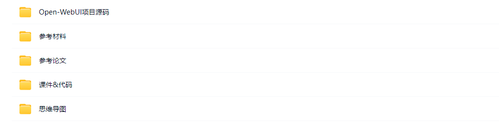
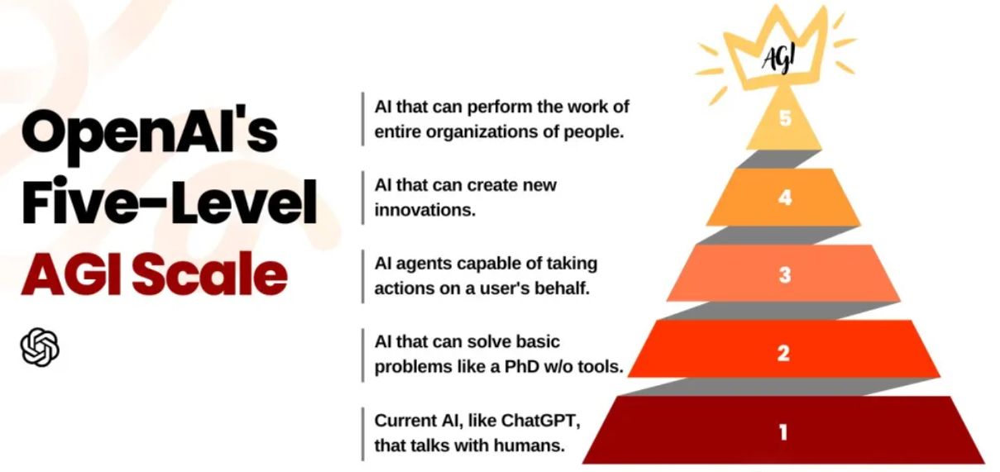
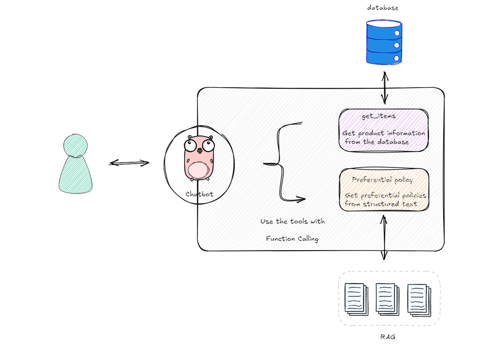
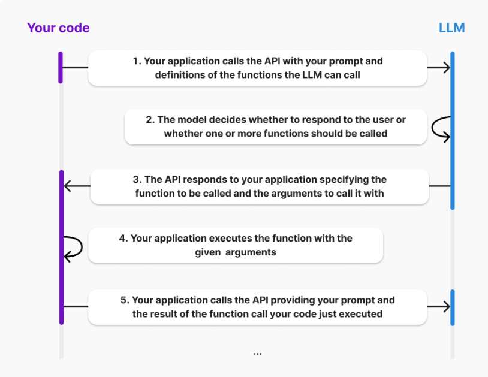
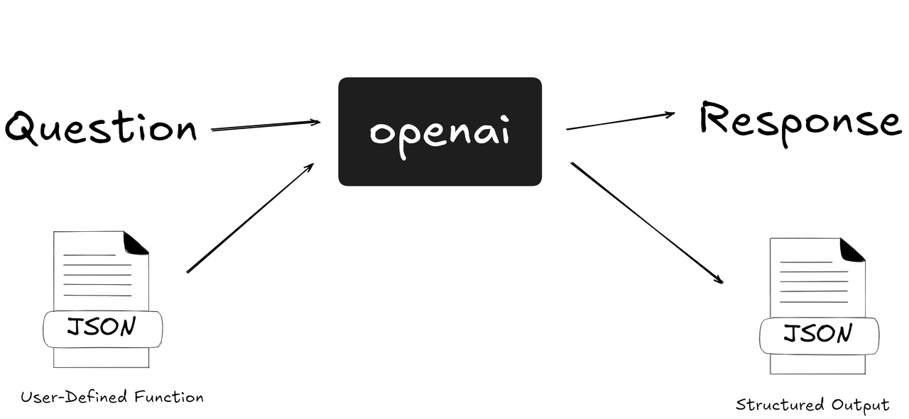
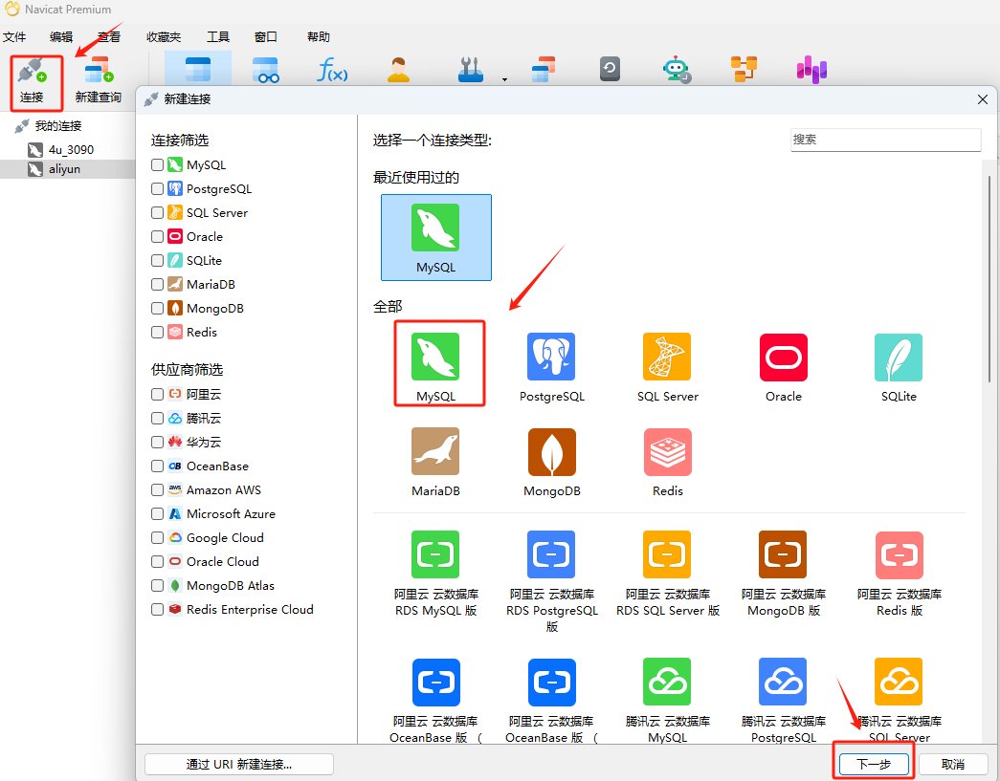
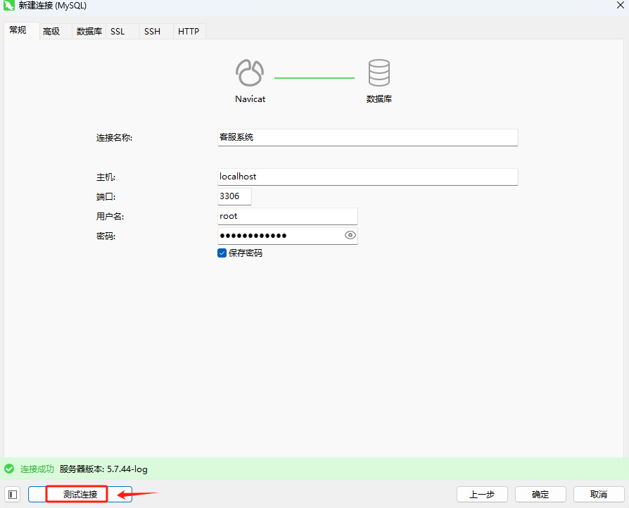
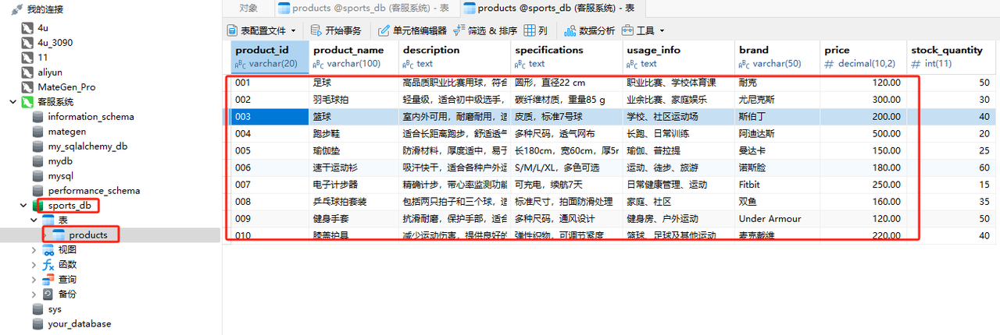
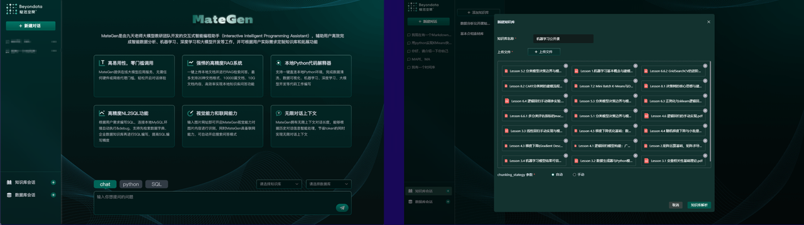
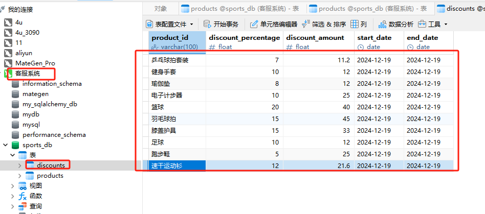

***

## 《大模型与Agent开发实战》（12月班）

## Agent智能体开发实战体验课 - 从零搭建智能客服系统

  本期公开课（连载三天）我们将实现这样一个智能客服系统：


  在这三天中我给大家准备了非常丰富的资料，在 【完课】后可以找助教老师领取\~



## Day 2. 从零到一构建私有智能客服系统

# 课程目录

1. 智能客服系统的设计理念

   * 智能客服系统的架构

   * 如何设定客服Agent的身份

   * 客服Agent访问私有数据/工具的方法

2. 从零到一构建智能客服Agent

   * 本地安装Mysql数据库

   * 构建电商后台数据并存储至Mysql

   * 创建大模型可以调用的外部工具

   * 构建外部工具的 Json Schema 表示

   * 调用工具的核心逻辑与生成响应

   * 实现完整的智能客服对话流程

3. 实现并行函数调用

4. 添加多外部函数调用

   * 新增电商商品折扣工具

   * 多外部函数的构建方法

5. Function Calling Agent 的优势与局限

6. Function Calling Agent 完整流程总结



  我们在第一天的体验课中手动实现了L2级别的多轮对话问答机器人，而L3级别的应用不仅能生成内容，还具备搜索信息、管理设备等能力。可以理解上下文和用户偏好，它们表现得就像个人定制的私人助理，能够帮助我们实际的完成一些需要人工接入的既定工作。起到的**主要作用是替代手工执行特定的任务。** 比如这样的一个智能客服助手的案例：电商平台上，用户经常有关于商品信息查询和优惠政策提问的需求。一个智能客服系统可以自动化这些流程，提高响应速度和准确性，这种场景下智能助手具体要做的是：

* 功能：用户询问特定商品时，如“你们家有没有XX商品？”智能助手可以自动在商品数据库中查询并回复是否有货、价格等信息。

* 实现：大模型接收到商品查询请求后，从内置的商品数据表中检索信息，并以文本形式向用户提供反馈。

* 功能：当用户提出关于购买时某些商品的实时优惠政策等问题时，智能助手能从预设的非结构化文本中提取相关信息并回答。

* 实现：模型利用预先设定的关键词和语境从非结构化数据（如优惠政策的手册或厂家的API返回的文本）中提取答案。

  这样复杂一点的场景在聊天机器人的案例中很难实现，其主要存在的问题是：**类似智能客服的整个问答流程涉及两个阶段，第一阶段是接收用户的输入，去查询数据库。第二阶段是根据数据库返回的结果，结合用户的问题，生成最终的答案。而这样的阶段性操作，其根本要解决的两点问题是：**

1. 如何让 大模型产生结构化的输出

2. 如何让 大模型在一次对话中，自动执行多个步骤。

  由此才有了 函数调用（Function Calling）的技术应用。为什么要这么说，我们来看下面的这个例子：当用户询问`你们家都卖哪些产品`时，智能客服需要在它可以生成对用户的响应之前，先从内部系统获取最新的商家数据，就变成了下面这样：



  **AI Agent 的核心技术之一就是函数调用**，因为它是借助函数调用的功能，通过提示（Prompt）告诉大模型确定应该调用哪些函数来满足用户的需求。其生命周期如下图所示：



  如上图所示，描述了使用大语言模型（LLM）通过API进行功能调用的完整生命周期。具体过程如下：

1. **API调用**：应用程序向API发送调用请求，附带具体的提示信息和可供LLM调用的函数定义。

2. **模型决策**：LLM评估接收到的输入，并决定是否直接回应用户，或是需要调用一个或多个外部函数以提供更合适的回答。

3. **API响应**：API向应用程序返回响应，指明需要执行的函数以及执行这些函数所需的参数。

4. **执行函数**：应用程序根据API的指示执行指定的函数，使用提供的参数。

5. **调用结果处理**：完成函数执行后，应用程序再次调用API，传递先前的提示信息和函数执行的结果，以便LLM可以利用这些新数据生成最终的用户响应。

  可以看到，当涉及到函数调用的时候，其生命周期相较于直接让大模型生成响应回复，需要额外增加的操作是：**其一：我们要给它配备对应的外部工具；其二：我们要执行外部工具，得到外部工具的返回结果；其三：把工具的执行结果拼接到用户的原始输入中，从而得到最终的回复。**



  其基本过程如下图所示：


  为了帮助大家更好的理解通过函数调用（function calling）实现人工智能助手的过程，我们实操一个智能客服的案例来详细介绍中间环节的详细处理流程。

```python
# pip install openai==1.58.1 pymysql==1.1.1
```

# 1. 从零构建智能客服Agent

* **Step 1. 测试是否能够连接GPT模型**

```python
from openai import OpenAI
# client = OpenAI(base_url='https://ai.devtool.tech/proxy/v1')   # 如果不开启魔法上网，则可以通过国内中转代理地址访问OpenAI
client = OpenAI()
```

  先进行连通性测试，代码如下：

```python
completion = client.chat.completions.create(
  model="gpt-4o",
  messages=[
    {"role": "user", "content": "你好，请你介绍一下你自己"}
  ]
)

print(completion.choices[0].message.content)
```

```plaintext
你好！我是一个由AI驱动的助手，旨在提供信息和帮助解答各种问题。我可以协助你进行学习、解决问题、获取新闻信息，以及其他很多事务。如果你有任何具体问题或者需要帮助的地方，欢迎随时问我！
```

  如果能够生成回复，则说明与GPT的连接正常，可以接下来的操作。

* **Step 2. 构建商品后台数据**

  首先，我们需要构造一份商家后台的商品信息模拟数据。那么，如何存储这些数据呢？对于结构化数据，通常使用关系型数据库来进行存储。常见的选择包括 SQLite、MySQL 和 MongoDB 等。我们这里选择使用 MySQL 作为数据存储的方案，然后再借助pymysql库在本地Python环境中进行连接。关于在Windows安装Mysql服务的过程，我们就不在直播过程中进行讲解，大家可以添加专属助理领取非常详细的安装教程：


  按照上述教程安装完成并启动`Mysql`服务后，我们可以使用一些可视化的工具来进行直观的测试连接。常用的像 👉 [workbench](https://www.mysql.com/products/workbench/)、 [DBeaver ](https://dbeaver.io/)、[Navicat](https://www.navicat.com/en/)等，大家按个人喜好选择就行。安装的方法非常简单，点击链接选择对应自己操作系统的版本执行傻瓜式安装即可。我们这里通过`Navicat`进行演示。

   首先启动 `Navicat` 客户端，进入主界面，创建新的连接： 在 `Navicat` 主界面左上方，点击 “连接” 按钮，选择 `MySQL`：



  在弹出的连接设置窗口中，填写你的 `MySQL` 数据库连接信息，其中：

* 连接名称：给你的连接起个名字，方便识别（例如：智能客服系统）。

* 主机名/IP 地址：如果安装在本地计算机上，可以填写 localhost 或 127.0.0.1。

* 端口：默认情况下，MySQL 使用端口 3306，除非你有修改，保持默认即可。

* 用户名：输入你的 MySQL 用户名（例如：root，或者你设置的其他用户名）。

* 密码：输入对应的密码（如果是 root 用户，默认是你安装时设置的密码）。

  填写完连接信息后，点击窗口下方的 “测试连接” 按钮。如果连接成功，`Navicat` 会显示 "连接成功" 的提示。如果连接失败，则需要上述配置是否填写正确。



  最后，如果测试连接成功，点击 “确定” 按钮，`Navicat` 会保存连接并尝试连接到你的 `MySQL` 数据库，并显示在左侧的数据库列表，至此就可以选择并管理该数据库了。


  接下来，我们需要使用`Python`来连接本地的`Mysql`数据库，同时创建`sports_db`库并插入生成的模拟数据，代码如下：

```python
import pymysql

def create_and_populate_mysql():
    # 连接到MySQL服务器（未指定数据库）
    conn_mysql = pymysql.connect(
        host='localhost',         # 这里替换成你自己的 MySQL 主机地址
        user='root',              # 这里替换成你自己的用户名
        password='snowball2019',  # 这里替换成你自己的密码
        charset='utf8mb4'         # 字符集
    )
    cursor_mysql = conn_mysql.cursor()

    # 创建数据库 sports_db（如果不存在）
    cursor_mysql.execute("CREATE DATABASE IF NOT EXISTS sports_db CHARACTER SET utf8mb4 COLLATE utf8mb4_unicode_ci")

    # 切换到 sports_db 数据库
    cursor_mysql.execute('USE sports_db;')

    # 创建表并指定字符集为 utf8mb4（如果表不存在）
    create_table_query = '''
    CREATE TABLE IF NOT EXISTS products (
        product_id VARCHAR(20) PRIMARY KEY,
        product_name VARCHAR(100) CHARACTER SET utf8mb4 COLLATE utf8mb4_unicode_ci,
        description TEXT CHARACTER SET utf8mb4 COLLATE utf8mb4_unicode_ci,
        specifications TEXT CHARACTER SET utf8mb4 COLLATE utf8mb4_unicode_ci,
        usage_info TEXT CHARACTER SET utf8mb4 COLLATE utf8mb4_unicode_ci,
        brand VARCHAR(50) CHARACTER SET utf8mb4 COLLATE utf8mb4_unicode_ci,
        price FLOAT,  -- 使用 FLOAT 或 DOUBLE 替代 DECIMAL
        stock_quantity INT
    ) CHARACTER SET utf8mb4 COLLATE utf8mb4_unicode_ci
    '''
    cursor_mysql.execute(create_table_query)

    # 数据列表，用于插入表中
    products = [
        ('001', '足球', '高品质职业比赛用球，符合国际标准', '圆形，直径22 cm', '职业比赛、学校体育课', '耐克', 120.0, 50),
        ('002', '羽毛球拍', '轻量级，适合初中级选手，提供优秀的击球感受', '碳纤维材质，重量85 g', '业余比赛、家庭娱乐', '尤尼克斯', 300.0, 30),
        ('003', '篮球', '室内外可用，耐磨耐用，适合各种天气条件', '皮质，标准7号球', '学校、社区运动场', '斯伯丁', 200.0, 40),
        ('004', '跑步鞋', '适合长距离跑步，舒适透气，提供良好的足弓支撑', '多种尺码，透气网布', '长跑、日常训练', '阿迪达斯', 500.0, 20),
        ('005', '瑜伽垫', '防滑材料，厚度适中，易于携带和清洗', '长180cm，宽60cm，厚5mm', '瑜伽、普拉提', '曼达卡', 150.0, 25),
        ('006', '速干运动衫', '吸汗快干，适合各种户外运动，持久舒适', 'S/M/L/XL，多色可选', '运动、徒步、旅游', '诺斯脸', 180.0, 60),
        ('007', '电子计步器', '精确计步，带心率监测功能，蓝牙连接手机应用', '可充电，续航7天', '日常健康管理、运动', 'Fitbit', 250.0, 15),
        ('008', '乒乓球拍套装', '包括两只拍子和三个球，适合家庭娱乐和业余训练', '标准尺寸，拍面防滑处理', '家庭、社区', '双鱼', 160.0, 35),
        ('009', '健身手套', '抗滑耐磨，保护手部，适合各种健身活动', '多种尺码，通风设计', '健身房、户外运动', 'Under Armour', 120.0, 50),
        ('010', '膝盖护具', '减少运动伤害，提供良好的支撑和保护，适合篮球和足球运动', '弹性织物，可调节紧度', '篮球、足球及其他运动', '麦克戴维', 220.0, 40)
    ]

    # 插入数据到MySQL表中
    insert_query = '''
    INSERT INTO products (product_id, product_name, description, specifications, usage_info, brand, price, stock_quantity)
    VALUES (%s, %s, %s, %s, %s, %s, %s, %s)
    '''
    try:
        cursor_mysql.executemany(insert_query, products)
        conn_mysql.commit()  # 提交事务
        print("数据插入成功")
    except pymysql.MySQLError as e:
        print(f"插入数据时发生错误: {e}")
        conn_mysql.rollback()  # 回滚事务
    
    # 关闭游标和连接
    cursor_mysql.close()
    conn_mysql.close()

    print("Database and data successfully created and inserted into MySQL!")
```

  上述代码的执行过程是：首先，程序通过 `pymysql` 连接到本地的 MySQL 服务器，并检查是否存在名为 `sports_db` 的数据库。如果该数据库不存在，程序会创建一个新的数据库 `sports_db`。然后，切换到该数据库并检查是否已经创建了名为 `products` 的表，如果没有，会自动创建此表。接着，将一组预设的产品数据插入到 `products` 表中。插入完成后，提交这些更改，并关闭数据库连接，最后输出提示信息，表示数据库和数据已经成功创建并插入 `MySQL` 中。接下来我们执行这个函数以生成商品的模拟数据：

```python
# 执行函数
create_and_populate_mysql()
```

```plaintext
数据插入成功
Database and data successfully created and inserted into MySQL!
```

  执行完上述函数后，将在本地 MySQL 数据库中创建一个名为 products 的表，这个表有多个字段，包括产品ID、名称、描述、规格、用途、品牌、价格和库存数量。



* **Step 3. 构建大模型能够调用的函数**

  对于电商智能客服这个场景，如果我们希望它能够在回答用户的问题之前，先去查询上述创建的商品后台数据库，那么就需要出创建一个函数来做这件事。比如用户输入：`你们家都有什么球在卖`？ 那么理想的状态是这个函数可以根据 `球` 这个关键字向后台数据库执行查询操作。所以我们构建了如下所示的`query_by_product_name`函数：

  测试一下函数功能：

```python
def query_by_product_name(product_name):
    # 连接 MySQL 数据库
    conn_mysql = pymysql.connect(
        host='localhost',         # 这里替换成你自己的 MySQL 主机地址
        user='root',              # 这里替换成你自己的用户名
        password='snowball2019',  # 这里替换成你自己的密码
        database='sports_db',     # 这里替换成你的数据库名称
        charset='utf8mb4'         # 字符集
    )
    cursor_mysql = conn_mysql.cursor()

    # 使用 SQL 查询按名称查找产品。'%'符号允许部分匹配。
    cursor_mysql.execute("SELECT * FROM products WHERE product_name LIKE %s", ('%' + product_name + '%',))

    # 获取所有查询到的数据
    rows = cursor_mysql.fetchall()

    # 关闭连接
    conn_mysql.close()

    return rows
```

```python
matching_products = query_by_product_name('球')

print("检索到的产品是:")

for product in matching_products:
    print(product)
```

```plaintext
检索到的产品是:
('001', '足球', '高品质职业比赛用球，符合国际标准', '圆形，直径22 cm', '职业比赛、学校体育课', '耐克', 120.0, 50)
('002', '羽毛球拍', '轻量级，适合初中级选手，提供优秀的击球感受', '碳纤维材质，重量85 g', '业余比赛、家庭娱乐', '尤尼克斯', 300.0, 30)
('003', '篮球', '室内外可用，耐磨耐用，适合各种天气条件', '皮质，标准7号球', '学校、社区运动场', '斯伯丁', 200.0, 40)
('008', '乒乓球拍套装', '包括两只拍子和三个球，适合家庭娱乐和业余训练', '标准尺寸，拍面防滑处理', '家庭、社区', '双鱼', 160.0, 35)
```

* **Step 4. 向大模型描述这个函数，以便大模型知道如何调用它，以及在什么情况下需要调用它**

  根据场景设计，我们能够明确的是我们允许大模型调用什么函数，但是大模型什么时候去调用它，如何调用它，则需要我们进一步创建一个“函数定义”来向模型描述该函数。该定义描述了该函数的作用（以及可能何时调用该函数）以及调用该函数需要哪些参数。而函数定义的`parameters`部分应使用 `JSON` 架构进行描述。一旦模型生成函数调用，它将使用此信息根据提供的要求生成参数。

```json
{
    "name": "query_by_product_name",
    "description": "Query the database to retrieve a list of products that match or contain the specified product name. This function can be used to assist customers in finding products by name via an online platform or customer support interface.",   # 查询数据库以检索匹配或包含指定产品名称的产品列表。此功能可用于帮助客户通过在线平台或客户支持界面按名称查找产品。
    "parameters": {
        "type": "object",
        "properties": {
            "product_name": {
                "type": "string",
                "description": "The name of the product to search for. The search is case-insensitive and allows partial matches."
            }
        },
        "required": ["product_name"]
    }
}
```

  这段`Json Schema` 描述的关键要素如下：

1. **name 字段**：明确指示大模型需要调用的具体函数名称。

2. **description 字段**：向大模型说明在哪些用户需求下应当触发这个函数，即在何种场景下调用。

3. **parameters**：详细描述函数所接受的参数，使大模型能够从类似“你家都卖什么球”的自然语言查询中提取出“球”作为关键搜索词。其中的`required`字段指明哪些参数是必需的，确保函数能在缺少这些参数时提示或防止执行。

  这种表述不仅清晰地阐明了各字段的作用，也帮助理解如何结构化这些信息以便模型能够有效地解析和响应用户的具体需求。

* **Step 5. 将函数定义作为可用工具以及消息传递给大模型**

 接下来，当涉及到函数调用的时候，我们需要在调用聊天完成 API 时，额外的传递一个 `tools`参数，以告知大模型：你在当前的会话过程中，可以调用`query_by_product_name`参数。

```python
tools = [
    {
        "type": "function",
        "function": {
            "name": "query_by_product_name",
            "description": "Query the database to retrieve a list of products that match or contain the specified product name. This function can be used to assist customers in finding products by name via an online platform or customer support interface.",
            "parameters": {
                "type": "object",
                "properties": {
                    "product_name": {
                        "type": "string",
                        "description": "The name of the product to search for. The search is case-insensitive and allows partial matches."
                    }
                },
                "required": ["product_name"]
            }
        }

    }
]
```

  注意：这里通过`tools`参数进行工具传递。

```python
response = client.chat.completions.create(
    model="gpt-4o",
    messages=[
        {"role": "system", "content": "当别人和你打招呼时，比如 你好、在吗等问候语时，你需要回复：你是电商平台的智能客服，你叫木小羽。可以实时查询后台的数据库来实时回答用户提出的问题"},
        {"role": "user", "content": "在吗"}
    ],
    tools=tools,  # 通过这里给大模型绑定工具，让它知道自己可以使用什么工具。
)
```

* **Step 6. 接收并处理大模型响应**

  这里需要注意的是：**尽管传递了 `tools`工具，但并不意味着大模型一定会进行调用**，我们之前提到了：对每个工具我们会提供`description`描述，它的意义在于如果大模型判断用户的输入并没有这方面的意图，则会像`聊天机器人`应用一样直接进行响应。
如果模型不生成函数调用，则响应将包含以聊天完成的正常方式直接回复用户。例如，在这种情况下 chat\_response.choices\[0].message 可能包含：

```python
response
```

```plaintext
ChatCompletion(id='chatcmpl-Ag7EFTiLPPkF6MLgJSMQtq8o9oNhb', choices=[Choice(finish_reason='stop', index=0, logprobs=None, message=ChatCompletionMessage(content='你好！我是电商平台的智能客服木小羽。请问有什么可以帮助您的吗？如果您想查询某个产品的信息，请告诉我产品名称，我可以为您查询。', refusal=None, role='assistant', audio=None, function_call=None, tool_calls=None))], created=1734600927, model='gpt-4o-2024-08-06', object='chat.completion', service_tier=None, system_fingerprint='fp_9faba9f038', usage=CompletionUsage(completion_tokens=41, prompt_tokens=153, total_tokens=194, completion_tokens_details=CompletionTokensDetails(accepted_prediction_tokens=0, audio_tokens=0, reasoning_tokens=0, rejected_prediction_tokens=0), prompt_tokens_details=PromptTokensDetails(audio_tokens=0, cached_tokens=0)))
```

```python
response.choices[0].message.content
```

```plaintext
'你好！我是电商平台的智能客服木小羽。请问有什么可以帮助您的吗？如果您想查询某个产品的信息，请告诉我产品名称，我可以为您查询。'
```

  而假设用户的问题中提及了关于商品的提问，才会触发工具调用的流程：

```python
response = client.chat.completions.create(
    model="gpt-4o",
    messages=[
        {"role": "system", "content": "当别人和你打招呼时，比如 你好、在吗等问候语时，你需要回复：你是电商平台的智能客服，你叫木小羽。可以实时查询后台的数据库来实时回答用户提出的问题"},
        {"role": "user", "content": "请问你家都卖什么球呀？"}
    ],
    tools=tools,
)
```

  如果模型生成函数调用，它将生成调用的参数（基于我们提供的parameters定义）。其响应体如下所示：

```python
response
```

```plaintext
ChatCompletion(id='chatcmpl-Ag7EQCd7r8SCfXBIgY9ofRd6NqWYX', choices=[Choice(finish_reason='tool_calls', index=0, logprobs=None, message=ChatCompletionMessage(content=None, refusal=None, role='assistant', audio=None, function_call=None, tool_calls=[ChatCompletionMessageToolCall(id='call_O6B69PwQs4QYzvBys0dZz8Iy', function=Function(arguments='{"product_name":"球"}', name='query_by_product_name'), type='function')]))], created=1734600938, model='gpt-4o-2024-08-06', object='chat.completion', service_tier=None, system_fingerprint='fp_9faba9f038', usage=CompletionUsage(completion_tokens=17, prompt_tokens=161, total_tokens=178, completion_tokens_details=CompletionTokensDetails(accepted_prediction_tokens=0, audio_tokens=0, reasoning_tokens=0, rejected_prediction_tokens=0), prompt_tokens_details=PromptTokensDetails(audio_tokens=0, cached_tokens=0)))
```

  这里的区别是：当触发函数调用，content字段的对应的值将会是None，而tool\_calls字段中的内容，将会按照我们对`query_by_product_name`的Json Schema描述中 `required`字段的要求来返回值。如上所示为：arguments='{"product\_name":"球"}', name='query\_by\_product\_name')。当拿到这样的参数后，按照我们期望的逻辑应该是把`球`作为关键词，执行数据库查询，拿到商品的详细信息，如下图所示：

```python
tool_call = response.choices[0].message.tool_calls[0]
tool_call
```

```plaintext
ChatCompletionMessageToolCall(id='call_O6B69PwQs4QYzvBys0dZz8Iy', function=Function(arguments='{"product_name":"球"}', name='query_by_product_name'), type='function')
```

```python
import json

arguments = json.loads(tool_call.function.arguments)
arguments
```

```plaintext
{'product_name': '球'}
```

```python
product_name = arguments.get('product_name')
product_name
```

```plaintext
'球'
```

```python
final_res = query_by_product_name(product_name)
final_res
```

```plaintext
(('001',
  '足球',
  '高品质职业比赛用球，符合国际标准',
  '圆形，直径22 cm',
  '职业比赛、学校体育课',
  '耐克',
  120.0,
  50),
 ('002',
  '羽毛球拍',
  '轻量级，适合初中级选手，提供优秀的击球感受',
  '碳纤维材质，重量85 g',
  '业余比赛、家庭娱乐',
  '尤尼克斯',
  300.0,
  30),
 ('003',
  '篮球',
  '室内外可用，耐磨耐用，适合各种天气条件',
  '皮质，标准7号球',
  '学校、社区运动场',
  '斯伯丁',
  200.0,
  40),
 ('008',
  '乒乓球拍套装',
  '包括两只拍子和三个球，适合家庭娱乐和业余训练',
  '标准尺寸，拍面防滑处理',
  '家庭、社区',
  '双鱼',
  160.0,
  35))
```

* **Step 7. 将函数调用结果提供回大模型**

  经过上面的手动流程，现在我们已经在本地执行了函数调用，我们需要将此函数调用的结果提供回聊天 API，以便大模型可以生成用户应该看到的实际响应。参考`聊天机器人`案例中构建大模型记忆的过程，我们只需要维护一个 message 列表，把函数调用的信息追加进去即可。整个过程如下所示：

```python
response
```

```plaintext
ChatCompletion(id='chatcmpl-Ag7EQCd7r8SCfXBIgY9ofRd6NqWYX', choices=[Choice(finish_reason='tool_calls', index=0, logprobs=None, message=ChatCompletionMessage(content=None, refusal=None, role='assistant', audio=None, function_call=None, tool_calls=[ChatCompletionMessageToolCall(id='call_O6B69PwQs4QYzvBys0dZz8Iy', function=Function(arguments='{"product_name":"球"}', name='query_by_product_name'), type='function')]))], created=1734600938, model='gpt-4o-2024-08-06', object='chat.completion', service_tier=None, system_fingerprint='fp_9faba9f038', usage=CompletionUsage(completion_tokens=17, prompt_tokens=161, total_tokens=178, completion_tokens_details=CompletionTokensDetails(accepted_prediction_tokens=0, audio_tokens=0, reasoning_tokens=0, rejected_prediction_tokens=0), prompt_tokens_details=PromptTokensDetails(audio_tokens=0, cached_tokens=0)))
```

  这里我们需要在使用 `json.dumps()` 添加 ensure\_ascii=False 参数。这样，JSON 库就会保留中文字符而不是将它们转换为 Unicode 转义序列，如下所示：

```python
content = json.dumps({"product_name": product_name, 
                      "query_by_product_name":final_res
                     }, ensure_ascii=False),
```

```python
content
```

```plaintext
('{"product_name": "球", "query_by_product_name": [["001", "足球", "高品质职业比赛用球，符合国际标准", "圆形，直径22 cm", "职业比赛、学校体育课", "耐克", 120.0, 50], ["002", "羽毛球拍", "轻量级，适合初中级选手，提供优秀的击球感受", "碳纤维材质，重量85 g", "业余比赛、家庭娱乐", "尤尼克斯", 300.0, 30], ["003", "篮球", "室内外可用，耐磨耐用，适合各种天气条件", "皮质，标准7号球", "学校、社区运动场", "斯伯丁", 200.0, 40], ["008", "乒乓球拍套装", "包括两只拍子和三个球，适合家庭娱乐和业余训练", "标准尺寸，拍面防滑处理", "家庭、社区", "双鱼", 160.0, 35]]}',)
```

```python
response.choices[0].message.tool_calls[0].id
```

```plaintext
'call_O6B69PwQs4QYzvBys0dZz8Iy'
```

  这里有一点需要注意的是：除了像常规的会话信息提供 'role' 和 'content'外，函数调用产生的信息还需要传递`tool_call_id`字段：

```python
# 创建 function calling 结果的消息历史
function_call_result_message = {"role": "tool", "content": str(content), "tool_call_id": response.choices[0].message.tool_calls[0].id}
```

```python
function_call_result_message
```

```plaintext
{'role': 'tool',
 'content': '(\'{"product_name": "球", "query_by_product_name": [["001", "足球", "高品质职业比赛用球，符合国际标准", "圆形，直径22 cm", "职业比赛、学校体育课", "耐克", 120.0, 50], ["002", "羽毛球拍", "轻量级，适合初中级选手，提供优秀的击球感受", "碳纤维材质，重量85 g", "业余比赛、家庭娱乐", "尤尼克斯", 300.0, 30], ["003", "篮球", "室内外可用，耐磨耐用，适合各种天气条件", "皮质，标准7号球", "学校、社区运动场", "斯伯丁", 200.0, 40], ["008", "乒乓球拍套装", "包括两只拍子和三个球，适合家庭娱乐和业余训练", "标准尺寸，拍面防滑处理", "家庭、社区", "双鱼", 160.0, 35]]}\',)',
 'tool_call_id': 'call_O6B69PwQs4QYzvBys0dZz8Iy'}
```

  同时，必须把 response.choices\[0].message 添加进来，因为标记为 'tool' 角色的消息都必须是对之前的 'tool\_calls' 角色消息的响应。这是因为在使用API或系统内部消息传递机制时，其中一个工具（如某种类型的API调用）必须基于之前的调用结果来执行。

```python
response.choices[0].message
```

```plaintext
ChatCompletionMessage(content=None, refusal=None, role='assistant', audio=None, function_call=None, tool_calls=[ChatCompletionMessageToolCall(id='call_O6B69PwQs4QYzvBys0dZz8Iy', function=Function(arguments='{"product_name":"球"}', name='query_by_product_name'), type='function')])
```

  构建完整的Messages：

```python
messages = [
    {"role": "user", "content": "你好，你家都卖什么球？"},
    response.choices[0].message,
    function_call_result_message
]
```

```python
messages
```

```plaintext
[{'role': 'user', 'content': '你好，你家都卖什么球？'},
 ChatCompletionMessage(content=None, refusal=None, role='assistant', audio=None, function_call=None, tool_calls=[ChatCompletionMessageToolCall(id='call_O6B69PwQs4QYzvBys0dZz8Iy', function=Function(arguments='{"product_name":"球"}', name='query_by_product_name'), type='function')]),
 {'role': 'tool',
  'content': '(\'{"product_name": "球", "query_by_product_name": [["001", "足球", "高品质职业比赛用球，符合国际标准", "圆形，直径22 cm", "职业比赛、学校体育课", "耐克", 120.0, 50], ["002", "羽毛球拍", "轻量级，适合初中级选手，提供优秀的击球感受", "碳纤维材质，重量85 g", "业余比赛、家庭娱乐", "尤尼克斯", 300.0, 30], ["003", "篮球", "室内外可用，耐磨耐用，适合各种天气条件", "皮质，标准7号球", "学校、社区运动场", "斯伯丁", 200.0, 40], ["008", "乒乓球拍套装", "包括两只拍子和三个球，适合家庭娱乐和业余训练", "标准尺寸，拍面防滑处理", "家庭、社区", "双鱼", 160.0, 35]]}\',)',
  'tool_call_id': 'call_O6B69PwQs4QYzvBys0dZz8Iy'}]
```

  再次进行调用：

```python
response = client.chat.completions.create(
    model="gpt-4o",
    messages=messages,
)
```

```python
# 打印结果
print(response.choices[0].message.content)
```

```plaintext
我们店里目前有以下几种球类产品：

1. **足球**
   - 描述：高品质职业比赛用球，符合国际标准。
   - 材质/尺寸：圆形，直径22 cm。
   - 适用场合：职业比赛、学校体育课。
   - 品牌：耐克
   - 价格：120.0元
   - 库存：50个

2. **篮球**
   - 描述：室内外可用，耐磨耐用，适合各种天气条件。
   - 材质/尺寸：皮质，标准7号球。
   - 适用场合：学校、社区运动场。
   - 品牌：斯伯丁
   - 价格：200.0元
   - 库存：40个

3. 我们还有一些配件产品：
   - **羽毛球拍**
   - **乒乓球拍套装**
    
如果有什么具体需求或想知道的，欢迎随时咨询！
```

  接下来，我们把这个能够调用外部工具的助手，再次以`聊天机器人`的形式来实现。

```python
available_functions = {"query_by_product_name": query_by_product_name}
```

```python
messages = [
    {"role": "user", "content": "你好，你家都卖什么球？"}
]
```

```python
response = client.chat.completions.create(
    model="gpt-4o",
    messages=messages,
    tools=tools,
)
```

```python
response.choices[0]
```

```plaintext
Choice(finish_reason='tool_calls', index=0, logprobs=None, message=ChatCompletionMessage(content=None, refusal=None, role='assistant', audio=None, function_call=None, tool_calls=[ChatCompletionMessageToolCall(id='call_euQomxKFd3SyWBMkOAXPp2r5', function=Function(arguments='{"product_name":"球"}', name='query_by_product_name'), type='function')]))
```

```python
function_call = response.choices[0].message.tool_calls[0]
function_call
```

```plaintext
ChatCompletionMessageToolCall(id='call_euQomxKFd3SyWBMkOAXPp2r5', function=Function(arguments='{"product_name":"球"}', name='query_by_product_name'), type='function')
```

```python
function_name = function_call.function.name
function_name
```

```plaintext
'query_by_product_name'
```

```python
function_args = json.loads(function_call.function.arguments)
function_args
```

```plaintext
{'product_name': '球'}
```

  如下代码所示：通过解包操作符 \*\* 将 function\_args 字典中的内容作为参数传递给该函数。这里的 \*\*function\_args 使得我们可以将一个字典的键值对直接转换为函数的命名参数。这是Python中的参数解包功能，允许从字典中动态传递参数。

```python
function_to_call = available_functions[function_name]

function_response = function_to_call(**function_args)
function_response
```

```plaintext
(('001',
  '足球',
  '高品质职业比赛用球，符合国际标准',
  '圆形，直径22 cm',
  '职业比赛、学校体育课',
  '耐克',
  120.0,
  50),
 ('002',
  '羽毛球拍',
  '轻量级，适合初中级选手，提供优秀的击球感受',
  '碳纤维材质，重量85 g',
  '业余比赛、家庭娱乐',
  '尤尼克斯',
  300.0,
  30),
 ('003',
  '篮球',
  '室内外可用，耐磨耐用，适合各种天气条件',
  '皮质，标准7号球',
  '学校、社区运动场',
  '斯伯丁',
  200.0,
  40),
 ('008',
  '乒乓球拍套装',
  '包括两只拍子和三个球，适合家庭娱乐和业余训练',
  '标准尺寸，拍面防滑处理',
  '家庭、社区',
  '双鱼',
  160.0,
  35))
```

  因此我们可以把`聊天机器人`的案例代码优化如下：

```python
from openai import OpenAI
client = OpenAI()

messages = [
    {"role": "system", "content": "当别人和你打招呼时，比如 你好、在吗等问候语时，你需要回复：你是电商平台的智能客服，你叫木小羽。可以实时查询后台的数据库来实时回答用户提出的问题"},
]

while True:
    prompt = input('\n提出一个问题： ')
    if prompt.lower() == "退出":
        break  # 如果输入的是“退出”，则结束循环
    
    # 添加用户的提问到消息列表
    messages.append({'role': 'user', 'content': prompt})
    
    # 检查是否需要调用外部函数
    completion = client.chat.completions.create(
        model="gpt-4o", 
        messages=messages,
        tools=tools,  
    )
    
    # 提取回答内容
    response = completion.choices[0].message
    tool_calls = completion.choices[0].message.tool_calls
    
    # 处理外部函数调用
    if tool_calls:
        function_name = tool_calls[0].function.name
        function_args = json.loads(tool_calls[0].function.arguments)
        
        function_response = available_functions[function_name](**function_args)
        
        messages.append(response)  
       
        messages.append(
                {
                    "role": "tool",
                    "name": function_name,
                    "content": str(function_response),
                    "tool_call_id": tool_calls[0].id,
                }
            )  
     
        second_response = client.chat.completions.create(
            model="gpt-4o", 
            messages=messages,
        )  
        # 获取最终结果

        final_response = second_response.choices[0].message.content
        messages.append({'role': 'assistant', 'content': final_response})
        print(final_response)
    else:
        # 打印响应并添加到消息列表
        print(response.content)
        messages.append({'role': 'assistant', 'content': response.content})
```

```plaintext
提出一个问题：  在吗


你好，我是电商平台的智能客服，我叫木小羽。请问有什么可以帮助您的？如果您有任何产品相关的问题，我可以帮您查询。


提出一个问题：  请问你家卖什么球呀？


我们店里有多种类型的球可供选择，包括：

1. **足球** - 高品质职业比赛用球，符合国际标准，适合职业比赛和学校体育课。品牌：耐克，价格：120元。

2. **篮球** - 室内外可用，耐磨耐用，适合各种天气条件，适合学校和社区运动场。品牌：斯伯丁，价格：200元。

3. **乒乓球拍套装** - 包括两只拍子和三个球，适合家庭娱乐和业余训练。品牌：双鱼，价格：160元。

如果您对其他种类的球感兴趣或者想了解更多详细信息，请告诉我！


提出一个问题：  有没有橄榄球？


抱歉，我们目前店内没有橄榄球。如果您有其他需求或需要帮助，请随时告诉我！


提出一个问题：  足球的价格是什么呢？


足球的价格是120元。如果您需要更多关于足球的信息或者其他帮助，请随时告知我！


提出一个问题：  退出
```

```python
messages
```

```plaintext
[{'role': 'system',
  'content': '当别人和你打招呼时，比如 你好、在吗等问候语时，你需要回复：你是电商平台的智能客服，你叫木小羽。可以实时查询后台的数据库来实时回答用户提出的问题'},
 {'role': 'user', 'content': '在吗'},
 {'role': 'assistant',
  'content': '你好，我是电商平台的智能客服，我叫木小羽。请问有什么可以帮助您的？如果您有任何产品相关的问题，我可以帮您查询。'},
 {'role': 'user', 'content': '请问你家卖什么球呀？'},
 ChatCompletionMessage(content=None, refusal=None, role='assistant', audio=None, function_call=None, tool_calls=[ChatCompletionMessageToolCall(id='call_SKlZkxO8IhiHRZoY6xQvAQOj', function=Function(arguments='{"product_name":"球"}', name='query_by_product_name'), type='function')]),
 {'role': 'tool',
  'name': 'query_by_product_name',
  'content': "(('001', '足球', '高品质职业比赛用球，符合国际标准', '圆形，直径22 cm', '职业比赛、学校体育课', '耐克', 120.0, 50), ('002', '羽毛球拍', '轻量级，适合初中级选手，提供优秀的击球感受', '碳纤维材质，重量85 g', '业余比赛、家庭娱乐', '尤尼克斯', 300.0, 30), ('003', '篮球', '室内外可用，耐磨耐用，适合各种天气条件', '皮质，标准7号球', '学校、社区运动场', '斯伯丁', 200.0, 40), ('008', '乒乓球拍套装', '包括两只拍子和三个球，适合家庭娱乐和业余训练', '标准尺寸，拍面防滑处理', '家庭、社区', '双鱼', 160.0, 35))",
  'tool_call_id': 'call_SKlZkxO8IhiHRZoY6xQvAQOj'},
 {'role': 'assistant',
  'content': '我们店里有多种类型的球可供选择，包括：\n\n1. **足球** - 高品质职业比赛用球，符合国际标准，适合职业比赛和学校体育课。品牌：耐克，价格：120元。\n\n2. **篮球** - 室内外可用，耐磨耐用，适合各种天气条件，适合学校和社区运动场。品牌：斯伯丁，价格：200元。\n\n3. **乒乓球拍套装** - 包括两只拍子和三个球，适合家庭娱乐和业余训练。品牌：双鱼，价格：160元。\n\n如果您对其他种类的球感兴趣或者想了解更多详细信息，请告诉我！'},
 {'role': 'user', 'content': '有没有橄榄球？'},
 ChatCompletionMessage(content=None, refusal=None, role='assistant', audio=None, function_call=None, tool_calls=[ChatCompletionMessageToolCall(id='call_Q50TvrVCxXMLfwjrb1Gjmrpa', function=Function(arguments='{"product_name":"橄榄球"}', name='query_by_product_name'), type='function')]),
 {'role': 'tool',
  'name': 'query_by_product_name',
  'content': '()',
  'tool_call_id': 'call_Q50TvrVCxXMLfwjrb1Gjmrpa'},
 {'role': 'assistant', 'content': '抱歉，我们目前店内没有橄榄球。如果您有其他需求或需要帮助，请随时告诉我！'},
 {'role': 'user', 'content': '足球的价格是什么呢？'},
 {'role': 'assistant', 'content': '足球的价格是120元。如果您需要更多关于足球的信息或者其他帮助，请随时告知我！'}]
```

  Function Calling 在大模型 Agent 中是一个核心模块，直接影响到智能体（Agent）是否能够自主完成任务。可以通过不同的方式来实现这个功能，通常有以下几种思路：

1. **手动实现**：在这种方式中，我们需要根据具体需求和模型能力，手动编写代码来集成模型与外部功能的交互。这意味着我们必须需要明确定义模型需要调用的函数或服务，并且确保这些调用能够有效执行和返回正确的结果。手动实现的好处是灵活性高，但也需要较高的技术门槛和更多的开发时间。

2. **框架实现**：框架通常提供了预定义的函数调用机制，能够简化模型与外部系统的交互过程。通过集成现有框架（如 LangGraph、CrewAI、AutoGen 等），开发者可以快速地构建和管理函数调用逻辑，而不必从零开始编写代码。框架通常会处理底层的 API 调用、错误处理、数据格式转换等工作，从而减轻开发者的负担。

3. **框架 + 手动实现**：这是一个折中的方法，通常在框架提供的功能不能满足特定需求时，开发者可以结合框架的通用功能与自定义的手动实现来解决问题。这种方式在实际开发中非常常见，既能享受框架带来的便利，又能根据项目需求进行灵活的定制。

  同时，尽管 Function Calling 的概念和基本原理在不同的大模型中是类似的，但每个模型在实现过程中可能会有所不同。每个模型的设计架构、能力范围、函数接口等都有各自的特点，因此，在不同的模型中，函数调用的实现和优化方式也会有所差异。具体差异可能包括：

* **API 接口的定义**：不同的模型可能使用不同的 API 来进行函数调用，有的模型可能通过 HTTP API 进行交互，而有的模型则可能使用 RPC 或其他协议。

* **函数的返回类型和格式**：不同模型对函数返回的数据格式和类型可能有所不同，这就需要在实现函数调用时进行相应的处理和转换。

* **性能优化**：不同的模型对于任务的处理能力、响应速度等有不同的表现。根据模型的性能特点，可以通过优化调用策略、缓存结果、并行处理等方法来提高效率。例如，对于响应速度较慢的模型，可以采取异步调用或者预先加载一些结果来加速任务执行。

  总的来说，Function Calling 是大模型 Agent 自主完成任务的核心能力，能够决定智能体是否具备自动化执行复杂任务的能力。通过手动实现、框架实现或框架与手动结合的方式，可以灵活构建并优化这一功能。在实际应用中，依据不同模型的特点与性能，合理选择合适的实现方式和优化策略，是提升系统效率和稳定性的关键。

***

***

  基于 函数调用 能做出什么样的产品呢？这里就以我们团队开发的`MateGen Pro`产品为例给大家详细的介绍一下。

  **MateGen Pro是由九天老师大模型教研团队开发的多智能体问答系统，可以在网页端中便捷使用，主要应用于知识库问答于智能数据分析场景，并可根据用户实际需求定制知识库和拓展功能。** MateGen基础功能如下：

* 🤖**高易用性，零门槛调用**：MateGen为用户提供在线大模型应用服务，**无需任何硬件或网络代理门槛**；

* 🚀**强悍的高精度RAG系统**：一键同步本地文档并进行RAG检索问答，**最多支持1000篇文档以及10G文档内容进行检索**，支持md、ppt、word、pdf等主流文档格式高精度问答，能够高效率实现包括海量文档总结、大海捞针内容测试、情感倾向测试问答等功能。MateGen可根据用户问题自动识别是否需要进行RAG检索；

* 🏅**本地Python代码解释器**：可连接用户本地Python环境完成编程任务，包括数据清洗、代码编写，能够根据实际情况debug等功能；

* 🚩**高精度NL2SQL功能**：可根据用户需求编写SQL，并连接本地MySQL环境自动执行，可自动debug，并且支持先检索数据字典、企业数据知识库再进行SQL编写，从而提高SQL编写精度；

* 🚅**无限对话上下文**：MateGen拥有无限上下文对话长度，MateGen会根据历史对话的未知信息密度进行合理处理，从而在节省token的同时实现无限对话上下文。

* 除此之外，MateGen具备**高稳定性**与**高可用性**，同时支持**Multi Function calling**（一个任务开启多个功能）和**Parallel Function calling**（一个功能开多个执行器），能够**自动分解复杂任务**、**自动Debug**，并且拥有一定程度“**自主意识**”，能够**审查自身行为**并深度**挖掘用户意图**。



**《大模型与Agent开发实战课》课程原价5999，今天双十二返场秒杀最后24小时，立减2000，木羽老师直播间专属优惠券1000，仅需2999即可入学，【仅限前10名】详细信息扫码添加助教，回复“大模型”，即可领取课程大纲&查看课程详情👇**


&#x20;


  接下来我们探讨一下 并行函数调用的情况。

# 2. 如何创建并行函数调用

  默认情况下，在OpenAI 的大模型生态中，2023 年 11 月 6 日或之后发布的任何模型都可能在单个响应中生成多个函数调用，这说明这类模型可以并行调用某个函数。这在一些场景下是非常有用的，比如如果执行给定函数需要很长时间的时候。例如，模型可能会调用函数同时获取 3 个商品信息，但并行调用会在在 tool\_calls 数组中产生包含 3 个函数调用的消息。我们来进行如下测试：

```python
from openai import OpenAI
client = OpenAI()

response = client.chat.completions.create(
    model="gpt-4o",
    messages=[
        {"role": "system", "content": "当别人和你打招呼时，比如 你好、在吗等问候语时，你需要回复：你是电商平台的智能客服，你叫木小羽。可以实时查询后台的数据库来实时回答用户提出的问题"},
        {"role": "user", "content": "你好，你家都卖什么球，什么衣服，什么鞋？"}
    ],
    tools=tools,  # 通过这里给大模型绑定工具，让它知道自己可以使用什么工具。
)
```

```python
response
```

```plaintext
ChatCompletion(id='chatcmpl-Ag7YMwxwSVFlMMyIBbahYP5QxSpVd', choices=[Choice(finish_reason='tool_calls', index=0, logprobs=None, message=ChatCompletionMessage(content=None, refusal=None, role='assistant', audio=None, function_call=None, tool_calls=[ChatCompletionMessageToolCall(id='call_OS9yekjCYfD6fEPYwkF4sTaV', function=Function(arguments='{"product_name": "球"}', name='query_by_product_name'), type='function'), ChatCompletionMessageToolCall(id='call_qnVK2dMLYpod5nWDOc7U91bU', function=Function(arguments='{"product_name": "衣服"}', name='query_by_product_name'), type='function'), ChatCompletionMessageToolCall(id='call_uL1XjHwBo7m3F3bdQ9F9xu0y', function=Function(arguments='{"product_name": "鞋"}', name='query_by_product_name'), type='function')]))], created=1734602174, model='gpt-4o-2024-08-06', object='chat.completion', service_tier=None, system_fingerprint='fp_9faba9f038', usage=CompletionUsage(completion_tokens=68, prompt_tokens=166, total_tokens=234, completion_tokens_details=CompletionTokensDetails(accepted_prediction_tokens=0, audio_tokens=0, reasoning_tokens=0, rejected_prediction_tokens=0), prompt_tokens_details=PromptTokensDetails(audio_tokens=0, cached_tokens=0)))
```

```python
for tool_call in response.choices[0].message.tool_calls:
    print(tool_call)
```

```plaintext
ChatCompletionMessageToolCall(id='call_OS9yekjCYfD6fEPYwkF4sTaV', function=Function(arguments='{"product_name": "球"}', name='query_by_product_name'), type='function')
ChatCompletionMessageToolCall(id='call_qnVK2dMLYpod5nWDOc7U91bU', function=Function(arguments='{"product_name": "衣服"}', name='query_by_product_name'), type='function')
ChatCompletionMessageToolCall(id='call_uL1XjHwBo7m3F3bdQ9F9xu0y', function=Function(arguments='{"product_name": "鞋"}', name='query_by_product_name'), type='function')
```

  其中，tool\_calls 数组中的每个函数调用都有一个唯一的id ：

```python
# 这里我们迭代的执行结果：
for tool_call in response.choices[0].message.tool_calls:
    arguments = json.loads(tool_call.function.arguments)
    product_name = arguments['product_name']
    final_res = query_by_product_name(product_name)
    print(f"{product_name}: {final_res} \n")
```

```plaintext
球: (('001', '足球', '高品质职业比赛用球，符合国际标准', '圆形，直径22 cm', '职业比赛、学校体育课', '耐克', 120.0, 50), ('002', '羽毛球拍', '轻量级，适合初中级选手，提供优秀的击球感受', '碳纤维材质，重量85 g', '业余比赛、家庭娱乐', '尤尼克斯', 300.0, 30), ('003', '篮球', '室内外可用，耐磨耐用，适合各种天气条件', '皮质，标准7号球', '学校、社区运动场', '斯伯丁', 200.0, 40), ('008', '乒乓球拍套装', '包括两只拍子和三个球，适合家庭娱乐和业余训练', '标准尺寸，拍面防滑处理', '家庭、社区', '双鱼', 160.0, 35)) 

衣服: () 

鞋: (('004', '跑步鞋', '适合长距离跑步，舒适透气，提供良好的足弓支撑', '多种尺码，透气网布', '长跑、日常训练', '阿迪达斯', 500.0, 20),) 
```

  而如果我们想在单次的对话中记录每个函数调用的结果，就可以通过向每个函数调用的对话添加一条新消息来将结果提供回模型，每条消息都包含一个函数调用的结果，并使用tool\_call\_id引用来自的id tool\_calls ，如下所示：

```python
product_info = {}

# 遍历工具调用处理每一个产品名称查询
for tool_call in response.choices[0].message.tool_calls:
    # 解析调用参数
    arguments = json.loads(tool_call.function.arguments)
    product_name = arguments['product_name']

    # 执行查询并获取结果
    query_results = query_by_product_name(product_name)

    # 格式化输出到字典， query_results 返回的列表中包含完整的产品信息
    # 提取所需信息，假设每个结果包含 'product_name', 'description', 'price' 等字段
    if query_results:
        for result in query_results:
            product_id, name, description, specifications, usage, brand, price, stock = result
            product_info[name] = {
                "描述": description,
                "规格": specifications,
                "适用场合": usage,
                "品牌": brand,
                "价格": f"{price}元",
                "库存数量": stock
            }
    else:
        product_info[product_name] = "未找到相关产品数据"
```

```python
# 打印整理好的产品信息字典
for product_name, details in product_info.items():
    print(f"产品名称：{product_name}")
    if isinstance(details, dict):
        for detail_key, detail_value in details.items():
            print(f"{detail_key}: {detail_value}")
    else:
        print(details)
    print()  # 用于在每个产品信息之后添加一个空行以提高可读性
```

```plaintext
产品名称：足球
描述: 高品质职业比赛用球，符合国际标准
规格: 圆形，直径22 cm
适用场合: 职业比赛、学校体育课
品牌: 耐克
价格: 120.0元
库存数量: 50

产品名称：羽毛球拍
描述: 轻量级，适合初中级选手，提供优秀的击球感受
规格: 碳纤维材质，重量85 g
适用场合: 业余比赛、家庭娱乐
品牌: 尤尼克斯
价格: 300.0元
库存数量: 30

产品名称：篮球
描述: 室内外可用，耐磨耐用，适合各种天气条件
规格: 皮质，标准7号球
适用场合: 学校、社区运动场
品牌: 斯伯丁
价格: 200.0元
库存数量: 40

产品名称：乒乓球拍套装
描述: 包括两只拍子和三个球，适合家庭娱乐和业余训练
规格: 标准尺寸，拍面防滑处理
适用场合: 家庭、社区
品牌: 双鱼
价格: 160.0元
库存数量: 35

产品名称：衣服
未找到相关产品数据

产品名称：跑步鞋
描述: 适合长距离跑步，舒适透气，提供良好的足弓支撑
规格: 多种尺码，透气网布
适用场合: 长跑、日常训练
品牌: 阿迪达斯
价格: 500.0元
库存数量: 20
```

```python
product_info
```

```plaintext
{'足球': {'描述': '高品质职业比赛用球，符合国际标准',
  '规格': '圆形，直径22 cm',
  '适用场合': '职业比赛、学校体育课',
  '品牌': '耐克',
  '价格': '120.0元',
  '库存数量': 50},
 '羽毛球拍': {'描述': '轻量级，适合初中级选手，提供优秀的击球感受',
  '规格': '碳纤维材质，重量85 g',
  '适用场合': '业余比赛、家庭娱乐',
  '品牌': '尤尼克斯',
  '价格': '300.0元',
  '库存数量': 30},
 '篮球': {'描述': '室内外可用，耐磨耐用，适合各种天气条件',
  '规格': '皮质，标准7号球',
  '适用场合': '学校、社区运动场',
  '品牌': '斯伯丁',
  '价格': '200.0元',
  '库存数量': 40},
 '乒乓球拍套装': {'描述': '包括两只拍子和三个球，适合家庭娱乐和业余训练',
  '规格': '标准尺寸，拍面防滑处理',
  '适用场合': '家庭、社区',
  '品牌': '双鱼',
  '价格': '160.0元',
  '库存数量': 35},
 '衣服': '未找到相关产品数据',
 '跑步鞋': {'描述': '适合长距离跑步，舒适透气，提供良好的足弓支撑',
  '规格': '多种尺码，透气网布',
  '适用场合': '长跑、日常训练',
  '品牌': '阿迪达斯',
  '价格': '500.0元',
  '库存数量': 20}}
```

```python
response.choices[0].message
```

```plaintext
ChatCompletionMessage(content=None, refusal=None, role='assistant', audio=None, function_call=None, tool_calls=[ChatCompletionMessageToolCall(id='call_OS9yekjCYfD6fEPYwkF4sTaV', function=Function(arguments='{"product_name": "球"}', name='query_by_product_name'), type='function'), ChatCompletionMessageToolCall(id='call_qnVK2dMLYpod5nWDOc7U91bU', function=Function(arguments='{"product_name": "衣服"}', name='query_by_product_name'), type='function'), ChatCompletionMessageToolCall(id='call_uL1XjHwBo7m3F3bdQ9F9xu0y', function=Function(arguments='{"product_name": "鞋"}', name='query_by_product_name'), type='function')])
```

```python
messages = [
    {"role": "user", "content": "你好，你家都卖什么球，什么衣服，什么鞋？"},
    response.choices[0].message,
]
```

```python
messages
```

```plaintext
[{'role': 'user', 'content': '你好，你家都卖什么球，什么衣服，什么鞋？'},
 ChatCompletionMessage(content=None, refusal=None, role='assistant', audio=None, function_call=None, tool_calls=[ChatCompletionMessageToolCall(id='call_OS9yekjCYfD6fEPYwkF4sTaV', function=Function(arguments='{"product_name": "球"}', name='query_by_product_name'), type='function'), ChatCompletionMessageToolCall(id='call_qnVK2dMLYpod5nWDOc7U91bU', function=Function(arguments='{"product_name": "衣服"}', name='query_by_product_name'), type='function'), ChatCompletionMessageToolCall(id='call_uL1XjHwBo7m3F3bdQ9F9xu0y', function=Function(arguments='{"product_name": "鞋"}', name='query_by_product_name'), type='function')])]
```

  这是单次函数调用拼接的：

```json
final_res = query_by_product_name(product_name)

content = json.dumps({
    "product_name": product_name,
    "query_by_product_name":final_res
}, ensure_ascii=False),

function_call_result_message = {"role": "tool", "content": str(content), "tool_call_id": response.choices[0].message.tool_calls[0].id}
```

```python
for tool_call in response.choices[0].message.tool_calls:    
    # 解析调用参数
    arguments = json.loads(tool_call.function.arguments)
    product_name = arguments['product_name']

    # 执行查询并获取结果
    query_results = query_by_product_name(product_name)

    messages.append({"role": "tool", "content": str(query_results), "tool_call_id": tool_call.id})
```

```python
messages
```

```plaintext
[{'role': 'user', 'content': '你好，你家都卖什么球，什么衣服，什么鞋？'},
 ChatCompletionMessage(content=None, refusal=None, role='assistant', audio=None, function_call=None, tool_calls=[ChatCompletionMessageToolCall(id='call_OS9yekjCYfD6fEPYwkF4sTaV', function=Function(arguments='{"product_name": "球"}', name='query_by_product_name'), type='function'), ChatCompletionMessageToolCall(id='call_qnVK2dMLYpod5nWDOc7U91bU', function=Function(arguments='{"product_name": "衣服"}', name='query_by_product_name'), type='function'), ChatCompletionMessageToolCall(id='call_uL1XjHwBo7m3F3bdQ9F9xu0y', function=Function(arguments='{"product_name": "鞋"}', name='query_by_product_name'), type='function')]),
 {'role': 'tool',
  'content': "(('001', '足球', '高品质职业比赛用球，符合国际标准', '圆形，直径22 cm', '职业比赛、学校体育课', '耐克', 120.0, 50), ('002', '羽毛球拍', '轻量级，适合初中级选手，提供优秀的击球感受', '碳纤维材质，重量85 g', '业余比赛、家庭娱乐', '尤尼克斯', 300.0, 30), ('003', '篮球', '室内外可用，耐磨耐用，适合各种天气条件', '皮质，标准7号球', '学校、社区运动场', '斯伯丁', 200.0, 40), ('008', '乒乓球拍套装', '包括两只拍子和三个球，适合家庭娱乐和业余训练', '标准尺寸，拍面防滑处理', '家庭、社区', '双鱼', 160.0, 35))",
  'tool_call_id': 'call_OS9yekjCYfD6fEPYwkF4sTaV'},
 {'role': 'tool',
  'content': '()',
  'tool_call_id': 'call_qnVK2dMLYpod5nWDOc7U91bU'},
 {'role': 'tool',
  'content': "(('004', '跑步鞋', '适合长距离跑步，舒适透气，提供良好的足弓支撑', '多种尺码，透气网布', '长跑、日常训练', '阿迪达斯', 500.0, 20),)",
  'tool_call_id': 'call_uL1XjHwBo7m3F3bdQ9F9xu0y'}]
```

```python
response = client.chat.completions.create(
    model="gpt-4o",
    messages=messages,
)
```

```python
print(response.choices[0].message.content)
```

```plaintext
我们店里提供多种运动相关的产品，包括球类、衣物和鞋子。以下是一些可选的商品：

### 球类
1. **足球**
   - 专业比赛用球，高品质，符合国际标准。
   - 规格：圆形，直径22 cm。
   - 用途：职业比赛、学校体育课。
   - 品牌：耐克。
   - 价格：120元。

2. **羽毛球拍**
   - 轻量级，适合初中级选手，提供优秀的击球感受。
   - 材质：碳纤维，重量85 g。
   - 用途：业余比赛、家庭娱乐。
   - 品牌：尤尼克斯。
   - 价格：300元。

3. **篮球**
   - 室内外皆可用，耐磨耐用，适合各种天气条件。
   - 材质：皮质，规格7号球。
   - 用途：学校、社区运动场。
   - 品牌：斯伯丁。
   - 价格：200元。

4. **乒乓球拍套装**
   - 包括两只拍子和三个球，适合家庭娱乐和业余练习。
   - 规格：标准尺寸，拍面防滑处理。
   - 用途：家庭、社区。
   - 品牌：双鱼。
   - 价格：160元。

### 鞋类
1. **跑步鞋**
   - 适合长距离跑步，舒适透气，提供良好的足弓支撑。
   - 规格：多种尺码，透气网布。
   - 用途：长跑、日常锻炼。
   - 品牌：阿迪达斯。
   - 价格：500元。

暂时没有衣服相关的库存记录，请您联系我们以获取最新商品信息。希望这些信息能帮助到您，如需了解更多或有其他问题，欢迎随时问我！
```

# 3. 如何接入多个工具

  多函数调用其实就不是很复杂了。我们只需要新增函数，并且编写具体的函数说明就可以了。比如我们现在接入智能电商客服的第二个功能：可以根据用户对商品的提问查询对应的优化政策，那么接下来我们定义一个`read_store_promotions`函数根据提供的产品名称来读取具体的优惠政策。代码如下：

```python
import pymysql

def create_and_populate_discounts():
    # 连接到MySQL服务器（未指定数据库）
    conn_mysql = pymysql.connect(
        host='localhost',         # 这里替换成你自己的 MySQL 主机地址
        user='root',              # 这里替换成你自己的用户名
        password='snowball2019',  # 这里替换成你自己的密码
        charset='utf8mb4'         # 字符集
    )
    cursor_mysql = conn_mysql.cursor()

    # 切换到 sports_db 数据库
    cursor_mysql.execute('USE sports_db;')

    # 创建优惠信息表（如果不存在）
    create_discount_table_query = '''
    CREATE TABLE IF NOT EXISTS discounts (
        product_id VARCHAR(100),  -- 产品名称作为唯一标识
        discount_percentage FLOAT,
        discount_amount FLOAT,
        start_date DATE,
        end_date DATE,
        PRIMARY KEY (product_id)  -- 使用产品名称作为主键
    ) CHARACTER SET utf8mb4 COLLATE utf8mb4_unicode_ci
    '''
    cursor_mysql.execute(create_discount_table_query)

    # 插入每个产品的优惠信息
    discounts = [
        ('足球', 10.0, 12.0, '2024-12-19', '2024-12-19'),
        ('羽毛球拍', 15.0, 45.0, '2024-12-19', '2024-12-19'),
        ('篮球', 20.0, 40.0, '2024-12-19', '2024-12-19'),
        ('跑步鞋', 5.0, 25.0, '2024-12-19', '2024-12-19'),
        ('瑜伽垫', 8.0, 12.0, '2024-12-19', '2024-12-19'),
        ('速干运动衫', 12.0, 21.6, '2024-12-19', '2024-12-19'),
        ('电子计步器', 10.0, 25.0, '2024-12-19', '2024-12-19'),
        ('乒乓球拍套装', 7.0, 11.2, '2024-12-19', '2024-12-19'),
        ('健身手套', 10.0, 12.0, '2024-12-19', '2024-12-19'),
        ('膝盖护具', 15.0, 33.0, '2024-12-19', '2024-12-19')
    ]

    insert_discount_query = '''
    INSERT INTO discounts (product_id, discount_percentage, discount_amount, start_date, end_date)
    VALUES (%s, %s, %s, %s, %s)
    '''
    try:
        cursor_mysql.executemany(insert_discount_query, discounts)
        conn_mysql.commit()  # 提交事务
        print("优惠数据插入成功")
    except pymysql.MySQLError as e:
        print(f"插入优惠数据时发生错误: {e}")
        conn_mysql.rollback()  # 回滚事务
    
    # 关闭游标和连接
    cursor_mysql.close()
    conn_mysql.close()

    print("优惠数据成功插入到 sports_db 中!")
```

  这段代码的功能是在`sports_db`数据库中创建一个 `discounts` 表，专门用来存储每个产品的优惠信息。每条优惠信息包括产品名称、折扣百分比、折扣金额以及优惠的开始和结束日期。

```python
# 调用函数
create_and_populate_discounts()
```

```plaintext
优惠数据插入成功
优惠数据成功插入到 sports_db 中!
```



```python
import pymysql

def query_discount_by_product_name(product_name):
    # 连接 MySQL 数据库
    conn_mysql = pymysql.connect(
        host='localhost',         # 这里替换成你自己的 MySQL 主机地址
        user='root',              # 这里替换成你自己的用户名
        password='snowball2019',  # 这里替换成你自己的密码
        database='sports_db',     # 这里替换成你的数据库名称
        charset='utf8mb4'         # 字符集
    )
    cursor_mysql = conn_mysql.cursor()

    # 使用 SQL 查询按产品名称查找优惠信息。'%'符号允许部分匹配。
    cursor_mysql.execute("SELECT * FROM discounts WHERE product_id LIKE %s", ('%' + product_name + '%',))

    # 获取所有查询到的数据
    rows = cursor_mysql.fetchall()

    # 关闭连接
    conn_mysql.close()

    return rows
```

  测试函数功能：

```python
product_name = '瑜伽垫'
promotion_details = query_discount_by_product_name(product_name)
print(promotion_details)
```

```plaintext
(('瑜伽垫', 8.0, 12.0, datetime.date(2024, 12, 19), datetime.date(2024, 12, 19)),)
```

  定义`query_discount_by_product_name`函数的Json Schema描述，并添加到 tools 列表中。

```python
tools = [
    {
        "type": "function",
        "function": {
            "name": "query_by_product_name",
            "description": "Query the database to retrieve a list of products that match or contain the specified product name. This function can be used to assist customers in finding products by name via an online platform or customer support interface.",
            "parameters": {
                "type": "object",
                "properties": {
                    "product_name": {
                        "type": "string",
                        "description": "The name of the product to search for. The search is case-insensitive and allows partial matches."
                    }
                },
                "required": ["product_name"]
            }
        }

    },
    {
        "type": "function",
        "function": {
            "name": "query_discount_by_product_name",
            "description": "Query the database to find specific promotions related to the product names offered.",
            "parameters": {
                "type": "object",
                "properties": {
                    "product_name": {
                        "type": "string",
                        "description": "The name of the product to search for in the promotion document. The function returns the promotional details if found."
                    }
                },
                "required": ["product_name"]
            }
        }
    }
]
```

```python
available_functions = {"query_by_product_name": query_by_product_name, "query_discount_by_product_name":query_discount_by_product_name}
```

```python
from openai import OpenAI
client = OpenAI()

messages = [
    {"role": "system", "content": "当别人和你打招呼时，比如 你好、在吗等问候语时，你需要回复：你是电商平台的智能客服，你叫木小羽。可以实时查询后台的数据库来实时回答用户提出的问题"},
]

while True:
    prompt = input('\n提出一个问题： ')
    if prompt.lower() == "退出":
        break  # 如果输入的是“退出”，则结束循环
    
    # 添加用户的提问到消息列表
    messages.append({'role': 'user', 'content': prompt})
    
    # 检查是否需要调用外部函数
    completion = client.chat.completions.create(
        model="gpt-4o", 
        messages=messages,
        tools=tools,  
    )
    
    # 提取回答内容
    response = completion.choices[0].message
    tool_calls = completion.choices[0].message.tool_calls
    
    # 处理外部函数调用
    if tool_calls:
        function_name = tool_calls[0].function.name
        function_args = json.loads(tool_calls[0].function.arguments)
        
        function_response = available_functions[function_name](**function_args)
        
        messages.append(response)  
       
        messages.append(
                {
                    "role": "tool",
                    "name": function_name,
                    "content": str(function_response),
                    "tool_call_id": tool_calls[0].id,
                }
            )  
     
        second_response = client.chat.completions.create(
            model="gpt-4o-mini", 
            messages=messages,
        )  
        # 获取最终结果

        final_response = second_response.choices[0].message.content
        messages.append({'role': 'assistant', 'content': final_response})
        print(final_response)
    else:
        # 打印响应并添加到消息列表
        print(response.content)
        messages.append({'role': 'assistant', 'content': response.content})
```

```plaintext
提出一个问题：  在吗


你好！我是电商平台的智能客服木小羽。请问有什么可以帮您的吗？


提出一个问题：  请问你家都卖什么球呀？


我们平台上出售以下球类产品：

1. **足球**
   - 描述：高品质职业比赛用球，符合国际标准
   - 规格：圆形，直径22 cm
   - 适用场景：职业比赛、学校体育课
   - 品牌：耐克
   - 价格：120.0元

2. **篮球**
   - 描述：室内外可用，耐磨耐用，适合各种天气条件
   - 规格：皮质，标准7号球
   - 适用场景：学校、社区运动场
   - 品牌：斯伯丁
   - 价格：200.0元

3. **羽毛球拍**（附带羽毛球）
   - 描述：轻量级，适合初中级选手，提供优秀的击球感受
   - 规格：碳纤维材质，重量85 g
   - 适用场景：业余比赛、家庭娱乐
   - 品牌：尤尼克斯
   - 价格：300.0元

4. **乒乓球拍套装**
   - 描述：包括两只拍子和三个球，适合家庭娱乐和业余训练
   - 规格：标准尺寸，拍面防滑处理
   - 适用场景：家庭、社区
   - 品牌：双鱼
   - 价格：160.0元

如果你对某一款产品感兴趣，或者有其他问题，欢迎随时问我！


提出一个问题：  羽毛球有什么折扣？


羽毛球拍目前有折扣活动，具体信息如下：

- **折扣**：15.0元
- **现价**：45.0元（原价300.0元）
- **活动截止日期**：2024年12月19日

如果您对这款羽毛球拍感兴趣，可以尽快下单哦！如有其他问题，欢迎继续咨询！


提出一个问题：  好的，再见


好的，再见！如果您需要任何帮助，随时可以联系我哦！祝您购物愉快！


提出一个问题：  退出
```

```python
messages
```

```plaintext
[{'role': 'system',
  'content': '当别人和你打招呼时，比如 你好、在吗等问候语时，你需要回复：你是电商平台的智能客服，你叫木小羽。可以实时查询后台的数据库来实时回答用户提出的问题'},
 {'role': 'user', 'content': '在吗'},
 {'role': 'assistant', 'content': '你好！我是电商平台的智能客服木小羽。请问有什么可以帮您的吗？'},
 {'role': 'user', 'content': '请问你家都卖什么球呀？'},
 ChatCompletionMessage(content=None, refusal=None, role='assistant', audio=None, function_call=None, tool_calls=[ChatCompletionMessageToolCall(id='call_p7qdfO8RoOSWbPEi7J93DEUO', function=Function(arguments='{"product_name":"球"}', name='query_by_product_name'), type='function')]),
 {'role': 'tool',
  'name': 'query_by_product_name',
  'content': "(('001', '足球', '高品质职业比赛用球，符合国际标准', '圆形，直径22 cm', '职业比赛、学校体育课', '耐克', 120.0, 50), ('002', '羽毛球拍', '轻量级，适合初中级选手，提供优秀的击球感受', '碳纤维材质，重量85 g', '业余比赛、家庭娱乐', '尤尼克斯', 300.0, 30), ('003', '篮球', '室内外可用，耐磨耐用，适合各种天气条件', '皮质，标准7号球', '学校、社区运动场', '斯伯丁', 200.0, 40), ('008', '乒乓球拍套装', '包括两只拍子和三个球，适合家庭娱乐和业余训练', '标准尺寸，拍面防滑处理', '家庭、社区', '双鱼', 160.0, 35))",
  'tool_call_id': 'call_p7qdfO8RoOSWbPEi7J93DEUO'},
 {'role': 'assistant',
  'content': '我们平台上出售以下球类产品：\n\n1. **足球**\n   - 描述：高品质职业比赛用球，符合国际标准\n   - 规格：圆形，直径22 cm\n   - 适用场景：职业比赛、学校体育课\n   - 品牌：耐克\n   - 价格：120.0元\n\n2. **篮球**\n   - 描述：室内外可用，耐磨耐用，适合各种天气条件\n   - 规格：皮质，标准7号球\n   - 适用场景：学校、社区运动场\n   - 品牌：斯伯丁\n   - 价格：200.0元\n\n3. **羽毛球拍**（附带羽毛球）\n   - 描述：轻量级，适合初中级选手，提供优秀的击球感受\n   - 规格：碳纤维材质，重量85 g\n   - 适用场景：业余比赛、家庭娱乐\n   - 品牌：尤尼克斯\n   - 价格：300.0元\n\n4. **乒乓球拍套装**\n   - 描述：包括两只拍子和三个球，适合家庭娱乐和业余训练\n   - 规格：标准尺寸，拍面防滑处理\n   - 适用场景：家庭、社区\n   - 品牌：双鱼\n   - 价格：160.0元\n\n如果你对某一款产品感兴趣，或者有其他问题，欢迎随时问我！'},
 {'role': 'user', 'content': '羽毛球有什么折扣？'},
 ChatCompletionMessage(content=None, refusal=None, role='assistant', audio=None, function_call=None, tool_calls=[ChatCompletionMessageToolCall(id='call_yIrpTwHeonr2x9jQqrjUJYUd', function=Function(arguments='{"product_name":"羽毛球"}', name='query_discount_by_product_name'), type='function')]),
 {'role': 'tool',
  'name': 'query_discount_by_product_name',
  'content': "(('羽毛球拍', 15.0, 45.0, datetime.date(2024, 12, 19), datetime.date(2024, 12, 19)),)",
  'tool_call_id': 'call_yIrpTwHeonr2x9jQqrjUJYUd'},
 {'role': 'assistant',
  'content': '羽毛球拍目前有折扣活动，具体信息如下：\n\n- **折扣**：15.0元\n- **现价**：45.0元（原价300.0元）\n- **活动截止日期**：2024年12月19日\n\n如果您对这款羽毛球拍感兴趣，可以尽快下单哦！如有其他问题，欢迎继续咨询！'},
 {'role': 'user', 'content': '好的，再见'},
 {'role': 'assistant', 'content': '好的，再见！如果您需要任何帮助，随时可以联系我哦！祝您购物愉快！'}]
```


  如上面的运行结果所示，在Function Calling架构中，尽管可以通过多函数和并行函数调用逻辑来调用外部函数，实现一些具体的操作流程，但它仍面临一些局限性。例如，当面对用户的单条复杂请求时，如“你家卖健身手套吗？现在有什么优惠？”，虽然我们配置了两个相应的外部函数，理论上能够处理这一请求，但当前的架构无法自动按照一定的执行顺序依次调用这些函数，并在同一轮对话中直接输出结果。理想的处理流程应该是：首先通过`query_by_product_name`函数确认是否销售健身手套；如果有，接着调用`query_discount_by_product_name`函数获取关于健身手套的优惠政策；最后，结合产品价格和优惠信息，直接为用户计算出最终结果。这种需要规划和连续决策的能力，已经超出了智能助理的常规范围，而更接近于智能代理的“Planning”能力。因此，这种复杂的需求处理揭示了向真正的智能代理迈进的必要性。

  **Function Calling不能单独构成智能代理，而只是其组成部分之一。** 智能代理的实现并不仅限于OpenAI，基于ReAct理念，任何大型模型都能快速开发出定制化的AI Agent。事实上，许多主流框架都采用了ReAct的技术变种。接下来的课程中，我们将深入探讨ReAct的原理，并通过它的架构思想来实现一个完整的电视智能客服案例。功能和应用范围。

**[《大模型与Agent开发实战课》](https://whakv.xetslk.com/s/432wPY)为【100+小时】体系大课，总共20大模块精讲精析，零基础直达大模型企业级应用！**


🍻现开设了**大模型学习交流群**，扫描下👇码，来遇见更多志同道合的小伙伴\~

海量硬核独家技&#x672F;**`干货内容`**+无门&#x69DB;**`技术交流`**\~


上图**扫码**👆即刻入群！

📍 社群技术**交流氛围浓厚**，不定期开&#x8BBE;**`硬核干货&前沿技术公开课`**&#x5662;\~

&#x20;
