《⼤模型与Agent开发实战》（ 12⽉班）

Agent智能体开发实战体验课 - 从零搭建智能客服系统 本期公开课（连载三天） 我们将实现这样—个智能客服系统：

在这三天中我给⼤家准备了⾮常丰富的资料 ，在 【完课】 后可以找助教⽼师领取\~

Day 1. ⼤模型应⽤发展及Agent前沿技术趋势

课程⽬录

1\.  ⼤模型应⽤整体概览

2\.  ⼤模型技术迭代路径&#x20;

3\.  ⼤模型开发的岗位要求

4\.  ⼤模型热⻔的应⽤⽅向

5\. AI Agent基本概念与快速⼊⻔

6\.  从零到⼀实现⼀个L2级Agent

7\.  基于开源项⽬Open Web-ui快速在本地构建⼀个问答系统

1\. ⼤模型的应⽤概览

⾃2023年初开始 ，⼤模型在国内外引起了极⼤的关注。实际上 ，早在2022年底 ，国外已经对这⼀技术展开了⾮常激烈的讨论 ，⽽在国内对⼤模型的普及和认知很⼤程度上得益于chatgpt的问世。智能应用的机械式回答和频繁出错 ，所以 ，当⼀个能够使⽤自然语言（即⼈类的交流语⾔）理解情感、解决问题并且能即问即答的应⽤系统出现时 ，⼈们很难相信它背后不是真实的⼈类 ，⽽是 ⼀个由⼈类设计的机器模型。

下图中的对话来源于基于

| GPT-4 .0 |
| -------- |

模型的对话式应⽤

| ChatGPT |
| ------- |

,   地址：<https://chatgpt.com/> ， 现在也是可以不登录免费进⾏使⽤的（ 唯⼀需要的就是⼀个科学上⽹的环 境）晕

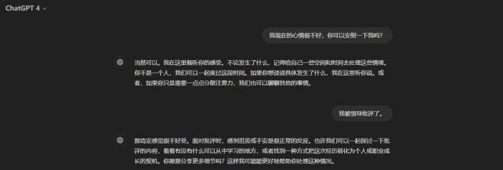

也正是这样的⼀种技术上的跨越 ，业内⼈会把2023年称为⼤模型的元年 ，因为它标志着⼈⼯智能 迈上了⼀个新的台阶 ，⽽且 ，属于⼤模型的时代也才刚刚开始。所以我们作为技术⼈ ，肯定不是仅仅  做⼀个“ 吃⽠群众” ，看热闹的同时 ，更多的精⼒都在积极跟进⼤模型的发展 ，深⼊理解并掌握其背  后的技术演进 ，以此来不断更新⾃⾝的技术视野。 当然 ，我们要研究的并不是表⾯的应⽤,  ⽽是其背后的强⼒基座模型-CPT 。

⽐较有意思的是 ，如果有在2023年起就开始使⽤

| ChatGPT |
| ------- |

类应⽤的⾮技术岗位的⼩伙伴 ，⼤概率都会有这样⼀些想法：⼤模型技术接近两年的技术发展并未带来显著的产品变⾰ ，⽆⾮是界⾯美观 了⼀些 ，功能增加了⼀些 ，例如现在⽀持上传图⽚ 、⽂件和构建插件等。

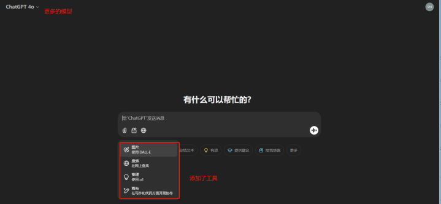

但通过表象应⽤去看本质 ，会发现⼤模型技术的迭代速度是远远快于其他领域的。其快速发展的 有两个核⼼⽅向：⼤模型⾃⾝的能⼒在不断变强以及⼤模型的对话效果在⼤幅提升。

•  ⼤模型⾃⾝的能⼒在不断变强

⼤模型有两个关键概念：原⽣能⼒和涌现能⼒。

所谓原⽣能⼒ ，指的是⼤模型基于特定的神经⽹络架构 ，在训练过程中通过不断摄⼊数据来学

习 ，最终具备解答特定领域问题的能⼒ 。这种能⼒就像是印在⼤模型“ ⼤脑” 中的知识 ，是其能够独 ⽴解答问题的基础。就如同我们在⼤学学习三年后能够解决⾼等数学问题⼀样 ，这种能⼒是通过学习 得来的 ，我们称之为原⽣能⼒ 。⼤模型的这种能⼒的提升在于：随着能获取到的数据量增加 ，开发者 可以基于先前性能表现为其构建更优质的学习数据 ，结合学习⽅法的不断迭代优化（技术上称之为预 训练技术或微调） ，⼤模型的原⽣能⼒就可以持续进化。这种进步的直观表现是模型的理解能⼒和回 答质量的提升。

其次 ，我们还会重点关注⼤模型的涌现能⼒ 。这⼀能⼒指的是 ，尽管⼤模型可能没有直接学习过   某些信息 ，但在与它对话时提供相关信息后 ，它能够类⽐和推理出解决⽅案。这类似于我们在准备⾼   考时做过的“ 五年⾼考三年模拟” 的题⽬ ，尽管⾼考题⽬不会与模拟题完全相同 ，但我们仍可以利⽤   相同的思维模式解决考试试题。⼤模型的这部分能⼒提升主要体现在：我们通过给它构造各种函数调   ⽤ 、处理复杂问题的过程⽰例（Agent能⼒） 等 ，在预训练或者微调阶段帮助它学习并强化这种能⼒。 这样 ，⼤模型就能在其应⽤的第⼆个⽅向上⸺即实际问题解决中发挥更加重要的作⽤ 。

•  ⼤模型的对话效果在⼤幅提升

⼤模型的能⼒⽏庸置疑 ，它在对话过程中能够回答和解决多种不同类型的任务 ，但存在着两个主 要问题：知识库更新不及时和⼤模型幻觉问题。

⾸先 ，关于知识库更新问题 ，正如我们上⾯刚刚提到的 ，⼤模型是在预训练或者微调阶段获取和 学习知识。这意味着 ，如果某些最新的信息未在训练数据中包含 ，⼤模型就⽆法提供相关答案。例

如 ，如果你问它“ 今天的天⽓怎么样？” 由于缺乏实时更新的数据 ，⼤模型⽆法给出正确的当前天⽓ 状况。

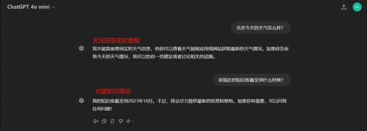

⽐较有意思的是：⼤模型的原⽣能⼒在不断的提升 ，它的对话效果好了 ，回答质量⾼了 ，但是我  们的需求也变得越来越复杂了。 单纯的对话应⽤已⽆法满⾜需求。这就促使我们进⼊了⼤模型应⽤的 第⼀个阶段⸺提⽰⼯程。

•  Stage 1： 提⽰⼯程

虽然⼤语⾔模型⾮常强⼤ ，但要有效使⽤它们并⾮易事。在开发者急于探索如何像处理传统算法

[模型那样通过微调快速迭代更新⼤模型的内部知识时，⼀篇极具启发性的论⽂ GPT-3 Language](https://arxiv.org/pdf/2005.14165)

| [In-ContextLearning](https://arxiv.org/pdf/2005.14165) |
| ------------------------------------------------------ |

少量标注的“ 输⼊-输出对”⽰例 ，在不需要⼤规模微调的情况下即可显著改善⼤模型的输出质量。这 ⼀发现开启了使⽤⼤模型的新⽅式 晕

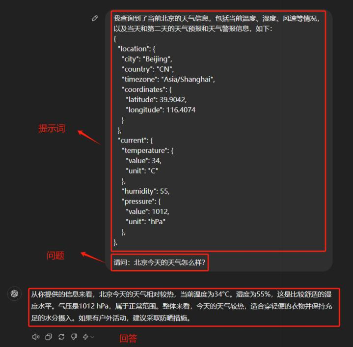

当提出问题后 ，⼤模型能够以⾃然语⾔返回响应 ，这是⽣成式⼈⼯智能的⼀⼤优点。有些任务确 实可以通过这种提⽰⼯程的⽅式引导⼤模型在对话过程中⽣成正确的回复 ，但这个过程最⼤的问题就 是需要⼈⼯介⼊ ，正如上⾯的例⼦中涉及到的北京的天⽓信息：

对于试图将⼤模型的响应与其他应⽤程序连接起来的开发⼈员来说 ，这就是⼀场噩梦。开发⼈员 通常使⽤正则表达式 (Regex) 或提⽰⼯程将输出转换为所需的格式 ，然后才能将其传递到另⼀个应⽤  程序 ，也就是说 ，这个过程中如果不需要⼈⼯介⼊ ，还想让它⾃动拿到这些信息 ，怎么做？

搞过开发的⼩伙伴对这种JSON数据应该⾮常熟悉 ，我们可以调⽤某个天⽓平台的API ，⽐如  [OpenWeather](https://openweathermap.org/) ，输⼊⼀个城市的关键词 ， 就能得到该城市当前的天⽓信息数据 ，也就是如上所⽰的    JSON形式 ，那么这样的信息 ，如何让⼤模型⾃动解析 ，就进⼊到了我们探索⼤模型应⽤的第⼆个阶段 - 函数调⽤。

•  Stage 2：函数调⽤

2023 年 7 ⽉ ，OpenAI为其 GPT 模型引⼊了函数调⽤功能。⼤模型发展到现在 ，所有热⻔的⼤模 型均已不同的形式让⾃⼰具备函数调⽤能⼒ 。这⾥指的可以调⽤的函数 ，我们通常称之为⼯具 ，在这 个阶段 ，我们要做的是描述该⼯具是⽤来做什么的 ，然后让⼤模型智能地选择输出包含调⽤这些函数  的参数的 JSON 对象。简⽽⾔之 ，它允许：

•  ⾃主决策：⼤模型可以智能地选择⼯具来回答问题。

•  可靠的解析：响应采⽤ JSON 格式 ，⽽不是更典型的类似对话的响应。

乍⼀看似乎没什么 ，但这就是⼤模型能够连接到外部系统的原因 ，⽐如通过具有结构化输⼊的    API ，本地的数据库 ， ⾃⼰编写的Python代码函数等等。有了这个功能 ，⼤模型在应⽤⽅⾯就开启了 ⽆限的可能性。 ⽐如：

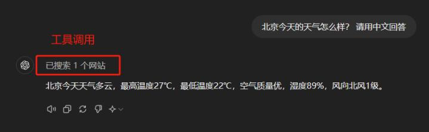

当⼤模型被赋予函数调⽤的能⼒时 ，它会在每次回答问题之前先检查可以调⽤哪些⼯具 ，并评估 ⽤⼾的问题是否需要调⽤这些⼯具。如果需要 ，它便会调⽤相应的⼯具 ，并根据⼯具返回的结果来构 筑答案。这整个过程都是⼤模型根据其⾃主判断的。所以在提升这⼀ ，阶段不仅极⼤地扩展了⼤模型 的应⽤范围 ，还在⼀定程度上解决了知识库更新不及时、⽆法获取实时信息及其带来的优势。

但是 ，在函数调⽤技术阶段趋于成熟的同时 ，我们仍然发现了另⼀个⾮常⼤的问题：⼤模型幻觉 晕

⼤模型直到现在依然普遍存在⼀个问题： 当⾯对⾃⼰不了解的问题时 ，它们有时会产⽣不准确甚  ⾄荒谬的回答 ，这就是所谓的⼤模型幻觉问题。 以上图中的例⼦为例 ， 当⼤模型被询问关于公司制度  的问题时 ，在没有任何技术⼿段介⼊的情况下 ，理想的回答应该是“ 我不知道”或“ 请提供⼀下你所  ⼊职公司的具体制度”等回答 ，⽽我们看到的却是⼤模型错误地从⼀个HR的角度进⾏了回复 ，这就会 给⽤⼾带来混淆和误导。

在

| Stage 1：提⽰⼯程 |
| ------------ |

中我们提到 ，⼤模型可以基于

| in-context learning |
| ------------------- |

的提⽰思想，

利⽤提供的背景信息来回答特定问题 ，直接引发了第⼀轮⼤模型应⽤落地的热潮 ，主要集中在本地知   识库问答领域。 因为⽆论是个⼈还是企业 ，都希望⼤模型能够根据其私有数据⸺如个⼈学习资料或公

司规章制度等让⼤模型准确⾼效地回答问题 ，充当智能客服、智能助理这样的⻆⾊。然⽽ ，⼀个显著   的挑战是数据量可能极⼤ ，从单个⽂件到数千G的⽂件系统不等 ，⽽⼤模型在对话处理上存在输⼊⻓度 限制 ，⽆法将所有数据作为背景信息直接处理。

因此 ，⾯对本地知识库问答的挑战 ，并考虑到⼤模型的幻觉问题和⻓度限制问题 ，出现的解决⽅ 案就是： RAG（ Retrieval-Augmented Generation） ，以此进⼊到了⼤模型应⽤的第三个阶段。

•  Stage 3. Retrieval-Augmented Generation

通过⼈们不断地对⼤模型领域的探索 ，⾮常多的实验论⽂能够证明 ， 当为⼤模型提供⼀定的上下 ⽂信息后 ，其输出会变得更稳定。那么 ，将知识库中的信息或掌握的信息先输送给⼤模型 ，再由⼤模 型服务⽤⼾ ，就是⼤家普遍达成共识的⼀个结论和⽅法。传统的对话系统、搜索引擎等核⼼依赖于检 索技术 ，如果将这⼀检索过程融⼊⼤模型应⽤的构建中 ，既可以充分利⽤⼤模型在内容⽣成上的能

⼒ ，也能通过引⼊的上下⽂信息显著约束⼤模型的输出范围和结果 ，同时还实现了将私有数据融⼊⼤ 模型中的⽬的 ，达到了双赢的效果。

所以我们才看到RAG的实现是包括两个阶段的：检索阶段和⽣成阶段。在检索阶段 ，从知识库中 找出与问题最相关的知识 ，为后续的答案⽣成提供素材。在⽣成阶段 ，RAG会将检索到的知识内容作 为输⼊ ，与问题⼀起输⼊到语⾔模型中进⾏⽣成。这样 ，⽣成的答案不仅考虑了问题的语义信息 ，还 考虑了相关私有数据的内容。如下图所⽰： 晕

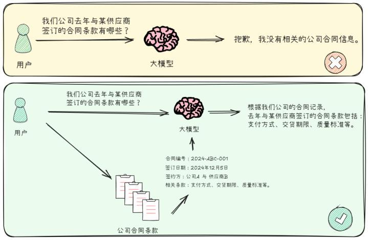

RAG技术解决的两个关键的问题是：

1\.  如果⽤⼾提出的问题 ，其对应的答案出现在⼀篇⽂章中 ，去知识库中找到⼀篇与⽤⼾输⼊相关的⽂ 章是很容易的 ，但是我们将检索到的这整篇⽂章直接放⼊ Prompt 中并不是最优的选择 ，因为其  中⼀定会包含⾮常多⽆关的信息 ，⽽⽆效信息越多 ，对⼤模型后续的推理影响越⼤。

2\.  任何⼀个⼤模型都存在最⼤输⼊的Token限制 ，⼀个流程中可能涉及多次检索 ，每次检索都会产⽣ 相应的上下⽂ ，⽆法容纳如此多的信息。

但事实上 ，如上⾯的流程图所⽰ ，⼤模型在整个RAG架构中占据的⽐例实际上⾮常⼩。我们主要 依赖⼤模型结合背景信息进⾏推理的能⼒ 。在RAG的多个优化阶段中 ，检索策略的作⽤更为重要。此 外 ，RAG的实际应⽤场景相对有限 ，⽆论是哪种形式的问答系统 ，都还未能达到我们所期望的通⽤⼈⼯智能（AGI） 的⽔平。 因此 ，现阶段进⼊到了AI Agent的全⾯爆发 ，这项技术直接体现的是我们

正在向期望的更复杂、更全⾯的技术⽅向发展。

⼈类具有⾮凡的能⼒ ，能够不断吸收信息、做出决定、采取⾏动、观察变化 ，然后做出下⼀个决 定。我们的整个⽣活是⼀个永⽆休⽌的观察、思想和⾏动的链条。通过将复杂的问题分解为更⼩的、 可管理的部分 ，并不断地借鉴前⼏代⼈的知识 ，我们⼈类已经取得了⻓⾜的进步。通⽤⼈⼯智能的最 终形态就是：我们能够转移这个概念到⼤模型上 ，使其不断做出新的决策 ，从⽽逐步接近更复杂问题 的解决⽅案。

⾄此 ，也就衍⽣出了 AI Agent （ ⼈⼯智能代理） 的基本概念：⼀个感知环境、处理信息并采取⾏ 动以实现特定⽬标的软件程序或系统。现阶段我们会把单⼀的⼤模型作为AI Agent 的核⼼ ，⽽不是全 部。 它应该是⼀个超级好的⼤语⾔模型 ，能够解释问题、观察环境并据此做出决策。如果在AI Agent

构建流程中添加⼀些将语⾳转换为⽂本的模型、解释图像内容的模型 ，就可以构建⾃⼰的  Jarvis

所需的⼀切。（复仇者联盟电影中钢铁侠的私⼈虚拟助理）

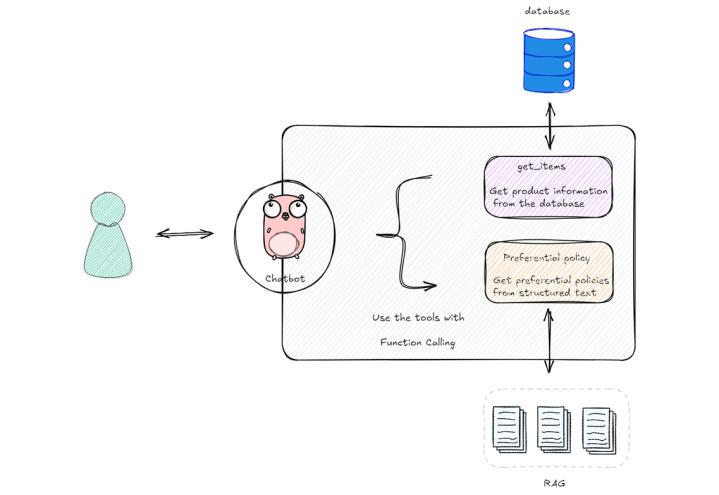

很好解释 ，通过提⽰⼯程 ， ⼤模型可以⽣成更类似于⼈类的响应。但当我们应⽤代理的概念时， 我们使⽤⼤模型不仅仅是回答问题 ，⽽是作为⼤脑处理它所看到的观察结果并决定下⼀步该做什么。 ⼈类处理问题就是这样：如果有⼀项任务需要解决 ，往往是去寻找能够帮助我们尽可能轻松地解决该 任务的⽅法和⼯具。如果我们不给⼤模型配备⾜够的⼯具 ，即便它知道要做什么 ，但不具备调⽤⼯具 的能⼒⼀切将会变为空谈。

从根本上讲 ，与严格遵守设定脚本或任务序列的传统⾃动化系统不同 ，⼈⼯智能代理具有感知、 解释、学习和适应的能⼒ 。将它们视为数字助理 ，不仅执⾏任务 ，还不断评估周围环境 ，从不同的交 互中学习 ，并做出决策以实现特定⽬标。 它们可以采取多种形式 ，从执⾏单⼀任务的简单软件到管理 复杂流程的复杂系统。⼈⼯智能代理在不可预测的环境中表现出⾊ ，其适应性和学习能⼒可以得到充 分利⽤ 。从浏览互联⽹ 、与应⽤程序交互、处理⼤量数据到参与交易 ，这些任务都可以委托给⼈⼯智 能代理。

根据Boss直聘数据统计 ，第四季度⼤模型开发岗位中 ，80%以上要求有Agent经验或开发能⼒；

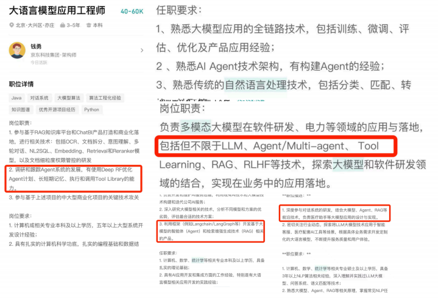

⽽⼤模型能⼒的不断增强和对话效果的不断提神 ，这两个⽅向其背后的技术栈迭代 ，可以总结如 下图所⽰ 晕 ：

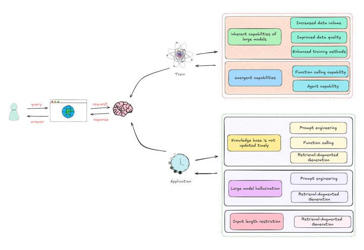

我们统计了2024年三、 四季度的⼤模型开发岗位热⻔⽅向如下图所⽰：

2\. AI Agent 的基本概念与快速⼊⻔

| Agent |
| ----- |

到底应该如何去定义？ 什么样的应⽤程序能算的上⼀个Agent?  到现在仍然没有特别

⼀个明确的说法和界定。有的⼈认为只要应⽤程序中集成了能够处理全领域知识查询的⼤模型 ，它就    可被视为⼀个 Agent ，⽽更多的⼀部⼈则认为这还远不够 ，他们会觉得只有当⼀个应⽤程序能像⼈类 ⼀样思考并⾃主处理复杂任务时 ，才真正符合  Agent 的标准。⼤家应该都听过这样⼀种观点：⼤模   型的发展使得⼈⼯通⽤智能（AGI） 在未来成为现实的可能性也越来越⼤。 在这个过程中 ，基础的Agent 扮演关键⻆⾊。 那么 ，什么样的最符合未来的发展趋势呢？

我们来看看⼤模型⾏业巨头OpenAI对于AI Agent 的理解。

在2024年7⽉初 ，Open AI的领导层在全体内部员⼯会议上的分享中 ，定义了AI的五个不同

阶段 ，共同去努⼒实现构建通⽤⼈⼯智能的最终⽬标。这五个阶段涵盖了从基本的聊天机器⼈到能够 完成整个组织⼯作的⾼级系统 ，⽽第五个阶段所需要具备的能⼒就是可以构造出⼀种智能且能够执⾏ 与⼈类相同的所有⼯作的  AI  。各个阶段如下所⽰：

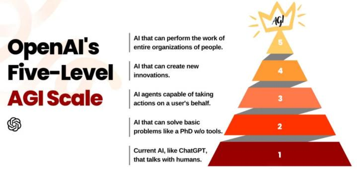

•  Stage 1. Chatbots的第⼀阶段称为聊天机器⼈。

OpenAI⾃⼰的ChatGPT就是这个阶段的最佳例⼦ ，它在  2022 年底发布时以其⽤⾃然语⾔交谈的能⼒震惊了世界。我们可以使⽤聊天机器⼈来提⾼其内部 ⽣产⼒ ，这些聊天机器⼈乍⼀看似乎⾮常聪明 ，但是通常会充满信⼼地编造和呈现虚假信息 ，所以如   果它们不能有效的融⼊私⼈/企业的数据 ，没有太多的商业⽤途。

•  Stage 2: Reasoners

OpenAI 定义的 AI 第⼆阶段为推理者。推理者是可以完成基本问题解决任务的系统 ，不需要借助任何⼯具 ，通过改进推理增强⼤模型处理各种任务的能⼒ ，这包括从做出重⼤科学发现到规划和构

建新的软件应⽤程序。正如 OpenAI 发布的o1-preview。

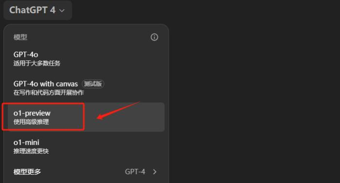

•  Stage 3: Agents阶段也就是我们⽬前⼀直在学习的相关内容 ，如LangGraph、Router Agent、ReAct,  我们通过⼯作流的编排去让应⽤程序⾃主完成⼀些特定的⽤户需求和任务⽬标 ，整个过程不需要任何的⼈⼯介⼊。

•  Stage 4: Innovators

第四个阶段的创新者是指：可以帮助发明的⼈⼯智能。这类应⽤帮助⼈们产⽣想法、编写代码和 进⾏创作 ，它们以专⻔开发的 AI系统的形式出现 ，以帮助原型、构建和制造物理产品。

•  Stage 5: Organizations

在 OpenAI 提出的⼈⼯智能的最后阶段： AI系统将变得⾜够先进和智能 ，可以完成整个组织

的⼯作 ，并将组织归类为智能路线图的最后⼀步。

⼈类的优势是能够吸收相对⼤量的信息 ，过滤掉不重要的细节 ，并根据关键信息做出决策。 ⽐如 在处理⼀件事情之前 ，我们通常会先将⼤问题分解为⼀个个⼩的假设 ，然后尝试通过观察逐步⽀持或 [反驳这些假设。从这个现实的观点出发，启发AIAgent 早期范式的⼀篇论⽂ REACT:](https://arxiv.org/pdf/2210.03629)

SYNERGIZING REASONING AND ACTING IN LANGUAGE MODELS 中使⽤“思维链提⽰”来模仿这 个概念 ，它将多步骤问题分解为中间步骤:

•  发起⼀项⾏动 ，让⼤模型观察所选环境的反馈

•  在流程中收集所有信息并使⽤它来决定下⼀步采取什么合适的⾏动

•  迭代地执⾏此操作来解决更⼤ 、更复杂的任务 ，使⽤⼀种称为“ 推理跟踪” 的⽅法 ，该⽅法涉及跟 踪整个过程所经历的步骤或阶段以得出结论或解决⽅案

如下图所⽰ ，整个过程是⼀个动态循环。代理不断从环境中学习 ，通过其⾏动影响环境 ，然后根 据环境的反馈继续调整其⾏动和策略。这种模式特别适⽤于那些需要理解和⽣成⾃然语⾔的应⽤场

景 ，如聊天机器⼈ 、 ⾃动翻译系统或其他形式的⾃动化客⼾⽀持。

⼀个这是更加感官性的认知如下图所⽰：

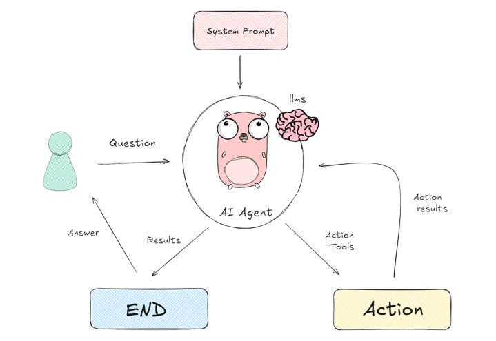

所以从这个过程中 ，我们就可以抽象出 AI Agent 的最经典 ，同时也是⽬前任何⼀套Agent 框架的 基本框架 ，如下图所⽰：

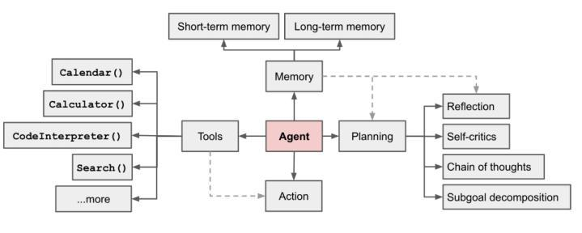

图⽚来源：<https://lilianweng.github.io/posts/2023-06-23-agent/> ， 强烈建议⼤家通篇阅读。

这套智能代理架构是指⾃主代理的结构化设计 ， ⾃主代理是能够独⽴感知环境、做出决策并采取 ⾏动以实现特定⽬标的系统或实体。该架构描述了代理的各个组件如何交互以促进智能⾏为。该架构 包含四个关键组件：

•  规划（ Planning） ：该组件将代理置于动态环境中 ，使其能够根据其⽬标和收集的信息制定策略并 规划未来的⾏动。

•  记忆（ Memory） ：该组件使智能体能够回忆过去的⾏为、经历和结果 ，这对于学习和适应⾄关重 要。

•  ⾏动（Action） ：该组件将智能体的决策转化为具体的⾏动 ，执⾏计划的任务以达到预期的结果。

•  ⼯具（Tools） ：拥有⼀名仅拥有LLM的代理⼈就像使⽤⼀台没有任何额外设备的计算机⼀样。⼯  具让代理能够使⽤互联⽹ 、获取特殊知识或与擅⻓特定事物的⼏种不同的⼈⼯智能模型⼀起⼯作， 从⽽使代理变得更加有⽤ 。

⼈⼯智能代理的特点是其主动性和决策能⼒ 。与被动⼯具不同 ，它们主动参与环境 ，做出选择并 采取⾏动来实现其指定⽬标。在企业环境中 ，⼈⼯智能代理通过⾃动化⽇常任务和分析复杂数据来提 ⾼效率 ，从⽽使员⼯能够专注于战略和创造性⼯作。这些代理补充⽽不是取代⼈类的努⼒ ，促进提⾼ 劳动⼒的⽣产⼒和效率。

让我们想象⼀个中国市场销售经理李华和他的⼈⼯智能助理的场景。

李华的⼯作⽇以检查电⼦邮件开始。他收到了来⾃潜在客⼾张伟的邮件 ，张伟对他公司提供的⾼ 效解决⽅案感兴趣。李华的⼈⼯智能助⼿直接连接到他的电⼦邮件系统 ，并且实时监控这些互动。根 据李华过去的回复习惯和公司提供的信息库 ，⼈⼯智能助⼿草拟了⼀封详细的回复。 邮件中不仅总结 了公司的⾼效解决⽅案及其优势 ，还根据张伟的需求定制了相关建议。

李华审阅了这份草稿邮件 ，加⼊了⼀些个⼈化的语句 ，以显得更加友好和专业 ，然后发送给了张 伟。随后 ，⼈⼯智能建议的后续步骤包括安排与张伟的电话会议、发送⼀份详细的产品介绍⼿册 ，或 者如果⼀周内没有得到回复 ，提醒李华进⾏跟进。李华同意了这些建议 ，⼈⼯智能助⼿随即整理他的

⽇程 ，通过电⼦邮件发送产品⼿册 ，并在他的电⼦⽇历中设置了跟进提醒。通过让⼈⼯智能处理这些 ⽇常但关键的任务 ，李华可以将更多精⼒投⼊到其他重要的业务拓展活动中。

这个过程中AI Agent 展现出来的关键能⼒：

•  AI Agent 利⽤⼤模型固有的语⾔理解能⼒来解释指令、上下⽂和⽬标。这使它们能够根据⼈类的提 ⽰⾃主或半⾃主地运作。

•  AI Agent 可以使⽤各种⼯具（ 阅读邮件 ，计算器、搜索引擎等）来收集信息并采取⾏动来完成分配 的任务。 它们的能⼒超出了单纯的语⾔处理范围。

•  AI Agent 能够展⽰复杂的推理技术 ，可以建⽴逻辑联系来得出结论和解决问题 ，⽽不仅仅是简单的 ⽂本理解。

•  AI Agent 可以通过将上下⽂和⽬标集成到其语⾔⽣成能⼒中 ，⽣成⽤于特定⽬的的定制⽂本 ，例如 电⼦邮件、报告和营销材料。

•  AI Agent 代理可以完全⾃主或半⾃主运⾏ ，需要与⽤⼾进⾏不同级别的交互。

⼈⼯智能代理的好处不仅仅是效率。 它们营造协作环境 ，降低⼈为错误的风险 ，并腾出宝贵的时 间进⾏创造性和战略性思考。从本质上讲 ，⼈⼯智能代理不仅仅是⼯具 ，更是⼯具。他们是补充⼈类 能⼒并推动创新的合作伙伴。

# 3. 从零到⼀实现⼀个L2级Agent

对于L2级的Agent级的Agent ，本质上就是⼀个具备推理能⼒的聊天机器⼈ ，我们可以直接调⽤某 个⼤模型构建多轮对话的问答流程。这⾥我们就从环境配置开始 ，从零到⼀带领⼤家在⾃⼰的电脑上  开发⼀个能与⼤模型交互的多轮问答机器⼈。

⾸先 ，我们需要在本地配置⼀个Python的开发环境 ，建议使⽤Anaconda3 的 Jupyter Lab ， 当

然 ，⼤家也可以选择使⽤ Pycharm 或者 Vscode ⼯具 ，其次 ，需要有⼀个有效的OpenAI API\_Key ，今 天直播体验课为⼤家准备了限量免费使⽤的API\_Key ，详细的安装教程和API\_KEY的免费领取 ，可以添 加专属助理：

在准备好API\_key并顺利启动Jupyter之后 ，即可测试能否顺利调⽤OpenAI⼤模型 ，测试代码如 下：

| 1 *# ! pip install openai* |
| -------------------------- |

| 1 *# ! setx OPENAI\_API\_KEY "your\_api\_key\_here"* |
| ---------------------------------------------------- |

注意：配置完成后 ，需要重启电脑 ，⽅可使环境变量⽣效。

| 1 from openai import OpenAI2 *# client = OpenAI(base\_url='https://ai.devtool.tech/proxy/v1')  # 如果不开启魔法**上⽹，则可以通过国内中转代理地址访问OpenAI*3 client = OpenAI() |
| ------------------------------------------------------------------------------------------------------------------------------------------------------ |

通过调⽤models .list()⽅法 ，可以查看到当前的API\_key都可以调⽤哪些模型。

| 1 print(client.models.list()) |
| ----------------------------- |

1 SyncPage\[Model]\(data=\[Model(id='o1-mini-2024-09-12', created=1725648979,

object='model', owned\_by='system'), Model(id='gpt-4o-mini',

created=1721172741, object='model', owned\_by='system'), Model(id='dall-e-2',

created=1698798177, object='model', owned\_by='system'), Model(id='gpt-4-1106-

preview', created=1698957206, object='model', owned\_by='system'),

Model(id='gpt-4o-mini-2024-07-18', created=1721172717, object='model',

owned\_by='system'), Model(id='gpt-3.5-turbo-instruct', created=1692901427,

object='model', owned\_by='system'), Model(id='babbage-002',

created=1692634615, object='model', owned\_by='system'), Model(id='davinci-

002', created=1692634301, object='model', owned\_by='system'),

Model(id='whisper-1', created=1677532384, object='model', owned\_by='openai-

internal'), Model(id='dall-e-3', created=1698785189, object='model',

owned\_by='system'), Model(id='gpt-4o-realtime-preview-2024-10-01',

created=1727131766, object='model', owned\_by='system'), Model(id='text-

embedding-3-small', created=1705948997, object='model', owned\_by='system'),

Model(id='gpt-3.5-turbo-16k-0613', created=1685474247, object='model',

owned\_by='openai'), Model(id='gpt-3.5-turbo-16k', created=1683758102,

object='model', owned\_by='openai-internal'), Model(id='gpt-4-0125-preview',

created=1706037612, object='model', owned\_by='system'), Model(id='gpt-4o-

realtime-preview', created=1727659998, object='model', owned\_by='system'),

Model(id='gpt-4-turbo-preview', created=1706037777, object='model',

owned\_by='system'), Model(id='omni-moderation-latest', created=1731689265,

object='model', owned\_by='system'), Model(id='gpt-4o-2024-05-13',

created=1715368132, object='model', owned\_by='system'), Model(id='omni-

moderation-2024-09-26', created=1732734466, object='model',

owned\_by='system'), Model(id='tts-1-hd-1106', created=1699053533,

object='model', owned\_by='system'), Model(id='chatgpt-4o-latest',

created=1723515131, object='model', owned\_by='system'), Model(id='gpt-4',

created=1687882411, object='model', owned\_by='openai'), Model(id='gpt-4-0613',

created=1686588896, object='model', owned\_by='openai'), Model(id='o1-mini',

created=1725649008, object='model', owned\_by='system'), Model(id='gpt-3.5-

turbo', created=1677610602, object='model', owned\_by='openai'), Model(id='gpt-

3.5-turbo-0125', created=1706048358, object='model', owned\_by='system'),

Model(id='o1-preview', created=1725648897, object='model', owned\_by='system'),

Model(id='o1-preview-2024-09-12', created=1725648865, object='model',

owned\_by='system'), Model(id='gpt-4-turbo', created=1712361441,

object='model', owned\_by='system'), Model(id='tts-1-hd', created=1699046015,

object='model', owned\_by='system'), Model(id='text-embedding-ada-002',

created=1671217299, object='model', owned\_by='openai-internal'), Model(id='gpt-

4-turbo-2024-04-09', created=1712601677, object='model', owned\_by='system'),

Model(id='gpt-3.5-turbo-1106', created=1698959748, object='model',

owned\_by='system'), Model(id='gpt-4o-audio-preview', created=1727460443,

object='model', owned\_by='system'), Model(id='gpt-4o-audio-preview-2024-10-

01', created=1727389042, object='model', owned\_by='system'), Model(id='tts-1',

created=1681940951, object='model', owned\_by='openai-internal'), Model(id='tts-

1-1106', created=1699053241, object='model', owned\_by='system'), Model(id='gpt-

4o-2024-08-06', created=1722814719, object='model', owned\_by='system'),

Model(id='gpt-3.5-turbo-instruct-0914', created=1694122472, object='model',

owned\_by='system'), Model(id='text-embedding-3-large', created=1705953180,

object='model', owned\_by='system'), Model(id='gpt-4o-realtime-preview-2024-12-

17', created=1733945430, object='model', owned\_by='system'), Model(id='gpt-

4o', created=1715367049, object='model', owned\_by='system'), Model(id='gpt-4o-

mini-realtime-preview', created=1734387380, object='model',

owned\_by='system'), Model(id='gpt-4o-mini-realtime-preview-2024-12-17',

created=1734112601, object='model', owned\_by='system'), Model(id='gpt-4o-2024-

11-20', created=1731975040, object='model', owned\_by='system'), Model(id='gpt-

4o-audio-preview-2024-12-17', created=1734034239, object='model',

owned\_by='system'), Model(id='gpt-4o-mini-audio-preview', created=1734387424,

object='model', owned\_by='system'), Model(id='gpt-4o-mini-audio-preview-2024-

12-17', created=1734115920, object='model', owned\_by='system'),

Model(id='ft:gpt-3.5-turbo-0613:acmr:recipe-ner:7rOJnQow', created=1692959219,

object='model', owned\_by='acmr-wtr5tv'), Model(id='ft:babbage-

002:acmr::8LjwL7pi', created=1700192173, object='model', owned\_by='acmr-

wtr5tv'), Model(id='ft:gpt-3.5-turbo-1106:acmr::8NFcWDKd', created=1700552280,

object='model', owned\_by='acmr-wtr5tv'), Model(id='ft:gpt-3.5-turbo-

1106:acmr::8NG1DFJy', created=1700553811, object='model', owned\_by='acmr-

wtr5tv'), Model(id='ft:gpt-3.5-turbo-1106:acmr::8NGu7dB7', created=1700557216,

object='model', owned\_by='acmr-wtr5tv'), Model(id='ft:gpt-3.5-turbo-

1106:acmr::8NGecRZn', created=1700556254, object='model', owned\_by='acmr-

wtr5tv'), Model(id='ft:gpt-3.5-turbo-1106:acmr::8NGoWxGp', created=1700556868,

object='model', owned\_by='acmr-wtr5tv'), Model(id='ft:gpt-3.5-turbo-

1106:acmr::8NcxfjOE', created=1700642003, object='model', owned\_by='acmr-

wtr5tv'), Model(id='ft:gpt-3.5-turbo-1106:acmr::8NISonhF', created=1700563210,

object='model', owned\_by='acmr-wtr5tv'), Model(id='ft:gpt-3.5-turbo-

1106:acmr::8NIBwIXY', created=1700562164, object='model', owned\_by='acmr-

wtr5tv'), Model(id='ft:gpt-3.5-turbo-1106:acmr::8NIJWEAY', created=1700562634,

object='model', owned\_by='acmr-wtr5tv'), Model(id='ft:gpt-3.5-turbo-

1106:acmr::8NIZytXn', created=1700563654, object='model', owned\_by='acmr-

wtr5tv'), Model(id='ft:babbage-002:acmr::8ONnv6dd', created=1700822067,

object='model', owned\_by='acmr-wtr5tv'), Model(id='ft:gpt-3.5-turbo-

1106:acmr::8PSAdThJ', created=1701077179, object='model', owned\_by='acmr-

wtr5tv'), Model(id='ft:gpt-3.5-turbo-1106:acmr::8Okwb8qA', created=1700911017,

object='model', owned\_by='acmr-wtr5tv'), Model(id='ft:gpt-3.5-turbo-

1106:acmr::8Onym3eo', created=1700922684, object='model', owned\_by='acmr-

wtr5tv'), Model(id='ft:gpt-3.5-turbo-1106:acmr::8P3jjlnu', created=1700983255,

object='model', owned\_by='acmr-wtr5tv'), Model(id='ft:gpt-3.5-turbo-

1106:acmr::8P7Wp9ZW', created=1700997831, object='model', owned\_by='acmr-

wtr5tv'), Model(id='ft:gpt-3.5-turbo-1106:acmr::8P8ICr9h', created=1701000768,

object='model', owned\_by='acmr-wtr5tv'), Model(id='ft:gpt-3.5-turbo-

1106:acmr::8P8JcJOS', created=1701000856, object='model', owned\_by='acmr-

wtr5tv'), Model(id='ft:gpt-3.5-turbo-1106:acmr::8P8MZq4B', created=1701001039,

object='model', owned\_by='acmr-wtr5tv'), Model(id='ft:gpt-3.5-turbo-

1106:acmr::8P8eJWFu', created=1701002139, object='model', owned\_by='acmr-

wtr5tv'), Model(id='ft:gpt-3.5-turbo-1106:acmr::8P8jDYPa', created=1701002444,

| 1 model\_list = client.models.list().data |
| ----------------------------------------- |

| 1 for usable\_model\_name in model\_list:2     print(usable\_model\_name.id) |
| ---------------------------------------------------------------------------- |

17 gpt-4-turbo-preview

18 omni-moderation-latest

19 gpt-4o-2024-05-13

20 omni-moderation-2024-09-26

21 tts-1-hd-1106

22 chatgpt-4o-latest

23 gpt-4

24 gpt-4-0613

25 o1-mini

26 gpt-3.5-turbo

27 gpt-3.5-turbo-0125

28 o1-preview

29 o1-preview-2024-09-12

30 gpt-4-turbo

31 tts-1-hd

32 text-embedding-ada-002

33 gpt-4-turbo-2024-04-09

34 gpt-3.5-turbo-1106

35 gpt-4o-audio-preview

36 gpt-4o-audio-preview-2024-10-01

37 tts-1

38 tts-1-1106

39 gpt-4o-2024-08-06

40 gpt-3.5-turbo-instruct-0914

41 text-embedding-3-large

42 gpt-4o-realtime-preview-2024-12-17

43 gpt-4o

44 gpt-4o-mini-realtime-preview

45 gpt-4o-mini-realtime-preview-2024-12-17

46 gpt-4o-2024-11-20

47 gpt-4o-audio-preview-2024-12-17

48 gpt-4o-mini-audio-preview

49 gpt-4o-mini-audio-preview-2024-12-17

50 ft:gpt-3.5-turbo-0613:acmr:recipe-ner:7rOJnQow

51 ft:babbage-002:acmr::8LjwL7pi

52 ft:gpt-3.5-turbo-1106:acmr::8NFcWDKd

53 ft:gpt-3.5-turbo-1106:acmr::8NG1DFJy

54 ft:gpt-3.5-turbo-1106:acmr::8NGu7dB7

55 ft:gpt-3.5-turbo-1106:acmr::8NGecRZn

56 ft:gpt-3.5-turbo-1106:acmr::8NGoWxGp

57 ft:gpt-3.5-turbo-1106:acmr::8NcxfjOE

58 ft:gpt-3.5-turbo-1106:acmr::8NISonhF

59 ft:gpt-3.5-turbo-1106:acmr::8NIBwIXY

60 ft:gpt-3.5-turbo-1106:acmr::8NIJWEAY

61 ft:gpt-3.5-turbo-1106:acmr::8NIZytXn

62 ft:babbage-002:acmr::8ONnv6dd

63 ft:gpt-3.5-turbo-1106:acmr::8PSAdThJ

如果我们想与上述列出的这些模型进⾏对话时 ，就需要向OpenAI提供的某个端点发送⼀个  HTTP 请求。简单来说 ，  API 端点就像⼀个“ ⻔ ” ，它连接了你和某个服务。你通过

这个“ ⻔ ” 向服务发送请求 ，并从它那⾥获得你需要的信息或结果。对于  OpenAI 的模型来说 ，这

个端点就是你向模型发送请求、获取回复的地⽅。

[OpenAI Chat Completion EndPoint: https://platform.openai.com/docs/api-reference/chat/create](https://platform.openai.com/docs/api-reference/chat/create)

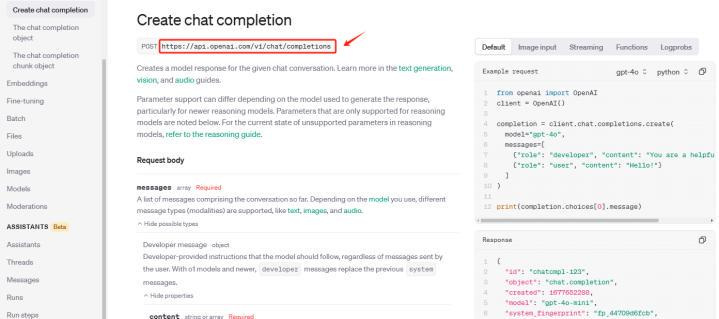

如上所⽰，OpenAI提供的API 端点地址 ，⽤于和它的模型（ ⽐如 GPT-4） 进⾏对话。 当你发送⼀条消息或问题时， 会通过这个端点处理你的请求 ，并返回⼀个由模型⽣成的回答。其过程如下：

•  Step 1. 发送请求: 我们向发送⼀个请求 ，告诉模型你想要什么样的回答。这个请求会包含你给模型的输⼊（ ⽐如你问的问题或者你要进 ⾏的对话内容）。

•  Step 2. 模型处理请求:  OpenAI 的模型会收到你的请求 ，理解你要的内容 ，并⽣成相应的回答。

•  Step 3. 获取响应: 模型⽣成的回答会通过这个端点返回给你 ，你就能看到模型给出的响应了。

这个过程看起来可能⽐较复杂 ，因为它涉及到向  OpenAI 的服务器发送  HTTP 请求、处理请求的响应、进⾏⾝份验证等⼀系列操作 ，但实际上 ，  OpenAI 提供了⾮常⽅便的⼯具来简化这⼀过程，调⽤封装好的⽅法 ，就能轻松与OpenAI的模型进⾏交互。

OpenAI提供了官⽅的,  封装在

| client .chat .completions .create |
| --------------------------------- |

⽅法中 ，所以我们在使⽤Python编程语⾔的时候 ，则可以直接通过：

[OpenAI Chat Completion EndPoint: https://platform.openai.com/docs/api-reference/chat/create](https://platform.openai.com/docs/api-reference/chat/create)

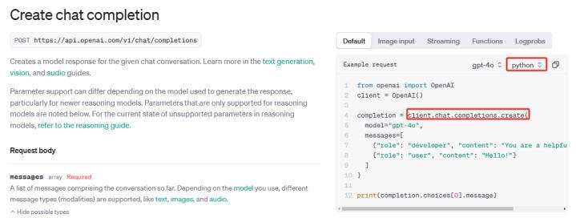

⽽在使⽤  SDK 的过程中我们要明确的是：虽然  SDK 简化了使⽤过程 ，但在构建这些  SDK 时， 还是需要⼀些基础的参数⽀撑 ，⽐如  API 密钥、模型选择、消息格式等 ，这些参数确保了请求的正   确性和有效性。这⾥我们先关注下必须要传⼊的参数 ，如下所⽰：

| 层级       | 描述        | 必填项 | 说明                                |
| -------- | --------- | --- | --------------------------------- |
| model    | 要使⽤的模型 ID | 必填  | 指定模型的 ID ，查看模型 端点兼容表以获取⽀持的  模型类型。 |
| messages | 所有消息的集合   | 必填  |                                   |

|                       |                                     |                                          | 包含整个对话的消息数组。根据模型⽀持的不同 类型 ，可以是⽂本、图⽚ 、⾳频等。                                                                        |
| --------------------- | ----------------------------------- | ---------------------------------------- | --------------------------------------------------------------------------------------------------------------- |
| 卜── Developer message | 开发者提供的指令 ，模型 需要遵循这些指令 ，⽆论 ⽤户发送什么消息。 | content (消息内容)role (角⾊: developer)       | content  : 开发者消息内 容role  : 消息作者角⾊， 固定为 "developer"name (可选): 消息作者 的名字                                           |
| 卜── System message    | 开发者提供的指令 ，通常 ⽤于配置模型⾏为。              | content (消息内容) role (角⾊: system)         | content  : 系统消息内 容role  : 消息作者角⾊， 固定为 "system"name (可选): 消息作者 的名字                                               |
| 卜── User message      | ⽤户发送的消息 ，包含提 ⽰或额外的上下⽂信息。            | content (消息内容) role (角⾊: user)           | content  : ⽤户消息内 容role  : 消息作者角⾊， 固定为 "user"name (可选): 消息作者 的名字                                                 |
| 卜── Assistant message | 模型对⽤户消息的回应                          | content (消息内容)    role (角⾊: assistant)   | content  : 模型回应的消 息内容（如果包含tool\_calls 或function\_call ，则不 必填）role  : 消息作者角⾊， 固定为 "assistant"name (可选): 消息作者 的名字 |
| 卜──  卜── tool\_calls  | 模型调⽤的⼯具 ，通常⽤ 于外部函数调⽤                | id (⼯具调⽤ ID) type (⼯具类型)function (调⽤的函数) | id  : 唯⼀标识符type : 当前⽀持的类型 为  functionfunction  : 调⽤的具体 函数 ，包括  name 和                                           |
|                       |                                     |                                          |                                                                                                                 |
| 卜──  L── function     | 模型调⽤的函数                             | name (函数名)arguments (函数参数)               | name  : 调⽤的函数名arguments : 传递给函 数的参数（JSON 格式）                                                                    |

| 卜── Tool message | ⼯具消息 ，通常⽤于模型 与外部⼯具交互的响应 | role (角⾊: tool)content (消息内容)tool\_call\_id (⼯具调 ⽤ID) | role  : 固定为 "tool"content : ⼯具返回的消 息内容tool\_call\_id  : 此消息 对应的⼯具调⽤ ID |
| ---------------- | ----------------------- | ----------------------------------------------------- | ---------------------------------------------------------------------- |

在使⽤OpenAI时 ，必须传⼊两个关键参数：

1\.  model：这个参数指定了要使⽤的模型的 ID。例如 ，你可以选择 GPT-4 或其他 OpenAI 提供的模

型。模型的 ID 确定了你将与哪个版本的模型进⾏交互 ，因此它是必填项。

2.messages：这个参数包含了整个对话的消息集合。 它是⼀个消息数组 ，每个消息都包含⼀个role （角⾊ ，表⽰消息的发送者 ，如开发者、系统、⽤⼾或助⼿）和（消息内容）。

参数是与模型进⾏有效对话的基础 ，确保模型能根据上下⽂正确⽣成回应。

这两个参数是 SDK 必须传⼊的核⼼内容，

确定了你选择的模型 ，⽽messages则提供了对话的上下⽂ ，模型根据这些信息来⽣成相应的输出。

当我们通过⼤模型的API进⾏会话交互时 ，数据交换的格式如下图所⽰ 晕

上图中展⽰的 JSON 结构是API交互中常⽤的数据格式。不仅仅是 OpenAI 的 GPT 模型 ，其他

在线模型或者开源模型均遵循这种规范。在这个例⼦中 ，我们看到有⼀个对象包含两个键值

对： "role": "user"和"content": "your question"。这表⽰交互中⽤⼾的角⾊被标识为"user" ，并且⽤ ⼾的输⼊内容为"your question"。这种格式化的数据结构允许API清晰地解析出发送者的角⾊和对话   内容 ，从⽽进⾏有效的处理和响应。

要发送到  GPT 模型的问题必须包含在字典列表中。我们使⽤OpenAI的Python SDK来调⽤GPT 模型以获取聊天回复 ，来看代码实现：

| 1 ChatCompletionMessage(content='你好！我是ChatGPT，由OpenAI开发的⼈⼯智能语⾔模型。我 的主要功能是理解和⽣成⾃然语⾔⽂本 ，可以帮助回答各种问题、提供建议、撰写⽂章、翻译语⾔等等。⽆论你是在学习、⼯作还是⽇常⽣活中遇到任何问题 ，都可以随时向我咨询。我会尽⼒为你提供准 确、有⽤的信息和帮助。很⾼兴认识你！ ', refusal=None, role='assistant', audio=None,  function\_call=None, tool\_calls=None) |
| ------------------------------------------------------------------------------------------------------------------------------------------------------------------------------------------------------------------------------------------------------------------------ |

当⼤模型处理完⽤户的输⼊ ，它会返回⼀个响应对象。此时我们便可以从响应体中⼤提取模型⽣ 成的消息内容。

| 1 completion |
| ------------ |

上述的交互过程如下图所⽰ 晕

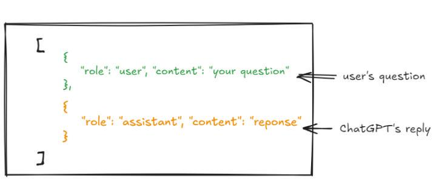

| 1 completion.choices\[0].message |
| -------------------------------- |

| 1 ChatCompletionMessage(content='你好！我是ChatGPT，由OpenAI开发的⼈⼯智能语⾔模型。我 的主要功能是理解和⽣成⾃然语⾔⽂本 ，可以帮助回答各种问题、提供建议、撰写⽂章、翻译语⾔等等。⽆论你是在学习、⼯作还是⽇常⽣活中遇到任何问题 ，都可以随时向我咨询。我会尽⼒为你提供准 确、有⽤的信息和帮助。很⾼兴认识你！ ', refusal=None, role='assistant', audio=None,  function\_call=None, tool\_calls=None) |
| ------------------------------------------------------------------------------------------------------------------------------------------------------------------------------------------------------------------------------------------------------------------------ |

| 1 print(completion.choices\[0].message.content) |
| ----------------------------------------------- |

| 1 你好！我是ChatGPT，由OpenAI开发的⼈⼯智能语⾔模型。我的主要功能是理解和⽣成⾃然语⾔⽂本， 可以帮助回答各种问题、提供建议、撰写⽂章、翻译语⾔等等。⽆论你是在学习、⼯作还是⽇常⽣活中  遇到任何问题 ，都可以随时向我咨询。我会尽⼒为你提供准确、有⽤的信息和帮助。很⾼兴认识你！ |
| -------------------------------------------------------------------------------------------------------------------------------------------------- |

接下来 ，围绕这种⼀问⼀答的逻辑 ，我们就可以构建⾮常简单的While循环来⽣成⼀个持续对话的 交互程序 ，代码如下所⽰：

36      2(H - y) + 4y = L \\\\

37      2H - 2y + 4y = L \\\\

38      2H + 2y = L \\\\

39      2y = L - 2H \\\\

40      y = \frac{L - 2H}{2}

41      \\]

42    - 有了  \\( y \\)，再代回  \\( x = H - y \\) 可得  \\( x \\)。

43

44 ### ⽰例 45

46 \*\*题⽬ \*\*：笼⼦⾥有35个头 ，94条腿 ，问有多少只鸡和兔？ 47

48 \*\*解答\*\*： 49

50 1. 设鸡的数量为  \\( x \\) 只 ，兔的数量为  \\( y \\) 只。 51 2. 根据头的数量：

52    \\\[

53    x + y = 35

54    \\]

55 3. 根据腿的数量： 56    \\\[

57    2x + 4y = 94

58    \\]

59 4. 解第⼀⽅程得： 60    \\\[

61    x = 35 - y

62    \\]

63 5. 将  \\( x = 35 - y \\) 代⼊第⼆⽅程：

64    \\\[

65    2(35 - y) + 4y = 94 \\\\

66    70 - 2y + 4y = 94 \\\\

67    70 + 2y = 94 \\\\

68    2y = 24 \\\\

69    y = 12

70    \\]

71 6. 将  \\( y = 12 \\) 代⼊   \\( x = 35 - y \\)： 72    \\\[

73    x = 35 - 12 = 23

74    \\] 75

76 \*\*答案\*\*：笼中有23只鸡和12只兔。 77

78 ### ⼩结 79

80 “鸡兔同笼”问题的关键在于正确设定变量 ，建⽴合理的⽅程 ，然后通过代数⽅法求解。这类问题不仅考 查基础的代数能⼒ ，还能培养逻辑思维和问题解决的能⼒。

81

82

83

84 ⽤⼾提问：  什么是机器学习呢？ 85

86

87 模型回复 :机器学习（ Machine Learning）是⼈⼯智能（AI） 的⼀个重要分⽀ ， 旨在让计算机系统通 过数据和经验⾃动改进其性能 ，⽽⽆需明确编写程序。换句话说 ，机器学习使计算机能够从数据中学    习、发现模式并做出预测或决策。

88

89 ### 机器学习的基本类型 90

91 1. \*\*监督学习（Supervised Learning） \*\*

92    - \*\*定义\*\*：在这种⽅法中 ，模型在带有标签的训练数据上进⾏学习 ，即每个输⼊数据都有对应的 正确输出。

93    - \*\*应⽤ \*\*：例如 ， 电⼦邮件分类（垃圾邮件与否）、图像识别（识别图⽚中的物体）、房价预测 等。

94

95 2. \*\*⽆监督学习（ Unsupervised Learning） \*\*

96    - \*\*定义\*\*：模型在没有标签的训练数据上进⾏学习 ，主要⽤于发现数据中的潜在结构或模式。

97    - \*\*应⽤ \*\*：例如 ，客⼾分群、市场篮分析、降维（如主成分分析）等。 98

99 3. \*\*半监督学习（Semi-supervised Learning） \*\*

100    - \*\*定义\*\*：结合了监督和⽆监督学习 ，利⽤少量带标签的数据和⼤量未标签的数据进⾏训练。

101    - \*\*应⽤ \*\*：常⽤于需要⼤量数据但标注成本⾼的场景 ，如图像分类和语⾳识别。 102

103 4. \*\*强化学习（ Reinforcement Learning） \*\*

104    - \*\*定义\*\*：模型通过与环境的交互 ，依据奖励和惩罚来学习最优策略。

105    - \*\*应⽤ \*\*：例如 ，游戏AI（如AlphaGo）、机器⼈控制、 ⾃动驾驶等。 106

107 ### 常⻅的机器学习算法

108

109 - \*\*线性回归（ Linear Regression） \*\*：⽤于预测连续值 ，如房价预测。

110 - \*\*逻辑回归（ Logistic Regression） \*\*：⽤于分类问题 ，如垃圾邮件检测。

111 - \*\*决策树（ Decision Trees） \*\*和\*\*随机森林（ Random Forest） \*\*：⽤于分类和回归任务 ，具 有良好的解释性。

112 - \*\*⽀持向量机（Support Vector Machines, SVM） \*\*：⽤于分类和回归 ，尤其在⾼维数据中表现 优异。

113 - \*\*神经⽹络（ Neural Networks） \*\*和\*\*深度学习（ Deep Learning） \*\*：擅⻓处理复杂的模式 识别任务 ，如图像和语⾳识别。

114

115 ### 机器学习的应⽤领域

116

117 - \*\* ⾃然语⾔处理（ NLP） \*\*：例如 ，机器翻译、语⾳识别、情感分析。

118 - \*\*计算机视觉\*\*：例如 ， ⾃动驾驶、⾯部识别、 医疗影像分析。

119 - \*\*⾦融科技\*\*：例如 ，信⽤评分、股票预测、欺诈检测。

120 - \*\*推荐系统\*\*：例如 ， 电商平台的商品推荐、视频平台的内容推荐。

121 - \*\*医疗健康\*\*：例如 ，疾病预测、个性化治疗⽅案、药物发现。

如上所⽰的例⼦： 正如我们之前所讨论的 ，单个⼤模型并不具备记忆和状态跟踪的能⼒ ，它仅将  每个输⼊视为⼀个独⽴的事件来处理。这在多轮对话中带来的实际的问题就是：⼤模型⽆法根据先前  的对话内容进⾏综合性的回应。 以这个例⼦来说 ，我在⼀轮对话中告诉模型我的名字是⽊⽻ ，然后在 下⼀轮询问我的名字 ，模型却⽆法记起这⼀信息。这种缺乏连贯性的表现与我们⽇常的交互⽅式明显  不符。 因此 ，为了与⼤模型进⾏有意义的对话 ，我们需要做的是：将对话记录不断地反馈给⼤模型 ， 也就是如下所述的形式 晕

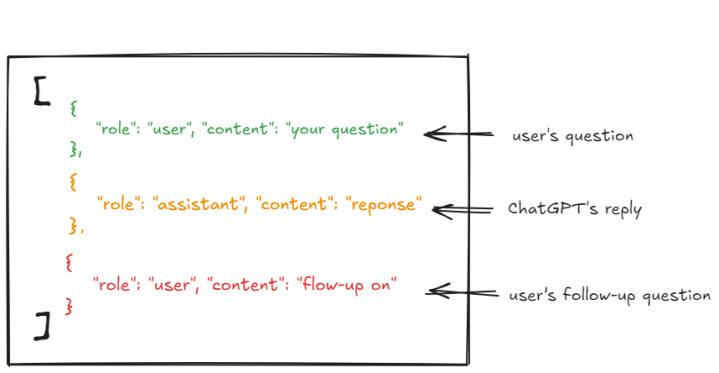

如上图所⽰ ，我们需要将每次的对话和⼤模型的回复 ， 不断地追加到传递给 API 的消息字典列表 中。这样 ，⼤模型就能够知道我们之前提出的问题及其提供的答复。所以代码更新如下：

| 1 ⽤户提问：    你好 ，我叫⽊⽻ 234 模型回复 :你好 ，⽊⽻！ 很⾼兴认识你。有什么我可以帮忙的吗？5678 ⽤户提问：    请问我叫什么？ 91011 模型回复 :是的 ，您叫⽊⽻ 。有什么我可以帮您的吗？12131415 ⽤户提问：    退出 |
| ----------------------------------------------------------------------------------------------------------------------------------- |

| 1 messages |
| ---------- |

| 1 \[{'role': 'user', 'content': '你好 ，我叫⽊⽻ '},2  {'role': 'assistant', 'content': '你好 ，⽊⽻！ 很⾼兴认识你。有什么我可以帮忙的 吗？ '},3  {'role': 'user', 'content': '请问我叫什么？ '},4  {'role': 'assistant', 'content': '是的 ，您叫⽊⽻ 。有什么我可以帮您的吗？ '}] |
| -------------------------------------------------------------------------------------------------------------------------------------------------------------------------------------------------------------------------- |

如上案例所⽰ ，⼤模型可以通过不断追加会话消息列表来模拟记忆功能 ，这是聊天机器⼈应⽤的  ⼀种常见实践。 借助于⼤模型的处理能⼒和这种短期记忆机制 ，构造出来的问答系统能够与⽤户进⾏ 交互并帮助解答问题。如果没有其他技术的结合 ，这种系统就属于L2级 AI产品即聊天机器⼈的范畴。

当然 ，除此必要的两个参数 ，还有其他可选参数可以在对话过程中进⾏配置 ，如下图所⽰：

[OpenAI Chat Completion EndPoint: https://platform.openai.com/docs/api-reference/chat/create](https://platform.openai.com/docs/api-reference/chat/create)

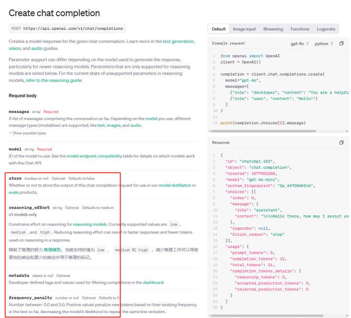

⼤家可以⾃⾏尝试。接下来我们要做的是：借助⼀个开源项⽬开始实现⼀个像ChatGPT⼀样的AI 应⽤产品。

# 4. 本地部署 Agent 问答系统

Open WebUI是⼀个开源项⽬ ，该项⽬提供⼀个⽤⼾友好的Web界⾯ ，使开发者和⾮技术⽤⼾都 能够⽅便地与机器学习模型、⼤模型等进⾏交互。该项⽬⽀持多种流⾏的模型 ，如⼤语⾔模型、 图像 ⽣成模型（例如Stable Diffusion）等 ，⽤⼾⽆需编写代码即可在浏览器中轻松操作 ，进⾏⽂本⽣成、 图像创作等任务。作为⼀个开源项⽬ ，Open WebUI 提供了⾼可定制性 ，⽀持插件扩展 ，并且可以在 本地部署 ，适⽤于希望在私有环境中运⾏模型的⽤⼾ 。 ⾃发布以来 ，Open WebUI受到了⼴泛关注 ， ⽬前在 GitHub 上已获得 51.5k 星标 ，成为开发者社区中备受推崇的⼯具之⼀。

Open-web u i Github : <https://github.com/open-webui/open-webui>

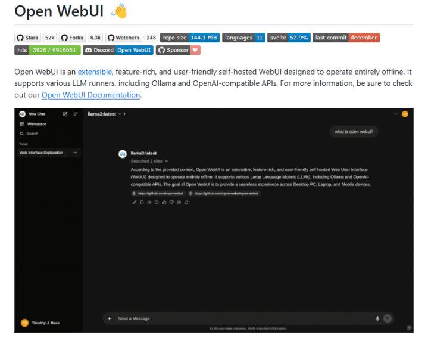

本地化部署和必要的配置我们已经给⼤家全部打包编译好了 ，直接领取可运⾏的全部代码 ，即可 快速在本地启动⼀个⽹页端的⼤模型智能对话应⽤ 。同时 ，前提是需要安装Pycharm⼯具 ，详细的安 装教程和源码可以添加专属助理领取：

我们已经随同课件给⼤家提供了⼀个

| open-webui-main |
| --------------- |

的压缩包 ，⼤家下载到本地后先进⾏解压 ，然后在PyCharm中顶部菜单中选择

| File →   Open |
| ------------- |

如下所⽰：

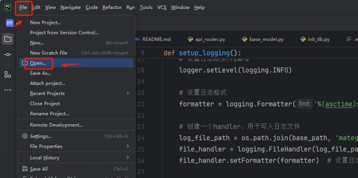

在⽂件浏览窗⼝中 ，选择解压后的 开该⽂件夹并将其作为当前项⽬ 。

| open-webui-main |
| --------------- |

⽂件夹 ，点击会打

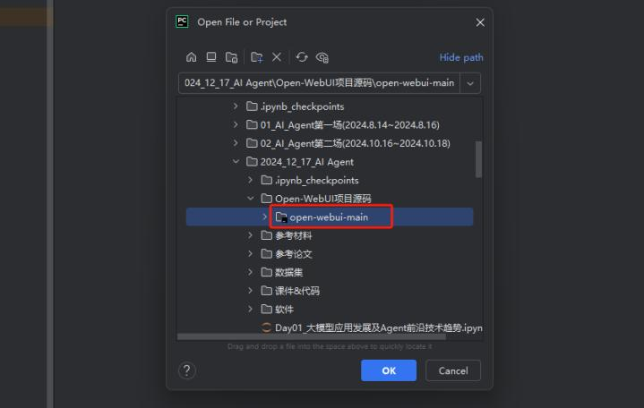

在开始运⾏

| open-webui-main |
| --------------- |

项⽬之前 ，⾸先需要给该项⽬配置⼀个本地的Python运⾏环境。 因为⼤多数项⽬会依赖于外部库和模块 ，不安装或不配置正确的依赖 ，就会导致依赖缺失、环境冲突等问题 ，⽆法正常启动项⽬ 。在PyCharm中配置本地Python

环境⾮常简单 ，⾸先点击

| File →   Settings |
| ----------------- |

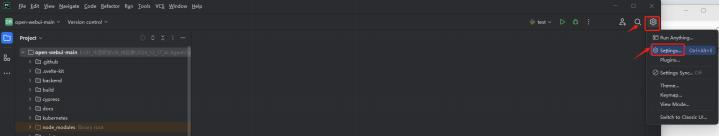

置 ，点击右侧

| Add Interpreter |
| --------------- |

按钮 ，选择添加⼀个本地代码解释器 ，即点击

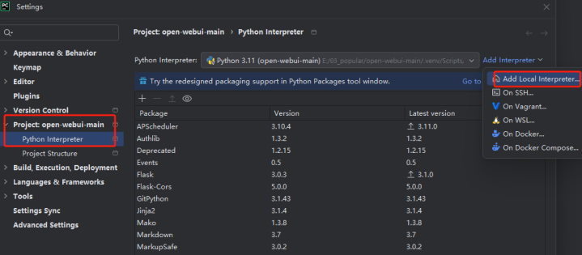

选择新建 ，即 New  。 这⾥强烈不建议选择已有的环境 ，有概率会造成依赖包的冲突导致项⽬⽆法正常启动。

点击确定后，PyCharm会⾃动创建⼀个虚拟环境 ，同时也会⾃动设置好虚拟环境的默认路径。

耐⼼等待配置完成即可。

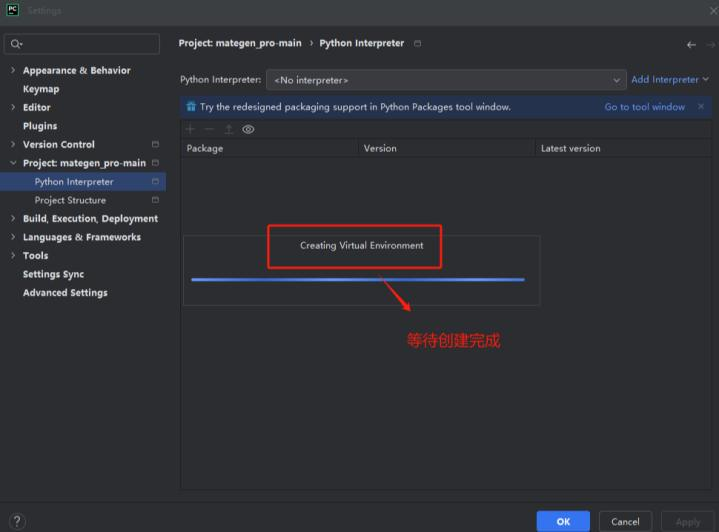

配置完解释器后 ，会看到—个Python页⾯ ，其中列出了当前环境中已安装

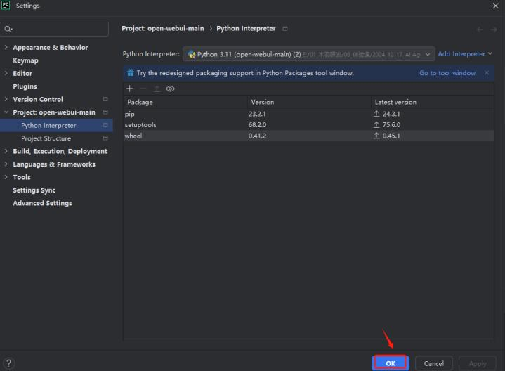

项⽬⽬录下有—个

| requirements .txt |
| ----------------- |

⽂件 ，⾥⾯列出了所有必需的依赖包。

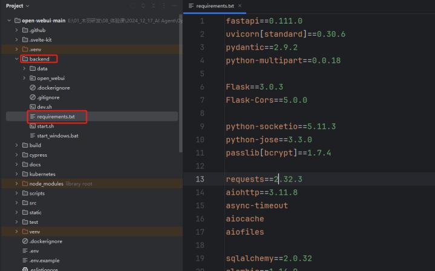

然后再开始安装依赖 ，如下代码所⽰：

| 1 pip install -r requirements.txt |
| --------------------------------- |

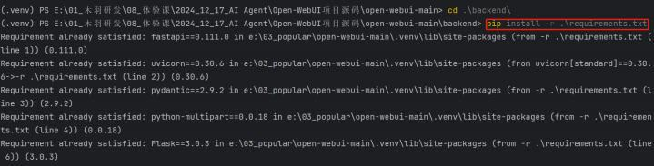

执⾏到这—步，

| MateGen Pro |
| ----------- |

项⽬运⾏的环境就全部配置完成了。启动则只需要—个命令：

| 1 .\start\_windows.bat |
| ---------------------- |

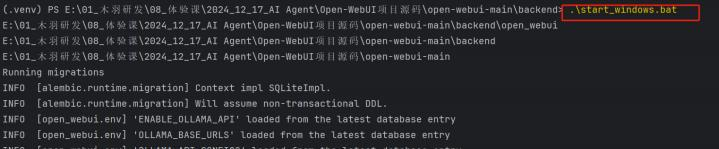

⽤⼾名为admin@admin.com ，密码是：admin ， 该项⽬中给⼤家加⼊了⼀个免费可直接调⽤的 GPT模型连接 ，可直接进⾏问答回复。

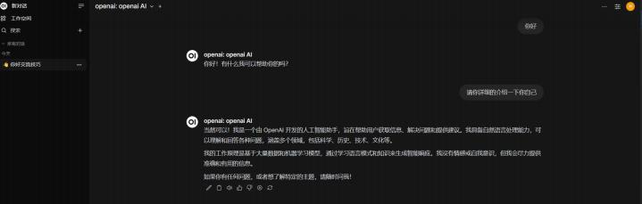

⼈⼯智能代理代表了技术领域的变⾰⼒量。 它们的能⼒ ，从简单的⾃动化到像 Devin 这样的系统 所展⽰的独创性 ，都在迅速扩展。我们正在见证它们在客⼾服务和虚拟协助等⽇常任务中的成功 ，⽽ 这仅仅是开始。在⽇益复杂的⼤模型的⽀持下 ，新⼀代⼈⼯智能代理迎来了⼀个前所未有的效率和创 新时代。⽽随着企业⼤规模采⽤⼈⼯智能代理 ，对熟练⼈员（能够设计、部署和管理这些系统的⼈

员） 的需求将会猛增。除了某些⾏业可能出现的⼯作岗位流失之外 ，⼈⼯智能还将创造令⼈兴奋的新 职业。为了在这种不断变化的环境中蓬勃发展 ，我们必须具备适应能⼒和持续学习能⼒。

🍻现开设了**大模型学习交流群**，扫描下👇码，来遇见更多志同道合的小伙伴\~

海量硬核独家技&#x672F;**`干货内容`**+无门&#x69DB;**`技术交流`**\~

上图**扫码**👆即刻入群！

📍 社群技术**交流氛围浓厚**，不定期开&#x8BBE;**`硬核干货&前沿技术公开课`**&#x5662;\~
