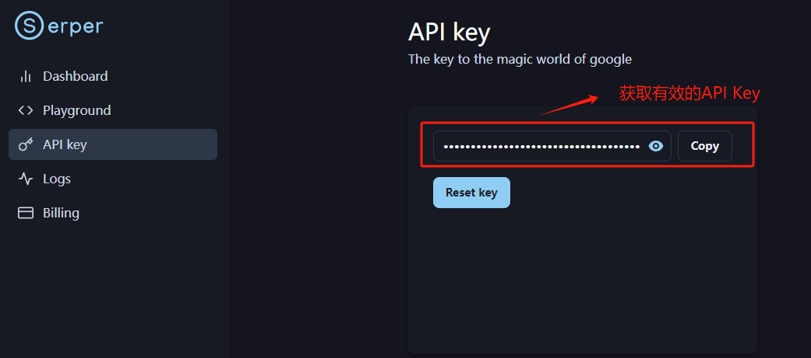

# 使用SerperAPI做实时联网检索

  这里我们推荐Serper，该服务是一个高性能的 Google 搜索 API，提供快速且成本效益高的方式访问 Google 搜索结果。在目前的应用落地产品中广泛被用于增强聊天机器人、进行搜索引擎优化（SEO）分析和简化金融科技项目等多种场景。该API具备：

* 执行实时搜索

* 自定义查询位置

* 快速访问 Google 的搜索引擎结果——通常在1-2秒内

  以上特性使其特别适用于需要立即检索最新网络数据的应用。

# 1. 注册Serper账户

  SerperAPI官方地址：https://serper.dev/ 。进入后先进行注册：


  登入账户后，在如下位置获取有效的API Key：



  新用户注册会免费赠送2500条免费请求，即可通过该API Key 查询2500次 Google Search 服务。


  获取到API Key后，我们可以使用 Python 的 requests 库来调用 Serper API 进行连通性测试，如下是示例代码：

```python
# ! pip install requests
```

```python
# requests 库用于发起网络请求
import requests
import json

params = {
    'api_key': '6ab09a423cc53af9b84ca61c093d2aea5096617f',  # 验证请求的 API 密钥, 请替换成自己的
    'q': '2024巴黎奥运会中国队获得了多少枚奖牌',    # 查询参数，表示要搜索的问题。
    'num': 3          # 这个参数指定了返回结果的数量，这里设置为3，意味着 API 将返回三个相关的搜索结果。         
}


# 使用 requests.get() 方法发起一个 GET 请求到 Serper API 的 endpoint。这个请求包含了上述设置的参数。
api_result = requests.get('https://google.serper.dev/search', params)

search_data = api_result.json()

print(search_data)
```

```plaintext
{'searchParameters': {'q': '2024巴黎奥运会中国队获得了多少枚奖牌', 'type': 'search', 'num': 3, 'engine': 'google'}, 'organic': [{'title': '2024年巴黎奥运会：中国代表团奖牌得主一览', 'link': 'https://olympics.com/zh/news/paris-2024-team-china-medalists-overview', 'snippet': '截止至2024年8月11日，中国代表团在2024年巴黎奥运会上已经斩获了40金27银24铜合计91枚奖牌。 最后更新日期：2024年8月11日北京时间20:30.', 'date': '5 days ago', 'position': 1}, {'title': '牌面：中国代表团奖牌得主汇总 - Paris 2024 Olympics', 'link': 'https://olympics.com/zh/paris-2024/live-updates/e46460b4-9eab-4428-b7ee-34e0a283aab9', 'snippet': '本届巴黎奥运会中国体育代表团以40金27银24铜的成绩完美收官，在金牌数上实现了境外最好成绩，中国代表团旗帜由李发彬、欧紫霞携带入场。 中国代表团旗手 ...', 'date': '4 days ago', 'position': 2}, {'title': '巴黎大结局：中美最后逆转俄罗斯金牌归谁了 - 体育- 新浪', 'link': 'https://sports.sina.cn/2024-08-12/detail-incikerh2563918.d.html?vt=4', 'snippet': '巴黎奥运会闭幕，最终奖牌榜上，中国代表团获得40金27银24铜，共计91枚奖牌。 这个金牌数打破了2012伦敦奥运的中国军团海外最佳战绩（39金31银22铜92 ...', 'date': '4 days ago', 'position': 3}], 'relatedSearches': [{'query': '中国奥运金牌得主2024'}, {'query': '中国奥运金牌榜2024'}, {'query': '中国奥运金牌2024'}, {'query': '中国奥运会2024'}, {'query': '中国2024年奥运会'}, {'query': '巴黎奥运会中国金牌'}, {'query': '巴黎奥运会奖牌榜'}, {'query': '美国奥运金牌得主2024'}]}
```

  如果能够正常接收到Serper API 返回的数据，则说明调用成功，可以继续进行接下来的代码实践。

  这里我们可以借助pprint 格式化输出。pprint 是 Python 的一个库，它的全称是 "Pretty Printer"。这个库提供了一个函数 pprint()，可以将 Python 对象以一种格式化和易于阅读的方式打印出来。使用 pprint 打印数据结构，尤其是在处理嵌套结构或包含多个字段的大型数据时，可以极大地提高可读性。

```python
# 导入pprint函数
from pprint import pprint  

# 设置缩进为2，宽度为100字符
pprint(search_data, indent=2, width=100)  
```

```plaintext
{ 'organic': [ { 'date': '5 days ago',
                 'link': 'https://olympics.com/zh/news/paris-2024-team-china-medalists-overview',
                 'position': 1,
                 'snippet': '截止至2024年8月11日，中国代表团在2024年巴黎奥运会上已经斩获了40金27银24铜合计91枚奖牌。 '
                            '最后更新日期：2024年8月11日北京时间20:30.',
                 'title': '2024年巴黎奥运会：中国代表团奖牌得主一览'},
               { 'date': '4 days ago',
                 'link': 'https://olympics.com/zh/paris-2024/live-updates/e46460b4-9eab-4428-b7ee-34e0a283aab9',
                 'position': 2,
                 'snippet': '本届巴黎奥运会中国体育代表团以40金27银24铜的成绩完美收官，在金牌数上实现了境外最好成绩，中国代表团旗帜由李发彬、欧紫霞携带入场。 '
                            '中国代表团旗手 ...',
                 'title': '牌面：中国代表团奖牌得主汇总 - Paris 2024 Olympics'},
               { 'date': '4 days ago',
                 'link': 'https://sports.sina.cn/2024-08-12/detail-incikerh2563918.d.html?vt=4',
                 'position': 3,
                 'snippet': '巴黎奥运会闭幕，最终奖牌榜上，中国代表团获得40金27银24铜，共计91枚奖牌。 '
                            '这个金牌数打破了2012伦敦奥运的中国军团海外最佳战绩（39金31银22铜92 ...',
                 'title': '巴黎大结局：中美最后逆转俄罗斯金牌归谁了 - 体育- 新浪'}],
  'relatedSearches': [ {'query': '中国奥运金牌得主2024'},
                       {'query': '中国奥运金牌榜2024'},
                       {'query': '中国奥运金牌2024'},
                       {'query': '中国奥运会2024'},
                       {'query': '中国2024年奥运会'},
                       {'query': '巴黎奥运会中国金牌'},
                       {'query': '巴黎奥运会奖牌榜'},
                       {'query': '美国奥运金牌得主2024'}],
  'searchParameters': {'engine': 'google', 'num': 3, 'q': '2024巴黎奥运会中国队获得了多少枚奖牌', 'type': 'search'}}
```

  我们要从上述返回的JSON 数据中提取 "organic" 键对应的值，其内容代表了搜索引擎返回的自然（非广告）搜索结果。

```python
items = search_data.get("organic", [])
```

```python
items
```

```plaintext
[{'title': '2024年巴黎奥运会：中国代表团奖牌得主一览',
  'link': 'https://olympics.com/zh/news/paris-2024-team-china-medalists-overview',
  'snippet': '截止至2024年8月11日，中国代表团在2024年巴黎奥运会上已经斩获了40金27银24铜合计91枚奖牌。 最后更新日期：2024年8月11日北京时间20:30.',
  'date': '5 days ago',
  'position': 1},
 {'title': '牌面：中国代表团奖牌得主汇总 - Paris 2024 Olympics',
  'link': 'https://olympics.com/zh/paris-2024/live-updates/e46460b4-9eab-4428-b7ee-34e0a283aab9',
  'snippet': '本届巴黎奥运会中国体育代表团以40金27银24铜的成绩完美收官，在金牌数上实现了境外最好成绩，中国代表团旗帜由李发彬、欧紫霞携带入场。 中国代表团旗手 ...',
  'date': '4 days ago',
  'position': 2},
 {'title': '巴黎大结局：中美最后逆转俄罗斯金牌归谁了 - 体育- 新浪',
  'link': 'https://sports.sina.cn/2024-08-12/detail-incikerh2563918.d.html?vt=4',
  'snippet': '巴黎奥运会闭幕，最终奖牌榜上，中国代表团获得40金27银24铜，共计91枚奖牌。 这个金牌数打破了2012伦敦奥运的中国军团海外最佳战绩（39金31银22铜92 ...',
  'date': '4 days ago',
  'position': 3}]
```


🍻现开设了**大模型学习交流群**，扫描下👇码，来遇见更多志同道合的小伙伴\~


海量硬核独家技&#x672F;**`干货内容`**+无门&#x69DB;**`技术交流`+不定期开设`硬核干货&前沿技术公开课`，扫码**👆即刻入群！
