## 本地私有化部署glm4-9b-chat模型

  大模型部署整体来看并不复杂，且官方一般都会提供标准的模型部署流程，但很多人在部署过程中会遇到各种各样的问题，很难成功部署，主要是因为这个过程会涉及非常多依赖库的安装和更新及根据本地的
安装情况，需要适时的调整代码逻辑。除此之外也有一定的硬件要求，总的来说还是具有一定的部署和使用门槛。因此本期课程特地详细整理了一份`glm4-9b-chat`模型的本地服务器私有化部署流程教程，供大家参考和学习。

* **操作系统要求**

  首先看系统要求。目前开源的大模型都支持在Windows、Linux和Mac上部署运行。但在应用开发领域中，Linux 系统通常被优先选择而不是 Windows，主要原因是Linux系统与多种编程语言和开发工具的兼容性较好，尤其是一些开源工具，仅支持在Linux系统上使用。整体来看，在应用运行方面对硬件的要求较低，且在处理多任务时表现出色，所以被广泛认为是一个非常稳定和可靠的系统，特别是对于服务器和长时间运行的应用。

  Linux 操作系统有许多不同的发行版，每种发行版都有其特定的特点和用途，如CentOS、Ubuntu和Debian等。 CentOS 是一种企业级的 Linux 发行版，以稳定性和安全性著称。它是 RHEL（Red Hat Enterprise Linux）的免费替代品，与 RHEL 完全兼容，适用于服务器和企业环境。而Ubuntu，是最受欢迎的 Linux 发行版之一，其优势就是对用户友好和很强的易用性，其图形化界面都适合大部分人的习惯。

  所以，在实践大模型时，强烈建议大家使用Ubuntu系统。同时，本教程也是针对Ubuntu 22.04 桌面版系统来进行`glm4-9b-chat`模型的部署和运行的。

* **硬件配置要求**

  其次，关于硬件的需求，`glm4-9b-chat`支持GPU运行（需要英伟达显卡）、CPU运行以及Apple M系列芯片运行。其中GPU运行需要至少6GB以上显存（4Bit精度运行模式下），而CPU运行则需要至少32G的内存。而由于Apple M系列芯片是统一内存架构，因此最少需要13G内存即可运行。其中CPU运行模式下内存占用过大且运行效率较低，因此我们也强调过，GPU模式部署才能有效的进行大模型的学习实践。

  在本教程中，我们将重点讲解如何配置GPU环境来部署运行`glm4-9b-chat`模型。

  在开始之前，请大家确定当前使用的硬件环境满足`glm4-9b-chat`模型本地化运行的官方最低配置需求： https://github.com/THUDM/GLM-4

  最低硬件要求：如果希望运行官方提供的最基础代码 (transformers 后端) 需要：

* Python >= 3.10

* 内存不少于 32 GB

  如果希望运行官方提供的官方Github的所有代码，还需要：

* Linux 操作系统 (Debian 系列最佳)

* 大于 8GB 显存的，支持 CUDA 或者 ROCM 并且支持 BF16 推理的 GPU 设备。(FP16 精度无法训练，推理有小概率出现问题)


  如果具备符合上述要求的本地硬件资源，可以尝试进行私有化部署glm4-9b-chat进行测试，这里，我们以一张 4 \* 3090 显卡的本地服务器配置进行部署演示。

* **Step 1. 使用 Xshell 远程连接 服务器**

  这里我们借助远程工具`Xshell`来进行远程服务器的连接。只要本地计算机和远程服务器处于同一网络环境，或者通过互联网能够相互连接，就可以在本地机器上控制和管理远程服务器。这种方式使得远程服务器的操作变得像是在操作本地电脑一样直接和简便。
通过这种远程连我们，你可以执行各种命令，管理文件系统，安装软件，甚至进行系统更新和维护任务。这种连接方式依赖于网络，所以只要网络连接稳，你几乎可以从世界任何角落安全地访问和控制服务地。

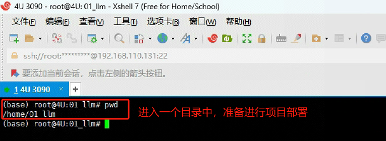

* **Step 2. 下载GLM 4 的官方GitHub项目文件**

  首先进入GLM 4 官方GitHub地址：https://github.com/THUDM/GLM-4/tree/main ， 找到远程仓库的链接:

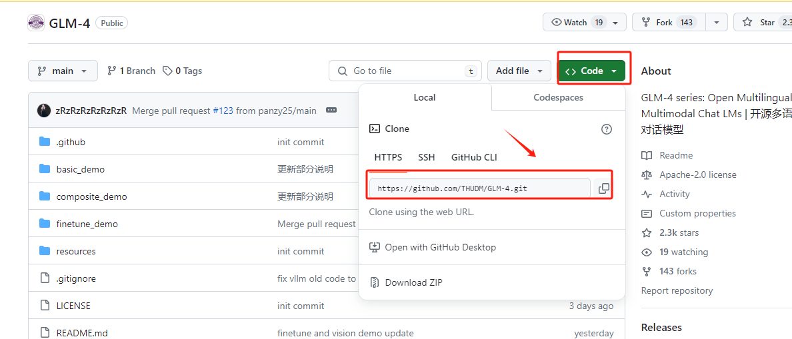

  借助`Xshell`工具在远程服务器的终端执行如下代码：

```bash
git clone https://github.com/THUDM/GLM-4.git
```

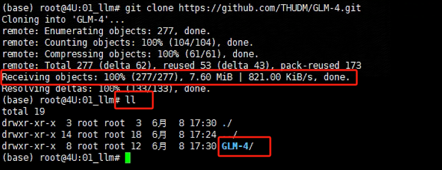

  如果全部文件显示100%下载，且在当前路径下生成一个 GLM-4文件夹，说明项目文件已经下载成功。

* **Step 3. 安装独立的虚拟环境**

  Conda创建虚拟环境的意义在于提供了一个隔离的、独立的环境，用于Python项目和其依赖包的管理。每个虚拟环境都有自己的Python运行时和一组库。这意味着我们可以在不同的环境中安装不同版本的库而互不影响。例如，可以在一个环境中使用Python 3.8，而在另一个环境中使用Python 3.9。对于大模型来说，建议Python版本3.10以上。创建的方式也比较简单，使用以下命令创建一个新的虚拟环境：

```bash
# myenv 是你想要给环境的名称，python=3.8 指定了要安装的Python版本。你可以根据需要选择不同的名称和/或Python版本。

conda create --name glm4 python=3.11
```

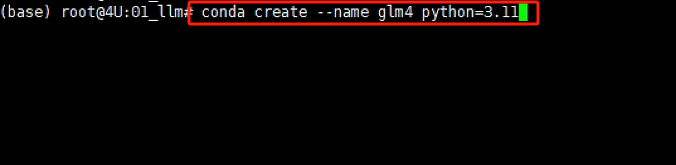

  创建完独立的虚拟环境后，需要进入该虚拟环境进行后续的操作。使用以下命令进入glm 4 的Python 虚拟环境：

```bash
conda activate glm4
```

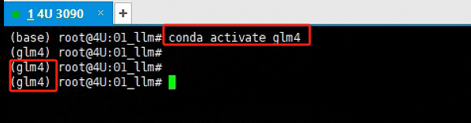

* **Step 5. 安装GLM 4 项目依赖**

  进入GLM 4文件夹后，执行如下命令一次性安装全部依赖。执行命令如下：

```bash
# 进入指定路径
cd GLM-4/basic_demo

# 执行如下命令安装依赖
pip install -r requirements.txt
```

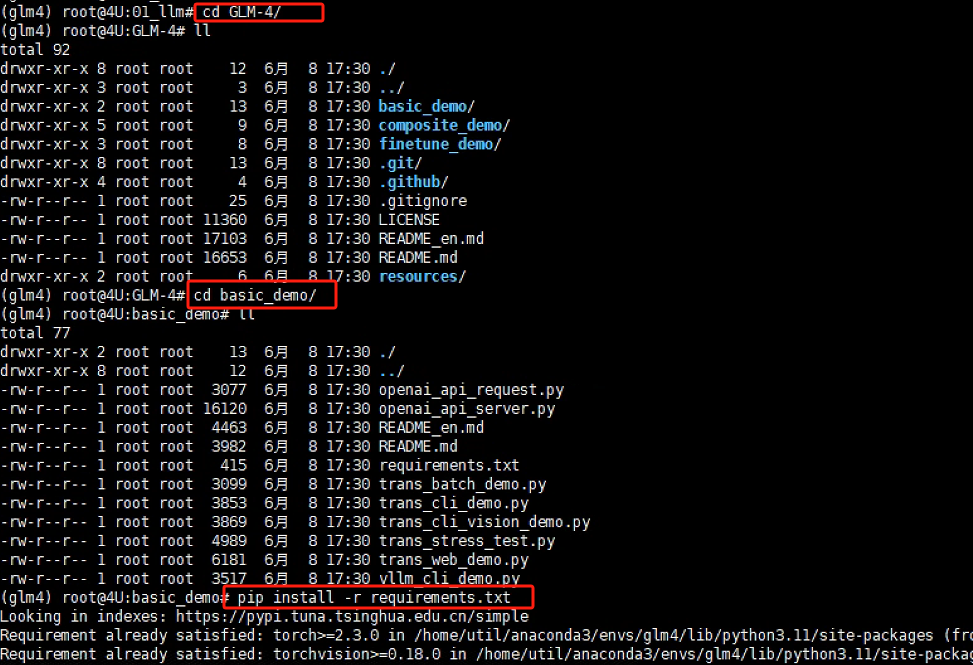

* **Step 5. 下载glm 4-9b-chat的模型权重**

  国内用户建议使用`ModelScope`下载地址 ， 国外用户建议使用 `huggingface` 下载地址 。 安装方法如下：https://modelscope.cn/models/ZhipuAI/glm-4-9b-chat/summary

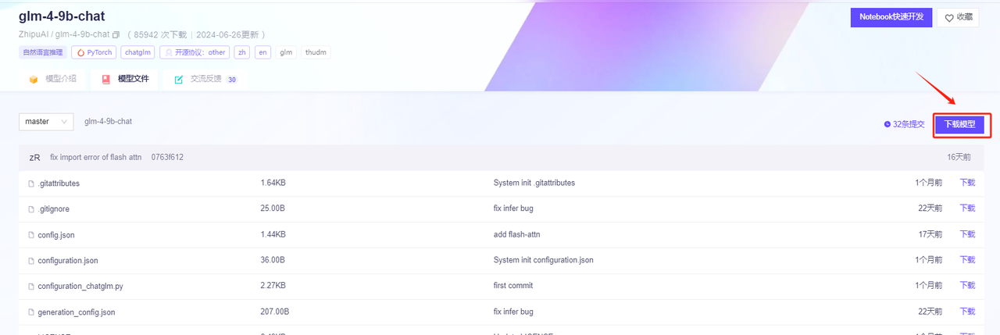

  在远程服务器终端，先安装 modelscope 第三方依赖包，执行代码：

```bash
pip install modelscope
```

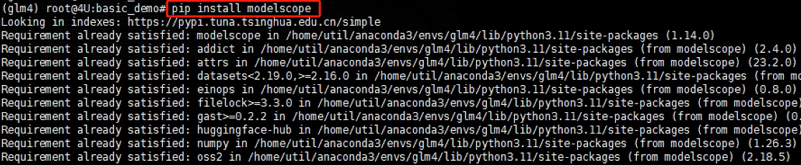

  然后新建一个.py文件，执行命令如下：

```bash
vim download_models.py
```

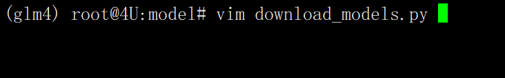

  写入如下代码：

```python
# 文件中的内容如下：

#!/usr/bin/env python3
# -*- coding: utf-8 -*- 

# 先安装 pip install modelscope

from modelscope.hub.snapshot_download import snapshot_download

snapshot_download('ZhipuAI/glm-4-9b-chat', cache_dir='./', revision='master')
```

  其中`glm-4-9b-chat`模型权重的远程下载地址是来源于：https://modelscope.cn/models/ZhipuAI/glm-4-9b-chat/files


  写入 download\_models.py 文件后，保存退出，输入如下代码执行.py文件，等待glm-4-9b-chat模型下载完成即可。

```bash
python download_models.py
```

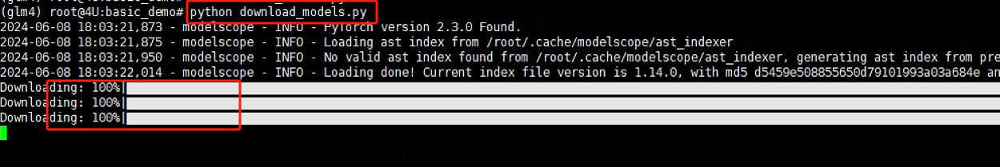

  待下载完成后，会在当前路径下生成一个ZhipuAI的文件夹，里面会存储着glm4-9b-chat的全部模型权重文件：

```bash
cd ZhipuAI

cd glm-4-9b-chat/ && ll
```

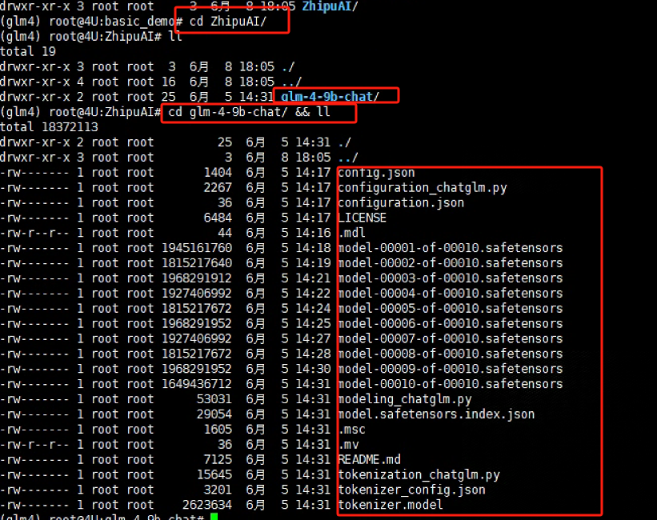

* **Step 6. 启动模型服务**

  大模型的官方GitHub项目一般都会提供多种与大模型的交互形式，最常用的就是 基于命令行的交互对话、基于Gradio/Streamlit构建的WebUI交互页面，以及最普遍使用的基于OpenAI API的API接口规范。

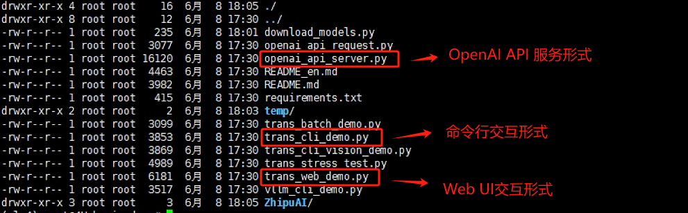

  不论哪种形式，其需要我们修改的内容并不多，主要基于以下两点对官方提供的源代码脚本进行更改：

1. 大模型的加载路径

2. 服务启动的默认参数

  我们以OpenAI API Server 为例。首先将模型的加载路径替换为本地的实际存储路径：

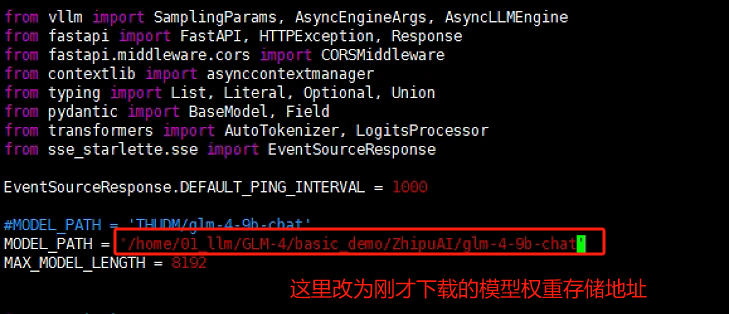

  然后根据自己服务器的实际情况，灵活调整启动服务的参数：（在代码文件的最后面）

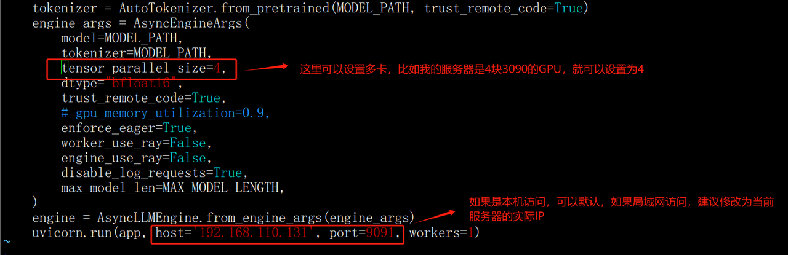

  保存配置修改后，执行如下代码：

```bash
python openai_api_server.py
```

  如果启动成功，会出现如下图所示内容：

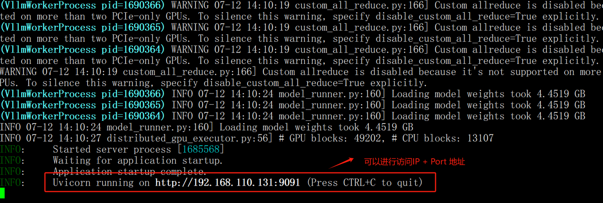

  当启动了glm4-9b模型服务以后，如果Python调用环境与部署glm4-9b-chat模型的环境为同一台服务器，那么可以直接进行调用测试，比如：我们可以使用Jupyter Lab 或者 Pycharm进行测试，核心代码如下：

```python
from openai import OpenAI

base_url = "http://192.168.110.131:9091/v1/"    # 注意： 这里替换成自己的 endpoint url
client = OpenAI(api_key="EMPTY", base_url=base_url)

messages = [{"role": "user", "content": "你好，请你介绍一下你自己"}]

response = client.chat.completions.create(
    model="glm-4",
    messages=messages,
)

print(response.choices[0].message.content)
```

```python
```


🍻现开设了**大模型学习交流群**，扫描下👇码，来遇见更多志同道合的小伙伴\~


海量硬核独家技&#x672F;**`干货内容`**+无门&#x69DB;**`技术交流`+不定期开设`硬核干货&前沿技术公开课`，扫码**👆即刻入群！
