# **DB-GPT部署与调用指南                                                      &#x20;**

## **Part 一、AI数据分析与DB-GPT项目前言介绍**

### **1.“大模型+数据分析”技术应用分析**

伴随着大语言模型技术的蓬勃发展，围绕大模型技术落地应用的探索也在逐步进行。而在各个领域    的大模型技术落地探索中， “大模型+数据分析”毫无疑问是最大热门方向之一，在大模型能力加持下，传统数据分析的很多工作，如**SQL编程、提数取数、指标搭建、报表分析、决策建议等，都有望借助大模型 来全自动或半自动化完成**。换而言之，大模型技术真真切切将为数据分析技术带来效率革命，在不远的

将来，“AI数据分析”将彻底代替“数据分析”成为主流。更多关于AI数据分析的技术概念介绍，视频讲解详见👉[大模型+数据分析：AI数据分析技术体系与应用前景详解](https://www.bilibili.com/video/BV1WH4y1s7H1/)

### **2.AI数据分析最佳落地形态： DB-GPT**

在“大模型+数据分析”技术浪潮大背景下，由蚂蚁集团牵头开发的DB-GPT项目，经过一年时间的进

化和迭代，目前已经成为性能最前沿、功能最完整、同时也是最具未来发展潜力的企业级AI数据分析集成工具。

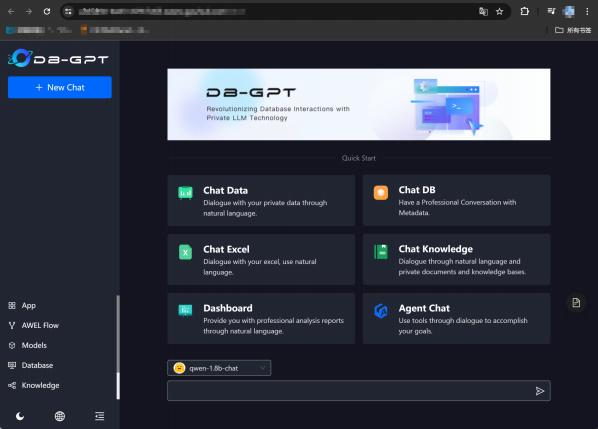

DB-GPT GitHub项目主页： <https://github.com/eosphoros-ai/DB-GPT>

DB-GPT说明文档主页： <https://www.yuque.com/eosphoros/dbgpt-docs>

借助DB-GPT，用户可以快速实现以下AI数据分析功能：

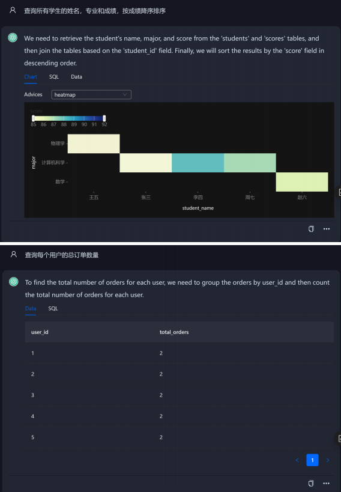

&#x20;&#x20;

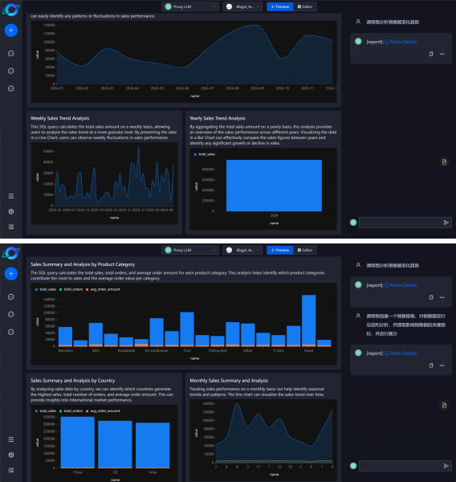

&#x20;&#x20;

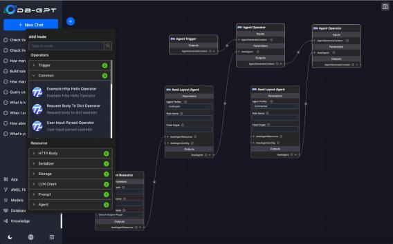

不难发现，上述场景其实基本就完整覆盖了目前各项主流大模型+数据分析的应用需求。并且DB-GPT并  不是简单的科研项目，而是真正意义上聚焦企业级应用场景，为此该项目还提供了诸如集群部署、  vLLM 推理加速等功能，使之能够真正意义符合企业级应用需求。从某种意义上来说，正是DB-GPT项目的诞    生，让市场看到了AI数据分析技术的具体落地应用形态。

### **3.DB-GPT项目构成与学习路径**

尽管DB-GPT提供了非常多封装程度较高、实际使用较为便捷的功能，但DB-GPT的实际使用过程并 没有那么简单，并且效果也并没有那么稳定。这其实是大模型底层技术逻辑导致的必然结果，尽管Db-GPT已经在各部分功能设计的时候尽量力求输出稳定结果，但由于底层大模型的“生成式”特性，导致想要 DB-GPT稳定输出高质量结果并没有那么简单。因此，  DB-GPT作为开源项目，为开发者提供了非常多底  层的功能，同时也允许开发者修改底层提示词和提示流程，并自由更换底层大模型，更有甚者，在一些   企业应用场景中，部分开发者会考虑参考DB-GPT项目架构，复现一个更适合当前公司应用场景的AI数据 分析工具。因此，这也使得尽管DB-GPT项目的学习入学门槛低，但“学成”的上限极高。

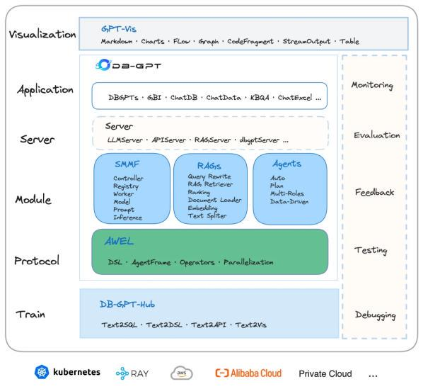

在本次公开课中，我将在有限的时间内为大家尽可能的详细梳理DB-GPT的核心功能，同时围绕一个真实的企业级数据分析项目，使用DB-GPT来进行全自动的AI数据分析。接下来的三部分内容规划如下：

* **&#x20; Part 1.DB-GPT项目解读与安装部署**

详细介绍包括DB-GPT在Ubuntu服务器上的基本环境搭建，以及该项目的云端部署、源码部署  等部署方法，同时介绍多卡运行推理加速方法，以及更换底层大模型方法，并借此了解DB-GPT项目 的基本结构。

* **&#x20; Part 2.DB-GPT核心功能实现方法**

详细介绍DB-GPT中各项核心功能，如Chat Knowledge、Chat Excel、Chat Data、

Dashboard等实现方法，并且详细介绍Agent Chat搭建数据分析Agent进阶功能实现方法，以及 DB-GPT-Hub的Text2SQL微调方法等。

* **&#x20; Part 3.AI数据分析企业级项目实战**

围绕企业级真实数据分析场景：广告投放渠道分析项目，借助DB-GPT进行AI数据分析，包括业 务理解、自动数据清洗、多表关联查询、指标创新与AB Test、建模预测分析等，并围绕该分析流程，搭建可以进行全自动数据分析的Agent，开启未来自动数据分析之门！

**当然，正如此前所说， DB-GPT项目本身非常复杂，公开课内容入门足以，但想要在企业级应用场景中更加稳定高效获得分析结果，仅凭公开课内容远远不够，  对“大模型+数据分析”感兴趣的小伙伴，也欢迎报名由我和菊安酱老师主讲的《AI数据分析实战》课程：<https://appZe9inzwc2314.h5.xiaoeknow.co>[m。](https://appze9inzwc2314.h5.xiaoeknow.com/)该课程是100+小时完整体系大课，零基础入门，数据分析+大模型技术双修，八大板块精讲精析：**

* **&#x20; 数据分析必备工具**

* **&#x20; 建模预测分析必备机器学习算法&#x20;**

* **&#x20; 业务分析方法**

* **&#x20; 数据分析必备大模型技术基础&#x20;**

* **&#x20; 数据对话底层技术与实现方法&#x20;**

* **&#x20; 智能决策底层技术与实现方法&#x20;**

* **&#x20; 全自动数据分析流搭建方法**

* **&#x20; 四项企业级AI数据分析实战案例**

**更多大模型技术内容学习，请扫码添加英英，回复“数据分析”，即咨询相关信息哦👇**

此外，**扫码回复“AIDA”**，即可领取**公开课课件、代码、数据**等\~

## **Part 二、 DB-GPT零门槛云端部署流程**

* &#x20;  DB-GPT部署方法介绍

接下来为大家详细介绍DB-GPT的不同种安装和部署方法，以及切换底层模型方法。作为企业级应用 项目， DB-GPT提供了多种不同类型的部署方法，如源码部署、  Docker部署、AutoDL部署、小程序云部  署等，以适用于不同场景应用需求。公开课中我们重点介绍AutoDL部署和源码部署两种方法，其中

AutoDL部署是最简单也最轻量级的部署方法， AutoDL部署指的是使用AutoDL云算力，借助已经封装好  的DB-GPT镜像，非常便捷快速完成DB-GPT部署，并且由于是在AutoDL的云端进行部署，因此也无需本 地算力支持，只需要支付一定的云算力费用即可，因此这种方法是一种非常高效便捷的迅速了解和学习   DB-GPT的方法，非常适用于前期科研学习用。

除此之外，公开课还将介绍源码部署方法，也就是一步步配置环境并安装相关的库，这是一种更加    [底层同时也更加灵活的部署方法，更加适用于企业级的应用场景，但同时部署难度也更高。而在《AI数据分析实战》课程中，我们还将介绍如Docker部署等方法。](https://appze9inzwc2314.h5.xiaoeknow.com/)

接下来就是在AutoDL上部署DB-GPT实际流程：

* &#x20; Step 1.使用AutoDL在线GPU服务器快速部署DB-GPT

[首先找到DB-GPT在CodeWithGPU上的镜像分享主页： ](https://www.codewithgpu.com/i/eosphoros-ai/DB-GPT/dbgpt)<https://www.codewithgpu.com/i/eosphor>[os-ai/DB-GPT/dbgpt，点击右侧AutoDL创建实例：](https://www.codewithgpu.com/i/eosphoros-ai/DB-GPT/dbgpt)

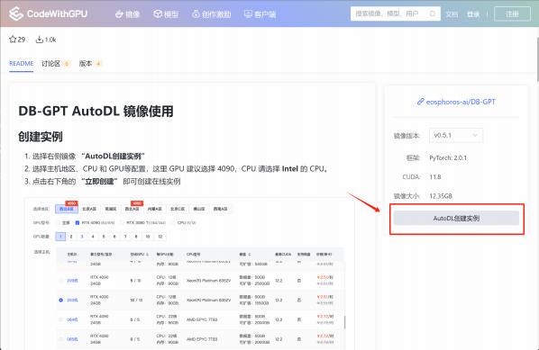

点击即可跳转至AutoDL网页，首次登录需要注册，使用国内手机号注册即可。首次登录注册时推荐使用 微信注册，否则之后还会提示需要绑定微信：

注册完成之后点击登录，即可自动跳转到包含了DB-GPT镜像的可租用的在线算力主页（AutoDL算力市 场）。

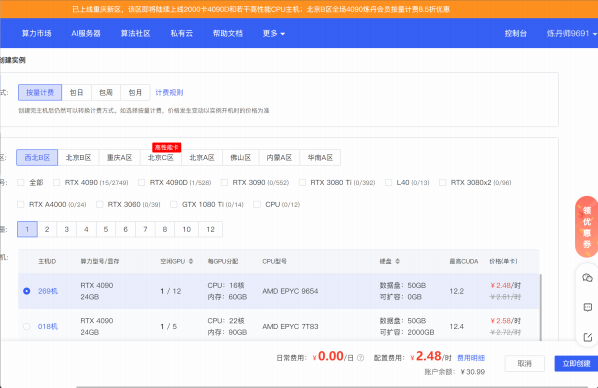

我们可以直接在算力市场租赁运行DB-GPT所需算力，不过在此之前，我们需要先为账户充值。考虑到后 续需要租用4090GPU服务器，且需要Intel CPU，而4090单显卡服务器约2.5元/小时，这里可以根据自己 实际需要使用的时常选择充值金额。

鼠标移至右上方账号昵称，即会弹出充值选项，点击充值：

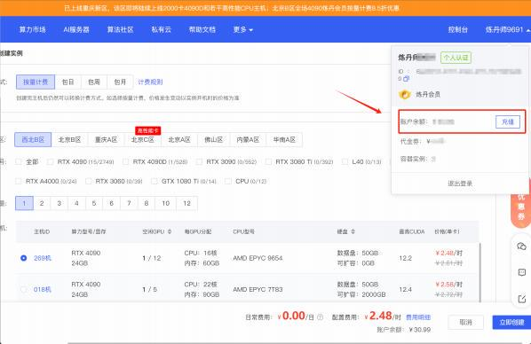

选择金额和支付渠道，扫码充值即可。首次充值时会提示进行个人身份绑定，可以选择支付宝刷脸进行 认证：

[充值后回到包含GB-GPT镜像的算力市场： ](https://www.autodl.com/create?image=eosphoros-ai/DB-GPT/dbgpt:v0.5.1)<https://www.autodl.com/create?image=eosphoros-ai/DB-G>[PT/dbgpt:v0.5.1，选择地区与4090GPU服务器。需要注意的是，不同时间段内、不同地区包含](https://www.autodl.com/create?image=eosphoros-ai/DB-GPT/dbgpt:v0.5.1)

4090GPU服务器情况不同，大家根据当时实际情况选取即可。此外，付费模式也可以选择按量计费或者 直接包时长，若没有长期计算或持续运行需求，选择按量计费会较为划算。同时，需要下滑至镜像部

分，确认当前在线服务器会预安装DB-GPT 0.5.1版本镜像：

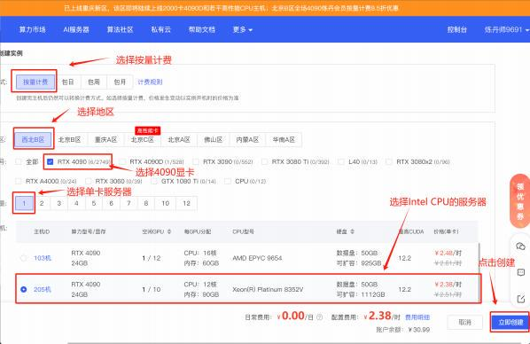

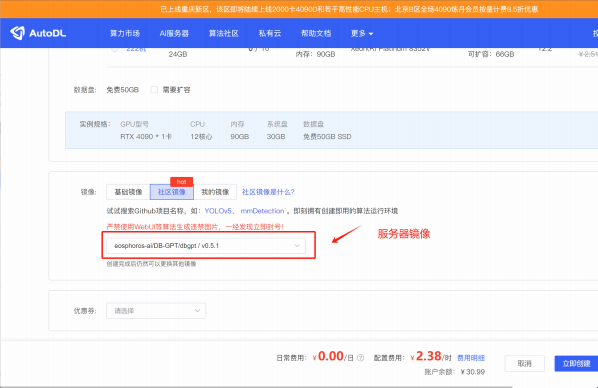

创建完成后，页面会自动跳转到当前账号的在线服务器管理页面，这里可以看到刚刚租赁的服务器正在 开机中：

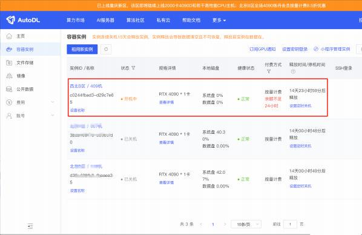

稍作等待，待显示 运行中 时，代表远程服务器已经顺利运行，需要注意的是远程服务器是已经在Ubuntu 操作系统中预安装了DB-GPT及其相关组件的，因此我们只要在服务器上运行DB-GPT并远程调用即可。

接下来则需要考虑如何连接远程服务器。

* &#x20; Step 2.使用FinalShell连接远程服务器

连接远程服务器的方式有很多种，首先服务器已预安装了JupyterLab，我们可以直接通过

JupyterLab中的Terminal来连接服务器，并通过命令行的方式操作远程服务器。但由于JupyterLab中    Termianl界面较为原始，对新人用户操作并不友好。因此推荐使用专门的远程终端连接软件连接远程服 务器，这里推荐使用FinalShell，该软件可以直接搜索下载，也可以直接**扫码添加助教英英，回复“AIDA”，即可领取公开课全部相关组件。**

下载后按照普通软件安装流程进行安装即可：

安装完成后，即可使用FinalShell连接远程服务器。由于接下来FinalShell连接远程服务器需要使用远程服 务器的地址和端口，因此我们需要先查阅此时远程服务器的基本信息。回到AutoDL控制台页面，分别复  制登陆指令和密码到任意文本编辑器中：

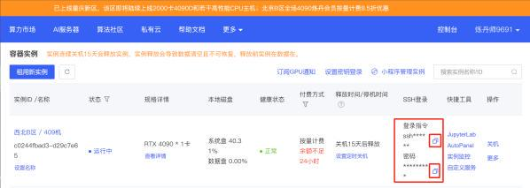

例如此时改服务器的登录指令为（需要找到你的主机的登录指令和密码）：

| ssh -p 24503 root@conxxx |
| ------------------------ |

密码为：

| wxxxx |
| ----- |

记录好了之后即可打开FincalShell，使用该信息连接远程服务器。接下来打开FinalShell：

首次使用时点击左上方文件夹，进入连接管理器：

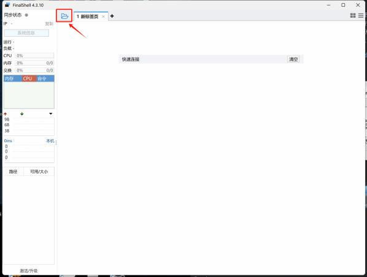

再点击创建新的连接，并在弹出的选项中选择SSH连接（Linux）：

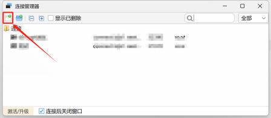

此处名称可以随意填写，主机为 conxxx ，也就是登陆指令root@conxxx中的conxxx部分，端口为 24503，也就是登录指令中ssh -p 24503 root@conxxx的24503部分，用户名为root，也就是

root@conxxx中的conxxx中的root，而密码则是wxxxx ，也就是此前复制的密码：

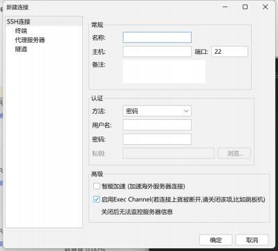

创建完成后回到连接管理器页面，双击刚刚创建的连接：

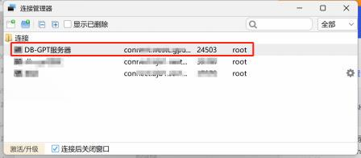

即可进入到连接页面，此时点击接受并保存即可：

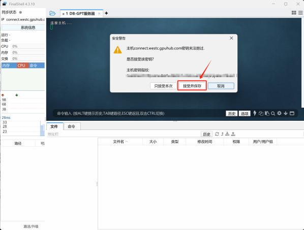

当进入到如下页面，则说明已经连接成功：

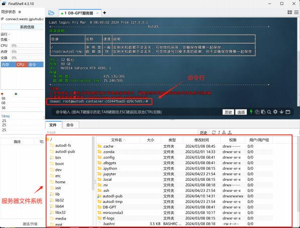

接下来即可借助FinalShell的命令行来操作远程服务器，在远程服务器上开启DB-GPT服务。&#x20;

* &#x20; Step 3.DB-GPT服务启动

接下来在FinalShell的命令行部分，分别输入以下命令以开启DB-GPT服务。首先是借助conda 激活dbgpt虚拟环境，需要注意的是FinalShell中的复制粘贴分别是CTRL+SHIFT+c和

CTRL+SHIFT+v\`：

| conda activate dbgpt |
| -------------------- |

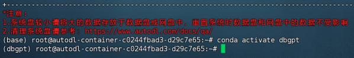

注意，每次启动DB-GPT之前都必须进入dbgpt虚拟环境中，否则后续启动命令均无法执行。

然后切换到DB-GPT目录，也就是把命令行操作目录切换到DB-GPT项目主目录，方便接下来直接运行DB- GPT项目内的脚本文件：

| cd /root/DB-GPT/ |
| ---------------- |

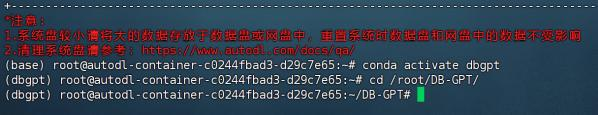

然后先通过运行DB-GPT项目文件夹内/scripts/examples/load\_examples.sh脚本文件，来创建元数据库 的元数据文件，该数据文件都是后续运行DB-GPT之必须：

| bash ./scripts/examples/load\_examples.sh |
| ----------------------------------------- |

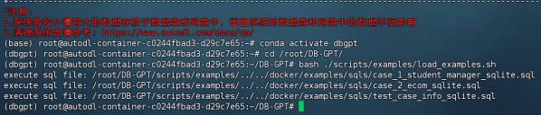

注，该命令行代表的含义是运行当前文件目录下的./scripts/examples文件内的load\_examples.sh 脚本文件，其中load\_examples.sh就是一系列bash命令的集合。这里的相对路径也可以切换为绝  对路径，即按照如下脚本进行运行： bash /root/DB-GPT/scripts/examples/load\_examples.sh

在做了这一系列的准备工作之后，接下来即可启动DB-GPT的服务了。我们可以通过输入如下命令启动 DB-GPT服务：

| dbgpt start webserver --port 6006 |
| --------------------------------- |

首次启动需要更新部分项目文件，稍等片刻，当显示run\_add\_app等字样时，则说明启动成功：

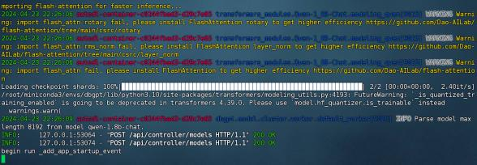

接下来需要一直保留该连接，否则启动的服务就会被关闭。

此时DB-GPT的服务已启动，而DB-GPT是通过Web端提供服务，因此接下来则需要考虑如何连接远 程服务器上的DB-GPT。这里我们可以使用AutoDL提供的自定义服务功能，将远程服务器运行的服务映  射到本地，然后再通过 url:port 的方式在本地进行访问。这里先点击自定义服务：

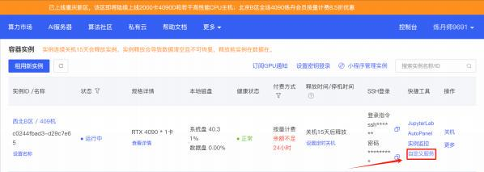

点击阅读同意，并点击访问：

即可跳转到DB-GPT的主页面：

* &#x20; Step 4.测试DB-GPT基本对话功能

从0.5.0版本开始， DB-GPT自带Qwen-1.8B模型作为驱动Agent的基础模型。我们在DB-GPT主页上  就能看到对话框和对话模型。这里我们直接与其对话，测试其基本功能能否顺利运行，  Qwen模型能否正 常运行：

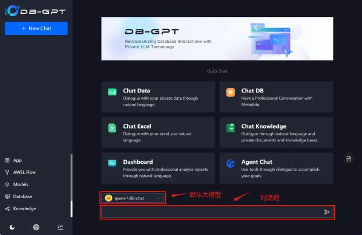

对话效果如下：

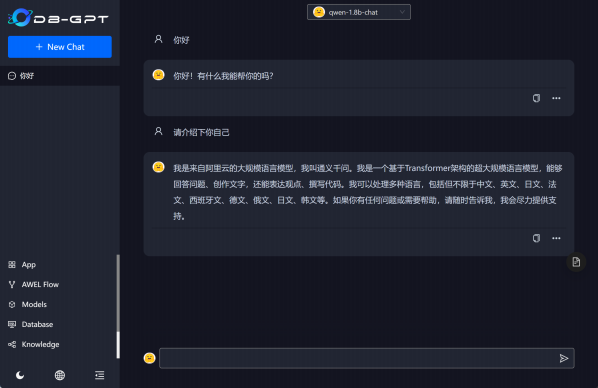

若能顺利运行并得到问答结果，则说明DB-GPT已经顺利部署完成。

而当DB-GPT进行运行过程中，此前通过finalshell建立的连接的命令窗口会实时显示并打印当前大模 型返回的信息：

而此时如果还要和服务器通信，即还希望通过命令行实时对服务器进行其他操作，则需要再创建一个和 服务器的连接，即再开启一个命令行页面：

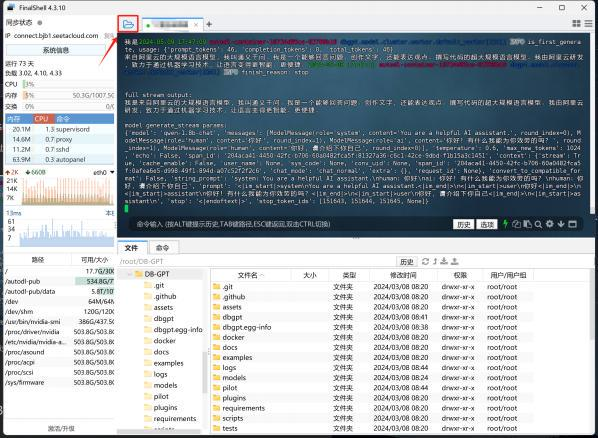

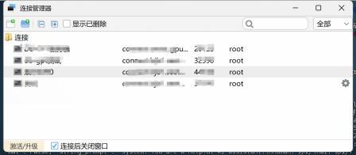

而若要停止DB-GPT服务，则需要在DB-GPT运行的命令行窗口输入 ctrl+c 即可：

此时DB-GPT已经终止，接下来就可以在改命令行窗口输入其他指令了。

**更多在线算力租赁详细教程、 Ubuntu操作系统命令讲解、数据分析师必备大模型技术基础，欢迎报名  [《AI数据分析实战》](https://appze9inzwc2314.h5.xiaoeknow.com/)课程参与学习！**

**更多大模型技术内容学习，请扫码添加助教英英，回复“数据分析”，即咨询相关信息哦👇**

此外，**扫码回复“AIDA”**，即可领取**公开课课件、代码、数据**等\~

## **Part 三、 DB-GPT多模型切换方法**

* &#x20;  DB-GPT实际性能受底层大模型影响

尽管现在DB-GPT已经能够顺利运行，但DB-GPT整体功能运行效果和底层驱动大模型息息相关，也 就是说，底层大模型性能越强、 DB-GPT整体功能表现也就越好。尽管在安装DB-GPT时已经安装了

Qwen-1.8B大模型，但该模型参数量较小（仅有18亿），模型整体性能非常弱，若只使用该模型，  DB- GPT的很多功能甚至无法顺利运行。例如某些复杂任务时报错结果如下：

因此，在实际使用DB-GPT工具的过程中，更换底层模式是必不可少的。&#x20;

* &#x20;DB-GPT支持大模型列表

在大模型快速发展的今天， DB-GPT也同样保持着非常高频率进行版本迭代，力求尽可能支持   更多的最新大模型。我们可以在 /root/DB-GPT/dbgpt/configs/model\_config.py文件中查看目 前DB-GPT所支持的各类大模型。这里我们可以通过FinalShell直接打开服务器上的该文件：

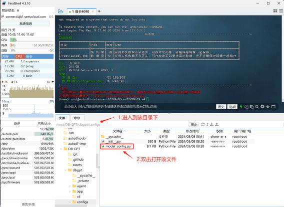

FinalShell自带的文件管理系统允许我们直接编辑远程服务器文件，其基本原理是会先将该文件下载 到本地，然后等待完成编辑后再和服务器上文件进行同步。否则如果是使用Ubuntu系统的命令行对 文本文件进行编辑，对于初学者来说会非常麻烦（需要借助vim编辑器）。

打开 model\_config.py文件后，我们就能查到当前DB-GPT项目所支持的各类底层大模型：

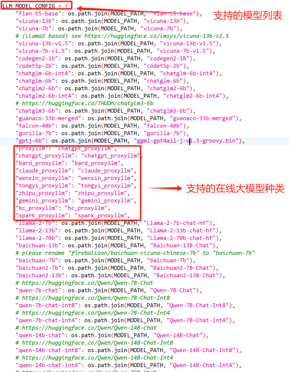

其中，带有 \_proxyllm标识的就是在线大模型，可以通过调用API直接调用模型服务，而其他模型   则是开源大模型，需要本地安装部署后才能调用，并且是再本地进行运行。不难发现，  DB-GPT基本

支持全部种类主流大模型，在线模型方面， DB-GPT支持如GPT模型、 GLM4模型、星火大模型、 Claude、Gemini模型等，而开源大模型方面， DB-GPT则支持如Llama模型、 Baichuan模型、

Qwen模型、 ChatGLM3模型、 mixtral模型等主流开源大模型。

当然， DB-GPT实际运行过程中，不仅需要使用大语言模型，同时也需要使用Embedding系列 模型，便于对文本进行词向量化处理。而文本词向量化功能主要用于RAG功能实现。这里翻到文档 下方，即可查阅目前DB-GPT所支持的Embedding模型种类：

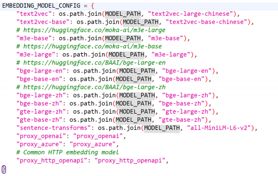

&#x20;   在默认情况下DB-GPT所采用的Embedding模型是text2vec模型。 .  model\_config.py文件功能简介

仔细阅读model\_config.py文件内容不难发现，该py文件的核心作用在于将开源大模型的本地 文件地址或在线大模型名称保存到环境变量中，即建立模型名称与路径之间的映射关系，以便之后 进行调用。

* &#x20; 拓展DB-GPT所支持的模型种类

当然，由于大模型本身发展迅猛，新模型迭代速度非常快，上面的模型列表并未覆盖全部大模   型，外加有的时候我们或许还需要使用自己训练或微调得到的大模型，因此在必要的时候，我们也   可以根据DB-GPT调用大模型的底层逻辑，修改和拓展这张表上的大模型范围，相关技术我们会在稍 后进行讲解。

* &#x20;  DB-GPT项目环境变量配置文件导读

在了解了DB-GPT所支持的大模型范围之后，接下来如果想要修改DB-GPT底层驱动大模型，则  需要通过修改DB-GPT项目的环境变量配置文件（以下简称配置文件）来完成（当然还需要下载模型 或者获取对应模型的API-Key，相关内容稍后介绍）。所谓配置文件，可以简单理解为实际影响项目  运行的参数设置，例如我们可以修改不同的配置文件，使得DB-GPT在运行时会选择调用不同的底层 大模型。这里我们快速浏览DB-GPT项目的配置文件中和更换底层模型相关说明，然后再逐步更换大 模型。

* DB-GPT项目配置文件为/root/DB-GPT/.env ，即项目主目录下的 .env文件。双击打开即 可：

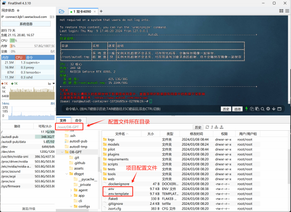

注，与之类似的还有一个.env.template，该文件并不是配置文件，而是配置文件初始文件的

副本，若在修改配置文件过程中把文件“改毁了” ，可以复制 .env.template内容（或者 将.template删除并替换原有.env文件）从而还原初始状态下的配置。

env.文件内容概览如下：

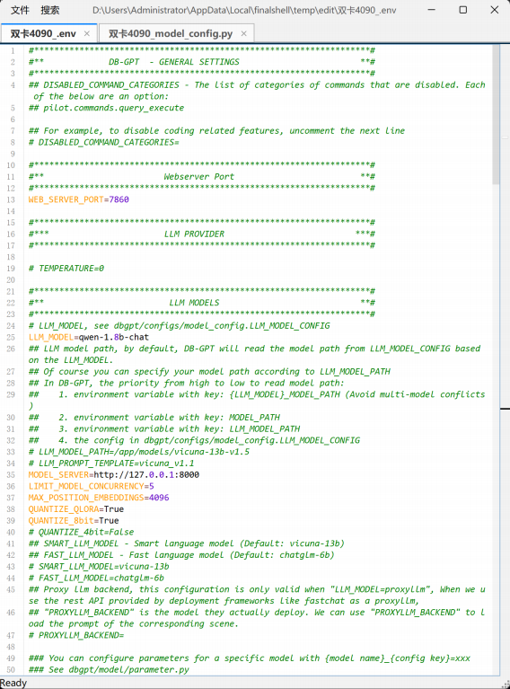

可以看到， DB-GPT的配置文件大概分为以下几个模块：

o   Webserver Port：设置网页服务端的端口，也可以在启动命令中设置端口；

o   LLM MODELS：设置调用的底层开源大模型，包括大模型名称、模型地址和模型服务端口号 等，该模块内容也是后续调整模型时主要需要修改的参数部分；

o   EMBEDDING SETTINGS： Embedding模型设置模块，包括Embedding模型名称、以及相关模 型参数等；

o   DB-GPT METADATA DATABASE SETTINGS： DB-GPT项目元数据存储方式； o   PROXY\_SERVER：使用代理模型（在线大模型）相关设置；

而在调整DB-GPT底层大模型时，我们需要主要围绕 LLM MODELS 和 PROXY\_SERVER 两部分配置文件 进行修改。

更多配置文件修改和使用方法，以及更多进阶功能，如插件功能、元数据库修改功能，将在 [《AI数据分析实战》](https://appze9inzwc2314.h5.xiaoeknow.com/)课程中进行更深度讲解。

接下来我们就分别尝试为DB-GPT增加在线大模型和一些本地私有化部署和运行的开源大模型。

### **1.增加可调用的在线大模型**

根据model\_config.py文件说明不难发现，目前DB-GPT支持GPT、Claude、GLM4、Gemini等主流 在线大模型，使用在线大模型时不用消耗本地算力，但需要确保一个可以和在线大模型服务器通信的网  络环境，已经需要准备对应在线大模型的API-KEY。

#### 我们这里以GLM4和GPT模型为例，介绍DB-GPT增加可调用在线大模型方法。

**1.1 增加GLM4大模型作为基础模型**

GLM4是ChatGLM系列模型的第四代模型，也正是从第四代模型开始，  GLM系列模型由开源模型转  向在线大模型。作为中文性能最佳的模型之一 ，GLM4模型在业内已有广泛应用，更多关于GLM4模型介 绍详见我的B站公开课：

.  GLM4模型介绍： <https://www.bilibili.com/video/BV1s5411v78P/>

.  GLM4快速入门： <https://www.bilibili.com/video/BV16K4y1q7sP/>

**更多GLM4模型技术讲解&数据分析师必备大模型基础，详见正式课程：  [《AI数据分析实战》](https://appze9inzwc2314.h5.xiaoeknow.com/)**

在DB-GPT中添加GLM4作为基础模型可以按照如下步骤执行：&#x20;

* &#x20; Step 1.注册智谱AI账户并获取API-KEY

调用在线大模型服务并不需要本地算力支持，但需要提前进行账户注册、储值并获取API-

KEY，作为调用模型时候的身份验证。 GLM4模型由智谱AI发布，我们需要登录智谱AI开放平台完成 [注册，智谱AI是国内公司，无需魔法使用国内手机号即可进行注册和登录：https://open.bigmodel.cn/login](https://open.bigmodel.cn/login)

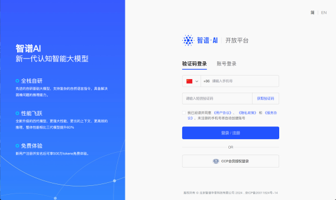

然后在个人中心进行账户充值并查看API-KEY，首次充值时会提示进行实名认证，个人或企业认证皆 可，首次完成认证时还会赠送一定的token额度，即前期无需充值即可使用，并且首充还会有一定    的优惠额度：

当完成充值或者获取了一定的免费token额度后，点击查看API-KEY，即可创建并复制API-KEY：

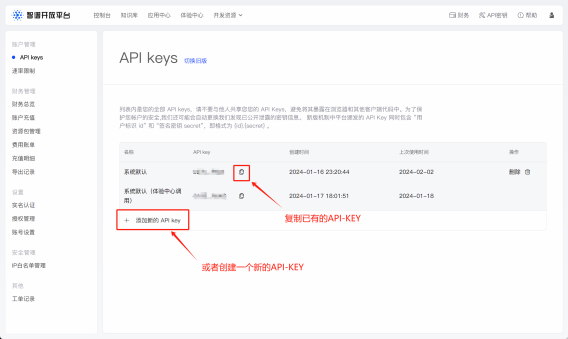

API-KEY实际上就是一个字符串，作为密钥用于在调用模型时进行身份验证，接下来我们用

YOUR\_API\_KEY 代替表示这个长字符串。在获取了这个API-KEY之后，接下来就可以回到DB-GPT环 境中继续配置GLM4模型。

更加详细的GLM4账户注册与API-KEY获取流程，详见我的GLM4公开课《GLM4快速入门》：

<https://www.bilibili.com/video/BV16K4y1q7sP/>

* &#x20; Step 2.修改.env配置文件，添加GLM4模型

在获取了API-KEY之后，接下来我们就需要通过修改配置文件来让DB-GPT调用GLM4模型服

务。首先打开 /root/DB-GPT/.env文件，并翻到173行及以下，查看代理模型相关设置。这里我们 首先要将下图中红框中的代理注释掉（在每一行前面加上 # （#+空格））：

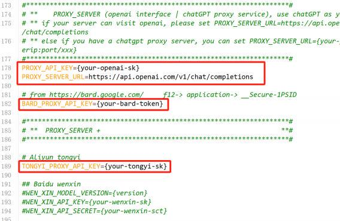

注释之后如下所示：

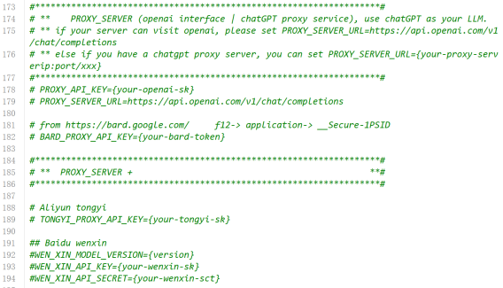

然后在任意位置输入GLM4模型配置，当然为了提升整体配置文件可读性，建议在199行起添加如下 内容：

| LLM\_MODEL=zhipu\_proxyllmPROXY\_SERVER\_URL=<https://open.bigmodel.cn/api/paas/v4/chat/completions> ZHIPU\_MODEL\_VERSION=glm-4ZHIPU\_PROXY\_API\_KEY=YOUR\_API\_KEY |
| --------------------------------------------------------------------------------------------------------------------------------------------------------------------- |

YOUR\_API\_KEY部分需要替换为你的API-KEY字符串

修改后如下所示：

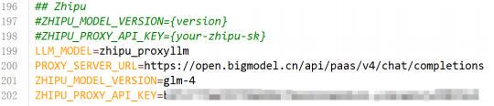

其中各参数代表含义为：

o   LLM\_MODEL=zhipu\_proxyllm：代理模型名称为zhipu\_proxyllm；

o   PROXY\_SERVER\_URL=<https://open.bigmodel.cn/api/paas/v4/chat/completions> ：模型调用 过程请求地址

o   ZHIPU\_MODEL\_VERSION=glm-4：模型版本

o   ZHIPU\_PROXY\_API\_KEY=YOUR\_API\_KEY ：用于身份验证的API-KEY

在修改完后保存（和Windows一样， ctrl+s即可保存）即可。&#x20;

* &#x20; Step 3.安装zhipuAI库

为了保险起见，建议运行DB-GPT之前安装zhipuai库：

| pip install zhipuai |
| ------------------- |

注意，如果此时已经退出了dbgpt虚拟环境，则需要使用如下命令 conda activate dbgpt 再次进入dbgpt虚拟环境，并进行安装。

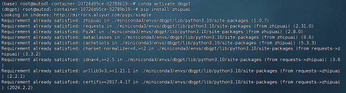

* &#x20; Step 4.启动DB-GPT测试添加模型结果

最后，启动DB-GPT并查看是否已经成功替换底层模型：

| dbgpt start webserver --port 6006 |
| --------------------------------- |

并打开网页进行对话：

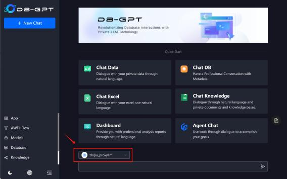

能够发现，此时模型就已经被替换为zhipu\_proxyllm了，接下来即可自由进行对话：

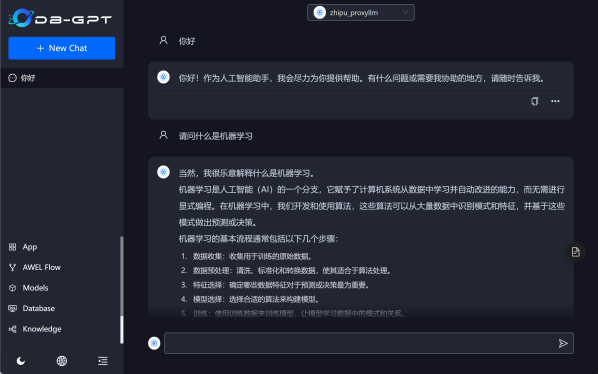

#### **1.2 增加GPT系列模型作为基础模型**

当然，除此之外，我们还可以添加GPT模型作为基础模型，截止目前， GPT-4模型仍然是综合性能最 强的大模型，而在DB-GPT的实际使用过程中也能明显感到，当底层模型选择GPT-4模型时， DB-GPT运    行非常稳定高效。

和GLM4模型类似，若要选择GPT模型作为底层模型，同样需要获取GPT模型的API-KEY，不过二者 不同的是， OpenAI服务原则上不对中国开放，因此要使用GPT模型，则需要使用一些特殊方法去获得

OpenAI API-KEY，并且在实际调用GPT模型时，还需要确保服务器网络环境可以和OpenAI服务器进行通 信。这里关于OpenAI的API-KEY获取方法，感兴趣的小伙伴**欢迎报名[《AI数据分析实战》](https://appze9inzwc2314.h5.xiaoeknow.com/)课程参与学**

**习，课程中包含详细的OpenAI账号注册、 GPT-4模型调用方法详解等内容**。公开课中不进行额外介绍， 总之，在切换底层模型为GPT模型之前，需要先获取OpenAI的API-KEY。和智谱AI的API-KEY类似，

OpenAI的API-KEY也是一个字符串，接下来以 YOUR\_API\_KEY 表示OpenAI的API-KEY。具体将DB-GPT底 层模型切换为GPT模型流程如下：

* &#x20; Step 1.取消GLM4模型配置

首先对于DB-GPT来说，默认情况下只会接入一个模型作为底层模型。因此若要选择GPT模型作 为底层大模型，则需要注释掉GLM4模型相关配置说明，即需要将智谱AI相关配置注释掉：

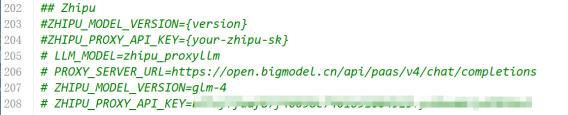

* &#x20; Step 2.添加GPT-4模型配置

然后还是在.env文件中另起一行（例如在187行开始），输入以下内容：

| LLM\_MODEL=chatgpt\_proxyllm PROXY\_API\_KEY=YOUR\_API\_KEYPROXY\_SERVER\_URL=<https://ai.devtool.tech/proxy/v1> PROXYLLM\_BACKEND=gpt-4-0613 |
| --------------------------------------------------------------------------------------------------------------------------------------------- |

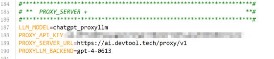

其中PROXY\_SERVER\_URL上填写的是国内反向代理地址，不用使用其他网络工具即可直接和 OpenAI服务器通信，而PROXYLLM\_BACKEND则表示调用的GPT系列模型型号。

* &#x20; Step 3.安装OpenAI库

类似的，在重启DB-GPT服务使得配置文件生效前，需要安装openai库。这里我们可以先停止 DB-GPT服务，然后在命令行中输入以下命令来完成安装：

| pip install openai |
| ------------------ |

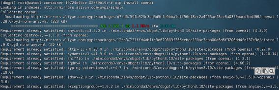

&#x20;   再次强调，需要在dbgpy虚拟环境中进行安装。&#x20;

* &#x20; Step 4.启动DB-GPT并测试效果

最后，启动DB-GPT，测试此时底层模型是否已经切换为GPT-4模型：

| dbgpt start webserver --port 6006 |
| --------------------------------- |

并即可在新的DB-GPT主页中查看到新的模型—GPT模型：

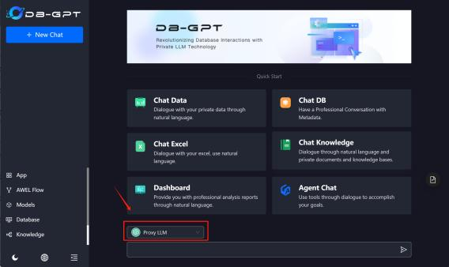

然后简单对话，测试能否顺利调用GPT模型：

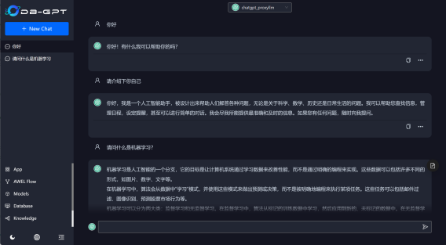

至此我们就顺利的完成了模型更换。

### **2.增加本地私有化部署和运行的开源大模型**

考虑到数据安全问题，很多企业会更加倾向于使用开源大模型并进行私有化部署，而DB-GPT同样支 持调用本地运行的开源大模型作为底层模型，不过和调用在线模型有所不同的，本地运行开源大模型需

要一定的算力支持，并且需要做好模型运行（如单机多卡或多机多卡运行、加速推理运行等）的维护工

作。关于主流开源大模型、以及包括SQLCoder在内的数据分析领域专业大模型，如何安装部署调用以及  微调，我们都在[《AI数据分析实战》](https://appze9inzwc2314.h5.xiaoeknow.com/)课程中进行了完整详细的介绍，公开课时间有限，我们将以跑通一个 开源大模型私有化部署+替换为DB-GPT底层模型的例子为目标进行介绍，相关方法也可以拓展到别的模   型中，而更多关于开源模型私有化部署内容以及服务器性能配置方法，欢迎大家报名[《AI数据分析实战》](https://appze9inzwc2314.h5.xiaoeknow.com/) 付费课程进行更加深入和系统的学习。

接下来我们以阿里通义千问Qwen1.5-7b为例，完整介绍开源大模型下载+私有化部署+替换为DB-   GPT底层模型全流程。这里需要注意的是， 7B模型运行需要至少18G显存，大家在运行该模型时需要先  确定当前GPU显卡型号，若是按照本教程顺序执行并租赁了4090显卡，则可以顺利执行下述实验。具体 执行过程如下：

* &#x20; Step 1.Qwen1.5-7b模型下载

首先需要先进行模型下载， Qwen1.5模型是今年2月开源上线的最新一代Qwen系列模型，也是 目前中文领域开源模型性能最佳模型之一，而7b模型作为其中中小型号的模型，能够在性能和算力  消耗之间做到很好的平衡，是非常好的单卡运行模型。作为国内版Huggingface，我们可以直接通   过魔搭社区将模型下载到指定文件夹内，然后再借助DB-GPT运行该模型。

[这里需要借助Jupyter提供的Python代码环境进行下载。我们回到AutoDL的实例管理页面https://www.autodl.com/console/instance/，点击DB-GPT所在实例的JupyterLab：](https://www.autodl.com/console/instance/)

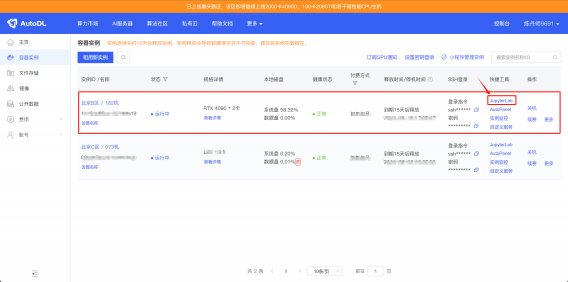

就会自动跳转到基于在线服务器的Jupyter编程环境中：

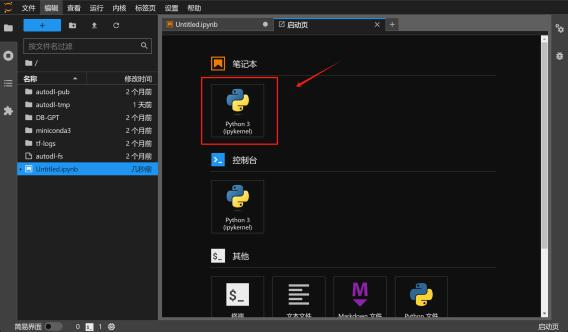

这里我们点击Python 3进入到编程环境，并输入如下命令完成modelscope库的安装

| !pip install modelscope |
| ----------------------- |

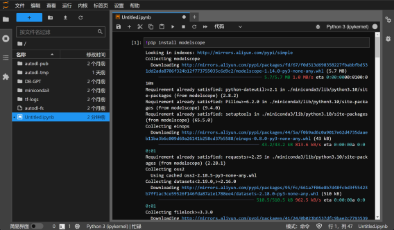

安装完成后我们即可借助modelscope进行模型下载。首先导入模型下载函数：

| from modelscope import snapshot\_download |
| ----------------------------------------- |

然后使用如下代码拉取模型：

| model\_dir=snapshot\_download("qwen/Qwen1.5-7B") |
| ------------------------------------------------ |

注意，此处 "qwen/Qwen1.5-7B" 是魔搭社区官方模型文件路径，不可修改，不同模型的路径可以   [在魔搭社区查阅， Qwen1.5-7B模型主页地址： ](https://modelscope.cn/models/qwen/Qwen1.5-7B/summary)<https://modelscope.cn/models/qwen/Qwen1>[.5-7B/summary，拉去模型地址为：](https://modelscope.cn/models/qwen/Qwen1.5-7B/summary)

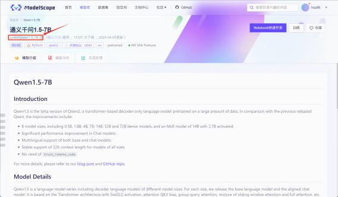

代码运行结果如下：

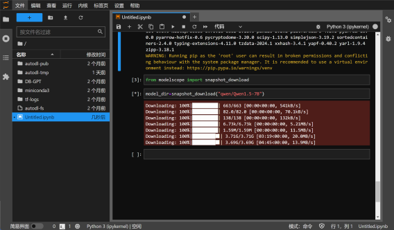

由于模型体量较大，下载需要约15-20分钟左右，稍事等待即可。

此外，该模型也可以使用git工具进行下载git clone &#x20;

https://www.modelscope.cn/qwen/Qwen1.5-7B.git

命令下载。在Python环境中进行模型 下载的好处是下载完之后可以直接运行验证模型性能。

下载完成后我们可以在 /root/.cache/modelscope/hub/qwen/Qwen1     5-7B 看到下载的模型文 件：

以及模型文件具体内容：

接下来我们需要将模型文件移动到DB-GPT的模型文件中，便于之后DB-GPT直接运行该模型。 DB- GPT原始模型文件位于 /root/DB-GPT/models 中：

DB-GPT项目用到的全部大语言模型和Embedding模型的模型源文件都在这里。接下来我们可以使 用如下命令，将刚刚下载的7b模型的模型文件也移动到该文件夹内：

| mv /root/.cache/modelscope/hub/qwen/Qwen1     5-7B /root/DB-GPT/models |
| ---------------------------------------------------------------------- |

执行完命令之后，在models文件夹内就可以查看到7b模型文件：

至此我们就完成了开源大模型本地下载的准备工作。&#x20;

* &#x20; Step 2.修改配置文件

接下来为了让DB-GPT顺利识别7b模型并运行该模型，我们还需要修改配置文件。这里需要注  意的是，修改配置文件过程不仅要修改.env文件，并且，由于7b模型是最近发布的大模型，所以我 们需要先检查model\_config.py文件中是否包含该模型的注册信息，若没有相关信息，则还需要将   7b模型的注册信息添加进model\_config.py文件中。

首先先看model\_config.py文件，经检查我们发现该文件中并不包含7b模型信息，因此我们需 要在model\_config.py文件中另起一行（如增加第98行），将下列信息写入：

| "qwen1.5-7b": os.path.join(MODEL\_PATH, "Qwen1     5-7B") |
| --------------------------------------------------------- |

即相当于建立qwen1.5-7b模型名称与模型文件夹位置的映射关系，输入完保存退出即可。 然后继续修改.env文件，相比之下.env文件修改方法较为简单，只需要将第25行中的

LLM\_MODEL=qwen-1.8b 修改为 LLM\_MODEL=qwen1.5-7b 即可：

注意，这里的模型名称需要和model\_config.py文件夹中的模型名称一致。修改完成后保存退出即 可。

* &#x20; Step 3.启动DB-GPT测试模型效果

最后启动DB-GPT，测试7b模型问答效果：

| dbgpt start webserver --port 6006 |
| --------------------------------- |

启动完成后打开网页端，查看现在模型情况：

发现已经成功替换为7b模型。然后也可以进行对话测试实际问答效果：

至此，我们就完成了开源大模型下载部署与替换DB-GPT底层模型的全部流程。

**更多在线大模型调用方法、 OpenAI账户注册方法、数据分析师必备大模型技术基础、数据分析开源大模 型私有化部署以及更多深度DB-GPT内容，欢迎报名[《AI数据分析实战》](https://appze9inzwc2314.h5.xiaoeknow.com/)课程参与学习！更多大模型技术内容学习，请扫码添加助教英英，回复“数据分析”，即咨询相关信息哦👇**

此外，**扫码回复“AIDA”**，即可领取**公开课课件、代码、数据**等\~

**《AI数据分析实战》课程： [https://appZe9inzwc2314.h5.xiaoeknow.com](https://appze9inzwc2314.h5.xiaoeknow.com/) 是100+小时完整体系大 课，零基础入门，数据分析+大模型技术双修，八大板块精讲精析：**

* **&#x20; 数据分析必备工具**

* **&#x20; 建模预测分析必备机器学习算法&#x20;**

* **&#x20; 业务分析方法**

* **&#x20; 数据分析必备大模型技术基础&#x20;**

* **&#x20; 数据对话底层技术与实现方法&#x20;**

* **&#x20; 智能决策底层技术与实现方法&#x20;**

* **&#x20; 全自动数据分析流搭建方法**

* **&#x20;  四项企业级AI数据分析实战案例**

## **Part 四、【选学&进阶】从零开始源码搭建DB-GPT**

若是个人学习或科研使用，租赁在线GPU算力+CodeWithGPU镜像部署肯定是最稳定且便捷高效的  选择，但如果是企业级应用，镜像部署就显得不够灵活，例如无法安装定制项目版本，并且由于镜像部   署过程忽视了很多技术细节，这也会为后续项目维护造成困难。因此，对于企业级应用场景，例如在企   业服务器上部署DB-GPT，更推荐使用源码部署，即从零开始一步步设置项目环境、安装项目依赖、安装 项目本身、修改项目配置文件等。我们一直坚定的相信，只有真实的企业级应用场景才是最具价值的学   习内容，因此接下来我们就更进一步，来尝试围绕企业级应用需求，进行DB-GPT项目的源码部署。

注，公开课中这部分内容属于进阶类选学内容，无论是否是进行源码部署，只需要掌握前两部分内 容、顺利部署DB-GPT，都可以顺利进行后续DB-GPT的功能学习。

&#x20; 实验环境

这里我们考虑在真实场景的服务器中进行部署，服务器基本配置如下： o   GPU： L20（48G）\*8（总显存为48\*8=384G）

。 CPU： 160 vCPU Intel(R) Xeon(R) Platinum 8457C CPU 。    内存：800GB

。 其他存储： 10T数据盘+5T系统盘SSD 其他软件环境：

。 操作系统： Ubuntu22.04   o   Python版本： Python 3.10

。 深度学习编程环境： PyTorch 2.1.0+Cuda 12.1

&#x20; 实验目标：源码部署最新版DB-GPT，最新版支持更多种类底层数据库与RAG方法。大显存服务器 +最新版DB-GPT源码部署+强性能大模型，可以为后续复杂推理和微调进行铺垫。

* &#x20;  DB-GPT源码部署教程流程

考虑到有很多学员需要在实验环境中模拟企业环境，而非直接在已经安装好了的Ubuntu服务器 上进行部署，因此本教程会先简单介绍Windows\&Ubuntu双系统安装、 Ubuntu系统基本环境配

置，然后再介绍DB-GPT项目源码部署流程。不过需要注意的是，由于Ubuntu系统安装与基本环境 配置过程非常复杂，同时这部分内容又不是本次课程重点，因此公开课中只会为大家快速梳理整个 安装和配置流程，而更多详细完整的Ubuntu安装部署流程， **我们专门为本次公开课准备了4小时的 《 Ubuntu系统安装与环境配置》额外免费学习资料**，详细介绍了包括双系统安装、深度学习编程  环境配置、 Ubuntu系统网络代理环境配置等关键问题处理方法：

感兴趣的同学可以**扫码添加助教英英，回复”AIDA“领取《Ubuntu系统安 装与环境配置》视频+课件学习资料哦。**

### **1.Ubuntu系统安装与环境配置**

**1.1 Ubuntu操作系统入门简介**

截止目前，大多数生产生产环境都会选择稳定性和安全性更高的Linux操作系统，对于大模型技术学  习者而言，由于很多深度学习相关专业项目（如DeepSpeed深度学习加速库）支持Linux系统，且虚拟机 并不支持GPU识别因此使用Linux操作系统是非常有必要的。而Linux操作系统中又以Ubuntu系统和

CentOS系统为主，其中Ubuntu操作系统开放程度更高、同时提供了图形化操作系统和命令行操作系

统，整体上手门槛更低、而且对不同需求场景的适配性较强，相比之下CentOS适合一些专业程度更高的 场景下使用。因此课程中将以Ubuntu系统为例，介绍Linux操作系统生产环境下的DB-GPT源码部署流    程。

Ubuntu操作系统每6个月发布一个新版本（4月和10月分别发布一个版本），且每两年发布一个长期 维护版本（Long Term Support，简称LTS），维护周期为五年，其他普通版本维护周期为9个月。并且   每个版本以发布时间作为系统编号，例如Ubuntu 22.04则是代表22年4月发布的操作系统，该操作系统    就是一个LTS操作系统，将维护到27年4月，该操作系统也是目前最推荐使用的Ubuntu操作系统

此外，每个版本的的Ubuntu操作系统还会分为桌面版和服务器版，其中桌面版操作系统会提供图形 化操作页面，而服务器版操作系统只能通过命令行操作。很明显，桌面版操作系统使用门槛更低、但会   占用更多的计算机资源，而命令行版使用门槛较高，但更适合高度专业的企业级生产环境。

#### **1.2 Ubuntu操作系统不同安装类型**

一般来说在企业实际应用过程中，会在采购服务器时安装好对应的操作系统，或者由专门的服务器 维护技术人员来进行系统安装，算法人员往往只需要使用操作系统即可。但考虑到很多学员目前只有

Windows实验环境，因此推荐进行Windows\&Ubuntu双系统安装，来接入Ubuntu操作系统。这里对于 已经拥有Ubuntu系统环境的同学，可以跳过之后双系统安装与环境配置部分内容，直接观看DB-GPT源  码部署流程，而对于没有Ubuntu环境的同学，则需要先完成双系统安装+系统环境配置，才能进一步学  习DB-GPT源码部署流程。

#### **1.3 Ubuntu\&Windows双系统安装方法**

所谓双系统安装，指的是一台计算机同时安装两个不同的操作系统，并且可以在开机的时候自由选  择进入哪个操作系统，这样可以尽可能节省计算机资源，同时也能够顺利的完成Ubuntu操作系统下的实 验。并且为了一定程度降低初学者学习和使用门槛，这里推荐安装22.04桌面版。具体安装流程详见

《 Ubuntu系统安装与环境配置》赠送课程（+v： littlecat\_1201，回复”AIDA“即可免费领取），这里简单

梳理安装流程。

#### **1.4 Ubuntu操作系统环境配置方法**

同样我们在《Ubuntu系统安装与环境配置》中进行详细介绍。

### **2.DB-GPT源码部署流程**

在准备好了基本环境之后，接下来即可开始进行DB-GPT的源码部署了。这里需要注意，如果是使用 远程服务器，则可以用FinalShell进行连接和输入命令，而如果是本地的Ubuntu双系统，则可以直接在   Ubuntu系统中输入命令或直接使用图形页面进行操作。但无论是使用哪种方法，命令都是一样的。这里 我们以FinalShell连接远程服务器为例进行展示。

* &#x20; Step 1.下载项目源码

若未安装git工具，则需要先使用如下命令安装git：

| sudo apt updatesudo apt install git |
| ----------------------------------- |

选择进入到项目下载文件夹：

| cd \~/autodl-tmp |
| ---------------- |

下载DB-GPT项目：

| git clone https://github.com/eosphoros-ai/DB-GPT.git |
| ---------------------------------------------------- |

下载完成后即可在当前项目文件夹内看到DB-GPT项目文件：

通过观察项目文件发现，源码部署的DB-GPT项目和镜像部署的项目有较大区别，最明显的就是源码 部署的DB-GPT并没有默认模型文件，同时也没有生效的配置文件（.env文件），这些都需要我们后 续手动来操作。

&#x20;   下载过程中如遇网络问题，可以参考此前介绍的代理网络环境设置方法。&#x20;

* &#x20; Step 2.创建虚拟环境

为了确保某个项目的稳定运行， 一般来说都会优先考虑为该项目单独创建一个虚拟环境，以隔  离项目所需依赖，以免和别的项目冲突。我们可以按照如下方式创建一个名为 dbgpt\_env 的虚拟环 境，用于安装DB-GPT相关依赖，以及运行该项目：

| conda create -n dbgpt\_env python=3.10 |
| -------------------------------------- |

未安装anaconda的话该命令无法执行

等待片刻即可完成创建：

创建完后即可进入到该虚拟环境中。需要注意的是，如果是首次安装conda，则需要运行&#x20;

conda  init

命令来添加  conda 的配置到当前shell启动脚本中：

| conda init bash |
| --------------- |

然后重启命令行终端并使之生效：

| source \~/.bashrc |
| ----------------- |

然后即可输入如下命令激活dbgpt\_env环境：

| conda activate dbgpt\_env |
| ------------------------- |

* &#x20; Step 3.安装相关依赖

接下来，在dbgpt\_env虚拟环境中安装当前项目所需依赖，可以输入如下命令执行：

| pip install -e ".\[default]" |
| ---------------------------- |

需要注意的是，该命令表示安装当前命令所在项目的全部依赖（ . 代表当前路径，  \[default]代表 项目所需全部依赖），因此在执行该命令前，需要确保处于DB-GPT的项目的主目录下。

* &#x20; Step 4.安装Git LFS

Git LFS全称 Git Large File Storage，是专门用于存储和下载大型文件的工具，接下来我们在下 载模型时需要用到，因此需要提前下载和安装Git LFS。我们可以使用如下命令进行安装：

| sudo apt-get updatesudo apt-get install git-lfs |
| ----------------------------------------------- |

然后完成初始化Git LFS配置：

| git lfs install |
| --------------- |

执行完该命令之后即可使用gitlfs进行模型文件下载了。&#x20;

* &#x20; Step 5.下载Embedding模型

接下来即可进入到大模型下载环节。正如此前所说，  DB-GPT的各项功能需要用到Embedding 模型和语言模型两种，这里我们先下载Embedding模型，然后再下载语言模型。

需要注意的是，这里也可以不下载任何开源模型，而就使用代理模型执行各项任务，例如 OpenAI、智谱AI等，均提供了在线Embedding模型和语言模型

下载模型之前，首先需要在DB-GPT项目主目录下创建models文件夹：

| cd \~/autodl-tmp/DB-GPT mkdir models |
| ------------------------------------ |

然后进入到该文件夹中：

| cd ./models |
| ----------- |

根据官方推荐，这里考虑下载 text2vec-large-chinese模型作为基础Embedding模型。我们可 以使用如下命令进行安装

| git clone https://huggingface.co/GanymedeNil/text2vec-large-chinese |
| ------------------------------------------------------------------- |

需要注意，这里是从huggingface上进行模型下载， huggingface有网络限制，国内网络需要使用代  理环境才能顺利完成下载，具体代理软件如何安装，详见《Ubuntu系统安装与环境配置》赠送课程 （ +v： littlecat\_1201，回复”AIDA“即可免费领取），下载过程如下所示：

* &#x20; Step 6.下载大模型

接下来继续下载大模型，类似的，还是在models文件夹路径内，使用如下命令下载Qwen1.5- 7B模型：

| git clone https://www.modelscope.cn/qwen/Qwen1.5-7B.git |
| ------------------------------------------------------- |

下载完成后，在当前models文件夹内就能查看到这两个模型了：

* &#x20; Step 7.创建配置文件

在初始状态下，只有 .env.template文件，而没有 .env配置文件，我们需要通过复 制 .env.template文件的方法创建一个 .env配置文件：

| cd \~/autodl-tmp/DB-GPT cp .env.template  .env |
| ---------------------------------------------- |

* &#x20; Step 8.修改 model\_config.py 文件

接下来我们先以text2vec模型作为Embedding模型、以Qwen1.5-7B模型作为大语言模型，运 行DB-GPT。和此前一样，我们需要修改 model\_config.py （在dbgpt/configs文件夹内）文件

和 .env （在项目主目录内）文件，其中 model\_config.py文件定义了模型名称和模型路径的映射 关系，而 .env文件则定义了DB-GPT项目运行方式。这里我们先打开 model\_config.py文件，另  起一行（如124行）写入如下代码：

| "qwen1.5-7b": os.path.join(MODEL\_PATH, "Qwen1.5-7B"), |
| ------------------------------------------------------ |

其中Key是模型名称，而value中的Qwen1.5-7B 则是模型项目文件名称

写完后保存并退出。

然后检查Embedding模型名称和模型文件名称之间的映射关系，以确定我们要用什么名字调用 已经下载的 text2vec-large-chinese （也就是text2vec）：

* &#x20; Step 9.修改 .env 文件

接下来继续修改 .env文件，首先将第25行修改为：

| LLM\_MODEL=qwen1.5-7b |
| --------------------- |

表示默认模型为qwen1.5-7b，然后我们还需要确认下现在Embedding过程调用的是哪个模型：

根据此前查阅 model\_config.py 内容得知，text2vec就表示调用我们下载的

text2vec-large- chinese

模型，因此这里不用修改，直接保存并退出即可。

* &#x20; Step 10.启动DB-GPT服务

一切准备就绪之后，接下来启动DB-GPT：

| cd \~/autodl-tmp/DB-GPTdbgpt start webserver --port 6006 |
| -------------------------------------------------------- |

注意，有时候首次启动会报错，和 typing\_inspect模块相关，我们使用如下命令再次安装 该模块即可：  pip install typing\_inspect

然后查看项目能否正常运行：

至此，我们就完成了DB-GPT全部源码部署流程。

### **3.大显存运行环境下Llama3-70B+DB-GPT部署流程**

为了更好的还原真实的企业级应用场景，这里在服务器上继续部署Llama3-70B模型，该模型是同类  型同尺寸模型的SOTA模型，和Qwen1.5-110B模型性能相当，也是目前我们花费单位算力能获得的性能  最佳的开源大模型。并且从实际实用角度来说，  70B模型也是企业级开源大模型应用的较为合适的大级模 型。我们可以使用如下命令进行安装：

| cd \~/autodl-tmp/DB-GPT/modelsgit clone https://www.modelscope.cn/LLM-Research/Meta-Llama-3-70B.git |
| --------------------------------------------------------------------------------------------------- |

该模型体量较大，需要花费较长时间下载，下载完成后即可在models文件夹内看到该模型：

接下来修改 model\_config.py和 .env 文件：

| "meta-llama-3-70b": os.path.join(MODEL\_PATH, "Meta-Llama-3-70B"), |
| ------------------------------------------------------------------ |

| LLM\_MODEL=meta-llama-3-70b |
| --------------------------- |

然后启动DB-GPT：

| cd \~/autodl-tmp/DB-GPTconda activate dbgpt\_envdbgpt start webserver --port 6006 |
| --------------------------------------------------------------------------------- |

接下来即可调用Llama3-70B模型进行问答：

**更多深度DB-GPT内容、自动数据分析方法、大模型+数据分析，扫码添加助教英英，即可领取详细资料哦。**

此外，**扫码回复“入群”**，即可加入**大模型技术社群：海量硬核独家技术`干货内容`+无门槛`技术交流`！**
