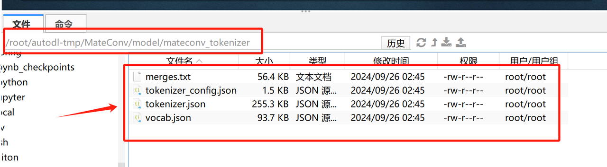

* Step 1.导入必要的库

```python
import random
from tqdm import tqdm
from transformers import AutoTokenizer
import json
from datasets import load_dataset
from tokenizers import (
    decoders,
    models,
    normalizers,
    pre_tokenizers,
    processors,
    trainers,
    Tokenizer,
)
import os
```

* Step 2.读取 tokenizer\_train.jsonl 文件

```python
def read_texts_from_jsonl(file_path):
    with open(file_path, 'r', encoding='utf-8') as f:
        for line in f:
            data = json.loads(line)
            yield data['text']

# 测试读取数据
data_path = '/root/autodl-tmp/MateConv/dataset/tokenizer_train.jsonl'
texts = read_texts_from_jsonl(data_path)

# 打印前几行文本
for i, text in enumerate(texts):
    if i < 5:
        print(text)
    else:
        break
```

```plaintext
好的。现在请你将这个文本中的所有的逗号都替换成空格。 好的，请稍等一下，现在我会将文本中的所有逗号替换为空格。处理后文本为："这是一个句子 目的是看看是否可以正确地从这个句子中删除关键词。"。处理结果如何？
帮我回答一道历史题目。清朝时期的八旗共有多少旗人？ 清朝时期八旗旗人总数约为200万人左右，其中正黄旗、正蓝旗、正白旗、正红旗的人数较多，其他旗的人数较少。
嗯，谢谢你介绍的做法很详细，但我不喜欢吃鸡蛋，有没有其他菜做法能介绍一下？ 当然，你可以试试酸辣土豆丝这道菜。
材料：
土豆2个、红椒1个、青椒1个、大葱1根、醋、生抽、盐、鸡精、料酒
做法：
1.土豆去皮，切成丝；红椒和青椒切成细丝；大葱切段备用。
2.热锅凉油，油热后放入土豆丝，煸炒至变软。
3.倒入红椒、青椒和大葱段，继续煸炒至熟。
4.加入适量的盐、鸡精、料酒和生抽，翻炒均匀。
5.最后，加入适量的醋，翻炒均匀即可。
小贴士：
1. 土豆切丝时，可以放入淡盐水中泡一下，这样可以去除多余的淀粉。
2. 煮土豆丝时，不要煮得太久，以免烂糊。
3. 加入醋的时候，根据自己的口味多少来进行调节，一般来说，盐与醋的比例为1:1。
4. 如果喜欢辣味可以加入一些干辣椒丝。
希望你会喜欢这道酸辣土豆丝！
请描述一下如何正确规划个人理财。 正确规划个人理财需要以下几个步骤：
1.了解自己的财务状况。这包括收入、支出、资产和负债等信息。了解自己的财务状况可以帮助人们更好地制定财务计划。
2.设定财务目标。需要考虑短期目标和长期目标，例如以年为单位设定的支出计划、购房、购车等的长期目标。
3.制定预算计划。在了解自己的财务状况并设定财务目标后，需要制定一个预算计划。这可以帮助人们控制支出、节省开支并达到财务目标。
4.理性投资和储蓄。人们可以投资于股票、基金、房产或其他投资渠道以实现财务目标。但在投资前需了解相关知识并进行风险评估。同时还应储蓄一定金额，以应对突发事件或为达成某些目标做准备。
5.审时度势，合理调整。财务计划需要不断地审时度势，根据实际情况做出调整，以达到最终的财务目标。需要注意财务状况的变化、投资的收益和风险等因素。
通过以上五个步骤，人们可以做到合理规划个人理财，掌握自己的财务命运，更好地实现自己的财务目标。
描述一下天堂和地狱的生态系统和环境。 天堂和地狱被认为是灵性信仰中关于死后世界的两种不同概念。然而，它们的生态系统和环境都是具有类似特征的极端不同的地方。以下是我对天堂和地狱的生态系统和环境的描述。
天堂的生态系统和环境:
天堂被描绘为一个美丽、平静、和谐的地方，类似于一片无垢的花园。天堂的生态系统和环境的特征包括:
1. 充满和平和爱的氛围。这是一个没有恐惧、痛苦、疾病和死亡的地方。
2. 色彩缤纷，充满生机。这是一个绿树成荫、花团锦簇的地方，充满生机和活力。
3. 各种生物和动物和谐共存。天使、圣人和各种动物和谐相处，生态系统中没有互相侵害或抢夺资源。
4. 充满清新气息的空气。没有污染、烟雾或其他有害物质，空气中充满清新芬芳的气息。
5. 物质丰富的环境。天堂中生活着满足需求和愿望的人们，他们拥有一切所需的物质资源，而且没有匮乏、浪费或不公平。
地狱的生态系统和环境:
地狱被描绘为阴暗、恐怖、嘈杂和可怕的地方。地狱的生态系统和环境的特征包括:
1. 充满痛苦和折磨的氛围。这是一个充满恐惧、悔恨和痛苦的地方，全是罪恶的味道。
2. 火焰和烈火环绕。地狱中有燃烧的火焰和烈火，许多受罚者被投入火坑中痛苦折磨。
3. 恶魔和妖魔横行。地狱中有恶魔、妖怪等可怕的生物，它们在无休止的受苦中享受着自己的又一场比赛。
4. 污染和恶臭的气味。地狱中到处都是恶臭和污染，没有清新的气息。
5. 没有物质资源。地狱中生活着被惩罚的人们不可能拥有任何物质财富，地狱环境充满了无尽的贫困、饥饿和疾病。
综上所述，天堂和地狱是两个完全不同的地方，它们的生态系统和环境反映了它们的性质，体现了人类对不同阶段的死后生命的不同想象和信仰。
```

* Step 3.初始化分词器

首先，通过 `models.BPE()` 创建了一个基于 Byte-Pair Encoding (BPE) 模型的分词器。BPE 是一种常用于文本分词的子词分解算法，特别在自然语言处理任务中被广泛使用，如机器翻译和语言模型训练。BPE 的主要思想是通过将频繁出现的字符或字符对合并成一个新的子词单元，逐步构建一个子词级别的词汇表，从而处理词汇表稀疏性和未登录词问题。

```python
# 初始化tokenizer
tokenizer = Tokenizer(models.BPE())
tokenizer.pre_tokenizer = pre_tokenizers.ByteLevel(add_prefix_space=False)

# 定义特殊token
special_tokens = ["<unk>", "<s>", "</s>"]

# 设置训练器并添加特殊token
trainer = trainers.BpeTrainer(
    vocab_size=6400,
    special_tokens=special_tokens,  # 确保这三个token被包含
    show_progress=True,
    initial_alphabet=pre_tokenizers.ByteLevel.alphabet()
)

print("分词器初始化成功，准备训练。")
```

```plaintext
分词器初始化成功，准备训练。
```

* Step 4.训练分词器

【TIME Warning：5mins】

```python
# 读取文本数据
texts = read_texts_from_jsonl(data_path)

# 训练tokenizer
tokenizer.train_from_iterator(texts, trainer=trainer)

print("分词器训练完成！")
```

```plaintext
分词器训练完成！
```

* Step 5.保存分词器

在训练完毕之后，还需要设置解码器 (`tokenizer.decoder = decoders.ByteLevel()`) ，这是为了在生成文本时正确地将分词器产生的 token 序列还原回原始文本。

```python
# 设置解码器
tokenizer.decoder = decoders.ByteLevel()

# 保存tokenizer
tokenizer_dir = "/root/autodl-tmp/MateConv/model/mateconv_tokenizer"
os.makedirs(tokenizer_dir, exist_ok=True)
tokenizer.save(os.path.join(tokenizer_dir, "tokenizer.json"))
tokenizer.model.save("/root/autodl-tmp/MateConv/model/mateconv_tokenizer")

# 手动创建配置文件
config = {
    "add_bos_token": False,
    "add_eos_token": False,
    "add_prefix_space": True,
    "added_tokens_decoder": {
        "0": {
            "content": "<unk>",
            "lstrip": False,
            "normalized": False,
            "rstrip": False,
            "single_word": False,
            "special": True
            },
        "1": {
            "content": "<s>",
            "lstrip": False,
            "normalized": False,
            "rstrip": False,
            "single_word": False,
            "special": True
            },
        "2": {
            "content": "</s>",
            "lstrip": False,
            "normalized": False,
            "rstrip": False,
            "single_word": False,
            "special": True
            }
    },
    "bos_token": "<s>",
    "clean_up_tokenization_spaces": False,
    "eos_token": "</s>",
    "legacy": True,
    "model_max_length": 1000000000000000019884624838656,
    "pad_token": None,
    "sp_model_kwargs": {},
    "spaces_between_special_tokens": False,
    "tokenizer_class": "PreTrainedTokenizerFast",
    "unk_token": "<unk>",
    "use_default_system_prompt": False,
    "chat_template": "{{ system_message }}{{ '<s>user\\n' + content + '</s>\\n<s>assistant\\n' }}{{ content + '</s>' + '\\n' }}"
}

# 保存配置文件
with open(os.path.join(tokenizer_dir, "tokenizer_config.json"), "w", encoding="utf-8") as config_file:
    json.dump(config, config_file, ensure_ascii=False, indent=4)

print("Tokenizer 保存成功！")
```

```plaintext
Tokenizer 保存成功！
```



* Step 6.评估分词器

```python
from transformers import AutoTokenizer

# 加载预训练的tokenizer
tokenizer = AutoTokenizer.from_pretrained("./model/mateconv_tokenizer")

# 测试一段对话
messages = [
    {"role": "system", "content": "你是一个优秀的聊天机器人，总是给我正确的回应！"},
    {"role": "user", "content": '是椭圆形的'},
    {"role": "assistant", "content": '456'},
    {"role": "user", "content": '456'},
    {"role": "assistant", "content": '789'}
]

# 使用模板进行文本处理
new_prompt = tokenizer.apply_chat_template(messages, tokenize=True)
print(new_prompt)
```

```plaintext
[608, 1589, 4835, 269, 4833, 954, 4725, 270, 1170, 345, 4584, 5204, 1273, 648, 2207, 1, 320, 275, 201, 345, 1390, 258, 3852, 1081, 269, 2, 201, 1, 1078, 538, 501, 201, 22, 23, 24, 2, 201, 1, 320, 275, 201, 22, 23, 24, 2, 201, 1, 1078, 538, 501, 201, 25, 26, 27, 2, 201]
```
