## **Step 1.创建虚拟环境**

* 打开finalshell，创建和服务器的shell连接

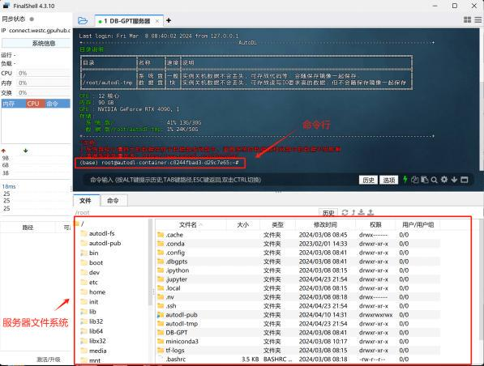

* 创建MateConv虚拟环境

| conda create --name MateConv python=3.10 conda initsource \~/.bashrcconda activate MateConv |
| ------------------------------------------------------------------------------------------- |

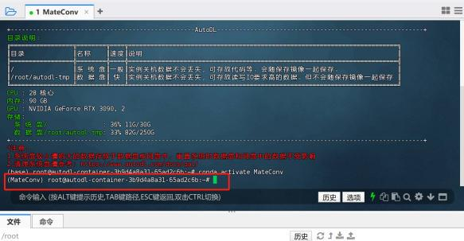

* 创建Jupyter Kernel

| conda install jupyterlab conda install ipykernelpython -m ipykernel install --user --name MateConv --display-name "Python (MateConv)" |
| ------------------------------------------------------------------------------------------------------------------------------------- |

* 创建项目主目录

| cd \~/autodl-tmp/ mkdir MateConv |
| -------------------------------- |

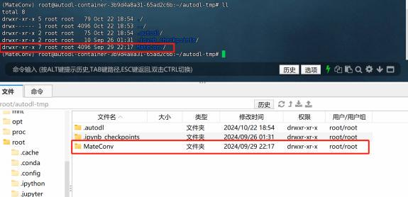

* 打开Jupyter

| cd \~/autodl-tmp/MateConv juputer lab --allow-root |
| -------------------------------------------------- |

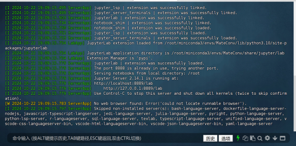

* 本地连接Jupyter并查看虚拟环境kernel

当服务器开启Jupyter时，Windows环境下，本地可通过AutoDL-SSH-Tools进行访问， **下图扫码添 加英英助教，回复LLM**，即可领取本次公开课课件：

其中AutoDL-SSH-Tools软件就在本次公开课的课件中：

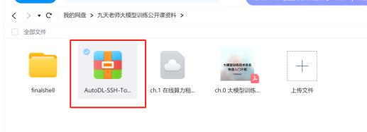

下载完成后解压缩后双击打开AutoDL.exe

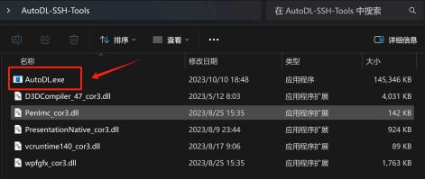

在弹出的栏页中， SSH指令和密码就是AutoDL官网上给每个实例提供的密钥：

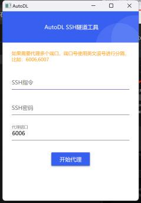

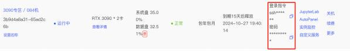

代理端口填写8889（也就是Juypter运行端口），点击开始代理，然后点击访问即可：

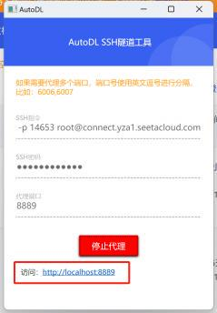

&#x20;然后任意打开一个Kernel，选择找到刚才安装的虚拟环境即可

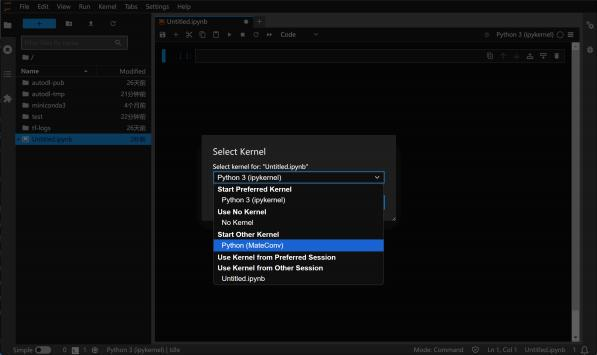

Mac登陆指令，打开终端并输入：（以下要填入自己的URL和port端口号） ssh -CNg -L 8889:[127.0.0.1](http://127.0.0.1):8889 root@YOUR\_URL -p port

然后根据提示输入密码

接下来再次点击finalshell中+号，再次创建一个和服务器的连接：

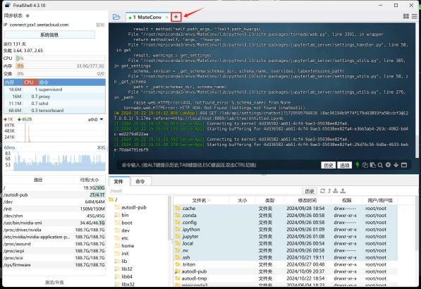

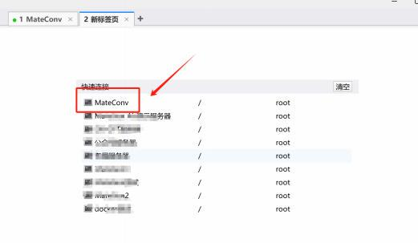

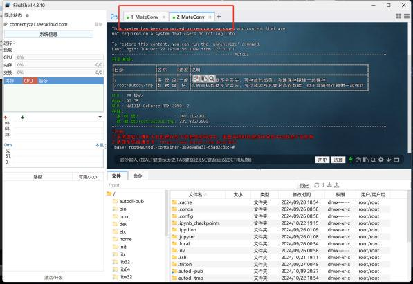

然后再次进入到虚拟环境，准备后续的操作

| conda activate MateConv |
| ----------------------- |

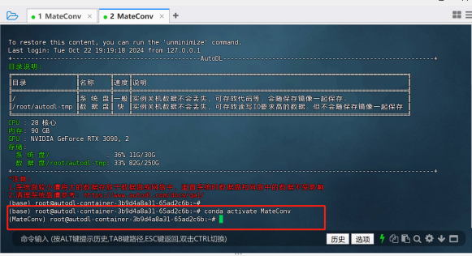

## **Step 2.配置模型训练环境**

* 创建依赖目录

| cd \~/autodl-tmp/MateConv touch requirements.txt |
| ------------------------------------------------ |

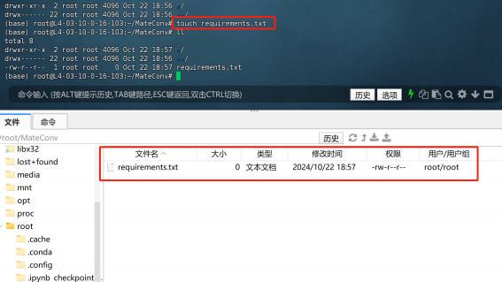

然后双击requirements.txt，并输入以下内容：

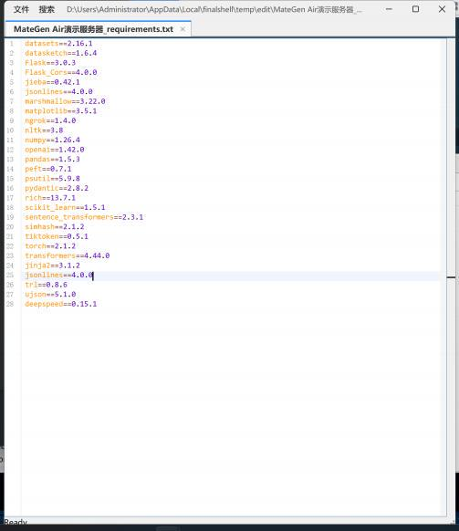

然后保存并退出。

* &#x20;安装项目依赖

| cd \~/autodl-tmp/MateConvpip install -r requirements.txt -i https://pypi.tuna.tsinghua.edu.cn/simple |
| ---------------------------------------------------------------------------------------------------- |

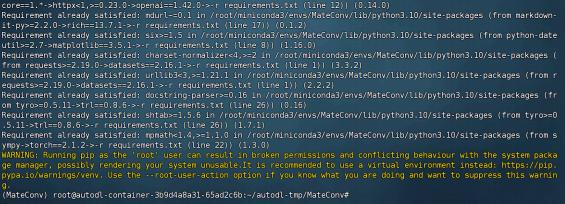

## **Step 3.分词器数据集准备**

在大模型的训练过程中，分词器（Tokenizer）的训练和使用是非常关键的环节之一，直接影响到模 型对文本的理解和生成能力。为了更好地理解为何需要训练分词器，以及分词器的概念和作用，下面我   将详细解释这些内容。

### **1. 分词器的概念**

分词器（Tokenizer）是将自然语言文本转换为模型可理解形式的工具，它将连续的文本字符串分解 成模型能够处理的基本单位。这些基本单位可以是单词、子词（subword），甚至是单个字符。分词的   目的是将原始文本映射为一系列的索引或标记（token），然后输入到模型中进行处理。

分词器的工作不仅限于切割文本，还包括将这些分割后的单位映射到模型词汇表中的索引。分词的 粒度选择会影响模型的性能、训练时间和生成的结果，因此分词器在训练过程中扮演着重要角色。

### **2. 为什么需要训练分词器？**

在大模型训练过程中，分词器是模型理解和生成文本的基础。如果没有合理的分词，模型无法有效 地学习语言的规律和结构。以下是训练分词器的主要原因：

#### **2.1 处理文本的必要性**

计算机无法直接处理自然语言文本，需要将其转换为数字表示。而分词器就是完成这一步的工具，  它将文本转换为一系列离散的标记，之后可以通过嵌入层将这些标记转换为向量输入模型。因此，训练 分词器的首要任务是高效且准确地将文本分解成适合模型学习的标记。

#### **2.2 减少模型的复杂性**

如果直接使用单词作为标记，模型词汇表将变得极其庞大，因为自然语言中有海量的单词及其变

体。词汇表过大不仅会导致训练时间增加，还会让模型难以泛化，尤其是当遇到词汇表中未包含的新词 时，模型将无法处理。

通过训练分词器，尤其是使用子词分词（例如BPE或WordPiece算法），可以将词汇表的大小控制在 一个合理的范围内，同时确保模型能够有效处理新词和变体。子词分词的思想是，将常见的词作为整体    保留，但对不常见的词进行进一步分解，这样即使是未见过的词，也可以通过子词组合来表示。

**2.2 提升模型的泛化能力**

一个好的分词器能够帮助模型在面对未知或罕见词汇时保持良好的表现。训练好的分词器能够根据 训练语料库中的频率、上下文等信息，对词语进行合理的拆分，让模型在推理和生成时具备更强的泛化 能力。例如，遇到罕见或未见过的词时，分词器可以将其分解为多个子词，这样即使模型没有见过完整 的单词，也能通过学习到的子词来理解其含义。

**2.3 提高模型的效率**

分词器还可以显著提高模型的计算效率。较小的词汇表可以减少嵌入矩阵的大小，从而减少模型的 参数量和训练时间。此外，通过子词分解，还可以避免对整个单词进行处理，提高模型处理长文本时的 效率。

### **3. 分词器的作用**

**3.1 将文本转换为标记序列**

分词器的首要作用是将连续的自然语言文本转换为一系列的标记序列。模型需要处理的是这些离散 的标记，而不是原始的字符串。不同的分词策略（如按单词、按子词、按字符等）会影响标记的数量和 粒度。选择合适的分词策略对于提高模型的表现非常重要。

**3.2 构建词汇表**

分词器的另一个作用是基于训练语料库构建一个有限大小的词汇表。这个词汇表包含了模型能够处 理的所有标记的集合，分词器在训练时通过分析语料库中的词频和词形变化，选择最适合的子词或词汇 构建词汇表，确保词汇表足够小但仍能覆盖大部分文本。

#### **3.3 处理未登录词（OOV问题）**

自然语言的词汇是动态且丰富的，在训练数据中可能无法包含所有的词汇。分词器通过将未登录词 （ Out-Of-Vocabulary ，OOV）拆解为子词，能够有效解决OOV问题。例如，对于一个未见过的复杂词 汇，分词器可以将其拆分为更常见的子词，从而保证模型可以处理这些新词，而不会因为未登录词的出 现导致模型无法理解。

**3.4 保持文本的语义一致性**

一个好的分词器不仅仅是将文本简单拆解，还需要考虑语义上的一致性。例如，分词器应该尽量避 免将具有特定语义的词错误地分割，以免影响模型的语义理解能力。同时，分词器应通过合理的标记组 合，使得模型能够在不同的上下文中准确理解词语的含义。

* 分词器最终效果展示

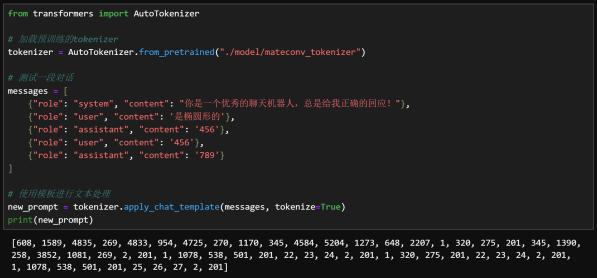

* 创建数据集存放文件夹

| cd \~/autodl-tmp/MateConv/ mkdir datasetcd ./dataset |
| ---------------------------------------------------- |

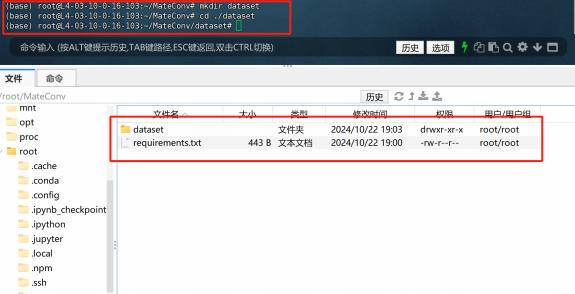

找到分词器训练数据集tokenizer\_train.jsonl：

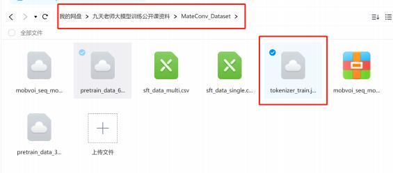

并拖拽上传到data文件夹内：

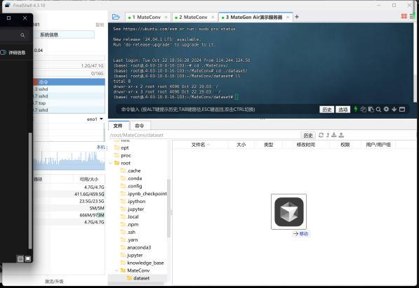

在finalshell右上角可以看到传输进度：

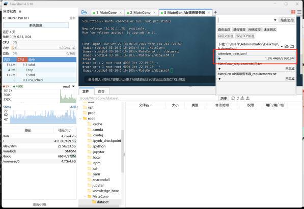

* 待上传完毕后即可使用。

JSONL 文件（有时也称为 NDJSON，即 Newline Delimited JSON）是基于行的 JSON 格式。 每一行都是一个有效的独立 JSON 对象，这些对象之间使用换行符（ \n ）分隔。换句话说，

JSONL 文件中的每一行都是一个独立的 JSON 数据片段。

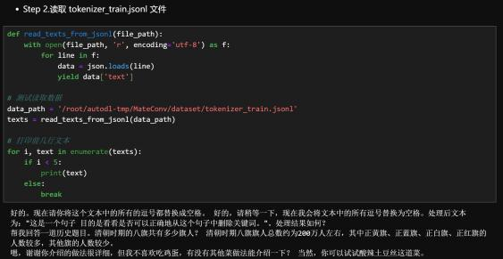

* 分词器训练过程

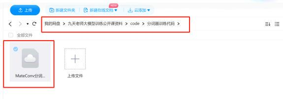

***

🍻现开设了**大模型学习交流群**，扫描下👇码，来遇见更多志同道合的小伙伴\~

海量硬核独家技&#x672F;**`干货内容`**+无门&#x69DB;**`技术交流`+不定期开设`硬核干货&前沿技术公开课`，扫码**👆即刻入群！
