### 【补充介绍】大模型预训练基本概念与预训练数据集创建方法

* 大模型预训练与预训练数据集

  在大模型训练的过程中，预训练阶段是至关重要的一步。**预训练**（Pre-training）是指在大规模无监督数据上进行初步模型训练，使模型能够学习到通用的语言模式、知识表征和统计特征。这一阶段不依赖于特定任务，而是通过在大规模、多样化的数据集上进行广泛的学习，帮助模型建立基础的语言理解能力。通过预训练，模型可以在后续的特定任务上（如分类、生成、翻译等）以更快的速度和更高的准确性进行微调（Fine-tuning）。

  预训练的目标是使模型能够有效捕捉数据中的规律，学会高效的特征表示，从而为后续的任务奠定基础。这一阶段通常涉及训练深度神经网络，如Transformer架构，通过处理大规模文本数据，模型能够学会上下文依赖关系、词汇语义关系等复杂的语言特征。

  而在选择预训练数据集时，需要特别关注以下几个关键因素：

1. **数据规模**
   预训练数据集的规模对模型的性能具有直接影响。大模型通常需要数百亿甚至上千亿个参数，这要求使用海量数据来支持模型训练。在数据量较少的情况下，模型可能无法充分学习复杂的语义关系，进而影响预训练的效果。因此，数据集的规模应足够大，以便涵盖广泛的语言模式和知识。

2. **数据多样性**
   数据集的多样性同样至关重要。预训练过程中，模型需要接触各种类型的文本内容，包括新闻、书籍、博客、技术文档等，以确保其能够广泛适应不同语言风格、领域知识和应用场景。如果数据过于单一，模型在后续应用于其他任务时，可能会表现出偏差或局限性。因此，选取多样化的数据源有助于提升模型的泛化能力。

3. **数据质量**
   数据质量直接影响模型预训练的有效性和稳定性。高质量的数据应具有较少的噪声、语法错误和不完整的句子。若数据质量较差，模型可能会学习到错误的模式或产生不合理的输出。因此，需对数据集进行预处理和清洗，以剔除错误、冗余或低质量的部分。

4. **领域相关性**
   尽管预训练通常是在通用数据集上进行，但在某些情况下，特定领域的数据可能更为重要。例如，若大模型的目标是用于医学或法律领域的应用，预训练数据集中应包含该领域的相关内容，以帮助模型建立更为准确的领域知识。这种数据的领域适配性可以在后续任务中显著提高模型的表现。

综上所述，预训练阶段的数据集选取是大模型成功的关键环节之一，良好的数据规模、质量、多样性及领域适配性有助于提高模型的泛化能力和应用效果。同时，数据的合规性与道德责任也不容忽视。通过精心选择和处理数据集，可以为后续的任务微调提供坚实的基础。

* 大模型预训练数据集构建方法

  在大模型的开发中，构建高质量的预训练数据集是至关重要的一环。如果现有的公开数据集无法完全满足特定需求，研究人员或开发团队可能会选择自构预训练数据集，以便更好地适配模型的任务或领域。在构建过程中，不仅需要考虑数据的收集和处理，还应确保遵循数据的伦理、质量和多样性原则。

**构建预训练数据集的步骤**

1. **确定数据来源**
   数据集的质量和多样性主要取决于数据来源的选择。常见的数据来源包括：

   * **公开数据集**：如维基百科、Common Crawl等大型通用文本数据集。这类数据资源庞大且容易获取。

   * **领域特定数据**：从技术文献库、领域文献、研究论文或行业报告中收集数据，适用于特定领域（如医学、法律、金融等）模型的预训练。

   * **网络抓取**：通过网络爬虫工具从特定网站抓取数据，尤其适合于需要最新或领域特定信息的场景。需要注意遵守网站的隐私政策及数据使用协议。

   * **自有数据**：如企业内部的技术文档、客户服务记录等，这些数据能够使模型专门针对企业应用场景进行优化。

2. **数据清洗与预处理**
   收集到的原始数据往往包含很多噪声和冗余信息，如广告、格式错误、拼写错误、重复内容等。为了提高预训练的有效性，必须对数据进行清洗和预处理，主要包括：

   * **去重处理**：消除重复的文本片段，以避免模型过度学习某些特定模式。

   * **去除噪声**：如无意义的文本、HTML标签、标点符号过度堆积等。这些信息会干扰模型的训练，降低训练效果。

   * **文本规范化**：标准化文本格式，如统一的编码格式、消除特殊符号、处理数字或单位等。

   * **句子分割与标注**：确保文本中的句子分割合理，特别是对于连续文本段落的处理。根据需要，也可以对文本进行标注（如词性、句法等），以增加模型训练的多样性和丰富性。

3. **数据分布与多样性检查**
   数据集的多样性和分布平衡性是影响模型泛化能力的重要因素。应尽量确保不同领域、不同风格、不同语言或不同语境下的数据均有适当的比例，以避免模型在某些特定领域或语言风格上产生偏见。可以通过统计分析工具对数据进行分布检查，确保数据涵盖广泛的上下文和主题。

4. **数据格式化与存储**
   预训练数据通常需要转换为模型能够直接使用的格式，如标准化的纯文本文件（.txt）、序列化数据（JSON、CSV等），或者特定的分词和标注格式。确保数据的文件组织结构清晰，便于在训练时进行高效加载。
   此外，预训练数据集往往非常庞大，因此需要合理的存储策略。常见的存储方式包括分片存储、大数据存储系统（如HDFS）、云存储等，以确保在大规模训练时的数据读取速度。

5. **数据增强（可选）**
   在某些情况下，数据增强技术可以进一步提高数据集的多样性和丰富性，尤其是在数据规模不足的情况下。常见的数据增强技术包括：

   * **同义词替换**：在不改变语义的前提下，用同义词替换句子中的部分词汇。

   * **句子顺序打乱**：对文本中的句子顺序进行随机调整，增加训练数据的复杂性。

   * **生成式增强**：利用已有模型生成新的语料，通过多种生成方式扩展训练数据的规模。

**注意事项**

1. **合法性与伦理合规**
   在数据收集的过程中，必须遵守相关法律法规，特别是数据隐私保护和版权问题。未经授权采集的数据可能涉及法律风险，尤其是涉及个人隐私信息或受版权保护的内容时，必须确保有合法使用许可。此外，数据集中应避免包含有害或偏见性的内容，如种族、性别、文化等方面的歧视性语言。

2. **数据平衡与去偏**
   数据集中的偏见可能会导致模型输出中的偏差，例如如果训练数据集中某类文本（如某一性别、民族或职业）过度代表，模型可能会倾向于此类文本。为减少这种偏差，数据集的构建应尽量平衡不同类型的内容，确保模型学习到的知识更加中立和广泛。

3. **数据质量控制**
   数据的质量直接决定了模型预训练的效果。低质量的数据（如拼写错误、语法错误、不完整的句子等）会导致模型学习到不可靠的模式，因此需要在数据清洗阶段严格控制数据质量。此外，数据标注的准确性也是模型表现的关键，特别是在需要监督信号或标注信息时，必须确保标注的一致性和正确性。

4. **数据规模与计算资源匹配**
   自构数据集时需要考虑数据集的规模与计算资源的匹配问题。大规模的数据集需要与之匹配的计算资源，如多GPU/TPU架构、高速存储系统等。若计算资源有限，建议采取渐进式预训练策略，逐步扩大数据集规模或降低模型复杂度，以提高计算效率。

* 其他常见问题

#### 1. 能否用企业内部数据直接训练大模型？

  如果企业内部的数据量足够大且多样化，完全可以用企业数据训练一个大模型。通过在企业私有数据上训练，模型可以学习到企业内部的专业知识和特定领域的任务，从而在企业专属的应用场景中表现出色。然而，通常情况下，企业的内部数据在规模和多样性上可能有限，直接用于训练大模型时，可能无法充分发挥大模型的潜力。

  大模型的优势在于它能够通过海量数据捕捉广泛的语言和知识模式。如果企业内部数据量有限，模型可能无法学习到足够多的通用知识，进而在泛化能力上表现较弱。尤其是现代的大模型往往拥有上亿甚至上千亿的参数，它们需要大量的数据来支撑训练。因此，在企业内部数据量不足的情况下，单独依赖这些数据可能会导致模型性能欠佳。

#### 2. 如果企业数据量较少，是否应混合互联网数据集进行训练？

  对于数据量有限的企业，混合使用公开的互联网数据集是一个常见且有效的策略。通过将企业的专业数据与互联网中的大规模通用数据集（如Wikipedia、Common Crawl等）相结合，模型可以同时学习到通用的语言模式和领域特定的知识。这样，模型不仅在企业任务上有较好的表现，也能在通用任务中展现出优异的泛化能力。

这种混合训练的基本思想是：

* **通用数据**为模型提供广泛的语言理解能力，包括基本的词汇、语法、常识性知识等。

* **企业私有数据**则为模型注入特定领域的专业知识，如企业的业务流程、技术文档或客户服务记录。

  然而，混合训练也存在潜在的风险——模型可能会“遗忘”企业私有数据背后的关键信息，尤其是在通用数据量相对庞大且与企业数据差异较大的情况下。

#### 3. 如何防止大模型“遗忘”企业私有数据？

  为了防止大模型在训练过程中遗忘企业私有数据背后的关键信息，有几种方法可以增强企业私有数据的作用，确保其在模型中的有效保留和强化：

##### 3.1 **微调（Fine-tuning）**

* 微调是一个常见的方法。你可以先使用大规模的互联网数据进行预训练，获取模型的基础能力，然后在企业私有数据上进行微调。微调阶段专注于企业的数据，允许模型在保持通用能力的同时，强化与企业特定任务相关的知识。

* 微调的核心思想是在预训练的大模型基础上，通过额外的训练使模型对企业领域的数据更加敏感，而不会完全依赖于通用数据。这种方式可以让模型在保持通用能力的同时，深入掌握企业的专业知识。

##### 3.2 **知识蒸馏（Knowledge Distillation）**

* 知识蒸馏是一种通过训练一个“小”模型来压缩和保留大模型知识的方法。在企业场景下，可以通过蒸馏技术将企业数据上训练的大模型信息提取出来，并浓缩到一个轻量化的模型中。这可以使模型在特定任务上更加高效且不易遗忘关键信息。

* 这种方法的优势在于，模型可以专注于企业数据的细节，而不必牺牲性能或增加计算资源的负担。

##### 3.3 **数据采样与加权训练**

* 在训练过程中，可以使用数据采样或加权策略，给企业私有数据更大的权重。这意味着，在每个训练批次中，企业的数据可能比公开数据被更频繁地选择或赋予更高的损失函数权重。通过这种方式，模型会对企业数据给予更多的关注，进而减少遗忘。

* 这种加权训练可以通过超参数调整实现，使模型更加倾向于学习企业特定领域的知识。

##### 3.4 **混合训练中的对比学习（Contrastive Learning）**

* 对比学习是一种无监督学习的方法，可以用于增强企业数据的重要性。在混合训练的过程中，企业私有数据可以被作为一种“对比”的参考，模型可以通过区分企业数据和通用数据来学习到领域特有的表示。这种方法可以帮助模型更清晰地理解哪些信息是企业独有的，哪些是通用知识。

* 对比学习的目标是通过将企业数据作为正样本，让模型学习到其特殊的语义特征，从而减少遗忘。

##### 3.5 **连续学习（Continual Learning）**

* 在动态环境中，企业数据往往是逐步生成和更新的。通过**连续学习**方法，可以让模型在新的企业数据生成时逐步适应，而不会遗忘先前学到的信息。通过增量式更新训练，模型能够保留历史数据的知识，同时吸收新的信息。

* 这可以防止模型在引入更多通用数据或新数据时，遗忘早期学习的企业数据。

#### 4. 增强企业私有数据的方法

  除了上述防止遗忘的方法，还有一些技术可以进一步增强企业私有数据在大模型中的权重和价值：

* **数据增强**：可以对企业私有数据进行增强，尤其是在数据量较少的情况下。例如，通过同义词替换、文本生成等技术扩展数据量，使企业数据的多样性得到提升，进而增强模型对该数据的敏感性。

* **生成对抗网络（GANs）**：使用生成对抗网络可以在企业私有数据上生成新的数据样本。这种方法不仅可以扩展数据量，还能捕捉企业数据中的潜在模式，丰富模型的知识储备。

* **跨领域预训练**：如果企业的领域数据与其他领域存在部分相似性，可以尝试使用与该领域相关的公开数据进行初步预训练，然后再在企业数据上进行微调。这种方法能够加速模型对企业特定知识的适应。

  对于数据量较少的企业，可以通过混合互联网数据集和企业私有数据来训练大模型，这能够提高模型的通用性和专业性。然而，模型在训练过程中确实可能遗忘企业特有的数据，为了防止这种情况，可以通过微调、加权训练、对比学习、连续学习等方法来增强企业私有数据的权重。此外，数据增强等技术也可以进一步丰富和扩展企业数据，确保模型对这些数据的关注度。

***

### 一、MateConv预训练数据集清洗与创建

#### 1.预训练数据集获取

* 中文公开预训练数据集一览

| 中文预训练语料                                                                                                                                                                                                                     | 描述                                                                                                                 |
| --------------------------------------------------------------------------------------------------------------------------------------------------------------------------------------------------------------------------- | ------------------------------------------------------------------------------------------------------------------ |
| Wiki中文百科：[wikipedia-cn-20230720-filtered](https://huggingface.co/datasets/pleisto/wikipedia-cn-20230720-filtered)                                                                                                           | 中文Wikipedia的数据                                                                                                     |
| BaiduBaiKe：[百度网盘](https://pan.baidu.com/s/1jIpCHnWLTNYabftavo3DVw?pwd=bwvb) 提取码: bwvb                                                                                                                                       | 中文BaiduBaiKe的数据                                                                                                    |
| C4\_zh：[百度网盘 part1](https://pan.baidu.com/s/18O2Tj_PPB718K8gnaWrWUQ) 提取码：zv4r；[百度网盘 part2](https://pan.baidu.com/s/11PTgtUfFXvpNkOige9Iw4w) 提取码：sb83；[百度网盘 part3](https://pan.baidu.com/s/1248QfTS8QHPojYW-0fd5jQ) 提取码：l89d | C4是可用的最大语言数据集之一，收集了来自互联网上超过3.65亿个域的超过1560亿个token。C4\_zh是其中的一部分                                                     |
| WuDaoCorpora：[智源研究院BAAI：WuDaoCorpora Text文本预训练数据集](https://data.baai.ac.cn/details/WuDaoCorporaText)                                                                                                                        | 中文悟道开源的200G数据                                                                                                      |
| shibing624/medical：[shibing624/medical](https://huggingface.co/datasets/shibing624/medical/tree/main)                                                                                                                       | 源自shibing624的一部分医学领域的预训练数据                                                                                         |
| seq-monkey-data：[seq-monkey-data](https://github.com/mobvoi/seq-monkey-data/blob/main/docs/pretrain_open_corpus.md)                                                                                                         | 是由多种公开来源的数据（如网页、百科、博客、开源代码、书籍等）汇总清洗而成。整理成统一的JSONL格式，并经过了严格的筛选和去重，确保数据的全面性、规模、可信性和高质量。总量大约在10B token，适合中文大语言模型的预训练。 |
| Skywork：[Skywork](https://hf-mirror.com/datasets/Skywork/SkyPile-150B/tree/main/data)                                                                                                                                       | 可公开访问部分包含约2.33亿个独立网页，每个网页平均包含1000多个汉字。数据集包括大约150B token和620GB的纯文本数据。                                               |

* 获取预训练数据集

  本次模型选择序列猴子通用文本数据集作为预训练数据集mobvoi\_seq\_monkey\_general\_open\_corpus，该数据集介绍如下：https://github.com/mobvoi/seq-monkey-data/blob/main/docs/pretrain\_open\_corpus.md

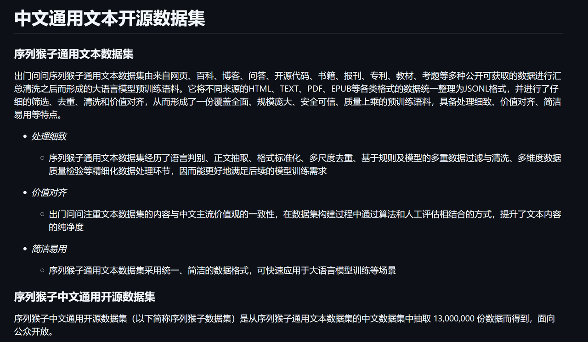

数据集需要手动下载mobvoi\_seq\_monkey\_general\_open\_corpus.zip文件并上传至项目data文件夹内。

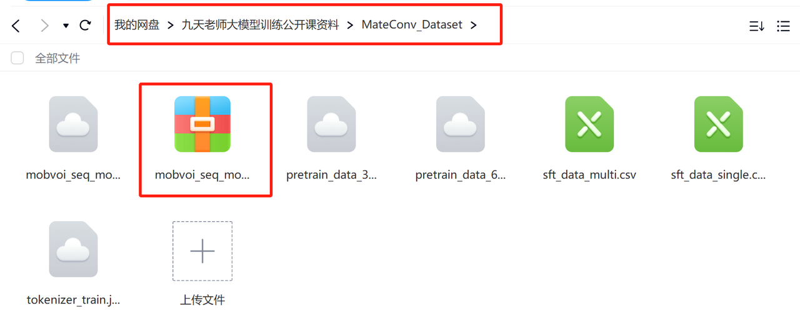

&#x20;

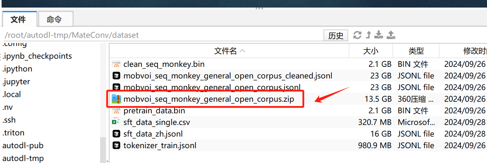

* 文件解压缩

  接下来则需要在服务器上运行如下命令：

```bash
conda activate MateConv
sudo apt-get install unzip
cd /root/autodl-tmp/MateConv/dataset/
unzip mobvoi_seq_monkey_general_open_corpus.zip
```

解压缩后就会得到文件`mobvoi_seq_monkey_general_open_corpus.jsonl`

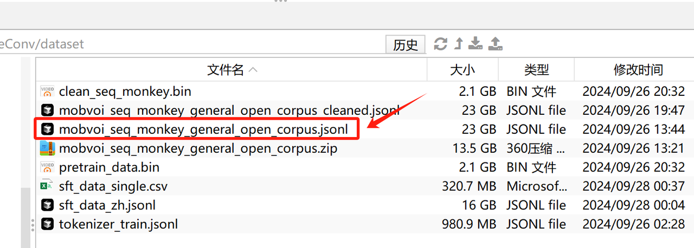

#### 2.预训练集清洗与二进制转化

* Step 1.导入库

```python
import itertools
import re
import json
import jsonlines
import psutil
import ujson
import numpy as np
import pandas as pd
from transformers import AutoTokenizer
from datasets import load_dataset
import os
from tqdm import tqdm
```

```plaintext
/root/miniconda3/envs/MateConv/lib/python3.10/site-packages/tqdm/auto.py:21: TqdmWarning: IProgress not found. Please update jupyter and ipywidgets. See https://ipywidgets.readthedocs.io/en/stable/user_install.html
  from .autonotebook import tqdm as notebook_tqdm
```

* Step 2.定义BOS和EOS标记，并加载分词器

```python
# 定义BOS和EOS标记
bos_token = "<s>"
eos_token = "</s>"
```

```python
# 加载训练好的分词器路径
tokenizer = AutoTokenizer.from_pretrained('/root/autodl-tmp/MateConv/model/mateconv_tokenizer', use_fast=False)
print(f'加载的tokenizer词表大小: {len(tokenizer)}')
```

```plaintext
加载的tokenizer词表大小: 6400
```

* Step 3.读取部分数据

```python
def preview_dataset(file_path, num_lines=5):
    """
    读取并展示数据集的前 num_lines 行
    """
    # 检查文件是否存在
    if not os.path.exists(file_path):
        raise FileNotFoundError(f"{file_path} 文件不存在，请检查路径！")

    # 逐行读取并展示前 num_lines 行
    with jsonlines.open(file_path) as reader:
        for idx, obj in enumerate(reader):
            print(f"第 {idx + 1} 行数据: {obj}")
            if idx + 1 >= num_lines:
                break

# 指定文件路径和需要展示的行数
file_path = './dataset/mobvoi_seq_monkey_general_open_corpus.jsonl'
preview_dataset(file_path, num_lines=5)
```

```plaintext
第 1 行数据: {'text': '在查处虚开增值税专用发票案件中，常常涉及进项留抵税额和税款损失的认定和处理。在计算税款损失时，要不要将进项留抵税额包括在内？\n对此，实务中存在意见分歧。\n有人主张归并，即计算税款损失时包括进项留抵税额；\n有人主张剥离，即计算税款损失时剔除进项留抵税额。分析这个问题，需要确定进项留抵税额与税款损失之间是什么关系。\n理清这二者之间的关系，首先需要了解增值税的概念和其抵扣机制。增值税是以商品（货物、服务等）在流转过程中产生的增值额作为计税依据而征收的一种流转税。为避免重复征税，在增值税中存在抵扣链条机制。\n一般而言，交易上游企业缴纳的税额，交易下游企业可以对相应的税额进行抵扣。\n对增值税一般纳税人来说，其购进货物、服务等取得增值税专用发票，发票上的税额是进项税额。\n其出售货物、服务等，向购买方开具增值税专用发票，发票的税额是销项税额。\n一般情况下，销项税额减去进项税额的金额是应纳税额，企业根据应纳税额按期申报纳税。\n其次需要了解进项留抵税额的概念及产生原因。\n在计算销项税额和进项税额的差额时，有时会出现负数，即当期进项税额大于当期销项税额。这个差额在当期未实现抵扣，为进项留抵税额，在以后纳税人有销项税额时再进行抵扣。\n企业产生进项留抵税额的主要原因是其进项税额和销项税额时间上的不一致。\n例如，企业前期集中采购货物和服务，投资大，销项税率低于进项税率等。\n从税款抵扣的角度看，进项留抵税额只是购进的这部分进项税额参与到增值税应纳税额的计算过程中，但是其对应的进项税额抵扣还未真正实现，一般要等到其未来有相应的销项税额时，才能真正实现进项税额抵扣。\n可见，进项留抵税额处于不确定状态，能否抵扣受到很多因素影响，例如企业经营中断，没有销项税额，这时进项留抵税额就无法实现抵扣。但如果企业按照税收政策规定申请进项留抵退税，进项税额抵扣就随之实现。\n最后需要了解税款损失的概念。\n税款损失，通常是指因虚开增值税专用发票，导致国家税款被骗或者流失的金额。关于税款损失，实务中有多种表述。\n例如，北京大学法学院教授陈兴良曾谈到虚开行为本身不会造成国家税款损失，只有利用发票抵扣时才会造成国家税款损失。刘兵等编著的《虚开增值税专用发票案例司法观点和案例解析》一书中提到：“给国家税款造成损失的数额，实际上就是被骗取的国家税款在侦查终结以前无法追回的部分。”\n赵清海与王家欣合著的《增值税专用发票虚开的判定与预防》一书中提到：“司法实践中，受票方用虚开的增值税专用发票予以抵扣的税款，从而导致受票方应纳税额的减少是法院所认定的国家税款流失的金额。”\n从这些表述可见，税款损失应该是实际造成的损失，不应包括不确定的部分——进项留抵税额，进项留抵税额与税款损失之间不能直接画等号。\n综上分析，进项留抵税额，只是使国家税款处于可能被抵扣的状态，还没有真正造成国家税款流失，一般情况下应将其从税款损失中剥离，特殊条件下将其归并入税款损失。\n例如，当纳税人造假按照税收政策规定申请进项留抵税额退税后，有关税款损失将会从危险状态转化成危害结果，这时候要将有关进项留抵税额并入税款损失。\n所以，在虚开增值税专用发票案件中，一般情况下，如果以纳税人的进项税额作为税款损失的计算基数，在对其进行行政处罚或刑事处罚时，应把进项留抵税额从税款损失中剔除，但纳税人申请进项留抵退税的除外。这样处理，把处罚与危害结果相对应，体现行政处罚法的过罚相当原则和刑法的罚当其罪原则。'}
第 2 行数据: {'text': '读者在使用本《年鉴》时发现与以前本局出版、公布、或内部提供的资料有出入的，概以本《年鉴》为准。\n《年鉴》正文内容分为三大部分。第一部分为文字部分，收录了《2012年政府工作报告》以及《2011年河源市国民经济和社会发展统计公报》。第二部分为统计图，形象地反映建市以来河源市国民经济发展变化情况。第三部分为统计资料，具体分为行政区划和自然资源，综合、核算、人口，农村经济，工业，能源，交通、邮电，贸易业、物价指数，对外经济、旅游，财政、金融和保险，固定资产投资与建筑业，劳动工资，人民生活，文教、卫生和其他，河源市乡镇主要经济指标，广东省县域主要经济指标,广东省各市主要经济指标等16部分。此外，为便于读者正确理解和使用统计资料，特附主要统计指标解释、统计术语简介及统计法律法规等资料。\n《年鉴》中，本市的数据是根据我局及有关部门的统计年报整理汇编而成，由于某些专业统计制度和统计口径的变化，有些数据空缺。使用本《年鉴》时，请注意指标名称的含义、统计口径、统计范围、计算单位、可比价与现行价(当年价)等。\n《年鉴》第一部分中的有些数据为初步统计数，凡与本《年鉴》中第三部分的数据有出入的，则以第三部分的统计数据为准。\n本《年鉴》部分统计数据使用了四舍五入的进位方法，因此，可能令统计表内个别项目相加与总数略有出入。\n本《年鉴》统计表中符号使用说明：“＃”表示其中主要项；“空格”表示该项统计指标数据不详或无该项数据。\n本《年鉴》的编辑出版，得到县、区及市直有关部门和单位的大力支持，在此表示感谢！本书疏漏之处敬请批评指正。\n下载说明： �本站下载的文件一律为压缩文件，请使用 WinRAR 解压。\n�PDF格式的资料请使用 Adobe Reader 浏览。\n�本站提供的一些资料是供学习研究之用，如用于商业用途，请购买正版。'}
第 3 行数据: {'text': '初中阶段是学生身心发育的一个突变期。尤其是初一学生，从小学到中学，随着环境改变，课程增多，难度加大，他们内心发生了急剧变化，产生了许多烦恼、困惑，造成较大的心理偏差，这就需要教师和家长及时给予心理指导和帮助。\n一、心理偏差的种种表现\n1、骄傲自负心理。这种心理偏差主要表现在思维敏捷、小学成绩拔尖的学生身上，特别是一些长期担任班干部、竞赛获奖、父母有权力的学生表现尤为明显。\n2．单纯求趣心理。求趣激趣，这是教学的原则之一，但是，有些初一学生过分地追求接受知识要符合自己的兴趣，还想回到幼儿园、小学时“游戏教育”和“愉快教育”中去，不能努力适应初中阶段的学习生活。\n3．自卑孤僻心理。多数来自普通工薪家庭及农村贫困地区或遭遇父母婚变的学生，往往在干部、富家子弟、有特长的同学面前感到自卑，心理压抑，行为孤僻，甚至变态的自尊，影响学习。\n4．胆怯畏惧心理。部分性格内向、胆小的学生，主要是女生，羞于用语言表达思想，沉溺于内心活动和笔头表达。内心活动不能外显，妨碍了思维素质的深入发展。\n5．浮躁马虎心理。部分活泼好动的学生，智力水平不低，但就是不能静下心学习，总是浅尝辄止，马虎应付，不愿作深入的思考，常常“半罐水响叮当”。\n6．贪图享受心理。一些家境较好的学生，行为懒散，好逸恶劳，学习上畏难怕苦，生活上讲吃讲穿。\n二、上述心理偏差的形成原因\n1．生理上的原因。初中学生处于发育高峰期，身高体重剧增，性发育开始。生理上的急剧变化使儿童意识到自己不再是孩子，“成人感”增强。但是，青年身体成熟速度存在着很大的个体差异：不同性别之间相差两年左右，同性别之间相差四年左右。因此，同是初中学生，一部分学生生理已跨入青年期，而另一部分学生可能还停留在童年期。\n2．心理上的原因。随着生理的变化，“成人感”的出现，初中学生心理产生“独立”，力求摆脱对成人的依赖，老师、家长在他们心目中的权威降低，同学之间相互影响增强。思维上发展了批判性，但由于经验的缺乏含有片面性和主观性；行为上出现“独特性”和“受暗示性”乃至“抗拒性”，即逆反心理；情绪上带有冲动性，不善于克制自己；兴趣和愿望上带有随意性、多变性、狂热性，常为了所谓讲“义气”而庇护同伴，或为同伴打抱不平；感情上具有“闭锁性”，而对于艰苦的学习活动特别重要的意志品质，则还处在比较软弱的状态。\n3．环境的原因。心理学认为，个体的生物遗传因素规定了发展的潜在可能范围，而个体环境教育则确定他在此可能范围内的现实水平。环境条件有利与否对个体发展的现实水平起了决定性作用。\n①家庭。社会的信仰、观念等社会化目标都是首先通过父母的过渡，以高度个性化了的、有选择的形式传递给儿童的。父母本身的个性特征、社会地位、教育水平、宗教信仰、价值标准等等都强烈地影响他们的后代。父母的教养方式、家庭结构、物质条件、人际环境、文化和情绪氛围，都在很大程度上影响着学生。\n②学校。学校不仅是对学生传授文化科学知识，进行政治思想教育的社会基本教育单元，还是促进学生良好品格形成和发展的重要场所。学生在学校里形成良好的品格，才能顺利走向社会，适应社会生活。反之，则会发生各种问题。而现在的应试教育制度，像紧箍咒一样，时时冲击着素质教育，教师以升学率论质量给待遇，使一些教师对成绩好的学生倍加宠爱，对成绩差的学生则百般呵斥。更有少数教师将腐朽庸俗的人际关系引入师生和家长的关系，身教言传，污染了学生心灵；让孩子过早成人化、世故化。\n③社会。社会上各种腐朽思想沉渣泛起，对学生负面影响很大。影视传媒、流失少年、勒索等等，浸染着学生稚嫩的心灵；电子游戏机、卡拉OK厅等，又使我们的孩子面临着极强的诱惑，意志薄弱者稍不留意，便坠入其间。\n三、纠正初中学生的心理偏差的对策\n为了纠正初中学生的心理偏差，我们必须对教育环境影响予以高度重视。在现有环境中，我们应做到：\n1．坚持以德、智、体、美、劳全面的教育方针为指导思想进行教育管理，坚持“要成才先成人”的教育思想。\n2．“学高为师，身正为范。”作为教师，必须加强道德修养，提高职业素质，全面关心和爱护每一位学生的身心健康发展。\n3．以激励为心育的主要手段。我们要将思想教育和学生喜闻乐见的实践活动结合起来，不断提高学生对美的感受和鉴赏力，使其求真向善，茁壮成长。\n4．形成教育合力。在抓好班集体建设的同时，我们必须密切联系家长，与家长一起研究分析学生，共同教育学生。\n5．帮助学生正确认识、分析、评价自己的心理过程。让他们将社会化标准－－《中学生日常行为规范》逐渐内化，用以规范自己的言行，自觉抵制不良诱惑，不断提高自我意识水平和自我教育能力。\n6．对各类心理偏差学生施以不同的教育。对有骄傲自负心理的学生施以“挫折教育”；对有自卑、胆怯畏惧心理的学生施以“磨难教育”；对有虚荣忌妒、趋同报复、庸俗心理的学生施以分辨真美善、假丑恶的“是非教育”等。\n与此同时，还应努力提高、优化当代中学生的心理特点。\n首先，作为家长必须转变观念。对自己的孩子，在作业和职业方面的“期望值”不能脱离子女的实际而好高骛远，每个孩子因智力因素、情趣爱好，性格意志和心理承力各不相同，如果孩子确实尽了自己的努力，而未达到你所期望的目标，不应过多责怪，更不能冷嘲热讽，惩罚打骂。诚然，家长望子成龙“天经地义”，无可厚非。但“龙”的内涵并不专指读大学、考研究生。“三百六十行，行行出状元”，如果每一位家长都能建立这样的“职业观”，让孩子在宽松的环境里读书，\n其次，作为教育者----教师来说，则更要不断学习，及时吸收新鲜气息，不断提高自己的思想、政治教育水平，提高自己的专业知识和业务水平，做到不仅能教书育人，更能进行教育评价，尊重学生人格，依法执教，用先进的具有创造性的教育思想、理论、方法促进教育水平的提高，注重培养学生的全面发展，加强能力培养和思维训练，提高学生的综合素质。具体方法如下：\n第一，让学生充分了解自己的心理特点，通过与周围的同学以及其他同龄人相比，通过同电影、小说电视里特定情景中的人物相比，如宣传奥斯特洛夫斯基、托尔斯泰、张海迪、贝多芬等等，通过对比，找出自己在哪些方面存在弱点，或者也可以通过父母、老师、同学对自己经常的评价了解自己在哪些方面存在不良心理特点，从而扬长避短。\n第二，选择恰当的方法进行锻炼。例如：\n1、教他们多读好书，如《周恩来》、《钢铁是怎样炼成的》等优化心理品质。人类的几千年文明，其智慧、经验、真知灼见，都浓缩于书中，如果多读好书，能经常与这样一些“高尚朋友”对话，听听他们的“指点”以此开阔视野，启迪智慧，这对优化学生的心理品质是大有裨益的，作为中学生，不仅要读好的故事书，还应该读一些伟人的传记，读一些思想、修养方面的书籍，并且养成做读书笔记的习惯。\n2、鼓励学生参加社会活动，锻炼心理品质，如送“温暖小组”、“助残小分队”等活动的开展，都是锻炼心理品质行之有效的方法。\n3、也要注重培养学生琴、棋、书、画、音、体、美等美育活动，有助于疏导、排解不良情绪，给人以美的熏陶和享受，从而对心理产生良性刺激。让美来充实孩子的精神生活，让美来帮助塑造孩子健康的心理。\n4、在条件可能的情况下，可组织学生春游、郊游、野炊等活动，学生也可以利用寒、曙假、节假日到一些名胜古迹去游览、旅游、参观、陶冶自己的情操，走进大自然，亲近大自然，细心体会大自然，不仅能使人心胸开阔、情绪放松，精神振奋，还常能使人领悟到人生的真谛。\n只有这样，优化了学生的心理特点，才能促使学生健康成长，从而成为新世纪的合格人才。'}
第 4 行数据: {'text': '我们生产的食品消泡剂，具有可以快速消除泡沫的特点。\n丹东食品消泡剂相关内容：一般而言，纯水和纯表面活性剂不起泡，这是因为它们的表面和内部是均匀的，很难形成弹性薄膜，即使形成亦不稳定，会瞬间消失。\n丹东食品消泡剂选择：\n1. 相容性：相容性是指两种或者两种以上物质混合时，不产生相斥分离现象的能力，相容性好，消泡剂就能够长期、稳定、均匀地存在于体系中，进而发挥消抑泡的作用；反之，就会出现分层等现象，使消泡剂的消泡工作无法正常进行。\n2. 消泡能力：消泡能力是消泡剂的最主要性能，鉴别此项性能的标准是在同等条件下，分别加入等量不同的消泡剂，观察消泡剂的消泡速度。'}
第 5 行数据: {'text': '程总在座谈中首先向学校的客人介绍了三一集团和北京三一重机的情况，以及在公司快速发展过程中对人才的渴求，指出通过校企联合，学校可以依靠企业的参与制定人才培养方案，使培养的人才更贴近市场，贴近企业，又可以借助企业的资源充实学校的办学实力。同时校企联合有利于企业的可持续发展。校企联合是企业实现人才战略的途径。企业在与高等职业教育合作过程中可以贯彻自己的培养意向，满足对生产第一线实用型人才的需求。\n武汉交通职业学院盛建龙院长和河北工业职业技术学院李军锁副院长分别介绍了各自学校人才培养情况，并对三一集团的高速发展表示钦佩和赞赏，表示将和公司开展深入、全面的合作，优势互补，使学校和企业实现充分的资源共享，建立全方位长效合作机制。\n本次联合办学签约仪式，是北京桩机高起点校企合作的开始。按照北京桩机人力资源提升计划，明年北京桩机将和所高职高专院校进行联合办学成立“三一班”，均为统招大专高技学历层次，涉及焊接、装配、机加工、售后服务等紧缺工种，“三一班”学员将达到近300人，为北京桩机的下一个五年跨越式发展打下良好的人才基础。'}
```

JSONL（JSON Lines）：是一种逐行存储 JSON 对象的文件格式，每行是一个独立的 JSON 对象，行与行之间并没有特定的结构。每行的 JSON 对象独立存在，不属于同一个数组或对象。例如：

```python
{"name": "Alice", "age": 25}
{"name": "Bob", "age": 30}
```

```plaintext
{'name': 'Bob', 'age': 30}
```

* **什么样的 JSONL 中会携带无效的 JSON 格式**？

在 JSONL 文件中，每一行都应当是有效的 JSON 对象，但有以下几种常见情况会导致无效的 JSON 行：

1. **缺少必要的符号**：JSON 对象必须用 `{}` 括起来，且键值对之间要用逗号分隔。例如，缺少结束花括号：

```plaintext
{"name": "Alice", "age": 25
```

1. **引号问题**：JSON 的键和值（非数字类型）必须使用双引号。如果使用了单引号或忘记引号，都会导致无效格式：

```plaintext
{'name': 'Alice', 'age': 25}  # 错误的引号
```

1. **数据未完整写入**：例如由于文件写入中断，某一行可能是不完整的 JSON 对象：

```plaintext
{"name": "Alice", "age":
```

1. **额外的标点符号或换行符**：一些 JSONL 文件可能错误地加入了多余的标点符号或不正确的换行符，导致解析错误：

```plaintext
{"name": "Alice", "age": 25},
{"name": "Bob", "age": 30}
```

1. 这里的逗号在 JSONL 中是不需要的，因为每一行都是独立的。

2. **字符编码问题**：文件可能存在编码不一致的情况，特别是非 UTF-8 编码时，可能会引发解码错误，例如你的错误提示中看到的 "codec can't decode byte"。

* **无效的 JSON 格式示例**

例如，以下 JSON 数据格式就是无效的：

* 缺少关闭括号：

```json
{"name": "Alice", "age": 25
```

* 键名未加双引号：

```json
{name: "Alice", "age": 25}
```

* 值部分使用了错误的引号：

```json
{"name": 'Alice', "age": 25}
```

* Step 4.统计与清理数据

```python
def get_total_lines(file_path):
    """
    获取 JSONL 文件的总行数，不忽略错误，保证能够全面统计。
    """
    with open(file_path, 'rb') as f:  # 使用二进制模式避免编码问题
        return sum(1 for _ in f)
```

```python
def check_jsonl_format(file_path):
    """
    检查 JSONL 文件中的每一行是否是有效的 JSON 格式，带进度显示，并统计所有有问题的行。
    """
    total_lines = get_total_lines(file_path)  # 获取文件总行数
    valid_lines = 0
    invalid_lines = 0

    # 使用逐行读取，捕获 JSON 和编码错误
    with open(file_path, 'rb') as f:  # 使用二进制读取避免编码问题
        # 使用 tqdm 进度条显示检查进度
        for idx, line in tqdm(enumerate(f), total=total_lines, desc="Checking JSONL format"):
            try:
                # 先尝试将每行数据解码为 UTF-8
                decoded_line = line.decode('utf-8')
                # 然后检查是否是有效的 JSON 格式
                obj = jsonlines.Reader([decoded_line]).read()
                valid_lines += 1
            except UnicodeDecodeError as e:
                print(f"Encoding error at line {idx + 1}: {e}")
                invalid_lines += 1
            except jsonlines.InvalidLineError as e:
                print(f"Invalid JSON at line {idx + 1}: {e}")
                invalid_lines += 1

    print(f"检查完成，文件中共有 {valid_lines} 行有效的 JSON 数据，{invalid_lines} 行无效的 JSON 数据。")
    return valid_lines, invalid_lines
```

```python
valid_lines, invalid_lines = check_jsonl_format(file_path)
```

```plaintext
Checking JSONL format: 100%|██████████| 9598787/9598787 [02:01<00:00, 79274.88it/s]

Encoding error at line 9598787: 'utf-8' codec can't decode byte 0xe5 in position 503: unexpected end of data
检查完成，文件中共有 9598786 行有效的 JSON 数据，1 行无效的 JSON 数据。
```

```python
def remove_invalid_line(file_path, output_path, invalid_line_num):
    """
    读取文件，跳过指定的无效行，并将结果写入新文件
    """
    with open(file_path, 'rb') as infile, open(output_path, 'wb') as outfile:
        for idx, line in enumerate(infile):
            if idx + 1 != invalid_line_num:  # 跳过无效行
                outfile.write(line)

# 使用该函数删除第 9598787 行并保存为新文件
remove_invalid_line('./dataset/mobvoi_seq_monkey_general_open_corpus.jsonl',
                    './dataset/mobvoi_seq_monkey_general_open_corpus_cleaned.jsonl', 
                    invalid_line_num=9598787)
```

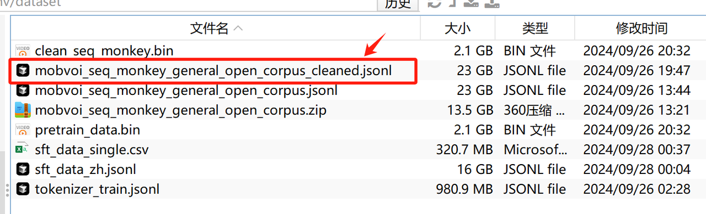

* Step 5.定义处理函数（逐块处理数据）

```python
def process_seq_monkey(chunk_size=50000):
    """
    逐块读取 mobvoi_seq_monkey_general_open_corpus.jsonl 文件，
    对文本进行分词，并将分词结果保存为二进制文件，支持跳过无效行，并显示处理进度。
    """
    doc_ids = []
    chunk_idx = 0
    total_lines = 0

    # 先计算总行数以便显示进度
    with open('./dataset/mobvoi_seq_monkey_general_open_corpus_cleaned.jsonl', 'r', encoding='utf-8') as f:
        total_lines = sum(1 for _ in f)

    # 打开jsonlines文件逐行读取
    with jsonlines.open('./dataset/mobvoi_seq_monkey_general_open_corpus_cleaned.jsonl') as reader:
        # 使用 tqdm 进度条显示进度
        with tqdm(total=total_lines, desc="Processing lines") as pbar:
            while True:
                try:
                    # 使用 itertools.islice 按块读取文件，每次读取 chunk_size 行数据
                    chunk = list(itertools.islice(reader, chunk_size))
                except jsonlines.InvalidLineError as e:
                    print(f"Skipping invalid chunk at chunk {chunk_idx}: {e}")
                    continue

                if not chunk:  # 如果读取到文件末尾，则停止
                    break

                # 遍历块中的每一行数据
                # 逐行对数据进行编码（按token进行编码）
                for idx, obj in enumerate(chunk):
                    try:
                        # 从每一行数据中提取'text'字段（即文本内容）
                        content = obj.get('text', '')
                        
                        # 跳过长度超过512的文本
                        if len(content) > 512:
                            continue

                        # 对文本进行分词，将其转为 token ids 序列，并加上BOS和EOS标记
                        text_id = tokenizer(f'{bos_token}{content}{eos_token}').data['input_ids']
                        
                        # 将分词结果添加到 doc_ids 列表中
                        doc_ids += text_id

                    except UnicodeDecodeError as e:
                        # 如果遇到编码错误，跳过该行，并打印错误信息
                        print(f"Skipping invalid line {chunk_idx * chunk_size + idx + 1}: {e}")
                        continue

                # 每处理完一块数据，更新 chunk_idx 并打印进度信息
                chunk_idx += 1
                pbar.update(len(chunk))  # 更新进度条

                # 如果累积的 token ids 超过 1,000,000 个，保存到文件中
                if len(doc_ids) > 1000000:
                    arr = np.array(doc_ids, dtype=np.uint16)
                    with open(f'./dataset/clean_seq_monkey.bin', 'ab') as f:
                        f.write(arr.tobytes())
                    doc_ids = []

    # 如果处理完所有数据后 doc_ids 中还有未保存的内容，最后再保存一次
    if doc_ids:
        arr = np.array(doc_ids, dtype=np.uint16)
        with open(f'./dataset/clean_seq_monkey.bin', 'ab') as f:
            f.write(arr.tobytes())
```

```python
def pretrain_process():
    """
    函数的作用是调用 process_seq_monkey() 函数生成数据，
    然后整合所有生成的二进制文件，并将其合并保存为一个总的预训练数据文件。
    """
    # 调用 process_seq_monkey 函数处理数据
    process_seq_monkey()

    # 数据文件路径列表，目前只处理 clean_seq_monkey.bin 文件
    data_path_list = [
        './dataset/clean_seq_monkey.bin'
    ]
    
    data_lst = []
    
    # 读取生成的二进制文件
    for data_path in data_path_list:
        with open(data_path, 'rb') as f:
            # 将二进制文件中的内容加载到 numpy 数组中
            data = np.fromfile(f, dtype=np.uint16)
            data_lst.append(data)

    # 将所有读取到的数据合并为一个大数组
    arr = np.concatenate(data_lst)
    print(f"合并后的数据大小: {arr.shape}")

    # 将合并后的数据保存为最终的预训练数据文件
    with open('./dataset/pretrain_data.bin', 'wb') as f:
        f.write(arr.tobytes())
```

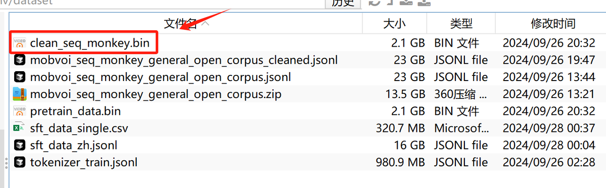

* **为什么要将数据转换为二进制文件**：

1. **高效存储和读取**：二进制文件相比文本文件具有更高的存储和读取效率，尤其是对于大规模的数据集。由于二进制文件是以原始的机器可读格式存储的，不需要进行字符编码转换，因此读取速度更快。对于预训练阶段通常需要处理大量数据，二进制文件可以显著减少读取时间。

2. **减少文件大小**：二进制格式的数据比常规的文本格式更紧凑，占用的磁盘空间更少。这对存储大数据集尤其重要，能够显著节省存储资源。

3. **与深度学习框架兼容**：深度学习框架（如 PyTorch、TensorFlow 等）在训练时往往需要数据以某种高效的格式加载到内存中。将数据保存为二进制格式有助于快速载入到 NumPy 数组或直接作为模型输入，避免了每次都需要重新转换。

4. **跨平台一致性**：二进制文件可以跨平台使用而不丢失精度和数据信息，适合在不同的硬件和操作系统环境中使用。

* 这个函数的具体作用：

* `process_seq_monkey()` 函数负责处理原始数据并生成单个或多个二进制文件。

* 然后这些生成的二进制文件通过 `np.fromfile` 读取并存入 NumPy 数组，所有的二进制数据都会被拼接到一起。

* 最后，通过 `np.concatenate` 合并所有的 NumPy 数组，生成一个总的数据数组，并将其存储为一个大的二进制文件 (`pretrain_data.bin`)，供后续的模型预训练使用。

总结来说，这种处理方式主要是为了提高效率，方便在大规模预训练任务中快速加载数据并减少磁盘和内存的占用。

* 运行数据处理

```python
pretrain_process()
```

```plaintext
Processing lines: 100%|██████████| 9598786/9598786 [36:17<00:00, 4408.66it/s]


合并后的数据大小: (1115541384,)
```

运行结束后会创建一个名为pretrain\_data.bin的二进制数据文件，该文件也就是接下来进行模型预训练的文件：

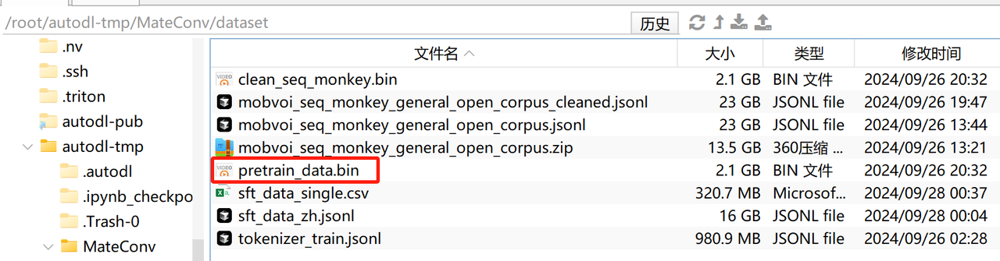

### 二、MateConv预训练开启、打断与中继过程

#### 1.MateConv基础模型架构代码编写

  在准备好了数据集之后，接下来即可开启大模型的预训练过程。公开课里我们不深入探讨模型结构和相关代码，总的来说MateConv是采用了Llama 3架构的文本大模型，具体代码如下：

```python
import math
import struct
import inspect
import time

from .LMConfig import LMConfig
from typing import Any, Optional, Tuple
import numpy as np
import torch
import torch.nn.functional as F
from torch import nn
from transformers import PreTrainedModel
from transformers.modeling_outputs import CausalLMOutputWithPast


class RMSNorm(torch.nn.Module):
    def __init__(self, dim: int, eps: float):
        super().__init__()
        self.eps = eps
        self.weight = nn.Parameter(torch.ones(dim))

    def _norm(self, x):
        return x * torch.rsqrt(x.pow(2).mean(-1, keepdim=True) + self.eps)

    def forward(self, x):
        output = self._norm(x.float()).type_as(x)
        return output * self.weight


def precompute_pos_cis(dim: int, end: int, theta: float = 10000.0):
    freqs = 1.0 / (theta ** (torch.arange(0, dim, 2)[: (dim // 2)].float() / dim))
    t = torch.arange(end, device=freqs.device)  # type: ignore
    freqs = torch.outer(t, freqs).float()  # type: ignore
    pos_cis = torch.polar(torch.ones_like(freqs), freqs)  # complex64
    return pos_cis


def apply_rotary_emb(xq, xk, pos_cis):
    def unite_shape(pos_cis, x):
        ndim = x.ndim
        assert 0 <= 1 < ndim
        assert pos_cis.shape == (x.shape[1], x.shape[-1])
        shape = [d if i == 1 or i == ndim - 1 else 1 for i, d in enumerate(x.shape)]
        return pos_cis.view(*shape)

    xq_ = torch.view_as_complex(xq.float().reshape(*xq.shape[:-1], -1, 2))
    xk_ = torch.view_as_complex(xk.float().reshape(*xk.shape[:-1], -1, 2))
    pos_cis = unite_shape(pos_cis, xq_)
    xq_out = torch.view_as_real(xq_ * pos_cis).flatten(3)
    xk_out = torch.view_as_real(xk_ * pos_cis).flatten(3)
    return xq_out.type_as(xq), xk_out.type_as(xk)


def repeat_kv(x: torch.Tensor, n_rep: int) -> torch.Tensor:
    """torch.repeat_interleave(x, dim=2, repeats=n_rep)"""
    bs, slen, n_kv_heads, head_dim = x.shape
    if n_rep == 1:
        return x
    return (
        x[:, :, :, None, :]
        .expand(bs, slen, n_kv_heads, n_rep, head_dim)
        .reshape(bs, slen, n_kv_heads * n_rep, head_dim)
    )


class Attention(nn.Module):
    def __init__(self, args: LMConfig):
        super().__init__()
        self.n_kv_heads = args.n_heads if args.n_kv_heads is None else args.n_kv_heads
        assert args.n_heads % self.n_kv_heads == 0
        self.n_local_heads = args.n_heads
        self.n_local_kv_heads = self.n_kv_heads
        self.n_rep = self.n_local_heads // self.n_local_kv_heads
        self.head_dim = args.dim // args.n_heads
        self.wq = nn.Linear(args.dim, args.n_heads * self.head_dim, bias=False)
        self.wk = nn.Linear(args.dim, self.n_kv_heads * self.head_dim, bias=False)
        self.wv = nn.Linear(args.dim, self.n_kv_heads * self.head_dim, bias=False)
        self.wo = nn.Linear(args.n_heads * self.head_dim, args.dim, bias=False)
        self.k_cache, self.v_cache = None, None
        self.attn_dropout = nn.Dropout(args.dropout)
        self.resid_dropout = nn.Dropout(args.dropout)
        self.dropout = args.dropout
        self.flash = hasattr(torch.nn.functional, 'scaled_dot_product_attention') and args.flash_attn

        # print("WARNING: using slow attention. Flash Attention requires PyTorch >= 2.0")
        mask = torch.full((1, 1, args.max_seq_len, args.max_seq_len), float("-inf"))
        mask = torch.triu(mask, diagonal=1)
        self.register_buffer("mask", mask, persistent=False)

    def forward(self, x: torch.Tensor, pos_cis: torch.Tensor, kv_cache=False):
        bsz, seqlen, _ = x.shape

        xq, xk, xv = self.wq(x), self.wk(x), self.wv(x)

        xq = xq.view(bsz, seqlen, self.n_local_heads, self.head_dim)
        xk = xk.view(bsz, seqlen, self.n_local_kv_heads, self.head_dim)
        xv = xv.view(bsz, seqlen, self.n_local_kv_heads, self.head_dim)

        xq, xk = apply_rotary_emb(xq, xk, pos_cis)

        # 更高效的kv_cache实现
        if kv_cache and self.eval():
            if seqlen == 1 and all(cache is not None for cache in (self.k_cache, self.v_cache)):
                xk = torch.cat((self.k_cache, xk), dim=1)
                xv = torch.cat((self.v_cache, xv), dim=1)
            self.k_cache, self.v_cache = xk, xv

        xk = repeat_kv(xk, self.n_rep)  # (bs, seqlen, n_local_heads, head_dim)
        xv = repeat_kv(xv, self.n_rep)  # (bs, seqlen, n_local_heads, head_dim)

        xq = xq.transpose(1, 2)
        xk = xk.transpose(1, 2)
        xv = xv.transpose(1, 2)

        if self.flash and seqlen != 1:
            output = torch.nn.functional.scaled_dot_product_attention(xq, xk, xv, attn_mask=None,
                                                                      dropout_p=self.dropout if self.training else 0.0,
                                                                      is_causal=True)
        else:
            scores = torch.matmul(xq, xk.transpose(2, 3)) / math.sqrt(self.head_dim)
            scores = scores + self.mask[:, :, :seqlen, :seqlen]  # (bs, n_local_heads, seqlen, cache_len + seqlen)
            scores = F.softmax(scores.float(), dim=-1).type_as(xq)
            scores = self.attn_dropout(scores)
            output = torch.matmul(scores, xv)  # (bs, n_local_heads, seqlen, head_dim)

        output = output.transpose(1, 2).contiguous().view(bsz, seqlen, -1)

        output = self.wo(output)
        output = self.resid_dropout(output)
        return output


class FeedForward(nn.Module):
    def __init__(self, dim: int, hidden_dim: int, multiple_of: int, dropout: float):
        super().__init__()
        if hidden_dim is None:
            hidden_dim = 4 * dim
            hidden_dim = int(2 * hidden_dim / 3)
            hidden_dim = multiple_of * ((hidden_dim + multiple_of - 1) // multiple_of)
        self.w1 = nn.Linear(dim, hidden_dim, bias=False)
        self.w2 = nn.Linear(hidden_dim, dim, bias=False)
        self.w3 = nn.Linear(dim, hidden_dim, bias=False)
        self.dropout = nn.Dropout(dropout)

    def forward(self, x):
        return self.dropout(self.w2(F.silu(self.w1(x)) * self.w3(x)))


class MoEGate(nn.Module):
    def __init__(self, config: LMConfig):
        super().__init__()
        self.config = config
        self.top_k = config.num_experts_per_tok
        self.n_routed_experts = config.n_routed_experts

        self.scoring_func = config.scoring_func
        self.alpha = config.aux_loss_alpha
        self.seq_aux = config.seq_aux

        self.norm_topk_prob = config.norm_topk_prob
        self.gating_dim = config.dim
        self.weight = nn.Parameter(torch.empty((self.n_routed_experts, self.gating_dim)))
        self.reset_parameters()

    def reset_parameters(self) -> None:
        import torch.nn.init as init
        init.kaiming_uniform_(self.weight, a=math.sqrt(5))

    def forward(self, hidden_states):
        bsz, seq_len, h = hidden_states.shape

        hidden_states = hidden_states.view(-1, h)
        logits = F.linear(hidden_states, self.weight, None)
        if self.scoring_func == 'softmax':
            scores = logits.softmax(dim=-1)
        else:
            raise NotImplementedError(f'insupportable scoring function for MoE gating: {self.scoring_func}')

        topk_weight, topk_idx = torch.topk(scores, k=self.top_k, dim=-1, sorted=False)

        if self.top_k > 1 and self.norm_topk_prob:
            denominator = topk_weight.sum(dim=-1, keepdim=True) + 1e-20
            topk_weight = topk_weight / denominator

        if self.training and self.alpha > 0.0:
            scores_for_aux = scores
            aux_topk = self.top_k
            topk_idx_for_aux_loss = topk_idx.view(bsz, -1)
            if self.seq_aux:
                scores_for_seq_aux = scores_for_aux.view(bsz, seq_len, -1)
                ce = torch.zeros(bsz, self.n_routed_experts, device=hidden_states.device)
                ce.scatter_add_(1, topk_idx_for_aux_loss,
                                torch.ones(bsz, seq_len * aux_topk, device=hidden_states.device)).div_(
                    seq_len * aux_topk / self.n_routed_experts)
                aux_loss = (ce * scores_for_seq_aux.mean(dim=1)).sum(dim=1).mean() * self.alpha
            else:
                mask_ce = F.one_hot(topk_idx_for_aux_loss.view(-1), num_classes=self.n_routed_experts)
                ce = mask_ce.float().mean(0)
                Pi = scores_for_aux.mean(0)
                fi = ce * self.n_routed_experts
                aux_loss = (Pi * fi).sum() * self.alpha
        else:
            aux_loss = None
        return topk_idx, topk_weight, aux_loss


class MOEFeedForward(nn.Module):
    def __init__(self, config: LMConfig):
        super().__init__()
        self.config = config
        self.experts = nn.ModuleList([
            FeedForward(
                dim=config.dim,
                hidden_dim=config.hidden_dim,
                multiple_of=config.multiple_of,
                dropout=config.dropout,
            )
            for _ in range(config.n_routed_experts)
        ])

        self.gate = MoEGate(config)
        if config.n_shared_experts is not None:
            self.shared_experts = FeedForward(
                dim=config.dim,
                hidden_dim=config.hidden_dim,
                multiple_of=config.multiple_of,
                dropout=config.dropout,
            )

    def forward(self, x):
        identity = x
        orig_shape = x.shape
        bsz, seq_len, _ = x.shape

        # 使用门控机制选择专家
        topk_idx, topk_weight, aux_loss = self.gate(x)

        x = x.view(-1, x.shape[-1])
        flat_topk_idx = topk_idx.view(-1)

        if self.training:
            # 训练模式下，重复输入数据
            x = x.repeat_interleave(self.config.num_experts_per_tok, dim=0)
            y = torch.empty_like(x, dtype=torch.float16)
            for i, expert in enumerate(self.experts):
                y[flat_topk_idx == i] = expert(x[flat_topk_idx == i])
            y = (y.view(*topk_weight.shape, -1) * topk_weight.unsqueeze(-1)).sum(dim=1)
            y = y.view(*orig_shape)
        else:
            # 推理模式下，只选择最优专家
            y = self.moe_infer(x, flat_topk_idx, topk_weight.view(-1, 1)).view(*orig_shape)

        if self.config.n_shared_experts is not None:
            y = y + self.shared_experts(identity)

        return y

    @torch.no_grad()
    def moe_infer(self, x, flat_expert_indices, flat_expert_weights):
        expert_cache = torch.zeros_like(x)
        idxs = flat_expert_indices.argsort()
        tokens_per_expert = flat_expert_indices.bincount().cpu().numpy().cumsum(0)
        token_idxs = idxs // self.config.num_experts_per_tok
        # 例如当tokens_per_expert=[6, 15, 20, 26, 33, 38, 46, 52]
        # 当token_idxs=[3, 7, 19, 21, 24, 25,  4,  5,  6, 10, 11, 12...]
        # 意味着当token_idxs[:6] -> [3,  7, 19, 21, 24, 25,  4]位置的token都由专家0处理，token_idxs[6:15]位置的token都由专家1处理......
        for i, end_idx in enumerate(tokens_per_expert):
            start_idx = 0 if i == 0 else tokens_per_expert[i - 1]
            if start_idx == end_idx:
                continue
            expert = self.experts[i]
            exp_token_idx = token_idxs[start_idx:end_idx]
            expert_tokens = x[exp_token_idx]
            expert_out = expert(expert_tokens)
            expert_out.mul_(flat_expert_weights[idxs[start_idx:end_idx]])
            # 使用 scatter_add_ 进行 sum 操作
            expert_cache.scatter_add_(0, exp_token_idx.view(-1, 1).repeat(1, x.shape[-1]), expert_out)

        return expert_cache


class TransformerBlock(nn.Module):
    def __init__(self, layer_id: int, args: LMConfig):
        super().__init__()
        self.n_heads = args.n_heads
        self.dim = args.dim
        self.head_dim = args.dim // args.n_heads
        self.attention = Attention(args)

        self.layer_id = layer_id
        self.attention_norm = RMSNorm(args.dim, eps=args.norm_eps)
        self.ffn_norm = RMSNorm(args.dim, eps=args.norm_eps)

        if args.use_moe:
            self.feed_forward = MOEFeedForward(args)
        else:
            self.feed_forward = FeedForward(
                dim=args.dim,
                hidden_dim=args.hidden_dim,
                multiple_of=args.multiple_of,
                dropout=args.dropout,
            )

    def forward(self, x, pos_cis, kv_cache=False):
        h = x + self.attention(self.attention_norm(x), pos_cis, kv_cache)
        out = h + self.feed_forward(self.ffn_norm(h))
        return out


class Transformer(PreTrainedModel):
    config_class = LMConfig
    last_loss: Optional[torch.Tensor]

    def __init__(self, params: LMConfig = None):
        super().__init__(params)
        if not params:
            params = LMConfig()
        self.params = params
        self.vocab_size = params.vocab_size
        self.n_layers = params.n_layers

        self.tok_embeddings = nn.Embedding(params.vocab_size, params.dim)
        self.dropout = nn.Dropout(params.dropout)
        self.layers = torch.nn.ModuleList()
        for layer_id in range(self.n_layers):
            self.layers.append(TransformerBlock(layer_id, params))
        self.norm = RMSNorm(params.dim, eps=params.norm_eps)
        self.output = nn.Linear(params.dim, params.vocab_size, bias=False)
        self.tok_embeddings.weight = self.output.weight
        pos_cis = precompute_pos_cis(self.params.dim // self.params.n_heads, self.params.max_seq_len)
        self.register_buffer("pos_cis", pos_cis, persistent=False)

        self.apply(self._init_weights)

        for pn, p in self.named_parameters():
            if pn.endswith('w3.weight') or pn.endswith('wo.weight'):
                torch.nn.init.normal_(p, mean=0.0, std=0.02 / math.sqrt(2 * params.n_layers))

        self.last_loss = None
        self.OUT = CausalLMOutputWithPast()
        self._no_split_modules = [name for name, _ in self.named_modules()]

    def _init_weights(self, module):
        if isinstance(module, nn.Linear):
            torch.nn.init.normal_(module.weight, mean=0.0, std=0.02)
            if module.bias is not None:
                torch.nn.init.zeros_(module.bias)
        elif isinstance(module, nn.Embedding):
            torch.nn.init.normal_(module.weight, mean=0.0, std=0.02)

    def forward(self, tokens: Optional[torch.Tensor] = None, targets: Optional[torch.Tensor] = None,
                kv_cache=False, **keyargs):
        current_idx = 0
        if 'input_ids' in keyargs:
            tokens = keyargs['input_ids']
        if 'attention_mask' in keyargs:
            targets = keyargs['attention_mask']
        if 'current_idx' in keyargs:
            current_idx = int(keyargs['current_idx'])

        _bsz, seqlen = tokens.shape
        h = self.tok_embeddings(tokens)
        h = self.dropout(h)
        pos_cis = self.pos_cis[current_idx:current_idx + seqlen]
        for idx, layer in enumerate(self.layers):
            h = layer(h, pos_cis, kv_cache)

        h = self.norm(h)

        if targets is not None:
            logits = self.output(h)
            self.last_loss = F.cross_entropy(logits.view(-1, logits.size(-1)), targets.view(-1), ignore_index=-1)
        else:
            logits = self.output(h[:, [-1], :])
            self.last_loss = None

        self.OUT.__setitem__('logits', logits)
        self.OUT.__setitem__('last_loss', self.last_loss)
        return self.OUT

    @torch.inference_mode()
    def generate(self, idx, eos, max_new_tokens, temperature=0.7, top_k=8, stream=True, rp=1., kv_cache=True):
        # rp: repetition_penalty
        index = idx.shape[1]
        init_inference = True
        while idx.shape[1] < max_new_tokens - 1:
            if init_inference or not kv_cache:
                inference_res, init_inference = self(idx, kv_cache=kv_cache), False
            else:
                inference_res = self(idx[:, -1:], kv_cache=kv_cache, current_idx=idx.shape[1] - 1)

            logits = inference_res.logits
            logits = logits[:, -1, :]

            for token in set(idx.tolist()[0]):
                logits[:, token] /= rp

            if temperature == 0.0:
                _, idx_next = torch.topk(logits, k=1, dim=-1)
            else:
                logits = logits / temperature
                if top_k is not None:
                    v, _ = torch.topk(logits, min(top_k, logits.size(-1)))
                    logits[logits < v[:, [-1]]] = -float('Inf')

                probs = F.softmax(logits, dim=-1)
                idx_next = torch.multinomial(probs, num_samples=1, generator=None)

            if idx_next == eos:
                break

            idx = torch.cat((idx, idx_next), dim=1)
            if stream:
                yield idx[:, index:]

        if not stream:
            yield idx[:, index:]

    @torch.inference_mode()
    def eval_answer(self, idx):
        idx_cond = idx if idx.size(1) <= self.params.max_seq_len else idx[:, -self.params.max_seq_len:]
        inference_res = self(idx_cond)
        logits = inference_res.logits
        logits = logits[:, -1, :]
        return logits
```

我们需要在`/root/autodl-tmp/MateConv/model`文件夹内创建一个名为model.py的文件，并写入上述代码：

```bash
cd /root/autodl-tmp/MateConv/model
touch model.py
```

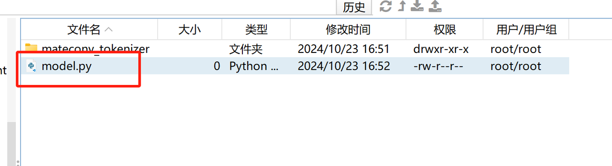

&#x20;

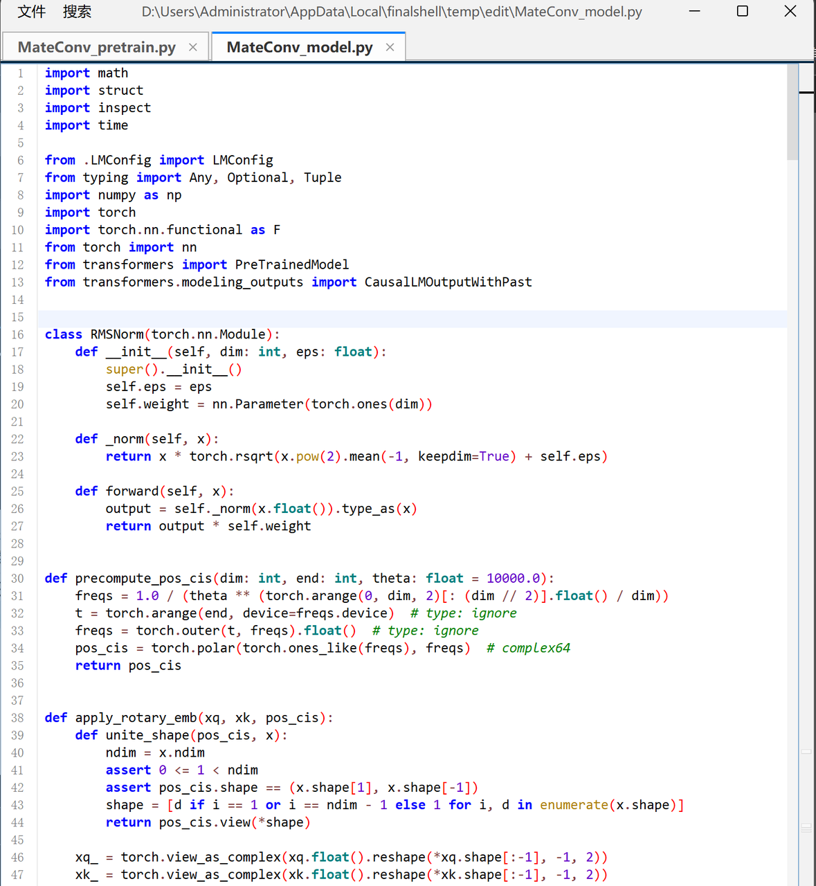

写入完成后`保存`并退出。

  以下是Llama 3模型架构的具体说明：

##### 1. **RMSNorm（均方根标准化层）**

  RMSNorm层在该架构中用于对输入进行规范化处理。它通过对每个输入向量的均方根（RMS）进行标准化来减少梯度爆炸或消失的问题。公式为：
$$[ \text{RMS}(x) = x / \sqrt{\text{mean}(x^2) + \epsilon} ]$$
其中`x`是输入，`eps`是防止分母为零的小常数。最后，规范化后的结果会乘以一个可学习的参数`weight`，以实现进一步的尺度调节。

##### 2. **预计算位置编码（precompute\_pos\_cis）**

  为了让模型拥有位置感知能力，该函数使用了旋转位置编码（rotary positional embedding），这是一种高效的编码方式。它首先计算一组频率，再通过极坐标生成复数形式的旋转编码。位置编码的核心思想是将序列中的位置信息嵌入到查询（query）和键（key）向量中，从而允许模型捕捉序列的相对位置信息。

##### 3. **旋转嵌入（apply\_rotary\_emb）**

  该函数通过将查询和键向量转换为复数，并与预先计算的旋转位置编码进行相乘，来增强模型的相对位置感知能力。最终，它将复数嵌入恢复为实数形式并返回。这种方法减少了位置编码带来的冗余计算，提升了计算效率。

##### 4. **多头自注意力机制（Attention）**

  多头注意力机制是该模型的核心部分，它允许模型同时关注序列的不同部分。该实现中注意力模块的流程如下：

* **查询、键、值向量的生成**：通过线性变换将输入`x`映射到查询（Q）、键（K）和值（V）空间。

* **旋转嵌入**：将查询和键向量通过旋转位置编码处理。

* **键-值缓存机制（kv\_cache）**：在推理过程中，为了加速计算，可以使用缓存的键值对，从而避免重复计算。该机制会在序列长度为1的情况下缓存上次计算的键值对，并将其与新计算的键值对进行拼接，达到加速的效果。

* **注意力权重的计算**：查询和键向量点积后，通过`softmax`得到注意力分数，进而与值向量相乘以获得加权结果。

* **输出处理**：通过线性变换将多头注意力的输出映射回原始维度。

  如果环境支持PyTorch 2.0及以上版本，则该注意力模块会优先使用更加高效的闪存注意力（Flash Attention）机制。

##### 5. **前馈神经网络（FeedForward）**

  前馈神经网络（FFN）是Transformer中的另一重要组件。每个注意力层后都会有一个前馈网络，用于对注意力机制的输出进行非线性变换。在此实现中，FFN首先将输入通过两层线性层并结合`SiLU`激活函数进行非线性处理，然后通过Dropout层引入正则化，防止过拟合。

##### 6. **专家选择机制（MoEGate）与专家网络（MOEFeedForward）**

  该模型还实现了一个稀疏专家网络（Mixture of Experts, MoE），用于在前馈网络中引入更多的计算能力。稀疏专家机制的关键在于：

* **门控机制**：每个输入会通过门控机制选择最合适的若干个专家来进行处理，专家通过得分函数（如`softmax`）进行选择，模型根据得分选择最合适的`top-k`个专家执行计算。

* **专家执行与权重计算**：被选择的专家根据门控机制的权重对输入进行处理。为了提高计算效率，推理阶段只选择最优的专家，而在训练阶段会重复输入并进行并行计算。

* **辅助损失**：在训练过程中，通过辅助损失（auxiliary loss）来保证专家的均衡使用，避免某些专家被过度利用而另一些专家闲置。

这种设计能够提升模型的计算能力和灵活性，尤其适合处理大规模数据和复杂任务。

##### 7. **Transformer Block（Transformer块）**

  每个Transformer块包含一个注意力层和一个前馈网络，并分别对其输入进行处理。每个块的运行流程如下：

* 输入首先通过`RMSNorm`进行标准化。

* 然后进入注意力层，生成上下文相关的表示。

* 最后，前馈网络处理这些表示，输出结果。

如果配置中启用了MoE（稀疏专家），则会使用专家网络进行前馈处理；否则，使用常规的前馈神经网络。

##### 8. **Transformer模型的整体架构**

  整个Transformer模型由多个Transformer块堆叠而成，模型流程如下：

* **嵌入层**：首先通过嵌入层将输入的token转换为对应的向量表示。

* **位置编码**：通过旋转位置编码为每个输入向量添加位置信息。

* **层堆叠**：输入经过一系列的Transformer块，每一层块都会对输入进行注意力和前馈处理，并逐层传递上下文信息。

* **归一化与输出层**：最后，经过归一化层和线性输出层，将模型的隐藏状态映射为词汇表大小的向量表示，得到最终的预测分布。

##### 9. **推理与生成（generate）**

  模型的推理流程通过`generate`函数实现，它支持流式生成并可以自适应地选择终止符号（`eos`）结束生成过程。推理时，模型会逐步生成新的token，并根据设定的`温度`、`top-k`策略对输出分布进行控制，从而生成流畅的文本序列。

#### 2.MateConv模型配置文件编写

  同时，model.py中预留了很多模型参数接口，可以统一通过继承一个transformers中的PretrainedConfig类来设置这些参数。这里我们在model这个文件夹内再创建一个名为LMConfig.py的文件，来设置MateConv的模型参数。

```bash
cd /root/autodl-tmp/MateConv/model
touch LMConfig.py
```

并在LMConfig.py文件中输入如下内容：

```python
from transformers import PretrainedConfig
from typing import List


class LMConfig(PretrainedConfig):
    model_type = "MateConv"

    def __init__(
            self,
            dim: int = 512,
            n_layers: int = 8,
            n_heads: int = 16,
            n_kv_heads: int = 8,
            vocab_size: int = 6400,
            hidden_dim: int = None,
            multiple_of: int = 64,
            norm_eps: float = 1e-5,
            max_seq_len: int = 512,
            dropout: float = 0.0,
            flash_attn: bool = True,
            ####################################################
            # Here are the specific configurations of MOE
            # When use_moe is false, the following is invalid
            ####################################################
            use_moe: bool = False,
            num_experts_per_tok=2,
            n_routed_experts=4,
            n_shared_experts: bool = True,
            scoring_func='softmax',
            aux_loss_alpha=0.01,
            seq_aux=True,
            norm_topk_prob=True,
            **kwargs,
    ):
        self.dim = dim
        self.n_layers = n_layers
        self.n_heads = n_heads
        self.n_kv_heads = n_kv_heads
        self.vocab_size = vocab_size
        self.hidden_dim = hidden_dim
        self.multiple_of = multiple_of
        self.norm_eps = norm_eps
        self.max_seq_len = max_seq_len
        self.dropout = dropout
        self.flash_attn = flash_attn
        ####################################################
        # Here are the specific configurations of MOE
        # When use_moe is false, the following is invalid
        ####################################################
        self.use_moe = use_moe
        self.num_experts_per_tok = num_experts_per_tok  # 每个token选择的专家数量
        self.n_routed_experts = n_routed_experts  # 总的专家数量
        self.n_shared_experts = n_shared_experts  # 共享专家
        self.scoring_func = scoring_func  # 评分函数，默认为'softmax'
        self.aux_loss_alpha = aux_loss_alpha  # 辅助损失的alpha参数
        self.seq_aux = seq_aux  # 是否在序列级别上计算辅助损失
        self.norm_topk_prob = norm_topk_prob  # 是否标准化top-k概率
        super().__init__(**kwargs)
```

然后保存并退出：

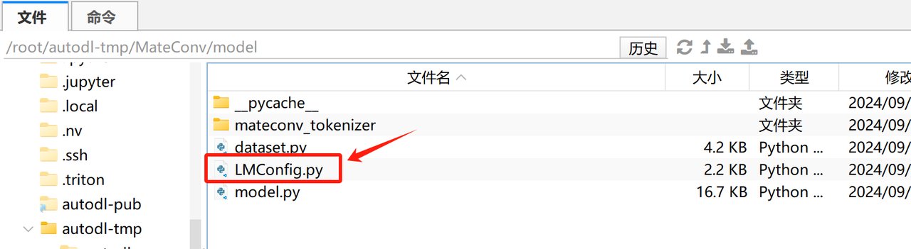

其中`LMConfig` 类及其参数详解如下：

`LMConfig` 类用于定义和控制模型架构中的一系列关键参数。它继承自`PretrainedConfig`，允许用户通过配置参数来灵活地调整模型的结构和行为。以下是对`LMConfig`中非MOE相关参数的解释，以及这些参数如何影响原始模型架构和运行流程。

##### 1. **`dim`（模型的隐藏维度）**

* **默认值**：`512`

* **含义**：这是Transformer模型中每个token的表示向量的维度。`dim`决定了输入和输出的向量大小，也是注意力机制和前馈网络中的主维度。较大的`dim`可以让模型捕捉更多的特征，但也会增加计算和内存开销。

* **影响**：`dim`影响模型中的线性层、注意力机制和前馈神经网络的参数量。在代码中，查询（Q）、键（K）、值（V）等向量的维度均与此参数相关联。如果`dim`增加，则这些向量的维度和计算量也会增加。

##### 2. **`n_layers`（Transformer层数）**

* **默认值**：`8`

* **含义**：这是模型中堆叠的Transformer层的数量。每一层由一个多头注意力机制和一个前馈神经网络组成。更多的层数意味着模型能够处理更复杂的特征和模式，但同时也会增加模型的训练时间和推理时间。

* **影响**：`n_layers`直接决定了模型的深度。在`Transformer`类的构造函数中，通过一个循环来堆叠多个`TransformerBlock`，层数越多，模型就会变得越深，能够处理的语义信息更加丰富。

##### 3. **`n_heads`（注意力头的数量）**

* **默认值**：`16`

* **含义**：这是多头注意力机制中头的数量。注意力头是指将输入向量拆分成多个子空间，并在每个子空间中分别进行注意力计算，最后将这些子空间的结果拼接起来。更多的头可以让模型关注到输入序列的不同部分和不同特征。

* **影响**：`n_heads`影响每个注意力头中分配的维度大小。在代码中，通过线性变换将输入映射为多个头，每个头的维度为`dim / n_heads`。增加头的数量可以让模型在更多的子空间中平行地处理信息，但计算复杂度也会增加。

##### 4. **`n_kv_heads`（键值头的数量）**

* **默认值**：`8`

* **含义**：在多头注意力机制中，键（Key）和值（Value）向量的头数。`n_kv_heads`表示键值向量会分配到的头数。默认情况下，键值头的数量等于查询头的数量（即`n_heads`），但可以通过该参数将其分开设置。

* **影响**：该参数决定了键和值在注意力机制中的分配方式。如果`n_kv_heads`与`n_heads`不同，模型会按照`n_kv_heads`的数量来处理键值向量，可能会影响模型处理长序列时的记忆能力。

##### 5. **`vocab_size`（词汇表大小）**

* **默认值**：`6400`

* **含义**：这是模型可以处理的词汇表的大小。词汇表是模型可以输入的词或token的集合。`vocab_size`决定了输入嵌入层和输出层的大小，它对应于模型的输入token和输出词预测的范围。

* **影响**：`vocab_size`影响嵌入层的大小。在`Transformer`模型中，`tok_embeddings`和`output`层的维度是由`vocab_size`决定的。如果词汇表大小增加，模型处理的token种类也会增加，但也会增加计算和存储的需求。

##### 6. **`hidden_dim`（前馈网络隐藏层的维度）**

* **默认值**：`None`

* **含义**：这是前馈神经网络（FeedForward Network, FFN）中隐藏层的维度。默认情况下，该值为`4 * dim`，即每个Transformer块中的前馈网络的隐藏层维度是模型维度的4倍。该参数允许用户手动指定前馈网络的隐藏层维度。

* **影响**：`hidden_dim`影响FFN的计算复杂度和模型的表示能力。如果该值过小，模型可能无法捕捉足够复杂的特征；如果过大，计算量和参数量将显著增加。

##### 7. **`multiple_of`（前馈网络维度的倍数）**

* **默认值**：`64`

* **含义**：该参数确保前馈网络中隐藏层的维度是某个整数的倍数。这是为了提高计算效率，尤其是在并行计算中，这种对齐操作能够优化内存访问和计算性能。

* **影响**：`multiple_of`与`hidden_dim`一起影响前馈网络的维度。在代码中，通过将`hidden_dim`调整为`multiple_of`的倍数，确保其符合硬件加速的要求。

##### 8. **`norm_eps`（归一化层中的epsilon）**

* **默认值**：`1e-5`

* **含义**：这是用于归一化层中的一个小常数，以防止分母为零。通常用于`RMSNorm`和其他标准化操作中，确保在数值计算时不会出现除以零的情况。

* **影响**：`norm_eps`直接影响`RMSNorm`操作的稳定性。较小的`eps`可以提高精度，但也容易引发数值不稳定。合理设置`eps`值可以在数值稳定性和计算精度之间取得平衡。

##### 9. **`max_seq_len`（最大序列长度）**

* **默认值**：`512`

* **含义**：这是模型能够处理的最大输入序列长度。`max_seq_len`决定了位置编码和注意力矩阵的最大尺寸。超过这个长度的输入将被截断，或者需要通过分块处理长序列。

* **影响**：`max_seq_len`影响模型处理长序列时的能力和效率。如果该值设置较大，模型能够处理更长的上下文信息，但会增加注意力矩阵的计算开销和内存需求。

##### 10. **`dropout`**

* **默认值**：`0.0`

* **含义**：这是在训练过程中防止过拟合的一种正则化技术。在模型的各个层中，会以一定的概率随机将一些神经元的输出置为零，以防止模型对训练数据过度拟合。`dropout`的值表示丢弃神经元的概率。

* **影响**：`dropout`值越高，模型的正则化效果越强，但过高的`dropout`值可能会导致模型难以学习复杂的模式。如果设置为`0.0`，则表示不使用Dropout层。

##### 11. **`flash_attn`**

* **默认值**：`True`

* **含义**：这是一个布尔参数，用于指定是否使用闪存注意力机制（Flash Attention）。闪存注意力是一种更高效的注意力计算方法，特别适用于长序列和大模型的场景中，可以显著降低内存使用并加速计算。

* **影响**：如果设置为`True`，模型将尝试使用更快的注意力实现，前提是当前环境支持（例如需要PyTorch >= 2.0）。这将提高计算效率，特别是在处理长序列时。如果设置为`False`，则使用标准的注意力计算方式，速度较慢但兼容性更高。

##### 参数的整体影响

  这些非MOE相关的参数决定了模型的基础架构，影响了模型的深度、宽度、注意力机制、前馈网络的复杂性以及模型的正则化方式。通过调整这些参数，用户可以定制模型的计算资源需求、精度和效率。例如，增加`dim`和`n_layers`可以提高模型的表达能力，但也会增加计算复杂度和内存需求；而`dropout`和`norm_eps`等参数则帮助模型在训练中更稳定地学习并避免过拟合。

* 数据读取与脚本

  同时，我们需要在model文件夹内创建一个名为dataset.py的脚本，用于在训练时读取数据：

```python
import json
import random
import re

import pandas as pd
import numpy as np
from torch.utils.data import Dataset, DataLoader
import torch
from sklearn.model_selection import train_test_split
import os

os.environ["TOKENIZERS_PARALLELISM"] = "false"


class PretrainDataset(Dataset):
    def __init__(self, data_path_lst, max_length=512, memmap=False):
        super().__init__()
        #
        if memmap:
            with open(data_path_lst[0], 'r') as f:
                nbytes = f.seek(0, 2)
                flen = f.tell() // np.dtype('uint16').itemsize
            self.data = np.memmap(data_path_lst[0], dtype=np.dtype('uint16'), shape=(flen // max_length, max_length))
        else:
            data_lst = []
            for data_path in data_path_lst:
                with open(data_path, 'rb') as f:
                    data = np.fromfile(f, dtype=np.uint16)
                    data_lst.append(data)
            data = np.concatenate(data_lst)
            data = data[:max_length * int(len(data) / max_length)]
            # np.random.shuffle(data)
            self.data = data.reshape(-1, max_length)
        #
        print("memmap:{} train data.shape:{}".format(memmap, self.data.shape))
        print("downloading finished.....")

    def __len__(self):
        return self.data.shape[0]

    def __getitem__(self, index: int):
        #
        sample = self.data[index]
        X = np.array(sample[:-1]).astype(np.int64)
        Y = np.array(sample[1:]).astype(np.int64)

        return torch.from_numpy(X), torch.from_numpy(Y)


class SFTDataset(Dataset):
    def __init__(self, df, tokenizer, max_length=1024, prompt_max_len=512, answer_max_len=256):
        super().__init__()
        self.df = df
        self.max_length = max_length
        self.prompt_max_len = prompt_max_len
        self.answer_max_len = answer_max_len
        #
        self.tokenizer = tokenizer
        self.padding = 0  # self.tokenizer.special_tokens['<pad>']
        self.bos_id = self.tokenizer('<s>assistant').data['input_ids']

    def __len__(self):
        return self.df.shape[0]

    def find_sublist_index(self, main_list, sub_list) -> int:
        last_index = -1
        for i in range(len(main_list) - len(sub_list) + 1):
            if main_list[i:i + len(sub_list)] == sub_list:
                last_index = i
        return last_index

    def safe_eval(self, s):
        try:
            res = eval(s)
        except Exception as e:
            return []
        return res

    def __getitem__(self, index: int):
        #
        sample = self.df.iloc[index]
        history = self.safe_eval(sample['history'])
        q = str(sample['q'])
        a = str(sample['a'])

        messages = []
        for history_message in history:
            if len(history_message) <= 1:
                continue
            messages.append(
                {"role": 'user', "content": str(history_message[0])[:self.max_length // 2]}
            )
            messages.append(
                {"role": 'assistant', "content": str(history_message[1])[:self.max_length // 2]}
            )

        messages += [
            {"role": "user", "content": q},
            {"role": "assistant", "content": a},
        ]
        new_prompt = self.tokenizer.apply_chat_template(
            messages,
            tokenize=False,
            add_generation_prompt=True
        )
        input_id = self.tokenizer(new_prompt).data['input_ids'][:self.max_length]

        # 实际长度
        question_length = self.find_sublist_index(input_id, self.bos_id) + len(self.bos_id)
        # 没满最大长度的剩余部分
        padding_len = self.max_length - len(input_id)
        input_id = input_id + [self.padding] * padding_len
        mask_len = len(input_id) - question_length - padding_len
        # 0表示不计算损失
        loss_mask = [0] * question_length + [1] * (mask_len) + [0] * padding_len

        input_id = np.array(input_id)
        X = np.array(input_id[:-1]).astype(np.int64)
        Y = np.array(input_id[1:]).astype(np.int64)
        loss_mask = np.array(loss_mask[1:]).astype(np.int64)

        X_tensor = torch.from_numpy(X)
        Y_tensor = torch.from_numpy(Y)
        loss_mask_tensor = torch.from_numpy(loss_mask)

        return X_tensor, Y_tensor, loss_mask_tensor


if __name__ == "__main__":
    pass
```

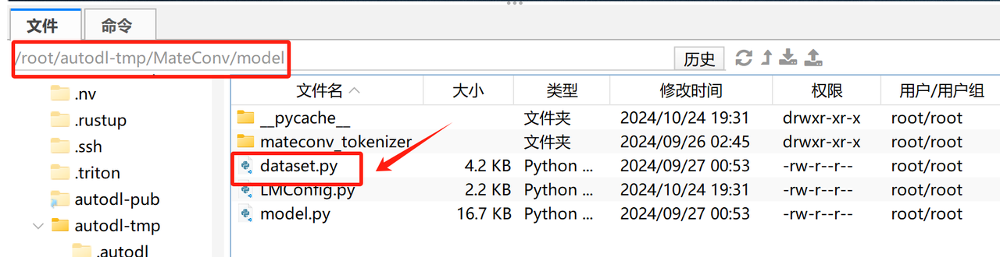

#### 3.编写MateConv预训练脚本

  在准备好了模型架构和参数代码之后，接下来我们就可以开始编写模型的预训练脚本了，该脚本的核心功能是将数据带入模型，并且根据模型参数来完成模型的预训练过程。这里还是一样，我们首先需要在`项目根目录`下创建一个预训练脚本文件`pretrain.py`:

```bash
cd /root/autodl-tmp/MateConv
touch pretrain.py
```

并在pretrain.py文件中输入如下内容：

```python
import os
import platform
import argparse
import time
import math
import warnings
import torch
import torch.distributed as dist
from torch import optim
from torch.nn.parallel import DistributedDataParallel
from torch.optim.lr_scheduler import CosineAnnealingLR
from torch.utils.data import DataLoader, DistributedSampler
from contextlib import nullcontext
from model.model import Transformer
from model.LMConfig import LMConfig
from model.dataset import PretrainDataset

warnings.filterwarnings('ignore')


def Logger(content):
    if not ddp or dist.get_rank() == 0:
        print(content)


def get_lr(it, all):
    warmup_iters = args.warmup_iters
    lr_decay_iters = all
    min_lr = args.learning_rate / 10

    if it < warmup_iters:
        return args.learning_rate * it / warmup_iters
    if it > lr_decay_iters:
        return min_lr
    decay_ratio = (it - warmup_iters) / (lr_decay_iters - warmup_iters)
    assert 0 <= decay_ratio <= 1
    coeff = 0.5 * (1.0 + math.cos(math.pi * decay_ratio))
    return min_lr + coeff * (args.learning_rate - min_lr)


def train_epoch(epoch, wandb):
    start_time = time.time()
    for step, (X, Y) in enumerate(train_loader):
        X = X.to(args.device)
        Y = Y.to(args.device)

        lr = get_lr(epoch * iter_per_epoch + step, args.epochs * iter_per_epoch)
        for param_group in optimizer.param_groups:
            param_group['lr'] = lr

        with ctx:
            out = model(X, Y)
            loss = out.last_loss / args.accumulation_steps

        scaler.scale(loss).backward()

        if (step + 1) % args.accumulation_steps == 0:
            scaler.unscale_(optimizer)
            torch.nn.utils.clip_grad_norm_(model.parameters(), args.grad_clip)

            scaler.step(optimizer)
            scaler.update()

            optimizer.zero_grad(set_to_none=True)

        if step % args.log_interval == 0:
            spend_time = time.time() - start_time
            Logger(
                'Epoch:[{}/{}]({}/{}) loss:{:.3f} lr:{:.7f} epoch_Time:{}min:'.format(
                    epoch,
                    args.epochs,
                    step,
                    iter_per_epoch,
                    loss.item() * args.accumulation_steps,
                    optimizer.param_groups[-1]['lr'],
                    spend_time / (step + 1) * iter_per_epoch // 60 - spend_time // 60))

            if (wandb is not None) and (not ddp or dist.get_rank() == 0):
                wandb.log({"loss": loss.item() * args.accumulation_steps,
                           "lr": optimizer.param_groups[-1]['lr'],
                           "epoch_Time": spend_time / (step + 1) * iter_per_epoch // 60 - spend_time // 60})

        if (step + 1) % args.save_interval == 0 and (not ddp or dist.get_rank() == 0):
            model.eval()
            moe_path = '_moe' if lm_config.use_moe else ''
            ckp = f'{args.save_dir}/{args.model_name}.pth'  # 使用用户提供的模型名称

            if isinstance(model, torch.nn.parallel.DistributedDataParallel):
                state_dict = model.module.state_dict()
            else:
                state_dict = model.state_dict()

            torch.save(state_dict, ckp)
            Logger(f"保存模型到 {ckp}")
            optimizer_state_path = f'{args.save_dir}/{args.model_name}_optimizer.pth'
            torch.save(optimizer.state_dict(), optimizer_state_path)
            Logger(f"保存优化器状态到 {optimizer_state_path}")
            
            model.train()


def init_model():
    def count_parameters(model):
        return sum(p.numel() for p in model.parameters() if p.requires_grad)

    model = Transformer(lm_config).to(args.device)
    moe_path = '_moe' if lm_config.use_moe else ''
    
    # 加入恢复训练的逻辑
    checkpoint_path = f'{args.save_dir}/{args.model_name}.pth'  # 使用用户提供的模型名称
    if os.path.exists(checkpoint_path):
        Logger(f"加载模型检查点 {checkpoint_path}")
        model.load_state_dict(torch.load(checkpoint_path, map_location=args.device))
    else:
        Logger(f"没有找到模型检查点，开始从头训练")
    
    Logger(f'LLM总参数量：{count_parameters(model) / 1e6:.3f} 百万')
    return model


def init_distributed_mode():
    if not ddp: return
    global ddp_local_rank, DEVICE

    dist.init_process_group(backend="nccl")
    ddp_rank = int(os.environ["RANK"])
    ddp_local_rank = int(os.environ["LOCAL_RANK"])
    ddp_world_size = int(os.environ["WORLD_SIZE"])
    DEVICE = f"cuda:{ddp_local_rank}"
    torch.cuda.set_device(DEVICE)


# torchrun --nproc_per_node 2 pretrain.py
if __name__ == "__main__":
    parser = argparse.ArgumentParser(description="MateConv Pretraining")
    parser.add_argument("--out_dir", type=str, default="out", help="Output directory")
    parser.add_argument("--epochs", type=int, default=20, help="Number of epochs")
    parser.add_argument("--batch_size", type=int, default=32, help="Batch size")
    parser.add_argument("--learning_rate", type=float, default=2e-4, help="Learning rate")
    parser.add_argument("--device", type=str, default="cuda:0" if torch.cuda.is_available() else "cpu", help="Device to use")
    parser.add_argument("--dtype", type=str, default="bfloat16", help="Data type")
    parser.add_argument("--use_wandb", action="store_true", help="Use Weights & Biases")
    parser.add_argument("--wandb_project", type=str, default="MateConv-Pretrain", help="Weights & Biases project name")
    parser.add_argument("--num_workers", type=int, default=8, help="Number of workers for data loading")
    parser.add_argument("--data_path", type=str, default="./dataset/pretrain_data.bin", help="Path to training data")
    parser.add_argument("--ddp", action="store_true", help="Use DistributedDataParallel")
    parser.add_argument("--accumulation_steps", type=int, default=8, help="Gradient accumulation steps")
    parser.add_argument("--grad_clip", type=float, default=1.0, help="Gradient clipping threshold")
    parser.add_argument("--warmup_iters", type=int, default=0, help="Number of warmup iterations")
    parser.add_argument("--log_interval", type=int, default=100, help="Logging interval")
    parser.add_argument("--save_interval", type=int, default=1000, help="Model saving interval")
    parser.add_argument("--model_name", type=str, default="pretrain_512", help="模型名称，用于保存和加载检查点")

    parser.add_argument("--local_rank", type=int, default=-1, help="Local rank for distributed training")

    args = parser.parse_args()

    lm_config = LMConfig()
    max_seq_len = lm_config.max_seq_len
    args.save_dir = os.path.join(args.out_dir)
    os.makedirs(args.save_dir, exist_ok=True)
    os.makedirs(args.out_dir, exist_ok=True)
    checkpoint_path = f'{args.save_dir}/{args.model_name}.pth'
    
    tokens_per_iter = args.batch_size * max_seq_len
    torch.manual_seed(1337)
    device_type = "cuda" if "cuda" in args.device else "cpu"

    args.wandb_run_name = f"MateConv-Pretrain-Epoch-{args.epochs}-BatchSize-{args.batch_size}-LearningRate-{args.learning_rate}"

    ctx = nullcontext() if device_type == "cpu" else torch.cuda.amp.autocast()

    ddp = int(os.environ.get("RANK", -1)) != -1  # is this a ddp run?
    ddp_local_rank, DEVICE = 0, "cuda:0"
    if ddp:
        init_distributed_mode()
        args.device = torch.device(DEVICE)

    if args.use_wandb and (not ddp or ddp_local_rank == 0):
        import wandb
        wandb.init(project=args.wandb_project, name=args.wandb_run_name)
    else:
        wandb = None

    data_path_list = [args.data_path]
    train_ds = PretrainDataset(data_path_list, max_length=max_seq_len, memmap=True)
    train_sampler = DistributedSampler(train_ds) if ddp else None
    train_loader = DataLoader(
        train_ds,
        batch_size=args.batch_size,
        pin_memory=True,
        drop_last=False,
        shuffle=False,
        num_workers=args.num_workers,
        sampler=train_sampler
    )

    model = init_model()

    scaler = torch.cuda.amp.GradScaler(enabled=(args.dtype in ['float16', 'bfloat16']))
    optimizer = optim.Adam(model.parameters(), lr=args.learning_rate)
    
    # 恢复优化器状态
    optimizer_state_path = f'{args.save_dir}/{args.model_name}_optimizer.pth'
    if os.path.exists(checkpoint_path):
            optimizer_state_path = f'{args.save_dir}/{args.model_name}_optimizer.pth'
            if os.path.exists(optimizer_state_path):
                Logger(f"加载优化器状态 {optimizer_state_path}")
                optimizer.load_state_dict(torch.load(optimizer_state_path, map_location=args.device))
            else:
                Logger(f"没有找到优化器状态，使用新的优化器")

    if False and platform.system() != 'Windows' and float(torch.__version__.split('.')[0]) >= 2:
        Logger("compiling the model... (takes a ~minute)")
        unoptimized_model = model
        model = torch.compile(model)

    if ddp:
        model._ddp_params_and_buffers_to_ignore = {"pos_cis"}
        model = DistributedDataParallel(model, device_ids=[ddp_local_rank])

    iter_per_epoch = len(train_loader)
    for epoch in range(args.epochs):
        train_epoch(epoch, wandb)
```

然后保存并退出：

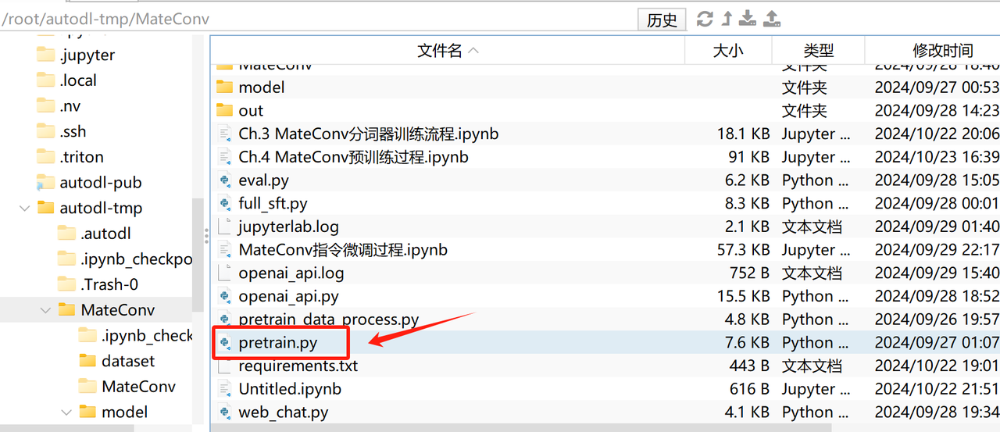

  这段脚本用于启动语言模型的预训练过程，结合了`PyTorch`的多GPU并行训练（`DistributedDataParallel`）、梯度累积、学习率调度等功能，以优化大规模的训练任务。脚本的主要功能包括模型初始化、数据加载、分布式训练支持以及训练日志记录。下面详细解释代码中的核心功能和参数设置。

##### 脚本功能解释如下

1. **分布式训练支持 (`DistributedDataParallel`)**

   * 脚本可以通过分布式训练模式来加速模型训练。在分布式模式下，模型会通过多GPU并行计算实现数据并行。`init_distributed_mode`函数负责初始化分布式环境，使用`NCCL`后端进行通信。

   * 使用`torch.distributed`模块的`DistributedSampler`确保数据在不同GPU之间合理分配，避免数据重叠。

2. **模型初始化 (`init_model`)**

   * 该函数初始化模型，并打印模型的参数数量。在配置文件`LMConfig`中设置的参数（如`dim`、`n_layers`等）将被用于初始化`Transformer`模型。参数的设置将影响模型的规模和计算量。

   * 如果启用了`MOE`（专家模型），则会根据配置初始化`MOE`相关的组件。

   * 该模型支持在PyTorch 2.0及以上版本中通过`torch.compile`进一步优化模型的推理性能。

3. **学习率调度 (`get_lr`)**

   * 学习率调度器采用了余弦退火（Cosine Annealing）的方式来逐步降低学习率。在训练的早期阶段进行学习率预热（warm-up），然后逐步减小学习率，最终在训练结束时接近于零。这个策略可以在训练初期加快收敛速度，并在后期稳定地进行微调。

   * 学习率由`get_lr`函数动态计算，在每一步训练中通过迭代更新学习率。

4. **训练过程 (`train_epoch`)**

   * 每个`epoch`的训练过程包括以下步骤：

     * 将训练数据加载到设备上。

     * 动态调整学习率。

     * 使用`torch.cuda.amp.autocast()`自动进行混合精度训练，减少显存使用，提高计算效率。

     * 梯度累积：模型在每`accumulation_steps`步之后更新参数，以减少显存开销，适用于大模型和小批次训练。

     * 梯度裁剪：为了防止梯度爆炸，通过`torch.nn.utils.clip_grad_norm_`对梯度进行裁剪。

     * 训练日志记录：定期记录训练过程中的损失、学习率和时间，并将结果输出到控制台。

5. **模型保存**

   * 在每`save_interval`步后保存模型的状态字典。保存时，根据配置选择是否包括`MOE`专家模型的参数。

   * 如果是在分布式训练模式下（`DistributedDataParallel`），则会保存主进程模型的参数。

6. **梯度放大与更新 (`GradScaler`)**

   * 通过`torch.cuda.amp.GradScaler`来缩放梯度，进一步减少数值不稳定的风险并提高混合精度训练的效果。

#### 脚本参数解释如下：

1. **`--out_dir`**

   * **默认值**：`"out"`

   * **含义**：模型保存的输出目录。预训练过程中生成的模型权重会保存在该目录下。

2. **`--epochs`**

   * **默认值**：`20`

   * **含义**：训练的总轮数。每个轮次将使用整个训练数据集进行一次完整的模型更新。

3. **`--batch_size`**

   * **默认值**：`32`

   * **含义**：训练时使用的批次大小。较大的批次可以提高模型的泛化性能，但也需要更多的计算资源。

4. **`--learning_rate`**

   * **默认值**：`2e-4`

   * **含义**：初始学习率，控制模型的权重更新速度。余弦退火调度器将会逐步减少该值。

5. **`--device`**

   * **默认值**：`"cuda:0"`（如果有GPU），否则为`"cpu"`

   * **含义**：训练设备。可以是`CPU`或`GPU`，通常在大规模训练中使用GPU。

6. **`--dtype`**

   * **默认值**：`"bfloat16"`

   * **含义**：指定数据类型（如`float16`或`bfloat16`）以启用混合精度训练。`bfloat16`通常在GPU上使用，因为它可以提高训练速度并减少显存占用。

7. **`--use_wandb`**

   * **默认值**：`False`

   * **含义**：是否使用`Weights & Biases`（WandB）工具来跟踪实验进度和记录训练指标。WandB 是一种实验跟踪和可视化工具。

8. **`--wandb_project`**

   * **默认值**：`"MateConv-Pretrain"`

   * **含义**：如果使用WandB，这是用于实验的项目名称。

9. **`--num_workers`**

   * **默认值**：`8`

   * **含义**：用于数据加载的工作进程数量。更多的`num_workers`可以加速数据加载，但会占用更多的CPU资源。

10. **`--data_path`**

    * **默认值**：`"./dataset/pretrain_data.bin"`

    * **含义**：训练数据集的路径。该数据集应该是预处理后的二进制文件，用于模型预训练。

11. **`--ddp`**

    * **默认值**：`False`

    * **含义**：是否启用分布式数据并行（DistributedDataParallel）训练。如果启用，模型将分布到多个GPU上进行并行计算。

12. **`--accumulation_steps`**

    * **默认值**：`8`

    * **含义**：梯度累积步数。通过累积多个批次的梯度，再进行一次参数更新，以减少显存压力并提高训练稳定性。

13. **`--grad_clip`**

    * **默认值**：`1.0`

    * **含义**：梯度裁剪的阈值，用于限制梯度的最大范数，防止梯度爆炸。

14. **`--warmup_iters`**

    * **默认值**：`0`

    * **含义**：学习率预热的迭代次数。在预热阶段，学习率从零逐渐增加到设定值。

15. **`--log_interval`**

    * **默认值**：`100`

    * **含义**：日志记录的间隔步数。每经过`log_interval`步会在控制台输出一次损失和学习率等信息。

16. **`--save_interval`**

    * **默认值**：`1000`

    * **含义**：模型保存的间隔步数。每经过`save_interval`步，模型的当前状态将被保存到指定的输出目录中。

17. **`--local_rank`**

    * **默认值**：`-1`

#### 4.借助wandb进行训练过程记录【可选，但推荐】

  在大规模模型训练中，我们往往需要监控和分析大量的训练数据，而WandB可以帮助我们实现这一目标。它提供了以下几个重要的功能：

**实时可视化**：WandB可以实时展示训练过程中关键指标的变化，如损失函数、学习率、训练时间等。通过这些可视化数据，我们能够直观地了解模型的训练进展，快速发现训练中的异常或瓶颈。

**自动记录与日志管理**：WandB会自动记录每次实验的参数、代码、输出结果，确保实验结果的可追溯性。无论是超参数的设置，还是模型的架构调整，WandB都能够帮助我们完整保留实验记录，方便后期对比与调优。

**支持中断与恢复训练**：在长时间的预训练任务中，系统中断或需要暂停是常见的情况。通过WandB的checkpoint功能，我们可以随时恢复训练，从上次中断的地方继续进行，避免数据和时间的浪费。

**多实验对比**：当我们尝试不同的模型配置或超参数时，WandB允许我们在多个实验之间轻松进行对比分析，帮助我们选择最优的模型配置。

**团队协作**：WandB还支持团队协作，多个成员可以共同查看实验结果，协同调试模型。这对研究和项目开发中团队的合作非常有帮助。

1. 注册wandb：https://wandb.ai/site

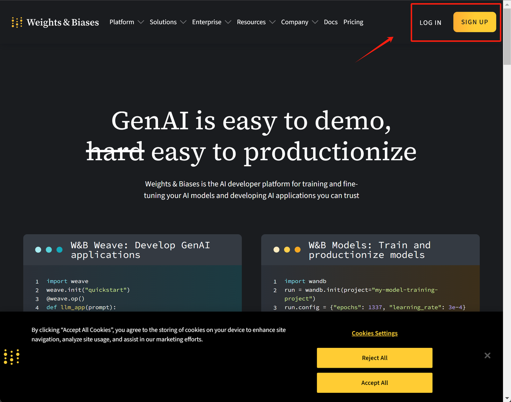

&#x20;


&#x20;


&#x20;


&#x20;


2. 安装wandb：

  在命令行中输入如下代码安装wandb：

```bash
pip install wandb
```


然后即可登录wandb，在命令行页面输入：

```bash
wandb login
```

并根据提示输入API-KEY：

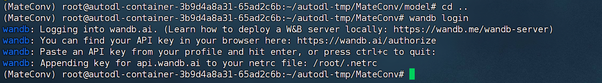

即可在当前电脑上保存wandb账号信息，之后即可直接在wandb home主页上看到训练过程。

3. 借助wandb监控当前运行效果

  接下来在命令行中尝试运行该指令：

```bash
python pretrain.py --use_wandb --wandb_project "MateConv-Pretrain"
```

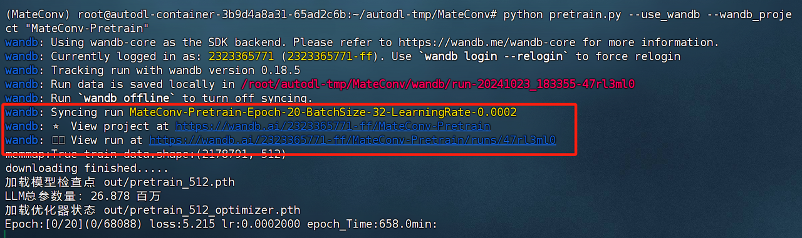

&#x20;

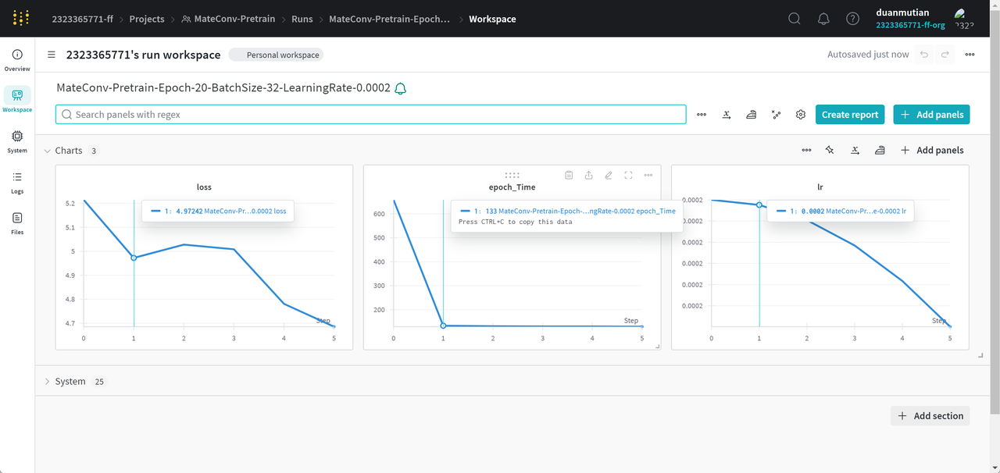

#### 5.模型训练中断与重启

  目前的pretrain.py脚本设置了断点保存功能，支持每各1000步保存一次，例如，当出现如下打印信息时，则说明当前模型部分训练结果已经保存：

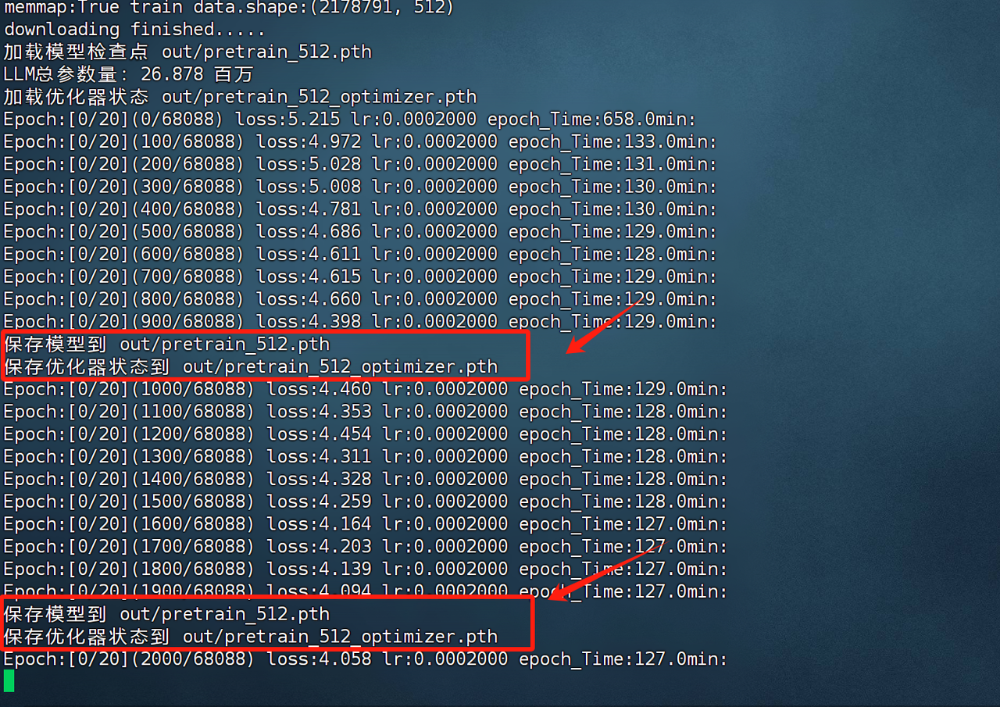

此时即可在`./out`文件夹中看到保存结果：

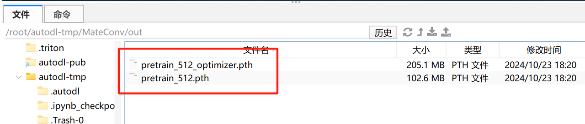

`pretrain_512.pth` 文件和 `pretrain_512_optimizer.pth` 文件分别保存了模型的权重和优化器的状态，它们在训练过程中扮演着不同的角色。

***

##### 1. **`pretrain_512.pth` 文件（模型权重）**

这个文件保存的是**模型的权重参数**，它包含了所有可训练的张量（如网络的权重和偏置），这些参数是模型通过训练过程中学到的核心信息。

* **内容**：

  * 模型中所有层的权重（如线性层、卷积层、注意力层等）。

  * 每个层的偏置值。

* **作用**：

  * **模型推理**：当你需要使用训练好的模型进行推理（例如文本生成、分类等任务）时，通常只需要加载这个 `pretrain_512.pth` 文件。

  * **模型恢复**：如果训练过程中断后继续训练，你需要加载这个文件来恢复模型的状态，以便从上次中断的地方继续更新模型。

* **用途**：

  * 当你训练模型后，想保存它并在未来某个时间进行推理或者进行迁移学习时，保存的就是这个 `.pth` 文件。

  * 当你只关心模型的推理，不打算继续训练，加载这个文件就足够了。

##### 2. **`pretrain_512_optimizer.pth` 文件（优化器状态）**

这个文件保存的是**优化器的状态**，它记录了优化器在训练过程中的各种参数，如学习率、动量等。这些状态确保了在继续训练时，优化器能够从中断的地方继续保持之前的学习进度。

* **内容**：

  * **学习率（Learning rate）**：优化器当前使用的学习率。

  * **动量（Momentum）**：如果你使用了带动量的优化器（如 SGD 或 Adam），文件中会保存动量信息。

  * **梯度累积状态**：如果你使用了梯度累积（比如在 `accumulation_steps` 中设置），文件会保存中间的梯度信息。

  * **优化器的内部参数**：例如 Adam 优化器中的一阶、二阶动量估计（`m` 和 `v`）。

* **作用**：

  * **继续训练**：如果训练中断后你想恢复训练，除了加载模型权重外，恢复优化器状态是非常重要的。因为优化器会根据之前的学习率、动量等状态来决定如何调整模型权重。

  * 如果你只加载了模型的权重（即 `.pth` 文件），而没有恢复优化器状态，模型的训练可能无法顺利继续，尤其是在学习率调度和带动量的优化器（如 Adam、SGD with momentum）中。

* **用途**：

  * **训练中断恢复**：如果你在训练中断后希望继续训练，那么不仅需要加载模型权重，还需要加载优化器状态，以确保训练过程的平稳继续。

  * **学习率调度器**：如果你使用了像余弦退火等学习率调度器，优化器状态文件会记录当前的学习率进度，确保在恢复训练时使用正确的学习率。

##### 总结对比：

| 文件名                              | 内容                    | 主要作用                   |
| -------------------------------- | --------------------- | ---------------------- |
| **`pretrain_512.pth`**           | 模型权重参数（网络的权重和偏置）      | 用于保存和加载模型权重，适用于推理、继续训练 |
| **`pretrain_512_optimizer.pth`** | 优化器状态（学习率、动量、梯度累积状态等） | 用于恢复优化器状态，适用于继续训练      |

###### 为什么要同时保存模型和优化器状态？

在训练过程中，优化器会根据模型的梯度来调整权重，如果你在训练中断后只恢复了模型的权重，而没有恢复优化器的状态，优化器的学习率、动量等信息将会丢失，可能会导致继续训练时表现不佳，或者无法顺利收敛。

因此，**为了保证训练的连续性，继续训练时需要同时加载模型权重和优化器状态**。而在推理或测试模型时，只需要加载模型权重文件就足够了。

###### 继续训练时：

```python
# 恢复模型权重
model.load_state_dict(torch.load('out/pretrain_512.pth'))

# 恢复优化器状态
optimizer.load_state_dict(torch.load('out/pretrain_512_optimizer.pth'))
```

###### 推理时：

```python
# 只需要恢复模型权重
model.load_state_dict(torch.load('out/pretrain_512.pth'))
```

***

这里我们直接CTRL+C即可中断训练：

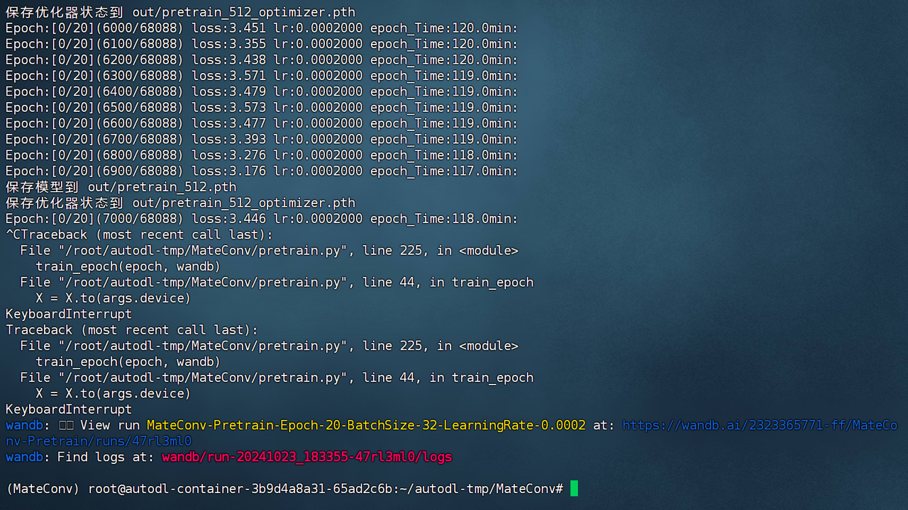

而我们只需要再次输入训练代码，即可从上次保存点开始继续训练：

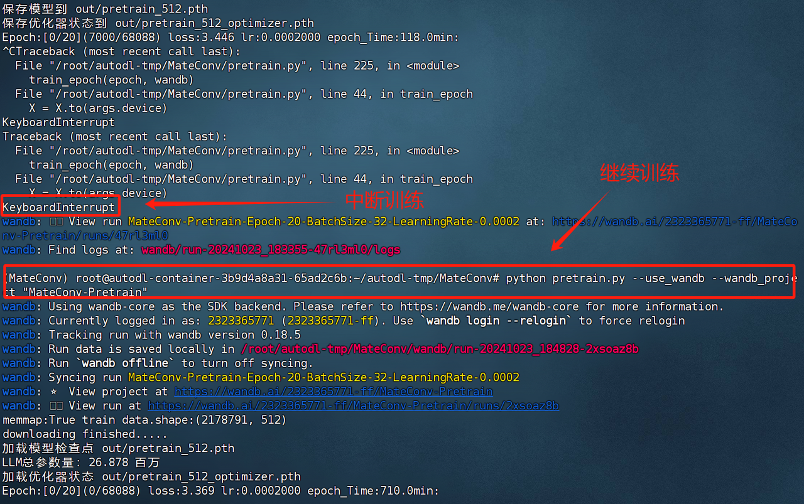

### 三、MateConv对话效果测试

  神经网络来说，只要完成了参数初始化，模型就是可以运行的，这里我们尝试在模型训练之初就打断并测试模型实际对话效果，并与迭代训练若干个epoch之后的效果进行对比。这里我们选取只迭代了1000步的模型来测试效果，现在阶段性训练得到的模型保存在这里：


接下来我们即可使用如下代码来测试模型运行效果：

```python
import itertools
import re
import json
import jsonlines
import psutil
import ujson
import numpy as np
import pandas as pd
from transformers import AutoTokenizer
from datasets import load_dataset
import os
from tqdm import tqdm
```

```python
# 定义BOS和EOS标记
bos_token = "<s>"
eos_token = "</s>"
```

```python
# 加载训练好的分词器路径
tokenizer = AutoTokenizer.from_pretrained('/root/autodl-tmp/MateConv/model/mateconv_tokenizer', use_fast=False)
print(f'加载的tokenizer词表大小: {len(tokenizer)}')
```

```plaintext
加载的tokenizer词表大小: 6400
```

```python
# 导入必要的模块
import torch
from model.model import Transformer  # 确保路径正确
from model.LMConfig import LMConfig   # 导入 LMConfig
```

```python
# 创建配置对象
lm_config = LMConfig()
```

```python
# 初始化 Transformer 模型
model = Transformer(lm_config)
```

```python
device = torch.device("cuda" if torch.cuda.is_available() else "cpu")
```

```python
device
```

```plaintext
device(type='cuda')
```

```python
model.to(device)

# 检查模型结构和参数
print(model)
```

```plaintext
Transformer(
  (tok_embeddings): Embedding(6400, 512)
  (dropout): Dropout(p=0.0, inplace=False)
  (layers): ModuleList(
    (0-7): 8 x TransformerBlock(
      (attention): Attention(
        (wq): Linear(in_features=512, out_features=512, bias=False)
        (wk): Linear(in_features=512, out_features=256, bias=False)
        (wv): Linear(in_features=512, out_features=256, bias=False)
        (wo): Linear(in_features=512, out_features=512, bias=False)
        (attn_dropout): Dropout(p=0.0, inplace=False)
        (resid_dropout): Dropout(p=0.0, inplace=False)
      )
      (attention_norm): RMSNorm()
      (ffn_norm): RMSNorm()
      (feed_forward): FeedForward(
        (w1): Linear(in_features=512, out_features=1408, bias=False)
        (w2): Linear(in_features=1408, out_features=512, bias=False)
        (w3): Linear(in_features=512, out_features=1408, bias=False)
        (dropout): Dropout(p=0.0, inplace=False)
      )
    )
  )
  (norm): RMSNorm()
  (output): Linear(in_features=512, out_features=6400, bias=False)
)
```

```python
# 加载模型权重
model.load_state_dict(torch.load('out/pretrain_512.pth', map_location=device))
model.eval()  # 切换到评估模式
```

```plaintext
Transformer(
  (tok_embeddings): Embedding(6400, 512)
  (dropout): Dropout(p=0.0, inplace=False)
  (layers): ModuleList(
    (0-7): 8 x TransformerBlock(
      (attention): Attention(
        (wq): Linear(in_features=512, out_features=512, bias=False)
        (wk): Linear(in_features=512, out_features=256, bias=False)
        (wv): Linear(in_features=512, out_features=256, bias=False)
        (wo): Linear(in_features=512, out_features=512, bias=False)
        (attn_dropout): Dropout(p=0.0, inplace=False)
        (resid_dropout): Dropout(p=0.0, inplace=False)
      )
      (attention_norm): RMSNorm()
      (ffn_norm): RMSNorm()
      (feed_forward): FeedForward(
        (w1): Linear(in_features=512, out_features=1408, bias=False)
        (w2): Linear(in_features=1408, out_features=512, bias=False)
        (w3): Linear(in_features=512, out_features=1408, bias=False)
        (dropout): Dropout(p=0.0, inplace=False)
      )
    )
  )
  (norm): RMSNorm()
  (output): Linear(in_features=512, out_features=6400, bias=False)
)
```

```python
# 准备输入文本
input_text = "你"
input_ids = tokenizer.encode(input_text, return_tensors='pt').to(device)
```

```python
# 生成输出
with torch.no_grad():
    output = model(input_ids)
    generated_ids = output.logits.argmax(dim=-1)  # 假设使用 argmax 选择输出
    generated_text = tokenizer.decode(generated_ids[0])

print(generated_text)
```

```plaintext
知道
```

```python
# 准备输入文本
input_text = "长江、"
input_ids = tokenizer.encode(input_text, return_tensors='pt').to(device)
```

```python
# 生成输出
with torch.no_grad():
    output = model(input_ids)
    generated_ids = output.logits.argmax(dim=-1)  # 假设使用 argmax 选择输出
    generated_text = tokenizer.decode(generated_ids[0])

print(generated_text)
```

```plaintext
�
```

```python
# 准备输入文本
input_text = "我是"
input_ids = tokenizer.encode(input_text, return_tensors='pt').to(device)
```

```python
# 生成输出
with torch.no_grad():
    output = model(input_ids)
    generated_ids = output.logits.argmax(dim=-1)  # 假设使用 argmax 选择输出
    generated_text = tokenizer.decode(generated_ids[0])

print(generated_text)
```

```plaintext
我
```

整体来看由于模型训练不足，目前还处于胡说八道不说人话的阶段。

### 四、MateConv完整预训练过程

#### 1.Ubuntu持久化会话方法

  在做完基本准备工作之后，接下来就会进入到完整的模型训练过程中。这里需要注意的是，由于我们是使用finalshell连接远程服务器，所以在默认情况下，中途关闭对话会导致服务器当前进程运行终止，所以这里我们需要安装screen来持久化对话。

  `screen` 是 **Ubuntu**（以及其他 Linux 系统）中一个非常有用的工具，特别适合长时间运行任务时使用。它可以让你在终端中启动一个独立的会话，并且即使你关闭了终端，任务仍然可以继续在后台运行。当你重新连接到服务器时，你可以恢复之前的 `screen` 会话，查看任务的进度或继续操作。

##### `screen` 的作用：

* **持久化会话**：即使你断开了终端连接，`screen` 内的进程仍会继续运行。这对于需要长时间运行的任务（如训练模型、远程编译等）非常有用。

* **多任务处理**：`screen` 允许你在一个终端会话中运行多个任务，每个任务在不同的 `screen` 窗口中独立运行。

* **会话恢复**：你可以随时重新连接到 `screen` 会话，继续查看任务输出或输入命令。

##### `screen` 的安装步骤：

1. **更新系统软件包列表**：
   在开始安装之前，建议你先更新系统的软件包列表，以确保你安装的是最新版本的软件包。使用以下命令：

```bash
sudo apt update
```

1. **安装 `screen`**：
   安装 `screen` 非常简单，你可以通过 Ubuntu 系统的包管理器 `apt` 来安装：

```bash
sudo apt install screen
```

1. **确认 `screen` 安装成功**：
   安装完成后，你可以使用以下命令检查 `screen` 是否已经成功安装：

```bash
screen --version
```

1. 如果安装成功，你会看到类似以下的版本信息：

```bash
Screen version 4.08.00 (GNU) 05-Feb-20
```

##### `screen` 的基本使用方法：

1. **启动一个新的 `screen` 会话**：

```bash
screen -S session_name
```

1. 这里的 `session_name` 是你为这个会话起的名字，方便以后管理多个会话。例如：

```bash
screen -S my_training_session
```

1. **在 `screen` 会话中运行程序**：
   启动 `screen` 后，你可以在会话中运行任何命令或程序。即使你关闭了终端连接，程序也会继续运行。

2. **断开 `screen` 会话但保持后台运行**：
   在 `screen` 中按下以下键组合，即可暂时离开 `screen` 会话，保持后台运行：

```bash
Ctrl + A, 然后按 D
```

1. **列出所有的 `screen` 会话**：
   你可以查看当前系统中所有的 `screen` 会话：

```bash
screen -ls
```

1. **恢复之前的 `screen` 会话**：
   如果你想恢复之前的会话，使用以下命令：

```bash
screen -r session_name
```

1. 或者，如果你只启动了一个 `screen` 会话，直接输入：

```bash
screen -r
```

1. **关闭 `screen` 会话**：
   当你不再需要 `screen` 会话时，可以通过以下命令退出并关闭会话：

```bash
exit
```

##### `screen` 的应用场景：

* **长时间模型训练**：当你需要在远程服务器上训练大模型，可能需要数小时甚至数天时间。使用 `screen`，你可以在断开连接后让训练任务继续运行，稍后再重新连接以查看训练进度。

* **远程服务器管理**：如果你在远程服务器上管理多个任务，`screen` 让你可以在不同的窗口中处理多个任务，而不会丢失任务进度。

##### `screen` 的常用快捷键：

* **断开但不关闭会话**：`Ctrl + A, 然后 D`

* **恢复会话**：`screen -r`

* **退出并关闭会话**：`exit`

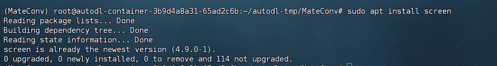

* 功能测试

打开一个新的会话连接，输入screen -S my\_training\_session：

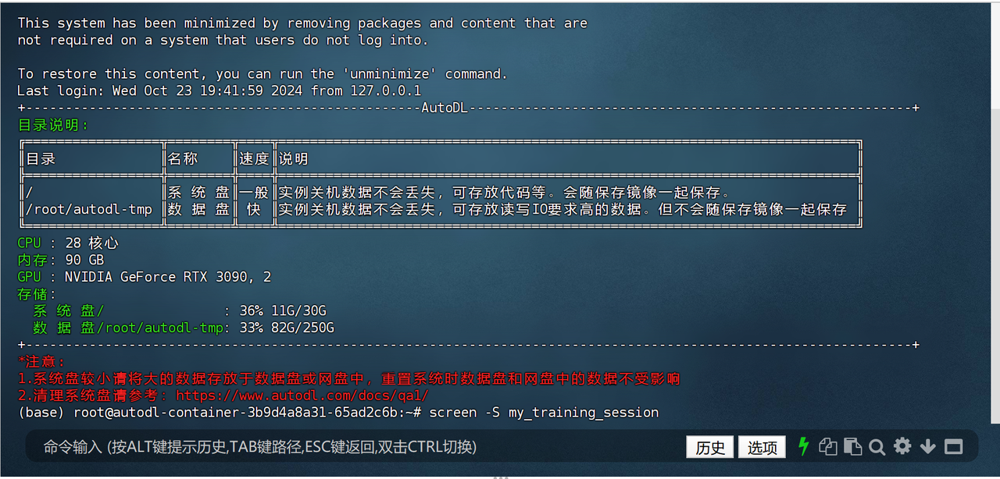

然后即可进入新的会话页面，输入任意内容留作标记：


然后关闭当前对话，再次打开一个新的会话：

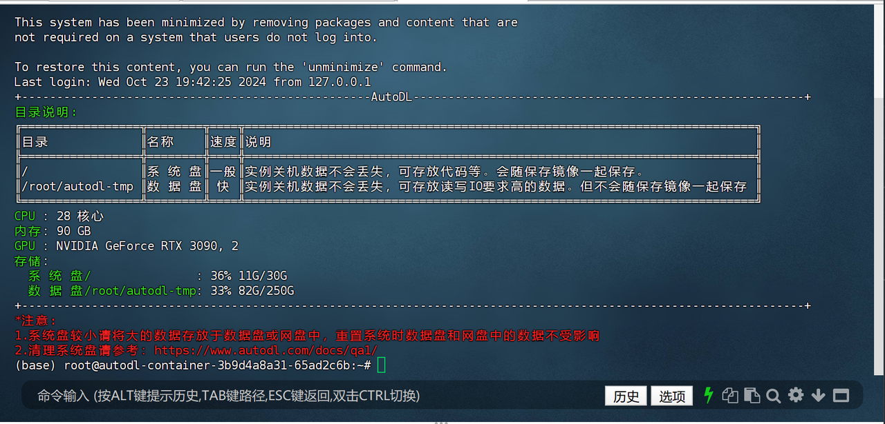

然后输入screen -r my\_training\_session，便可恢复之前的会话：

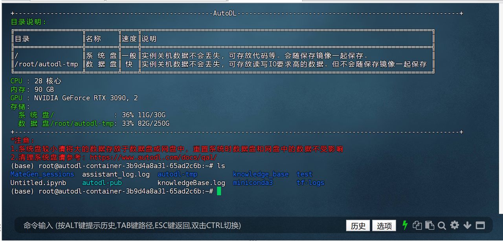

此时my\_training\_session就是一个持久对话，并不会因为会话窗口关闭而关闭。接下来我们就在my\_training\_session中进行模型训练。

#### 2.开启MateConv预训练

* 确认进入到了my\_training\_session会话中：

```bash
screen -r my_training_session
```

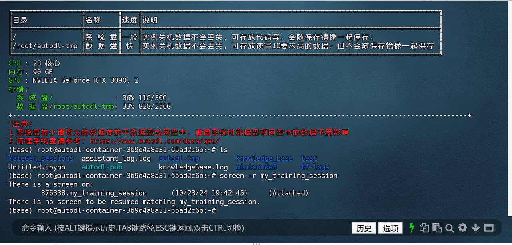

* 准备开始训练

```bash
conda activate MateConv
cd /root/autodl-tmp/MateConv/
deepspeed --master_port 29500 --num_gpus=2 pretrain.py --epochs 15 --use_wandb --wandb_project "MateConv-Pretrain"
```

训练开启状态：

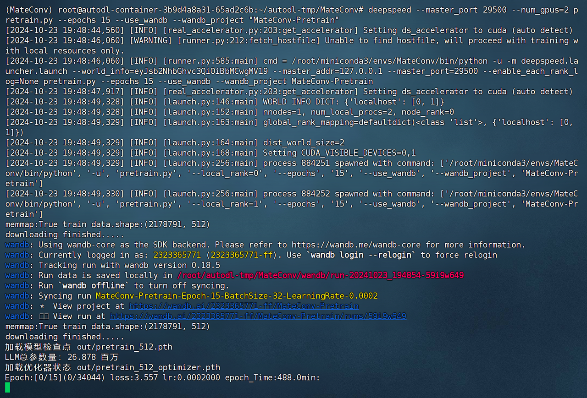

wandb显示状态：

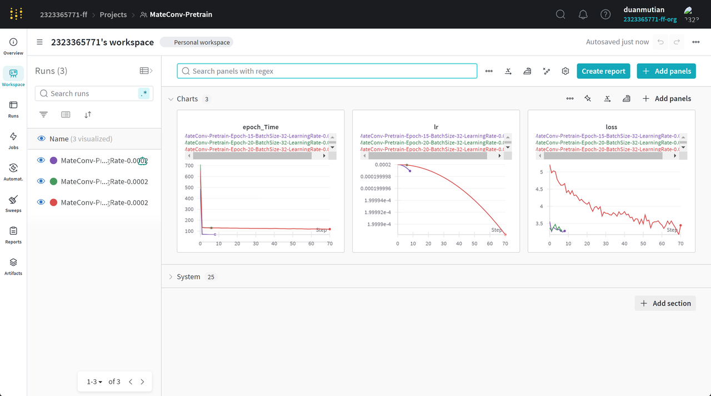

训练结束状态：

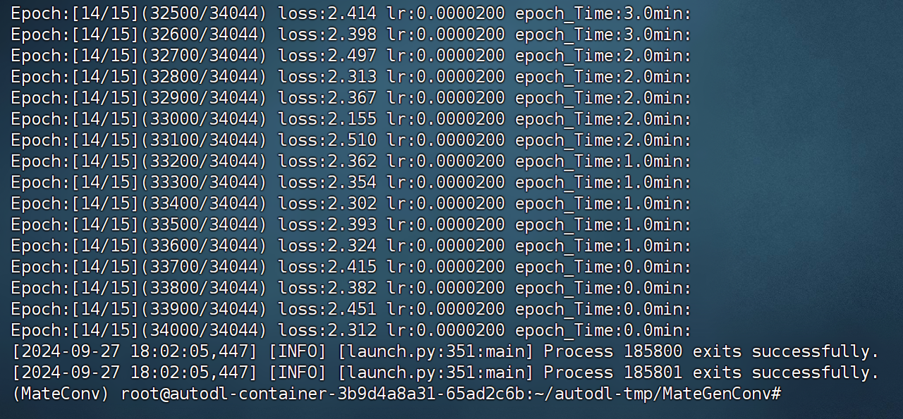

* 此时关闭会话并不会影响训练

```bash
screen -r my_training_session
```

* 训练结束后截图

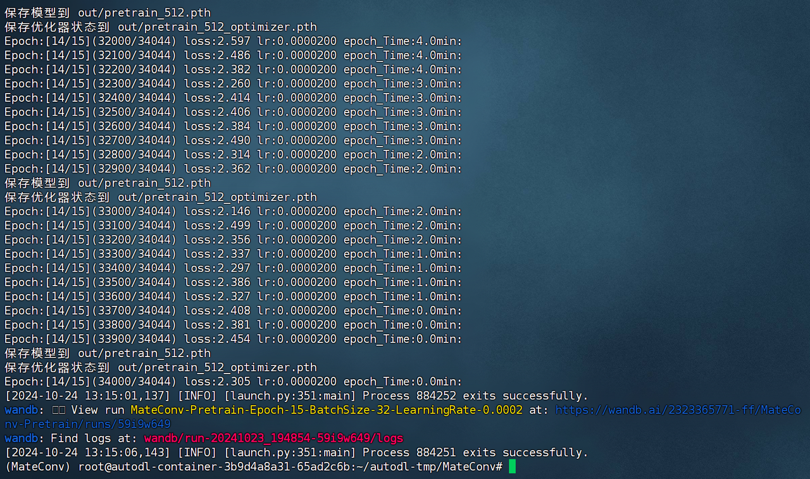

#### 3.MateConv预训练后效果测试

* 训练结束后测试运行

```python
# 创建配置对象
lm_config = LMConfig()
```

```python
# 初始化 Transformer 模型
model = Transformer(lm_config)
```

```python
device = torch.device("cuda" if torch.cuda.is_available() else "cpu")
```

```python
device
```

```plaintext
device(type='cuda')
```

```python
model.to(device)

# 检查模型结构和参数
print(model)
```

```plaintext
Transformer(
  (tok_embeddings): Embedding(6400, 512)
  (dropout): Dropout(p=0.0, inplace=False)
  (layers): ModuleList(
    (0-7): 8 x TransformerBlock(
      (attention): Attention(
        (wq): Linear(in_features=512, out_features=512, bias=False)
        (wk): Linear(in_features=512, out_features=256, bias=False)
        (wv): Linear(in_features=512, out_features=256, bias=False)
        (wo): Linear(in_features=512, out_features=512, bias=False)
        (attn_dropout): Dropout(p=0.0, inplace=False)
        (resid_dropout): Dropout(p=0.0, inplace=False)
      )
      (attention_norm): RMSNorm()
      (ffn_norm): RMSNorm()
      (feed_forward): FeedForward(
        (w1): Linear(in_features=512, out_features=1408, bias=False)
        (w2): Linear(in_features=1408, out_features=512, bias=False)
        (w3): Linear(in_features=512, out_features=1408, bias=False)
        (dropout): Dropout(p=0.0, inplace=False)
      )
    )
  )
  (norm): RMSNorm()
  (output): Linear(in_features=512, out_features=6400, bias=False)
)
```

```python
# 加载模型权重【这里要修改为你的模型地址】
model.load_state_dict(torch.load('out_old/pretrain_512.pth', map_location=device))
model.eval()  # 切换到评估模式
```

```plaintext
Transformer(
  (tok_embeddings): Embedding(6400, 512)
  (dropout): Dropout(p=0.0, inplace=False)
  (layers): ModuleList(
    (0-7): 8 x TransformerBlock(
      (attention): Attention(
        (wq): Linear(in_features=512, out_features=512, bias=False)
        (wk): Linear(in_features=512, out_features=256, bias=False)
        (wv): Linear(in_features=512, out_features=256, bias=False)
        (wo): Linear(in_features=512, out_features=512, bias=False)
        (attn_dropout): Dropout(p=0.0, inplace=False)
        (resid_dropout): Dropout(p=0.0, inplace=False)
      )
      (attention_norm): RMSNorm()
      (ffn_norm): RMSNorm()
      (feed_forward): FeedForward(
        (w1): Linear(in_features=512, out_features=1408, bias=False)
        (w2): Linear(in_features=1408, out_features=512, bias=False)
        (w3): Linear(in_features=512, out_features=1408, bias=False)
        (dropout): Dropout(p=0.0, inplace=False)
      )
    )
  )
  (norm): RMSNorm()
  (output): Linear(in_features=512, out_features=6400, bias=False)
)
```

```python
# 准备输入文本
input_text = "长江、"
input_ids = tokenizer.encode(input_text, return_tensors='pt').to(device)
```

```python
# 生成多个 token
num_tokens_to_generate = 2  # 要生成的 token 数量
generated_tokens = []

with torch.no_grad():
    for _ in range(num_tokens_to_generate):
        output = model(input_ids)
        next_token = output.logits.argmax(dim=-1)[:, -1]  # 获取最后一个 token 的预测
        generated_tokens.append(next_token.item())  # 将 token ID 添加到列表中
        input_ids = torch.cat([input_ids, next_token.unsqueeze(0)], dim=1)  # 将新 token 添加到输入中

# 将生成的 token IDs 转换为文本
generated_text = tokenizer.decode(generated_tokens, skip_special_tokens=True)

# 打印最终回复
print(generated_text)
```

```plaintext
黄河
```

```python
# 准备输入文本
input_text = "中国是全球最"
input_ids = tokenizer.encode(input_text, return_tensors='pt').to(device)

# 生成多个 token
num_tokens_to_generate = 22  # 要生成的 token 数量
generated_tokens = []

with torch.no_grad():
    for _ in range(num_tokens_to_generate):
        output = model(input_ids)
        next_token = output.logits.argmax(dim=-1)[:, -1]  # 获取最后一个 token 的预测
        generated_tokens.append(next_token.item())  # 将 token ID 添加到列表中
        input_ids = torch.cat([input_ids, next_token.unsqueeze(0)], dim=1)  # 将新 token 添加到输入中

# 将生成的 token IDs 转换为文本
generated_text = tokenizer.decode(generated_tokens, skip_special_tokens=True)

# 打印最终回复
print(generated_text)
```

```plaintext
大的电力消费国，电力消费量占全球电力消费总量的70%。
```

#### 5.更大规模参数训练方法

```python
from transformers import PretrainedConfig
from typing import List


class LMConfig(PretrainedConfig):
    model_type = "MateConv"

    def __init__(
            self,
            dim: int = 512,
            n_layers: int = 8,
            n_heads: int = 16,
            n_kv_heads: int = 8,
            vocab_size: int = 6400,
            hidden_dim: int = None,
            multiple_of: int = 64,
            norm_eps: float = 1e-5,
            max_seq_len: int = 512,
            dropout: float = 0.0,
            flash_attn: bool = True,
            ####################################################
            # Here are the specific configurations of MOE
            # When use_moe is false, the following is invalid
            ####################################################
            use_moe: bool = False,
            num_experts_per_tok=2,
            n_routed_experts=4,
            n_shared_experts: bool = True,
            scoring_func='softmax',
            aux_loss_alpha=0.01,
            seq_aux=True,
            norm_topk_prob=True,
            **kwargs,
    ):
        self.dim = dim
        self.n_layers = n_layers
        self.n_heads = n_heads
        self.n_kv_heads = n_kv_heads
        self.vocab_size = vocab_size
        self.hidden_dim = hidden_dim
        self.multiple_of = multiple_of
        self.norm_eps = norm_eps
        self.max_seq_len = max_seq_len
        self.dropout = dropout
        self.flash_attn = flash_attn
        ####################################################
        # Here are the specific configurations of MOE
        # When use_moe is false, the following is invalid
        ####################################################
        self.use_moe = use_moe
        self.num_experts_per_tok = num_experts_per_tok  # 每个token选择的专家数量
        self.n_routed_experts = n_routed_experts  # 总的专家数量
        self.n_shared_experts = n_shared_experts  # 共享专家
        self.scoring_func = scoring_func  # 评分函数，默认为'softmax'
        self.aux_loss_alpha = aux_loss_alpha  # 辅助损失的alpha参数
        self.seq_aux = seq_aux  # 是否在序列级别上计算辅助损失
        self.norm_topk_prob = norm_topk_prob  # 是否标准化top-k概率
        super().__init__(**kwargs)
```

#### 1. **`dim` (模型维度)**：

* **含义**：`dim` 是指模型中每层的特征维度，也就是 Transformer 中每个隐藏状态向量的大小。通常，`dim` 越大，模型的表示能力越强。

* **调整建议**：增大 `dim` 将使模型能够捕捉到更加复杂和细致的特征。比如，从 `512` 调整到 `1024`，可以提升模型的表达能力，但也会大大增加每层的计算量和显存需求。

* **影响**：增大 `dim` 会直接增加每层的计算复杂度和参数量，因为模型中很多计算都是基于这个维度进行的。

#### 2. **`n_layers` (层数)**：

* **含义**：`n_layers` 是指模型中 Transformer block 的数量。每一层都包含自注意力机制和前馈神经网络等模块。

* **调整建议**：增加 `n_layers` 会让模型更深，从而能够学习更复杂的模式。例如，从 `8` 层增加到 `12` 或 `24` 层可以显著提升模型的表达能力，但计算复杂度也会显著上升。

* **影响**：增加层数会直接增加模型的深度，更多的层意味着模型有更多机会处理上下文信息，但也会带来计算成本的显著增加。

#### 3. **`n_heads` (注意力头数)**：

* **含义**：`n_heads` 是指每层中自注意力机制的多头注意力头数。多头注意力允许模型在不同的子空间中并行处理不同的注意力模式。

* **调整建议**：增加 `n_heads` 可以让模型在同一层中捕捉到更多的特征，提升自注意力的能力。比如从 `16` 增加到 `32` 会让注意力机制更加丰富，但也会增加计算和存储需求。

* **影响**：更多的注意力头数将提升每层的并行计算能力，但头数增加的同时，每个头的维度（`dim // n_heads`）会变小，可能会影响注意力的效果。

#### 4. **`vocab_size` (词汇表大小)**：

* **含义**：`vocab_size` 是模型词汇表的大小，即模型可以处理的不同 token 的数量。较大的词汇表允许模型处理更多的词或符号，但也会增加嵌入层和输出层的参数量。

* **调整建议**：如果你的任务涉及更多的词汇，可以增加 `vocab_size`，比如从 `6400` 增加到 `10000` 或 `30000`。但这会显著增加嵌入层和输出层的大小。

* **影响**：增加词汇表大小会直接影响嵌入矩阵的大小，特别是在处理大规模语料时，这可能是一个重要的调整点。

#### 5. **`hidden_dim` (隐藏层维度)**：

* **含义**：`hidden_dim` 是前馈神经网络的隐藏层维度。如果 `hidden_dim` 没有设置，默认通常是 `4 * dim`。

* **调整建议**：增加 `hidden_dim` 可以让前馈层处理更多的特征，提升模型的非线性表达能力。例如，可以将 `hidden_dim` 从 `4 * dim` 增加到 `8 * dim`，但计算量和参数量也会增加。

* **影响**：前馈网络的隐藏维度增加将直接影响每一层的计算复杂度。

#### 6. **`max_seq_len` (最大序列长度)**：

* **含义**：`max_seq_len` 是模型能够处理的输入序列的最大长度。这个参数控制模型能处理多少个 token。

* **调整建议**：如果需要处理更长的文本序列，可以增加 `max_seq_len`，比如从 `512` 增加到 `1024`，以适应更长的输入文本。这样可以让模型处理更长的上下文信息，但也会增加每层的计算量。

* **影响**：更大的 `max_seq_len` 意味着每个序列中的 token 数量增加，因此自注意力机制的计算复杂度会增加（注意力机制的复杂度与序列长度平方成正比）。

#### 7. **`dropout` (丢弃率)**：

* **含义**：`dropout` 是指模型训练时用于防止过拟合的丢弃比例。它帮助模型在训练过程中避免过拟合。

* **调整建议**：增加 `dropout` 比率（例如从 `0.1` 增加到 `0.3`），可以在训练时防止模型过拟合，特别是在小数据集上训练时可能需要加大 `dropout`。

* **影响**：增大 `dropout` 会让模型训练过程更加稳定，但在推理时并不使用 `dropout`。

#### 8. **`flash_attn` (快速注意力)**：

* **含义**：`flash_attn` 是一种加速注意力机制的技术。如果开启，模型会使用更高效的注意力机制来加速训练和推理。

* **调整建议**：保持 `True` 可以加速模型的训练和推理，特别是对于较大模型，启用 `flash_attn` 可以提升效率。

#### 如何通过调整这些参数增加模型规模：

* **增加模型的表达能力**：通过增加 `dim` 和 `n_layers`，你可以大大提升模型的表达能力，使其能够处理更复杂的任务。

* **增加并行处理能力**：通过增加 `n_heads`，你可以让模型在自注意力机制中更加并行处理不同的上下文信息，适应更复杂的模式。

* **处理更长的输入文本**：增大 `max_seq_len` 可以让模型处理更长的文本序列，适合处理长文档或更复杂的对话任务。

* **增加词汇覆盖面**：增大 `vocab_size` 可以让模型处理更多种类的词汇，特别是在多语言任务或复杂领域任务中，这是一个重要的调整。

#### 注意：

* **计算资源需求**：随着这些参数的增加，模型的显存需求和训练时间也会成倍增加。因此，在调整这些参数时需要考虑硬件资源的限制。

* **参数之间的平衡**：增加模型规模并不是简单地增大所有参数，而是需要根据任务的复杂性和资源的限制，选择性地调整关键参数。

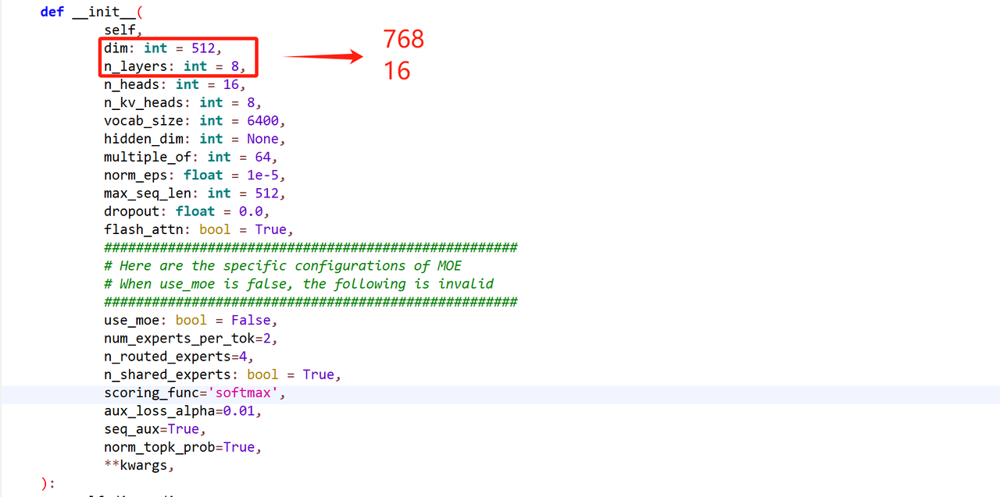

&#x20;

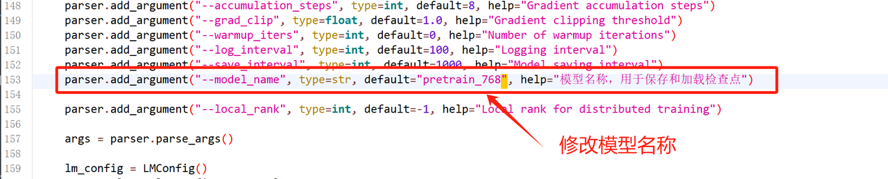

&#x20;

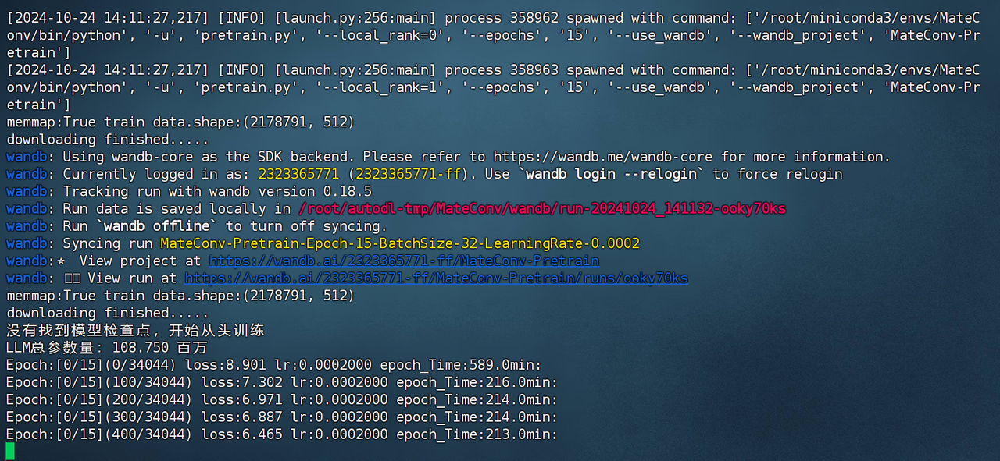

&#x20;

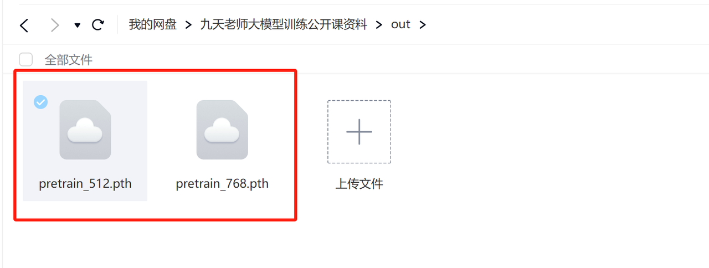

***


📍**更多大模型技术内容学习**

**扫码添加助理英英，回复“大模型”，了解更多大模型技术详情哦👇**


此外，**扫码回复“入群”**，即可加入**大模型技术社群：海量硬核独家技术`干货内容`+无门槛`技术交流`！**
