## **Step 1.AutoDL算力租赁流程                                                          &#x20;**

* AutoDL简介

AutoDL是一个稳定高效的算力租赁平台， AutoDL支持一键部署基础Linux基础环境、镜像环境，同 时支持镜像文件保存与迁移、跨实力读取文件等，且平台显卡较为充裕，并支持多种不同计费方式，对  于大模型初学者来说是非常不错的算力租赁渠道。

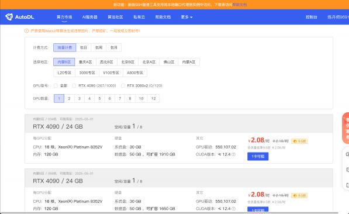

但与此同时， AutoDL也有一定的局限，如没有公网IP、不支持Docker镜像等。不过对于本次公开    课，对于不具备本地硬件环境的同学来说， AutoDL肯定是最佳算力租赁渠道，公开课所有的演示流程也 将是基于AutoDL环境的操作，便于各位同学跟着公开课内容逐步手动实现。

* AutoDL注册与充值

点击AutoDL官网即可注册与登录合<https://www.autodl.com/login>

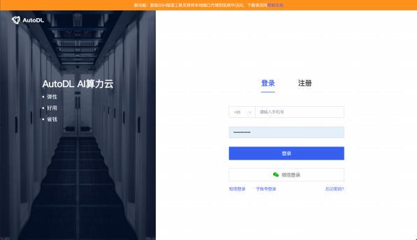

除了常规登录流程外， AutoDL还要求绑定微信和进行实名认证。实名认证其实是目前所有算力租赁 平台的基本要求，大家按照AutoDL官网指引合[https://www.autodl.com/console/center/account/aut](https://www.autodl.com/console/center/account/auth) [h](https://www.autodl.com/console/center/account/auth) ，一步步操作即可：

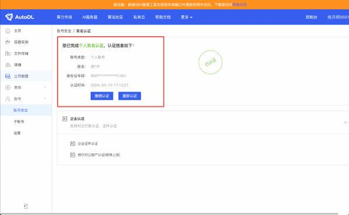

* 账户充值

AutoDL采用的是预付费模式，即需要先在AutoDL平台上储值，然后再租赁相关算力。 AutoDL充值 地址合<https://www.autodl.com/recharge>。需要注意的是，若需要全程完成公开课的模型训练流程，  则需要约50元左右算力成本，而若只想简单测试最终模型效果，则算力成本在10元以内，大家可以根据 自己实际需求进行充值。

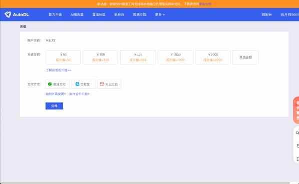

* 算力租赁

接下来就需要进行GPU租赁了，本次公开课实验需要28G-30G左右显存，同时为了给大家介绍单机   多卡的模型训练方法，推荐租赁双卡3090服务器，相对来说会较为划算。此外，也可以考虑租赁更高配  置的服务器，如双卡4090、双卡L20、双卡A100等，可根据实际需求进行租赁。 AutoDL算力市场合 ：[h](https://www.autodl.com/market/list) [ttps://www.autodl.com/market/list](https://www.autodl.com/market/list)

这里以租赁双卡3090为例进行介绍，计费方式可选根据实际需求进行选择，然后点击3090专区，并 GPU数量选择2，然后任意选择一个有闲置GPU的服务器，点击2卡可租即可：

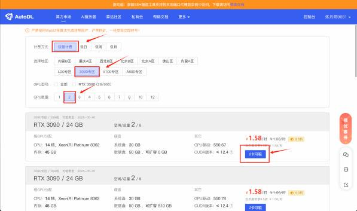

然后再次确认计费方式，以及账户剩余费用是否足够支付，在基础镜像中，选择一个镜像：

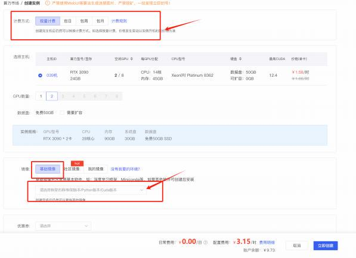

这里我们选择Pytorch 2.3.0（即最高版本） +Python 3.12+CUDA 12.1

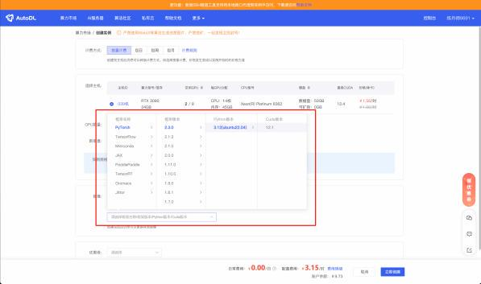

选择完毕后，点击立即创建即可：

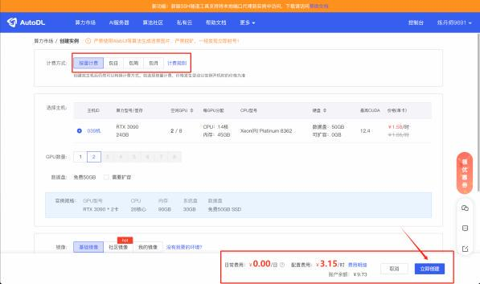

注，这里的镜像配置和计费方式，都可以随时修改。&#x20;

* 查看当前服务器

创建完成后，页面会自动跳转到当前账号的在线服务器管理页面，这里可以看到刚刚租赁的服务器 正在开机中：

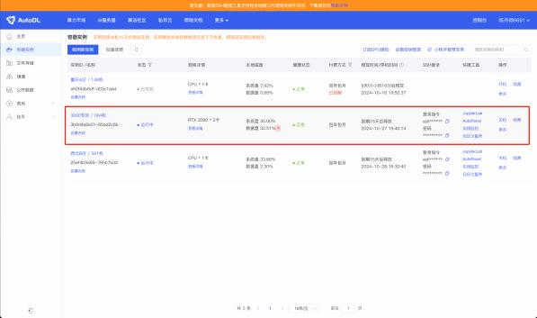

稍作等待，待显示 运行中 时，代表远程服务器已经顺利运行，接下来则需要考虑如何连接远程服务 器。

## **Step 2.使用FinalShell连接远程服务器**

连接远程服务器的方式有很多种，首先服务器已预安装了JupyterLab，我们可以直接通过

JupyterLab中的Terminal来连接服务器，并通过命令行的方式操作远程服务器。但由于JupyterLab中    Termianl界面较为原始，对新人用户操作并不友好。因此推荐使用专门的远程终端连接软件连接远程服 务器，这里推荐使用FinalShell ，**下图扫码添加英英助教，回复LLM**，即可领取本次公开课课件：

其中finalshell软件就在本次公开课的课件中：

下载后按照普通软件安装流程进行安装即可：

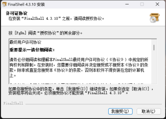

安装完成后，即可使用FinalShell连接远程服务器。由于接下来FinalShell连接远程服务器需要使用远 程服务器的地址和端口，因此我们需要先查阅此时远程服务器的基本信息。回到AutoDL控制台页面，分  别复制登陆指令和密码到任意文本编辑器中：

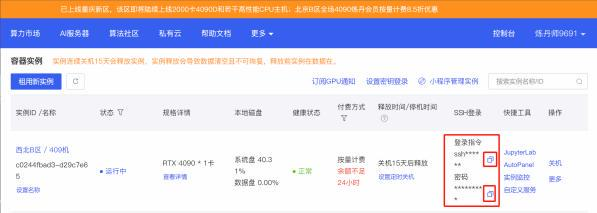

例如此时改服务器的登录指令为（需要找到你的主机的登录指令和密码）：

| ssh -p 24503 root@conxxx |
| ------------------------ |

密码为：

| wxxxx |
| ----- |

记录好了之后即可打开FincalShell，使用该信息连接远程服务器。接下来打开FinalShell：

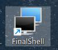

首次使用时点击左上方文件夹，进入连接管理器：

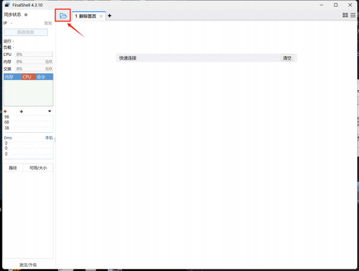

再点击创建新的连接，并在弹出的选项中选择SSH连接（Linux）：

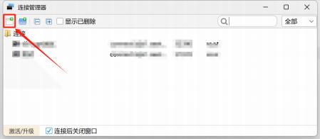

此处名称可以随意填写，主机为 conxxx ，也就是登陆指令root@conxxx中的conxxx部分，端口为

24503，也就是登录指令中ssh -p 24503 root@conxxx的24503部分，用户名为root，也就是 root@conxxx中的conxxx中的root，而密码则是wxxxx ，也就是此前复制的密码：

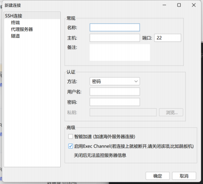

创建完成后回到连接管理器页面，双击刚刚创建的连接：

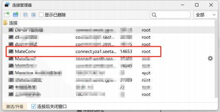

即可进入到连接页面，此时点击接受并保存即可：

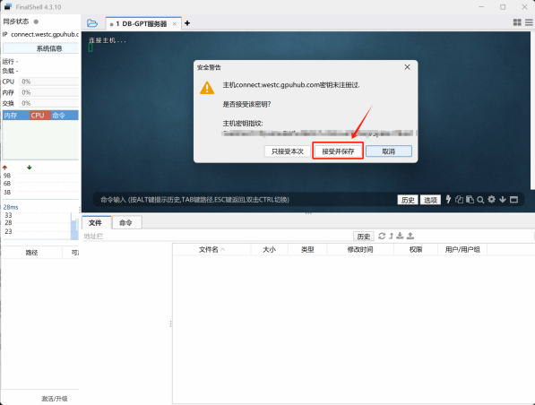

当进入到如下页面，则说明已经连接成功：

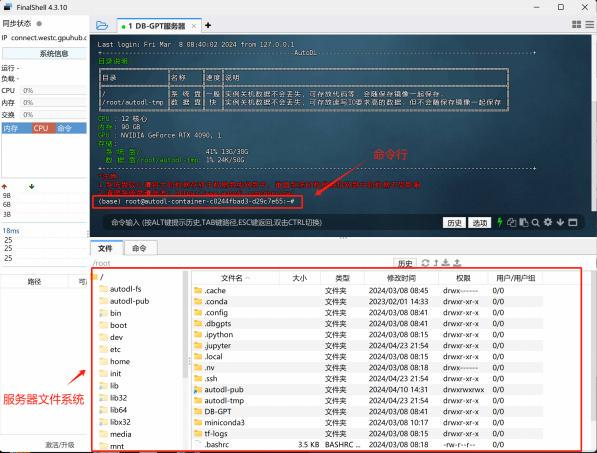

接下来即可借助FinalShell的命令行来操作远程服务器，在远程服务器上进行模型训练相关操作。

📍**更多大模型技术内容学习**

**扫码添加助理英英，回复“大模型”，👆了解更多大模型技术详情哦**
