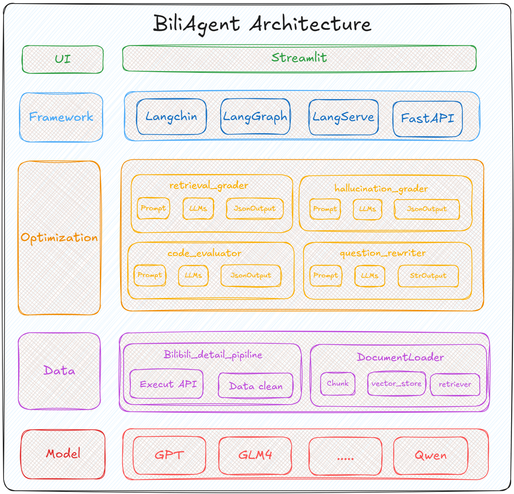
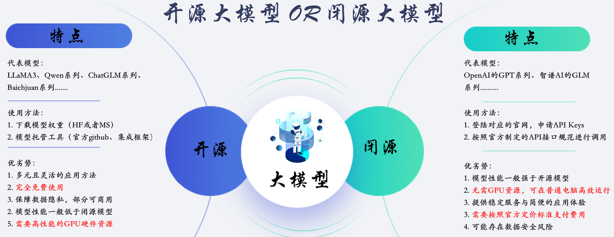
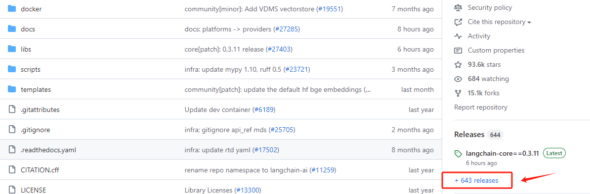
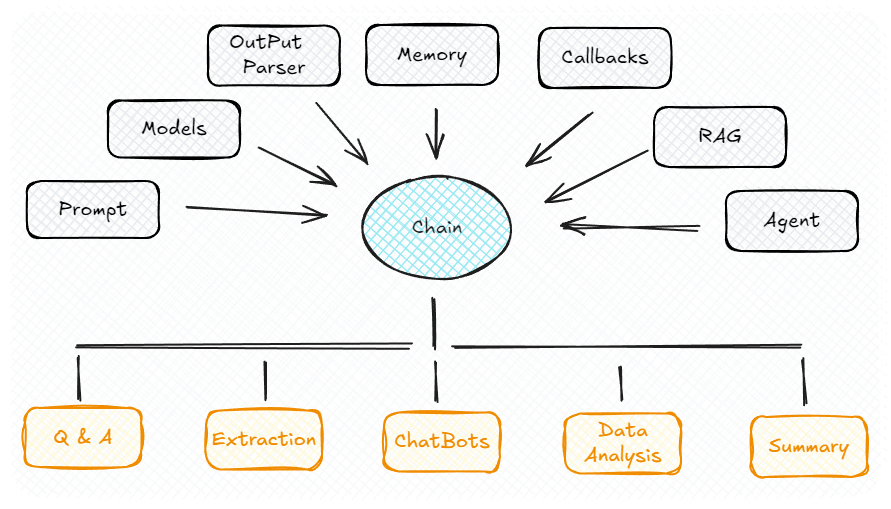
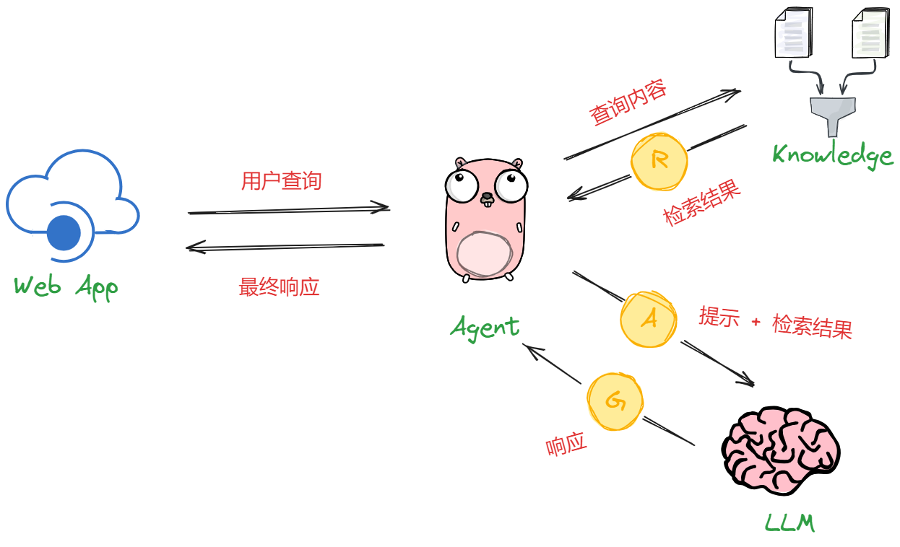
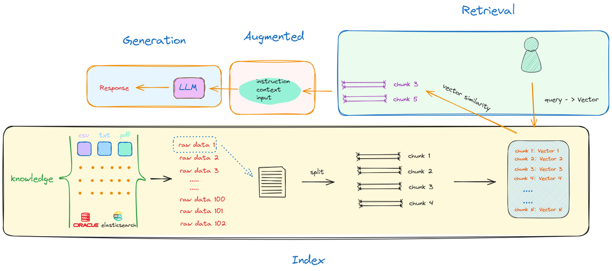
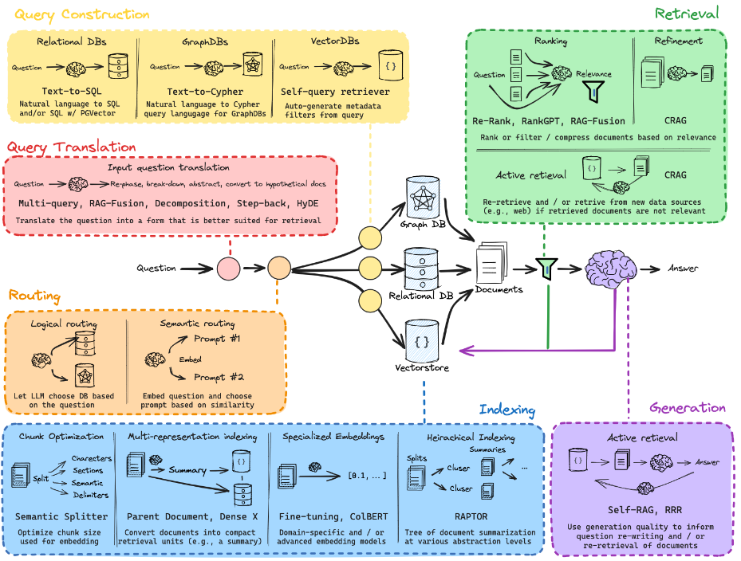
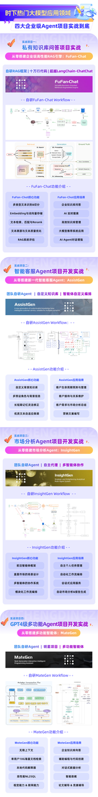

## Part 2.BiliAgent 大模型集成与实时检索的优化策略



  AI应用产品的设计核心始终围绕着大模型展开，其主要依赖大模型本身的处理和决策能力。对于AI产品，我们期望它能独立完成那些通常需人工参与的任务或工作流。这些决策和执行任务，主要由大模型负责完成。因此，在开发AI应用程序时，我们一般会**首先选择合适的大模型**，再根据该大模型的能力和特性选取或定制最适合的开发框架以实施具体的业务逻辑。当然，如果有足够规模和技术深度的开发团队，也可以自行设计完整的开发流程。

  对于大模型的使用，则主要分为两种类型。一类是`GPT`、`GLM4`这样的在线`API`的，而另一类，就是先私有化部署开源大模型，再借助开发框架构建来大模型应用。当然，**目前主流的大模型应用开发框架基本都同时支持在线模型`API`的调用及开源模型两种形式**。对于在线大模型，以`GPT`为例，开发者需要配置科学上网的环境，在其官网创建 `API Key`，最后遵循`API`的使用文档进行应用配置。这一过程中涉及到的网络环境适配，数据隐私安全，成本管理及如何去定制化自己需求的开发流程，往往都需要遵循官方提供的功能来实现。

* 测试能否调用OpenAI API

```python
from openai import OpenAI

#client = OpenAI(api_key='sk-xxxxxxx')

client = OpenAI()

completion = client.chat.completions.create(
  model="gpt-4",
  messages=[
    {"role": "user", "content": "你好，请你介绍一下你自己"}
  ]
)

print(completion.choices[0].message.content)
```

```plaintext
你好！我是OpenAI的人工智能，我的名称是ChatGPT。我是基于深度学习模型进行训练的，可以处理各种类型的文本请求，例如问答、撰写文章、提供简单的建议等。我不具备个人感情或个人经历，我只是一个程序，我通过学习大量的语言模式，尝试理解和生成文本。我是为了帮助你，提供信息或者聊天的工具。
```

  如果能正常得到输出，说明调用`GPT`模型成功。



  相较在线模型，开源大模型的部署和使用则会更加复杂，会涉及大模型的私有化部署，再通过命令行、网页端访问和API调用等多种不同的方式与部署的大模型进行交互。但实际上，无论是基于大模型去做任何形式的应用开发过程，仅停留在这个阶段肯定无法满足实际的需求。如下代码是我们私有化部署了`GLM4`模型并进行访问的示例代码：

```python
from openai import OpenAI

base_url = "http://192.168.110.131:8000/v1/"
client = OpenAI(api_key="EMPTY", base_url=base_url)

messages = [{"role": "user", "content": "你好，请你介绍一下你自己"}]

response = client.chat.completions.create(
    model="glm-4",
    messages=messages,
)

print(response.choices[0].message.content)
```

```plaintext
你好！我是一个基于人工智能技术的智能助手。我的任务是提供信息、解答问题以及帮助用户解决问题。我可以通过分析大量的数据来理解用户的提问，并给出合适的回答或建议。无论是日常生活咨询、科技知识讲解还是其他各类问题，我都会尽力为您服务。请问有什么可以帮助您的吗？
```

  虽然目前的大模型基本都可以按照`OpenAI`的`API`规范形式进行调用，但如果进行实操我们会发现，要想实现某些特定功能，整个开发过程中花费的大部分时间并非直接与模型调用相关。换言之，在构建大模型应用的过程中，虽然大模型是核心，但实际针对大模型编写的代码量相对较小。而在这些有限的代码中，提示工程又往往会占据主要的工作量。这进一步引出一个关键问题：除了大模型本身，其他各环节如何高效串联，以及这些环节的代码开发和工作量如何分配和执行，将在很大程度上影响最终应用的用户体验。

  在这种情况下，解决这一窘境且广受认可和高度实用的解决方案，便是LangChain。

# 1. 什么是LangChain

  LangChain 归属于`LangChain AI`公司，作为其中的一个核心项目，开源发布在Gitub上：https://github.com/langchain-ai/langchain

  从LangChain的GitHub版本迭代历史上看，从2023年1月16日起已经经历了643个大小版本的迭代，并且仍然以高频率的更新在加速项目的功能上线，其关注度和社区活跃度是非常高的。LangChain给自身的定位是：**用于开发由大语言模型支持的应用程序的框架**。它的做法是：通过提供标准化且丰富的模块抽象，构建大语言模型的输入输入规范，利用其核心概念`chains`，灵活地连接整个应用开发流程。而针对每个功能模块，都源于对大模型领域的深入理解和实践经验，开发者提供出来的标准化流程和解决方案的抽象，再通过灵活的模块化组合，才有了目前这样一款在大模型应用开发领域内被普遍高度认可的通用框架。



* **为什么需要这样做？**

  首先，我们需考虑当前大模型的发展态势。尽管OpenAI的GPT系列模型作为大模型领域的`领军人物`，在很大程度上了影响了大模型的使用规范和基于大模型进行应用开发的范式，但并不意味着所有大模型间的使用方式完全相同。例如，我们熟悉的OpenAI GPT模型API调用方式对于Baichuan2模型就不适用。因此，对于每个新模型都要花费大量时间学习其特定规范再进行应用探索，这种工作效率显然是十分低下的。

  其次，必须谈论的是大模型目前面临的局限，如知识更新的滞后性、外部API调用能力、私有数据连接方式以及输出结果的不稳定性等问题。在应用开发中，如何找到这些问题的有效解决策略？


  上述提到的每个限制都紧密关联于大模型本身的特性。尽管理论上可以通过重新训练、微调来增强模型的原生能力，这种方法确实有效，但实际上，大多数开发者并不具备进行这样操作所需的技术资源、时间和财力，选择这条路径一定会导致方向越来越偏离目标。我们之前讨论的OpenAI的Function Calling和通过ReAct流程接入第三方API能够提供一些解决方案，但这每一步都需大量的研发投入，而且最终实现后的应用效果，也取决于研发人员的个人技术能力。在这种背景下，既然大家都有不同的想法和解决方案，那LangChain就来集中做这件事，提供一个统一的平台和明确的定义，来实现应用框架的快速搭建，这就是LangChain一直想要做到，且正在做的事情。

* **LangChain的做法**

  从本质上分析，LangChain还是依然采用从大模型自身出发的策略，通过开发人员在实践过程中对大模型能力的深入理解及其在不同场景下的涌现潜力，使用模块化的方式进行高级抽象，设计出统一接口以适配各种大模型。LangChain抽象出的重要核心模块如下：

1. Model I/O ：标准化各个大模型的输入和输出，包含输入模版，模型本身和格式化输出；

2. Retrieval ：检索外部数据，然后在执行生成步骤时将其传递到 LLM，包括文档加载、切割、Embedding等；

3. Chains ：链条，LangChain框架中最重要的模块，链接多个模块协同构建应用，是实际运作很多功能的高级抽象；

4. Memory ： 记忆模块，以各种方式构建历史信息，维护有关实体及其关系的信息；

5. Agents ： 目前最热门的Agents开发实践，未来能够真正实现通用人工智能的落地方案；

6. Callbacks ：回调系统，允许连接到 LLM 应用程序的各个阶段。用于日志记录、监控、流传输和其他任务；



  从上图中可以看到，LangChain框架涵盖了模型输入输出的标准化、外部工具接入的规范、上下文记忆功能，以及对数据库、SQL、CSV等多种数据源的连接标准。通过核心的"Chain"高级抽象，定义了不同形式下标准的链接方法，这就能够允许开发者根据实际的应用需求和数据流向快速构建出一套完整的应用程序。这个过程类似于搭建积木，可以灵活适应不同的任务需求。也正因为如此，LangChain中涉及的概念和模块化是非常多的，每个模块都有其独特的使用场景和使用方法，那么如何去搭这个“积木”，就需要我们对其每个核心模块都要有一个比较清楚的认知。

  **根据我们这次体验课的`BiliAgent`数据分析场景，需要借助`LangChain`框架来实现的“积木”就是大模型的接入以及`RAG`的构建流程。**

  我们把在一个持久化的附加知识库中可以快速检索出相关的有效信息，并提供给`Agents`作为处理复杂任务的某一阶段的上下文这一过程称为RAG，所以能够理解，RAG的本质就是一种用附加数据来增强LLM知识的技术。从宏观的角度来看，LLMs 可以推理广泛的主题，但它们的知识仅限于它们接受训练的特定时间点的公共数据。如果我们想要构建能够推理私有数据及使用模型所需的特定信息来增强模型的知识，引入适当的信息并将其插入模型提示中的过程，称为检索增强生成 (RAG)。



  其核心构建流程如下：



  如上图所示，RAG主要包括以下步骤：

* **索引（Indexing）**：索引过程是离线执行的关键初始步骤。首先清理和提取原始数据，将 PDF、HTML 和 Word 等各种文件格式转换为标准化纯文本。为了适应语言模型的上下文约束，这些文本被分为更小且更易于管理的块，这个过程称为分块。然后使用嵌入模型将这些块转换为向量表示。最后，创建一个索引来将这些文本块及其向量嵌入存储为键值对，从而实现高效且可扩展的搜索功能。

* **检索（Retrieval）**：用户查询用于从外部知识源检索相关上下文。为了实现这一点，用户查询由编码模型处理，该模型生成语义相关的嵌入。然后，对向量数据库进行相似性搜索，以检索前k个最接近的数据对象。

* **生成（Generation）**：将用户查询和检索到的附加上下文填充到提示模板中。最后，将检索步骤中的增强提示输入到LLM中。

  如下图所示是`LangChain`已经封装好的高阶RAG技术实现方案：



  接下来，我们就进入`PyCharm`项目开发环境详细介绍`BiliAgent`中基于`LangChain`框架如何将`BiliBili API`查询到的实时数据接入到一个`RAG`流程中。

* 体验课内容节选自《大模型与Agent开发》完整版课程

**更多大模型技术内容学习，包含公开课课件、代码、数据等等，请扫码添加助教英英，回复“大模型”，即咨询相关信息哦👇**


**[《大模型与Agent开发实战课》](https://whakv.xetslk.com/s/2oai1g)为【100+小时】体系大课，总共20大模块精讲精析，零基础直达大模型企业级应用！**


