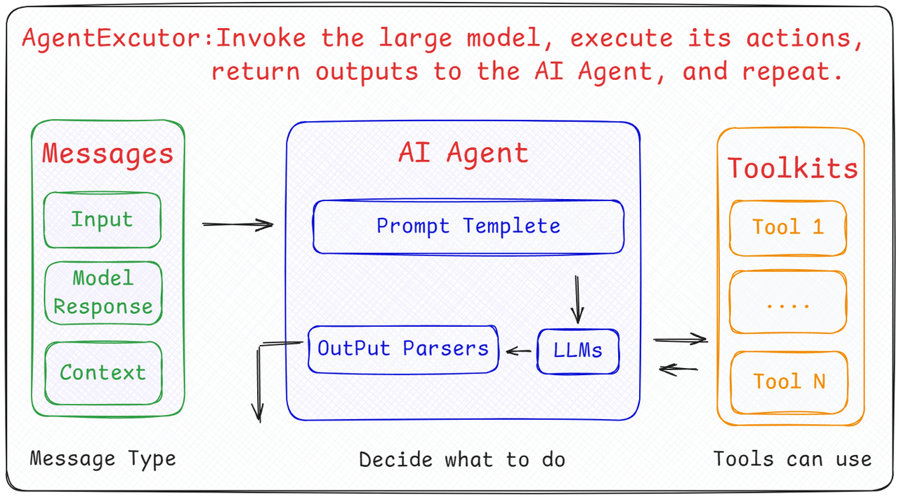
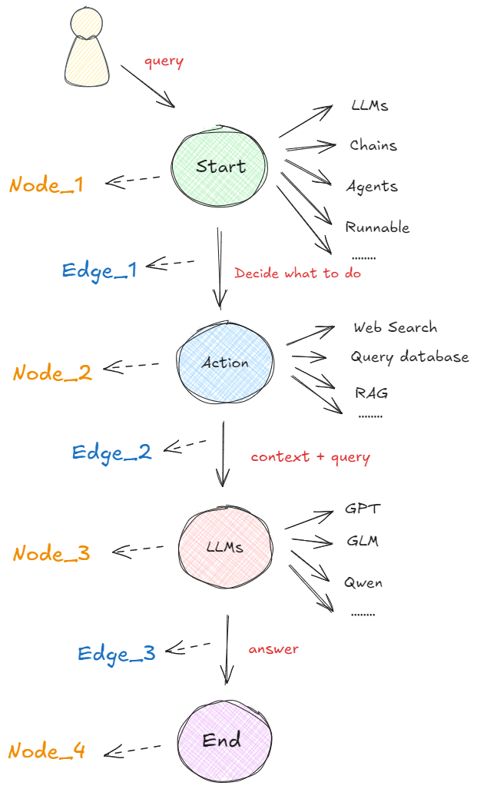
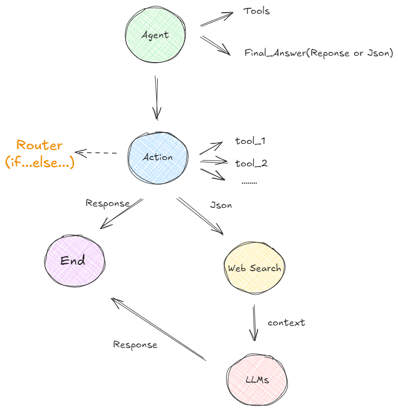
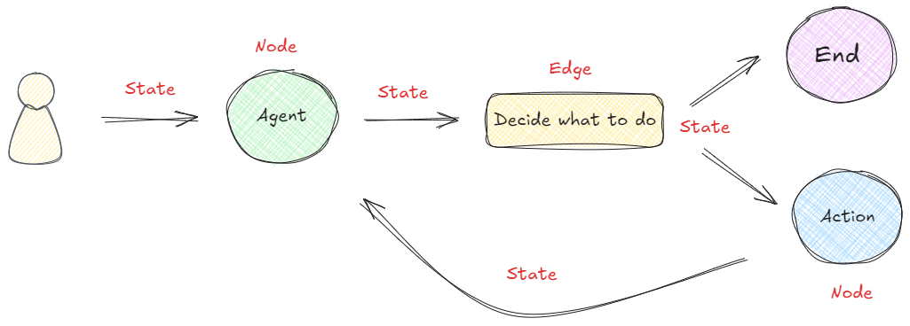
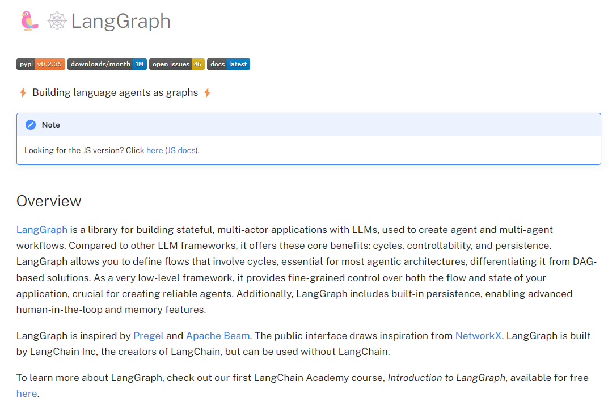
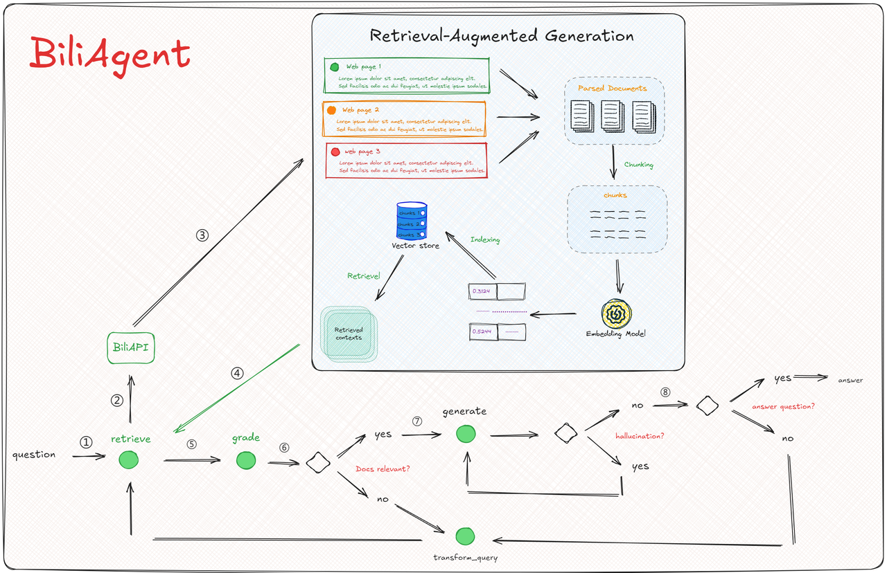

## Part 3.基于LangGraph搭建复杂 BiliAgent 端到端AI服务


  `langchain`项目在2023年就建立起了非常活跃的社区来定义大模型的应用规范。发展到现在，`LangChain`现在也发布了3个大的版本，而\*\*在其整个的构建体系中，一个重要用例是创建代理。\*\*在`LangChain`中，构建`AI Agent`的底层架构如下图所示：👇



  首先，`langChain`框架中的`AI Agent`设计，在内部结构会将其分为三个核心的组件，分别是`Agent`，`Message`和`Toolkits`。每个`Agent`组件一般会由大语言模型 + 提示 + 输出解析器构成，形成一个`Chain`去处理用户的输入。而`Agent`能够处理的输入主要来源于三个方面：`input`代表用户的原始输入，`Model Response`指的是模型对某一个子任务的响应输出，而`History`则能携带上下文的信息。其输出部分，则链接到实际的工具库，需要调用哪些工具，将由经过`Agent`模块后拆分的子任务来决定。大模型调用外部函数会分为两个过程：识别工具和实际执行。在Message -> Agent -> Toolkits 这个流程中，负责的是将子任务拆解，然后根据这些子任务在工具库中找到相应的工具，提取工具名称及所需参数，这个过程可以视作一种“静态”的执行流程。而将这些决策转化为实际行动的工作，则会交给`AgentExecutor`。

  所以综上需要理解的是：在LangChain的`AI Agent`实际架构中，`Agent`的角色是接收输入并决定采取的操作，但它本身并不直接执行这些操作。这一任务是由`AgentExecutor`来完成的。将`Agent`（决策大脑）与`AgentExecutor`（执行操作的Runtime）结合使用，才构成了完整的`Agents`（智能体），**其中`AgentExecutor`负责调用代理并执行指定的工具**，以此来实现整个智能体的功能。

  `LangChain`发展至现在，仍然是构建大语言模型应用程序的前沿框架之一。特别是在最新发布的`v0.3`版本中，已经基本完成了由传统类到表达式语言(LCEL)的重要过渡，给开发者带来的直接利好就是**定义和执行分步操作序列（也称为链）会更加简单**。用更专业的术语来说，**使用`LangChain` 构建的是 DAG（有向无环图）**。而之所以会出现`LangGraph`框架，根本原因是在于随着AI应用（特别是AI Agent）的发展，**对于大语言模型的使用不仅仅是作为执行工具，而更多作为推理引擎的需求在日益增长**。这种转变带来的是更多的重复（循环）和复杂条件的交互需求，这就导致\*\*基于`LCEL`的线性序列构建方式在构建更复杂、更智能的系统时显示出了明显的局限性。\*\*如下所示的代码就是在`LangChain`中通过`LECL`表达式语言构建`Chain`的一种最简单的方式：

```python
# ! langchain==0.3.3 langchain-openai
```

```python
import getpass
import os
from langchain_openai import ChatOpenAI
from langchain_core.prompts import ChatPromptTemplate

if not os.environ.get("OPENAI_API_KEY"):
    os.environ["OPENAI_API_KEY"] = getpass.getpass("Enter your OpenAI API key: ")


llm = ChatOpenAI(model="gpt-4o")

prompt = ChatPromptTemplate.from_messages(
    [
        ("system","You are a helpful assistant that translates {input_language} to {output_language}."),
        ("human", "{input}"),
    ]
)

chain = prompt | llm | output | pr


chain.invoke(
    {
        "input_language": "English",
        "output_language": "Chinese",
        "input": "I love programming.",
    }
)
```

```plaintext
AIMessage(content='我热爱编程。', additional_kwargs={'refusal': None}, response_metadata={'token_usage': {'completion_tokens': 6, 'prompt_tokens': 26, 'total_tokens': 32, 'prompt_tokens_details': {'cached_tokens': 0}, 'completion_tokens_details': {'reasoning_tokens': 0}}, 'model_name': 'gpt-4o-2024-08-06', 'system_fingerprint': 'fp_a20a4ee344', 'finish_reason': 'stop', 'logprobs': None}, id='run-fe5518d1-7987-49bb-bbea-0200cad33dd1-0', usage_metadata={'input_tokens': 26, 'output_tokens': 6, 'total_tokens': 32, 'input_token_details': {'cache_read': 0}, 'output_token_details': {'reasoning': 0}})
```

  反观`LangGraph`，顾名思义，`LangGraph` 在图这个概念上有很大的侧重，\*\*它的出现就是`要解决线性序列的局限性问题，而解决的方法就是循环图`。\*\*在`LangGraph`框架中，**用图取代了`LangChain`的`AgentExecutor`（代理执行器），用来管理代理的生命周期并在其状态内将暂存器作为消息进行跟踪，增加了以循环方式跨各种计算步骤协调多个链或参与者的功能。这就与 `LangChain` 将代理视为可以附加工具和插入某些提示的对象不同，对于图来说，意味着我们可以从任何可运行的功能或代理或链作为一个程序的起点。**

  **那么`LangGraph`到底是什么呢？**

  从名字上看，应该是和`Langchain`有着非常紧密的关系，而事实也确实是这样。**因为`LangGraph` 就是以 `LangChain` 表达式语言为基础而构建起来的用于开发`AI Agent`的一个框架**。所以我们上面提到的关于`LangGragh`在大模型的支持、接入和`AI Agent`构建方面的优势，都可以非常自然的从`LangChain`中迁移过来。从大模型技术发展的角度来看，**大模型本身是无法采取任何行动的，它们的作用只是用来输出文本**，即接收用户的输入并对这些输入给出响应。为了更好和更高效的做到这件事情，

  上面过于专业描述可能理解起来比较困难，所以这里我们通过一个简单直观的场景来详细解释。

  在以图构建的框架中，**任何可执行的功能都可以作为对话、代理或程序的启动点**。这个启动点可以是大模型的 `API` 接口、基于大模型构建的 `AI Agent`，通过 `LangChain` 或其他技术建立的线性序列等等，即下图中的 "Start" 圆圈所示。无论哪种形式，它都首先处理用户的输入，并决定接下来要做什么。下图展示了在 `LangGraph` 概念下，最基本的一种代理模型：👇



  \*\*在启动点定义的可运行功能会根据收到的输入决定是否进行检索以及如何响应。\*\*比如在执行过程中，如果需要检索信息，则可以利用搜索工具来实现，比如`Web Search`（网络搜索）、`Query Database`（查询数据库）、`RAG`等获取必要的信息（图中的 "Action" 圆圈）。接下来，再使用一个大语言模型（LLM）处理工具提供的信息，结合用户最初传入的初始查询，生成最终的响应（图中的 "LLMs" 圆圈）。最终，这个响应被传递至终点节点（图中的 "End" 圆圈）。

  上图所示的流程就是在`LangGraph`概念中一个非常简单的代理构成形式。关键且必须清楚的概念是：在这里，**每个圆圈代表一个“节点”（Nodes），每个箭头表示一条“边”（Edges）。因此，在 `LangGraph` 中，无论代理的构建是简单还是复杂，它最终都是由节点和边通过特定的组合形成的图。这样的构建形式形成的工作流原理就是：当每个节点完成工作后，通过边告诉下一步该做什么，所以也就得出了：`LangGraph`的底层图算法就是在使用消息传递来定义通用程序。当节点完成其操作时，它会沿着一条或多条边向其他节点发送消息。然后，这些接收节点执行其功能，将结果消息传递给下一组节点，然后该过程继续。如此循环往复。**

  **这就是`LangGraph`底层架构设计中图算法的根本思想。**

  接下来，我们再看一个更现实的复杂例子。

  在这个示例中，我们将`AI Agent`定义为应用程序的起点。**构建`AI Agent`代理通常涉及配置一个或多个工具**，否则构建它就没有太大的意义，因为如果仅仅是针对用户的问题直接做响应，即使问题很复杂，我们也可以直接通过提示词来引导大模型进行推理（参考`OpenAI`的 `o1`推理模型）。那么当`AI Agent`包含一些工具时，它是通过函数调用功能使用这些工具，而不是直接执行这些工具。所以当用户输入的原始问题经过`AI Agent`处理的时候，一般会出现以下两种情况：

1. 如果不需要调用任何工具，`AI Agent` 会直接提供一个针对用户问题的自然语言响应。例如：

   * 用户：你好，请你介绍一下你自己。

   * AI Agent：你好，我是一个人工智能助手，可以帮助你解决问题。

2. 如果需要调用工具，则输出将是一个特定格式的 JSON 输出，指示进行特定的函数调用。例如：

   * 输出示例：function': {'arguments': '{"query":"什么是快乐星球？"}','name': 'web\_search'},'type': 'function'}



  经过第一个节点后（Agent），如果`AI Agent`认为需要调用某个函数，它会确定使用哪个工具以及传递哪些参数。假设有多个工具可选的情况下，`Action` 节点将呈现多条可能的路径供选择。如何选择呢？这时候，`LangGraph` 引入了一个\*\*称为“条件边”的组件。条件边根据是否满足特定条件来决定走哪条路径，例如，代理可能需要决定是使用搜索工具还是直接生成最终答案。\*\*为了管理这些决策，则使用了一个类似于 `if-else` 语句的结构，称为`Router`。基于`Router`的决策，代理可能会导向“搜索节点”以执行搜索操作并返回原始文本，或者直接前往“最终答案节点”以获取格式化后的自然语言响应。**如果选择了搜索路径，获取的答案文本还需通过另一个大语言模型进行处理，以生成用户可以理解的响应；若选择了直接回答，则可以使用一个专门的工具来格式化输出。**

  在 `LangGraph` 框架中，`Router` 使用 `if..else` 的形式来决定路径，主要通过以下三种方式实现：

* 提示工程：指示大模型以特定格式做出回应。

* 输出解析器：使用后处理从大模型响应中提取结构化数据。

* 工具调用：利用大模型的内置工具调用功能来生成结构化输出。

  更进一步地，我们现在知道了`LangGraph`通过组合`Nodes`和`Edges`去创建复杂的循环工作流程，通过消息传递的方式串联所有的节点形成一个通路。**那么维持消息能够及时的更新并向该去的地方传递，则依赖`langGraph`构建的`State`概念。** 在`LangGraph`构建的流程中，每次执行都会启动一个状态，图中的节点在处理时会传递和修改该状态。这个状态不仅仅是一组静态数据，而是由每个节点的输出动态更新，然后影响循环内的后续操作。如下所示：👇



  \*\*此谓共享状态。**共享状态是指在执行期间在图内的节点之间传递的数据或信息**。 `LangGraph`允许节点在图上执行时时通过共享和更新此公共状态来进行交互。\*\*这种共享状态使节点能够根据它们共同维护的数据进行通信、交换信息并影响彼此的行为。通过利用共享状态， `LangGraph`才能够促进节点间操作的协调和同步，允许动态交互和创建复杂的工作流程，其中节点可以协作并根据可用的共享信息做出决策。

  从`LangGraph`官方的定义看，该框架是一个**用于使用大模型构建有状态、多参与者应用程序的库，可以创建代理和多代理工作流程**。而其官方自己总结的`LangGraph`的优势则是：

* **循环和分支**：在应用程序中实现循环和条件。

* **持久性**：在图中的每个步骤之后自动保存状态。随时暂停和恢复图形执行，以支持错误恢复、人机交互工作流程、时间旅行等。

* **人机交互**：中断图形执行以批准或编辑代理计划的下一个操作。

* **流支持**：流输出由每个节点生成（包括令牌流）。

* **与 LangChain 集成**：LangGraph 与LangChain和LangSmith无缝集成（但不需要它们）。



  `LangGraph`是一个适用范围非常广的`AI Agent`开发框架。在**大模型的支持方面**，`LangGraph`不仅支持`GPT`系列，还兼容其他多种在线或开源模型，例如 `glm4`、`llama3`和`Qwen`等，可以说热门的大模型均可以接入到该框架中进行`AI Agent`应用程序的开发。而关于**大模型的接入方式**，我们既可以通过传统的`openai api`等原生方式将大模型集成到`LangGraph`构建的`AI Agent`流程中，也可以利用`ollma`、`vllm`等大模型推理加速库，实现更加便捷和高效的集成。除此之外，**在`AI Agent`的构建范式上**，`LangGraph`不仅提供了预配置的`ReAct`代理机制，还支持更多自定义的如`Planning`策略的接入，以满足不同应用场景的需求。

  至此，当我们了解了上述的原理后，再来看`LangGraph`官方的介绍，就能够比较清楚的理解其独特优势究竟体现在何处。

  那在`LangGraph`框架中，各个组件是怎么实现，以及如何定义图结构呢？ 我们切换至`Pycharm`开发环境，实际的通过代码来实现将`BiliAgent`既有的功能组件通过`LangGraph`构建完整的B站数据 & 舆情分析链路。



* 体验课内容节选自《大模型与Agent开发》完整版课程

**更多大模型技术内容学习，包含公开课课件、代码、数据等等，请扫码添加助教英英，回复“大模型”，即咨询相关信息哦👇**


**[《大模型与Agent开发实战课》](https://whakv.xetslk.com/s/2oai1g)为【100+小时】体系大课，总共20大模块精讲精析，零基础直达大模型企业级应用！**


