## Part 1.大模型应用技术发展及BiliAgent项目介绍

  自2023年初开始，大模型在国内外引起了极大的关注。实际上，早在2022年底，国外已经对这一技术展开了非常激烈的讨论，而**在国内对大模型的普及和认知很大程度上得益于`ChatGPT`的问世**。这一现象级的对话式应用直接改变了人们对智能应用的既有看法。在此之前，我们已经习惯了`智能客服`的机械式回答和`智能应用`的频繁出错，所以，当一个能够使用`自然语言`（即人类的交流语言）理解情感、解决问题并且能即问即答的应用系统出现时，人们很难相信它背后不是真实的人类，而是一个由人类设计的机器模型。

  下图中的对话来源于基于`GPT-4.0`模型的对话式应用`ChatGPT`👇

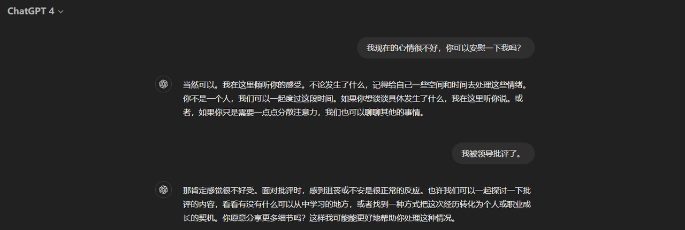

  如上图所示，我们可以用最自然的对话方式让大模型帮助我们处理各种任务、解决问题、学习新知识，甚至在需要时提供安慰。它表现得像是一个无所不知、无所不能的朋友。每当你需要它扮演不同角色时，只需**新建一个对话窗口**，它便能化身为全新的伙伴。在它出现之前，人工智能的技术领域中无论是机器学习模型还是深度学习模型，它们都需要特定的数据先进行训练才能去执行具体任务，比如机器学习中的分类任务或深度学习的实体识别等。而大模型以其接近人类的交互特性，跨越了这些界限，用**独立的个体**直接去解决各种类型的问题，并且还表现得很好，直接把人工智能的热度推到了一个新的高度。

  也正是这样的一种技术上的跨越，业内人会把2023年称为**大模型的元年**，因为它标志着人工智能迈上了一个新的台阶，而且，属于大模型的时代也才刚刚开始。所以我们作为技术人，肯定不是仅仅做一个“吃瓜群众”，看热闹的同时，更多的精力都在积极跟进大模型的发展，深入理解并掌握其背后的技术演进，以此来不断更新自身的技术视野。**当然，我们要研究的并不是表面的应用`ChatGPT`，而是其背后的强力基座模型-`GPT`。**

# 1. 大模型应用技术发展

  比较有意思的是，如果有在2023年起就开始使用`ChatGPT`类应用的**非技术岗位**的小伙伴，大概率都会有这样一些想法：大模型技术一年半以来的技术发展并未带来显著的产品变革，无非是界面美观了一些，功能增加了一些，例如现在支持上传图片、文件和构建插件等。但通过表象应用去看本质，会发现大模型技术的迭代速度是远远快于其他领域的。其快速发展的有两个核心方向：

1. **大模型自身的能力在不断变强**

2. **大模型的对话效果在大幅提升**

  两个方向其背后的技术栈迭代，我们可以总结如下图所示 👇 ：

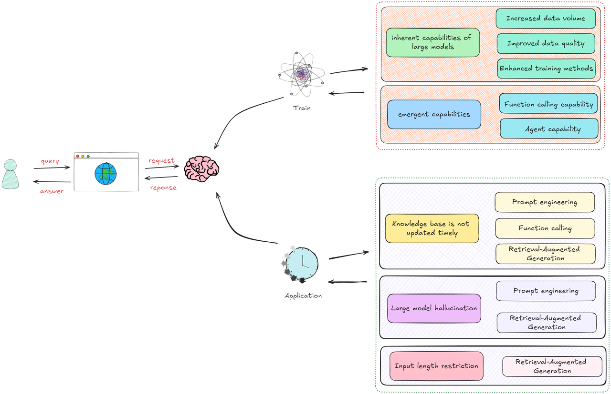

* **大模型自身的能力在不断变强**

  **大模型有两个关键概念：原生能力和涌现能力。**

  所谓**原生能力**，指的是大模型基于特定的神经网络架构，在训练过程中通过不断摄入数据来学习，最终具备解答特定领域问题的能力。这种能力就像是印在大模型“大脑”中的知识，是其能够独立解答问题的基础。就如同我们在大学学习三年后能够解决高等数学问题一样，这种能力是通过学习得来的，我们称之为原生能力。大模型的这种能力的提升在于：随着能获取到的数据量增加，开发者可以基于先前性能表现为其构建更优质的学习数据，结合学习方法的不断迭代优化（技术上称之为预训练技术或微调），大模型的原生能力就可以持续进化。**这种进步的直观表现是模型的理解能力和回答质量的提升。**

  其次，我们还会重点关注大模型的**涌现能力**。这一能力指的是，尽管大模型可能没有直接学习过某些信息，但在与它对话时提供相关信息后，它能够类比和推理出解决方案。这类似于我们在准备高考时做过的“五年高考三年模拟”的题目，尽管高考题目不会与模拟题完全相同，但我们仍可以利用相同的思维模式解决考试试题。大模型的这部分能力提升主要体现在：我们通过给它构造各种函数调用、处理复杂问题的过程示例（Agent能力）等，在预训练或者微调阶段帮助它学习并强化这种能力。这样，大模型就能在其应用的第二个方向上——即实际问题解决中发挥更加重要的作用。

* **大模型的对话效果在大幅提升**

  大模型的能力毋庸置疑，它在对话过程中能够回答和解决多种不同类型的任务，但存在着两个主要问题：**知识库更新不及时和大模型幻觉问题**。

  首先，关于知识库更新问题，正如我们上面刚刚提到的，大模型是在预训练或者微调阶段获取和学习知识。这意味着，如果某些最新的信息未在训练数据中包含，大模型就无法提供相关答案。例如，如果你问它“今天的天气怎么样？”由于缺乏实时更新的数据，大模型无法给出正确的当前天气状况。

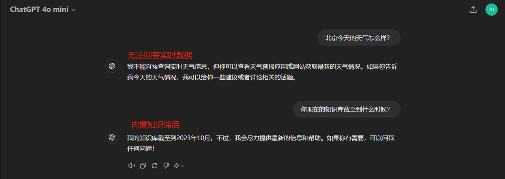

  比较有意思的是：大模型的原生能力在不断的提升，它的对话效果好了，回答质量高了，但是我们的需求也变得越来越复杂了。 单纯的对话应用已无法满足需求。这就促使我们进入了大模型应用的第一个阶段——**提示工程**。

* **Stage 1： 提示工程**

  虽然大语言模型非常强大，但要有效使用它们并非易事。在开发者急于探索如何像处理传统算法模型那样通过微调快速迭代更新大模型的内部知识时，一篇极具启发性的论文 👉 [GPT-3 Language Models are Few-Shot Learners](https://arxiv.org/pdf/2005.14165) 提出了 `In-Context Learning` 的概念。该方法通过向模型提供少量标注的“输入-输出对”示例，在不需要大规模微调的情况下即可显著改善大模型的输出质量。这一发现开启了使用大模型的新方式 👇

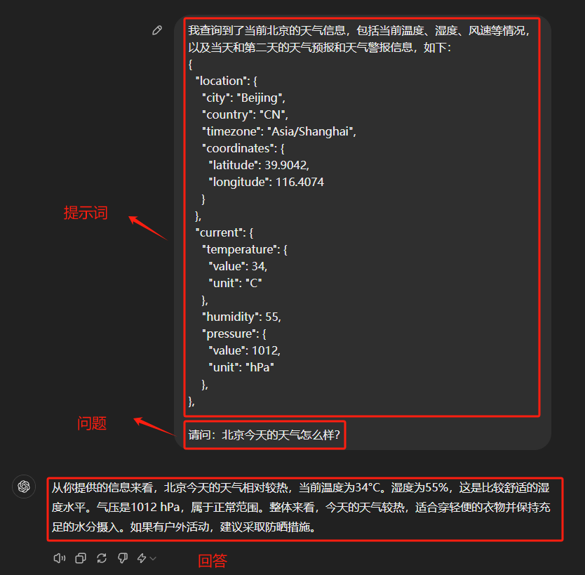

  当提出问题后，大模型能够以自然语言返回响应，这是生成式人工智能的一大优点。有些任务确实可以通过这种提示工程的方式引导大模型在对话过程中生成正确的回复，但这个过程最大的问题就是需要人工介入，正如上面的例子中涉及到的北京的天气信息：

```json
{
  "location": {
    "city": "Beijing",
    "country": "CN",
    "timezone": "Asia/Shanghai",
    "coordinates": {
      "latitude": 39.9042,
      "longitude": 116.4074
    }
  },
  "current": {
    "temperature": {
      "value": 34,
      "unit": "C"
    },
    "humidity": 55,
    "pressure": {
      "value": 1012,
      "u "024-08-28T05:45:00+08:00",
    "sunset": "2024-08-28T19:18:00+08:00"
  }
}
```

  对于试图将大模型的响应与其他应用程序连接起来的开发人员来说，这就是一场噩梦。开发人员通常使用正则表达式 (Regex) 或提示工程将输出转换为所需的格式，然后才能将其传递到另一个应用程序，也就是说，这个过程中如果不需要人工介入，还想让它自动拿到这些信息，怎么做？

  搞过开发的小伙伴对这种JSON数据应该非常熟悉，我们可以调用某个天气平台的API，比如 👉 [OpenWeather](https://openweathermap.org/)，输入一个城市的关键词， 就能得到该城市当前的天气信息数据，也就是如上所示的JSON形式，那么这样的信息，如何让大模型自动解析，就进入到了我们探索大模型应用的第二个阶段 - **函数调用**。

* **Stage 2：函数调用**

  2023 年 7 月，OpenAI 为其 GPT 模型引入了函数调用功能。大模型发展到现在，所有热门的大模型均已不同的形式让自己具备函数调用能力。通过函数调用，我们可以提供一个用户定义的 JSON 字符串，其中包含**希望从大模型获取的响应结构**，以及**想要向大模型提出的问题**。如下图所示，我们从概念上展示了其工作原理：

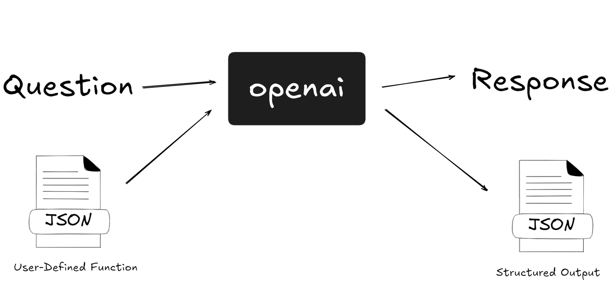

  这里指的**可以调用的函数**，我们通常称之为 **工具** ，在这个阶段，我们要做的是描述该工具是用来做什么的，然后让大模型智能地选择输出包含调用这些函数的参数的 JSON 对象。简而言之，它允许：

* 自主决策：大模型可以智能地选择工具来回答问题。

* 可靠的解析：响应采用 JSON 格式，而不是更典型的类似对话的响应。

  乍一看似乎没什么，但这就是大模型能够连接到外部系统的原因，比如通过具有结构化输入的API，本地的数据库，自己编写的Python代码函数等等。有了这个功能，大模型在应用方面就开启了无限的可能性。比如：

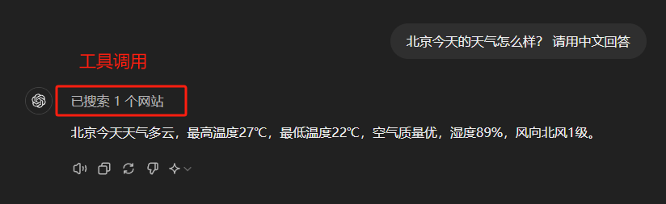

  当大模型被赋予函数调用的能力时，它会在每次回答问题之前先检查可以调用哪些工具，并评估用户的问题是否需要调用这些工具。如果需要，它便会调用相应的工具，并根据工具返回的结果来构筑答案。这整个过程都是大模型根据其自主判断的。所以在提升这一，阶段不仅极大地扩展了大模型的应用范围，还在一定程度上解决了知识库更新不及时、无法获取实时信息及其带来的优势。

  但是，在函数调用技术阶段趋于成熟的同时，我们仍然发现了另一个非常大的问题：大模型幻觉 👇

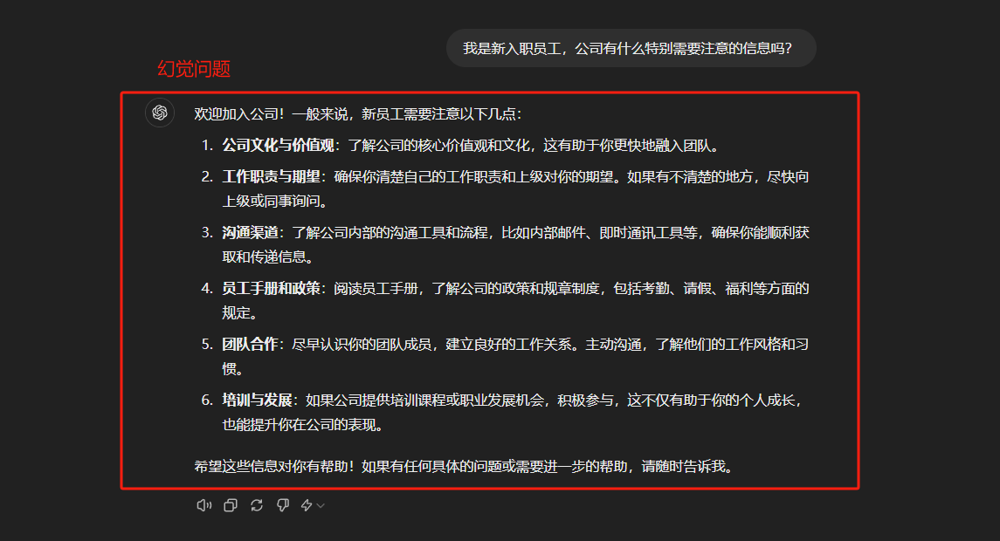

  大模型直到现在依然普遍存在一个问题：当面对自己不了解的问题时，它们有时会产生不准确甚至荒谬的回答，这就是所谓的**大模型幻觉问题**。以上图中的例子为例，当大模型被询问关于公司制度的问题时，在没有任何技术手段介入的情况下，理想的回答应该是“我不知道”或“请提供一下你所入职公司的具体制度”等回答，而我们看到的却是大模型错误地从一个HR的角度进行了回复，这就会给用户带来混淆和误导。

  在`Stage 1：提示工程`中我们提到，大模型可以基于`in-context learning`的提示思想，利用提供的背景信息来回答特定问题，直接引发了第一轮大模型应用落地的热潮，主要集中在**本地知识库问答领域**。因为无论是个人还是企业，都希望大模型能够根据其私有数据——如个人学习资料或公司规章制度等让大模型准确高效地回答问题，充当智能客服、智能助理这样的角色。然而，一个显著的挑战是数据量可能极大，从单个文件到数千G的文件系统不等，而大模型在对话处理上存在输入长度限制，无法将所有数据作为背景信息直接处理。

  因此，面对本地知识库问答的挑战，并考虑到大模型的幻觉问题和长度限制问题，出现的解决方案就是：RAG（Retrieval-Augmented Generation），以此进入到了大模型应用的第三个阶段。

* **Stage 3. Retrieval-Augmented Generation**

  通过人们不断地对大模型领域的探索，非常多的实验论文能够证明，当为大模型提供一定的上下文信息后，其输出会变得更稳定。那么，将知识库中的信息或掌握的信息先输送给大模型，再由大模型服务用户，就是大家普遍达成共识的一个结论和方法。传统的对话系统、搜索引擎等核心依赖于检索技术，如果将这一检索过程融入大模型应用的构建中，既可以充分利用大模型在内容生成上的能力，也能通过引入的上下文信息显著约束大模型的输出范围和结果，同时还实现了将私有数据融入大模型中的目的，达到了双赢的效果。

  所以我们才看到RAG的实现是包括两个阶段的：检索阶段和生成阶段。在检索阶段，从知识库中找出与问题最相关的知识，为后续的答案生成提供素材。在生成阶段，RAG会将检索到的知识内容作为输入，与问题一起输入到语言模型中进行生成。这样，生成的答案不仅考虑了问题的语义信息，还考虑了相关私有数据的内容。比如我们《RAG企业级项目实战课》中实现的RAG流程 👇

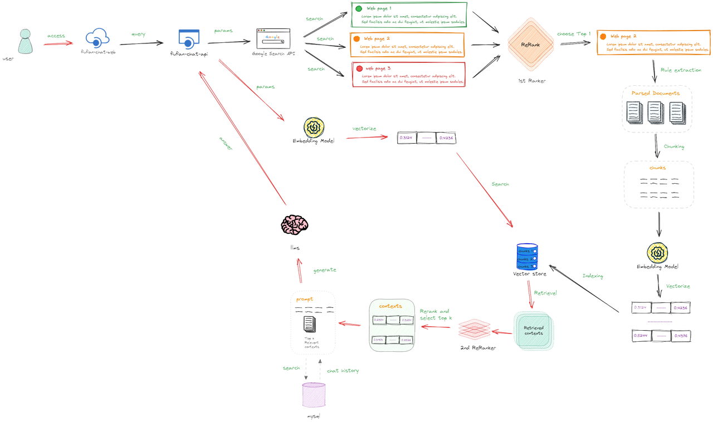

  RAG技术解决的两个关键的问题是：

1. 如果用户提出的问题，其对应的答案出现在一篇文章中，去知识库中找到一篇与用户输入相关的文章是很容易的，但是我们将检索到的这整篇文章直接放入`Prompt`中并不是最优的选择，因为其中一定会包含非常多无关的信息，而无效信息越多，对大模型后续的推理影响越大。

2. 任何一个大模型都存在最大输入的Token限制，一个流程中可能涉及多次检索，每次检索都会产生相应的上下文，无法容纳如此多的信息。

  但事实上，如上面的流程图所示，大模型在整个RAG架构中占据的比例实际上非常小。我们主要依赖大模型结合背景信息进行推理的能力。在RAG的多个优化阶段中，检索策略的作用更为重要。此外，RAG的实际应用场景相对有限，无论是哪种形式的问答系统，都还未能达到我们所期望的通用人工智能（AGI）的水平。因此，**现阶段进入到了`AI Agent`的全面爆发，这项技术直接体现的是我们正在向期望的更复杂、更全面的技术方向发展。**

* **Stage 4. AI Agent**

  我们现阶段做到的人工智能和通用人工智能之间存在根本区别。像`ChatGPT`这样的应用虽然掀起了新一轮的热潮，但本质上是它们也只是在做“预测”，通过大量数据的训练以达到生成准确响应的目的，但缺乏目标、身份或主动决策的概念。所以它们也只是复杂的文本生成器，没有目的或方向感。我们还没有完全做到AGI，因为现有的每个人工智能模型都只是模仿人类智能的某个方面。例如，大语言模型非常擅长理解和撰写文本，它们的能力常常超越人类在这些领域的表现。然而，当涉及到简单的算术任务时，LLMs就会经常出现问题。

  那么**让大模型能够自己解决更复杂的问题，现阶段提出的解决方案就是：AI Agent。**

  **早在2023年中旬，OpenAI 作为在大模型整个行业的技术领航者，很早就推出了 GPT Plugins 商店**，就是在借助大模型的力量，希望打造一个类似APP Store的生态系统，让每个人都能以极低的门槛创建自己的智能应用，无论是供个人使用还是为他人服务。然而，直到现在，GPT Plugins并未实现其初衷，使用率也未达预期。主要原因在于，如果把强化学习的一套方案移植到大模型，这种做法似乎并未产生立竿见影的效果。这直接导致了GPT Plugins虽然能开发智能应用，但这些应用还远未能满足我们对复杂度和功能性的高要求，也未能达到我们对人工智能应用预期的高度。同时，我会认为2023年的大模型，自身能力不足也是造成这种现状的根本原因。

  人类具有非凡的能力，能够不断吸收信息、做出决定、采取行动、观察变化，然后做出下一个决定。我们的整个生活是一个永无休止的观察、思想和行动的链条。通过将复杂的问题分解为更小的、可管理的部分，并不断地借鉴前几代人的知识，我们人类已经取得了长足的进步。**通用人工智能的最终形态就是：我们能够转移这个概念到大模型上，使其不断做出新的决策，从而逐步接近更复杂问题的解决方案。**

  至此，也就衍生出了 AI Agent （人工智能代理）的基本概念：\*\*一个感知环境、处理信息并采取行动以实现特定目标的软件程序或系统。\*\*现阶段我们会把单一的大模型作为AI Agent 的核心，而不是全部。它应该是一个超级好的大语言模型，能够解释问题、观察环境并据此做出决策。如果在AI Agent 构建流程中添加一些将语音转换为文本的模型、解释图像内容的模型，就可以构建自己的 `Jarvis` 所需的一切。（复仇者联盟电影中钢铁侠的私人虚拟助理）

  一个感官性的认知如下图所示：


  人工智能代理的特点是其主动性和决策能力。与被动工具不同，它们主动参与环境，做出选择并采取行动来实现其指定目标。在企业环境中，人工智能代理通过自动化日常任务和分析复杂数据来提高效率，从而使员工能够专注于战略和创造性工作。这些代理补充而不是取代人类的努力，促进提高劳动力的生产力和效率。

# 2. BiliAgent项目介绍

  `BiliAgent`项目是我们公司内部使用的 `Bilibili` 数据分析工具。在本次体验课中，我们将展示一部分核心功能向大家介绍 `AI Agent` 在实时数据分析场景中的应用和有效落地策略。在三天的体验课中，我们会带领大家完成一个端到端的项目，具体场景为：基于大模型构建一个复杂的 `AI Agent` 应用工具，该应用工具在网页端接收用户输入，后端实时调用 `Bilibili API`，可以依据用户的输入的问题需求去查询实时数据，得到结果后，自主执行数据分析过程，最终生成精准的回复或数据分析报告，通过前端返回给用户。其应用逻辑流程图如下所示：👇

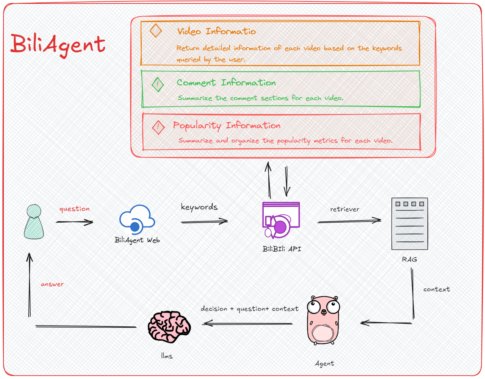

  例如，大家可以在应用中提出以下需求：

* 我正在学习 `Chat GLM3` 模型的部署，请查找当前哪些相关视频的好评最多，返回当前视频的链接及你推荐的理由

* 我准备发布一个 `Swarm` 技术相关的视频，请根据当前热门视频的标题和描述，生成一个热门标题，帮助我提升关注度

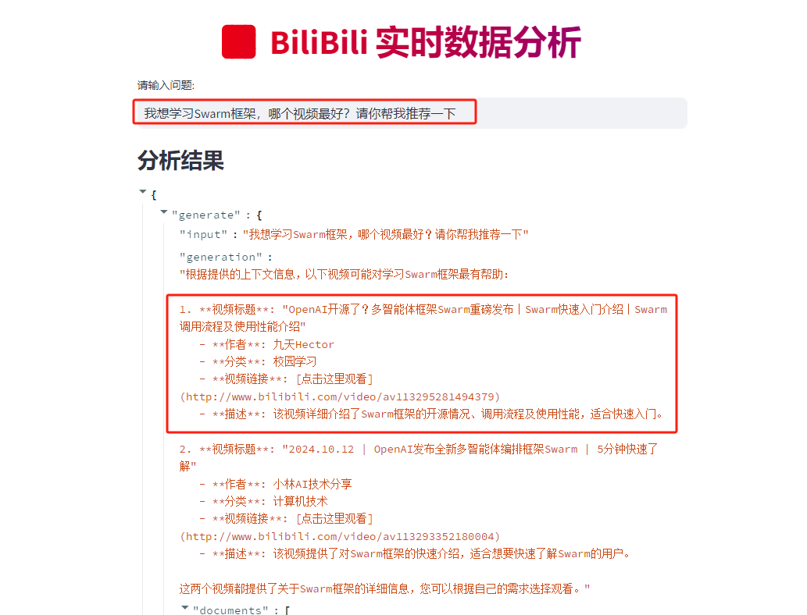

  在项目架构方面，本项目是一个端到端的服务，采用前后端分离架构。后端结合 `LangServe` 和 `FastAPI` 技术，利用 `LangServe` 的 `add_routes` 接口，将 `LangChain` 应用中的链和 `RAG`服务 封装成 `REST API`，具备高并发请求、流式传输和异步操作的能力。前端界面由 `Streamlit` 构建，主要聚焦于简洁的用户交互而非复杂的视觉表现。在技术应用方面，核心的 `AI Agent` 框架由 `LangGraph` 提供支持，基础的模型调用则通过 `LangChain` 实现，支持目前国内外最热门的 GPT 系列（国外）和 GLM4 模型（国内）。


  除此之外，因为每次检索到的内容很多，很多内容会和用户的问题不太相关，作为数据分析项目，需要的是较高的精准度，所以这里我们接入了`RAG`技术去在大量内容中检索到最相关的，以提升数据的质量，并且使用了多段的问答优化策略，整体架构如下图所示：

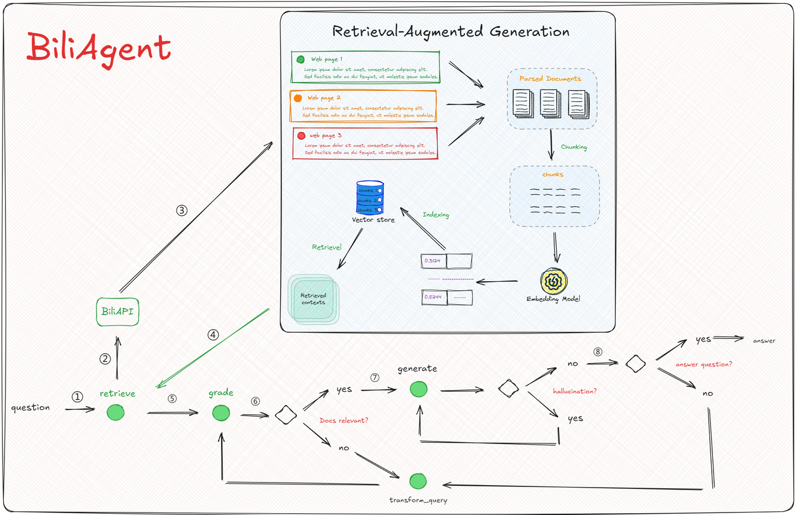

  整体项目通过`LangGraph`构建`AI Agent` 的规范，将所有实现的功能完整的整合成一个自主执行、且具备精准决策的业务链，实现`BiliAgent`用于数据分析场景的最终落地形态。

  以上是我们为期三天体验营的 `BiliAgent` 项目详细介绍。接下来，我们将深入探讨代码细节和工程化开发，逐一实践和讲解各个功能。对于初学者也无需担心，我会详细解释每个步骤的构建方法和原理，确保大家在顺利完成项目的同时，也能掌握关于大模型应用开发的核心知识和流行框架的使用。

  接下来，我们切换至`PyCharm`编程环境，正式开始这个项目的开发和学习！

***

* 🍻现开设了**大模型学习交流群**，扫描下👇码，来遇见更多志同道合的小伙伴\~


海量硬核独家技&#x672F;**`干货内容`**+无门&#x69DB;**`技术交流`+不定期开设`硬核干货&前沿技术公开课`，扫码**👆即刻入群！

